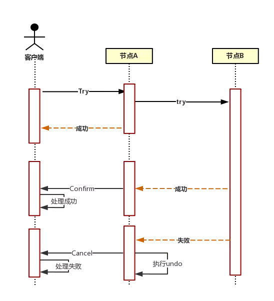
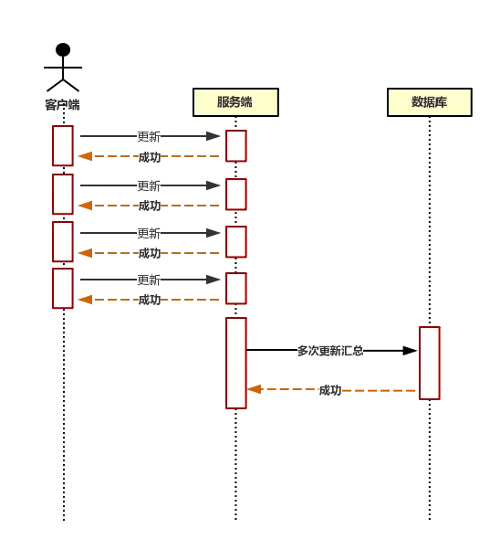
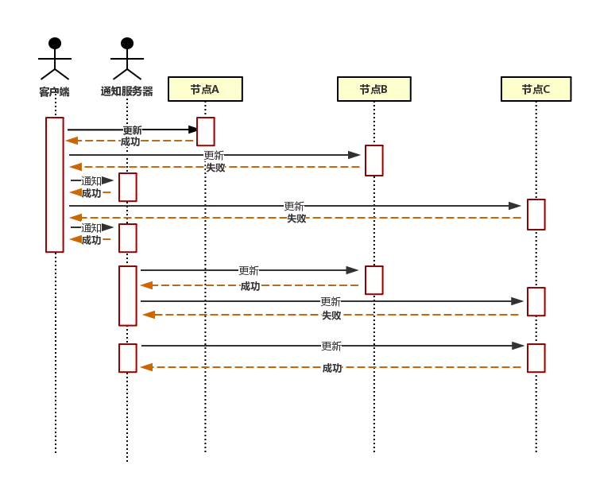

# 1.概述

学习要从一个装逼的名词开始，唤起大家的好奇心：柔性事务。 而与柔性事务相对的，无疑就是刚性事务。

1. 刚性事务：遵循ACID原则，强一致性。
2. 柔性事务：遵循BASE理论，最终一致性；与刚性事务不同，柔性事务允许一定时间内，不同节点的数据不一致，但要求最终一致。

# 2.刚性事务的理论基础-ACID原则

刚性事务最常见的就是数据库事务，强一致性的典型例子。

## 2.1.原子性（Atomicity）

整个事务中的所有操作，要么全部完成，要么全部不完成，不可能停滞在中间某个环节。事务在执行过程中发生错误，会被回滚到事务开始前的状态，就像这个事务从来没有执行过一样。

## 2.2.一致性（Consistency）

一个事务可以封装状态改变（除非它是一个只读的）。事务必须保证系统始终处于一致的状态，不管在任何给定的时间里，并发事务有多少。

也就是说：如果事务是并发多个，系统也必须如同串行事务一样操作。其主要特征是保护性和不变性，以转账案例为例，假设有五个账户，每个账户余额是100元，那么五个账户总额是500元，如果在这个5个账户之间同时发生多个转账，无论并发多少个，比如在A与B账户之间转账5元，在C与D账户之间转账10元，在B与E之间转账15元，五个账户总额也应该还是500元，这就是保护性和不变性。

## 2.3.隔离性（Isolation）

在并发环境中，并发的事务是相互隔离的，一个事务的执行不能被其他事务干扰。
 也就是说，不同的事务并发操纵相同的数据时，每个事务都有各自完整的数据空间，即一个事务内部的操作及使用的数据对其他并发事务是隔离的，并发执行的各个事务之间不能互相干扰。

在标准SQL规范中，定义了4个事务隔离级别，不同的隔离级别对事务的处理不同。

- 未授权读取
- 授权读取
- 可重复读取
- 串行化

## 2.4.持久性（Durability）

在事务完成以后，该事务对数据所作的更改便持久的保存，并不会被回滚。

# 3.刚性事务的实现方案

由于一项操作通常会包含许多子操作，而这些子操作可能会因为硬件的损坏或其他因素产生问题，要正确实现ACID并不容易。ACID建议数据库将所有需要更新以及修改的资料一次操作完毕，但实际上并不可行。

## 3.1.WAL（Write ahead logging）

Write ahead logging，也就是日志式的方式（现代数据库均基于这种方式）。
 WAL的中心思想是对**数据文件的修改（它们是表和索引的载体）必须是只能发生在这些修改已经记录了日志之后**。
 也就是说，在日志记录冲刷到永久存储器之后，如果我们遵循这个过程，那么我们就不需要在每次事务提交的时候都把数据页冲刷到磁盘，因为我们知道**在出现崩溃的情况下， 我们可以用日志来恢复数据库**。
 任何尚未附加到数据页的记录都将先从日志记录中重做（这叫向前滚动恢复，也叫做REDO），然后那些未提交的事务做的修改将被从数据页中删除 （这叫向后滚动恢复，UNDO）。

## 3.2.影子分页（Shadow paging）

每个page只在日志文件中存一份，无论这个页被修改过多少次。日志文件中，只记录事务开始前page的原始信息，进行恢复时，只需要利用日志文件中的page进行覆盖即可。对于新生成的页，日志中不会记录，而是在日志头记录事务开始时数据文件page的数目，进行恢复时，只需要截断数据文件即可，不需要新页的数据，况且新页本来就没有任何数据。
 相对于WAL技术，shadow paging技术实现起来比较简单，消除了写日志记录的开销，恢复的速度也快（不需要redo和undo）。
 shadow paging的缺点就是事务提交时要输出多个块，这使得提交的开销很大，而且以块为单位，很难应用到允许多个事务并发执行的情况——这是它致命的缺点。

## 3.3.两阶段型

即分布式事务两阶段提交，对应技术上的XA、JTA/JTS。
 算法思路：参与者将操作成败通知协调者，再由协调者根据所有参与者的反馈情报决定各参与者是否要提交操作还是中止操作。

> XA是一个规范、协议，它只是定义了一系列的接口，只是目前大多数实现XA的都是数据库或者MQ，所以提起XA往往多指基于资源层的底层分布式事务解决方案。其实现在也有些数据分片框架或者中间件也支持XA协议，毕竟它的兼容性、普遍性更好。
> XA的本质实际上就是 2PC

### 3.3.1.准备阶段

1. 协调者节点向所有参与者节点询问是否可以执行提交操作，并开始等待各参与者节点的响应。
2. 参与者节点执行询问发起为止的所有事务操作，并将undo信息和redo信息写入日志。（若成功，其实当前每个参与者已经执行了事务操作）
3. 各参与者节点响应协调者节点发起的询问。如果参与者节点的事务操作实际执行成功，则它返回一个“同意”消息；如果参与者节点的事务实际执行失败，则它返回一个“中止”消息。

### 3.3.2.提交阶段

如果协调者收到了参与者的失败消息或者超时，直接给每个参与者发送回滚消息；否则，发送提交消息；
 参与者根据协调者的指令执行提交或者回滚操作，释放所有事务处理过程中使用的锁资源。（必须在最后阶段释放锁资源）

#### 3.3.2.1.提交

1. 协调者节点向所有参与者节点发出提交请求。
2. 参与者节点正式完成操作，并释放在整个事务期间内占用的资源。
3. 参与者节点向协调者节点发送提交完成消息。
4. 协调者节点受到所有参与者节点反馈的提交完成消息后，完成事务。

#### 3.3.2.2.回滚

1. 协调者节点向所有参与者节点发出回滚请求。
2. 参与者节点利用之前写入的undo信息执行回滚，并释放在整个事务期间内占用的资源。
3. 参与者节点向协调者发送回滚完成消息。
4. 协调者节点收到所有参与者节点反馈的回滚完成消息后，取消事务。

### 3.3.3.缺陷

1. **同步阻塞问题**：执行过程中，所有参与节点都是事务阻塞型的。当参与者占有公共资源时，其他第三方节点访问公共资源不得不处于阻塞状态。
2. **单点故障**：由于协调者的重要性，一旦协调者发生故障，参与者会一直阻塞下去。尤其在第二阶段，协调者发生故障，那么所有的参与者还都处于锁定事务资源的状态中，而无法继续完成事务操作。（如果是协调者挂掉，可以重新选举一个协调者，但是无法解决因为协调者宕机导致的参与者处于阻塞状态的问题）
3. **数据不一致**：在二阶段提交的阶段二中，当协调者向参与者发送提交请求之后，发生了局部网络异常或者在发送提交请求过程中协调者发生了故障，这会导致只有一部分参与者接受到了提交请求。而在这部分参与者接到提交请求之后就会执行提交操作。但是其他部分未接到提交请求的机器则无法执行事务提交。于是整个分布式系统便出现了数据不一致性的现象。
4. **协调者在发出提交消息之后宕机，而唯一接收到这条消息的参与者同时也宕机了。那么即使协调者通过选举协议产生了新的协调者，这条事务的状态也是不确定的，没人知道事务是否已经提交。**

# 4.分布式事务的理论基础-CAP理论

一个分布式系统不可能同时满足一致性（Consistency）、可用性（Availability）和分区容错性（Partition tolerance）这三个基本需求，最多只能同时满足其中两项。

## 4.1.一致性（Consistency）

在分布式环境中，一致性是指数据在多个副本之间是否能够保持一致的特性。在一致性的要求下，当一个系统在数据一致的状态下执行更新操作后，应该保证系统的数据仍然处于一致的状态。
 对于一个将数据副本分布在不同分布式节点上的系统来说，如果对第一个节点的数据进行了更新操作并且更新成功后，却没有使得第二个节点上的数据得到相应的更新，于是在对第二个节点的数据进行读取操作时，获取的仍然是老数据（脏数据），这就是典型的分布式数据不一致情况。在分布式系统中，如果能够做到针对一个数据项的更新操作执行成功后，所有的用户都可以读取到其最新的值，即满足强一致性。

## 4.2.可用性（Availability）

可用性是指系统提供的服务必须一直处于可用的状态，对于用户的每一个操作请求总是能够在有限的时间内返回结果。

## 4.3.分区容错性（Partition tolerance）

分区容错性约束了一个分布式系统需要具有如下特性：分布式系统在遇到任何网络分区故障的时候，仍然需要能够保证对外提供满足一致性和可用性的服务，除非是整个网络环境都发生了故障。

## 4.4.CAP应用

|                     | 说明                                                         |
| ------------------- | ------------------------------------------------------------ |
| 放弃一致性（C）     | 这里所说的放弃C，并不是完全不需要数据一致性，如果真这样，那么系统的数据也没意义，系统也就没价值。放弃C指放弃数据的强一致性，而保留数据的最终一致性。这样的系统无法保证数据保持实时的一致性，但是能够承诺的是，数据最终会达到一个一致的状态。这就引入了一个时间窗口的概念，具体多久能够达到数据一致取决于系统的设计，主要包括数据副本在不同节点之间的复制时间长短。 |
| 放弃可用性（A）     | 相对于放弃P来说，放弃A正好相反，其做法是一旦系统遇到网络分区或其他故障时，那么受到影响的服务需要等待一定的时间，因此在等待期间系统无法对外提供正常的服务，即不可用。 |
| 放弃分区容错性（P） | 如果希望能够避免系统出现分区容错性问题，一种较为简单的做法是将所有的数据（或者仅仅是与事务相关的数据）都放在一个分布式节点上。这样的做法虽然无法100%地保证系统不会出错，但至少不会碰到由于网络分区带来的负面影响。但同时需要注意的是，放弃P的同时也就意味着放弃了系统的可拓展性。 |

# 5.柔性事务的理论基础-BASE理论

BASE是对CAP中一致性和可用性权衡的结果，其核心思想是即使无法做到强一致性，但每个应用都可以根据自身的业务特点，采用适当的方法来使系统达到最终一致性。

>严格的ACID事务对隔离性的要求很高，在事务执行中必须将所有的资源锁定， 对于长事务来说，整个事务期间对数据的独占，将严重影响系统并发性能。因此，在高并发场景中，对ACID的部分特性进行放松从而提高性能，这便产生了BASE柔性事务。柔性事务的理念则是通过业务逻辑将互斥锁操作从资源层面上移至业务层面。通过放宽对强一致性要求，来换取系统吞吐量的提升。另外提供自动的异常恢复机制，可以在发生异常后也能确保事务的最终一致。

## 5.1.基本可用（Basically Available）

基本可用是指分布式系统在出现不可预知故障的时候，允许损失部分可用性

- 响应时间上的损失：正常情况下，一个在线搜索引擎需要在0.5秒之内返回给用户相应的查询结果，但由于出现故障，查询结果的响应时间增加到了1-2秒。
- 功能上的损失：在一个电子商务网站上进行购物，消费者几乎能够顺利完成每一笔订单，但是在一些节日大促购物高峰的时候，由于消费者的购物行为激增，为了保护购物系统的稳定性，部分消费者可能会被引导到一个降级页面。

## 5.2.软状态（Soft state）

软状态，和硬状态相对，是指允许系统中的数据存在中间状态，并认为该中间状态的存在不会影响系统的整体可用性，即允许系统在不同节点的数据副本之间进行数据同步的过程存在延时。

## 5.3.最终一致性（Eventually consistent）

最终一致性强调的是系统中所有的数据副本，在经过一段时间的同步后，最终能够达到一个一致的状态。因此，最终一致性的本质是需要系统保证最终数据能够达到一致，而不需要实时保证系统数据的强一致性。

| **最终一致性的变种** |                                                              |
| -------------------- | ------------------------------------------------------------ |
| 因果一致性           | 如果进程A在更新完某个数据项后通知了进程B，那么进程B之后对该数据项的访问都应该能够获取到进程A更新后的最新值，并且如果进程B要对该数据项进行更新操作的话，务必基于进程A更新后的最新值，即不能发生丢失更新情况。与此同时，与进程A无因果关系的进程C的数据访问则没有这样的限制。 |
| 读己之所写           | 进程A更新一个数据项之后，它自己总是能够访问到更新后的最新值，而不会看到旧值。也就是说，对于单个数据获取者来说，其读取到的数据，一定不会比自己上次写入的值旧。 |
| 会话一致性           | 对系统数据的访问过程框定在了一个会话当中，系统能够保证在同一个有效的会话中实现“读己之所写”的一致性，也就是说，执行更新操作之后，客户端能够在同一个会话中始终读取到该数据项的最新值。 |
| 单调读一致性         | 如果一个进程从系统中读取出一个数据项的某个值后，那么系统对于该进程后续的任何数据访问都不应该返回更旧的值。 |
| 单调写一致性         | 一个系统需要能够保证来自同一个进程的写操作被顺序地执行。     |

# 6.柔性事务的实现

## 6.1.补偿型

TCC（Try/Confirm/Cancel）型事务。
 在一个长事务中，一个由两台服务器一起参与的事务，服务器A发起事务，服务器B参与事务，B的事务需要人工参与，所以处理时间可能很长。如果按照ACID的原则，要保持事务的隔离性、一致性，服务器A中发起的事务中使用到的事务资源将会被锁定，不允许其他应用访问到事务过程中的中间结果，直到整个事务被提交或者回滚。这就造成事务A中的资源被长时间锁定，系统的可用性将不可接受。
 WS-BusinessActivity提供了一种基于补偿的long-running的事务处理模型。还是上面的例子，服务器A的事务如果执行顺利，那么事务A就先行提交，如果事务B也执行顺利，则事务B也提交，整个事务就算完成。但是如果事务B执行失败，事务B本身回滚，这时事务A已经被提交，所以需要执行一个补偿操作，将已经提交的事务A执行的操作作反操作，恢复到未执行前事务A的状态。这样的SAGA事务模型，是牺牲了一定的隔离性和一致性的，但是提高了long-running事务的可用性。

## 6.2.异步确保型

将一些同步阻塞的事务操作变为异步的操作，避免对数据库事务的争用。比如热点资源的批量更新、异步更新的处理。

## 6.3.最大努力型

通过通知服务器（消息通知）进行，允许失败，有补偿机制（或重发机制）。

# 7.总结

本地事务：一个完整的事务操作可以在同一物理介质（例如：内存）上同时完成；
 分布式事务：一个完整事务需要跨物理介质或跨物理节点（网络通讯）；
 在分布式事务的定义里，无疑排它锁、共享锁等等就没有用武之地了，无法保证原子性完成事务。为了能够达到原子性的效果，二阶段提交提出了协调者角色，协调者拥有数据读取写入的唯一性。但同时带来了严重的同步阻塞问题，且如果协调者释放读取的能力，则无法保证原子性。
 实际在分布式事务的发展过程中，刚性事务只在副本存储等局限场景中使用，柔性事务无疑是主要角色，甚至一般讲分布式事务，就是在讲柔性事务。
 在柔性事务中，最重要的无疑是如何实现数据的最终一致性，在之后会另起一章，介绍主流的数据一致性算法，尤其是带有传奇色彩的经典算法-Paxos。

如果对柔性事务与数据一致性算法有更多的兴趣，可以了解一下Basic Paxos、Multi Paxos、Raft（ETCD的方案）、ZAB（Zookeeper的方案）、Gossip（Cassandra的方案）。

# 相关文档

[https://wenku.baidu.com/view/d1bbd25877232f60ddcca1d9.html](https://link.jianshu.com?t=https%3A%2F%2Fwenku.baidu.com%2Fview%2Fd1bbd25877232f60ddcca1d9.html)

[https://wenku.baidu.com/view/be946bec0975f46527d3e104.html](https://link.jianshu.com?t=https%3A%2F%2Fwenku.baidu.com%2Fview%2Fbe946bec0975f46527d3e104.html)

[https://baike.baidu.com/item/acid/10738?fr=aladdin](https://link.jianshu.com?t=https%3A%2F%2Fbaike.baidu.com%2Fitem%2Facid%2F10738%3Ffr%3Daladdin)

《从Paxos到ZooKeeper：分布式一致性原理与实践》

[https://www.cnblogs.com/netfocus/p/3149156.html](https://link.jianshu.com?t=https%3A%2F%2Fwww.cnblogs.com%2Fnetfocus%2Fp%2F3149156.html)

[http://antirez.com/news/101](https://link.jianshu.com?t=http%3A%2F%2Fantirez.com%2Fnews%2F101)

[http://martin.kleppmann.com/2016/02/08/how-to-do-distributed-locking.html](https://link.jianshu.com?t=http%3A%2F%2Fmartin.kleppmann.com%2F2016%2F02%2F08%2Fhow-to-do-distributed-locking.html)