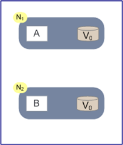
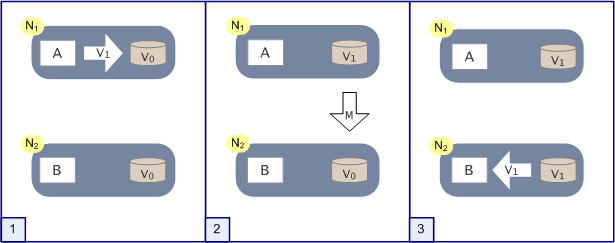

分布式领域CAP理论告诉我们，任何一个分布式系统都无法同时满足Consistency(一致性)、Availability(可用性)、Partition tolerance(分区容错性) 这三个基本需求。最多只能满足其中两项。 但是，一个分布式系统无论在CAP三者之间如何权衡，都无法彻底放弃一致性（Consistency），如果真的放弃一致性，那么就说明这个系统中的数据根本不可信，数据也就没有意义，那么这个系统也就没有任何价值可言。所以，无论如何，分布式系统的一致性问题都需要重点关注。

# CAP的定义

**Consistency 一致性**

一致性指“**all nodes see the same data at the same time**”，即更新操作成功并返回客户端完成后，所有节点在同一时间的数据完全一致。

对于一致性，可以分为从客户端和服务端两个不同的视角。从客户端来看，一致性主要指的是多并发访问时更新过的数据如何获取的问题。从服务端来看，则是更新如何复制分布到整个系统，以保证数据最终一致。一致性是因为有并发读写才有的问题，因此在理解一致性的问题时，一定要注意结合考虑并发读写的场景。

从客户端角度，多进程并发访问时，更新过的数据在不同进程如何获取的不同策略，决定了不同的一致性。对于关系型数据库，要求更新过的数据能被后续的访问都能看到，这是强一致性。如果能容忍后续的部分或者全部访问不到，则是弱一致性(弱一致性可以理解为，系统数据可以不一致，一般少有这种情况)。如果经过一段时间后要求能访问到更新后的数据，则是最终一致性。

**Availability 可用性**

可用性指“**Reads and writes always succeed**”，即服务一直可用，而且是正常响应时间。

对于一个可用性的分布式系统，每一个非故障的节点必须对每一个请求作出响应。也就是，该系统使用的任何算法必须最终终止。当同时要求分区容忍性时，这是一个很强的定义：即使是严重的网络错误，每个请求必须终止。

好的可用性主要是指系统能够很好的为用户服务，不出现用户操作失败或者访问超时等用户体验不好的情况。可用性通常情况下可用性和分布式数据冗余，负载均衡等有着很大的关联。

**Partition Tolerance分区容错性**

分区容错性指“**the system continues to operate despite arbitrary message loss or failure of part of the system**”，即分布式系统在遇到某节点或网络分区故障的时候，仍然能够对外提供满足一致性和可用性的服务。

分区容错性和扩展性紧密相关。在分布式应用中，可能因为一些分布式的原因导致系统无法正常运转。好的分区容错性要求能够使应用虽然是一个分布式系统，而看上去却好像是在一个可以运转正常的整体。比如现在的分布式系统中有某一个或者几个机器宕掉了，其他剩下的机器还能够正常运转满足系统需求，或者是机器之间有网络异常，将分布式系统分隔未独立的几个部分，各个部分还能维持分布式系统的运作，这样就具有好的分区容错性。

# CAP的证明

如上图，是我们证明CAP的基本场景，网络中有两个节点N1和N2，可以简单的理解N1和N2分别是两台计算机，他们之间网络可以连通，N1中有一个应用程序A，和一个数据库V，N2也有一个应用程序B2和一个数据库V。现在，A和B是分布式系统的两个部分，V是分布式系统的数据存储的两个子数据库。

在满足一致性的时候，N1和N2中的数据是一样的，V0=V0。在满足可用性的时候，用户不管是请求N1或者N2，都会得到立即响应。在满足分区容错性的情况下，N1和N2有任何一方宕机，或者网络不通的时候，都不会影响N1和N2彼此之间的正常运作。

如上图，是分布式系统正常运转的流程，用户向N1机器请求数据更新，程序A更新数据库Vo为V1，分布式系统将数据进行同步操作M，将V1同步的N2中V0，使得N2中的数据V0也更新为V1，N2中的数据再响应N2的请求。

这里，可以定义N1和N2的数据库V之间的数据是否一样为**一致性**；外部对N1和N2的请求响应为**可用性**；N1和N2之间的网络环境为分区容错性。这是正常运作的场景，也是理想的场景，然而现实是残酷的，当错误发生的时候，一致性和可用性还有分区容错性，是否能同时满足，还是说要进行取舍呢？

作为一个分布式系统，它和单机系统的最大区别，就在于网络，现在假设一种极端情况，N1和N2之间的网络断开了，我们要支持这种网络异常，相当于要满足分区容错性，能不能同时满足一致性和响应性呢？还是说要对他们进行取舍。

假设在N1和N2之间网络断开的时候，有用户向N1发送数据更新请求，那N1中的数据V0将被更新为V1，由于网络是断开的，所以分布式系统同步操作M，所以N2中的数据依旧是V0；这个时候，有用户向N2发送数据读取请求，由于数据还没有进行同步，应用程序没办法立即给用户返回最新的数据V1，怎么办呢？有二种选择，第一，牺牲数据一致性，响应旧的数据V0给用户；第二，牺牲可用性，阻塞等待，直到网络连接恢复，数据更新操作M完成之后，再给用户响应最新的数据V1。

这个过程，证明了要满足分区容错性的分布式系统，只能在一致性和可用性两者中，选择其中一个。

 

# CAP权衡

通过CAP理论，我们知道无法同时满足一致性、可用性和分区容错性这三个特性，那要舍弃哪个呢？

CA without P：如果不要求P（不允许分区），则C（强一致性）和A（可用性）是可以保证的。但其实分区不是你想不想的问题，而是始终会存在，因此CA的系统更多的是允许分区后各子系统依然保持CA。

**CP without A：如果不要求A（可用），相当于每个请求都需要在Server之间强一致，而P（分区）会导致同步时间无限延长，如此CP也是可以保证的。很多传统的数据库分布式事务都属于这种模式**。

AP wihtout C：要高可用并允许分区，则需放弃一致性。一旦分区发生，节点之间可能会失去联系，为了高可用，每个节点只能用本地数据提供服务，而这样会导致全局数据的不一致性。现在众多的NoSQL都属于此类。

对于多数大型互联网应用的场景，主机众多、部署分散，而且现在的集群规模越来越大，所以节点故障、网络故障是常态，而且要保证服务可用性达到N个，即保证P和A，舍弃C（退而求其次保证最终一致性）。虽然某些地方会影响客户体验，但没达到造成用户流程的严重程度。

对于涉及到钱财这样不能有一丝让步的场景，C必须保证。网络发生故障宁可停止服务，这是保证CA，舍弃P。貌似这几年国内银行业发生了不下10起事故，但影响面不大，报到也不多，广大群众知道的少。还有一种是保证CP，舍弃A。例如网络故障事只读不写。

孰优孰略，没有定论，只能根据场景定夺，适合的才是最好的。

这里先简单提一下，由于一个分布式系统不可能放弃一致性，那么为什么有的架构师还说在某些场景中可以牺牲一致性呢？通常这里说的放弃一致性指的是放弃数据的强一致性。

# 数据一致性

数据一致性其实是数据库系统中的概念。我们可以简单的把一致性理解为正确性或者完整性，那么数据一致性通常指关联数据之间的逻辑关系是否正确和完整。我们知道，在数据库系统中通常用事务（访问并可能更新数据库中各种数据项的一个程序执行单元）来保证数据的一致性和完整性。**而在分布式系统中，数据一致性往往指的是由于数据的复制，不同数据节点中的数据内容是否完整并且相同。**

 

**为什么会有数据一致性问题**

虽然分布式系统有着诸多优点，但是由于采用多机器进行分布式部署的方式提供服务，必然存在着数据的复制。分布式系统的数据复制需求主要来源于以下两个原因：

可用性。将数据复制到分布式部署的多台机器中，可以消除单点故障，防止系统由于某台（些）机器宕机导致的不可用。 性能。通过负载均衡技术，能够让分布在不同地方的数据副本全都对外提供服务。有效提高系统性能。

在分布式系统引入复制机制后，不同的数据节点之间由于网络延时等原因很容易产生数据不一致的情况。复制机制的目的是为了保证数据的一致性。但是数据复制面临的主要难题也是如何保证多个副本之间的数据一致性。

 

一个系统如果想保证数据一致性很有可能影响其性能。因为并发的写请求需要在前一个写请求结束（分布式系统数据同步结束）之后才能进行。因此，如何能既保证数据一致性，又保证系统的性能，是每一个分布式系统都需要重点考虑和权衡的。一致性模型可以在做这些权衡的时候给我们很多借鉴和思考。

 

# 一致性模型

**强一致性**

当更新操作完成之后，任何多个后续进程或者线程的访问都会返回最新的更新过的值。这种是对用户最友好的，就是用户上一次写什么，下一次就保证能读到什么。但是这种实现对性能影响较大。

**弱一致性**

系统并不保证续进程或者线程的访问都会返回最新的更新过的值。系统在数据写入成功之后，不承诺立即可以读到最新写入的值，也不会具体的承诺多久之后可以读到。但会尽可能保证在某个时间级别（比如秒级别）之后，可以让数据达到一致性状态。（补充：也可能永远达不到一致性，表示系统对一致性没有强制要求，允许出现数据不一致的现象，此类情况较少）。

**最终一致性**

弱一致性的特定形式。系统保证在没有后续更新的前提下，系统最终返回上一次更新操作的值。在没有故障发生的前提下，不一致窗口的时间主要受通信延迟，系统负载和复制副本的个数影响。DNS是一个典型的最终一致性系统。

**最终一致性模型的变种**

会话一致性：读己所写一致性的特定形式。进程在访问存储系统同一个会话内，系统保证该进程读己之所写。

单调读一致性：如果一个进程已经读取到一个特定值，那么该进程不会读取到该值以前的任何值。

上述最终一致性的不同方式可以进行组合，例如单调读一致性和读己之所写一致性就可以组合实现。并且从实践的角度来看，这两者的组合，读取自己更新的 数据，和一旦读取到最新的版本不会再读取旧版本，对于此架构上的程序开发来说，会少很多额外的烦恼。

 

为了解决分布式的一致性问题，在长期的研究探索过程中，涌现出了一大批经典的一致性协议和算法，其中比较著名的有二阶段提交协议，三阶段提交协议和Paxos算法。 