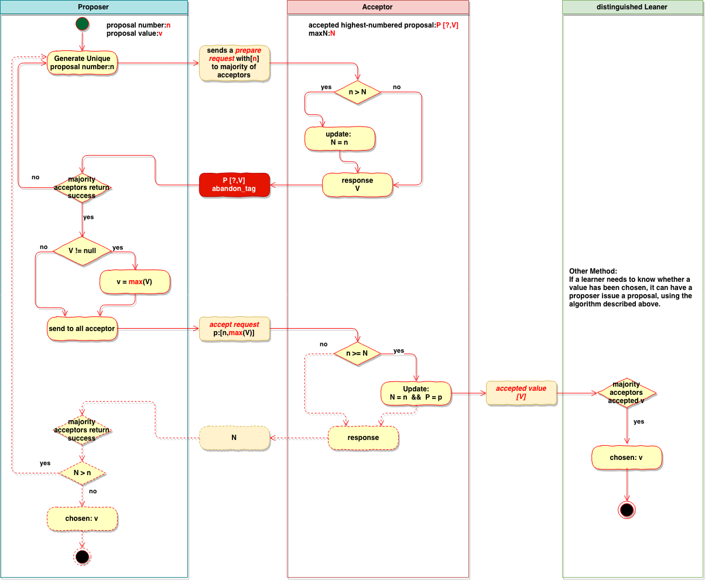

# 1 Introduction 

The Paxos algorithm for implementing a fault-tolerant distributed system has been regarded as difficult to understand, perhaps because the original presentation was Greek to many readers [5]. In fact, it is among the simplest and most obvious of distributed algorithms. At its heart is a consensus algorithm—the “synod” algorithm of [5]. The next section shows that this consensus algorithm follows almost unavoidably from the properties we want it to satisfy. The last section explains the complete Paxos algorithm, which is obtained by the straightforward application of consensus to the state ma- chine approach for building a distributed system—an approach that should be well-known, since it is the subject of what is probably the most often-cited article on the theory of distributed systems [4]. 

# 2 The Consensus Algorithm 

## 2.1 The Problem 

Assume a collection of processes that can propose values. **A consensus algorithm ensures that a single one among the proposed values is chosen. If no value is proposed, then no value should be chosen. If a value has been chosen, then processes should be able to learn the chosen value.** The safety requirements for consensus are: 

* **Only a value that has been proposed may be chosen,** 
* **Only a single value is chosen, and** 
* **A process never learns that a value has been chosen unless it actually has been.** 

We won’t try to specify precise精确的 liveness活性 requirements. However, the goal is to ensure that some proposed value is eventually最终地 chosen and, if a value has been chosen, then a process can eventually learn the value. 

We let the three roles in the consensus algorithm be performed by three classes of agents: ***proposers***, ***acceptors***, and ***learners***. In an implementation, <u>a single process may act as more than one agen</u>t, but the mapping from agents to processes does not concern us here. 

Assume that agents can communicate with one another by sending messages. We use the **customary asynchronous, non-Byzantine model**非拜占庭模型, in which: 
* **Agents operate at arbitrary speed, may fail by stopping, and may restart. Since all agents may fail after a value is chosen and then restart, a solution is impossible unless some information can be remembered by an agent that has failed and restarted.** 
* **Messages can take arbitrarily long to be delivered送达, can be duplicated, and can be lost, but they are not corrupted损坏.** 

## 2.2 Choosing a Value 

**The easiest way to choose a value is to have a single acceptor agent**. A proposer sends a proposal to the acceptor, who chooses the first proposed value that it receives. Although虽然 simple, this solution is unsatisfactory不能令人满意的 because the failure of the acceptor makes any further progress impossible. 

So, let’s try another way of choosing a value. Instead of a single acceptor, let’s **use multiple acceptor agents**. A proposer sends a proposed value to a set of acceptors. An acceptor may accept the proposed value. **The value is chosen when a large enough set of acceptors have accepted it**. How large is large enough? To ensure that only a single value is chosen, **we can let a large enough set consist of any majority of the agents. Because any two majorities have at least one acceptor in common, this works if an acceptor can accept at most one value. 在一个acceptor最多接受一个元素的情况下这个方法是有效的** (There is an obvious显而易见 generalization结论 of a majority that has been observed评论 in numerous众多 papers, apparently starting with [3].) 

In the absence of在没有 failure or message loss, we want a value to be chosen even if only one value is proposed by a single proposer. This suggests the requirement: 

**$$P1$$.  An acceptor must accept the <u>first</u> proposal that it receives.**

But this requirement raises a problem. Several values could be proposed by different proposers at about the same time, leading to a situation in which every acceptor has accepted a value, but no single value is accepted by a majority of them. Even with just two proposed values, if each is accepted by about half the acceptors, failure of a single acceptor could make it impossible to learn which of the values was chosen. 

P1 and the requirement that a value is chosen only when it is accepted by a majority of acceptors imply that **an acceptor must be allowed to accept more than one proposal**. We keep track of the different **proposals** that an acceptor may accept by **assigning a (natural自然数) number to each proposal**, so a proposal consists of **a proposal number** and **a value**. To prevent confusion不确定性, we require that <u>different **proposals** have different numbers</u>. How this is achieved depends on the implementation, so for now we just assume it. **A value is chosen when a single proposal with that value has been accepted by a majority of the acceptors**. In that case, we say that the proposal (as well as its value) has been chosen. 

> 由于每一个 acceptor 必须接受第一个 proposal，但是在最终，所有 acceptor 又必须要达到一致，所以一个 acceptor 必须要允许接受多个 proposal

**We can allow multiple proposals to be chosen, but we must guarantee that all chosen proposals have the same value. By induction归纳 on the proposal number**, it suffices to足以 guarantee: 

**$$P2$$. If a proposal with value $$v$$ is chosen, then every higher-numbered proposal that is chosen has value $$v$$.** **如果一个值为v的提案被选中, 那么更高编号的被选中的提案的值必须也为v**   （这里是针对某一个accepter 来说的）

Since numbers are totally ordered全序的, condition P2 guarantees the crucial关键的 safety property that <u>**only a single value is chosen**</u>. 

To be chosen, a proposal must be accepted by at least one acceptor. So, we can satisfy满足 P2 by satisfying: 

**$$P2^a$$. If a proposal with value $$v$$ is chosen, then every higher-numbered proposal <u>accepted by any acceptor</u> has value $$v$$. ** **如果值为v的提案被选中, 那么后续任何acceptor能批准的更高版本的提案都必须要有值v.** 

We still maintain $$P1$$ to ensure that some proposal is chosen. Because communication is asynchronous, a proposal could be chosen with some particular acceptor $$c$$ never having received any proposal. Suppose a new proposer “wakes up” and issues a higher-numbered proposal with a different value. $$P1$$ requires $$c$$ to accept this proposal, violating $$P2^a$$. Maintaining both $$P1$$ and $$P2^a$$ requires strengthening  $$P2^a$$  to:  
由于通讯是异步的, 一个提案[m, v]在已经被选定之后可能还有某个acceptor c还没有接收到任何提议, 这个时候如果另一个proposer起草了一个版本更高的proposal: [m+k, v’], 而且如果[m+k, v’]是a收到的第一个提议, 根据P1, a就必须通过它. 这样P2a就很难保证了. 所以我们可以做一个更强的限定, 帮助我们使P2a成立: 

**$$P2^b$$. If a proposal with value $$v$$ is chosen, then every higher-numbered proposal <u>issued by any proposer</u> has value $$v$$.  ** **如果值为v的提案被选中, 那么后续任意的proposer所起草的更高编号的提案的值必须也是v.**

Since由于 a proposal must be issued by a proposer before it can be accepted by an acceptor, $$P2^b$$ implies意味着 $$P2^a$$, which in turn反过来 implies $$P2$$. 

To discover how to satisfy $$P2^b$$, let’s consider how we would prove that it holds让我们考虑一下如何证明这一点. We would assume that some proposal with number $$m$$ and value $$v$$ is chosen and show that any proposal issued with number $$n > m$$ also has value $$v$$. We would make the proof证明 easier by using induction on $$n$$, so we can prove that proposal number $$n$$ has value $$v$$ under the additional assumption that every proposal issued with a number in $$m . . (n − 1)$$ has value $$v$$ , where $$i . . j$$ denotes the set of numbers from $$i$$ through $$j$$ . For the proposal numbered $m$ to be chosen, there must be some set $C$ consisting of a majority of acceptors such that every acceptor in $C$ accepted it. Combining this with the induction assumption结合归纳假设, the hypothesis假设 that $m$ is chosen implies意味着: 
为了发现如何保证P2b，我们来看看如何证明它成立。我们假设某个具有编号m和value值v的提案被选定了，需要证明任意具有编号n（n > m）的提案都具有value值v。我们可以通过对n使用数学归纳法来简化证明，这样我们可以在额外的假设下——即编号在m..(n-1)之间的提案具有value值v，来证明编号为n的提案具有value值v，其中i..j表示从i到j的集合。因为编号为m的提案已经被选定了，这就意味着存在一个多数Acceptor组成的集合C，C中的每个成员都通过了这个提案。结合归纳的假设，m被选定意味着：

**Every acceptor in $C$ has accepted a proposal with number in  $m ..(n − 1)$, and every proposal with number in $m ..(n − 1)$  accepted by any acceptor has value $v$.**
C中的每一个Acceptor都通过了一个编号在m..(n-1)之间的提案，并且每个编号在m..(n-1)之间的被Acceptor通过的提案都具有value值v。

Since any set $S$ consisting of a majority of acceptors contains at least one member of $C$, we can conclude推断出 that a proposal numbered $n$ has value $v$ by ensuring that the following invariant不变的 is maintained保持: 
由于任何包含多数Acceptor的集合S都至少包含一个C中的成员，我们可以通过保持如下不变性来确保编号为n的提案具有value值v：

**$P2^c$. For any $v$ and $n$, if a proposal with value $v$ and number $n$ is issued, then there is a set $S$ consisting of a majority of acceptors such that either  
P2c. 对于任意v和n，如果一个编号为n，value值为v的提案被提出，那么肯定存在一个由多数Acceptor组成的集合S满足以下条件中的一个：
	(a) no acceptor in $S$ has accepted any proposal numbered less than $n$, or 
	S中不存在任何Acceptor通过了编号小于n的提案
	(b) $v$ is the value of the highest-numbered proposal among all proposals numbered less than $n$ accepted by the acceptors in $S$. ** 
	v是S中所有Acceptor已经通过的编号小于n的具有最大编号的提案的value值。

We can therefore satisfy $P2^b$ by maintaining the invariance of $P2^c$.
通过维护P2c的不变性我们就可以满足P2b的条件了。

 To maintain the invariance of $P2^c$, a proposer that wants to issue a proposal numbered $n$ must learn the highest-numbered proposal with number less than $n$, if any, that has been or will be accepted by each acceptor in some majority of acceptors. Learning about proposals already accepted is easy enough; predicting future acceptances is hard. Instead of trying to predict the future, the proposer controls it by **extracting a promise索取承诺 that there won’t be any such acceptances认可，接受**. In other words, **the proposer requests要求 that the acceptors not accept any more proposals numbered less than n不再接受编号小于N的提案**. This leads to the following algorithm for issuing proposals. 
 为了维护P2c的不变性，一个Proposer在提出编号为n的提案时，如果存在一个将要或者已经被多数Acceptor通过的编号小于n的最大编号提案，Proposer需要知道它的信息。获取那些已经被通过的提案很简单，但是预测未来会被通过的却很困难。为了避免去预测未来，Proposer通过提出承诺不会有那样的通过情况来控制它。换句话说，Proposer会请求那些Acceptor不要再通过任何编号小于n的提案了。这就导致了如下的提案生成算法：

1. A proposer chooses a new proposal number $n$ and sends a request to each member of some set of acceptors, asking it to respond with: 
   (a) A promise never again to accept a proposal numbered less than $n$, and   承诺不会再通过任何比n小的提案
   (b) The proposal with the highest number less than $n$ that it has accepted, if any.  小于n的最大编号的提案(如有) 
   
   I will call such a request a ***prepare*** request with number $n$. 

2. If the proposer receives the requested responses from a **majority** of the acceptors, then it can issue a proposal with number $n$ and value $v$, where $v$ is the value of the highest-numbered proposal among the responses, or is any value selected by the proposer if the responders reported no proposals. 如果proposer受到了绝大多数acceptor的响应, 那么它就可以起草一个提案. 提案的编号是n, 值是根据 1 中的 (b) 里面响应的提案的值来的(如果没有提案, 或者提案值为空, 那么这个proposer可以用任意值) 

A proposer issues a proposal by sending, to some set of acceptors, a request that the proposal be accepted. (This need **not** be the **same** set of acceptors that responded to the initial requests.并不一定是上面prepare request发给的那个majority集合) Let’s call this an ***accept*** request. 

This describes a proposer’s algorithm. What about an acceptor? It can receive two kinds of requests from proposers: ***prepare*** requests and ***accept*** requests. An acceptor can ignore any request without compromising妥协 safety. So, we need to say only when it is allowed to respond to a request. It can always respond to a prepare request. It can respond to an accept request, accepting the proposal, **iff当且仅当 it has not promised not to**它总是可以响应准备请求。它可以响应接受请求，接受建议，如果它没有承诺不接受。. In other words: 

**$P1^a$ . An acceptor can accept a proposal numbered $n$ iff it has not responded to a prepare request having a number greater than $n$. **

Observe显然 that $P1^a$ subsumes子类 $P1$.
 We now have a complete algorithm for choosing a value that satisfies the required safety properties—assuming unique proposal numbers. The final algorithm is obtained by making one small optimization. 

Suppose an acceptor receives a prepare request numbered $n$, but it has already responded to a prepare request numbered greater than $n$, thereby promising not to accept any new proposal numbered $n$. There is then no reason for the acceptor to respond to the new prepare request 没有理由响应新的准备请求, since it will not accept the proposal numbered $n$ that the proposer wants to issue. **So we have the acceptor ignore such a prepare request. We also have it ignore a prepare request for a proposal it has already accepted.** 所以我们让接受者忽略这样一个准备请求。我们还让它忽略一个已经接受的提案的准备请求。

With this optimization, an acceptor needs to **remember only** the **highest numbered proposal that it has ever accepted** and **the number of the highest numbered prepare request to which it has responded**. Because $P2^c$ must be kept invariant不变 regardless无论 of failures, an **acceptor must remember this information even if it fails and then restarts**. Note that the proposer can always abandon a proposal and forget all about it—as long as只要 it never tries to issue another proposal with the same number. 

Putting the actions of the proposer and acceptor together, we see that the algorithm operates in the following two phases. 

**Phase 1.** 

**(a) A proposer selects a proposal number $n$ and sends a *prepare* request with number $n$ to a majority of acceptors.** 
Proposer选择一个提案编号n，然后向Acceptor的多数集发送编号为n的prepare请求。

**(b) If an acceptor receives a *prepare* request with number $n$ greater than that of any *prepare* request to which it has already responded, then it responds to the request with a promise not to accept any more proposals numbered less than $n$ and with the highest-numbered proposal (if any) that it has accepted.** 
如果一个Acceptor收到一个编号为n的prepare请示，且n大于它所有已响应请求的编号，那么它就会保证不会再通过任意编号小于n的提案，同时将它已经通过的最大编号提案（如果存在的话）一并作为响应。

**Phase 2.** 

**(a) If the proposer receives a response to its *prepare* requests (numbered $n$) from a majority of acceptors, then it sends an *accept* request to each of those acceptors for a proposal numbered $n$ with a value $v$, where $v$ is the value of the highest-numbered proposal among the responses, or is any value if the responses reported no proposals.** 
如果Proposer收到多数Acceptor对它prepare请求（编号为n）的响应，那么它就会发送一个编号为n，value值为v的提案的accept请求给每个Acceptor，这里v是收到的响应中最大编号提案的值，如果响应中不包含任何提案，那么它就可以是任意值。

**(b) If an acceptor receives an *accept* request for a proposal numbered $n$, it accepts the proposal unless it has already responded to a *prepare* request having a number greater than $n$.** 
如果Acceptor收到一个编号为n的提案的accept请求，只要它还未对编号大于n的prepare作出响应，它就可以通过这个提案。

A proposer can make multiple proposals, so long as只要 it follows the algorithm for each one. It can abandon a proposal in the middle of the protocol at any time. (Correctness is maintained, even though requests and/or responses for the proposal may arrive at their destinations long after the proposal was abandoned.即使提案的请求和/或响应可能在提案被放弃之后的很长时间才到达目的地，正确性也能得到保证。) <u>It is probably a good idea to abandon a proposal if some proposer has begun trying to issue a higher-numbered one. Therefore, if an acceptor ignores a ***prepare*** or ***accept*** request because it has already received a ***prepare*** request with a higher number, then **it should probably inform the proposer, who should then abandon its proposal**. This is a performance optimization that does not affect correctness</u>.  				 	一个Proposer可以提出多个提案，只要它能遵循以上算法约定。它可以在任意时刻丢弃某个提案（即使针对该提案的请求或响应在提案丢弃后很久才到达，正确性依然可以保证）。如果Proposer已经在尝试提交更大编号的提案，那么丢弃也未尝不是一件好事。因此，如果一个Acceptor因为已经收到更高编号的prepare请求而忽略某个prepare或者accept请求，它应该通知对应的Proposer，然后该Proposer可以丢弃这个提案。这是一个不影响正确性的性能优化。

## 2.3 Learning a Chosen Value 

To learn that a value has been chosen, **<u>a learner must find out that a proposal has been accepted by a majority of acceptors</u>**. **The obvious algorithm is to have each acceptor, whenever it accepts a proposal, respond to all learners, sending them the proposal.** This allows learners to find out about a chosen value as soon as possible, but it requires each acceptor to respond to each learner—a number of responses equal to the product of the number of acceptors and the number of learners等于接受者数量和学习者数量的乘积. 

The assumption of non-Byzantine failures makes it easy for one learner to find out from another learner that a value has been accepted. We can have the acceptors respond with their acceptances to a distinguished杰出的 learner, which in turn informs the other learners when a value has been chosen我们可以让接受者对一个杰出的学习者作出接受的回应，当选择了一个值时，接受者又会通知其他学习者. This approach requires an extra round for all the learners to discover the chosen value这种方法需要额外的一轮学习，让所有的学习者发现所选的值. It is also less reliable, since the distinguished learner could fail因为杰出的学习者可能会失败. But it requires a number of responses equal only to the sum of the number of acceptors and the number of learners. 

More generally, **the acceptors could respond with their acceptances to some set of distinguished learners, each of which can then inform all the learners when a value has been chosen. ** Using a larger set of distinguished learners provides greater reliability at the cost of greater communication complexity. 使用一组更大的优秀学习者提供了更大的可靠性，同时也牺牲了更大的沟通复杂性。

Because of message loss, a value could be chosen with no learner ever finding out. The learner could ask the acceptors what proposals they have accepted, but failure of an acceptor could make it impossible to know whether or not a majority had accepted a particular proposal. In that case, learners will find out what value is chosen only when a new proposal is chosen. **If a learner needs to know whether a value has been chosen, it can have a proposer issue a proposal, using the algorithm described above.** 
因为消息可能会丢失，一个value被选定后，可能没有Learner会发现。Learner可以向Acceptor询问它们通过了哪些提案，但是任一Acceptor出错，都有可能导致无法分辨是否有多数Acceptor通过了某个提案。在这种情况下，只有当一个新的提案被选定时，Learner才能发现被选定的value。如果一个Learner想知道是否已经选定一个value，它可以让Proposer利用上面的算法提出一个提案。

## 2.4 Progress 

It’s easy to construct a scenario in which two proposers each keep issuing a sequence of proposals with increasing numbers, none of which are ever chosen. Proposer p completes phase 1 for a proposal number n1. Another proposer q then completes phase 1 for a proposal number n2 > n1. Proposer p’s phase 2 accept requests for a proposal numbered n1 are ignored because the acceptors have all promised not to accept any new proposal numbered less than n2. So, proposer p then begins and completes phase 1 for a new proposal number n3 > n2, causing the second phase 2 accept requests of proposer q to be ignored. And so on. 

To guarantee progress, **a distinguished杰出的 proposer** must be selected as the only one to try issuing proposals. If the distinguished proposer can communicate successfully with a majority of acceptors, and if it uses a proposal with number greater than any already used, then it will succeed in issuing a proposal that is accepted. By abandoning a proposal and trying again if it learns about some request with a higher proposal number, the distinguished proposer will eventually最终地 choose a high enough足够大的 proposal number. 

If enough of the system (proposer, acceptors, and communication network) is working properly, **liveness can therefore be achieved by electing a single distinguished proposer**那么可以通过选择一个杰出的提议者来实现活跃性. **The famous result of Fischer, Lynch, and Pat- terson [1] implies that a reliable algorithm for electing a proposer must use either randomness or real time—for example, by using timeouts. However, safety is ensured regardless of the success or failure of the election.** Fischer、Lynch和Pat-Terson[1]的著名结果表明，选择一个提议者的可靠算法必须使用随机性或实时性，例如，使用超时。然而，无论选举成功与否，都必须确保安全。

## 2.5 The Implementation 

The Paxos algorithm [5] assumes a network of processes. In its consensus algorithm, each process plays the role of proposer, acceptor, and learner. The algorithm chooses a **leader**, which plays the roles of the distinguished proposer and the distinguished learner. The Paxos consensus algorithm is precisely the one described above, where requests and responses are sent as ordinary messages. (Response messages are tagged with the corresponding proposal number to prevent confusion.) **Stable storage**, preserved during failures, is used to maintain the information that the acceptor must remember. An acceptor records its intended response in stable storage before actually sending the response. 

All that remains剩余的部分 is to **describe the mechanism for guaranteeing that no two proposals are ever issued with the same number. <u>Different proposers choose their numbers from disjoint不相交 sets of numbers</u>**, so two different proposers never issue a proposal with the same number. Each proposer remembers (in stable storage) the highest-numbered proposal it has tried to issue, and begins phase 1 with a higher proposal number than any it has already used. 

# 3 Implementing a State Machine

A simple way to implement a distributed system is as a collection of clients that issue commands to a central中心 server. The server can be described as a deterministic确定的 state machine that performs client commands in some sequence. The state machine has a current state; it performs a step by taking as input a command and producing an output and a new state. For example, the clients of a distributed banking system might be tellers出纳员, and the state-machine state might consist of the account balances of all users. A withdrawal取款 would be performed by executing a state machine command that decreases an account’s balance if and only if the balance is greater than the amount withdrawn, producing as output the old and new balances. 
有一种实现分布式系统的简单方式，就是使用一组客户端集合向中央服务器发送命令。服务器可以看成一个以某种顺序执行客户端命令的确定性状态机。这个状态机有个当前状态，通过接收一个命令当作输入来产生一个输出和新状态。比如，分布式银行系统的客户端可能是一些出纳员，状态机的状态则由所有用户的账户余额组成。一个取款操作，通过执行一个减少账户余额的状态机命令（当且仅当余额大于取款数目时）实现，然后将新旧余额作为输出。

An implementation that uses a single central server fails if that server fails. We therefore instead use a collection of servers, each one independently implementing the state machine. Because the state machine is deterministic, all the servers will produce the same sequences of states and outputs if they all execute the same sequence of commands. A client issuing a command can then use the output generated for it by any server. 
使用单点中央服务器的系统在该服务器故障的情况下，整个系统都将运行失败。因此我们用一组服务器来代替它，每个服务器都独立实现了该状态机。因为这个状态机是确定性的，如果所有服务器都以同样的顺序执行命令，那么它们将产生相同的状态机状态和输出。一个提出命令的客户端，可以使用任意服务器为它产生的输出。

To guarantee that all servers execute the same sequence of state machine commands, we implement a sequence of separate instances of the Paxos consensus algorithm, the value chosen by the ith instance being the ith state machine command in the sequence. **Each server plays all the roles (proposer, acceptor, and learner) in each instance of the algorithm.** For now, I assume that **the set of servers is fixed**, so all instances of the consensus algorithm use the same sets of agents.
为了保证所有服务器都能执行相同的状态机命令序列，我们需要实现一系列独立的Paxos一致性算法实例，第i个实例选定的值作为序列中的第i个状态机命令。在算法的每个实例中，每个服务器担任所有角色（Proposer，Acceptor和Learner）。现在，我们假设服务器的集合是固定的，这样所有的一致性算法实例都具有相同的参与者集合。

**In normal operation, a single server is elected to be the leader, which acts as the distinguished proposer (the only one that tries to issue proposals) in all instances of the consensus algorithm. Clients send commands to the leader, who decides where in the sequence each command should appear.** If the leader decides that a certain client command should be the 135th command, it tries to have that command chosen as the value of the 135th instance of the consensus algorithm. It will usually succeed. It might fail because of failures, or because another server also believes itself to be the leader and has a different idea of what the 135th command should be. But the consensus algorithm ensures that at most one command can be chosen as the 135th one. 
在正常执行中，一个服务器被选举成为Leader，它会在所有一致性算法实例当中扮演特定的Proposer（唯一的提案提出者）。客户端给Leader发送命令，它来决定每条命令出现在序列当中的位置。如果Leader决定某个客户端命令应该是第135个，它会尝试让该命令成为第135个一致性算法实例选定的value值。这通常都会成功，但是在一些故障或者有另外的服务器也认为自己是Leader并且对第135个命令持有异议时，它可能会失败。但是一致性算法可以保证，最多只有一条命令会被选定为第135条。

Key to the efficiency of this approach is that, in the Paxos consensus algorithm, the value to be proposed is not chosen until phase 2. Recall that, after completing phase 1 of the proposer’s algorithm, either the value to be proposed is determined or else the proposer is free to propose any value. 
这个方法的关键在于，在Paxos一致性算法中，被提出的value值只在Phase 2才会被选定。回忆一下，在Proposer完成Phase 1时，要么提案的value值被确定了，要么Proposer可以自由提出任意值。

I will now describe how the Paxos state machine implementation works during normal operation. Later, I will discuss what can go wrong. I consider what happens when the previous leader has just failed and a new leader has been selected. (System startup is a special case in which no commands have yet been proposed.) 
我们现在描述了Paxos状态机实现是怎样在正常情况下运行的，接下来我们看看会有哪些出错的情况，看下之前的Leader故障以及新的Leader被选举出来后会发生什么（系统启动是一种特殊情况，此时还没有命令被提出）。

The new leader, being a learner in all instances of the consensus algo- rithm, should know most of the commands that have already been chosen. Suppose it knows commands 1–134, 138, and 139—that is, the values cho- sen in instances 1–134, 138, and 139 of the consensus algorithm. (We will see later how such a gap in the command sequence could arise.) It then executes phase 1 of instances 135–137 and of all instances greater than 139. (I describe below how this is done.) Suppose that the outcome of these ex- ecutions determine the value to be proposed in instances 135 and 140, but leaves the proposed value unconstrained in all other instances. The leader then executes phase 2 for instances 135 and 140, thereby choosing commands 135 and 140. 
新的Leader被选举出来后，首先要成为所有一致性算法实例的Learner，需要知道目前已经选定的大部分命令。假设它知道命令1-134，138以及139——也就是一致性算法实例1-134，138以及139选定的值（后面我们会看到这样的命令缺口是如何产生的）。接下来它会执行135-137以及139以后的算法实例的Phase 1（下面会描述如何来做）。假设执行结果表明，实例135和140的提案值已被确定，但是其他执行实例的提案值是没有限制的。那么Leader可以执行实例135和140的Phase 2，进而选定第135和140条命令。

The leader, as well as any other server that learns all the commands the leader knows, can now execute commands 1–135. However, it can’t execute commands 138–140, which it also knows, because commands 136 and 137 have yet to be chosen. The leader could take the next two commands requested by clients to be commands 136 and 137. Instead, we let it fill the gap immediately by proposing, as commands 136 and 137, a special “no- op” command that leaves the state unchanged. (It does this by executing phase 2 of instances 136 and 137 of the consensus algorithm.) Once these no-op commands have been chosen, commands 138–140 can be executed. 
Leader以及其他已经获取Leader所有已知命令的服务器，现在可以执行命令1-135。然而它还不能执行命令138-140，因为命令136和137还未被选定。Leader可以将接下来两条客户端请求的命令当作命令136和137。同时我们也可以提出一个特殊的“noop”指令来立即填补这个空缺但保持状态不变（通过执行一致性算法实例136和137的Phase 2来完成）。一旦该no-op指令被选定，命令138-140就可以被执行了。

Commands 1–140 have now been chosen. The leader has also completed phase 1 for all instances greater than 140 of the consensus algorithm, and it is free to propose any value in phase 2 of those instances. It assigns command number 141 to the next command requested by a client, proposing it as the value in phase 2 of instance 141 of the consensus algorithm. It proposes the next client command it receives as command 142, and so on.
命令1-140目前已经被选定了。Leader也已经完成了所有大于140的一致性算法实例的Phase 1，而且它可以在Phase 2中自由地为这些实例指定任意值。它为下一个从客户端接收的命令分配序号141， 并在Phase 2中将它作为第141个一致性算法实例的value值。它将接收到的下一个客户端命令作为命令142, 并以此类推。

The leader can propose command 142 before it learns that its proposed command 141 has been chosen. It’s possible for all the messages it sent in proposing command 141 to be lost, and for command 142 to be chosen before any other server has learned what the leader proposed as command 141. When the leader fails to receive the expected response to its phase 2 messages in instance 141, it will retransmit those messages. If all goes well, its proposed command will be chosen. However, it could fail first, leaving a gap in the sequence of chosen commands. In general, suppose a leader can get α commands ahead—that is, it can propose commands i + 1 through i +α after commands 1 through i are chosen. A gap of up to α−1 commands could then arise. 
Leader可以在它提出的命令141被选定前提出命令142。它发送的关于命令141的提案信息可能全部丢失，因此在所有其他服务器获知Leader选定的命令141之前，命令142就可能已被选定。当Leader无法收到实例141的Phase 2的期望回应时，它会重传这些信息。如果一切顺利的话，它的提案命令将被选定。但是仍然可能会失败，造成在选定的命令序列中出现缺口。一般来说，假设Leader可以提前确定a个命令，这意味着命令i被选定之后，它就可以提出i+1到i+a的命令了。这样就可能形成长达a-1的命令缺口。

A newly chosen leader executes phase 1 for infinitely many instances of the consensus algorithm—in the scenario above, for instances 135–137 and all instances greater than 139. Using the same proposal number for all instances, it can do this by sending a single reasonably short message to the other servers. In phase 1, an acceptor responds with more than a simple OK only if it has already received a phase 2 message from some proposer. (In the scenario, this was the case only for instances 135 and 140.) Thus, a server (acting as acceptor) can respond for all instances with a single reasonably short message. Executing these infinitely many instances of phase 1 therefore poses no problem. 
一个新选定的Leader需要为无数个一致性算法实例执行Phase 1——在上面的场景中，就是135-137以及所有大于139的执行实例。通过向其他服务器发送一条合适的消息，就可以让所有执行实例使用同一个提案编号（计数器）。在Phase 1中，只要一个Acceptor已经收到来自某Proposer的Phase 2消息，那么它就可以为不止一个实例作出通过回应（在上面的场景中，就是针对135和140的情况）。因此一个服务器（作为Acceptor时）可以用一条适当的短消息对所有实例作出回应。执行这样无限多的实例的Phase 1也不会有问题。
 
Since failure of the leader and election of a new one should be rare events, the effective cost of executing a state machine command—that is, of achieving consensus on the command/value—is the cost of executing only phase 2 of the consensus algorithm. It can be shown that phase 2 of the Paxos consensus algorithm has the minimum possible cost of any algorithm for reaching agreement in the presence of faults [2]. Hence, the Paxos algorithm is essentially optimal. 
* 这里应该是指稳定的Paxos模型，Phase 1可以被省略，只要编号计数器是唯一的。

This discussion of the normal operation of the system assumes that there is always a single leader, except for a brief period between the failure of the current leader and the election of a new one. In abnormal circumstances, the leader election might fail. If no server is acting as leader, then no new commands will be proposed. If multiple servers think they are leaders, then they can all propose values in the same instance of the consensus algo- rithm, which could prevent any value from being chosen. However, safety is preserved—two different servers will never disagree on the value chosen as the ith state machine command. Election of a single leader is needed only to ensure progress. 
在系统正常运行的情况下，我们假设总是只有一个Leader，只有在当前Leader故障及选举出新Leader之间的短时间内才会违背这个假设。在特殊情况下，Leader选举可能失败。如果没有服务器扮演Leader，那么就没有新命令被提出。如果同时有多个服务器认为自己是Leader，它们在一个一致性算法执行实例中可能提出不同value值，这可能导致没有任何值能被选定。但是安全性是可以保证的——不可能有两个不同的值被选定为第i条状态机命令。单个Leader的选举只是为了保证流程能往下进行。

If the set of servers can change, then there must be some way of deter- mining what servers implement what instances of the consensus algorithm. The easiest way to do this is through the state machine itself. The current set of servers can be made part of the state and can be changed with ordi- nary state-machine commands. We can allow a leader to get α commands ahead by letting the set of servers that execute instance i + α of the con- sensus algorithm be specified by the state after execution of the ith state machine command. This permits a simple implementation of an arbitrarily sophisticated reconfiguration algorithm. 
如果服务器的集合是变化的，那么必须有某种方法可以决定哪些服务器来实现哪一些一致性算法实例。最简单的方式就是通过状态机本身来完成。当前的服务器集合可以是状态的一部分，同时也可以通过状态机命令来改变。通过用执行完第i条状态机命令后的状态来描述执行一致性算法i+a的服务器集合，我们就能让Leader提前获取a个状态机命令。这就允许任意复杂的重配置算法有一个简单实现。

References 

1. [1]  Michael J. Fischer, Nancy Lynch, and Michael S. Paterson. Impossibility of distributed consensus with one faulty process. Journal of the ACM, 32(2):374–382, April 1985. 
2. [2]  Idit Keidar and Sergio Rajsbaum. On the cost of fault-tolerant consensus when there are no faults—a tutorial. TechnicalReport MIT-LCS-TR-821, Laboratory for Computer Science, Massachusetts Institute Technology, Cambridge, MA, 02139, May 2001. also published in SIGACT News 32(2) (June 2001). 
3. [3]  Leslie Lamport. The implementation of reliable distributed multiprocess systems. Computer Networks, 2:95–114, 1978. 
4. [4]  Leslie Lamport. Time, clocks, and the ordering of events in a distributed system. Communications of the ACM, 21(7):558–565, July 1978. 
5. [5]  Leslie Lamport. The part-time parliament. ACM Transactions on Computer Systems, 16(2):133–169, May 1998. 

---

**1. 简介**

用于实现高容错性分布式系统的Paxos算法，一直以来总是被认为是难以理解的，或许是因为对很多人来说，初始版本就像是”希腊语"一样（最初的论文是以希腊故事展开的形式）[5]。实际上，它也算是最浅显易见的分布式算法之一了。它的核心就是一个一致性算法——论文[5]中的“synod”算法。在下一个章节可以看到，它基本上是根据一个一致性算法所必需满足的条件自然而然地推断出来的。最后一个章节，我们通过将Paxos算法作为构建一个实现了状态机的分布式系统的一致性实现，来完整地描述它。这种使用状态机方法的论文[4]应该早已广为人知，因为它可能已经是分布式系统理论研究领域被引用最广泛的了。

**2. 一致性算法**

**2.1 问题描述**

假设有一组可以提出提案的进程集合。一个一致性算法需要保证：

- 在这些被提出的提案中，只有一个会被选定。
- 如果没有提案被提出，则不会有被选定的提案。
- 当一个提案被选定后，进程应该能获取被选定提案的信息。

对于一致来说，安全性（Safety）需求是这样的：

- 只有被提出的提案才能被选定。
- 只能有一个值被选中（chosen），同时
- 进程不能认为某个提案被选定，除非它真的是被选定的那个。

我们不会尝试去精确地描述活性（Liveness）需求。但是从总体上看，最终的目标是保证有一个提案被选定，并且当提案被选定后，进程最终也能获取到被选定提案的信息。

- 一个分布式算法，有两个重要的属性：Safety和Liveness，简单来说：
  - Safety是指那些需要保证永远都不会发生的事情
  - Liveness是指那些最终一定会发生的事情

在这个一致性算法中，有三个参与角色，我们分别用Proposer，Acceptor和Learner来表示。在具体实现中，一个进程可能充当不止一种角色，但是在这里我们并不关心它们之间的映射关系。 

假设不同的参与者之间可以通过发消息来进行通信，我们使用普通的非拜占庭模式的异步模型：

- 每个参与者以任意的速度运行，可能会因停止而执行失败，也可能会重启。当一个提案被选定后，所有的参与者都有可能失败然后重启，除非这些参与者可以记录某些信息，否则是不可能存在一个解法的。
- 消息在传输中可能花费任意时间，可能会重复，也可能丢失，但不会被损坏（不会被篡改，即不会发生拜占庭问题）。

**2.2 提案的选定**

选定提案最简单的方式就是只有一个Acceptor存在。Proposer发送提案给Acceptor，Acceptor会选择它接收到的第一个提案作为被选提案。虽然简单，这个解决方案却很难让人满意，因为当Acceptor出错时，整个系统就无法工作了。

因此，我们应该选择其他方式来选定提案，比如可以用多个Acceptor来避免一个Acceptor的单点问题。这样的话，Proposer向一个Acceptor集合发送提案，某个Acceptor可能会通过（accept）这个提案。当有足够多的Acceptor通过它时，我们就认为这个提案被选定了。那么怎样才算是足够多呢？为了确保只一个提案被选定，我们可以让这个集合大到包含了Acceptor集合中的多数成员。因为任意两个多数集（majority）至少包含一个公共成员，如果我们再规定一个Acceptor只能通过一个提案，那么就能保证只有一个提案被选定（这是很多论文都研究过的多数集的一个普通应用[3]）。

假设没有失败和消息丢失的情况，如果我们希望在每个Proposer只能提出一个提案的前提下仍然可以选出一个提案来，这就意味着如下需求：

​    *P1. 一个Acceptor必须通过它收到的第一个提案。*

但是这个需求会引发另外的问题。如果有多个提案被不同的Proposer同时提出，这会导致虽然每个Acceptor都通过了一个提案，但是没有一个提案是由多数人通过的。甚至即使只有两个提案被提出，如果每个都被差不多一半的Acceptor通过了，哪怕只有一个Acceptor出错都可能导致无法确定该选定哪个提案。

- 比如有5个Acceptor，其中2个通过了提案a，另外3个通过了提案b，此时如果通过提案b的3个当中有一个出错了，那么a和b的通过数都为2, 这样就无法确定了。 

P1再加一个提案被选定需要由半数以上Acceptor通过的这个需求，暗示着一个Acceptor必须要能通过不止一个提案。我们为每个提案分配一个编号来记录一个Acceptor通过的那些提案，于是一个提案就包含一个提案编号以及它的value值。为了避免造成混淆，需要保证不同的提案具有不同编号。如何实现这个功能依赖于具体的实现细节，在这里我们假设已经实现了这种保证。当一个具有value值的提案被多数Acceptor通过后，我们就认为该value被选定了。同时我们也认为该提案被选定了。

我们允许多个提案被选定，但是我们必须保证所有被选定的提案具有相同的值value。通过对提案编号的约定，它需要满足以下保证：

  *P2. 如果具有value值v的提案被选定了，那么所有比它编号高的提案的value值也必须是v。*

因为编号是完全有序的，所以条件P2就保证了只有一个value值被选定这一关键安全性属性。

一个提案能被选定，必须要被至少一个Acceptor通过，所以我们可以通过满足如下条件来满足P2:

​    *P2a. 如果一个具有value值v的提案被选定了，那么被Acceptor通过的所有编号比它高的提案的value值也必须是v。*

我们仍然需要P1来保证有提案会被选定。因为通信是异步的，一个提案可能会在某个Acceptor c还没收到任何提案时就被选定了。假设有个新的Proposer苏醒了，然后提出了一个具有不同value值的更高编号的提案，根据P1, 需要c通过这个提案，但这是与P2a相矛盾的。因此为了同时满足P1和P2a，需要对P2a进行强化：

​    *P2b. 如果具有value值v的提案被选定了，那么所有比它编号更高的被Proposer提出的提案的value值也必须是v。*

一个提案被Acceptor通过之前肯定是由某个Proposer提出，因此P2b就隐含P2a，进而隐含了P2.

为了发现如何保证P2b，我们来看看如何证明它成立。我们假设某个具有编号m和value值v的提案被选定了，需要证明任意具有编号n（n > m）的提案都具有value值v。我们可以通过对n使用数学归纳法来简化证明，这样我们可以在额外的假设下——即编号在m..(n-1)之间的提案具有value值v，来证明编号为n的提案具有value值v，其中i..j表示从i到j的集合。因为编号为m的提案已经被选定了，这就意味着存在一个多数Acceptor组成的集合C，C中的每个成员都通过了这个提案。结合归纳的假设，m被选定意味着：

​    *C中的每一个Acceptor都通过了一个编号在m..(n-1)之间的提案，并且每个编号在m..(n-1)之间的被Acceptor通过的提案都具有value值v。*

由于任何包含多数Acceptor的集合S都至少包含一个C中的成员，我们可以通过保持如下不变性来确保编号为n的提案具有value值v：

​    *P2c. 对于任意v和n，如果一个编号为n，value值为v的提案被提出，那么肯定存在一个由多数Acceptor组成的集合S满足以下条件中的一个：*

​        *a. S中不存在任何Acceptor通过了编号小于n的提案*

​        *b. v是S中所有Acceptor已经通过的编号小于n的具有最大编号的提案的value值。*

通过维护P2c的不变性我们就可以满足P2b的条件了。 

为了维护P2c的不变性，一个Proposer在提出编号为n的提案时，如果存在一个将要或者已经被多数Acceptor通过的编号小于n的最大编号提案，Proposer需要知道它的信息。获取那些已经被通过的提案很简单，但是预测未来会被通过的却很困难。为了避免去预测未来，Proposer通过提出承诺不会有那样的通过情况来控制它。换句话说，Proposer会请求那些Acceptor不要再通过任何编号小于n的提案了。这就导致了如下的提案生成算法：

1. *Proposer选择一个新的提案编号n，然后向某个Acceptor集合中的成员发送请示，要求它作出如下回应：*

​        *（a）保证不再通过任何编号小于n的提案。*

​        *（b）当前它已经通过的编号小于n的最大编号提案，如何存在的话。*

​     *我们把这样的请求称为编号为n的prepare请求。*

1. *如果Proposer收到来自集合中多数成员的响应结果，那么它可以提出编号为n，value值为v的提案，这里v是所有响应中最大编号提案的value值，如果响应中不包含任何提案，那么这个值就由Proposer自由决定。* 

Proposer通过向某个Acceptor集合发送需要被通过的提案请求来产生一个提案（这里的Acceptor集合不一定是响应前一个请求的集合）。这们把这个叫做accept请求。

目前我们描述了Proposer端的算法。那么Acceptor端是怎样的呢？它可能会收到来自Proposer端的两种请求：prepare请求和accept请求。Acceptor可以忽略任意请求而不用担心破坏算法的安全性。因此我们只需要说明它在什么情况下可以对一个请求作出响应。它可以在任何时候响应prepare请求也可以在不违反现有承诺的情况下响应accept请求。换句话说：

​    *P1a. 一个Acceptor可以通过一个编号为n的提案，只要它还未响应任何编号大于n的prepare请求。*

可以看出P1a包含了P1。

现在我们就获得了一个满足安全性需求的提案选定算法——假设在提案编号唯一的前提下。只要再做点小优化，就能得到最终的算法了。

假设一个Acceptor收到了一个编号为n的prepare请求，但是它已经对编号大于n的prepare请求作出了响应，因此它肯定不会再通过任何新的编号为n的提案。那么它就没有必要对这个请求作出响应，因为它肯定不会通过编号为n的提案，于是我们会让Acceptor忽略这样的prepare请求，我们也会让它忽略那些它已经通过的提案的prepare请求。

通过这个优化，Acceptor只需要记住它已经通过的提案的最大编号以及它已经响应过prepare请求的提案的最大编号。因为必须要在出错的情况下也保证P2c的不变性，所以Acceptor要在故障和重启的情况下也能记住这些信息。Proposer可以随时丢弃提案以及它的所有信息——只要它可以保证不会提出具有相同编号的提案即可。 

把Proposer和Acceptor的行为结合起来，我们就能得到算法的如下两阶段执行过程：

Phase 1:

- Proposer选择一个提案编号n，然后向Acceptor的多数集发送编号为n的prepare请求。
- 如果一个Acceptor收到一个编号为n的prepare请示，且n大于它所有已响应请求的编号，那么它就会保证不会再通过任意编号小于n的提案，同时将它已经通过的最大编号提案（如果存在的话）一并作为响应。

Phase 2:

- 如果Proposer收到多数Acceptor对它prepare请求（编号为n）的响应，那么它就会发送一个编号为n，value值为v的提案的accept请求给每个Acceptor，这里v是收到的响应中最大编号提案的值，如果响应中不包含任何提案，那么它就可以是任意值。
- 如果Acceptor收到一个编号为n的提案的accept请求，只要它还未对编号大于n的prepare作出响应，它就可以通过这个提案。

一个Proposer可以提出多个提案，只要它能遵循以上算法约定。它可以在任意时刻丢弃某个提案（即使针对该提案的请求或响应在提案丢弃后很久才到达，正确性依然可以保证）。如果Proposer已经在尝试提交更大编号的提案，那么丢弃也未尝不是一件好事。因此，如果一个Acceptor因为已经收到更高编号的prepare请求而忽略某个prepare或者accept请求，它应该通知对应的Proposer，然后该Proposer可以丢弃这个提案。这是一个不影响正确性的性能优化。

**2.3 获取被选定的提案值**

为了获取被选定的值，一个Learner必须要能知道一个提案已经被多数Acceptor通过了。最直观的算法是，让每个Acceptor在通过一个提案时就通知所有Learner，把通过的提案告知它们。这可以让Learner尽快找到被选定的值，但这需要每个Acceptor和Learner之间互相通信——通信次数等于二者数量的乘积。

在假设非拜占庭错误的前提下，一个Learner可以很容易地通过另一个Learner了解一个值已经被选定了。我们可以让所有Acceptor将它们的通过信息发送给一个特定的Learner，当一个value被选定时，由它来通知其他Learner。这种方法需要额外一个步骤才能通知到所有Learner，而且它也不是可靠的，因为那个特定的Learner可能会发生一些故障。但是这种情况下的通信次数，只需要二者数量之和。

更一般地，Acceptor可以将它们的通过信息发送给一个特写的Learner集合，它们中的任何一个都可以在某个value被选定后通知所有Learner。这个集合中的Learner越多，可靠性就越好，通信复杂度也相应更高。 

因为消息可能会丢失，一个value被选定后，可能没有Learner会发现。Learner可以向Acceptor询问它们通过了哪些提案，但是任一Acceptor出错，都有可能导致无法分辨是否有多数Acceptor通过了某个提案。在这种情况下，只有当一个新的提案被选定时，Learner才能发现被选定的value。如果一个Learner想知道是否已经选定一个value，它可以让Proposer利用上面的算法提出一个提案。

**2.4 进展性**

很容易可以构造出这样一种情况，两个Proposer持续地提出序号递增的提案，但是没有提案会被选定。Proposer p为编号为n1的提案完成Phase 1, 然后另一个Proposer q为编号为n2(n2>n1)的提案完成Phase 1。Proposer p对于编号n1的Phase 2的accept请求会被忽略，因为Acceptor承诺不再通过任何编号小于n2的提案。这样Proposer p就会用一个新的编号n3(n3>n2)重新开始并完成Phase 1，这又导致了Proposer q对于Phase 2的accept请求被忽略，如此往复。

为了保证进度，必须选择一个特定的Proposer作为唯一的提案提出者。如果这个Proposer可以和多数Acceptor进行通信，并且可以使用比已用编号更大的编号来进行提案的话，那么它提出的提案就可以成功被通过。如果知道有某些编号更高的请求，它可以通过舍弃当前的提案并重新开始，这个Proposer最终一定会选到一个足够大的提案编号。

如果系统中有足够的组件（Proposer, Acceptor以及网络通信）工作良好，通过选举一个特定的Proposer，活性就能够达到。著名的FLP理论[1]指出，一个可靠的Proposer选举算法要么利用随时性要么利用实时性来实现——比如使用超时机制。然而无论选举是否成功，安全性都可以保证。

**2.5 实现**

Paxos算法[5]假设了一组进程网络。在它的一致性算法中，每个进程都扮演着Proposer, Acceptor以及Learner的角色。该算法选择了一个Leader来扮演那个特定的Proposer和Learner。Paxos一致性算法就是上面描述的那个，请求和响应都以普通消息的方式发送（响应消息通过对应的提案编号来标识以避免混淆）。使用可靠的存储设备存储Acceptor需要记住的信息来防止出错。Acceptor在真正发送响应之前，会将它记录到可靠的存储设备中。

剩下的就是描述如果保证不会用到重复编号的机制了。不同的Proposer从不相交的编号集合中选择自己的编号，这样任何两个Proposer就不会用到相同的编号了。每个Proposer都记录（在可靠存储设备中）它使用过的最大编号，然后用比这更大编号的提案开始Phase 1。

**3. 状态机实现**

有一种实现分布式系统的简单方式，就是使用一组客户端集合向中央服务器发送命令。服务器可以看成一个以某种顺序执行客户端命令的确定性状态机。这个状态机有个当前状态，通过接收一个命令当作输入来产生一个输出和新状态。比如，分布式银行系统的客户端可能是一些出纳员，状态机的状态则由所有用户的账户余额组成。一个取款操作，通过执行一个减少账户余额的状态机命令（当且仅当余额大于取款数目时）实现，然后将新旧余额作为输出。

使用单点中央服务器的系统在该服务器故障的情况下，整个系统都将运行失败。因此我们用一组服务器来代替它，每个服务器都独立实现了该状态机。因为这个状态机是确定性的，如果所有服务器都以同样的顺序执行命令，那么它们将产生相同的状态机状态和输出。一个提出命令的客户端，可以使用任意服务器为它产生的输出。

为了保证所有服务器都能执行相同的状态机命令序列，我们需要实现一系列独立的Paxos一致性算法实例，第i个实例选定的值作为序列中的第i个状态机命令。在算法的每个实例中，每个服务器担任所有角色（Proposer，Acceptor和Learner）。现在，我们假设服务器的集合是固定的，这样所有的一致性算法实例都具有相同的参与者集合。

在正常执行中，一个服务器被选举成为Leader，它会在所有一致性算法实例当中扮演特定的Proposer（唯一的提案提出者）。客户端给Leader发送命令，它来决定每条命令出现在序列当中的位置。如果Leader决定某个客户端命令应该是第135个，它会尝试让该命令成为第135个一致性算法实例选定的value值。这通常都会成功，但是在一些故障或者有另外的服务器也认为自己是Leader并且对第135个命令持有异议时，它可能会失败。但是一致性算法可以保证，最多只有一条命令会被选定为第135条。

这个方法的关键在于，在Paxos一致性算法中，被提出的value值只在Phase 2才会被选定。回忆一下，在Proposer完成Phase 1时，要么提案的value值被确定了，要么Proposer可以自由提出任意值。 

我们现在描述了Paxos状态机实现是怎样在正常情况下运行的，接下来我们看看会有哪些出错的情况，看下之前的Leader故障以及新的Leader被选举出来后会发生什么（系统启动是一种特殊情况，此时还没有命令被提出）。

新的Leader被选举出来后，首先要成为所有一致性算法实例的Learner，需要知道目前已经选定的大部分命令。假设它知道命令1-134，138以及139——也就是一致性算法实例1-134，138以及139选定的值（后面我们会看到这样的命令缺口是如何产生的）。接下来它会执行135-137以及139以后的算法实例的Phase 1（下面会描述如何来做）。假设执行结果表明，实例135和140的提案值已被确定，但是其他执行实例的提案值是没有限制的。那么Leader可以执行实例135和140的Phase 2，进而选定第135和140条命令。

Leader以及其他已经获取Leader所有已知命令的服务器，现在可以执行命令1-135。然而它还不能执行命令138-140，因为命令136和137还未被选定。Leader可以将接下来两条客户端请求的命令当作命令136和137。同时我们也可以提出一个特殊的“noop”指令来立即填补这个空缺但保持状态不变（通过执行一致性算法实例136和137的Phase 2来完成）。一旦该no-op指令被选定，命令138-140就可以被执行了。

命令1-140目前已经被选定了。Leader也已经完成了所有大于140的一致性算法实例的Phase 1，而且它可以在Phase 2中自由地为这些实例指定任意值。它为下一个从客户端接收的命令分配序号141， 并在Phase 2中将它作为第141个一致性算法实例的value值。它将接收到的下一个客户端命令作为命令142, 并以此类推。

Leader可以在它提出的命令141被选定前提出命令142。它发送的关于命令141的提案信息可能全部丢失，因此在所有其他服务器获知Leader选定的命令141之前，命令142就可能已被选定。当Leader无法收到实例141的Phase 2的期望回应时，它会重传这些信息。如果一切顺利的话，它的提案命令将被选定。但是仍然可能会失败，造成在选定的命令序列中出现缺口。一般来说，假设Leader可以提前确定a个命令，这意味着命令i被选定之后，它就可以提出i+1到i+a的命令了。这样就可能形成长达a-1的命令缺口。 

一个新选定的Leader需要为无数个一致性算法实例执行Phase 1——在上面的场景中，就是135-137以及所有大于139的执行实例。通过向其他服务器发送一条合适的消息，就可以让所有执行实例使用同一个提案编号（计数器）。在Phase 1中，只要一个Acceptor已经收到来自某Proposer的Phase 2消息，那么它就可以为不止一个实例作出通过回应（在上面的场景中，就是针对135和140的情况）。因此一个服务器（作为Acceptor时）可以用一条适当的短消息对所有实例作出回应。执行这样无限多的实例的Phase 1也不会有问题。

- 这里应该是指稳定的Paxos模型，Phase 1可以被省略，只要编号计数器是唯一的。

在系统正常运行的情况下，我们假设总是只有一个Leader，只有在当前Leader故障及选举出新Leader之间的短时间内才会违背这个假设。在特殊情况下，Leader选举可能失败。如果没有服务器扮演Leader，那么就没有新命令被提出。如果同时有多个服务器认为自己是Leader，它们在一个一致性算法执行实例中可能提出不同value值，这可能导致没有任何值能被选定。但是安全性是可以保证的——不可能有两个不同的值被选定为第i条状态机命令。单个Leader的选举只是为了保证流程能往下进行。

如果服务器的集合是变化的，那么必须有某种方法可以决定哪些服务器来实现哪一些一致性算法实例。最简单的方式就是通过状态机本身来完成。当前的服务器集合可以是状态的一部分，同时也可以通过状态机命令来改变。通过用执行完第i条状态机命令后的状态来描述执行一致性算法i+a的服务器集合，我们就能让Leader提前获取a个状态机命令。这就允许任意复杂的重配置算法有一个简单实现。