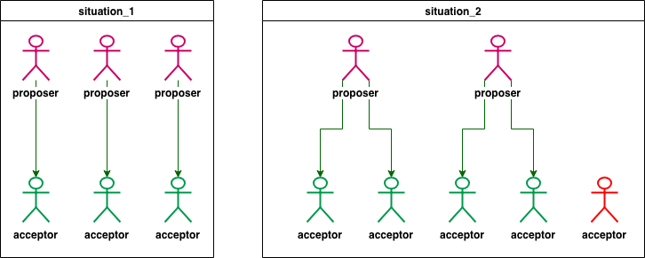

# 1 Introduction 

The Paxos algorithm for implementing a fault-tolerant distributed system has been regarded as difficult to understand, perhaps because the original presentation was Greek to many readers [5]. In fact, it is among the simplest and most obvious of distributed algorithms. At its heart is a consensus algorithm—the “synod” algorithm of [5]. The next section shows that this consensus algorithm follows almost unavoidably from the properties we want it to satisfy. The last section explains the complete Paxos algorithm, which is obtained by the straightforward application of consensus to the state ma- chine approach for building a distributed system—an approach that should be well-known, since it is the subject of what is probably the most often-cited article on the theory of distributed systems [4]. 

# 2 The Consensus Algorithm 

## 2.1 The Problem 

Assume a collection of processes that can propose values. **A consensus algorithm ensures that a single one among the proposed values is chosen. If no value is proposed, then no value should be chosen. If a value has been chosen, then processes should be able to learn the chosen value.** The safety requirements for consensus are: 

* **Only a value that has been proposed may be chosen,** 
* **Only a single value is chosen, and** 
* **A process never learns that a value has been chosen unless it actually has been.** 

We won’t try to specify precise精确的 liveness活性 requirements. However, the goal is to ensure that some proposed value is eventually最终地 chosen and, if a value has been chosen, then a process can eventually learn the value. 

> 这里要注意 proposed：提议 与 chosen：选定 2种形态

We let the three roles in the consensus algorithm be performed by three classes of agents: ***proposers***, ***acceptors***, and ***learners***. In an implementation, <u>a single process may act as more than one agen</u>t, but the mapping from agents to processes does not concern us here. 

Assume that agents can communicate with one another by sending messages. We use the **customary asynchronous, non-Byzantine model**非拜占庭模型, in which: 
* **Agents operate at arbitrary speed, may fail by stopping, and may restart. Since all agents may fail after a value is chosen and then restart, a solution is impossible unless some information can be remembered by an agent that has failed and restarted.** 
* **Messages can take arbitrarily long to be delivered送达, can be duplicated, and can be lost, but they are not corrupted损坏.** 

## 2.2 Choosing a Value 

The easiest way to choose a value is to have a single acceptor agent. A proposer sends a proposal to the acceptor, who chooses the first proposed value that it receives. Although虽然 simple, this solution is unsatisfactory不能令人满意的 because the failure of the acceptor makes any further progress impossible. 

So, let’s try another way of choosing a value. Instead of a single acceptor, let’s **use multiple acceptor agents**. A proposer sends a proposed value to a set of acceptors. An acceptor may accept the proposed value. **The value is chosen when a large enough set of acceptors have accepted it**. How large is large enough? To ensure that only a single value is chosen, **we can let a large enough set consist of any majority of the agents. Because any two majorities have at least one acceptor in common, this works if an acceptor can accept at most one value. 在一个acceptor最多接受一个元素的情况下这个方法是有效的** (There is an obvious显而易见 generalization结论 of a majority that has been observed评论 in numerous众多 papers, apparently starting with [3].) 

In the absence of在没有 failure or message loss, we want a value to be chosen even if only one value is proposed by a single proposer. This suggests the requirement: 

**P1.  An acceptor must accept the <u>first</u> proposal that it receives.**

But this requirement raises a problem. Several values could be proposed by different proposers at about the same time, leading to a situation in which every acceptor has accepted a value, but no single value is accepted by a majority of them. Even with just two proposed values, if each is accepted by about half the acceptors, failure of a single acceptor could make it impossible to learn which of the values was chosen. 

P1 and the requirement that a value is chosen only when it is accepted by a majority of acceptors imply that **an acceptor must be allowed to accept more than one proposal**. We keep track of the different **proposals(这里的proposals是提议版本的意思)** that an acceptor may accept by **assigning a (natural自然数) number to each proposal**, so a proposal consists of **a proposal number** and **a value**. To prevent confusion不确定性, we require that <u>different **proposals** have different numbers</u>. How this is achieved depends on the implementation, so for now we just assume it. A value is chosen when a single proposal with that value has been accepted by a majority of the acceptors. In that case, we say that the proposal (as well as its value) has been chosen. 

> 这一段，前一部分指的是，在某一版proposals 中，可能因为很多原因失败，所以，我们需要重新发起proposals，由于重新发起的时候，某一个特定的 proposal 可能又被发送到之前proposals中已经发送过了的一个 acceptor，所以，我们必须要让 acceptor 对某一个 proposal 能够接受多次，我们用一个自然数 来表示不同的 proposals 版本。所以我们发送的 特定的 proposal  实际上包含2个字段 [proposals version, value]

We can allow multiple proposals to be chosen, but we must guarantee that all chosen proposals have the same value. By induction on the proposal number, it suffices to guarantee: 

P2. If a proposal with value v is chosen, then every higher-numbered proposal that is chosen has value v. 