# Abstract 

Raft is a consensus algorithm for managing a replicated log. It produces a result equivalent to (multi-)Paxos, and it is as efficient as Paxos, but its structure is different from Paxos; this makes Raft more understandable than Paxos and also provides a better foundation for building practical systems. In order to enhance understandability, Raft separates the key elements of consensus, such as **leader election**, **log replication**, and **safety**, and it enforces a stronger degree of coherency to reduce the number of states that must be considered. Results from a user study demonstrate that Raft is easier for students to learn than Paxos. Raft also includes a new mechanism for changing the cluster membership, which uses **overlapping majorities** to guarantee safety. 
Raft 是一种用来管理日志复制的一致性算法。它和 Paxos 的性能和功能是一样的，但是它和 Paxos 的结构不一样；这使得 Raft 更容易理解并且更易于建立实际的系统。为了提高理解性，Raft 将一致性算法分为了几个部分，例如领导选取（leader selection），日志复制（log replication）和安全性（safety），同时它使用了更强的一致性来减少了必须需要考虑的状态。从用户学习的结果来看，Raft 比 Paxos 更容易学会。Raft 还包括了一种新的机制来使得动态改变集群成员，它使用**覆盖多数**（overlapping majorities）来保证安全。

# 1 Introduction 

Consensus algorithms allow a collection of machines to work as a coherent group that can survive the failures of some of its members. Because of this, they play a key role in building reliable large-scale software systems. Paxos [15, 16] has dominated the discussion of consensus algorithms over the last decade十年: most implementations of consensus are based on Paxos or influenced影响 by it, and Paxos has become the primary vehicle公爵 used to teach students about consensus. 
一致性算法允许一组机器像一个整体一样工作，即使其中的一些机器出了错误也能正常工作。正因为此，他们扮演着建立大规模可靠的软件系统的关键角色。在过去的十年中 Paxos 一直都主导着有关一致性算法的讨论：大多数一致性算法的实现都基于它或者受它影响，并且 Paxos 也成为了教学生关于一致性知识的主要工具。

Unfortunately, Paxos is quite difficult to understand, in spite of尽管 numerous attempts to make it more approachable. Furthermore, its architecture requires complex changes to support practical systems. As a result, both system builders and students struggle头疼，吃力 with Paxos. 
不幸的是，尽管在降低它的复杂性方面做了许多努力，Paxos 依旧很难理解。并且，Paxos 需要经过复杂的修改才能应用于实际中。这些导致了系统构构建者和学生都十分头疼。

After struggling折磨 with Paxos ourselves, we set out to find a new consensus algorithm that could provide a better foundation for system building and education. Our approach was unusual in that our primary goal was *understandability*: could we define a consensus algorithm for practical systems and describe it in a way that is significantly显著地 easier to learn than Paxos? Furthermore, we wanted the algorithm to facilitate促进 the development of intuitions直觉 that are essential必不可少 for system builders. It was important not just for the algorithm to work, but for it to be obvious why it works. 
在被 Paxos 折磨之后，我们开始寻找一种在系统构建和教学上更好的新的一致性算法。我们的首要目标是让它易于理解：我们能不能定义一种面向实际系统的一致性算法并且比 Paxos 更容易学习呢？并且，我们希望这种算法能凭直觉就能明白，这对于一个系统构建者来说是十分必要的。对于一个算法，不仅仅是让它工作起来很重要，知道它是如何工作的更重要。

The result of this work is a consensus algorithm called **Raft**. In designing Raft we applied specific techniques to improve understandability, including **decomposition** (**Raft separates leader election, log replication, and safety**) and **state space reduction** (**relative to Paxos, Raft reduces the degree of nondeterminism不确定性 and the ways servers can be inconsistent with each other**). A user study with 43 students at two universities shows that Raft is significantly easier to understand than Paxos: after learning both algorithms, 33 of these students were able to answer questions about Raft better than questions about Paxos.
我们工作的结果是一种新的一致性算法，叫做 Raft。在设计 Raft 的过程中我们应用了许多专门的技巧来提升理解性，包括算法分解（分为领导选取（leader selection），日志复制（log replication）和安全性（safety））和减少状态（state space reduction）（相对于 Paxos，Raft 减少了非确定性的程度和服务器互相不一致的方式）。在两所学校的43个学生的研究中发现，Raft 比 Paxos 要更容易理解：在学习了两种算法之后，其中的33个学生回答 Raft 的问题要比回答 Paxos 的问题要好。

Raft is similar in many ways to existing consensus algorithms (most notably, Oki and Liskov’s Viewstamped Replication [29, 22]), but it has several novel features:
Raft 算法和现在一些已经有的算法在一些地方很相似（主要是 Oki 和 Liskov 的 Viewstamped Replication。但是 Raft 有几个新的特性：

* **Strong leader**: Raft uses a stronger form of leadership than other consensus algorithms. For example, log entries only flow from the leader to other servers. This simplifies the management of the replicated log and makes Raft easier to understand. 
**强领导者**（Strong Leader）：Raft 使用一种比其他算法更强的领导形式。例如，日志条目只从领导者发送向其他服务器。这样就简化了对日志复制的管理，使得 Raft 更易于理解。

* **Leader election**: Raft uses **randomized timers** to elect leaders. This adds only a small amount of mechanism to the heartbeats already required for any consensus algorithm, while resolving conflicts simply and rapidly. 
**领导选取**（Leader Selection）：Raft 使用随机定时器来选取领导者。这种方式仅仅是在所有算法都需要实现的心跳机制上增加了一点变化，它使得在解决冲突时更简单和快速。

* **Membership changes**: Raft’s mechanism for changing the set of servers in the cluster uses a new *joint consensus* approach where the **majorities of two different configurations <u>overlap during transitions</u>**. **This allows the cluster to continue operating normally during configuration changes.** 
**成员变化**（Membership Change）：Raft 为了调整集群中成员关系使用了新的联合一致性（joint consensus）的方法，这种方法中大多数不同配置的机器在转换关系的时候会交迭（overlap）。这使得在配置改变的时候，集群能够继续操作。

We believe that Raft is superior更好 to Paxos and other consensus algorithms, both for educational purposes and as a foundation for implementation. It is simpler and more understandable than other algorithms; it is described completely enough to meet the needs of a practical system; it has several opensource implementations and is used by several companies; its safety properties have been formally specified and proven; and its efficiency is comparable to other algorithms. 
我们认为，Raft 在教学方面和实际实现方面比 Paxos 和其他算法更出众。它比其他算法更简单、更容易理解；它能满足一个实际系统的需求；它拥有许多开源的实现并且被许多公司所使用；它的安全特性已经被证明；并且它的效率和其他算法相比也具有竞争力。

The remainder of the paper introduces the replicated state machine problem (Section 2), discusses the strengths and weaknesses of Paxos (Section 3), describes our general approach to understandability (Section 4), presents the Raft consensus algorithm (Sections 5–8), evaluates Raft (Section 9), and discusses related work (Section 10). 
这篇论文剩下的部分会讲如下内容：复制状态机（replicated state machine）问题（第2节），讨论 Paxos 的优缺点（第3节），讨论我们用的为了达到提升理解性的方法（第4节），陈述 Raft 一致性算法（第5~8节），评价 Raft 算法（第9节），对相关工作的讨论（第10节）。

# 2 Replicated state machines 

Consensus algorithms typically arise in the context of *replicated state machines* [37]. In this approach, state machines on a collection of servers compute identical copies of the same state and can continue operating even if some of the servers are down. Replicated state machines are used to solve a variety of fault tolerance problems in distributed systems. For example, large-scale systems that have a single cluster leader, such as GFS [8], HDFS [38], and RAMCloud [33], typically use a separate replicated state machine to manage leader election and store configuration information that must survive leader crashes. Examples of replicated state machines include Chubby [2] and ZooKeeper [11].
一致性算法是在复制状态机的背景下提出来的。在这个方法中，在一组服务器的状态机产生同样的状态的副本因此即使有一些服务器崩溃了这组服务器也还能继续执行。复制状态机在分布式系统中被用于解决许多有关容错的问题。例如，GFS，HDFS还有 RAMCloud 这些大规模的系统都是用一个单独的集群领导者，使用一个单独的复制状态机来进行领导选取和存储配置信息来应对领导者的崩溃。使用复制状态机的例子有 Chubby 和 ZooKeeper。

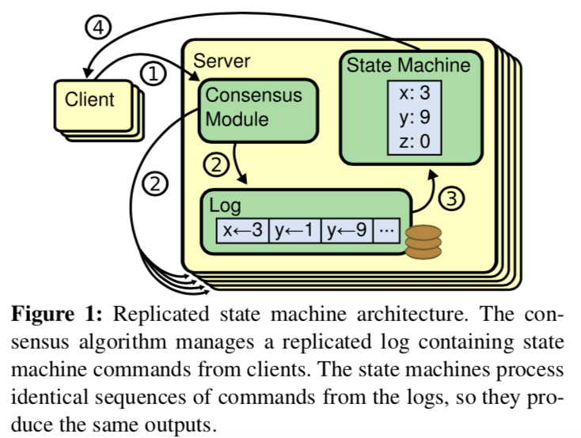

Replicated state machines are typically implemented using a **replicated log**, as shown in Figure 1. Each server stores a log containing a series of commands, which its state machine executes in order. Each log contains the same commands in the same order, so each state machine processes the same sequence of commands. Since the state machines are deterministic, each computes the same state and the same sequence of outputs.
如图-1所示，复制状态机是通过**复制日志**来实现的。每一台服务器保存着一份日志，日志中包含一系列的命令，状态机会按顺序执行这些命令。因为每一台计算机的状态机都是确定的，所以每个状态机的状态都是相同的，执行的命令是相同的，最后的执行结果也就是一样的了。

Keeping the replicated log consistent is the job of the consensus algorithm. The **consensus module** on a server receives commands from clients and adds them to its log. It communicates with the consensus modules on other servers to ensure that every log eventually contains the same requests in the same order, even if some servers fail. Once commands are properly replicated, each server’s state machine processes them in log order, and the outputs are returned to clients. As a result, the servers appear to form a single, highly reliable state machine.
如何保证复制日志一致就是一致性算法的工作了。在一台服务器上，一致性模块接受客户端的命令并且把命令加入到它的日志中。它和其他服务器上的一致性模块进行通信来确保每一个日志最终包含相同序列的请求，即使有一些服务器宕机了。一旦这些命令被正确的复制了，每一个服务器的状态机都会按同样的顺序去执行它们，然后将结果返回给客户端。最终，这些服务器看起来就像一台可靠的状态机。

Consensus algorithms for practical systems typically have the following properties:
应用于实际系统的一致性算法一般有以下特性：

- They ensure ***safety*** (never returning an incorrect result) under all non-Byzantine conditions, including network delays, partitions, and packet loss, duplication, and reordering. 
确保安全性（从来不会返回一个错误的结果），即使在所有的非拜占庭（Non-Byzantine）情况下，包括网络延迟、分区、丢包、冗余和乱序的情况下。

- They are fully functional (***available***) as long as any majority of the servers are operational and can communicate with each other and with clients. Thus, a typical cluster of five servers can tolerate the failure of any two servers. Servers are assumed to fail by stopping; they may later recover from state on stable storage and rejoin the cluster. 
高可用性，只要集群中的大部分机器都能运行，可以互相通信并且可以和客户端通信，这个集群就可用。因此，一般来说，一个拥有 5 台机器的集群可以容忍其中的 2 台的失败（fail）。服务器停止工作了我们就认为它失败（fail）了，没准一会当它们拥有稳定的存储时就能从中恢复过来，重新加入到集群中。

- They **do not depend on timing** to ensure the consistency of the logs: faulty clocks and extreme message delays can, at worst, cause availability problems.
不依赖时序保证一致性，时钟错误和极端情况下的消息延迟在最坏的情况下才会引起可用性问题。

- In the common case, a command can complete as soon as a majority of the cluster has responded to a single round of remote procedure calls; a minority of slow servers need not impact overall system performance. 
通常情况下，一条命令能够尽可能快的在大多数节点对一轮远程调用作出相应时完成，一少部分慢的机器不会影响系统的整体性能。

# 3. What’s wrong不足 with Paxos?

Over the last ten years, Leslie Lamport’s Paxos protocol [15] has become almost synonymous with consensus: it is the protocol most commonly taught in courses, and most implementations of consensus use it as a starting point. Paxos first defines a protocol capable of reaching agreement on **a single decision**, such as a single replicated log entry. We refer to this subset as ***single-decree Paxos***. Paxos then combines multiple instances of this protocol to facilitate促进 a series of decisions such as a log (*multi-Paxos*). Paxos ensures both safety and liveness, and it supports changes in cluster membership. Its correctness has been proven, and it is efficient in the normal case. 
在过去的10年中，Leslie Lamport 的 Paxos 算法几乎已经成为了一致性算法的代名词：它是授课中最常见的算法，同时也是许多一致性算法实现的起点。Paxos 首先定义了一个能够达成单一决策一致的协议，例如一个单一复制日志条目（single replicated log entry）。我们把这个子集叫做单一决策 Paxos（single-decree Paxos）。之后 Paxos通过组合多个这种协议来完成一系列的决策，例如一个日志（multi-Paxos）。Paxos 确保安全性和活跃性（liveness），并且它支持集群成员的变更。它的正确性已经被证明，通常情况下也很高效。

Unfortunately, Paxos has two significant重大的 drawbacks缺陷. The first drawback is that Paxos is exceptionally **difficult to understand**. The full explanation [15] is notoriously恶名昭著 opaque晦涩难懂; few people succeed in understanding it, and only with great effort. As a result, there have been several attempts to explain Paxos in simpler terms [16, 20, 21]. These explanations focus on the single-decree subset, yet they are still challenging. In an informal survey of attendees与会者 at NSDI 2012, we found few people who were comfortable with Paxos, even among seasoned researchers. We struggled with Paxos ourselves; we were not able to understand the complete protocol until after reading several simplified explanations and designing our own alternative protocol, a process that took almost a year. 
不幸的是，Paxos 有两个致命的缺点。第一个是 Paxos 太难以理解。它的完整的解释晦涩难懂；很少有人能完全理解，只有少数人在付诸很大努力的情况下才成功的读懂了它。因此，已经有一些尝试用简单的术语来描述它。尽管这些解释都关注于单一决策子集问题，但仍具有挑战性。在 NSDI 2012 会议上的一次非正式调查显示，我们发现大家对 Paxos 都感到不满意，其中甚至包括一些有经验的研究员。我们自己也曾深陷其中，我们在读过几篇简化它的文章并且设计了我们自己的算法之后才完全理解了 Paxos，而整个过程花费了将近一年的时间。

We hypothesize that Paxos’ opaqueness derives from its choice of the single-decree subset as its foundation. Single-decree Paxos is dense and subtle: it is divided into two stages that do not have simple intuitive explanations and cannot be understood independently. Because of this, it is difficult to develop intuitions about why the single-decree protocol works. The composition rules for multi-Paxos add significant additional complexity and subtlety. We believe that the overall problem of reaching consensus on multiple decisions (i.e., a log instead of a single entry) can be decomposed in other ways that are more direct and obvious. 
我们假定 Paxos 的晦涩来源于它将单决策子集作为它的基础。单决策（Single-decree）Paxos 是晦涩且微妙的：它被划分为两个没有简单直观解释的阶段，并且难以独立理解。正因为如此，它不能很直观的让我们知道为什么单一决策协议能够工作。为多决策 Paxos 设计的规则又添加了额外的复杂性和精巧性。我们相信多决策问题能够分解为其它更直观的方式。

The second problem with Paxos is that it **does not provide a good foundation for building practical implementations**. One reason is that there is no widely agreedupon algorithm for multi-Paxos. Lamport’s descriptions are mostly about single-decree Paxos; he sketched possible approaches to multi-Paxos, but many details are missing. There have been several attempts to flesh out and optimize Paxos, such as [26], [39], and [13], but these differ from each other and from Lamport’s sketches. Systems such as Chubby [4] have implemented Paxos-like algorithms, but in most cases their details have not been published. 
Paxos 的第二个缺点是它没有为构建实际实现提供一个良好的基础。其中一个原因是，对于多决策 Paxos （multi-Paxos） ，大家还没有一个一致同意的算法。Lamport 的描述大部分都是有关于单决策 Paxos （single-decree Paxos）；他仅仅描述了实现多决策的可能的方法，缺少许多细节。有许多实现 Paxos 和优化 Paxos 的尝试，但是他们都和 Lamport 的描述有些出入。例如，Chubby 实现的是一个类似 Paxos 的算法，但是在许多情况下的细节没有公开

Furthermore, the Paxos architecture is a poor one for building practical systems; this is another consequence of the single-decree decomposition. For example, there is little benefit to choosing a collection of log entries independently and then melding them into a sequential log; this just adds complexity. It is simpler and more efficient to design a system around a log, where new entries are appended sequentially in a constrained order. Another problem is that Paxos uses a symmetric peer-to-peer approach at its core (though it eventually suggests a weak form of leadership as a performance optimization). This makes sense in a simplified world where only one decision will be made, but few practical systems use this approach. **If a series of decisions must be made, it is simpler and faster to first elect a leader, then have the leader coordinate the decisions.** 
另外，Paxos 的结构也是不容易在一个实际系统中进行实现的，这是单决策问题分解带来的又一个问题。例如，从许多日志条目中选出条目然后把它们融合到一个序列化的日志中并没有带来什么好处，它仅仅增加了复杂性。围绕着日志来设计一个系统是更简单、更高效的：新日志按照严格的顺序添加到日志中去。另一个问题是，Paxos 使用对等的点对点的实现作为它的核心（尽管它最终提出了一种弱领导者的形式来优化性能）。这种方法在只有一个决策被制定的情况下才显得有效，但是很少有现实中的系统使用它。如果要做许多的决策，选择一个领导人，由领带人来协调是更简单有效的方法

As a result, practical systems bear little resemblance几乎没有相似之处 to Paxos. Each implementation begins with Paxos, discovers the difficulties in implementing it, and then develops a significantly different architecture. This is time-consuming and error-prone, and the difficulties of understanding Paxos exacerbate恶化 the problem. Paxos’ formulation may be a good one for proving theorems about its correctness, but real implementations are so different from Paxos that the proofs have little value. The following com- ment from the Chubby implementers is typical: 
因此，在实际的系统应用中和 Paxos 算法都相差很大。所有开始于 Paxos 的实现都会遇到很多问题，然后由此衍生出了许多与 Paxos 有很大不同的架构。这是既费时又容易出错的，并且理解 Paxos 的难以理解又恶化了这些问题。Paxos 算法在它正确性的理论证明上是很好的，但是在实现上的价值就远远不足了。来自 Chubby 的实现的一条评论就能够说明：

> There are significant gaps between the description of the Paxos algorithm and the needs of a real-world system. . . . the final system will be based on an unproven protocol [4]. 
> Paxos 算法的描述与实际实现之间存在巨大的鸿沟…最终的系统往往建立在一个没有被证明的算法之上。

Because of these problems, we concluded that Paxos does not provide a good foundation either for system building or for education. Given the importance of consensus in large-scale software systems, we decided to see if we could design an alternative consensus algorithm with better properties than Paxos. Raft is the result of that experiment. 
正因为存在这些问题，我们认为 Paxos 不仅对于系统的构建者来说不友好，同时也不利于教学。鉴于一致性算法对于大规模软件系统的重要性，我们决定试着来设计一种另外的比 Paxos 更好的一致性算法。Raft 就是这样的一个算法。

# 4 Designing for understandability

We had several goals in designing Raft: it must provide a complete and practical foundation for system building, so that it significantly reduces the amount of design work required of developers; it must be safe under all conditions and available under typical operating conditions; and it must be efficient for common operations. But our most important goal—and most difficult challenge—was *understandability*. It must be possible for a large audience to understand the algorithm comfortably. In addition, it must be possible to develop intuitions直观的认识 about the algorithm, so that system builders can make the extensions that are inevitable难免的 in real-world implementations.  				 			 	
设计 Raft 的目标有如下几个：它必须提供一个完整的、实际的基础来进行系统构建，为的是减少开发者的工作；它必须在所有情况下都能保证安全可用；它对于常规操作必须高效；最重要的目标是：易于理解，它必须使得大多数人能够很容易的理解；另外，它必须能让开发者有一个直观的认识，这样才能使系统构建者们去对它进行扩展。

There were numerous points in the design of Raft where we had to choose among alternative approaches. In these situations we evaluated the alternatives based on understandability: how hard is it to explain each alternative (for example, how complex is its state space, and does it have subtle implications?), and how easy will it be for a reader to completely understand the approach and its implications? 
在设计 Raft 的过程中，我们不得不在许多种方法中做出选择。当面临这种情况时，我们通常会**权衡可理解性**：每种方法的可理解性是如何的？（例如，它的状态空间有多复杂？它是不是有很细微的含义？）它的可读性如何？读者能不能轻易地理解这个方法和它的含义？

We recognize that there is a high degree of subjectivity主管性 in such analysis; nonetheless, we used two techniques that are generally applicable. The first technique is the well-known approach of problem decomposition: wherever possible, we divided problems into separate pieces that could be solved, explained, and understood relatively independently. For example, in Raft we separated leader election, log replication, safety, and membership changes. 
我们意识到对这种可理解性的分析具有高度的主观性；尽管如此，我们使用了两种适用的方式。第一种是众所周知的**问题分解**：我们尽可能将问题分解成为若干个可解决的、可被理解的小问题。例如，在 Raft 中，我们把问题分解成为了领导选取（leader election）、日志复制（log replication）、安全（safety）和成员变化（membership changes）。

Our second approach was to **simplify the state space by reducing the number of states to consider**, making the system more coherent and eliminating nondeterminism where possible. Specifically, logs are not allowed to have holes, and Raft limits the ways in which logs can become inconsistent with each other. Although in most cases we tried to eliminate nondeterminism, there are some situations where nondeterminism actually improves understandability. In particular, randomized approaches introduce nondeterminism, but they tend to reduce the state space by **handling all possible choices in a similar fashion** (“choose any; it doesn’t matter”). We used **randomization** to simplify the Raft leader election algorithm. 
我们采用的第二个方法是通过减少需要考虑的状态的数量将状态空间简化，这能够使得整个系统更加一致并且尽可能消除不确定性。特别地，日志之间不允许出现空洞，并且 Raft 限制了限制了日志不一致的可能性。尽管在大多数情况下，我们都都在试图消除不确定性，但是有时候有些情况下，不确定性使得算法更易理解。尤其是，随机化方法使得不确定性增加，但是它通过以相似的方式来处理所有可能的选择，从而减少了状态空间。我们使用随机化来简化了 Raft 中的领导选取算法。

# 5 The Raft consensus algorithm

Raft is an algorithm for managing a replicated log of the form described in Section 2. Figure 2 summarizes the algorithm in condensed form for reference, and Figure 3 lists key properties of the algorithm; the elements of these figures are discussed piecewise over the rest of this section. 
Raft 是一种用来管理第 2 章中提到的复制日志的算法。表-2 为了方便参考是一个算法的总结版本，表-3 列举了算法中的关键性质；表格中的这些元素将会在这一章剩下的部分中分别进行讨论。

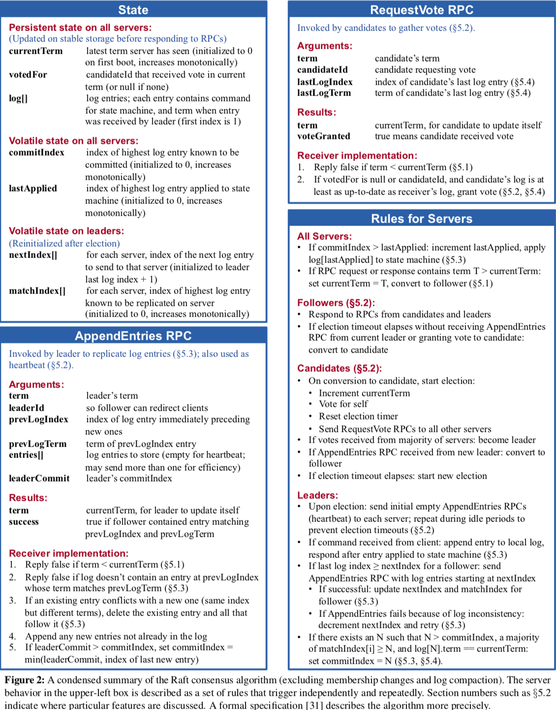

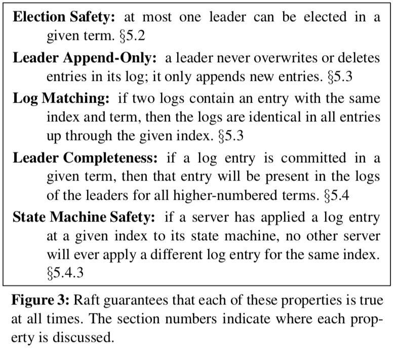

Raft implements consensus by first electing a distinguished ***leader***, then giving the leader complete responsibility for managing the replicated log. The leader accepts log entries from clients, replicates them on other servers, and tells servers when it is safe to apply log entries to their state machines. Having a leader simplifies the management of the replicated log. For example, the leader can decide where to place new entries in the log without consulting other servers, and data flows in a simple fashion from the leader to other servers. A leader can fail or be- come disconnected from the other servers, in which case a new leader is elected. 
Raft 通过首先选出一个领导人来实现一致性，然后给予领导人完全管理复制日志（replicated log）的责任。领导人接收来自客户端的日志条目，并把它们复制到其他的服务器上，领带人还要告诉服务器们什么时候将日志条目应用到它们的状态机是安全的。通过选出领导人能够简化复制日志的管理工作。例如，领导人能够决定将新的日志条目放到哪，而并不需要和其他的服务器商议，数据流被简化成从领导人流向其他服务器。如果领导人宕机或者和其他服务器失去连接，就可以选取下一个领导人。

Given the leader approach, Raft decomposes the consensus problem into three relatively independent subproblems, which are discussed in the subsections that follow: 
通过选出领导人，Raft 将一致性问题分解成为三个相对独立的子问题：

* **Leader election**: a new leader must be chosen when an existing leader fails (Section 5.2). 
领导人选取（Leader election）： 在一个领导人宕机之后必须要选取一个新的领导人（5.2节）
* **Log replication**: the leader must accept log entries  from clients and replicate them across the cluster, forcing the other logs to agree with its own (Section 5.3). 
日志复制（Log replication）： 领导人必须从客户端接收日志然后复制到集群中的其他服务器，并且强制要求其他服务器的日志保持和自己相同
*  **Safety**: the key safety property for Raft is the State Machine Safety Property in Figure 3: if any server has applied a particular log entry to its state machine, then no other server may apply a different command for the same log index. Section 5.4 describes how Raft ensures this property; the solution involves an additional restriction on the election mechanism described in Section 5.2. 
安全性（Safety）： Raft 的关键的安全特性是 表-3 中提到的状态机安全原则（State Machine Safety）:如果一个服务器已经将给定索引位置的日志条目应用到状态机中，则所有其他服务器不会在该索引位置应用不同的条目。5.4节阐述了 Raft 是如何保证这条原则的，解决方案涉及到一个对于选举机制另外的限制，这一部分会在 5.2节 中说明。

After presenting the consensus algorithm, this section discusses the issue of availability and the role of timing in the system. 
在说明了一致性算法之后，本章会讨论有关可用性（availability）的问题和系统中时序（timing）的问题。

## 5.1 Raft basics

A Raft cluster contains several servers; five is a typical number, which allows the system to tolerate two failures. At any given time each server is in one of three states: *leader*, *follower*, or *candidate*. In normal operation there is exactly one leader and all of the other servers are followers. Followers are passive: they issue no requests on their own but simply respond to requests from leaders and candidates. The leader handles all client requests (if a client contacts a follower, the follower redirects it to the leader). The third state, candidate, is used to elect a new leader as described in Section 5.2. Figure 4 shows the states and their transitions; the transitions are discussed below. 
一个 Raft 集群包括若干服务器；对于一个典型的 5 服务器集群，该集群能够容忍 2 台机器不能正常工作，而整个系统保持正常。在任意的时间，每一个服务器一定会处于以下三种状态中的一个：领导人、候选人、追随者。在正常情况下，只有一个服务器是领导人，剩下的服务器是追随者。追随者们是被动的：他们不会发送任何请求，只是响应来自领导人和候选人的请求。领导人来处理所有来自客户端的请求（如果一个客户端与追随者进行通信，追随者会将信息发送给领导人）。候选人是用来选取一个新的领导人的，这一部分会在 5.2节 进行阐释。图-4 阐述了这些状态，和它们之间的转换；它们的转换会在下边进行讨论。

Raft divides time into *terms* of arbitrary length, as shown in Figure 5. Terms are numbered with consecutive integers. Each term begins with an *election*, in which one or more candidates attempt to become leader as described in Section 5.2. If a candidate wins the election, then it serves as leader for the rest of the term. In some situations an election will result in a split vote. In this case the term will end with no leader; a new term (with a new election) will begin shortly. Raft ensures that there is at most one leader in a given term. 
如 图-5 所示，Raft 算法将时间划分成为任意不同长度的任期（term）。任期用连续的数字进行表示。每一个任期的开始都是一次选举（election），就像 5.2节 所描述的那样，一个或多个候选人会试图成为领导人。如果一个候选人赢得了选举，它就会在该任期的剩余时间担任领导人。在某些情况下，选票会被瓜分，有可能没有选出领导人，那么，将会开始另一个任期，并且立刻开始下一次选举。Raft 算法保证在给定的一个任期最少要有一个领导人。

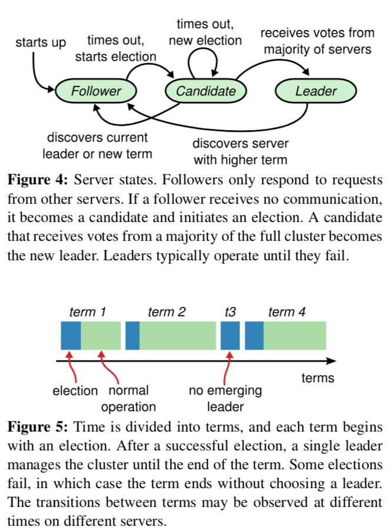

>图-4：服务器的状态。追随者只响应其他服务器的请求。如果追随者没有收到任何消息，它会成为一个候选人并且开始一次选举。收到大多数服务器投票的候选人会成为新的领导人。领导人在它们宕机之前会一直保持领导人的状态。
 图-5：时间被分为一个个的任期（term），每一个任期的开始都是领导人选举。在成功选举之后，一个领导人会在任期内管理整个集群。如果选举失败，该任期就会因为没有领带人而结束。这个转变会在不同的时间的不同服务器上观察到。

Different servers may observe the transitions between terms at different times, and in some situations a server may not observe an election or even entire terms. **Terms act as a logical clock [14] in Raft, and they allow servers to detect obsolete废弃 information such as stale leaders. Each server stores a *current term* number, which increases monotonically over time. Current terms are exchanged whenever servers communicate; if one server’s current term is smaller than the other’s, then it updates its current term to the larger value. If a candidate or leader discovers that its term is out of date, it immediately reverts to follower state. If a server receives a request with a stale term number, it rejects the request.** 
不同的服务器可能会在不同的时间内观察到任期之间的的转换，在某些情况下，甚至整个完整的任期内，一台服务器都可能看不到一次选举。任期在 Raft 中充当逻辑时钟的角色，并且它们允许服务器检测过期的信息，比如过时的领导人。每一台服务器都存储着一个当前任期的数字，这个数字会单调的增加。当服务器之间进行通信时，会互相交换当前任期号；如果一台服务器的当前任期号比其它服务器的小，则更新为较大的任期号。如果一个候选人或者领导人意识到它的任期号过时了，它会立刻转换为追随者状态。如果一台服务器收到的请求的任期号是过时的，那么它会拒绝此次请求。

Raft servers communicate using remote procedure calls (RPCs), and the basic consensus algorithm requires only two types of RPCs. RequestVote RPCs are initiated by candidates during elections (Section 5.2), and Append- Entries RPCs are initiated by leaders to replicate log entries and to provide a form of heartbeat (Section 5.3). Section 7 adds a third RPC for transferring snapshots between servers. Servers retry RPCs if they do not receive a response in a timely manner, and they issue RPCs in parallel for best performance. 
Raft 中的服务器通过远程过程调用（RPC）来通信，基本的 Raft 一致性算法仅需要 2 种 RPC。RequestVote RPC 是候选人在选举过程中触发的（5.2节），AppendEntries RPC 是领导人触发的，为的是复制日志条目和提供一种心跳（heartbeat）机制（5.3节）。第7章加入了第三种 RPC 来在各个服务器之间传输快照（snapshot）。如果服务器没有及时收到 RPC 的响应，它们会重试，并且它们能够并行的发出 RPC 来获得最好的性能。

## 5.2 Leader election 

Raft uses a heartbeat mechanism to trigger leader election. When servers start up, they begin as followers. A server remains in follower state as long as it receives valid RPCs from a leader or candidate. Leaders send periodic heartbeats (AppendEntries RPCs that carry no log entries) to all followers in order to maintain their authority. If a follower receives no communication over a period of time called the *election timeout*, then it assumes there is no viable leader and begins an election to choose a new leader. 
Raft 使用一种心跳机制（heartbeat）来触发领导人的选取。当服务器启动时，它们会初始化为追随者。服务器会一直保持追随者的状态只要它们能够收到来自领导人或者候选人的有效 RPC。领导人会向所有追随者周期性发送心跳（heartbeat，不带有任何日志条目的 AppendEntries RPC）来保证它们的领导人地位。如果一个追随者在一个周期内没有收到心跳信息，就叫做选举超时（election timeout）,然后它就会假定没有可用的领导人并且开始一次选举来选出一个新的领导人。

To begin an election, a follower increments its current term and transitions to candidate state. It then votes for itself and issues RequestVote RPCs in parallel to each of the other servers in the cluster. A candidate continues in this state until one of three things happens: (a) it wins the election, (b) **another server establishes itself as leader**, or (c) a period of time goes by with no winner. These outcomes are discussed separately in the paragraphs below. 
为了开始选举，一个追随者会自增它的当前任期并且转换状态为候选人。然后，它会给自己投票并且给集群中的其他服务器发送 RequestVote RPC。一个候选人会一直处于该状态，直到下列三种情形之一发生：a.它赢得了选举；b.另一台服务器赢得了选举；c.一段时间后没有任何一台服务器赢得了选举。这些情形会在下面的章节中分别讨论。

A candidate wins an election if it receives votes from a **majority** of the servers in the full cluster for the same term. Each server will vote for at most one candidate in a given term, on a **first-come-first-served basis** (note: Sec- tion 5.4 adds an additional restriction on votes). The majority rule ensures that at most one candidate can win the election for a particular term (the Election Safety Property in Figure 3). Once a candidate wins an election, it becomes leader. It then sends heartbeat messages to all of the other servers to establish its authority and prevent new elections. 
一个候选人如果在一个任期内收到了来自集群中大多数服务器的投票就会赢得选举。在一个任期内，一台服务器最多能给一个候选人投票，按照先到先服务原则（first-come-first-served）（注意：在 5.4节 针对投票添加了一个额外的限制）。大多数原则使得在一个任期内最多有一个候选人能赢得选举（表-3 中提到的选举安全原则）。一旦有一个候选人赢得了选举，它就会成为领导人。然后它会像其他服务器发送心跳信息来建立自己的领导地位并且组织新的选举。

While waiting for votes, a candidate may receive an AppendEntries RPC from another server claiming to be leader. If the leader’s term (included in its RPC) is at least as large as the candidate’s current term, then the candidate recognizes the leader as legitimate合法 and returns to follower state. If the term in the RPC is smaller than the candidate’s current term, then the candidate rejects the RPC and continues in candidate state. 
当一个候选人等待别人的选票时，它有可能会收到来自其他服务器发来的声明其为领导人的 AppendEntries RPC。如果这个领导人的任期（包含在它的 RPC 中）比当前候选人的当前任期要大，则候选人认为该领导人合法，并且转换自己的状态为追随者。如果在这个 RPC 中的任期小于候选人的当前任期，则候选人会拒绝此次 RPC， 继续保持候选人状态。

The third possible outcome is that a candidate neither wins nor loses the election: if many followers become candidates at the same time, votes could be split so that no candidate obtains a majority. When this happens, each candidate will time out and start a new election by incrementing its term and initiating another round of Request- Vote RPCs. However, without extra measures split votes could repeat indefinitely. 
第三种情形是一个候选人既没有赢得选举也没有输掉选举：如果许多追随者在同一时刻都成为了候选人，选票会被分散，可能没有候选人能获得大多数的选票。当这种情形发生时，每一个候选人都会超时，并且通过自增任期号和发起另一轮 RequestVote RPC 来开始新的选举。然而，如果没有其它手段来分配选票的话，这种情形可能会无限的重复下去。

Raft uses **randomized election timeouts** to ensure that split votes are rare and that they are resolved quickly. To prevent split votes in the first place, election timeouts are chosen randomly from a fixed interval (e.g., 150–300ms). This spreads out错开 the servers so that in most cases only a single server will time out; it wins the election and sends heartbeats before any other servers time out. The same mechanism is used to handle split votes. Each candidate restarts its randomized election timeout at the start of an election, and it waits for that timeout to elapse before starting the next election; this reduces the likelihood可能性 of another split vote in the new election. Section 9.3 shows that this approach elects a leader rapidly. 
Raft 使用随机的选举超时时间来确保第三种情形很少发生，并且能够快速解决。为了防止在一开始是选票就被瓜分，选举超时时间是在一个固定的间隔内随机选出来的（例如，150~300ms）。这种机制使得在大多数情况下只有一个服务器会率先超时，它会在其它服务器超时之前赢得选举并且向其它服务器发送心跳信息。同样的机制被用于选票一开始被瓜分的情况下。每一个候选人在开始一次选举的时候会重置一个随机的选举超时时间，在超时进行下一次选举之前一直等待。这能够减小在新的选举中一开始选票就被瓜分的可能性。9.3节 展示了这种方法能够快速的选出一个领导人。

Elections are an example of how understandability guided our choice between design alternatives. Initially we planned to use a ranking system: each candidate was assigned a unique rank, which was used to select between competing candidates. If a candidate discovered another candidate with higher rank, it would return to follower state so that the higher ranking candidate could more easily win the next election. We found that this approach created subtle issues around availability (a lower-ranked server might need to time out and become a candidate again if a higher-ranked server fails, but if it does so too soon, it can reset progress towards electing a leader). We made adjustments to the algorithm several times, but after each adjustment new corner cases appeared. Eventually we concluded that the randomized retry approach is more obvious and understandable. 
选举是一个理解性引导我们设计替代算法的一个例子。最开始时，我们计划使用一种排名系统：给每一个候选人分配一个唯一的排名，用于在竞争的候选人之中选择领导人。如果一个候选人发现了另一个比它排名高的候选人，那么它会回到追随者的状态，这样排名高的候选人会很容易地赢得选举。但是我们发现这种方法在可用性方面有一点问题（一个低排名的服务器在高排名的服务器宕机后，需要等待超时才能再次成为候选人，但是如果它这么做的太快，它能重置选举领导人的过程）。我们对这个算法做了多次调整，但是每次调整后都会出现一些新的问题。最终我们认为随机重试的方法是更明确并且更易于理解的。

## 5.3 Log replication

Once a leader has been elected, it begins servicing client requests. Each client request contains a command to be executed by the replicated state machines. The leader appends the command to its log as a new entry, then issues AppendEntries RPCs in parallel to each of the other servers to replicate the entry. When the entry has been safely replicated (as described below), the leader applies the entry to its state machine and returns the result of that execution to the client. If followers crash or run slowly, or if network packets are lost, the leader retries Append- Entries RPCs indefinitely (even after it has responded to the client) until all followers eventually store all log entries. 
一旦选出了领导人，它就开始服务客户端的请求。每一个客户端请求都包含一条需要被副本状态机（replicated state machine）执行的命令。领导人把这条命令作为新的日志条目加入到它的日志中去，然后并行的向其他服务器发起 AppendEntries RPC ，要求其它服务器备份这个条目。当这个条目被安全的备份之后（下面的部分会详细阐述），领导人会将这个条目应用到它的状态机中并且会向客户端返回执行结果。如果追随者崩溃了或者运行缓慢或者是网络丢包了，领导人会无限的重试 AppendEntries RPC（甚至在它向客户端响应之后）直到所有的追随者最终存储了所有的日志条目。

>图-6：日志由有序编号的日志条目组成。每个日志条目包含它被创建时的任期号（每个方块中的数字），并且包含用于状态机执行的命令。如果一个条目能够被状态机安全执行，就被认为可以提交了。

Logs are organized as shown in Figure 6. Each log entry stores a state machine command along with the term number when the entry was received by the leader. The term numbers in log entries are used to detect inconsistencies between logs and to ensure some of the properties in Figure 3. **Each log entry also has an integer index identifying its position in the log**. 
日志就像 图-6 所示那样组织的。每个日志条目存储着一条被状态机执行的命令和当这条日志条目被领导人接收时的任期号。日志条目中的任期号用来检测在不同服务器上日志的不一致性，并且能确保 图-3 中的一些特性。每个日志条目也包含一个整数索引来表示它在日志中的位置。

The leader decides when it is safe to apply a log entry to the state machines; such an entry is called ***committed***. Raft guarantees that committed entries are durable持久 and will **eventually** be executed by all of the available state machines. A log entry is committed once the leader that created the entry has replicated it on a majority of the servers (e.g., entry 7 in Figure 6). This also commits all preceding entries in the leader’s log, including entries created by previous leaders. Section 5.4 discusses some subtleties when applying this rule after leader changes, and it also shows that this definition of commitment is safe. The leader keeps track of the highest index it knows to be committed, and it includes that index in future AppendEntries RPCs (including heartbeats) so that the other servers eventually find out. Once a follower learns that a log entry is committed, it applies the entry to its local state machine (in log order). 
领导人决定什么时候将日志条目应用到状态机是安全的；这种条目被称为可被提交（commited）。Raft 保证可被提交（commited）的日志条目是持久化的并且最终会被所有可用的状态机执行。一旦被领导人创建的条目已经复制到了大多数的服务器上，这个条目就称为commited（例如，图-6中的7号条目）。领导人日志中之前的条目都是可被提交的（commited），包括由之前的领导人创建的条目。5.4节将会讨论当领导人更替之后这条规则的应用问题的细节，并且也讨论了这种提交方式是安全的。领导人跟踪记录它所知道的被提交条目的最大索引值，并且这个索引值会包含在之后的 AppendEntries RPC 中（包括心跳 heartbeat 中），为的是让其他服务器都知道这条条目已经提交。一旦一个追随者知道了一个日志条目已经被提交，它会将该条目应用至本地的状态机（按照日志顺序）。

We designed the Raft log mechanism to maintain a high level of coherency between the logs on different servers. Not only does this simplify the system’s behavior and make it more predictable, but it is an important component of ensuring safety. Raft maintains the following properties, which together constitute the Log Matching Property in Figure 3: 
我们设计了 Raft 日志机制来保证不同服务器上日志的一致性。这样做不仅简化了系统的行为使得它更可预测，并且也是保证安全性不可或缺的一部分。Raft 保证以下特性，并且也保证了 表-3 中的日志匹配原则（Log Matching Property）:

• If two entries in different logs have the same index and term, then they store the same command. 
如果在不同日志中的两个条目有着相同的索引和任期号，则它们所存储的命令是相同的。

• If two entries in different logs have the same index and term, then the logs are identical完全相同 in all preceding在…前面 entries. 
如果在不同日志中的两个条目有着相同的索引和任期号，则它们之前的所有条目都是完全一样的。

The first property follows from the fact that a leader creates at most one entry with a given log index in a given term, and log entries never change their position in the log. The second property is guaranteed by a simple consistency check performed by AppendEntries. **When sending an AppendEntries RPC, the leader includes the index and term of the entry in its log that immediately precedes紧接之前的 the new entries. If the follower does not find an entry in its log with the same index and term, then it refuses the new entries**. The consistency check acts as an induction step: the initial empty state of the logs satisfies the Log Matching Property, and the consistency check preserves the Log Matching Property whenever logs are extended. As a result, whenever AppendEntries returns successfully, the leader knows that the follower’s log is identical to its own log up through the new entries. 
第一条特性源于领导人在一个任期里在给定的一个日志索引位置最多创建一条日志条目，同时该条目在日志中的位置也从来不会改变。第二条特性源于 AppendEntries 的一个简单的一致性检查。当发送一个 AppendEntries RPC 时，领导人会把新日志条目紧接着之前的条目的索引位置和任期号都包含在里面。如果追随者没有在它的日志中找到相同索引和任期号的日志，它就会拒绝新的日志条目。这个一致性检查就像一个归纳步骤：一开始空的日志的状态一定是满足日志匹配原则的，一致性检查保证了当日志添加时的日志匹配原则。因此，只要 AppendEntries 返回成功的时候，领导人就知道追随者们的日志和它的是一致的了。

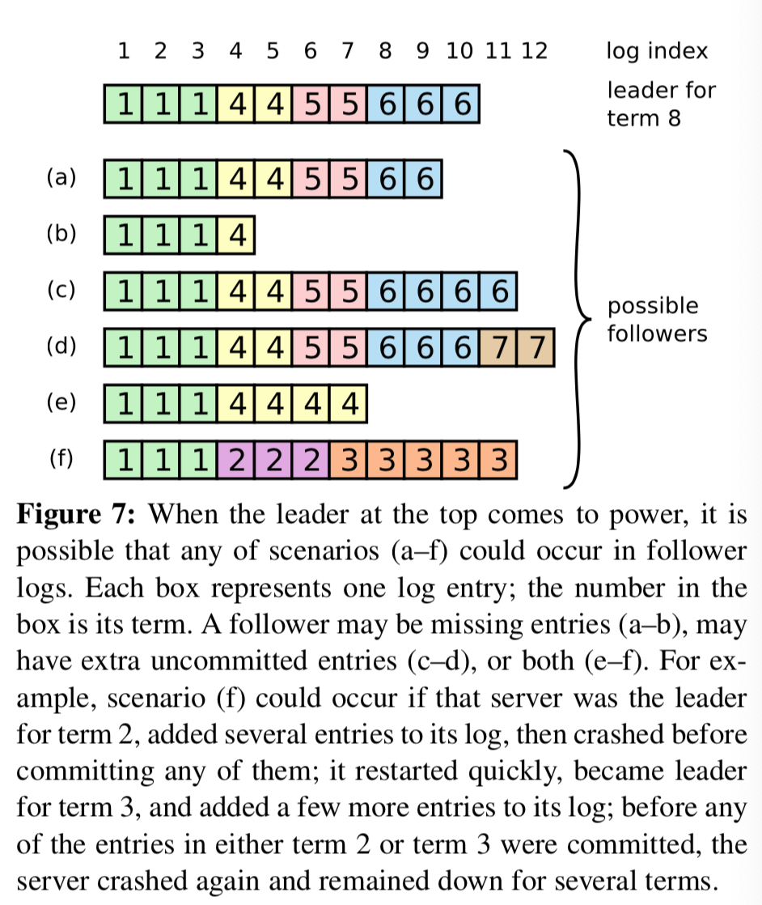
>图-7：当最上边的领导人掌权之后，追随者日志可能有以下情况（a~f）。一个格子表示一个日志条目；格子中的数字是它的任期。一个追随者可能会丢失一些条目（a, b）；可能多出来一些未提交的条目（c, d）；或者两种情况都有（e, f）。例如，场景 f 在如下情况下就会发生：如果一台服务器在任期2时是领导人并且往它的日志中添加了一些条目，然后在将它们提交之前就宕机了，之后它很快重启了，成为了任期3的领导人，又往它的日志中添加了一些条目，然后在任期2和任期3中的条目提交之前它又宕机了并且几个任期内都一直处于宕机状态。

During normal operation, the logs of the leader and followers stay consistent, so the AppendEntries consistency check never fails. However, leader crashes can leave the logs inconsistent (the old leader may not have fully replicated all of the entries in its log). These inconsistencies can compound over a series of leader and follower crashes. Figure 7 illustrates the ways in which followers’ logs may differ from that of a new leader. A follower may be missing entries that are present on the leader, it may have extra entries that are not present on the leader, or both. Missing and extraneous entries in a log may span multiple terms. 
在一般情况下，领导人和追随者们的日志保持一致，因此 AppendEntries 一致性检查通常不会失败。然而，领导人的崩溃会导致日志不一致（旧的领导人可能没有完全复制完日志中的所有条目）。这些不一致会导致一系列的领导人和追随者崩溃。图-7 阐述了一些追随者可能和新的领导人日志不同的情况。一个追随者可能会丢失掉领导人上的一些条目，也有可能包含一些领导人没有的条目，也有可能两者都会发生。丢失的或者多出来的条目可能会持续多个任期。

In Raft, the leader handles inconsistencies by **forcing the followers’ logs to duplicate its own**. This means that conflicting entries in follower logs will be overwritten with entries from the leader’s log. Section 5.4 will show that this is safe when coupled with one more restriction. 
在 Raft 算法中，领导人通过强制追随者们复制它的日志来处理日志的不一致。这就意味着，在追随者上的冲突日志会被领导者的日志覆盖。5.4节会说明当添加了一个额外的限制之后这是安全的。

To bring a follower’s log into consistency with its own, the leader must **find the latest log entry where the two logs agree, delete any entries in the follower’s log after that point, and send the follower all of the leader’s entries after that point**. <u>All of these actions happen in response to the consistency check performed by AppendEntries RPCs. The leader maintains a *nextIndex* for each follower, which is the index of the next log entry the leader will send to that follower. When a leader first comes to power, it initializes all nextIndex values to the index just after the last one in its log (11 in Figure 7). If a follower’s log is inconsistent with the leader’s, the AppendEntries consistency check will fail in the next AppendEntries RPC. After a rejection, the leader decrements nextIndex and retries the AppendEntries RPC. Eventually nextIndex will reach a point where the leader and follower logs match. When this happens, AppendEntries will succeed, which removes any conflicting entries in the follower’s log and appends entries from the leader’s log (if any). Once AppendEntries succeeds, the follower’s log is consistent with the leader’s, and it will remain that way for the rest of the term.</u> 
为了使得追随者的日志同自己的一致，领导人需要找到追随者同它的日志一致的地方，然后删除追随者在该位置之后的条目，然后将自己在该位置之后的条目发送给追随者。这些操作都在 AppendEntries RPC 进行一致性检查时完成。领导人给每一个追随者维护了一个nextIndex，它表示领导人将要发送给该追随者的下一条日志条目的索引。当一个领导人开始掌权时，它会将nextIndex初始化为它的最新的日志条目索引数+1（图-7 中的 11）。如果一个追随者的日志和领导者的不一致，AppendEntries 一致性检查会在下一次 AppendEntries RPC 时返回失败。在失败之后，领导人会将nextIndex递减然后重试 AppendEntries RPC。最终nextIndex会达到一个领导人和追随者日志一致的地方。这时，AppendEntries 会返回成功，追随者中冲突的日志条目都被移除了，并且添加所缺少的上了领导人的日志条目。一旦 AppendEntries 返回成功，追随者和领导人的日志就一致了，这样的状态会保持到该任期结束。

If desired, the protocol can be optimized to reduce the number of rejected AppendEntries RPCs. For example, when rejecting an AppendEntries request, the follower can include the term of the conflicting entry and the first index it stores for that term. With this information, the leader can decrement nextIndex to bypass all of the conflicting entries in that term; one AppendEntries RPC will be required for each term with conflicting entries, rather than one RPC per entry. In practice, we doubt this optimization is necessary, since failures happen infrequently and it is unlikely that there will be many inconsistent entries.
如果需要的话，算法还可以进行优化来减少 AppendEntries RPC 失败的次数。例如，当拒绝了一个 AppendEntries 请求，追随者可以记录下冲突日志条目的任期号和自己存储那个任期的最早的索引。通过这些信息，领导人能够直接递减nextIndex跨过那个任期内所有的冲突条目；这样的话，一个冲突的任期需要一次 AppendEntries RPC，而不是每一个冲突条目需要一次 AppendEntries RPC。在实践中，我们怀疑这种优化是否是必要的，因为AppendEntries 一致性检查很少失败并且也不太可能出现大量的日志条目不一致的情况。

With this mechanism, a leader does not need to take any special actions to restore log consistency when it comes to power. It just begins normal operation, and the logs automatically converge追平 in response to failures of the AppendEntries consistency check. A leader never overwrites or deletes entries in its own log (the Leader Append-Only Property in Figure 3).
通过这种机制，一个领导人在掌权时不需要采取另外特殊的方式来恢复日志的一致性。它只需要使用一些常规的操作，通过响应 AppendEntries 一致性检查的失败能使得日志自动的趋于一致。一个领导人从来不会覆盖或者删除自己的日志（表-3 中的领导人只增加原则）。

This log replication mechanism exhibits the desirable consensus properties described in Section 2: Raft can accept, replicate, and apply new log entries as long as a majority of the servers are up; in the normal case a new entry can be replicated with a single round of RPCs to a majority of the cluster; and a single slow follower will not impact performance.
这个日志复制机制展示了在第2章中阐述的所希望的一致性特性：Raft 能够接受，复制并且应用新的日志条目只要大部分的服务器是正常的。在通常情况下，一条新的日志条目可以在一轮 RPC 内完成在集群的大多数服务器上的复制；并且一个速度很慢的追随者并不会影响整体的性能。

## 5.4 Safety

The previous sections described how Raft elects leaders and replicates log entries. However, the mechanisms described so far are not quite sufficient to ensure that each state machine executes exactly the same commands in the same order. For example, a follower might be unavailable while the leader commits several log entries, then it could be elected leader and overwrite these entries with new ones; as a result, different state machines might execute different command sequences. 
之前的章节中讨论了 Raft 算法是如何进行领导选取和复制日志的。然而，到目前为止这个机制还不能保证每一个状态机能按照相同的顺序执行同样的指令。例如，当领导人提交了若干日志条目的同时一个追随者可能宕机了，之后它又被选为了领导人然后用新的日志条目覆盖掉了旧的那些，最后，不同的状态机可能执行不同的命令序列。

This section completes the Raft algorithm by adding a restriction on which servers may be elected leader. The restriction ensures that the leader for any given term contains all of the entries committed in previous terms (the Leader Completeness Property from Figure 3). Given the election restriction, we then make the rules for commitment more precise. Finally, we present a proof sketch for the Leader Completeness Property and show how it leads to correct behavior of the replicated state machine. 
这一节通过在领导人选取部分加入了一个限制来完善了 Raft 算法。这个限制能够保证对于固定的任期，任何的领导人都拥有之前任期提交的全部日志条目（表-3 中的领导人完全原则）。有了这一限制，日志提交的规则就更清晰了。最后，我们提出了对于领导人完全原则的简单证明并且展示了它是如何修正复制状态机的行为的。

### 5.4.1 Election restriction 选举限制

In any leader-based consensus algorithm, the leader must eventually store all of the committed log entries. In some consensus algorithms, such as Viewstamped Replication [22], a leader can be elected even if it doesn’t initially contain all of the committed entries. These algorithms contain additional mechanisms to identify the missing entries and transmit them to the new leader, either during the election process or shortly afterwards. Unfortunately, this results in considerable additional mechanism and complexity. Raft uses a simpler approach where it **guarantees that all the committed entries from previous terms are present on each new leader from the moment of its election**, without the need to transfer those entries to the leader. This means that log entries only flow in one direction, from leaders to followers, and leaders never overwrite existing entries in their logs. 
在所有的以领导人为基础的一致性算法中，领导人最终必须要存储全部已经提交的日志条目。在一些一致性算法中，例如：Viewstamped Replication，即使一开始没有包含全部已提交的条目也可以被选为领导人。这些算法都有一些另外的机制来保证找到丢失的条目并将它们传输给新的领导人，这个过程要么在选举过程中完成，要么在选举之后立即开始。不幸的是，这种方式大大增加了复杂性。Raft 使用了一种更简单的方式来保证在新选举出的领导人上包含之前任期的所有已提交的日志，而不需要将这些条目传送给新领导人。这就意味着日志条目只有一个流向：从领导人流向追随者。领导人永远不会覆盖已经存在的日志条目。

**Raft uses the voting process to prevent a candidate from winning an election unless its log contains all committed entries**. A candidate must contact a majority of the cluster in order to be elected, which means that every committed entry must be present in at least one of those servers. If the candidate’s log is at least as up-to-date as any other log in that majority (where “up-to-date” is defined precisely below), then it will hold all the committed entries. The RequestVote RPC implements this restriction: **the RPC includes information about the candidate’s log, and the voter denies its vote if its own log is more up-to-date than that of the candidate.** 
Raft 使用投票的方式来阻止没有包含全部日志条目的服务器赢得选举。一个候选人为了赢得选举必须要和集群中的大多数进行通信，这就意味着每一条已经提交的日志条目最少在其中一台服务器上出现。如果候选人的日志至少和大多数服务器上的日志一样新（up-to-date，这个概念会在下边有详细介绍），那么它一定包含有全部的已经提交的日志条目。RequestVote RPC 实现了这个限制：这个 RPC（远程过程调用）包括候选人的日志信息，如果它自己的日志比候选人的日志要新，那么它会拒绝候选人的投票请求。

Raft determines which of two logs is more up-to-date **by comparing the index and term of the last entries in the logs**. If the logs have last entries with different terms, then the log with the later term is more up-to-date. If the logs end with the same term, then whichever log is longer is more up-to-date. 
Raft 通过比较日志中最后一个条目的索引和任期号来决定两个日志哪一个更新。如果两个日志的任期号不同，任期号大的更新；如果任期号相同，更长的日志更新。

### 5.4.2 Committing entries from previous terms	提交之前任期的日志条目

As described in Section 5.3, a leader knows that an entry from its current term is committed once that entry is stored on a majority of the servers. If a leader crashes before committing an entry, future leaders will attempt to finish replicating the entry. However, **a leader cannot immediately conclude that an entry from a previous term is committed once it is stored on a majority of servers**. Figure 8 illustrates a situation where an old log entry is stored on a majority of servers, yet can still be overwritten by a future leader. 
正如 5.3节 中描述的那样，只要一个日志条目被存在了在多数的服务器上，领导人就知道当前任期就可以提交该条目了。如果领导人在提交之前就崩溃了，之后的领导人会试着继续完成对日志的复制。然而，领导人并不能马上断定上一个任期的条目已经被提交了，直到条目已经被大多数服务器存储。图-8 说明了一种情况，一条存储在了大多数服务器上的日志条目仍然被新上任的领导人覆盖了。

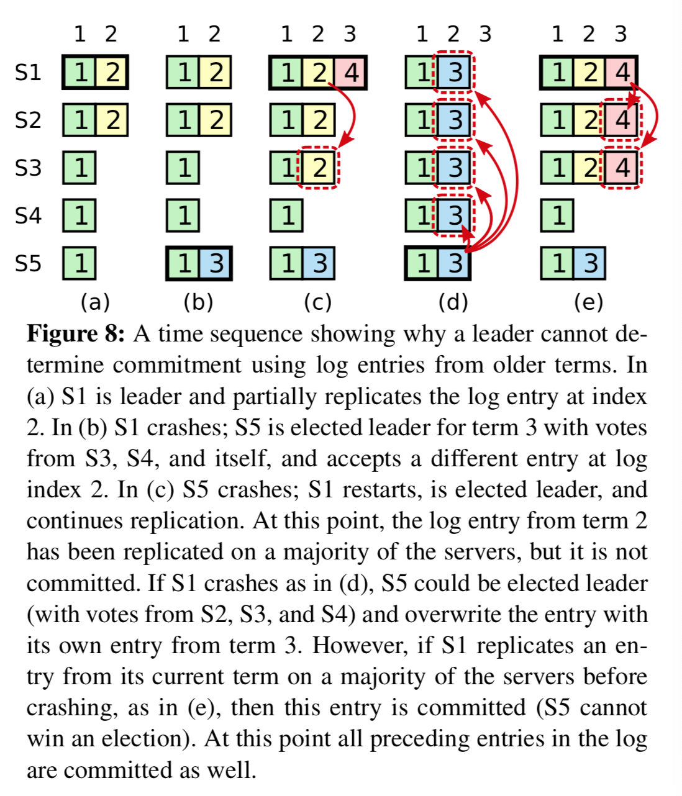

> 图-8：如图的时间序列说明了为什么领导人不能通过之前任期的日志条目判断它的提交状态。（a）中的 S1 是领导人并且部分复制了位置为2的日志条目。（b）中 S1 崩溃了；S5 通过 S3，S4 和自己的选票赢得了选举，并且在索引2上接收了另一条日志条目。（c）中 S5 崩溃了，S1 重启了，通过 S2，S3 和自己的选票赢得了选举，并且继续索引2处的复制，这时任期2的日志条目已经在大部分服务器上完成了复制，但是还并没有提交。如果在（d）时刻 S1 崩溃了，S5 会通过 S2，S3，S4 的选票成为领导人，然后用它自己在任期3的日志条目覆盖掉其他服务器的日志条目。然而，如果在崩溃之前，S1 在它的当前任期在大多数服务器上复制了一条日志条目，就像在（e）中那样，那么这条条目就会被提交（S5就不会赢得选举）。在这时，之前的日志条目就会正常被提交。

To eliminate problems like the one in Figure 8, **Raft never commits log entries from previous terms by counting replicas. Only log entries from the leader’s current term are committed by counting replicas**; once an entry from the current term has been committed in this way, then all prior entries are committed indirectly because of the Log Matching Property. There are some situations where a leader could safely conclude that an older log entry is committed (for example, if that entry is stored on every server), but Raft takes a more conservative approach for simplicity. 
为了消除 图-8 中描述的问题，Raft 从来不会通过计算副本的数目来提交之前任期的日志条目。只有领导人当前任期的日志条目才能通过计算副本数来进行提交。一旦当前任期的日志条目以这种方式被提交，那么由于日志匹配原则（Log Matching Property），所有更早的日志条目也都会被间接的提交。在某些情况下，领导人可以安全的知道一个老的日志条目是否已经被提交（例如，如果条目已经储到了每个服务器），但是 Raft 为了简化问题使用了一种更加保守的方法。

Raft incurs遭受 this extra complexity in the commitment rules because **log entries retain their original term numbers when a leader replicates entries from previous terms**. In other consensus algorithms, if a new leader re-replicates entries from prior “terms,” it must do so with its new “term number.” Raft’s approach makes it easier to reason about log entries, since they **maintain the same term number over time and across logs**. In addition, new leaders in Raft send fewer log entries from previous terms than in other algorithms (other algorithms must send redundant log entries to renumber them before they can be committed).  	
因为当领导人从之前任期复制日志条目时日志条目保留了它们最开始的任期号，所以这使得 Raft 在提交规则中增加了额外的复杂性。在其他的一致性算法中，如果一个新的领导人要从之前的任期中复制日志条目，它必须要使用当前的新任期号。Raft 的方法使得判断日志更加容易，因为它们全程都保持着同样的任期号。另外，和其它的一致性算法相比，Raft 算法中的新领导人会发送更少的之前任期的日志条目（其他算法必须要发送冗余的日志条目并且在它们被提交之前来重新排序）。

### 5.4.3 Safety argument

Given the complete Raft algorithm, we can now argue more precisely that the **Leader Completeness Property** holds (this argument is based on the safety proof; see Section 9.2). We assume that the Leader Completeness Property does not hold, then we prove a contradiction. Suppose the leader for term T (leaderT) commits a log entry from its term, but that log entry is not stored by the leader of some future term. Consider the smallest term U > T whose leader (leaderU) does not store the entry. 
根据完整的 Raft 算法，现在我们能够更精确的证明领导人完全原则成立（Leader Completeness)（这基于 9.2节 提出的安全性证明）。我们假定领导人完全原则是不成立的，然后推导出矛盾。假定任期 T 的领导人 leaderT在它的任期提交了一个日志条目，但是这条日志条目并没有存储在之后的任期中的领导人上。我们设大于 T 的最小的任期 U 的领导人（leaderU） 没有存储这条日志条目。

1. The committed entry must have been absent from不在 leaderU’s log at the time of its election (leaders never delete or overwrite entries). 
  在 leaderU 选举时一定没有那条被提交的日志条目（领导人从来不会删除或者覆盖日志条目）。

2. leaderT replicated the entry on a majority of the cluster, and leaderU received votes from a majority of the cluster. Thus, at least one server (“the voter”) both accepted the entry from leaderT and voted for leaderU, as shown in Figure 9. The voter is key to reaching a contradiction. 
  leaderT 复制了这个条目到集群的大多数的服务器上。因此，至少有一台服务器（投票者）既接收了来自 leaderT 的日志条目并且给 leaderU 投票，就像 图-9 中所示那样。这个投票者是产生矛盾的关键。

  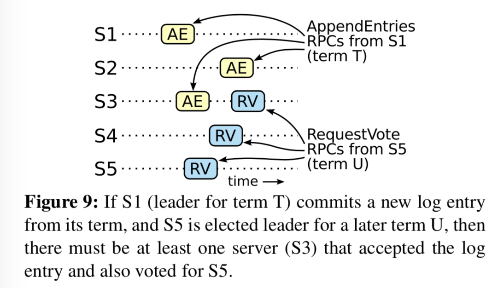

  > 图-9：如果 S1（任期 T 的领导人）在它的任期提交了一条日志条目，并且 S5 在之后的任期 U 成为了领导人，那么最少会有一台服务器（S3）接收了这条日志条目并且会给 S5 投票。

3. The voter must have accepted the committed entry from leaderT *before* voting for leaderU; otherwise it would have rejected the AppendEntries request from leaderT (its current term would have been higher than T). 
  投票者必须在给 leaderU 投票之前接收来自 leaderT 的日志条目；否则它会拒绝来自 leaderT 的 AppendEntries 请求（它的当前任期会比 T 要大）

4. The voter still stored the entry when it voted for leaderU, since every intervening leader contained the entry (by assumption), leaders never remove entries, and followers only remove entries if they conflict with the leader. 
  投票者会在它给 leaderU 投票时存储那个条目，因为任何中间的领导人都保有该条目（基于假设），领导人从来不会移除这个条目，并且追随者也只会在和领导人冲突时才会移除日志条目。

5. The voter granted its vote to leaderU, so leaderU’s log must have been as up-to-date as the voter’s. This leads to one of two contradictions. 
  投票者给 leaderU 投票了，所以 leaderU 的日志必须和投票者的一样新。这就导致了一个矛盾

6. First, if the voter and leaderU shared the same last log term, then leaderU’s log must have been at least as long as the voter’s, so its log contained every entry in the voter’s log. This is a contradiction, since the voter contained the committed entry and leaderU was assumed not to. 
  首先，如果投票者和 leaderU 最后一条日志条目的任期号相同，那么 leaderU 的日志一定和投票者的一样长，因此它的日志包含全部投票者的日志条目。这是矛盾的，因为在假设中投票者和 leaderU 包含的已提交条目是不同的。

7. Otherwise, leaderU’s last log term must have been larger than the voter’s. Moreover, it was larger than T, since the voter’s last log term was at least T (it contains the committed entry from term T). The earlier leader that created leaderU’s last log entry must have contained the committed entry in its log (by assumption). Then, by the Log Matching Property, leaderU’s log must also contain the committed entry, which is a contradiction. 
  除此之外， leaderU 的最后一条日志的任期号一定比投票者的大。另外，它也比 T 要大，因为投票者的最后一条日志条目的任期号最小也要是 T（它包含了所有任期 T 提交的日志条目）。创建 leaderU 最后一条日志条目的上一任领导人必须包含已经提交的日志条目（基于假设）。那么，根据日志匹配原则（Log Matching），leaderU 也一定包含那条提交的日志条目，这也是矛盾的。

8. This completes the contradiction. Thus, **the leaders of all terms greater than T must contain all entries from term T that are committed in term T.** 
  这时就完成了矛盾推导。因此，所有比任期 T 大的领导人一定包含所有在任期 T 提交的日志条目。

9. The Log Matching Property guarantees that future leaders will also contain entries that are committed indirectly, such as index 2 in Figure 8(d). 
  日志匹配原则（Log Matching）保证了未来的领导人也会包含被间接提交的日志条目，就像 图-8 中（d）时刻索引为2的条目。

Given the Leader Completeness Property, we can prove the State Machine Safety Property from Figure 3, which states that if a server has applied a log entry at a given index to its state machine, no other server will ever apply a different log entry for the same index. At the time a server applies a log entry to its state machine, its log must be identical to the leader’s log up through that entry and the entry must be committed. Now consider the lowest term in which any server applies a given log index; the Log Completeness Property guarantees that the leaders for all higher terms will store that same log entry, so servers that apply the index in later terms will apply the same value. Thus, the State Machine Safety Property holds.
根据领导人完全原则（Leader Completeness)，我们能够证明 表-3 中的状态机安全原则（State Machine Safety），状态机安全原则（State Machine Safety）讲的是如果一台服务器将给定索引上的日志条目应用到了它自己的状态机上，其它服务器的同一索引位置不可能应用的是其它条目。在一个服务器应用一条日志条目到它自己的状态机中时，它的日志必须和领导人的日志在该条目和之前的条目上相同，并且已经被提交。现在我们来考虑在任何一个服务器应用一个指定索引位置的日志的最小任期；日志完全特性（Log Completeness Property）保证拥有更高任期号的领导人会存储相同的日志条目，所以之后的任期里应用某个索引位置的日志条目也会是相同的值。因此，状态机安全特性是成立的。

Finally, Raft requires servers to apply entries in log index order. Combined with the State Machine Safety Property, this means that all servers will apply exactly the same set of log entries to their state machines, in the same order. 
最后，Raft 算法需要服务器按照日志中索引位置顺序应用日志条目。和状态机安全特性结合起来看，这就意味着所有的服务器会应用相同的日志序列集到自己的状态机中，并且是按照相同的顺序。

## 5.5 Follower and candidate crashes 追随者和候选人崩溃

Until this point we have focused on leader failures. Follower and candidate crashes are much simpler to handle than leader crashes, and they are both handled in the same way. If a follower or candidate crashes, then future RequestVote and AppendEntries RPCs sent to it will fail. Raft handles these failures by **retrying indefinitely**; if the crashed server restarts, then the RPC will complete successfully. If a server crashes after completing an RPC but before responding, then it will receive the same RPC again after it restarts. **Raft RPCs are idempotent**, so this causes no harm. For example, if a follower receives an AppendEntries request that includes log entries already present in its log, it ignores those entries in the new request. 
截止到目前，我们讨论了领导人崩溃的问题。追随者和候选人崩溃的问题解决起来要比领导人崩溃要简单得多，这两者崩溃的处理方式是一样的。如果一个追随者或者候选人崩溃了，那么之后的发送给它的 RequestVote RPC 和 AppendEntries RPC 会失败。Raft 通过无限的重试来处理这些失败；如果崩溃的服务器重启了，RPC 就会成功完成。如果一个服务器在收到了 RPC 之后但是在响应之前崩溃了，那么它会在重启之后再次收到同一个 RPC。因为 Raft 中的 RPC 都是幂等的，因此不会有什么问题。例如，如果一个追随者收到了一个已经包含在它的日志中的 AppendEntries 请求，它会忽视这个新的请求。

## 5.6 Timing and availability 时序和可用性

One of our requirements for Raft is that **safety must not depend on timing**: the system must not produce incorrect results just because some event happens more quickly or slowly than expected. However, availability (the ability of the system to respond to clients in a timely manner) must inevitably depend on timing. For example, if message exchanges take longer than the typical time between server crashes, candidates will not stay up long enough to win an election; without a steady leader, Raft cannot make progress. 
我们对于 Raft 的要求之一就是安全性不依赖于时序（timing）：系统不能仅仅因为一些事件发生的比预想的快一些或慢一些就产生错误。然而，可用性（系统可以及时响应客户端的特性）不可避免的要依赖时序。例如，如果消息交换的时间比服务器崩溃间隔的时间还要多，候选人没有足够的时间来赢得选举；没有一个稳定的领导人，Raft 将无法工作。

Leader election is the aspect of Raft where timing is most critical. Raft will be able to elect and maintain a steady leader as long as the system satisfies the following *timing requirement*: 
领导人选取是 Raft 中对时序要求最关键的地方。Raft 会选出并且保持一个稳定的领导人只有系统满足下列时序要求（timing requirement）：

**$$broadcastTime ≪ electionTimeout ≪ MTBF $$**

In this inequality *broadcastTime* is the average time it takes a server to send RPCs in parallel to every server in the cluster and receive their responses; *electionTimeout* is the election timeout described in Section 5.2; and *MTBF* is the average time between failures for a single server. **The broadcast time should be an order of magnitude less than the election timeout so that leaders can reliably send the heartbeat messages required to keep followers from starting elections; given the randomized approach used for election timeouts, this inequality also makes split votes unlikely. The election timeout should be a few orders of magnitude less than MTBF so that the system makes steady progress. When the leader crashes, the system will be unavailable for roughly the election timeout; we would like this to represent only a small fraction of overall time.**
在这个不等式中，broadcastTime指的是一台服务器并行的向集群中的其他服务器发送 RPC 并且收到它们的响应的平均时间；electionTimeout指的就是在 5.2节 描述的选举超时时间；MTBF指的是单个服务器发生故障的间隔时间的平均数(Mean Time between Failures)。broadcastTime应该比electionTimeout小一个数量级，为的是使领导人能够持续发送心跳信息（heartbeat）来阻止追随者们开始选举；根据已经给出的随机化选举超时时间方法，这个不等式也使得瓜分选票的情况变成不可能。electionTimeout也要比MTBF小几个数量级，为的是使得系统稳定运行。当领导人崩溃时，整个大约会在electionTimeout的时间内不可用；我们希望这种情况仅占全部时间的很小的一部分。

The broadcast time and MTBF are properties of the underlying system, while the electionTimeout is something we must choose. Raft’s RPCs typically require the recipient to persist information to stable storage, so the broadcast time may range from 0.5ms to 20ms, depending on storage technology. As a result, **the election timeout is likely to be somewhere between 10ms and 500ms.** Typical server MTBFs are several months or more, which easily satisfies the timing requirement.
broadcastTime和MTBF是由系统决定的性质，但是electionTimeout是我们必须做出选择的。Raft 的 RPC 需要接收方将信息持久化的保存到稳定存储中去，所以广播时间大约是 0.5 毫秒到 20 毫秒，这取决于存储的技术。因此，electionTimeout一般在 10ms 到 500ms 之间。大多数的服务器的MTBF都在几个月甚至更长，很容易满足这个时序需求。

# 6 Cluster membership changes 集群成员调整

Up until now we have assumed that the cluster *configuration* (the set of servers participating in the consensus algorithm) is fixed. In practice, it will occasionally be necessary to change the configuration, for example to replace servers when they fail or to change the degree of replication. Although this can be done by taking the entire cluster off-line, updating configuration files, and then restarting the cluster, this would leave the cluster unavailable during the changeover. In addition, if there are any manual steps, they risk operator error. In order to avoid these issues, we decided to automate configuration changes and incorporate them into the Raft consensus algorithm. 
截止到目前，我们都假定集群的配置（加入到一致性算法的服务器集合）是固定的。在实际中，我们会经常更改配置，例如，替换掉那些崩溃的机器或者更改复制级别。虽然通过关闭整个集群，升级配置文件，然后重启整个集群也可以解决这个问题，但是这回导致在更改配置的过程中，整个集群不可用。另外，如果存在需要手工操作，那么就会有操作失误的风险。为了避免这些问题，我们决定采用自动改变配置并且把这部分加入到了 Raft 一致性算法中。

For the configuration change mechanism to be safe, there must be no point during the transition where it is possible for two leaders to be elected for the same term. Unfortunately, <u>any approach where servers switch directly from the old configuration to the new configuration is unsafe. It isn’t possible to atomically switch all of the servers at once, so the cluster can potentially **split into two independent majorities during the transition**</u> (see Figure 10). 
为了让配置修改机制能够安全，那么在转换的过程中在任何时间点两个领导人不能再同一个任期被同时选为领导人。不幸的是，服务器集群从旧的配置直接升级到新的配置的任何方法都是不安全的，一次性自动的转换所有服务器是不可能的，所以集群可以在转换的过程中划分成两个单独的组（如 图-10 所示）。

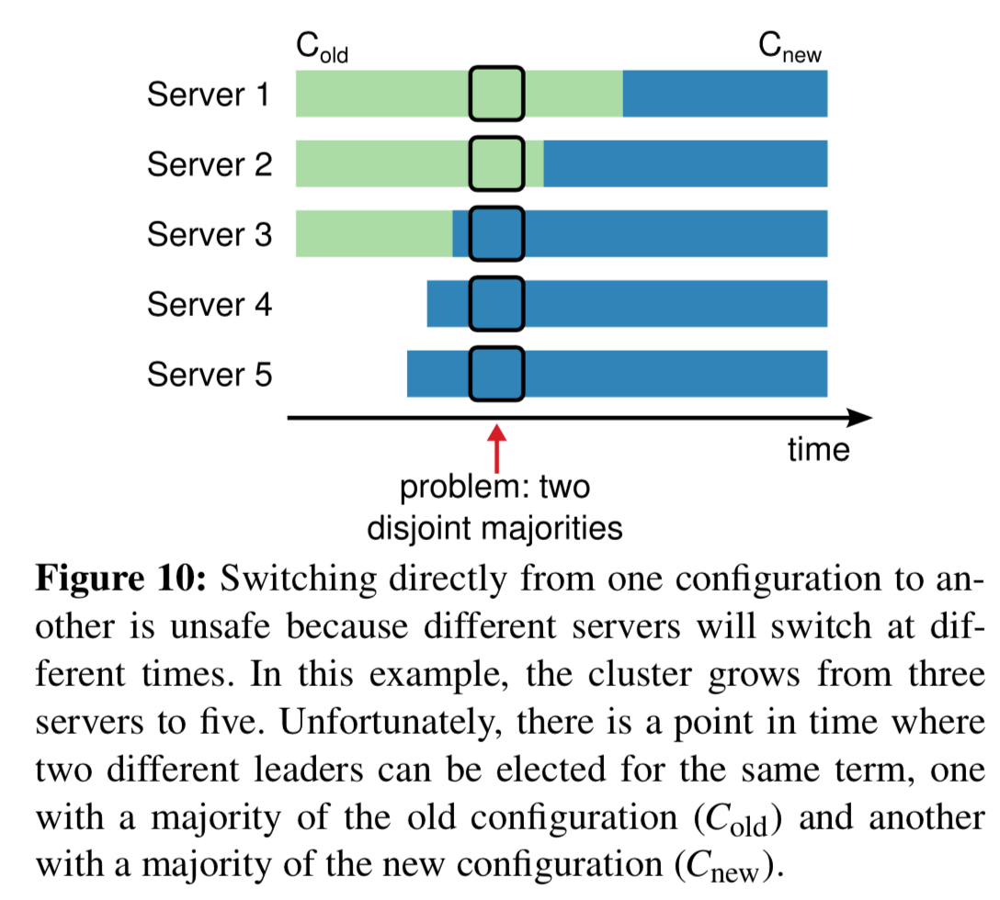

> 图-10：从一个配置切换到另一个配置是不安全的，因为不同的服务器会在不同的时间点进行切换。在这个例子中，集群数量从三台转换成五台。不幸的是，在一个时间点有两个服务器能被选举成为领导人，一个是在使用旧的配置的机器中（$C_{old}$）选出的领导人，另一个领导人是通过新的配置（$C_{new}$）选出来的。

In order to ensure safety, **configuration changes must use a two-phase approach**. There are a variety of ways to implement the two phases. For example, some systems (e.g., [22]) use the first phase to disable the old configuration so it cannot process client requests; then the second phase enables the new configuration. **In Raft the cluster first switches to a transitional configuration we call *joint consensus*; once the joint consensus has been committed, the system then transitions to the new configuration. The joint consensus combines both the old and new configurations:** 
为了保证安全性，集群配置的调整必须使用两阶段（two-phase）方法。有许多种实现两阶段方法的实现。例如，一些系统在第一个阶段先把旧的配置设为无效使得它无法处理客户端请求，然后在第二阶段启用新的配置。在 Raft 中，集群先切换到一个过渡配置，我们称其为联合一致（joint consensus）；一旦联合一致被提交了，然后系统再切换到新的配置。联合一致是旧的配置和新的配置的组合：

* Log entries are replicated to all servers in both configurations. 
日志条目被复制给集群中新、老配置的所有服务器。
* Any server from either configuration may serve as leader.
新、老配置的服务器都能成为领导人。
* Agreement (for elections and entry commitment) requires separate majorities from ***both*** the old and new configurations. 
	需要分别在两种配置上获得大多数的支持才能达成一致（针对选举和提交）

The joint consensus allows individual servers to transition between configurations at different times without compromising safety. Furthermore, joint consensus allows the cluster to continue servicing client requests throughout the configuration change. 
联合一致允许独立的服务器在不影响安全性的前提下，在不同的时间进行配置转换过程。此外，联合一致可以让集群在配置转换的过程中依然能够响应服务器请求。

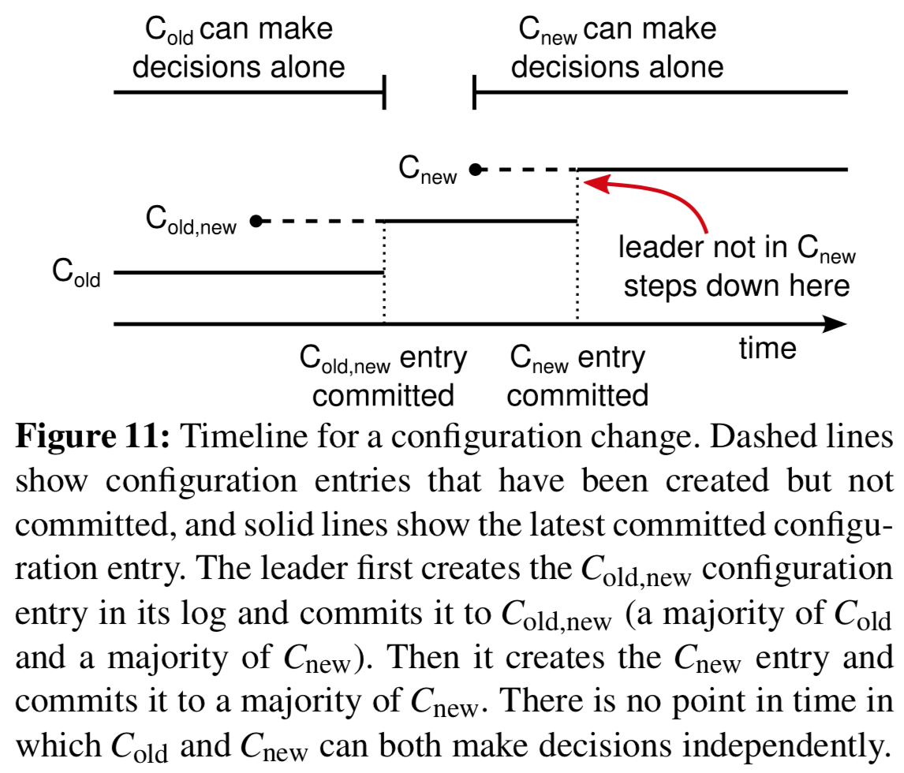

> 图-11：集群配置变更的时间线。虚线表示的是已经被创建但是还没提交的配置条目，实线表示的是最新提交的配置条目。领导人首先在它的日志中创建 $C_{old,new}$配置条目并且将它提交到$C_{old,new}$（使用旧配置的大部分服务器和使用新配置的大部分服务器）。然后创建它创建$C_{new}$配置条目并且将它提交到使用新配置的大部分机器上。这样就不存在$C_{old}$和$C_{new}$能够分别同时做出决定的时刻。

Cluster configurations are stored and communicated using special entries in the replicated log; Figure 11 illustrates the configuration change process. When the leader receives a request to change the configuration from $C_{old}$ to $C_{new}$, it stores the configuration for joint consensus ($C_{old,new}$ in the figure) as a log entry and replicates that entry using the mechanisms described previously. Once a given server adds the new configuration entry to its log, it uses that configuration for all future decisions (**a server always uses the latest configuration in its log, regardless of whether the entry is committed**). This means that the leader will use the rules of $C_{old,new}$ to determine when the log entry for $C_{old,new}$ is committed. If the leader crashes, a new leader may be chosen under either $C_{old}$ or $C_{old,new}$, depending on whether the winning candidate has received $C_{old,new}$. In any case,  $C_{new}$ cannot make unilateral decisions during this period.
集群配置是用特殊的日志条目在复制日志的过程中完成通信和存储；图-11 展示了配置变更的过程。当一个领导人接收到一个改变配置 $C_{old}$ 为 $C_{new}$ 的请求，它会为了联合一致以前面描述的日志条目和副本的形式将配置存储起来（图中的 $C_{old,new}$）。一旦一个服务器将新的配置日志条目增加到它的日志中，它就会用这个配置来做出未来所有的决定（服务器总是使用最新的配置，无论它是否已经被提交）。这意味着领导人要使用 $C_{old,new}$ 的规则来决定日志条目 $C_{old,new}$ 什么时候需要被提交。如果领导人崩溃了，被选出来的新领导人可能是使用 $C_{old}$ 配置也可能是 $C_{old,new}$ 配置，这取决于赢得选举的候选人是否已经接收到了 $C_{old,new}$ 配置。在任何情况下， $C_{new}$ 配置在这一时期都不会单方面的做出决定。

Once $C_{old,new}$ has been committed, neither $C_{old}$ nor  $C_{new}$ can make decisions without approval of the other, and the Leader Completeness Property ensures that only servers with the $C_{old,new}$ log entry can be elected as leader. It is now safe for the leader to create a log entry describing  $C_{new}$ and replicate it to the cluster. Again, this configuration will take effect on each server as soon as it is seen. When the new configuration has been committed under the rules of  $C_{new}$, the old configuration is irrelevant and servers not in the new configuration can be shut down. As shown in Figure 11, there is no time when $C_{old}$ and  $C_{new}$ can both make unilateral decisions; this guarantees safety. 
一旦 $C_{old,new}$ 被提交，那么无论是 $C_{old}$ 还是 $C_{new}$，在没有经过对方批准的情况下都不可能做出决定，并且领导人完全特性（Leader Completeness Property）保证了只有拥有 $C_{old,new}$ 日志条目的服务器才有可能被选举为领导人。这个时候，领导人创建一条关于 $C_{new}$ 配置的日志条目并复制给集群就是安全的了。另外，每个服务器在收到新的配置的时候就会立即生效。当新的配置在 $C_{new}$的规则下被提交，旧的配置就变得无关紧要，同时不使用新的配置的服务器就可以被关闭了。如 图-11，$C_{old}$ 和 $C_{new}$ 没有任何机会同时做出单方面的决定；这就保证了安全性。

There are three more issues to address for reconfiguration. The first issue is that new servers may not initially store any log entries. If they are added to the cluster in this state, it could **take quite a while for them to catch up**, during which time it might not be possible to commit new log entries. In order to avoid availability gaps, Raft introduces an additional phase before the configuration change, in which the **new servers join the cluster as non-voting members** (the leader replicates log entries to them, but they are not considered for majorities). Once the new servers have caught up with the rest of the cluster, the reconfiguration can proceed as described above. 
针对重新配置提出了三个问题。第一个问题是一开始的时候新的服务器可能没有任何日志条目。如果它们在这个状态下加入到集群中，那么它们需要一段时间来更新追赶，在这个阶段它们还不能提交新的日志条目。为了避免这种可用性的间隔时间，Raft 在配置更新的时候使用了一种额外的阶段，在这个阶段，新的服务器以没有投票权的身份加入到集群中来（领导人复制日志给他们，但是不把它们考虑到大多数中）。一旦新的服务器追赶上了集群中的其它机器，重新配置可以像上面描述的一样处理。

The second issue is that the **cluster leader may not be part of the new configuration**. In this case, the leader steps down (returns to follower state) once it has committed the  $C_{new}$ log entry. This means that there will be a period of time (while it is committing  $C_{new}$ ) when the leader is managing a cluster that does not include itself; it replicates log entries but does not count itself in majorities. The leader transition occurs when  $C_{new}$ is committed because this is the first point when the new configuration can operate independently (it will always be possible to choose a leader from  $C_{new}$ ). Before this point, it may be the case that only a server from $C_{old}$ can be elected leader. 
第二个问题是，集群的领导人可能不是新配置的一员。在这种情况下，领导人就会在提交了 $C_{new}$日志之后退位（回到跟随者状态）。这意味着有这样的一段时间（即领导人提交$C_{new}$ 的时候），领导人管理着集群，但是不包括自己；它复制日志但是不把它自己看作是大多数之一。当 $C_{new}$ 被提交时，会发生领导人过渡，因为这时是新的配置可以独立工作的最早的时间点（总是能够在 $C_{new}$ 配置下选出新的领导人）。在此之前，可能只能从 $C_{old}$ 中选出领导人。

The third issue is that **removed servers (those not in  $C_{new}$) can disrupt the cluster**. These servers will not receive heartbeats, so they will **time out and start new elections**. They will then send RequestVote RPCs with new term numbers, and this will cause the current leader to revert to follower state. A new leader will eventually be elected, but the removed servers will time out again and the process will repeat, resulting in poor availability. 
第三个问题是，移除不在 $C_{new}$ 中的服务器可能会扰乱集群。这些服务器将不会再接收到心跳（heartbeat），所以当选举超时时，它们就会进行新的选举过程。它们会发送带有新的任期号的 RequestVote RPC，这样会导致当前的领导人回退成跟随者状态。新的领导人最终会被选出来，但是被移除的服务器将会再次超时，然后这个过程会再次重复，导致整体可用性大幅降低。

To prevent this problem, **servers disregard RequestVote RPCs when they believe a current leader exists**. Specifically, **if a server receives a RequestVote RPC within the minimum election timeout of hearing from a current leader, it does not update its term or grant its vote**. This does not affect normal elections, where **each server waits at least a minimum election timeout before starting an election**. However, it helps avoid disruptions from removed servers: if a leader is able to get heartbeats to its cluster, then it will not be deposed by larger term numbers. 
为了避免这个问题，当服务器确认当前领导人存在时，服务器会忽略 RequestVote RPC。特别的，当服务器在当前最小选举超时时间内收到一个 RequestVote RPC，它不会更新当前的任期号或者投出选票。这不会影响正常的选举，每个服务器在开始一次选举之前，至少等待一个最小选举超时时间。然而，这有利于避免被移除的服务器扰乱：如果领导人能够发送心跳给集群，那么它就不会被更大的任期号废除。

# 7 Log compaction

Raft’s log grows during normal operation to incorporate并入，吸收 more client requests, but in a practical system, it cannot grow without bound. As the log grows longer, it occupies more space and takes more time to replay. This will eventually cause availability problems without some mechanism to discard obsolete information that has accumulated in the log. 
Raft 产生的日志在持续的正常操作中不断增长，但是在实际的系统中，它不会无限的增长下去。随着日志的不断增长，它会占据越来越多的空间并且花费更多的时间重放（replay）。如果没有一个机制使得它能够废弃在日志中不断累积的过时的信息就会引起可用性问题。

**Snapshotting** is the simplest approach to compaction. **In snapshotting, the entire current system state is written to a *snapshot* on stable storage, then the entire log up to that point is discarded**. Snapshotting is used in Chubby and ZooKeeper, and the remainder of this section describes snapshotting in Raft. 
快照（snapshot）是最简单的压缩方式。在快照中，全部的当前系统状态都被写入到快照中，存储到持久化的存储中，然后在那个时刻之前的全部日志都可以被丢弃。在 Chubby 和 ZooKeeper 中都使用了快照技术，这一章的剩下的部分会介绍 Raft 中使用的快照技术。

Incremental approaches to compaction, such as log cleaning [36] and log-structured merge trees [30, 5], are also possible. **These operate on a fraction of the data at once, so they spread the load of compaction more evenly均匀地 over time**. They first select a region of data that has accumulated many deleted and overwritten objects, then they rewrite the live objects from that region more compactly and free the region. This requires significant显著的 additional mechanism and complexity compared to snapshotting, which simplifies the problem by always operating on the entire data set. While log cleaning would require modifications to Raft, state machines can implement LSM trees using the same interface as snapshotting. 
增量压缩（incremental approaches）的方法，例如日志清理（log cleaning）或者日志结构合并树（log-structured merge trees），都是可行的。这些方法每次只对一小部分数据进行操作，这样就分散了压缩的负载压力。首先，他们先选择一个已经积累的大量已经被删除或者被覆盖对象的区域，然后以更加紧密的方式重写那个区域还活跃的对象，之后释放那个区域。和简单操作整个数据集合的快照相比，需要显著增加额外的机制和复杂地快照比对来实现。状态机可以使用和快照相同的接口来实现 LSM tree ，但是日志清除方法就需要修改 Raft 了。

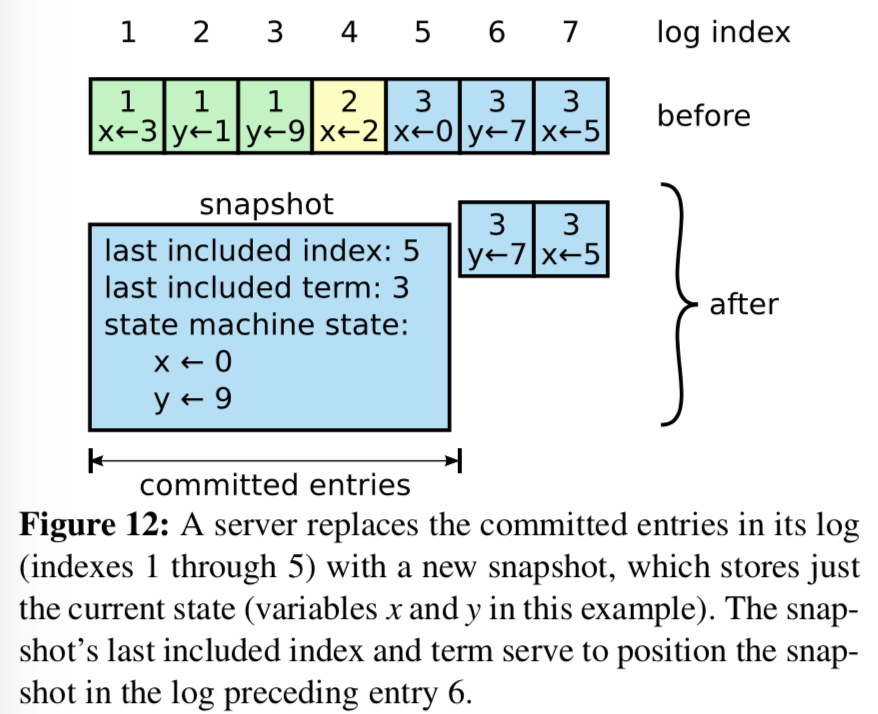

> 图-12：一个服务器用新的快照替换了从 1 到 5 的条目，快照值存储了当前的状态。快照中包含了最后的索引位置和任期号。

Figure 12 shows the basic idea of snapshotting in Raft. **Each server takes snapshots independently, covering just the committed entries in its log.** Most of the work consists of the state machine writing its **current state** to the snapshot. Raft also includes a small amount of **metadata** in the snapshot: the ***last included index*** is the index of the last entry in the log that the snapshot replaces (the last entry the state machine had applied), and the ***last included term*** is the term of this entry. These are preserved to support the AppendEntries consistency check for the first log entry following the snapshot, since that entry needs a previous log index and term. To enable cluster membership changes (Section 6), the snapshot also includes the **latest configuration** in the log as of last included index. Once a server completes writing a snapshot, it may delete all log entries up through the last included index, as well as any prior snapshot. 
图-12 展示了 Raft 中快照的基础思想。每个服务器独立的创建快照，只包括已经被提交的日志。主要的工作包括将状态机的状态写入到快照中。Raft 也将一些少量的元数据包含到快照中：最后被包含的索引（last included index）指的是被快照取代的最后的条目在日志中的索引值（状态机最后应用的日志），最后被包含的任期（last included term）指的是该条目的任期号。保留这些数据是为了支持快照之后的第一个条目的附加日志请求时的一致性检查，因为这个条目需要前一个条目的索引值和任期号。为了支持集群成员更新（第 6 章），快照中也将最后的一次配置作为最后一个条目存下来。一旦服务器完成一次快照，他就可以删除最后索引位置之前的所有日志和快照了。

Although servers normally take snapshots independently, the leader must occasionally send snapshots to followers that lag behind. **This happens when the leader has already discarded the next log entry that it needs to send to a follower**. Fortunately, this situation is unlikely in normal operation: a follower that has kept up with the leader would already have this entry. However, an exceptionally slow follower or a new server joining the cluster (Section 6) would not. **The way to bring such a follower up-to-date is for the leader to send it a snapshot over the network.** 
尽管通常服务器都是独立的创建快照，但是领导人必须偶尔的发送快照给一些落后的跟随者。这通常发生在当领导人已经丢弃了下一条需要发送给跟随者的日志条目的时候。幸运的是这种情况不是常规操作：一个与领导人保持同步的跟随者通常都会有这个条目。然而一个运行非常缓慢的跟随者或者新加入集群的服务器（第 6 章）将不会有这个条目。这时让这个跟随者更新到最新的状态的方式就是通过网络把快照发送给它们。

> 表-13：InstallSnapshot RPC 的总结。为了便于传输，快照都是被分成分块的；每个分块都给了跟随者生存的信号，所以跟随者可以重置选举超时计时器。

The leader uses a new RPC called **InstallSnapshot** to send snapshots to followers that are too far behind; see Figure 13. When a follower receives a snapshot with this RPC, it must decide what to do with its existing log entries. Usually the snapshot will contain new information not already in the recipient’s log. In this case, the follower discards its entire log; it is all superseded by the snapshot and may possibly have uncommitted entries that conflict with the snapshot. If instead相反地 the follower receives a snapshot that describes a prefix of its log (due to retransmission or by mistake), then log entries covered by the snapshot are deleted but entries following the snapshot are still valid and must be retained. 
在这种情况下领导人使用一种叫做安装快照（InstallSnapshot）的新的 RPC 来发送快照给太落后的跟随者；见 表-13。当跟随者通过这种 RPC 接收到快照时，它必须自己决定对于已经存在的日志该如何处理。通常快照会包含没有在接收者日志中存在的信息。在这种情况下，跟随者直接丢弃它所有的日志；这些会被快照所取代，但是可能会和没有提交的日志产生冲突。相反如果接收到的快照是自己日志的前面部分（由于网络重传或者错误），那么被快照包含的条目将会被全部删除，但是快照之后的条目必须是正确的和并且被保留下来。

This snapshotting approach departs from Raft’s strong leader principle, since followers can take snapshots without the knowledge of the leader. However, we think this departure is justified. While having a leader helps avoid conflicting decisions in reaching consensus, **consensus has already been reached when snapshotting, so no decisions conflict**. Data still only flows from leaders to followers, just followers can now reorganize their data.
这种快照的方式背离了 Raft 的强领导人原则（strong leader principle），因为跟随者可以在不知道领导人情况下创建快照。但是我们认为这种背离是值得的。领导人的存在，是为了解决在达成一致性的时候的冲突，但是在创建快照的时候，一致性已经达成，这时不存在冲突了，所以没有领导人也是可以的。数据依然是从领导人传给跟随者，只是跟随者可以重新组织它们的数据了。

We considered an alternative leader-based approach in which only the leader would create a snapshot, then it would send this snapshot to each of its followers. However, this has two disadvantages. First, sending the snapshot to each follower would waste network bandwidth and slow the snapshotting process. Each follower already has the information needed to produce its own snapshots, and it is typically much cheaper for a server to produce a snapshot from its local state than it is to send and receive one over the network. Second, the leader’s implementation would be more complex. For example, the leader would need to send snapshots to followers in parallel with replicating new log entries to them, so as not to block new client requests.
我们考虑过一种替代的基于领导人的快照方案，即只有领导人创建快照，然后发送给所有的跟随者。但是这样做有两个缺点。第一，发送快照会浪费网络带宽并且延缓了快照处理的时间。每个跟随者都已经拥有了所有产生快照需要的信息，而且很显然，自己从本地的状态中创建快照比通过网络接收别人发来的要经济。第二，领导人的实现会更加复杂。例如，领导人需要发送快照的同时并行的将新的日志条目发送给跟随者，这样才不会阻塞新的客户端请求。

There are two more issues that impact snapshotting performance. First, **servers must decide when to snapshot**. If a server snapshots too often, it wastes disk bandwidth and energy; if it snapshots too infrequently, it risks exhausting its storage capacity, and it increases the time required to replay the log during restarts. **One simple strategy is to take a snapshot when the log reaches a fixed size in bytes**. If this size is set to be significantly larger than the expected size of a snapshot, then the disk bandwidth overhead for snapshotting will be small. 
还有两个问题影响了快照的性能。首先，服务器必须决定什么时候应该创建快照。如果快照创建的过于频繁，那么就会浪费大量的磁盘带宽和其他资源；如果创建快照频率太低，它就要承受耗尽存储容量的风险，同时也增加了重启时的日志重建时间。一个简单的策略就是当日志大小达到一个固定大小的时候就创建一次快照。如果这个阈值设置的显著大于期望的快照的大小，那么快照对磁盘压力的影响就会很小了。

The second performance issue is that writing a snapshot can take a significant amount of time, and we do not want this to delay normal operations. The solution is to use **copy-on-write** techniques so that new updates can be accepted without impacting the snapshot being writ- ten. For example, state machines built with functional data structures naturally support this. Alternatively, the operating system’s copy-on-write support (e.g., fork on Linux) can be used to create an in-memory snapshot of the entire state machine (our implementation uses this approach). 
第二个影响性能的问题就是写入快照需要花费显著的一段时间，并且我们还不希望影响到正常操作。解决方案是通过写时复制（copy-on-write）的技术，这样新的更新就可以被接收而不影响到快照。例如，具有函数式数据结构的状态机天然支持这样的功能。另外，操作系统的写时复制技术的支持（如 Linux 上的 fork）可以被用来创建完整的状态机的内存快照（我们的实现就是这样的）。

# 8 Client interaction 客户端交互

This section describes how clients interact with Raft, including how clients find the cluster leader and how Raft supports linearizable semantics [10]. These issues apply to all consensus-based systems, and Raft’s solutions are similar to other systems.
这一节将介绍客户端是如何和 Raft 进行交互的，包括客户端是如何发现领导人的和 Raft 是如何支持线性化语义（linearizable semantics）的。这些问题对于所有基于一致性的系统都存在，并且 Raft 的解决方案和其他的也差不多。

**Clients of Raft send all of their requests to the leader**. When a client first starts up, it connects to a randomlychosen server. If the client’s first choice is not the leader, that server will reject the client’s request and supply information about the most recent leader it has heard from (AppendEntries requests include the network address of the leader). If the leader crashes, client requests will time out; clients then try again with randomly-chosen servers.
Raft 中的客户端将所有请求发送给领导人。当客户端启动的时候，它会随机挑选一个服务器进行通信。如果客户端第一次挑选的服务器不是领导人，那么那个服务器会拒绝客户端的请求并且提供它最近接收到的领导人的信息（附加条目请求包含了领导人的网络地址）。如果领导人已经崩溃了，那么客户端的请求就会超时；客户端之后会再次重试随机挑选服务器的过程。

Our goal for Raft is to implement linearizable semantics (each operation appears to execute instantaneously, exactly once, at some point between its invocation and its response). However, as described so far Raft can execute a command multiple times: for example, if the leader crashes after committing the log entry but before responding to the client, the client will retry the command with a new leader, causing it to be executed a second time. **The solution is for clients to <u>assign unique serial numbers</u> to every command**. Then, the state machine tracks the latest serial number processed for each client, along with the associated response. If it receives a command whose serial number has already been executed, it responds immediately without re-executing the request.
我们 Raft 的目标是要实现线性化语义（linearizable semantics）（每一次操作立即执行，在它调用和收到回复之间只执行一次）。但是，如上述所说，Raft 是可以多次执行同一条命令的：例如，如果领导人在提交了这条日志之后，但是在响应客户端之前崩溃了，那么客户端会和新的领导人重试这条指令，导致这条命令就被再次执行了。解决方案就是客户端对于每一条指令都赋予一个唯一的序列号。然后，状态机跟踪每条指令最新的序列号和相应的响应。如果接收到一条指令，它的序列号已经被执行了，那么就立即返回结果，而不重新执行指令。

Read-only operations can be handled without writing anything into the log. However, with no additional measures, this would run the risk of returning stale data, since the leader responding to the request might have been superseded by a newer leader of which it is unaware. Linearizable reads must not return stale data, and Raft needs two extra precautions to guarantee this without using the log. First, **a leader must have the latest information on which entries are committed.** <u>The Leader Completeness Property guarantees that a leader has all committed entries, but at the start of its term, it may not know which those are. To find out, it needs to commit an entry from its term. Raft handles this by having each leader commit a blank *no-op* entry into the log at the start of its term</u>. Second, **a leader must check whether it has been deposed before processing a read-only request** (its information may be stale if a more recent leader has been elected). <u>Raft handles this by having the leader exchange heartbeat messages with a majority of the cluster before responding to read-only requests.</u> Alternatively, <u>the leader could rely on the heartbeat mechanism to provide a form of lease</u> [9], but this would rely on timing for safety (it assumes bounded clock skew).
只读（read-only）的操作可以直接处理而不需要记录日志。但是，在不增加任何限制的情况下，这么做可能会冒着返回过期数据(stale data)的风险，因为领导人响应客户端请求时可能已经被新的领导人作废了，但是它还不知道。线性化的读操作必须不能返回过期数据，Raft 需要使用两个额外的措施在不使用日志的情况下保证这一点。首先，领导人必须有关于被提交日志的最新信息。领导人完全原则（Leader Completeness Property）保证了领导人一定拥有所有已经被提交的日志条目，但是在它任期开始的时候，它可能不知道哪些是已经被提交的。为了知道这些信息，它需要在它的任期里提交一条日志条目。Raft 中通过领导人在任期开始的时候提交一个空白的没有任何操作的日志条目到日志中去来进行实现。第二，领导人在处理只读的请求之前必须检查自己是否已经被废除了（如果一个更新的领导人被选举出来，它自己的信息就已经过期了）。Raft 中通过让领导人在响应只读请求之前，先和集群中的大多数节点交换一次心跳（heartbeat）信息来处理这个问题。另外，领导人可以依赖心跳机制来实现一种租约的机制，但是这种方法依赖时序来保证安全性（它假设时间误差是有界的）。

# 9 Implementation and evaluation 实现和评价

The remainder of this section evaluates Raft using three criteria: understandability, correctness, and performance. 
这一章会从三个方面来评估 Raft 算法：可理解性、正确性和性能。

## 9.1 Understandability

...

## 9.2 Correctness

...

## 9.3 Performance

Raft’s performance is similar to other consensus algorithms such as Paxos. The most important case for performance is when an established leader is replicating new log entries. Raft achieves this using the minimal number of messages (a single round-trip from the leader to half the cluster). It is also possible to further improve Raft’s performance. For example, it easily supports batching and pipelining requests for higher throughput and lower latency. Various optimizations have been proposed in the literature for other algorithms; many of these could be applied to Raft, but we leave this to future work. 
Raft 和其他一致性算法例如 Paxos 有着差不多的性能。在性能方面，最重要的关注点是，当领导人被选举成功时，什么时候复制新的日志条目。Raft 通过很少数量的消息包（一轮从领导人到集群半数机器的消息）就达成了这个目的。同时，进一步提升 Raft 的性能也是可行的。例如，很容易通过支持批量操作和管道操作来提高吞吐量和降低延迟。对于其他一致性算法已经提出过很多性能优化方案；其中有很多也可以应用到 Raft 中来，但是我们暂时把这个问题放到未来的工作中去。

We used our Raft implementation to measure the performance of Raft’s leader election algorithm and answer two questions. First, does the election process converge quickly? Second, what is the minimum downtime that can be achieved after leader crashes?
我们使用我们自己的 Raft 实现来衡量 Raft 领导人选举的性能并且回答以下两个问题。首先，领导人选举的过程收敛是否快速？第二，在领导人宕机之后，最小的系统宕机时间是多久？

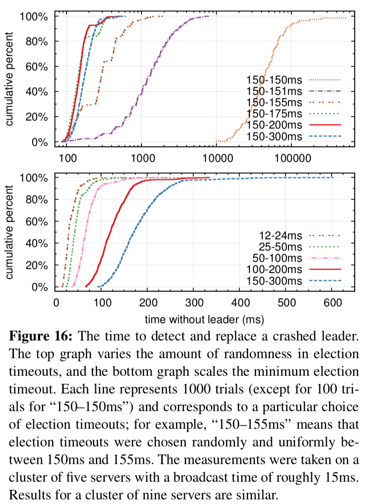

> 图-16：发现并替换一个已经崩溃的领导人的时间。上面的图考察了在选举超时时间上的随机化程度，下面的图考察了最小超时时间。每条线代表了 1000 次实验（除了 150-150 毫秒只试了 100 次），和相应的确定的选举超时时间。例如，150-155 毫秒意思是，选举超时时间从这个区间范围内随机选择并确定下来。这个实验在一个拥有 5 个节点的集群上进行，其广播时延大约是 15 毫秒。对于 9 个节点的集群，结果也差不多。

To measure leader election, we repeatedly crashed the leader of a cluster of five servers and timed how long it took to detect the crash and elect a new leader (see Figure 16). To generate a worst-case scenario, the servers in each trial had different log lengths, so some candidates were not eligible to become leader. Furthermore, to encourage split votes, our test script triggered a synchronized broadcast of heartbeat RPCs from the leader before terminating its process (this approximates the behavior of the leader replicating a new log entry prior to crashing). The leader was crashed uniformly randomly within its heartbeat interval, which was half of the minimum election timeout for all tests. Thus, the smallest possible downtime was about half of the minimum election timeout.
为了衡量领导人选举，我们反复的使一个拥有五个节点的服务器集群的领导人宕机，并计算需要多久才能发现领导人已经宕机并选出一个新的领导人（见图-16）。为了构建一个最坏的场景，在每一的尝试里，服务器都有不同长度的日志，意味着有些候选人是没有成为领导人的资格的。另外，为了促成选票瓜分的情况，我们的测试脚本在终止领导人之前同步的发送了一次心跳广播（这大约和领导人在崩溃前复制一个新的日志给其他机器很像）。领导人均匀的随机的在心跳间隔里宕机，也就是最小选举超时时间的一半。因此，最小宕机时间大约就是最小选举超时时间的一半。

The top graph in Figure 16 shows that **a small amount of randomization in the election timeout is enough to avoid split votes in elections**. In the absence of randomness, leader election consistently took longer than 10 seconds in our tests due to many split votes. Adding just 5ms of randomness helps significantly, resulting in a median downtime of 287ms. Using more randomness improves worst-case behavior: with 50ms of randomness the worstcase completion time (over 1000 trials) was 513ms. 
图-16 上面的图表表明，只需要在选举超时时间上使用很少的随机化就可以大大避免选票被瓜分的情况。在没有随机化的情况下，在我们的测试里，选举过程由于太多的选票瓜分的情况往往都需要花费超过 10 秒钟。仅仅增加 5 毫秒的随机化时间，就大大的改善了选举过程，现在平均的宕机时间只有 287 毫秒。增加更多的随机化时间可以大大改善最坏情况：通过增加 50 毫秒的随机化时间，最坏的完成情况（1000 次尝试）只要 513 毫秒。

The bottom graph in Figure 16 shows that downtime can be reduced by reducing the election timeout. With an election timeout of 12–24ms, it takes only 35ms on average to elect a leader (the longest trial took 152ms). However, lowering the timeouts beyond this point violates Raft’s timing requirement: leaders have difficulty broad- casting heartbeats before other servers start new elections. This can cause unnecessary leader changes and lower overall system availability. We recommend using a con- servative election timeout such as 150–300ms; such time- outs are unlikely to cause unnecessary leader changes and will still provide good availability. 
图-16 中下面的图显示，通过减少选举超时时间可以减少系统的宕机时间。在选举超时时间为 12-24 毫秒的情况下，只需要平均 35 毫秒就可以选举出新的领导人（最长的一次花费了 152 毫秒）。然而，进一步降低选举超时时间的话就会违反 Raft 的时间不等式需求：在选举新领导人之前，领导人就很难发送完心跳包。这会导致没有意义的领导人改变并降低了系统整体的可用性。我们建议使用更为保守的选举超时时间，比如 150-300 毫秒；这样的时间不大可能导致没有意义的领导人改变，而且依然提供不错的可用性。

# 10 Related work 相关工作

There have been numerous publications related to consensus algorithms, many of which fall into one of the following categories: 
已经有很多关于一致性算法的工作被发表出来，其中很多都可以归到下面的类别中

- Lamport’s original description of Paxos [15], and attempts to explain it more clearly [16, 20, 21]. 
Lamport 关于 Paxos 的原始描述，和尝试描述的更清晰的论文。

- Elaborations of Paxos, which fill in missing details and modify the algorithm to provide a better foundation for implementation [26, 39, 13]. 
关于 Paxos 的更详尽的描述，补充遗漏的细节并修改算法，使得可以提供更加容易的实现基础。

- Systems that implement consensus algorithms, such as Chubby [2, 4], ZooKeeper [11, 12], and Spanner [6]. The algorithms for Chubby and Spanner have not been published in detail, though both claim to be based on Paxos. ZooKeeper’s algorithm has been published in more detail, but it is quite different from Paxos. 
实现一致性算法的系统，例如 Chubby，ZooKeeper 和 Spanner。对于 Chubby 和 Spanner 的算法并没有公开发表其技术细节，尽管他们都声称是基于 Paxos 的。ZooKeeper 的算法细节已经发表，但是和 Paxos 有着很大的差别。
- Performance optimizations that can be applied to Paxos [18, 19, 3, 25, 1, 27]. 
Paxos 可以应用的性能优化。
- Oki and Liskov’s Viewstamped Replication (VR), an alternative approach to consensus developed around the same time as Paxos. The original description [29] was intertwined with a protocol for distributed transactions, but the core consensus protocol has been separated in a recent update [22]. VR uses a leader- based approach with many similarities to Raft. 
Oki 和 Liskov 的 Viewstamped Replication（VR），一种和 Paxos 差不多的替代算法。原始的算法描述和分布式传输协议耦合在了一起，但是核心的一致性算法在最近的更新里被分离了出来。VR 使用了一种基于领导人的方法，和 Raft 有很多相似之处。

**The greatest difference between Raft and Paxos is Raft’s strong leadership**: Raft uses leader election as an essential part of the consensus protocol, and it concentrates as much functionality as possible in the leader. This approach results in a simpler algorithm that is easier to understand. For example, in Paxos, leader election is orthogonal垂直的 to the basic consensus protocol: it serves only as a performance optimization and is not required for achieving consensus. However, this results in additional mechanism: Paxos includes both a two-phase protocol for basic consensus and a separate mechanism for leader election. In contrast, Raft incorporates leader election directly into the consensus algorithm and uses it as the first of the two phases of consensus. This results in less mechanism than in Paxos. 
Raft 和 Paxos 最大的不同之处就在于 Raft 的强领导特性：Raft 使用领导人选举作为一致性协议里必不可少的部分，并且将尽可能多的功能集中到了领导人身上。这样就可以使得算法更加容易理解。例如，在 Paxos 中，领导人选举和基本的一致性协议是垂直的：领导人选举仅仅是性能优化的手段，而且不是一致性所必须要求的。但是，这样就增加了多余的机制：Paxos 同时包含了针对基本一致性要求的两阶段提交协议和针对领导人选举的独立的机制。相比较而言，Raft 就直接将领导人选举纳入到一致性算法中，并作为两阶段一致性的第一步。这样就减少了很多机制。

Like Raft, VR and ZooKeeper are leader-based and therefore share many of Raft’s advantages over Paxos. However, **Raft has less mechanism that VR or ZooKeeper because it minimizes the functionality in non-leaders**. For example, log entries in Raft flow in only one direction: outward from the leader in AppendEntries RPCs. In VR log entries flow in both directions (leaders can receive log entries during the election process); this results in additional mechanism and complexity. **The published description of ZooKeeper also transfers log entries both to and from the leader, but the implementation is apparently more like Raft [35].** 
像 Raft 一样，VR 和 ZooKeeper 也是基于领导人的，因此他们也拥有一些 Raft 的优点。但是，Raft 比 VR 和 ZooKeeper 拥有更少的机制因为 Raft 尽可能的减少了非领导人的功能。例如，Raft 中日志条目都遵循着从领导人发送给其他人这一个方向：附加条目 RPC 是向外发送的。在 VR 中，日志条目的流动是双向的（领导人可以在选举过程中接收日志）；这就导致了额外的机制和复杂性。根据 ZooKeeper 公开的资料看，它的日志条目也是双向传输的，但是它的实现更像 Raft。

Raft has fewer message types than any other algorithm for consensus-based log replication that we are aware of. For example, we counted the message types VR and ZooKeeper use for basic consensus and membership changes (excluding log compaction and client interaction, as these are nearly independent of the algorithms). VR and ZooKeeper each define 10 different message types, while Raft has only 4 message types (two RPC requests and their responses). **Raft’s messages are a bit more dense than the other algorithms’, but they are simpler collectively**. In addition, VR and ZooKeeper are described in terms of transmitting entire logs during leader changes; additional message types will be required to optimize these mechanisms so that they are practical. 
和上述我们提及的其他基于一致性的日志复制算法中，Raft 的消息类型更少。例如，我们数了一下 VR 和 ZooKeeper 使用的用来基本一致性需要和成员改变的消息数（排除了日志压缩和客户端交互，因为这些都比较独立且和算法关系不大）。VR 和 ZooKeeper 都分别定义了 10 中不同的消息类型，相对的，Raft 只有 4 种消息类型（两种 RPC 请求和对应的响应）。Raft 的消息都稍微比其他算法的要信息量大，但是都很简单集中。另外，VR 和 ZooKeeper 都在领导人改变时传输了整个日志；所以为了能够实践中使用，额外的消息类型就很必要了。

Raft’s strong leadership approach simplifies the algorithm, but it precludes some performance optimizations. For example, Egalitarian Paxos (EPaxos) can achieve higher performance under some conditions with a leaderless approach [27]. EPaxos exploits commutativity in state machine commands. Any server can commit a command with just one round of communication as long as other commands that are proposed concurrently commute with it. However, if commands that are proposed con- currently do not commute with each other, EPaxos requires an additional round of communication. Because any server may commit commands, EPaxos balances load well between servers and is able to achieve lower latency than Raft in WAN settings. However, it adds significant complexity to Paxos. 
Raft 的强领导人模型简化了整个算法，但是同时也排斥了一些性能优化的方法。例如，平等主义 Paxos （EPaxos）在某些没有领导人的情况下可以达到很高的性能。平等主义 Paxos 充分发挥了在状态机指令中的交换性。任何服务器都可以在一轮通信下就提交指令，除非其他指令同时被提出了。然而，如果指令都是并发的被提出，并且互相之间不通信沟通，那么 EPaxos 就需要额外的一轮通信。因为任何服务器都可以提交指令，所以 EPaxos 在服务器之间的负载均衡做的很好，并且很容易在 WAN 网络环境下获得很低的延迟。但是，他在 Paxos 上增加了非常明显的复杂性。

Several different approaches for cluster membership changes have been proposed or implemented in other work, including Lamport’s original proposal [15], VR [22], and SMART [24]. We chose the joint consensus approach for Raft because it leverages the rest of the consensus protocol, so that very little additional mechanism is required for membership changes. Lamport’s α-based approach was not an option for Raft because it assumes consensus can be reached without a leader. In comparison to VR and SMART, Raft’s reconfiguration algorithm has the advantage that membership changes can occur without limiting the processing of normal requests; in contrast, VR stops all normal processing during configuration changes, and SMART imposes an α-like limit on the number of outstanding requests. Raft’s approach also adds less mechanism than either VR or SMART. 
一些集群成员变换的方法已经被提出或者在其他的工作中被实现，包括 Lamport 的原始的讨论，VR 和 SMART。我们选择使用共同一致（joint consensus）的方法因为它对一致性协议的其他部分影响很小，这样我们只需要很少的一些机制就可以实现成员变换。Raft 没有采用 Lamport 的基于 α 的方法是因为它假设在没有领导人的情况下也可以达到一致性。和 VR 和 SMART 相比较，Raft 的重新配置算法可以在不限制正常请求处理的情况下进行；相比较而言，VR 需要停止所有的处理过程，SMART 引入了一个和 α 类似的方法，限制了请求处理的数量。和 VR、SMART 比较而言，Raft 的方法同时需要更少的额外机制来实现。

# 11 Conclusion 总结

Algorithms are often designed with correctness, efficiency, and/or conciseness as the primary goals. Although these are all worthy goals, we believe that understandability is just as important. None of the other goals can be achieved until developers render the algorithm into a practical implementation, which will inevitably deviate from and expand upon the published form. Unless developers have a deep understanding of the algorithm and can create intuitions about it, it will be difficult for them to retain its desirable properties in their implementation. 
算法的设计通常会把正确性，效率或者简洁作为主要的目标。尽管这些都是很有意义的目标，但是我们相信，可理解性也是一样的重要。在开发者把算法应用到实际的系统中之前，这些目标没有一个会被实现，这些都会必然的偏离发表时的形式。除非开发人员对这个算法有着很深的理解并且有着直观的感觉，否则将会对他们而言很难在实现的时候保持原有期望的特性。

In this paper we addressed the issue of distributed consensus, where a widely accepted but impenetrable algorithm, Paxos, has challenged students and developers for many years. We developed a new algorithm, Raft, which we have shown to be more understandable than Paxos. We also believe that Raft provides a better foundation for system building. Using understandability as the primary design goal changed the way we approached the design of Raft; as the design progressed we found ourselves reusing a few techniques repeatedly, such as decomposing the problem and simplifying the state space. These techniques not only improved the understandability of Raft but also made it easier to convince ourselves of its correctness. 
在这篇论文中，我们尝试解决分布式一致性问题，但是一个广为接受但是十分令人费解的算法 Paxos 已经困扰了无数学生和开发者很多年了。我们创造了一种新的算法 Raft，显而易见的比 Paxos 要容易理解。我们同时也相信，Raft 也可以为实际的实现提供坚实的基础。把可理解性作为设计的目标改变了我们设计 Raft 的方式；这个过程是我们发现我们最终很少有技术上的重复，例如问题分解和简化状态空间。这些技术不仅提升了 Raft 的可理解性，同时也使我们坚信其正确性。

# 12 Acknowledgments

...

# References

[1]  BOLOSKY, W. J., BRADSHAW, D., HAAGENS, R. B., KUSTERS, N. P., AND LI, P. Paxos replicated state machines as the basis of a high-performance data store. In *Proc. NSDI’11, USENIX Conference on Networked Systems Design and Implementation* (2011), USENIX, pp. 141–154.  
[2]  BURROWS, M. The Chubby lock service for loosely- coupled distributed systems. In *Proc. OSDI’06, Sympo- sium on Operating Systems Design and Implementation* (2006), USENIX, pp. 335–350. 
[3]  CAMARGOS, L. J., SCHMIDT, R. M., AND PEDONE, F. Multicoordinated Paxos. In *Proc. PODC’07, ACM Sym- posium on Principles of Distributed Computing* (2007), ACM, pp. 316–317. 
[4]  CHANDRA, T. D., GRIESEMER, R., AND REDSTONE, J. Paxos made live: an engineering perspective. In *Proc. PODC’07, ACM Symposium on Principles of Distributed Computing* (2007), ACM, pp. 398–407. 
[5]  CHANG, F., DEAN, J., GHEMAWAT, S., HSIEH, W. C., WALLACH, D. A., BURROWS, M., CHANDRA, T., FIKES, A., AND GRUBER, R. E. Bigtable: a distributed storage system for structured data. In *Proc. OSDI’06, USENIX Symposium on Operating Systems Design and Implementation* (2006), USENIX, pp. 205–218. 
[6]  CORBETT, J. C., DEAN, J., EPSTEIN, M., FIKES, A., FROST, C., FURMAN, J. J., GHEMAWAT, S., GUBAREV, A., HEISER, C., HOCHSCHILD, P., HSIEH, W., KAN- THAK, S., KOGAN, E., LI, H., LLOYD, A., MELNIK, S., MWAURA, D., NAGLE, D., QUINLAN, S., RAO, R., ROLIG, L., SAITO, Y., SZYMANIAK, M., TAYLOR, C., WANG, R., AND WOODFORD, D. Spanner: Google’s globally-distributed database. In *Proc. OSDI’12, USENIX Conference on Operating Systems Design and Implemen- tation* (2012), USENIX, pp. 251–264.  						 					 				 			 		
[7]  COUSINEAU, D., DOLIGEZ, D., LAMPORT, L., MERZ, S., RICKETTS, D., AND VANZETTO, H. TLA+ proofs. In *Proc. FM’12, Symposium on Formal Methods* (2012), D. Giannakopoulou and D. Me ́ry, Eds., vol. 7436 of *Lec- ture Notes in Computer Science*, Springer, pp. 147–154. 
[8]  GHEMAWAT, S., GOBIOFF, H., AND LEUNG, S.-T. The Google file system. In *Proc. SOSP’03, ACM Symposium on Operating Systems Principles* (2003), ACM, pp. 29–43. 
[9]  GRAY,C.,ANDCHERITON,D.Leases:Anefficientfault- tolerant mechanism for distributed file cache consistency. In *Proceedings of the 12th ACM Ssymposium on Operating Systems Principles* (1989), pp. 202–210.  						 						 	
[10]  HERLIHY, M. P., AND WING, J. M. Linearizability: a correctness condition for concurrent objects. *ACM Trans- actions on Programming Languages and Systems 12* (July 1990), 463–492.
[11]  HUNT, P., KONAR, M., JUNQUEIRA, F. P., AND REED, B . ZooKeeper: wait-free coordination for internet-scale systems. In *Proc ATC’10, USENIX Annual Technical Con- ference* (2010), USENIX, pp. 145–158.  						 						 						
[12]  JUNQUEIRA, F. P., REED, B. C., AND SERAFINI, M. Zab: High-performance broadcast for primary-backup sys- tems. In *Proc. DSN’11, IEEE/IFIP Int’l Conf. on Depend- able Systems & Networks* (2011), IEEE Computer Society, pp. 245–256.  						 	
[13]  KIRSCH, J., AND AMIR, Y. Paxos for system builders. Tech. Rep. CNDS-2008-2, Johns Hopkins University, 2008.  					
[14]  L A M P O RT, L . Time, clocks, and the ordering of events in a distributed system. *Commununications of the ACM 21*, 7 (July 1978), 558–565. 
[15]  L A M P O RT, L . The part-time parliament. *ACM Transac- tions on Computer Systems 16*, 2 (May 1998), 133–169.  			
[16]  LAMPORT, L. Paxos made simple. *ACM SIGACT News 32*, 4 (Dec. 2001), 18–25.  						 						 				
[17]  L A M P O RT, L . *Specifying Systems, The TLA+ Language and Tools for Hardware and Software Engineers*. Addison- Wesley, 2002.
[18]  LAMPORT, L. Generalized consensus and Paxos. Tech. Rep. MSR-TR-2005-33, Microsoft Research, 2005.  						 	
[19] L A M P O RT, L . Fast paxos. *Distributed Computing 19* (2006), 79–103., 2  				 			 			 				 					 
[20]  LAMPSON, B. W. How to build a highly available system using consensus. In *Distributed Algorithms*, O. Baboaglu and K. Marzullo, Eds. Springer-Verlag, 1996, pp. 1–17.
[21]  LAMPSON, B. W. The ABCD’s of Paxos. In *Proc. PODC’01, ACM Symposium on Principles of Distributed Computing* (2001), ACM, pp. 13–13.
[22]  LISKOV, B., AND COWLING, J. Viewstamped replica- tion revisited. Tech. Rep. MIT-CSAIL-TR-2012-021, MIT, July 2012.  		
[23]  LogCabin source code. http://github.com/ logcabin/logcabin. 
[24] LORCH, J. R., ADYA, A., BOLOSKY, W. J., CHAIKEN, R., DOUCEUR, J. R., AND HOWELL, J. The SMART way to migrate replicated stateful services. In Proc. Eu- roSys’06, ACM SIGOPS/EuroSys European Conference on Computer Systems (2006), ACM, pp. 103–115.
[25] MAO, Y., JUNQUEIRA, F. P., AND MARZULLO, K. Mencius: building efficient replicated state machines for
WANs. In Proc. OSDI’08, USENIX Conference on Operating Systems Design and Implementation (2008), USENIX, pp. 369–384.
[26] MAZIE RES, D. Paxos made practical.http://www.scs.stanford.edu/ ̃dm/home/ papers/paxos.pdf , Jan. 2007.
[27]  MORARU, I., ANDERSEN, D. G., AND KAMINSKY, M. There is more consensus in egalitarian parliaments. In *Proc. SOSP’13, ACM Symposium on Operating System Principles* (2013), ACM.
[28]  Raft user study. http://ramcloud.stanford. edu/ ̃ongaro/userstudy/. 
[29]  OKI, B. M., AND LISKOV, B. H. Viewstamped replication: A new primary copy method to support highly-available distributed systems. In *Proc. PODC’88, ACM Symposium on Principles of Distributed Computing* (1988), ACM, pp. 8–17.  			
[30]  O’NEIL, P., CHENG, E., GAWLICK, D., AND ONEIL, E. The log-structured merge-tree (LSM-tree). *Acta Informat- ica 33*, 4 (1996), 351–385.
[31]  ONGARO, D. *Consensus: Bridging Theory and Practice*. PhD thesis, Stanford University, 2014 (work in progress). http://ramcloud.stanford.edu/ ̃ongaro/ thesis.pdf.
[32] ONGARO, D., AND OUSTERHOUT, J. In search of an understandable consensus algorithm. In Proc ATC’14, USENIX Annual Technical Conference (2014), USENIX.
[33] OUSTERHOUT, J., AGRAWAL, P., ERICKSON, D., KOZYRAKIS, C., LEVERICH, J., MAZIERES, D., MI- TRA, S., NARAYANAN, A., ONGARO, D., PARULKAR, G., ROSENBLUM, M., RUMBLE, S. M., STRATMANN, E., AND STUTSMAN, R. The case for RAMCloud. Com- munications of the ACM 54 (July 2011), 121–130.
[34] Raft consensus algorithm website. http://raftconsensus.github.io.
[35] REED, B. Personal communications, May 17, 2013.
[36] ROSENBLUM, M., AND OUSTERHOUT, J. K. The design and implementation of a log-structured file system. ACM Trans. Comput. Syst. 10 (February 1992), 26–52.
[37] S C H N E I D E R , F. B . Implementing fault-tolerant services using the state machine approach: a tutorial. ACM Com- puting Surveys 22, 4 (Dec. 1990), 299–319.
[38] SHVACHKO, K., KUANG, H., RADIA, S., AND CHANSLER, R. The Hadoop distributed file system. In Proc. MSST’10, Symposium on Mass Storage Sys- tems and Technologies (2010), IEEE Computer Society, pp. 1–10.
[39] VAN RENESSE, R. Paxos made moderately complex. Tech. rep., Cornell University, 2012.