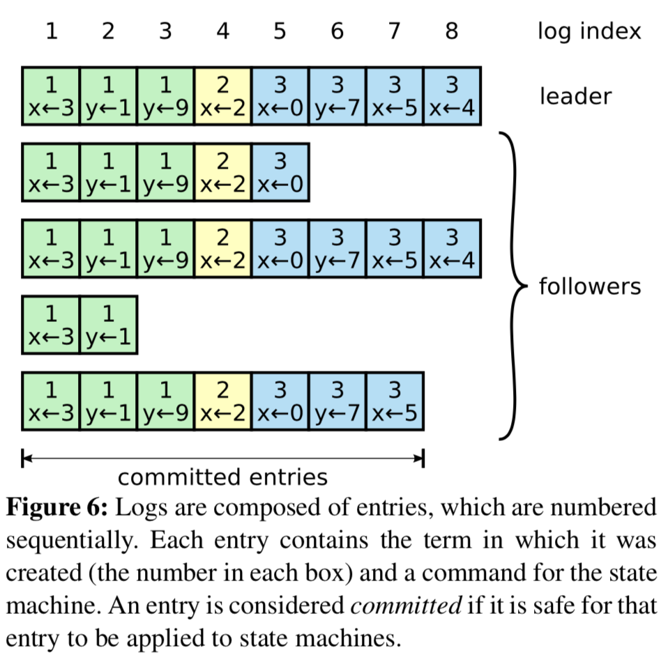

# Abstract 

Raft is a consensus algorithm for managing a replicated log. It produces a result equivalent to (multi-)Paxos, and it is as efficient as Paxos, but its structure is different from Paxos; this makes Raft more understandable than Paxos and also provides a better foundation for building practical systems. In order to enhance understandability, Raft separates the key elements of consensus, such as **leader election**, **log replication**, and **safety**, and it enforces a stronger degree of coherency to reduce the number of states that must be considered. Results from a user study demonstrate that Raft is easier for students to learn than Paxos. Raft also includes a new mechanism for changing the cluster membership, which uses **overlapping majorities** to guarantee safety. 
Raft 是一种用来管理日志复制的一致性算法。它和 Paxos 的性能和功能是一样的，但是它和 Paxos 的结构不一样；这使得 Raft 更容易理解并且更易于建立实际的系统。为了提高理解性，Raft 将一致性算法分为了几个部分，例如领导选取（leader selection），日志复制（log replication）和安全性（safety），同时它使用了更强的一致性来减少了必须需要考虑的状态。从用户学习的结果来看，Raft 比 Paxos 更容易学会。Raft 还包括了一种新的机制来使得动态改变集群成员，它使用**覆盖多数**（overlapping majorities）来保证安全。

# 1 Introduction 

Consensus algorithms allow a collection of machines to work as a coherent group that can survive the failures of some of its members. Because of this, they play a key role in building reliable large-scale software systems. Paxos [15, 16] has dominated the discussion of consensus algorithms over the last decade十年: most implementations of consensus are based on Paxos or influenced影响 by it, and Paxos has become the primary vehicle公爵 used to teach students about consensus. 
一致性算法允许一组机器像一个整体一样工作，即使其中的一些机器出了错误也能正常工作。正因为此，他们扮演着建立大规模可靠的软件系统的关键角色。在过去的十年中 Paxos 一直都主导着有关一致性算法的讨论：大多数一致性算法的实现都基于它或者受它影响，并且 Paxos 也成为了教学生关于一致性知识的主要工具。

Unfortunately, Paxos is quite difficult to understand, in spite of尽管 numerous attempts to make it more approachable. Furthermore, its architecture requires complex changes to support practical systems. As a result, both system builders and students struggle头疼，吃力 with Paxos. 
不幸的是，尽管在降低它的复杂性方面做了许多努力，Paxos 依旧很难理解。并且，Paxos 需要经过复杂的修改才能应用于实际中。这些导致了系统构构建者和学生都十分头疼。

After struggling折磨 with Paxos ourselves, we set out to find a new consensus algorithm that could provide a better foundation for system building and education. Our approach was unusual in that our primary goal was *understandability*: could we define a consensus algorithm for practical systems and describe it in a way that is significantly显著地 easier to learn than Paxos? Furthermore, we wanted the algorithm to facilitate促进 the development of intuitions直觉 that are essential必不可少 for system builders. It was important not just for the algorithm to work, but for it to be obvious why it works. 
在被 Paxos 折磨之后，我们开始寻找一种在系统构建和教学上更好的新的一致性算法。我们的首要目标是让它易于理解：我们能不能定义一种面向实际系统的一致性算法并且比 Paxos 更容易学习呢？并且，我们希望这种算法能凭直觉就能明白，这对于一个系统构建者来说是十分必要的。对于一个算法，不仅仅是让它工作起来很重要，知道它是如何工作的更重要。

The result of this work is a consensus algorithm called **Raft**. In designing Raft we applied specific techniques to improve understandability, including **decomposition** (**Raft separates leader election, log replication, and safety**) and **state space reduction** (**relative to Paxos, Raft reduces the degree of nondeterminism不确定性 and the ways servers can be inconsistent with each other**). A user study with 43 students at two universities shows that Raft is significantly easier to understand than Paxos: after learning both algorithms, 33 of these students were able to answer questions about Raft better than questions about Paxos.
我们工作的结果是一种新的一致性算法，叫做 Raft。在设计 Raft 的过程中我们应用了许多专门的技巧来提升理解性，包括算法分解（分为领导选取（leader selection），日志复制（log replication）和安全性（safety））和减少状态（state space reduction）（相对于 Paxos，Raft 减少了非确定性的程度和服务器互相不一致的方式）。在两所学校的43个学生的研究中发现，Raft 比 Paxos 要更容易理解：在学习了两种算法之后，其中的33个学生回答 Raft 的问题要比回答 Paxos 的问题要好。

Raft is similar in many ways to existing consensus algorithms (most notably, Oki and Liskov’s Viewstamped Replication [29, 22]), but it has several novel features:
Raft 算法和现在一些已经有的算法在一些地方很相似（主要是 Oki 和 Liskov 的 Viewstamped Replication。但是 Raft 有几个新的特性：

* **Strong leader**: Raft uses a stronger form of leadership than other consensus algorithms. For example, log entries only flow from the leader to other servers. This simplifies the management of the replicated log and makes Raft easier to understand. 
**强领导者**（Strong Leader）：Raft 使用一种比其他算法更强的领导形式。例如，日志条目只从领导者发送向其他服务器。这样就简化了对日志复制的管理，使得 Raft 更易于理解。

* **Leader election**: Raft uses **randomized timers** to elect leaders. This adds only a small amount of mechanism to the heartbeats already required for any consensus algorithm, while resolving conflicts simply and rapidly. 
**领导选取**（Leader Selection）：Raft 使用随机定时器来选取领导者。这种方式仅仅是在所有算法都需要实现的心跳机制上增加了一点变化，它使得在解决冲突时更简单和快速。

* **Membership changes**: Raft’s mechanism for changing the set of servers in the cluster uses a new *joint consensus* approach where the **majorities of two different configurations <u>overlap during transitions</u>**. **This allows the cluster to continue operating normally during configuration changes.** 
**成员变化**（Membership Change）：Raft 为了调整集群中成员关系使用了新的联合一致性（joint consensus）的方法，这种方法中大多数不同配置的机器在转换关系的时候会交迭（overlap）。这使得在配置改变的时候，集群能够继续操作。

We believe that Raft is superior更好 to Paxos and other consensus algorithms, both for educational purposes and as a foundation for implementation. It is simpler and more understandable than other algorithms; it is described completely enough to meet the needs of a practical system; it has several opensource implementations and is used by several companies; its safety properties have been formally specified and proven; and its efficiency is comparable to other algorithms. 
我们认为，Raft 在教学方面和实际实现方面比 Paxos 和其他算法更出众。它比其他算法更简单、更容易理解；它能满足一个实际系统的需求；它拥有许多开源的实现并且被许多公司所使用；它的安全特性已经被证明；并且它的效率和其他算法相比也具有竞争力。

The remainder of the paper introduces the replicated state machine problem (Section 2), discusses the strengths and weaknesses of Paxos (Section 3), describes our general approach to understandability (Section 4), presents the Raft consensus algorithm (Sections 5–8), evaluates Raft (Section 9), and discusses related work (Section 10). 
这篇论文剩下的部分会讲如下内容：复制状态机（replicated state machine）问题（第2节），讨论 Paxos 的优缺点（第3节），讨论我们用的为了达到提升理解性的方法（第4节），陈述 Raft 一致性算法（第5~8节），评价 Raft 算法（第9节），对相关工作的讨论（第10节）。

# 2 Replicated state machines 

Consensus algorithms typically arise in the context of *replicated state machines* [37]. In this approach, state machines on a collection of servers compute identical copies of the same state and can continue operating even if some of the servers are down. Replicated state machines are used to solve a variety of fault tolerance problems in distributed systems. For example, large-scale systems that have a single cluster leader, such as GFS [8], HDFS [38], and RAMCloud [33], typically use a separate replicated state machine to manage leader election and store configuration information that must survive leader crashes. Examples of replicated state machines include Chubby [2] and ZooKeeper [11].
一致性算法是在复制状态机的背景下提出来的。在这个方法中，在一组服务器的状态机产生同样的状态的副本因此即使有一些服务器崩溃了这组服务器也还能继续执行。复制状态机在分布式系统中被用于解决许多有关容错的问题。例如，GFS，HDFS还有 RAMCloud 这些大规模的系统都是用一个单独的集群领导者，使用一个单独的复制状态机来进行领导选取和存储配置信息来应对领导者的崩溃。使用复制状态机的例子有 Chubby 和 ZooKeeper。

Replicated state machines are typically implemented using a **replicated log**, as shown in Figure 1. Each server stores a log containing a series of commands, which its state machine executes in order. Each log contains the same commands in the same order, so each state machine processes the same sequence of commands. Since the state machines are deterministic, each computes the same state and the same sequence of outputs.
如图-1所示，复制状态机是通过**复制日志**来实现的。每一台服务器保存着一份日志，日志中包含一系列的命令，状态机会按顺序执行这些命令。因为每一台计算机的状态机都是确定的，所以每个状态机的状态都是相同的，执行的命令是相同的，最后的执行结果也就是一样的了。

Keeping the replicated log consistent is the job of the consensus algorithm. The **consensus module** on a server receives commands from clients and adds them to its log. It communicates with the consensus modules on other servers to ensure that every log eventually contains the same requests in the same order, even if some servers fail. Once commands are properly replicated, each server’s state machine processes them in log order, and the outputs are returned to clients. As a result, the servers appear to form a single, highly reliable state machine.
如何保证复制日志一致就是一致性算法的工作了。在一台服务器上，一致性模块接受客户端的命令并且把命令加入到它的日志中。它和其他服务器上的一致性模块进行通信来确保每一个日志最终包含相同序列的请求，即使有一些服务器宕机了。一旦这些命令被正确的复制了，每一个服务器的状态机都会按同样的顺序去执行它们，然后将结果返回给客户端。最终，这些服务器看起来就像一台可靠的状态机。

Consensus algorithms for practical systems typically have the following properties:
应用于实际系统的一致性算法一般有以下特性：

- They ensure ***safety*** (never returning an incorrect result) under all non-Byzantine conditions, including network delays, partitions, and packet loss, duplication, and reordering. 
确保安全性（从来不会返回一个错误的结果），即使在所有的非拜占庭（Non-Byzantine）情况下，包括网络延迟、分区、丢包、冗余和乱序的情况下。

- They are fully functional (***available***) as long as any majority of the servers are operational and can communicate with each other and with clients. Thus, a typical cluster of five servers can tolerate the failure of any two servers. Servers are assumed to fail by stopping; they may later recover from state on stable storage and rejoin the cluster. 
高可用性，只要集群中的大部分机器都能运行，可以互相通信并且可以和客户端通信，这个集群就可用。因此，一般来说，一个拥有 5 台机器的集群可以容忍其中的 2 台的失败（fail）。服务器停止工作了我们就认为它失败（fail）了，没准一会当它们拥有稳定的存储时就能从中恢复过来，重新加入到集群中。

- They **do not depend on timing** to ensure the consistency of the logs: faulty clocks and extreme message delays can, at worst, cause availability problems.
不依赖时序保证一致性，时钟错误和极端情况下的消息延迟在最坏的情况下才会引起可用性问题。

- In the common case, a command can complete as soon as a majority of the cluster has responded to a single round of remote procedure calls; a minority of slow servers need not impact overall system performance. 
通常情况下，一条命令能够尽可能快的在大多数节点对一轮远程调用作出相应时完成，一少部分慢的机器不会影响系统的整体性能。

# 3. What’s wrong不足 with Paxos?

Over the last ten years, Leslie Lamport’s Paxos protocol [15] has become almost synonymous with consensus: it is the protocol most commonly taught in courses, and most implementations of consensus use it as a starting point. Paxos first defines a protocol capable of reaching agreement on **a single decision**, such as a single replicated log entry. We refer to this subset as ***single-decree Paxos***. Paxos then combines multiple instances of this protocol to facilitate促进 a series of decisions such as a log (*multi-Paxos*). Paxos ensures both safety and liveness, and it supports changes in cluster membership. Its correctness has been proven, and it is efficient in the normal case. 
在过去的10年中，Leslie Lamport 的 Paxos 算法几乎已经成为了一致性算法的代名词：它是授课中最常见的算法，同时也是许多一致性算法实现的起点。Paxos 首先定义了一个能够达成单一决策一致的协议，例如一个单一复制日志条目（single replicated log entry）。我们把这个子集叫做单一决策 Paxos（single-decree Paxos）。之后 Paxos通过组合多个这种协议来完成一系列的决策，例如一个日志（multi-Paxos）。Paxos 确保安全性和活跃性（liveness），并且它支持集群成员的变更。它的正确性已经被证明，通常情况下也很高效。

Unfortunately, Paxos has two significant重大的 drawbacks缺陷. The first drawback is that Paxos is exceptionally **difficult to understand**. The full explanation [15] is notoriously恶名昭著 opaque晦涩难懂; few people succeed in understanding it, and only with great effort. As a result, there have been several attempts to explain Paxos in simpler terms [16, 20, 21]. These explanations focus on the single-decree subset, yet they are still challenging. In an informal survey of attendees与会者 at NSDI 2012, we found few people who were comfortable with Paxos, even among seasoned researchers. We struggled with Paxos ourselves; we were not able to understand the complete protocol until after reading several simplified explanations and designing our own alternative protocol, a process that took almost a year. 
不幸的是，Paxos 有两个致命的缺点。第一个是 Paxos 太难以理解。它的完整的解释晦涩难懂；很少有人能完全理解，只有少数人在付诸很大努力的情况下才成功的读懂了它。因此，已经有一些尝试用简单的术语来描述它。尽管这些解释都关注于单一决策子集问题，但仍具有挑战性。在 NSDI 2012 会议上的一次非正式调查显示，我们发现大家对 Paxos 都感到不满意，其中甚至包括一些有经验的研究员。我们自己也曾深陷其中，我们在读过几篇简化它的文章并且设计了我们自己的算法之后才完全理解了 Paxos，而整个过程花费了将近一年的时间。

We hypothesize that Paxos’ opaqueness derives from its choice of the single-decree subset as its foundation. Single-decree Paxos is dense and subtle: it is divided into two stages that do not have simple intuitive explanations and cannot be understood independently. Because of this, it is difficult to develop intuitions about why the single-decree protocol works. The composition rules for multi-Paxos add significant additional complexity and subtlety. We believe that the overall problem of reaching consensus on multiple decisions (i.e., a log instead of a single entry) can be decomposed in other ways that are more direct and obvious. 
我们假定 Paxos 的晦涩来源于它将单决策子集作为它的基础。单决策（Single-decree）Paxos 是晦涩且微妙的：它被划分为两个没有简单直观解释的阶段，并且难以独立理解。正因为如此，它不能很直观的让我们知道为什么单一决策协议能够工作。为多决策 Paxos 设计的规则又添加了额外的复杂性和精巧性。我们相信多决策问题能够分解为其它更直观的方式。

The second problem with Paxos is that it **does not provide a good foundation for building practical implementations**. One reason is that there is no widely agreedupon algorithm for multi-Paxos. Lamport’s descriptions are mostly about single-decree Paxos; he sketched possible approaches to multi-Paxos, but many details are missing. There have been several attempts to flesh out and optimize Paxos, such as [26], [39], and [13], but these differ from each other and from Lamport’s sketches. Systems such as Chubby [4] have implemented Paxos-like algorithms, but in most cases their details have not been published. 
Paxos 的第二个缺点是它没有为构建实际实现提供一个良好的基础。其中一个原因是，对于多决策 Paxos （multi-Paxos） ，大家还没有一个一致同意的算法。Lamport 的描述大部分都是有关于单决策 Paxos （single-decree Paxos）；他仅仅描述了实现多决策的可能的方法，缺少许多细节。有许多实现 Paxos 和优化 Paxos 的尝试，但是他们都和 Lamport 的描述有些出入。例如，Chubby 实现的是一个类似 Paxos 的算法，但是在许多情况下的细节没有公开

Furthermore, the Paxos architecture is a poor one for building practical systems; this is another consequence of the single-decree decomposition. For example, there is little benefit to choosing a collection of log entries independently and then melding them into a sequential log; this just adds complexity. It is simpler and more efficient to design a system around a log, where new entries are appended sequentially in a constrained order. Another problem is that Paxos uses a symmetric peer-to-peer approach at its core (though it eventually suggests a weak form of leadership as a performance optimization). This makes sense in a simplified world where only one decision will be made, but few practical systems use this approach. **If a series of decisions must be made, it is simpler and faster to first elect a leader, then have the leader coordinate the decisions.** 
另外，Paxos 的结构也是不容易在一个实际系统中进行实现的，这是单决策问题分解带来的又一个问题。例如，从许多日志条目中选出条目然后把它们融合到一个序列化的日志中并没有带来什么好处，它仅仅增加了复杂性。围绕着日志来设计一个系统是更简单、更高效的：新日志按照严格的顺序添加到日志中去。另一个问题是，Paxos 使用对等的点对点的实现作为它的核心（尽管它最终提出了一种弱领导者的形式来优化性能）。这种方法在只有一个决策被制定的情况下才显得有效，但是很少有现实中的系统使用它。如果要做许多的决策，选择一个领导人，由领带人来协调是更简单有效的方法

As a result, practical systems bear little resemblance几乎没有相似之处 to Paxos. Each implementation begins with Paxos, discovers the difficulties in implementing it, and then develops a significantly different architecture. This is time-consuming and error-prone, and the difficulties of understanding Paxos exacerbate恶化 the problem. Paxos’ formulation may be a good one for proving theorems about its correctness, but real implementations are so different from Paxos that the proofs have little value. The following com- ment from the Chubby implementers is typical: 
因此，在实际的系统应用中和 Paxos 算法都相差很大。所有开始于 Paxos 的实现都会遇到很多问题，然后由此衍生出了许多与 Paxos 有很大不同的架构。这是既费时又容易出错的，并且理解 Paxos 的难以理解又恶化了这些问题。Paxos 算法在它正确性的理论证明上是很好的，但是在实现上的价值就远远不足了。来自 Chubby 的实现的一条评论就能够说明：

> There are significant gaps between the description of the Paxos algorithm and the needs of a real-world system. . . . the final system will be based on an unproven protocol [4]. 
> Paxos 算法的描述与实际实现之间存在巨大的鸿沟…最终的系统往往建立在一个没有被证明的算法之上。

Because of these problems, we concluded that Paxos does not provide a good foundation either for system building or for education. Given the importance of consensus in large-scale software systems, we decided to see if we could design an alternative consensus algorithm with better properties than Paxos. Raft is the result of that experiment. 
正因为存在这些问题，我们认为 Paxos 不仅对于系统的构建者来说不友好，同时也不利于教学。鉴于一致性算法对于大规模软件系统的重要性，我们决定试着来设计一种另外的比 Paxos 更好的一致性算法。Raft 就是这样的一个算法。

# 4 Designing for understandability

We had several goals in designing Raft: it must provide a complete and practical foundation for system building, so that it significantly reduces the amount of design work required of developers; it must be safe under all conditions and available under typical operating conditions; and it must be efficient for common operations. But our most important goal—and most difficult challenge—was *understandability*. It must be possible for a large audience to understand the algorithm comfortably. In addition, it must be possible to develop intuitions直观的认识 about the algorithm, so that system builders can make the extensions that are inevitable难免的 in real-world implementations.  				 			 	
设计 Raft 的目标有如下几个：它必须提供一个完整的、实际的基础来进行系统构建，为的是减少开发者的工作；它必须在所有情况下都能保证安全可用；它对于常规操作必须高效；最重要的目标是：易于理解，它必须使得大多数人能够很容易的理解；另外，它必须能让开发者有一个直观的认识，这样才能使系统构建者们去对它进行扩展。

There were numerous points in the design of Raft where we had to choose among alternative approaches. In these situations we evaluated the alternatives based on understandability: how hard is it to explain each alternative (for example, how complex is its state space, and does it have subtle implications?), and how easy will it be for a reader to completely understand the approach and its implications? 
在设计 Raft 的过程中，我们不得不在许多种方法中做出选择。当面临这种情况时，我们通常会**权衡可理解性**：每种方法的可理解性是如何的？（例如，它的状态空间有多复杂？它是不是有很细微的含义？）它的可读性如何？读者能不能轻易地理解这个方法和它的含义？

We recognize that there is a high degree of subjectivity主管性 in such analysis; nonetheless, we used two techniques that are generally applicable. The first technique is the well-known approach of problem decomposition: wherever possible, we divided problems into separate pieces that could be solved, explained, and understood relatively independently. For example, in Raft we separated leader election, log replication, safety, and membership changes. 
我们意识到对这种可理解性的分析具有高度的主观性；尽管如此，我们使用了两种适用的方式。第一种是众所周知的**问题分解**：我们尽可能将问题分解成为若干个可解决的、可被理解的小问题。例如，在 Raft 中，我们把问题分解成为了领导选取（leader election）、日志复制（log replication）、安全（safety）和成员变化（membership changes）。

Our second approach was to **simplify the state space by reducing the number of states to consider**, making the system more coherent and eliminating nondeterminism where possible. Specifically, logs are not allowed to have holes, and Raft limits the ways in which logs can become inconsistent with each other. Although in most cases we tried to eliminate nondeterminism, there are some situations where nondeterminism actually improves understandability. In particular, randomized approaches introduce nondeterminism, but they tend to reduce the state space by **handling all possible choices in a similar fashion** (“choose any; it doesn’t matter”). We used **randomization** to simplify the Raft leader election algorithm. 
我们采用的第二个方法是通过减少需要考虑的状态的数量将状态空间简化，这能够使得整个系统更加一致并且尽可能消除不确定性。特别地，日志之间不允许出现空洞，并且 Raft 限制了限制了日志不一致的可能性。尽管在大多数情况下，我们都都在试图消除不确定性，但是有时候有些情况下，不确定性使得算法更易理解。尤其是，随机化方法使得不确定性增加，但是它通过以相似的方式来处理所有可能的选择，从而减少了状态空间。我们使用随机化来简化了 Raft 中的领导选取算法。

# 5 The Raft consensus algorithm

Raft is an algorithm for managing a replicated log of the form described in Section 2. Figure 2 summarizes the algorithm in condensed form for reference, and Figure 3 lists key properties of the algorithm; the elements of these figures are discussed piecewise over the rest of this section. 
Raft 是一种用来管理第 2 章中提到的复制日志的算法。表-2 为了方便参考是一个算法的总结版本，表-3 列举了算法中的关键性质；表格中的这些元素将会在这一章剩下的部分中分别进行讨论。

**状态：**

在所有服务器上持久存在的：（在响应远程过程调用 RPC 之前稳定存储的）

| 名称        | 描述                                                         |
| ----------- | ------------------------------------------------------------ |
| currentTerm | 服务器最后知道的任期号（从0开始递增）                        |
| votedFor    | 在当前任期内收到选票的候选人 id（如果没有就为 null）         |
| log[]       | 日志条目；每个条目包含状态机的要执行命令和从领导人处收到时的任期号 |

在所有服务器上不稳定存在的：

| 名称        | 描述                                              |
| ----------- | ------------------------------------------------- |
| commitIndex | 已知的被提交的最大日志条目的索引值（从0开始递增） |
| lastApplied | 被状态机执行的最大日志条目的索引值（从0开始递增） |

在领导人服务器上不稳定存在的：（在选举之后初始化的）

| 名称         | 描述                                                         |
| ------------ | ------------------------------------------------------------ |
| nextIndex[]  | 对于每一个服务器，记录需要发给它的下一个日志条目的索引（初始化为领导人上一条日志的索引值+1） |
| matchIndex[] | 对于每一个服务器，记录已经复制到该服务器的日志的最高索引值（从0开始递增） |

**附加日志远程过程调用 （AppendEntries RPC）**

由领导人来调用复制日志（5.3节）；也会用作heartbeat

| 参数         | 描述                                                         |
| ------------ | ------------------------------------------------------------ |
| term         | 领导人的任期号                                               |
| leaderId     | 领导人的 id，为了其他服务器能重定向到客户端                  |
| prevLogIndex | 最新日志之前的日志的索引值                                   |
| prevLogTerm  | 最新日志之前的日志的领导人任期号                             |
| entries[]    | 将要存储的日志条目（表示 heartbeat 时为空，有时会为了效率发送超过一条） |
| leaderCommit | 领导人提交的日志条目索引值                                   |

| 返回值  | 描述                                                         |
| ------- | ------------------------------------------------------------ |
| term    | 当前的任期号，用于领导人更新自己的任期号                     |
| success | 如果其它服务器包含能够匹配上 prevLogIndex 和 prevLogTerm 的日志时为真 |

接受者需要实现：

1. 如果 `term < currentTerm`返回 false（5.1节）
2. 如果在`prevLogIndex`处的日志的任期号与`prevLogTerm`不匹配时，返回 false（5.3节）
3. 如果一条已经存在的日志与新的冲突（index 相同但是任期号 term 不同），则删除已经存在的日志和它之后所有的日志（5.3节）
4. 添加任何在已有的日志中不存在的条目
5. 如果`leaderCommit > commitIndex`，将`commitIndex`设置为`leaderCommit`和最新日志条目索引号中较小的一个

**投票请求 RPC（RequestVote RPC）**

由候选人发起收集选票（5.2节）

| 参数         | 描述                           |
| ------------ | ------------------------------ |
| term         | 候选人的任期号                 |
| candidateId  | 请求投票的候选人 id            |
| lastLogIndex | 候选人最新日志条目的索引值     |
| lastLogTerm  | 候选人最新日志条目对应的任期号 |

| 返回值      | 描述                             |
| ----------- | -------------------------------- |
| term        | 目前的任期号，用于候选人更新自己 |
| voteGranted | 如果候选人收到选票为 true        |

接受者需要实现：

1. 如果`term < currentTerm`返回 false（5.1节）
2. 如果`votedFor`为空或者与`candidateId`相同，并且候选人的日志和自己的日志一样新，则给该候选人投票（5.2节 和 5.4节）

**服务器需要遵守的规则：**

所有服务器：

- 如果`commitIndex > lastApplied`，`lastApplied`自增，将`log[lastApplied]`应用到状态机（5.3节）
- 如果 RPC 的请求或者响应中包含一个 term T 大于 `currentTerm`，则`currentTerm`赋值为 T，并切换状态为追随者（Follower）（5.1节）

追随者（followers）: 5.2节

- 响应来自候选人和领导人的 RPC
- 如果在超过选取领导人时间之前没有收到来自当前领导人的`AppendEntries RPC`或者没有收到候选人的投票请求，则自己转换状态为候选人

候选人：5.2节

- 转变为选举人之后开始选举：
  - `currentTerm`自增
  - 给自己投票
  - 重置选举计时器
  - 向其他服务器发送`RequestVote RPC`
- 如果收到了来自大多数服务器的投票：成为领导人
- 如果收到了来自新领导人的`AppendEntries RPC（heartbeat）`：转换状态为追随者
- 如果选举超时：开始新一轮的选举

领导人：

- 一旦成为领导人：向其他所有服务器发送空的`AppendEntries RPC（heartbeat）`;在空闲时间重复发送以防止选举超时（5.2节）

- 如果收到来自客户端的请求：向本地日志增加条目，在该条目应用到状态机后响应客户端（5.3节）

- 对于一个追随者来说，如果上一次收到的日志索引大于将要收到的日志索引（nextIndex）：通过 AppendEntries RPC 将 nextIndex 之后的所有日志条目发送出去

  - 如果发送成功：将该追随者的 `nextIndex`和`matchIndex`更新
  - 如果由于日志不一致导致`AppendEntries RPC`失败：`nextIndex`递减并且重新发送（5.3节）

- 如果存在一个满足`N > commitIndex`和`matchIndex[i] >= N`并且`log[N].term == currentTerm`的 N，则将`commitIndex`赋值为 N

| 性质                                   | 描述                                                         |
| -------------------------------------- | ------------------------------------------------------------ |
| 选举安全原则（Election Safety）        | 一个任期（term）内最多允许有一个领导人被选上（5.2节）        |
| 领导人只增加原则（Leader Append-Only） | 领导人永远不会覆盖或者删除自己的日志，它只会增加条目         |
| 日志匹配原则（Log Matching）           | 如果两个日志在相同的索引位置上的日志条目的任期号相同，那么我们就认为这个日志从头到这个索引位置之间的条目完全相同（5.3 节） |
| 领导人完全原则（Leader Completeness)   | 如果一个日志条目在一个给定任期内被提交，那么这个条目一定会出现在所有任期号更大的领导人中 |
| 状态机安全原则（State Machine Safety） | 如果一个服务器已经将给定索引位置的日志条目应用到状态机中，则所有其他服务器不会在该索引位置应用不同的条目（5.4.3节） |

Raft implements consensus by first electing a distinguished ***leader***, then giving the leader complete responsibility for managing the replicated log. The leader accepts log entries from clients, replicates them on other servers, and tells servers when it is safe to apply log entries to their state machines. Having a leader simplifies the management of the replicated log. For example, the leader can decide where to place new entries in the log without consulting other servers, and data flows in a simple fashion from the leader to other servers. A leader can fail or be- come disconnected from the other servers, in which case a new leader is elected. 
Raft 通过首先选出一个领导人来实现一致性，然后给予领导人完全管理复制日志（replicated log）的责任。领导人接收来自客户端的日志条目，并把它们复制到其他的服务器上，领带人还要告诉服务器们什么时候将日志条目应用到它们的状态机是安全的。通过选出领导人能够简化复制日志的管理工作。例如，领导人能够决定将新的日志条目放到哪，而并不需要和其他的服务器商议，数据流被简化成从领导人流向其他服务器。如果领导人宕机或者和其他服务器失去连接，就可以选取下一个领导人。

Given the leader approach, Raft decomposes the consensus problem into three relatively independent subproblems, which are discussed in the subsections that follow: 
通过选出领导人，Raft 将一致性问题分解成为三个相对独立的子问题：

* **Leader election**: a new leader must be chosen when an existing leader fails (Section 5.2). 
领导人选取（Leader election）： 在一个领导人宕机之后必须要选取一个新的领导人（5.2节）
* **Log replication**: the leader must accept log entries  from clients and replicate them across the cluster, forcing the other logs to agree with its own (Section 5.3). 
日志复制（Log replication）： 领导人必须从客户端接收日志然后复制到集群中的其他服务器，并且强制要求其他服务器的日志保持和自己相同
*  **Safety**: the key safety property for Raft is the State Machine Safety Property in Figure 3: if any server has applied a particular log entry to its state machine, then no other server may apply a different command for the same log index. Section 5.4 describes how Raft ensures this property; the solution involves an additional restriction on the election mechanism described in Section 5.2. 
安全性（Safety）： Raft 的关键的安全特性是 表-3 中提到的状态机安全原则（State Machine Safety）:如果一个服务器已经将给定索引位置的日志条目应用到状态机中，则所有其他服务器不会在该索引位置应用不同的条目。5.4节阐述了 Raft 是如何保证这条原则的，解决方案涉及到一个对于选举机制另外的限制，这一部分会在 5.2节 中说明。

After presenting the consensus algorithm, this section discusses the issue of availability and the role of timing in the system. 
在说明了一致性算法之后，本章会讨论有关可用性（availability）的问题和系统中时序（timing）的问题。

## 5.1 Raft basics

A Raft cluster contains several servers; five is a typical number, which allows the system to tolerate two failures. At any given time each server is in one of three states: *leader*, *follower*, or *candidate*. In normal operation there is exactly one leader and all of the other servers are followers. Followers are passive: they issue no requests on their own but simply respond to requests from leaders and candidates. The leader handles all client requests (if a client contacts a follower, the follower redirects it to the leader). The third state, candidate, is used to elect a new leader as described in Section 5.2. Figure 4 shows the states and their transitions; the transitions are discussed below. 
一个 Raft 集群包括若干服务器；对于一个典型的 5 服务器集群，该集群能够容忍 2 台机器不能正常工作，而整个系统保持正常。在任意的时间，每一个服务器一定会处于以下三种状态中的一个：领导人、候选人、追随者。在正常情况下，只有一个服务器是领导人，剩下的服务器是追随者。追随者们是被动的：他们不会发送任何请求，只是响应来自领导人和候选人的请求。领导人来处理所有来自客户端的请求（如果一个客户端与追随者进行通信，追随者会将信息发送给领导人）。候选人是用来选取一个新的领导人的，这一部分会在 5.2节 进行阐释。图-4 阐述了这些状态，和它们之间的转换；它们的转换会在下边进行讨论。

Raft divides time into *terms* of arbitrary length, as shown in Figure 5. Terms are numbered with consecutive integers. Each term begins with an *election*, in which one or more candidates attempt to become leader as described in Section 5.2. If a candidate wins the election, then it serves as leader for the rest of the term. In some situations an election will result in a split vote. In this case the term will end with no leader; a new term (with a new election) will begin shortly. Raft ensures that there is at most one leader in a given term. 
如 图-5 所示，Raft 算法将时间划分成为任意不同长度的任期（term）。任期用连续的数字进行表示。每一个任期的开始都是一次选举（election），就像 5.2节 所描述的那样，一个或多个候选人会试图成为领导人。如果一个候选人赢得了选举，它就会在该任期的剩余时间担任领导人。在某些情况下，选票会被瓜分，有可能没有选出领导人，那么，将会开始另一个任期，并且立刻开始下一次选举。Raft 算法保证在给定的一个任期最少要有一个领导人。

>图-4：服务器的状态。追随者只响应其他服务器的请求。如果追随者没有收到任何消息，它会成为一个候选人并且开始一次选举。收到大多数服务器投票的候选人会成为新的领导人。领导人在它们宕机之前会一直保持领导人的状态。
 图-5：时间被分为一个个的任期（term），每一个任期的开始都是领导人选举。在成功选举之后，一个领导人会在任期内管理整个集群。如果选举失败，该任期就会因为没有领带人而结束。这个转变会在不同的时间的不同服务器上观察到。

Different servers may observe the transitions between terms at different times, and in some situations a server may not observe an election or even entire terms. **Terms act as a logical clock [14] in Raft, and they allow servers to detect obsolete废弃 information such as stale leaders. Each server stores a *current term* number, which increases monotonically over time. Current terms are exchanged whenever servers communicate; if one server’s current term is smaller than the other’s, then it updates its current term to the larger value. If a candidate or leader discovers that its term is out of date, it immediately reverts to follower state. If a server receives a request with a stale term number, it rejects the request.** 
不同的服务器可能会在不同的时间内观察到任期之间的的转换，在某些情况下，甚至整个完整的任期内，一台服务器都可能看不到一次选举。任期在 Raft 中充当逻辑时钟的角色，并且它们允许服务器检测过期的信息，比如过时的领导人。每一台服务器都存储着一个当前任期的数字，这个数字会单调的增加。当服务器之间进行通信时，会互相交换当前任期号；如果一台服务器的当前任期号比其它服务器的小，则更新为较大的任期号。如果一个候选人或者领导人意识到它的任期号过时了，它会立刻转换为追随者状态。如果一台服务器收到的请求的任期号是过时的，那么它会拒绝此次请求。

Raft servers communicate using remote procedure calls (RPCs), and the basic consensus algorithm requires only two types of RPCs. RequestVote RPCs are initiated by candidates during elections (Section 5.2), and Append- Entries RPCs are initiated by leaders to replicate log entries and to provide a form of heartbeat (Section 5.3). Section 7 adds a third RPC for transferring snapshots between servers. Servers retry RPCs if they do not receive a response in a timely manner, and they issue RPCs in parallel for best performance. 
Raft 中的服务器通过远程过程调用（RPC）来通信，基本的 Raft 一致性算法仅需要 2 种 RPC。RequestVote RPC 是候选人在选举过程中触发的（5.2节），AppendEntries RPC 是领导人触发的，为的是复制日志条目和提供一种心跳（heartbeat）机制（5.3节）。第7章加入了第三种 RPC 来在各个服务器之间传输快照（snapshot）。如果服务器没有及时收到 RPC 的响应，它们会重试，并且它们能够并行的发出 RPC 来获得最好的性能。

## 5.2 Leader election 

Raft uses a heartbeat mechanism to trigger leader election. When servers start up, they begin as followers. A server remains in follower state as long as it receives valid RPCs from a leader or candidate. Leaders send periodic heartbeats (AppendEntries RPCs that carry no log entries) to all followers in order to maintain their authority. If a follower receives no communication over a period of time called the *election timeout*, then it assumes there is no viable leader and begins an election to choose a new leader. 
Raft 使用一种心跳机制（heartbeat）来触发领导人的选取。当服务器启动时，它们会初始化为追随者。服务器会一直保持追随者的状态只要它们能够收到来自领导人或者候选人的有效 RPC。领导人会向所有追随者周期性发送心跳（heartbeat，不带有任何日志条目的 AppendEntries RPC）来保证它们的领导人地位。如果一个追随者在一个周期内没有收到心跳信息，就叫做选举超时（election timeout）,然后它就会假定没有可用的领导人并且开始一次选举来选出一个新的领导人。

To begin an election, a follower increments its current term and transitions to candidate state. It then votes for itself and issues RequestVote RPCs in parallel to each of the other servers in the cluster. A candidate continues in this state until one of three things happens: (a) it wins the election, (b) **another server establishes itself as leader**, or (c) a period of time goes by with no winner. These outcomes are discussed separately in the paragraphs below. 
为了开始选举，一个追随者会自增它的当前任期并且转换状态为候选人。然后，它会给自己投票并且给集群中的其他服务器发送 RequestVote RPC。一个候选人会一直处于该状态，直到下列三种情形之一发生：a.它赢得了选举；b.另一台服务器赢得了选举；c.一段时间后没有任何一台服务器赢得了选举。这些情形会在下面的章节中分别讨论。

A candidate wins an election if it receives votes from a **majority** of the servers in the full cluster for the same term. Each server will vote for at most one candidate in a given term, on a **first-come-first-served basis** (note: Sec- tion 5.4 adds an additional restriction on votes). The majority rule ensures that at most one candidate can win the election for a particular term (the Election Safety Property in Figure 3). Once a candidate wins an election, it becomes leader. It then sends heartbeat messages to all of the other servers to establish its authority and prevent new elections. 
一个候选人如果在一个任期内收到了来自集群中大多数服务器的投票就会赢得选举。在一个任期内，一台服务器最多能给一个候选人投票，按照先到先服务原则（first-come-first-served）（注意：在 5.4节 针对投票添加了一个额外的限制）。大多数原则使得在一个任期内最多有一个候选人能赢得选举（表-3 中提到的选举安全原则）。一旦有一个候选人赢得了选举，它就会成为领导人。然后它会像其他服务器发送心跳信息来建立自己的领导地位并且组织新的选举。

While waiting for votes, a candidate may receive an AppendEntries RPC from another server claiming to be leader. If the leader’s term (included in its RPC) is at least as large as the candidate’s current term, then the candidate recognizes the leader as legitimate合法 and returns to follower state. If the term in the RPC is smaller than the candidate’s current term, then the candidate rejects the RPC and continues in candidate state. 
当一个候选人等待别人的选票时，它有可能会收到来自其他服务器发来的声明其为领导人的 AppendEntries RPC。如果这个领导人的任期（包含在它的 RPC 中）比当前候选人的当前任期要大，则候选人认为该领导人合法，并且转换自己的状态为追随者。如果在这个 RPC 中的任期小于候选人的当前任期，则候选人会拒绝此次 RPC， 继续保持候选人状态。

The third possible outcome is that a candidate neither wins nor loses the election: if many followers become candidates at the same time, votes could be split so that no candidate obtains a majority. When this happens, each candidate will time out and start a new election by incrementing its term and initiating another round of Request- Vote RPCs. However, without extra measures split votes could repeat indefinitely. 
第三种情形是一个候选人既没有赢得选举也没有输掉选举：如果许多追随者在同一时刻都成为了候选人，选票会被分散，可能没有候选人能获得大多数的选票。当这种情形发生时，每一个候选人都会超时，并且通过自增任期号和发起另一轮 RequestVote RPC 来开始新的选举。然而，如果没有其它手段来分配选票的话，这种情形可能会无限的重复下去。

Raft uses **randomized election timeouts** to ensure that split votes are rare and that they are resolved quickly. To prevent split votes in the first place, election timeouts are chosen randomly from a fixed interval (e.g., 150–300ms). This spreads out错开 the servers so that in most cases only a single server will time out; it wins the election and sends heartbeats before any other servers time out. The same mechanism is used to handle split votes. Each candidate restarts its randomized election timeout at the start of an election, and it waits for that timeout to elapse before starting the next election; this reduces the likelihood可能性 of another split vote in the new election. Section 9.3 shows that this approach elects a leader rapidly. 
Raft 使用随机的选举超时时间来确保第三种情形很少发生，并且能够快速解决。为了防止在一开始是选票就被瓜分，选举超时时间是在一个固定的间隔内随机选出来的（例如，150~300ms）。这种机制使得在大多数情况下只有一个服务器会率先超时，它会在其它服务器超时之前赢得选举并且向其它服务器发送心跳信息。同样的机制被用于选票一开始被瓜分的情况下。每一个候选人在开始一次选举的时候会重置一个随机的选举超时时间，在超时进行下一次选举之前一直等待。这能够减小在新的选举中一开始选票就被瓜分的可能性。9.3节 展示了这种方法能够快速的选出一个领导人。

Elections are an example of how understandability guided our choice between design alternatives. Initially we planned to use a ranking system: each candidate was assigned a unique rank, which was used to select between competing candidates. If a candidate discovered another candidate with higher rank, it would return to follower state so that the higher ranking candidate could more easily win the next election. We found that this approach created subtle issues around availability (a lower-ranked server might need to time out and become a candidate again if a higher-ranked server fails, but if it does so too soon, it can reset progress towards electing a leader). We made adjustments to the algorithm several times, but after each adjustment new corner cases appeared. Eventually we concluded that the randomized retry approach is more obvious and understandable. 
选举是一个理解性引导我们设计替代算法的一个例子。最开始时，我们计划使用一种排名系统：给每一个候选人分配一个唯一的排名，用于在竞争的候选人之中选择领导人。如果一个候选人发现了另一个比它排名高的候选人，那么它会回到追随者的状态，这样排名高的候选人会很容易地赢得选举。但是我们发现这种方法在可用性方面有一点问题（一个低排名的服务器在高排名的服务器宕机后，需要等待超时才能再次成为候选人，但是如果它这么做的太快，它能重置选举领导人的过程）。我们对这个算法做了多次调整，但是每次调整后都会出现一些新的问题。最终我们认为随机重试的方法是更明确并且更易于理解的。

## 5.3 Log replication

Once a leader has been elected, it begins servicing client requests. Each client request contains a command to be executed by the replicated state machines. The leader appends the command to its log as a new entry, then issues AppendEntries RPCs in parallel to each of the other servers to replicate the entry. When the entry has been safely replicated (as described below), the leader applies the entry to its state machine and returns the result of that execution to the client. If followers crash or run slowly, or if network packets are lost, the leader retries Append- Entries RPCs indefinitely (even after it has responded to the client) until all followers eventually store all log entries. 
一旦选出了领导人，它就开始服务客户端的请求。每一个客户端请求都包含一条需要被副本状态机（replicated state machine）执行的命令。领导人把这条命令作为新的日志条目加入到它的日志中去，然后并行的向其他服务器发起 AppendEntries RPC ，要求其它服务器备份这个条目。当这个条目被安全的备份之后（下面的部分会详细阐述），领导人会将这个条目应用到它的状态机中并且会向客户端返回执行结果。如果追随者崩溃了或者运行缓慢或者是网络丢包了，领导人会无限的重试 AppendEntries RPC（甚至在它向客户端响应之后）直到所有的追随者最终存储了所有的日志条目。

>图-6：日志由有序编号的日志条目组成。每个日志条目包含它被创建时的任期号（每个方块中的数字），并且包含用于状态机执行的命令。如果一个条目能够被状态机安全执行，就被认为可以提交了。

Logs are organized as shown in Figure 6. Each log entry stores a state machine command along with the term number when the entry was received by the leader. The term numbers in log entries are used to detect inconsistencies between logs and to ensure some of the properties in Figure 3. **Each log entry also has an integer index identifying its position in the log**. 
日志就像 图-6 所示那样组织的。每个日志条目存储着一条被状态机执行的命令和当这条日志条目被领导人接收时的任期号。日志条目中的任期号用来检测在不同服务器上日志的不一致性，并且能确保 图-3 中的一些特性。每个日志条目也包含一个整数索引来表示它在日志中的位置。

The leader decides when it is safe to apply a log entry to the state machines; such an entry is called ***committed***. Raft guarantees that committed entries are durable持久 and will **eventually** be executed by all of the available state machines. A log entry is committed once the leader that created the entry has replicated it on a majority of the servers (e.g., entry 7 in Figure 6). This also commits all preceding entries in the leader’s log, including entries created by previous leaders. Section 5.4 discusses some subtleties when applying this rule after leader changes, and it also shows that this definition of commitment is safe. The leader keeps track of the highest index it knows to be committed, and it includes that index in future AppendEntries RPCs (including heartbeats) so that the other servers eventually find out. Once a follower learns that a log entry is committed, it applies the entry to its local state machine (in log order). 
领导人决定什么时候将日志条目应用到状态机是安全的；这种条目被称为可被提交（commited）。Raft 保证可被提交（commited）的日志条目是持久化的并且最终会被所有可用的状态机执行。一旦被领导人创建的条目已经复制到了大多数的服务器上，这个条目就称为commited（例如，图-6中的7号条目）。领导人日志中之前的条目都是可被提交的（commited），包括由之前的领导人创建的条目。5.4节将会讨论当领导人更替之后这条规则的应用问题的细节，并且也讨论了这种提交方式是安全的。领导人跟踪记录它所知道的被提交条目的最大索引值，并且这个索引值会包含在之后的 AppendEntries RPC 中（包括心跳 heartbeat 中），为的是让其他服务器都知道这条条目已经提交。一旦一个追随者知道了一个日志条目已经被提交，它会将该条目应用至本地的状态机（按照日志顺序）。

We designed the Raft log mechanism to maintain a high level of coherency between the logs on different servers. Not only does this simplify the system’s behavior and make it more predictable, but it is an important component of ensuring safety. Raft maintains the following properties, which together constitute the Log Matching Property in Figure 3: 
我们设计了 Raft 日志机制来保证不同服务器上日志的一致性。这样做不仅简化了系统的行为使得它更可预测，并且也是保证安全性不可或缺的一部分。Raft 保证以下特性，并且也保证了 表-3 中的日志匹配原则（Log Matching Property）:

• If two entries in different logs have the same index and term, then they store the same command. 
如果在不同日志中的两个条目有着相同的索引和任期号，则它们所存储的命令是相同的。

• If two entries in different logs have the same index and term, then the logs are identical完全相同 in all preceding在…前面 entries. 
如果在不同日志中的两个条目有着相同的索引和任期号，则它们之前的所有条目都是完全一样的。

The first property follows from the fact that a leader creates at most one entry with a given log index in a given term, and log entries never change their position in the log. The second property is guaranteed by a simple consistency check performed by AppendEntries. **When sending an AppendEntries RPC, the leader includes the index and term of the entry in its log that immediately precedes紧接之前的 the new entries. If the follower does not find an entry in its log with the same index and term, then it refuses the new entries**. The consistency check acts as an induction step: the initial empty state of the logs satisfies the Log Matching Property, and the consistency check preserves the Log Matching Property whenever logs are extended. As a result, whenever AppendEntries returns successfully, the leader knows that the follower’s log is identical to its own log up through the new entries. 
第一条特性源于领导人在一个任期里在给定的一个日志索引位置最多创建一条日志条目，同时该条目在日志中的位置也从来不会改变。第二条特性源于 AppendEntries 的一个简单的一致性检查。当发送一个 AppendEntries RPC 时，领导人会把新日志条目紧接着之前的条目的索引位置和任期号都包含在里面。如果追随者没有在它的日志中找到相同索引和任期号的日志，它就会拒绝新的日志条目。这个一致性检查就像一个归纳步骤：一开始空的日志的状态一定是满足日志匹配原则的，一致性检查保证了当日志添加时的日志匹配原则。因此，只要 AppendEntries 返回成功的时候，领导人就知道追随者们的日志和它的是一致的了。

>图-7：当最上边的领导人掌权之后，追随者日志可能有以下情况（a~f）。一个格子表示一个日志条目；格子中的数字是它的任期。一个追随者可能会丢失一些条目（a, b）；可能多出来一些未提交的条目（c, d）；或者两种情况都有（e, f）。例如，场景 f 在如下情况下就会发生：如果一台服务器在任期2时是领导人并且往它的日志中添加了一些条目，然后在将它们提交之前就宕机了，之后它很快重启了，成为了任期3的领导人，又往它的日志中添加了一些条目，然后在任期2和任期3中的条目提交之前它又宕机了并且几个任期内都一直处于宕机状态。

During normal operation, the logs of the leader and followers stay consistent, so the AppendEntries consistency check never fails. However, leader crashes can leave the logs inconsistent (the old leader may not have fully replicated all of the entries in its log). These inconsistencies can compound over a series of leader and follower crashes. Figure 7 illustrates the ways in which followers’ logs may differ from that of a new leader. A follower may be missing entries that are present on the leader, it may have extra entries that are not present on the leader, or both. Missing and extraneous entries in a log may span multiple terms. 
在一般情况下，领导人和追随者们的日志保持一致，因此 AppendEntries 一致性检查通常不会失败。然而，领导人的崩溃会导致日志不一致（旧的领导人可能没有完全复制完日志中的所有条目）。这些不一致会导致一系列的领导人和追随者崩溃。图-7 阐述了一些追随者可能和新的领导人日志不同的情况。一个追随者可能会丢失掉领导人上的一些条目，也有可能包含一些领导人没有的条目，也有可能两者都会发生。丢失的或者多出来的条目可能会持续多个任期。

In Raft, the leader handles inconsistencies by **forcing the followers’ logs to duplicate its own**. This means that conflicting entries in follower logs will be overwritten with entries from the leader’s log. Section 5.4 will show that this is safe when coupled with one more restriction. 
在 Raft 算法中，领导人通过强制追随者们复制它的日志来处理日志的不一致。这就意味着，在追随者上的冲突日志会被领导者的日志覆盖。5.4节会说明当添加了一个额外的限制之后这是安全的。

To bring a follower’s log into consistency with its own, the leader must **find the latest log entry where the two logs agree, delete any entries in the follower’s log after that point, and send the follower all of the leader’s entries after that point**. <u>All of these actions happen in response to the consistency check performed by AppendEntries RPCs. The leader maintains a *nextIndex* for each follower, which is the index of the next log entry the leader will send to that follower. When a leader first comes to power, it initializes all nextIndex values to the index just after the last one in its log (11 in Figure 7). If a follower’s log is inconsistent with the leader’s, the AppendEntries consistency check will fail in the next AppendEntries RPC. After a rejection, the leader decrements nextIndex and retries the AppendEntries RPC. Eventually nextIndex will reach a point where the leader and follower logs match. When this happens, AppendEntries will succeed, which removes any conflicting entries in the follower’s log and appends entries from the leader’s log (if any). Once AppendEntries succeeds, the follower’s log is consistent with the leader’s, and it will remain that way for the rest of the term.</u> 
为了使得追随者的日志同自己的一致，领导人需要找到追随者同它的日志一致的地方，然后删除追随者在该位置之后的条目，然后将自己在该位置之后的条目发送给追随者。这些操作都在 AppendEntries RPC 进行一致性检查时完成。领导人给每一个追随者维护了一个nextIndex，它表示领导人将要发送给该追随者的下一条日志条目的索引。当一个领导人开始掌权时，它会将nextIndex初始化为它的最新的日志条目索引数+1（图-7 中的 11）。如果一个追随者的日志和领导者的不一致，AppendEntries 一致性检查会在下一次 AppendEntries RPC 时返回失败。在失败之后，领导人会将nextIndex递减然后重试 AppendEntries RPC。最终nextIndex会达到一个领导人和追随者日志一致的地方。这时，AppendEntries 会返回成功，追随者中冲突的日志条目都被移除了，并且添加所缺少的上了领导人的日志条目。一旦 AppendEntries 返回成功，追随者和领导人的日志就一致了，这样的状态会保持到该任期结束。

If desired, the protocol can be optimized to reduce the number of rejected AppendEntries RPCs. For example, when rejecting an AppendEntries request, the follower can include the term of the conflicting entry and the first index it stores for that term. With this information, the leader can decrement nextIndex to bypass all of the conflicting entries in that term; one AppendEntries RPC will be required for each term with conflicting entries, rather than one RPC per entry. In practice, we doubt this optimization is necessary, since failures happen infrequently and it is unlikely that there will be many inconsistent entries.
如果需要的话，算法还可以进行优化来减少 AppendEntries RPC 失败的次数。例如，当拒绝了一个 AppendEntries 请求，追随者可以记录下冲突日志条目的任期号和自己存储那个任期的最早的索引。通过这些信息，领导人能够直接递减nextIndex跨过那个任期内所有的冲突条目；这样的话，一个冲突的任期需要一次 AppendEntries RPC，而不是每一个冲突条目需要一次 AppendEntries RPC。在实践中，我们怀疑这种优化是否是必要的，因为AppendEntries 一致性检查很少失败并且也不太可能出现大量的日志条目不一致的情况。

With this mechanism, a leader does not need to take any special actions to restore log consistency when it comes to power. It just begins normal operation, and the logs automatically converge追平 in response to failures of the AppendEntries consistency check. A leader never overwrites or deletes entries in its own log (the Leader Append-Only Property in Figure 3).
通过这种机制，一个领导人在掌权时不需要采取另外特殊的方式来恢复日志的一致性。它只需要使用一些常规的操作，通过响应 AppendEntries 一致性检查的失败能使得日志自动的趋于一致。一个领导人从来不会覆盖或者删除自己的日志（表-3 中的领导人只增加原则）。

This log replication mechanism exhibits the desirable consensus properties described in Section 2: Raft can accept, replicate, and apply new log entries as long as a majority of the servers are up; in the normal case a new entry can be replicated with a single round of RPCs to a majority of the cluster; and a single slow follower will not impact performance.
这个日志复制机制展示了在第2章中阐述的所希望的一致性特性：Raft 能够接受，复制并且应用新的日志条目只要大部分的服务器是正常的。在通常情况下，一条新的日志条目可以在一轮 RPC 内完成在集群的大多数服务器上的复制；并且一个速度很慢的追随者并不会影响整体的性能。

## 5.4 Safety

The previous sections described how Raft elects leaders and replicates log entries. However, the mechanisms described so far are not quite sufficient to ensure that each state machine executes exactly the same commands in the same order. For example, a follower might be unavailable while the leader commits several log entries, then it could be elected leader and overwrite these entries with new ones; as a result, different state machines might execute different command sequences. 
之前的章节中讨论了 Raft 算法是如何进行领导选取和复制日志的。然而，到目前为止这个机制还不能保证每一个状态机能按照相同的顺序执行同样的指令。例如，当领导人提交了若干日志条目的同时一个追随者可能宕机了，之后它又被选为了领导人然后用新的日志条目覆盖掉了旧的那些，最后，不同的状态机可能执行不同的命令序列。

This section completes the Raft algorithm by adding a restriction on which servers may be elected leader. The restriction ensures that the leader for any given term contains all of the entries committed in previous terms (the Leader Completeness Property from Figure 3). Given the election restriction, we then make the rules for commitment more precise. Finally, we present a proof sketch for the Leader Completeness Property and show how it leads to correct behavior of the replicated state machine. 
这一节通过在领导人选取部分加入了一个限制来完善了 Raft 算法。这个限制能够保证对于固定的任期，任何的领导人都拥有之前任期提交的全部日志条目（表-3 中的领导人完全原则）。有了这一限制，日志提交的规则就更清晰了。最后，我们提出了对于领导人完全原则的简单证明并且展示了它是如何修正复制状态机的行为的。

### 5.4.1 Election restriction 选举限制

In any leader-based consensus algorithm, the leader must eventually store all of the committed log entries. In some consensus algorithms, such as Viewstamped Replication [22], a leader can be elected even if it doesn’t initially contain all of the committed entries. These algorithms contain additional mechanisms to identify the missing entries and transmit them to the new leader, either during the election process or shortly afterwards. Unfortunately, this results in considerable additional mechanism and complexity. Raft uses a simpler approach where it **guarantees that all the committed entries from previous terms are present on each new leader from the moment of its election**, without the need to transfer those entries to the leader. This means that log entries only flow in one direction, from leaders to followers, and leaders never overwrite existing entries in their logs. 
在所有的以领导人为基础的一致性算法中，领导人最终必须要存储全部已经提交的日志条目。在一些一致性算法中，例如：Viewstamped Replication，即使一开始没有包含全部已提交的条目也可以被选为领导人。这些算法都有一些另外的机制来保证找到丢失的条目并将它们传输给新的领导人，这个过程要么在选举过程中完成，要么在选举之后立即开始。不幸的是，这种方式大大增加了复杂性。Raft 使用了一种更简单的方式来保证在新选举出的领导人上包含之前任期的所有已提交的日志，而不需要将这些条目传送给新领导人。这就意味着日志条目只有一个流向：从领导人流向追随者。领导人永远不会覆盖已经存在的日志条目。

**Raft uses the voting process to prevent a candidate from winning an election unless its log contains all committed entries**. A candidate must contact a majority of the cluster in order to be elected, which means that every committed entry must be present in at least one of those servers. If the candidate’s log is at least as up-to-date as any other log in that majority (where “up-to-date” is defined precisely below), then it will hold all the committed entries. The RequestVote RPC implements this restriction: **the RPC includes information about the candidate’s log, and the voter denies its vote if its own log is more up-to-date than that of the candidate.** 
Raft 使用投票的方式来阻止没有包含全部日志条目的服务器赢得选举。一个候选人为了赢得选举必须要和集群中的大多数进行通信，这就意味着每一条已经提交的日志条目最少在其中一台服务器上出现。如果候选人的日志至少和大多数服务器上的日志一样新（up-to-date，这个概念会在下边有详细介绍），那么它一定包含有全部的已经提交的日志条目。RequestVote RPC 实现了这个限制：这个 RPC（远程过程调用）包括候选人的日志信息，如果它自己的日志比候选人的日志要新，那么它会拒绝候选人的投票请求。

Raft determines which of two logs is more up-to-date **by comparing the index and term of the last entries in the logs**. If the logs have last entries with different terms, then the log with the later term is more up-to-date. If the logs end with the same term, then whichever log is longer is more up-to-date. 
Raft 通过比较日志中最后一个条目的索引和任期号来决定两个日志哪一个更新。如果两个日志的任期号不同，任期号大的更新；如果任期号相同，更长的日志更新。

### 5.4.2 Committing entries from previous terms	提交之前任期的日志条目

As described in Section 5.3, a leader knows that an entry from its current term is committed once that entry is stored on a majority of the servers. If a leader crashes before committing an entry, future leaders will attempt to finish replicating the entry. However, a leader cannot immediately conclude that an entry from a previous term is committed once it is stored on a majority of servers. Figure 8 illustrates a situation where an old log entry is stored on a majority of servers, yet can still be overwritten by a future leader. 
正如 5.3节 中描述的那样，只要一个日志条目被存在了在多数的服务器上，领导人就知道当前任期就可以提交该条目了。如果领导人在提交之前就崩溃了，之后的领导人会试着继续完成对日志的复制。然而，领导人并不能马上断定上一个任期的条目已经被提交了，直到条目已经被大多数服务器存储。图-8 说明了一种情况，一条存储在了大多数服务器上的日志条目仍然被新上任的领导人覆盖了。

> 图-8：如图的时间序列说明了为什么领导人不能通过之前任期的日志条目判断它的提交状态。（a）中的 S1 是领导人并且部分复制了索引2上的日志条目。（b）中 S1 崩溃了；S5 通过 S3，S4 和自己的选票赢得了选举，并且在索引2上接收了另一条日志条目。（c）中 S5 崩溃了，S1 重启了，通过 S2，S3 和自己的选票赢得了选举，并且继续索引2处的复制，这时任期2的日志条目已经在大部分服务器上完成了复制，但是还并没有提交。如果在（d）时刻 S1 崩溃了，S5 会通过 S2，S3，S4 的选票成为领导人，然后用它自己在任期3的日志条目覆盖掉其他服务器的日志条目。然而，如果在崩溃之前，S1 在它的当前任期在大多数服务器上复制了一条日志条目，就像在（e）中那样，那么这条条目就会被提交（S5就不会赢得选举）。在这时，之前的日志条目就会正常被提交。

To eliminate problems like the one in Figure 8, Raft never commits log entries from previous terms by count- ing replicas. Only log entries from the leader’s current term are committed by counting replicas; once an entry from the current term has been committed in this way, then all prior entries are committed indirectly because of the Log Matching Property. There are some situations where a leader could safely conclude that an older log en- try is committed (for example, if that entry is stored on ev- ery server), but Raft takes a more conservative approach for simplicity. 
为了消除 图-8 中描述的问题，Raft 从来不会通过计算复制的数目来提交之前人气的日志条目。只有领导人当前任期的日志条目才能通过计算数目来进行提交。一旦当前任期的日志条目以这种方式被提交，那么由于日志匹配原则（Log Matching Property），之前的日志条目也都会被间接的提交。在某些情况下，领导人可以安全的知道一个老的日志条目是否已经被提交（例如，通过观察该条目是否存储到所有服务器上），但是 Raft 为了简化问题使用了一种更加保守的方法。

Raft incurs this extra complexity in the commitment rules because log entries retain their original term num- bers when a leader replicates entries from previous terms. In other consensus algorithms, if a new leader re- replicates entries from prior “terms,” it must do so with its new “term number.” Raft’s approach makes it easier to reason about log entries, since they maintain the same term number over time and across logs. In addition, new leaders in Raft send fewer log entries from previous terms than in other algorithms (other algorithms must send re- dundant log entries to renumber them before they can be committed).  	
因为当领导人从之前任期复制日志条目时日志条目保留了它们最开始的任期号，所以这使得 Raft 在提交规则中增加了额外的复杂性。在其他的一致性算法中，如果一个新的领导人要从之前的任期中复制日志条目，它必须要使用当前的新任期号。Raft 的方法使得判断日志更加容易，因为它们全程都保持着同样的任期号。另外，和其它的一致性算法相比，Raft 算法中的新领导人会发送更少的之前任期的日志条目（其他算法必须要发送冗余的日志条目并且在它们被提交之前来重新排序）。

### 5.4.3 Safety argument

> 图-9：如果 S1（任期 T 的领导人）在它的任期提交了一条日志条目，并且 S5 在之后的任期 U 成为了领导人，那么最少会有一台服务器（S3）接收了这条日志条目并且会给 S5 投票。

Given the complete Raft algorithm, we can now ar- gue more precisely that the Leader Completeness Prop- erty holds (this argument is based on the safety proof; see Section 9.2). We assume that the Leader Completeness Property does not hold, then we prove a contradiction. Suppose the leader for term T (leaderT) commits a log entry from its term, but that log entry is not stored by the leader of some future term. Consider the smallest term U > T whose leader (leaderU) does not store the entry. 
给出了完整的 Raft 算法，现在我们能够更精确的论证领导人完全原则（Leader Completeness)（这基于 9.2节 提出的安全性证明）。我们假定领导人完全原则是不成立的，然后推导出矛盾。假定任期 T 的领导人 leaderT在它的任期提交了一个日志条目，但是这条日志条目并没有存储在之后的任期中的领导人上。我们设大于 T 的最小的任期 U 的领导人（leaderU） 没有存储这条日志条目。

1. The committed entry must have been absent from leaderU’s log at the time of its election (leaders never delete or overwrite entries). 
在 leaderU 选举时一定没有那条被提交的日志条目（领导人从来不会删除或者覆盖日志条目）。
2. leaderT replicated the entry on a majority of the clus- ter, and leaderU received votes from a majority of the cluster. Thus, at least one server (“the voter”) both accepted the entry from leaderT and voted for leaderU, as shown in Figure 9. The voter is key to reaching a contradiction. 
leaderT 复制了这个条目到集群的大多数的服务器上。因此，只是有一台服务器（投票者）即接收了来自 leaderT 的日志条目并且给 leaderU 投票，就像 图-9 中所示那样。这个投票者是产生矛盾的关键。
3. The voter must have accepted the committed entry from leaderT *before* voting for leaderU; otherwise it would have rejected the AppendEntries request from leaderT (its current term would have been higher than T). 
投票者必须在给 leaderU 投票之前接收来自 leaderT 的日志条目；否则它会拒绝来自 leaderT 的 AppendEntries 请求（它的当前任期会比 T 要大）
4. The voter still stored the entry when it voted for leaderU, since every intervening leader contained the entry (by assumption), leaders never remove entries, and followers only remove entries if they conflict with the leader. 
投票者会在它给 leaderU 投票时存储那个条目，因为任何中间的领导人都保有该条目（基于假设），领导人从来不会移除这个条目，并且追随者也只会在和领导人冲突时才会移除日志条目。
5. The voter granted its vote to leaderU, so leaderU’s log must have been as up-to-date as the voter’s. This leads to one of two contradictions. 
投票者给 leaderU 投票了，所以 leaderU 的日志必须和投票者的一样新。这就导致了一个矛盾
6. First, if the voter and leaderU shared the same last log term, then leaderU’s log must have been at least as long as the voter’s, so its log contained every entry in the voter’s log. This is a contradiction, since the voter contained the committed entry and leaderU was assumed not to. 
首先，如果投票者和 leaderU 最后一条日志条目的任期号相同，那么 leaderU 的日志一定和投票者的一样长，因此它的日志包含全部投票者的日志条目。这是矛盾的，因为在假设中投票者和 leaderU 包含的已提交条目是不同的。
7. Otherwise, leaderU’s last log term must have been larger than the voter’s. Moreover, it was larger than T, since the voter’s last log term was at least T (it con- tains the committed entry from term T). The earlier leader that created leaderU’s last log entry must have contained the committed entry in its log (by assump- tion). Then, by the Log Matching Property, leaderU’s log must also contain the committed entry, which is a contradiction. 
除此之外， leaderU 的最后一条日志的任期号一定比投票者的大。另外，它也比 T 要大，因为投票者的最后一条日志条目的任期号最小也要是 T（它包含了所有任期 T 提交的日志条目）。创建 leaderU 最后一条日志条目的上一任领导人必须包含已经提交的日志条目（基于假设）。那么，根据日志匹配原则（Log Matching），leaderU 也一定包含那条提交的日志条目，这也是矛盾的。
8. This completes the contradiction. Thus, the leaders of all terms greater than T must contain all entries from term T that are committed in term T. 
这时就完成了矛盾推导。因此，所有比任期 T 大的领导人一定包含所有在任期 T 提交的日志条目。
9. The Log Matching Property guarantees that future leaders will also contain entries that are committed indirectly, such as index 2 in Figure 8(d). 
日志匹配原则（Log Matching）保证了未来的领导人也会包含被间接提交的日志条目，就像 图-8 中（d）时刻索引为2的条目。

Given the Leader Completeness Property, we can prove the State Machine Safety Property from Figure 3, which states that if a server has applied a log entry at a given index to its state machine, no other server will ever apply a different log entry for the same index. At the time a server applies a log entry to its state machine, its log must be identical to the leader’s log up through that entry and the entry must be committed. Now consider the lowest term in which any server applies a given log index; the Log Completeness Property guarantees that the leaders for all higher terms will store that same log entry, so servers that apply the index in later terms will apply the same value. Thus, the State Machine Safety Property holds.
通过给出了 领导人完全原则（Leader Completeness)，我们能够证明 表-3 中的状态机安全原则（State Machine Safety），状态机安全原则（State Machine Safety）讲的是如果一台服务器将给定索引上的日志条目应用到了它自己的状态机上，其它服务器的同一索引位置不可能应用的是其它条目。在一个服务器应用一条日志条目到它自己的状态机中时，它的日志必须和领导人的日志在该条目和之前的条目上相同，并且已经被提交。现在我们来考虑在任何一个服务器应用一个指定索引位置的日志的最小任期；日志完全特性（Log Completeness Property）保证拥有更高任期号的领导人会存储相同的日志条目，所以之后的任期里应用某个索引位置的日志条目也会是相同的值。因此，状态机安全特性是成立的。

Finally, Raft requires servers to apply entries in log in- dex order. Combined with the State Machine Safety Prop- erty, this means that all servers will apply exactly the same set of log entries to their state machines, in the same order. 
最后，Raft 算法需要服务器按照日志中索引位置顺序应用日志条目。和状态机安全特性结合起来看，这就意味着所有的服务器会应用相同的日志序列集到自己的状态机中，并且是按照相同的顺序。

## 5.5 Follower and candidate crashes 追随者和候选人崩溃

Until this point we have focused on leader failures. Fol- lower and candidate crashes are much simpler to han- dle than leader crashes, and they are both handled in the same way. If a follower or candidate crashes, then fu- ture RequestVote and AppendEntries RPCs sent to it will fail. Raft handles these failures by retrying indefinitely; if the crashed server restarts, then the RPC will complete successfully. If a server crashes after completing an RPC but before responding, then it will receive the same RPC again after it restarts. Raft RPCs are idempotent, so this causes no harm. For example, if a follower receives an AppendEntries request that includes log entries already present in its log, it ignores those entries in the new re- quest.  
截止到目前，我们只讨论了领导人崩溃的问题。追随者和候选人崩溃的问题解决起来要比领导人崩溃要简单得多，这两者崩溃的处理方式是一样的。如果一个追随者或者候选人崩溃了，那么之后的发送给它的 RequestVote RPC 和 AppendEntries RPC 会失败。Raft 通过无限的重试来处理这些失败；如果崩溃的服务器重启了，RPC 就会成功完成。如果一个服务器在收到了 RPC 之后但是在响应之前崩溃了，那么它会在重启之后再次收到同一个 RPC。因为 Raft 中的 RPC 都是幂等的，因此不会有什么问题。例如，如果一个追随者收到了一个已经包含在它的日志中的 AppendEntries 请求，它会忽视这个新的请求。