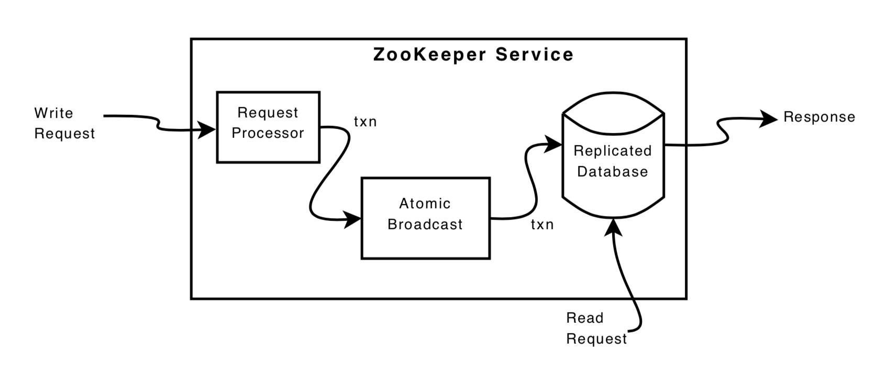
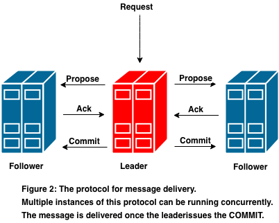
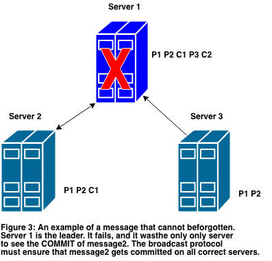
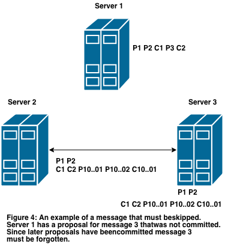

# 0. ABSTRACT

This is a short overview of **a totally ordered broadcast protocol** used by ZooKeeper, called Zab. It is conceptually easy to understand, is easy to implement, and gives high performance. In this paper we present the requirements ZooKeeper makes on Zab, we show how the protocol is used, and we give an overview of how the protocol works.  				 			 		
这是一个关于ZooKeeper正在使用的全序广播协议（Zab）的简短概述。它在概念上很容易理解，也很容易实现，并且提供很高的性能。在这篇文章里，我们会呈现ZooKeeper在Zab上的需求，也会展示这个协议该如何使用，然后我们总体概述一下这个协议是如何工作的。

#1. INTRODUCTION

At Yahoo! we have developed a high-performance highly- available coordination service called ZooKeeper [9] that allows large scale applications to perform coordination tasks such as **leader election, status propagation, and rendezvous**. This service implements a hierarchical space of data nodes, called **znodes**, that clients use to implement their coordination tasks. We have found the service to be flexible with performance that easily meets the production demands of the web-scale, mission critical applications we have at Yahoo!. **ZooKeeper foregoes locks and instead implements wait-free shared data objects with strong guarantees on the order of operations over these objects.** Client libraries take advantage of these guarantees to implement their coordination tasks. In general, one of the main premises of ZooKeeper is that **order of updates is more important to applications than other typical coordination techniques such as blocking**. 
在雅虎（Yahoo!），我们开发了一款叫做ZooKeeper[9]的高性能高可用的协作服务，它允许大规模的应用群执行协作任务，比如Leader选举、状态传播和会合（rendezvous）。该服务实现了一个层级的数据结点空间—znodes，客户端可以用它来实现自己的协作任务。我们已经发现这个服务有很强的性能扩展性，因此它很容易就满足雅虎的网络规模，关键任务的产品需求。ZooKeeper放弃了锁，通过实现了无等待（wait-free）的共享数据对象，并保证在这些对象上的操作是有序的，以此来代替锁。客户端充分利用这些保障来实现自己的协作任务。一般而言，一个引出ZooKeeper的主要原因就是，对于应用来说，**保持更新操作的有序性比其他特定的协作技术更加重要，比如阻塞**。

Embedded into ZooKeeper is **a totally ordered broadcast protocol: Zab**. Ordered broadcast is crucial when implementing our client guarantees; it is also necessary to maintain replicas of the ZooKeeper state at each ZooKeeper server. These replicas stay consistent using our totally ordered broadcast protocol, such as with replicated state-machines [13]. This paper focuses on the requirements ZooKeeper makes on this broadcast protocol and an overview of its implementation. 
集成到ZooKeeper里的是一个全序的广播协议：Zab。有序的广播是实现我们的客户端保障的关键，同时它也需要在每一台ZooKeeper服务器上维护ZooKeeper的状态副本。这些副本通过使用我们的全序广播协议来保持一致性，比如使用复制状态机[13]。这篇文章主要关注ZooKeeper在该广播协议上的需求以及对它实现的一个概述。

A ZooKeeper service usually consists of three to seven machines. Our implementation supports more machines, but three to seven machines provide more than enough performance and resilience. A client connects to any of the machines providing the service and always has a consistent view of the ZooKeeper state. **The service tolerates up to $f$ crash failures, and it requires at least $2f + 1$ servers.** 
一个ZooKeeper服务通常由3到7台机器组成。我们的实现支持更多机器，但是3到7台机器可以提供足够的性能与弹性。一个客户端连接提供服务的任意一台机器，并始终能获得ZooKeeper状态的一致性视图。这个服务最多可以容忍在2f+1台服务器中有f台出现故障。

Applications use ZooKeeper extensively and have tens to thousands of clients accessing it concurrently, so we require high throughput. We have designed ZooKeeper for workloads with ratios of read to write operations that are higher than 2:1; however, we have found that ZooKeeper’s high write throughput allows it to be used for some write dominant workloads as well. ZooKeeper provides high read throughput by servicing the reads from the local replica of the ZooKeeper state at each server. As a consequence, both fault tolerance and read throughput scales by adding servers to the service. Write throughput does not scale by adding servers; instead it is limited by the throughput of the broadcast protocol, thus we need a broadcast protocol with high- throughput. 
使用ZooKeeper的应用数量非常广泛，并且同时有成千上万个客户端并发地访问它，所以我们需要有高的吞吐量。我们为了满足读写操作比例大于2:1的场景而设计ZooKeeper，但是我们发现ZooKeeper的高写吞吐量使得它也能胜任一些写主导的工作。ZooKeepr通过在每台服务器上的ZooKeeper状态副本来提供高吞吐量的读服务。因此，通过添加机器可以提升容错率和读吞吐量，但是不能提升写吞吐量。相反地，它反而因为广播协议而受限，所以我们需要一个高吞吐量的广播协议。

 			 				 					 			**Figure 1: The logical components of the ZooKeeper service.**  				 			 		
Figure 1 shows the logical makeup of the ZooKeeper service. Read requests are serviced from the local database containing the ZooKeeper state. Write requests are transformed from ZooKeeper requests to idempotent transactions and sent through Zab before a response is generated. Many ZooKeeper write requests are conditional in nature: 
图1展示了ZooKeeper服务的逻辑组成部分。读请求由包含ZooKeeper状态的本地数据库提供服务。写请求由ZooKeeper请求转化成幂等（idempotent）事务，并通过Zab发送，然后再生成响应。许多ZooKeeper写请求是有条件限制的：

1. a znode can only be deleted if it does not have any children;  一个znode只能在它没有子结点的情况下被删除
2. a znode can be created with a name and a sequence number appended to it;   一个zonde可以用一个名字加一个序号来创建
3. **a change to data will only be applied if it is at an expected version**.   对数据的修改只能在期望的版本下进行
4. Even the non-conditional write requests modify meta data, such as version numbers, in a ways that are not idempotent.  甚至一些没有条件限制的写请求修改了元数据（meta data），比如版本序号，从某种程序上说这不是幂等的。

By **sending all updates through a single server, referred to as the <u>leader</u>, we transform non-idempotent requests into idempotent transactions**. We use the term **transaction** to denote the idempotent version of a request throughout this paper. **The leader can perform the transformation because it has a perfect view of the future state of the replicated  database and can calculate the state of the new record.** The idempotent transaction is a record of this new state. ZooKeeper takes advantage of the idempotent transactions in many ways that are out of the scope of this paper, but the idempotent nature of our transactions also allows us to relax an ordering requirement of our broadcast protocol during recovery.  	
通过单一的服务器，也就是Leader来发送所有的更新请求，我们可以把非幂等的事务转化为幂等事务。在这篇文章里，我们用事务（transaction）来表示幂等的请求。Leader可以执行这个转换，因为它有数据库副本未来状态的完美视图，并且可以计算出新记录的状态。幂等事务就是这个新状态的一条记录。ZooKeeper充分利用幂等事务的方面很多已经超出本文范畴，但是事务的幂等性允许我们放松广播协议在恢复过程中的排序需求。

# 2. REQUIREMENTS

We assume a set of processes that both implement the atomic broadcast protocol and use it. To guarantee the correct transformation into idempotent requests in ZooKeeper, it is necessary that there is **a single leader at a time**, so we we enforce that there is one such a process through the protocol implementation. We discuss it more when we present more detail of the protocol. 
我们假设有一组实现并使用了原子广播协议的进程集合。为了保证在ZooKeeper中能正确转换成幂等请求，那么同一时刻只能有一个Leader，所以我们强制规定在协议实现中，只有这样一条进程。我们在展示该协议更多细节时再深入地讨论它。

ZooKeeper makes the following requirements on the broadcast protocol: 
ZooKeeper在广播协议中定义了如下需求：

**Reliable delivery** If a message, $m$, is delivered by one server, then it will be eventually delivered by all correct servers. 
可靠交付（Reliable delivery）：如果一个消息m在一台服务器上被交付，那么它最终将在所有正确的服务器上被交付。

**Total order** If message $a$ is delivered before message $b$ by one server, then every server that delivers $a$ and $b$ delivers $a$ before $b$. 
完全有序（Total order）：如果一个消息a在消息b之前被一台服务器交付，那么所有服务器都交付了a和b，并且a先于b。

**Causal order** If message $a$ causally precedes message $b$ and both messages are delivered, then $a$ must be ordered before $b$. 
因果有序（Causal order）：如果消息a在因果上先于消息b并且二者都被交付，那么a必须排在b之前。

For correctness, ZooKeeper additionally requires the following prefix property:  		
为了保证正确性，ZooKeeper额外地需要如下前置属性（Prefix property）：

**Prefix property**: If $m$ is the last message delivered for a leader $L$, any message proposed before $m$ by $L$ must also be delivered; 
前置属性：如果m是Leader L交付的最后一条消息，那在m之前L提出的消息都必须已交付。

Note that a process might be elected multiple times. Each time, however, counts as a different leader for the purposes of this prefix property. 
需要注意的是，一条进程可能被选举多次，但是由于这前置属性，每一次都会被当成不同Leader。

With these three guarantees we can maintain correct repli- cas of the ZooKeeper database: 
在下面三条保证的前提下，我们可以保持ZooKeeper数据库副本的正确性：

1. The reliability and total order guarantees ensure that all of the replicas have a consistent state; 
可靠性和全序性保证所有副本有一致的状态。
2. The causal order ensures that the replicas have state correct from the perspective of the application using Zab; 
因果有序保证了从使用Zab的应用的角度来看状态是正确的。
3. The leader proposes updates to the database based on requests received. 
Leader以收到请求的前提下向数据库提出更新。

It is important to observe that there are two types of causal relationships taken into account by Zab: 
观察到在Zab中有两种因果有序关系很重要：

1. If two messages, a and b, are sent by the same server and a is proposed before b, we say that a causally precedes b; 
如果有两条消息a和b，它们是通过同一服务器发送的，并且a在b之前提出，那么我们说a在因果上先于b。
2. Zab assumes a single leader server at a time that can commit proposals. If a leader changes, any previously proposed messages causally precede messages proposed by the new leader. 
Zab假设同时只有一个Leader可以提交提案。如果Leader变化了，任意先前提出的消息在因果上先于新的Leader提出的消息。

> Causal violation example. 因果冲突示例
> To show the problems caused by violating the second dimension of our causal relationship consider the following scenario:
>
> - A ZooKeeper client C1 requests to set a znode /a to 1 which will be transformed into a message, w1, that contains (“/a”, “1”, 1), where the tuple represents path, value, and resulting version of the znode.
> - C1 then requests to set /a to 2 which will be transformed into a message, w2, that contains (“/a”, “2”, 2);
> - L1 proposes and delivers w1, but it is only able to issue w2 to itself before failing;
> - A new leader L2 takes over.
> - A client C2 requests to set /a to 3 condi- tioned on a being at version 1, which will be transformed into a message, w3, that contains (“/a”, “3”, 2);
> - L2 proposes and delivers w3.
> In this scenario, the client receives a successful response to w1, but an error for w2 because of the leader failure. If eventually L1 recovers, regains leadership, and attempts to deliver the proposal for w2, the causal ordering of the client requests will be violated and the replicated state will be incorrect.
>
> 为了展示违反第二条因果关系会出现的问题，我们来看看下面的场景：
>
> - 一个ZooKeeper客户端C1请求设置znode结点"/a"的值为1，这会转化成一条消息w1，内容包括（"/a", "1", 1)，这个元组代表路径，值和znode的版本。
> - 然后C1请求设置结点"/a"的值为2 ，这会转换成一条消息w2 ，内容为（"/a", "2", 2）。
> - L1提出并交付w1 ，但是在它故障之前，只将w2发布给它自己。
> - 一个新的Leader L2接管了系统。
> - 一个客户端C2请求设置结点"/a"的值为3，这是在版本1的条件下，所以会转化为一条消息w3 ，内容为（"/a", "3", 2）。
> - L2提出并交付w3。
>
> 在这个场景中，客户端接收到了一个对w1成功的响应，但是由于Leader故障了，对w2收到一条错误响应。如果最终L1恢复，又重新获得了Leader的地位，然后尝试交付w2提案，客户端请求的因果顺序会被破坏，副本的状态也会出现错误。

Our failure model is crash-fail with stateful recovery. We do not assume synchronized clocks, but we do assume that servers perceive time pass at approximately the same rate. (We **use timeouts to detect failures**.) The processes that make up Zab have persistent state, so processes can restart after a failure and recover using the persistent state. This means a process can have state that is partially valid such as missing more recent transactions or, more problematic, the process may have transactions that were never delivered earlier and now must be skipped. 
我们的故障模型是带状态恢复的崩溃模式（crash-fail）。我们不假设有同步时钟，但是我们假设服务器能用差不多的速率感知时间的流逝（我们使用超时来发现故障）。组成Zab的进程有一个持久化的状态，所以进程可以在故障后重启并通过持久状态进行恢复。这就意味着一个进程可能只有部分有效的状态，比如丢失最近的事务，或者更严重的，进程可能有早前没被交付而现在应该丢弃（skipped）的事务。

We provision to handle failures, but we also need to handle correlated recoverable failures, for example power outages. To recover from these failures we require that **messages are recorded on the disk media of a quorum of disks before a message is delivered.** (Very non-technical, pragmatic, operations-oriented reasons prevent us from incorporating devices like UPS devices, redundant/dedicated networking devices, and NVRAMs into our design.) 
我们能够处理故障，但我们也必须处理对应的恢复故障，比如电源中断。为了从这些故障中恢复，我们在消息交付之前，需要将它们保存在多数（Quorum）磁盘的磁盘媒介中。（一些非技术性、实际的和操作导向的原因使我们没有将像UPS设备、冗余／专用网络设备和NVRAMs设备加入我们的设计中。）

Although we do not assume Byzantine failures, we do **detect data corruption using digests**. We also **add extra meta-data to protocol packets and use them for sanity checks**. We abort the server process if we detect data corruption or sanity checks fail. 
虽然我们假设没有拜占庭错误, 但我们确实会使用摘要来检测数据损坏。我们也给协议包添加了额外的元数据（metadata），用来进行健康检验。如果我们发现数据损坏或者健康检验失败，我们会中止这个服务进程。

Practical issues of independent implementations of operating environments and of the protocols themselves make the realization of **fully Byzantine tolerant systems impractical for our application**. It has also been shown that achieving truly reliable independent implementations requires more than just programming resources [11]. To date, most of our production problems have been either the result of implementation bugs that affect all replicas or problems that are outside the implementation scope of Zab, but affect Zab, such as network misconfiguration. 
由于运行环境的独立实现和协议本身的实际问题，我们发现实现一个完全的拜占庭容错的系统对我们的应用来说是不切实际的。研究也表明为了获得完全可靠的独立实现需要不止程序资源（programming resources）[11]。迄今为止，我们产品的大部分问题，要么是影响所有副本的实现bug，要么是在Zab实现范畴以外的问题，但是又影响着Zab，比如网络的错误配置。

**ZooKeeper uses an in-memory database and stores transaction logs and periodic snapshots on disk**. Zab’s transaction log doubles as the database write-ahead transaction log so that a transaction will only be written to the disk once. Since the database is in-memory and we use gigabit interface cards, the bottleneck is the disk I/O on the writes. To mitigate the disk I/O bottleneck **we write transactions in batches** so that we can record multiple transactions in a single write to the disk. This batching happens at the replicas not at the the protocol level, so the implementation is **much closer to group commits [4, 6] from databases** than message packing [5]. We chose to not use message packing to minimize latency, while still getting most of the benefits of packing through batched I/O to the disk. 
ZooKeeper使用了一个内存数据库，并且将事务日志和周期性的数据库快照（snapshot）保存到磁盘当中。Zab的事务日志也兼做了数据库写前（write-head）事务日志，所以一个事务只会往磁盘当中写入一次。由于数据库是一个内存数据库，并且我们使用千兆网卡接口（gigabit interface cards），所以写操作的性能瓶颈就在于磁盘的I/O。我们采有批量写的方式降低磁盘I/O瓶颈，这样我们可以在一次向磁盘的写操作中记录多条事务。这个批量操作是在副本实现层面而不是在协议层面，所以这个实现和消息打包（message packing）[5]对比更类似于分组提交（group commits）[4, 6]。我们选择不用消息打包以降低延迟，但是在批量的磁盘I/O中仍然获得了很高收益。

**Our crash-fail with stateful recovery model means that when a server recovers, it is going to read in its snapshot and replay all delivered transactions after that snapshot**. Thus, during recovery the atomic broadcast does not need to guarantee at most once delivery. Our use of idempotent transactions means that multiple delivery of a transaction is fine as long as on restart order is preserved. This is a relaxation of the total order requirement. Specifically, if a is delivered before b and after a failure a is redelivered, b will also be redelivered after a. 
我们的带状态恢复的故障模型意味着，当一个服务器恢复时，它会去读它的快照，并重播那些在快照之后交付的事务。因此，在原子广播（atomic broadcast）的恢复期间，并不需要保证一次性交付。我们使用幂等事务意味着一条事务的多次递交没有问题，只要能保持重启的顺序。这是宽松的全序需求。具体地，如果a是在b之前被交付的，之后因故障导致a再次被交付时，b也将在a之后重新交付。

Other performance requirements we have are:
我们还有其他的操作需求：
**Low latency**: ZooKeeper is used extensively by applications and our users expect low response times. 
低延迟（Low latency）：ZooKeeper在众多应用中被广泛使用，我们的用户期望有低的响应时间。
**Bursty high throughput**: Applications using ZooKeeper usually have read-dominant workloads, but occasionally radical reconfigurations occur that cause large spikes in write throughput.
爆发性高吞吐量（Bursty high throughput）：使用ZooKeeper的应用一般进行读导向的工作，但是偶尔错误的激进配置出现导致大量写吞吐峰值。
**Smooth failure handling**: If a server fails that is not the leader and there is still a quorum of correct servers, there should be no service interruption.
平滑故障处理（Smooth failure handling）：如果一个不是Leader的服务器故障，并且仍有多数服务器能正常工作，那么服务就不会中断。

# 3. WHY ANOTHER PROTOCOL 为什么开发新的协议

Reliable broadcast protocols can present different semantics depending on the application requirements. For example, Birman and Joseph propose two primitives, ABCAST and CBCAST, that satisfy total order and causal order, respectively [2]. Zab also provides causal and total ordering guarantees. 
可靠的广播协议能根据应用的需求可以呈现不同的语义。比如，Birman和Joseph提出两个原语（primitives），ABCAST和CBCAST，这分别满足了全部有序和因果有序[2]。Zab也提供了因果有序和完全有序的保证

A good protocol candidate in our case is Paxos [12]. Paxos has a number of important properties, such as guaranteeing safety despite the number of process failures, allowing processes to crash and recover, and enabling operations to commit within three communication steps under realistic assumptions. We observe that there are a couple of realistic assumptions we can make that enable us to simplify Paxos and obtain high throughput. First, Paxos tolerates message losses and reordering of messages. By using TCP to communicate between pairs of servers, we can guarantee that delivered messages are delivered in FIFO order, which enables us to satisfy per proposer causality even when server processes have multiple outstanding proposed messages. Paxos, however, does not directly guarantee causality because it does not require FIFO channels. 
对于我们的情况，有个好的候选算法是Paxos[12]。Paxos有很多重要的属性，比如不管故障进程有多少仍能保证安全性，并且允许进程崩溃和恢复，在一定实际的假设下，它能在三次通信步骤之内提交一个操作。我们观察到**存在一些实际的假设可以让我们简化Paxos算法而且能获得很高的吞吐量**。首先，Paxos能容忍消息的丢失和乱序，通过使用TCP进行服务器之间的通信，我们可以保证交付的消息以FIFO（先进先出）的顺序进行，这就使得我们可以在服务器进程有多个提案消息时也能满足每个提案的因果有序。但是Paxos并不直接保证因果有序因为它没有需求FIFO的通道（ channel）。

Proposers are the agents proposing values for the different instances in Paxos. **To guarantee progress, there must be a single proposer proposing, otherwise proposers may contend forever on a given instance.** **Such an active proposer is a leader**. <u>When Paxos recovers from a leader failure, the new leader makes sure all partially delivered messages are fully delivered and then resumes proposals from the instance number the old leader left off.</u> Because multiple leaders can propose a value for a given instance two problems arise. First, proposals can conflict**. Paxos uses <u>ballots</u> to detect and resolve conflicting proposals.** Second, it is not enough to know that a given instance number has been committed, processes must also be able to figure out which value has been committed. **Zab avoids both of these problems by ensuring that there is only one message proposal for a given proposal number**. This obviates the need for ballots and simplifies recovery. In Paxos, if a server believes it is a leader, it will use a higher ballot to take over leadership from a previous leader. However, in Zab a new leader cannot take over leadership until a quorum of servers abandon the previous leader. 
Proposer是Paxos中为不同实例提出value值的代理。为了保证进度，必须只有一个Proposer提出提案，否则Proposer可能会在一个给出实例中不断竞争下去。这样一个有效的Proposer就是Leader。当Paxos从一个Leader故障中恢复过来，新的Leader要保证所有被部分交付的消息要全部交付，然后恢复从旧的Leader停止的那个序号开始提出提案。多个Leader为一个给定实例提出提案会造成两个问题。首先，提案可能会冲突，Paxos使用选票（ballot）去派发和解决冲突的提案。其次，这样的话就不能够知道一个给定序号被提交了，进程需要能得到哪个value值被提交的信息。Zab通过保证一个给定的提案编号只有一条提案消息来避免这两个问题。这就排除了选票的需求并简化了恢复过程。在Paxos中，如果一个服务器认为自己是Leader，那么它就会用一个更高的选票去从上一个Leader当中取得Leader地位。然而，在Zab中，一个新的Leader在多数服务器放弃上一个Leader之前不能获得Leader地位。

An alternative way of obtaining high throughput is by limiting the protocol message complexity per broadcast message such as with the Fixed-Sequencer Ring (FSR) protocol [8]. Throughput does not decrease with FSR as the system grows, but latency does increase with the number of processes, which is inconvenient in our environment. *Virtual synchrony* also enables high throughput when groups are stable for long enough [1]. However, any server failure triggers a reconfiguration of the service, thus causing brief service interruptions during such reconfigurations. More- over, a failure detector in such systems has to monitor all servers. The reliability of such a failure detector is crucial for the stability and speed of reconfiguration. Leader-based protocols also rely upon failure detectors for liveness, but such a failure detector only monitors one server at a time, which is the leader. As we discuss in the next section, we do not use fixed quorums or groups for writes and maintain the service availability as long as the leader does not fail. 
一个可以获得高吞吐量的方法就减少每一次广播的协议消息的复杂度，比如使用FSR协议（Fixed-Sequencer Ring）。使用FSR协议，即使系统增长了，吞吐量也不会下降，但是延迟会有所增长，因此不适用于我们的环境。虚拟同步（Virtual synchrony）在群组稳定了足够长的时间也可以提供高的吞吐量[1]。但是，任一服务器故障都会导致服务的重配置，这就导致了在这样的重配置过程中有短暂的服务中断。另外，在这样系统里，一个故障监视器（failure detector）需要监视所有服务器。这样一个故障监视器的可靠性对重配置的稳定性和速度来说就显得非常重要。Leader导向协议（Leader-based）同样也依赖故障监视器来保证活性，但是这样一个故障监视器一次只监视一台服务器，那就是Leader。在我们接下来章节的讨论中，我们不为写操作使用固定的多数集和群组，并且当Leader没有故障时就能保证服务的可用性。

Our protocol has **a fixed sequencer**, according to the classification of Defago et al. [3], that we call the **leader**. Such a leader is elected through a leader election algorithm and synchronized with a quorum of other servers, called **followers**. Since the leader has to manage messages to all the followers  this decision of a fixed sequencer distributes load unevenly across the servers that compose the system with respect to the broadcast protocol. We have taken this approach, though, for the following reasons: 
我们的协议有固定的计数器（sequencer），根据Defago et al.的分类[3]，就是我们说的Leader。这样一个Leader通过一个Leader选举算法被选举出来，并与大多数服务器进行同步，这些服务器叫Follower。由于Leader需要管理给所有Follower的消息，考虑到这个协议使用固定计数器的决定不能在组成这个系统的服务器之间公平地分配负载。我们接受这个方法，有以下几个原因：

- Clients can connect to any server, and servers have to serve read operations locally and maintain information about the session of a client. This extra load of a follower process (a process that is not a leader) makes the load more evenly均匀地 distributed; 
客户端可以连接任意服务器，服务器要能在本地提供读操作，并保持与客户端的会话（session）信息。这个对于Follower进程的额外负担（不是Leader进程），可以让负载更均匀地被分发。

- The number of servers involved is small. This means that the network communication overhead does not become the bottleneck that can affect fixed sequencer protocols; 
服务器数量的影响比较小。这意味着网络通信的上限不会成为可以影响固定序列协议的瓶颈。

- Implementing more complex approaches was not necessary as this simple one provides enough performance. 
实现更复杂的方法没有必要，因为简单的实现可以提供足够性能。

Having a moving sequencer, for example, increases the complexity of the implementation as we have to handle problems such as losing the token. Also, we opted to move away from models based on communication history, such as sender-based ones, to avoid the quadratic message com- plexity of such protocols. Destination agreement protocols suffer from a similar problem [8].
比如拥有一个可移动的计数器，提升了实现的复杂度，因为我们必须要处理一些如token丢失的问题。同样，我们在通信历史的基础上移除这些模型，比如发送者导向模型（sender-bassed），以此来避免这些协议引起的二次消息复杂度。最终一致性协议也有同样的问题[8]。

Using a leader requires that we recover from leader failures to guarantee progress. We use techniques related to view changes such as in the protocol of Keidar and Dolev [10]. Different from their protocol, we do not operate using group communication. If a new server joins or leaves (perhaps by crashing), then we do no cause a view change, unless such an event corresponds to the leader crashing. 
使用一个Leader需要我们从Leader故障中恢复以保证进度。我们使用一些视图变化相关的技术，比如Keidar and Dolev协议[10]。不同于他们的协议，我们不使用群组通信来操作。如果一个新的服务器加入或者离开（可能因为崩溃），我们不会引发一个视图变更，除非那是一个代表Leader崩溃的事件。

# 4. PROTOCOL

Zab’s protocol consists of two modes: **recovery** and **broadcast**. When the service starts or after a leader failure, Zab transitions to recovery mode. Recovery mode ends when a leader emerges and a quorum of servers have synchronized their state with the leader. Synchronizing their state consists of guaranteeing that the leader and new server have the same state. 
Zab协议包括两个模式：恢复（recovery）和广播（broadcast）。当服务启动或者在Leader故障以后，Zab过渡到恢复模式。在一个Leader出现并且有多数服务器与它进行同步后，恢复模式结束。同步包括保证Leader和新的服务器保持一致的状态。

Once a leader has a quorum of法定人数 synchronized followers, it can begin to broadcast messages. As we mentioned in the introduction, the ZooKeeper service itself uses a leader to process requests. **The leader is the server that executes a broadcast by initiating the broadcast protocol, and any server other than the leader that needs to broadcast a message first forwards it to the leader.** By using the leader that emerges from the recovery mode as both the leader to process write requests and to coordinate the broadcast protocol, we eliminate the network latency of forwarding messages to broadcast from the write request leader to the broadcast protocol leader. 
当Leader有了多数已同步的Follower，它就可以开始广播消息。就像我们在简介当中提到的，ZooKeeper服务使用一个Leader来处理请求。Leader就是那个通过初始化广播协议来处理广播的服务器，其他除了Leader以外的服务器要发送消息的话得先把它发送给Leader。通过从恢复模式选出来的Leader当作处理写请求和协调广播协议的Leader，我们消除了从写请求Leader到广播协议Leader的网络延迟。

Once a leader has synchronized with a quorum of followers, it begins to broadcast messages. If a Zab server comes online while a leader is actively broadcasting messages, the server will start in recovery mode, discover and synchronize with the leader, and start participating in the message broadcasts. The service remains in broadcast mode until the leader fails or it no longer has a quorum of followers. Any quorum of followers are sucient for a leader and the service to stay active. For example, a Zab service made up of three servers where one is a leader and the two other servers are followers will move to broadcast mode. If one of the followers die, there will be no interruption in service since the leader will still have a quorum. If the follower recovers and the other dies, there will still be no service interruption. 
一旦一个Leader获取足够法定人数的Followers，就会开始广播消息。如果一个Zab服务器在Leader的广播阶段上线，这个服务器会以恢复模式启动，查找并与Leader进行同步，然后才开始参与消息广播。服务会保持在广播模式，直到Leader故障或者它不再具有多数集合的Follower。任意Follower的多数集对Leader来说都是足够的，这样服务就能保持活跃。比如，一个Zab服务由3台服务器组成，其中1台是Leader，另外2台是Follower，然后系统进入广播模式。如果其中一个Follower死亡，也不会造成服务中断，因为Leader仍然具有一个多数集。如果这个Follower恢复而另一个死亡，那样也不会造成服务中断。

## 4.1 Broadcast

The protocol we use while the atomic broadcast service is operational, called broadcast mode, resembles a simple a  **two-phase commit** [7]: a leader proposes a request, collects votes, and finally commits. Figure 2 illustrates the flow of messages with our protocol. We are able to simplify the two-phase commit protocol because we do not have aborts; followers either acknowledge the leader’s proposal or they abandon the leader. The lack of aborts also mean that we can commit once a quorum of servers ack the proposal rather than waiting for all servers to respond. This simplified two- phase commit by itself cannot handle leader failures, so we will add recovery mode to handle leader failures. 
在原子广播协议运行时我们使用的协议叫做广播模式，就像一个简单的二阶段提交（two-phase commit）[7]：Leader提出一个请求，收集投票，最后提交。图2阐述了我们协议的消息流。我们能简化二阶段提交协议因为我们没有中断（aborts），Follower要么接受Leader的提案，要么放弃这个Leader。没有中断也意味着我们可以在多数服务器回应（ack）时立即提交，而不用等到所有服务器响应。这个简化的二阶段提交它自己是不能处理Leader故障的，所以我们会添加恢复模式去处理Leader故障。

The broadcast protocol uses FIFO (TCP) channels for all communications. By using FIFO channels, preserving the ordering guarantees becomes very easy. Messages are delivered in order through FIFO channels; as long as messages are processed as they are received, order is preserved.		
这个广播协议使用FIFO（TCP）通道进行所有通信。通过使用FIFO通道，维持有序保证就显得非常简单。消息通过FIFO通道被顺序地派发，只要消息能以它们被接收到的顺序被处理，顺序就能保证。

The leader broadcasts a proposal for a message to be delivered. Before proposing a message the leader assigns a monotonically increasing unique id, called the **zxid**. Because Zab preserves causal ordering, the delivered messages will also be ordered by their zxids. Broadcasting consists of putting the proposal with the message attached into the outgoing queue for each follower to be sent through the FIFO channel to the follower. When a follower receives a proposal, it writes it to disk, batching when it can, and sends an acknowledgement to the leader as soon as the proposal is on the disk media. When a leader receives ACKs from a quorum, the leader will broadcast a COMMIT and deliver the message locally. Followers deliver the message when they receive the COMMIT from the leader. 
Leader为被交付的消息广播一个提案。在发起一条提案消息之前，Leader为它分配一个单调递增的唯一id，叫做zxid。因为Zab保证了因果有序，发送的消息也会在它们的zxid上保持有序。通过将包含信息的提案附着到每个Follower的输出队列中，并经FIFO通道发送给Follower，以此来进行广播。当一个Follower收到一个提案，会将它写入磁盘，如果有可能的话就批处理它们，然后当提案写到磁盘媒介时发送回应给Leader。当一个Leader从多数Follower中收到回应（ACK）时，它会广播一条提交（COMMIT）指令然后在本地提交消息。当Follower从Leader处收到提交（COMMIT）指令时也提交消息。

Note that the leader does not have to send the COMMIT if the followers broadcast the ACKs to each other. Not only does this modification increases the amount of network trac, but it also requires a complete communication graph rather than the simple star topology, which is easier to manage from the point of view of starting TCP connections. Maintaining this graph and tracking the ACKs at the clients was also deemed an unacceptable complication in our implementation. 
注意到如果Follower之间互相广播ACK的话，Leader并不是一定要发送COMMIT指令。这个改动不仅会提升网络负载，它也需要比简单星状拓扑（simple star topology）更完整的通信图，星状拓扑从TCP连接的角度来看更容易管理。保持这个图并且追踪ACK信息，在我们的实现中认为这是不可接受的复杂度。

## 4.2 Recovery

This simple broadcast protocol works great until the leader fails or loses a quorum of followers. To guarantee progress, a recovery procedure is necessary to elect a new leader and bring all servers to a correct state. For leader election we need an algorithm that succeeds with high probability to guarantee liveness. The leader election protocol enables not only the leader to learn that it is the leader, but also a quorum to agree upon this decision. If the election phase completes erroneously, servers will not make progress, they eventually timeout, and restart the leader election. In our implementation we have two different implementations of leader election. The fastest completes leader election in just a few hundreds of milliseconds if there is a quorum of correct servers. 
这个简单广播协议在Leader故障或者失去多数的Follower前都能良好工作。为了保证进度，一个选举新Leader和使所有服务器进入正确状态的恢复过程就显得很有必要。对于Leader选举，我们需要一个高成功概率的算法以保障活性。这个Leader选举协议不止让Leader知道自己是Leader，也要让多数服务器同意这个决定。如果一个选举阶段不能正确完成，服务器不会进行下一步工作，它们最终会超时，然后重新开始Leader选举。我们有两种不同的Leader选举实现。如果还存在多数运行正常的服务的话，最快的Leader选举只需要几百毫秒就能完成。

Part of the complication of the recovery procedure恢复程序的部分复杂之处 is the sheer number of proposals that can be in flight at a given time. The maximum number of in-flight proposals is a configurable option, but the default is one thousand. To enable such a protocol to work despite尽管 failures of the leader there are two specific guarantees we need to make: we must never forget delivered messages and we need to let go of messages that are skipped. 
恢复程序的部分复杂之处是在这一时间内，会有一些提案正在被传送。这些提案的最大值是个可配置选项，但默认值是1000。为了保证这个协议在Leader故障时也能正常工作，我们需要两个具体的保证：我们不会忽略（forget）任何已递交的消息，也不会保留已经跳过（skipped）的消息

A message that gets delivered on one machine must be delivered on all even if that machine fails. This situation can easily occur if the leader commits a message and then fails before the COMMIT reaches any other server as shown in Figure 3. Because the leader committed the message, a client could have seen the result of the transaction in the message, so the transaction must be delivered to all other servers eventually so that the client sees a consistent view of the service. 
如果一条消息在一台机器被交付，那么就应该在所有机器上被递交，哪怕那台机器出现故障。这种情况很容易出现，如果Leader提交了一条消息然后在COMMIT指令到达其他机器前出来故障，如图3所示。因为Leader提交了这条消息，客户端应该已能在这条消息中看到事务的结果，所以该事务最终要发送给所有其他服务器，因此客户端才能看到一个一致的视图。

Conversely, a skipped message must remain skipped. Again, this situation can easily occur if a proposal gets generated by a leader and the leader fails before anyone else sees the proposal. For example, in Figure 3 no other server saw proposal number 3, so in Figure 4 when server 1 comes back up it needs to be sure to throw away proposal number 3 when it reintegrates with the system. If server 1 became a new leader and committed 3 after messages 100000001 and 100000002 have been delivered, we would violate our ordering guarantees. 
相反地，一条跳过的消息要保持被跳过。同样这个情况也很容易出现，如果Leader生成了一个提案然后在任何人看到之前就出现了一些故障。比如在图3 ，没有其他服务器看到编号为3的提案，所以在图4中，当服务器1重新上线并重新集成到系统中时，它需要保证把编号3的提案丢弃。如果服务器1成为新的Leader，并在消息100000001和100000002被提交后提交消息3，这就违反了我们的顺序保证。

**The problem of remembering delivered messages is handled with a simple tweak of the leader election protocol. If the leader election protocol guarantees that the new leader has the highest proposal number in a quorum of servers, a newly elected leader will also have all committed messages. Before proposing any new messages a newly elected leader first makes sure that all messages that are in its transac tion log have been proposed to and committed by a quorum of followers. Note that having the new leader being a server process with highest zxid is an optimization as a newly elected leader in this case does not need to find out from a group of followers which one contains the highest zxid and fetch missing transactions.** 
通过对Leader选举协议的简单调整就能解决记住已交付消息的问题。如果这个Leader选举协议保证新的Leader具有多数服务器中最高的提案编号，那么新选出来的Leader就会拥有所有已提交的消息。在提出新提案消息之前，新选出来的Leader要保证所有记录在它事务日志中的消息已经被提出并被多数服务器通过。注意到新的Leader是处理最高zxid的服务器进程恰好是一个优化，这样新选出来的Leader不需要从Follower群组中找到哪个拥有最高的zxid，并且去拉取（fetch）丢失的事务。

All servers that are operating correctly will either be a leader or be following a leader. The leader ensures that its followers have seen all the proposals and have delivered all that have been committed. **It accomplishes this task by queuing to a newly connected follower any PROPOSAL it has that the follower has not seen, and then queuing a COMMIT for all such proposals up to the last message committed**. After all such messages have been queued, the leader adds the follower to the broadcast list for future PROPOSALs and ACKs. 
所有正常运行的服务器要么是一个Leader，要么就是这个Leader的Follower。Leader保证它的Follower能看到所有提案，并且所有已通过的提案都被交付。它通过把新连接的Follower还没看到的PROPOSAL指令放到队列里，然后将这些提案到最新提案的COMMIT指令也放到队列中来实现这个目的。当所有这样的消息都放到队列中后，Leader将Follower添加到以后的PROPOSAL和ACK的广播列表。

**Skipping messages that have been proposed but never delivered is also simple to handle. In our implementation the zxid is a 64-bit number with the lower 32-bits used as a simple counter. Each proposal increments the counter. The high order 32-bit is the epoch. Each time a new leader takes over it will get the epoch of the highest zxid it has in its log, increment the epoch, and using a zxid with the epoch bits set to this new epoch and the counter set to zero. Using epochs to mark leadership changes and requiring that a quorum of servers recognize a server as the leader for that epoch, we avoid the possibility of multiple leaders issuing different proposals with the same zxid. One advantage of this scheme is that we can skip instances upon a leader failure, thus speeding up and simplifying the recovery process. If a server that has been down is restarted with a proposal that was never delivered from a previous epoch, it is not able to be a new leader since every possible quorum of servers has a server with a proposal from a newer epoch and therefore a higher zxid. When this server connects as a follower, the leader checks the last committed proposal for the epoch of the follower’s latest proposal and tell the follower to truncate its transaction log (i.e., forget) to the last committed  proposal for that epoch. In Figure 4 when server 1 connects to the leader, the leader tells it to purge proposal 3 from its transaction log.** 
跳过那些被提出但是没有被交付的消息同样也很容易处理。在我们的实现中，zxid是个64位（64-bits）的数字，其中低32位（32-bits）当作一个简单的计数器。每一条提案增加那个计数。高32位代表轮次（epoch）。每次新的Leader选出，它会从它日志中最高的zxid里提取出轮次，增加轮次，并用新轮次和计数0组成的zxid。使用轮次去标记Leader的变更并且让多数服务器认为一台服务器是当前轮次的Leader，可以让我们避免多个Leader使用同一个zxid提出不同提案的情况。使用这个模式的其中一个好处就是我们能跳过当Leader故障时的一些实例，因此可以加速和简化恢复过程。如果一台服务器重启并带着一条没被交付的上轮消息，它不能成为一个新的Leader，因为任一多数服务器集，都有一个具有新轮次，即有更高的zxid的提案的服务器。当这个服务器以Follower的身份连接，Leader检查Follower的最大提案轮次的最后提交的消息，并让Follower清空它的事务日志（也就是忽略）直到当前轮次。在图4中，当服务器1连接上Leader，Leader告诉它从事务日志中清除提案3。

# 5. FINAL REMARKS 结束语

We were able to implement this protocol quickly and it has proven to be robust in production. Most important, we met our goals of high throughput and low latency. On a non-saturated system, latencies are measured in milliseconds since the typical latencies will correspond to 4 times the packet transmission latency irrespective of the number of servers. Bursty loads are also handled gracefully since messages are committed when a quorum ack proposals. A slow server will not affect bursty throughput since fast quorums of servers that do not contain the slow server can ack the messages. Finally, since the leader will commit messages as soon as any quorum acks a proposal followers that fail do not affect the availability or even the throughput of the service as long as there is a quorum of correct servers. 
我们快速地实现这个协议，并且在生产环境上证明了它的强健性（robust）。更为重要的是，我们也实现了的高吞吐量低延迟的目标。由于特殊的4倍于数据包传输的延迟与服务器的数量无关，在非饱和（non-saturated）的系统中，延迟以毫秒计。爆发性负载也得到适当的处理，因为当收到多数提案的回应时，消息就会被提交。缓慢的服务器不会影响爆发性吞吐量，因为快速的多数服务器可以在不包括慢速服务器的前提下响应消息。最后，由于Leader一收到多数Follower回应就提交消息，所以只要大多数和机器运行正常，Follower故障并不会影响性能甚至是吞吐量。

As result of using effcient implementations of these protocols, we have an implementation of the system that reaches tens to hundreds of thousands of operations per second for workload mixes of 2:1 read-to-write ratios and higher. This system is currently in production use, and it is used by large applications such as the Yahoo! crawler and the Yahoo! advertisement system. 
由于该协议的高效实现，我们有一个实现系统达到了每秒数万到数十万操作，读写工作负载比例达到2:1甚至更高。这个系统是目前在生产环境中使用，并且它是用于大型应用的，比如雅虎crawler和雅虎广告系统。

**Acknowledgements**
We would to thank both of our reviewers for useful comments, and Robbert van Renesse for a very nice offline discussion on Zab which helped us to clarify several points. 
我们要感谢审稿人的宝贵意见，感谢Robbert van Renesse在关于Zab的离线讨论中帮我们阐明了几个观点。

# 6. REFERENCES
[1]  K. Birman and T. Joseph. Exploiting virtual synchrony in distributed systems. SIGOPS Oper. Syst. Rev., 21(5):123–138, 1987. 
[2]  K. P. Birman and T. A. Joseph. Reliable communication in the presence of failures. ACM Trans. Comput. Syst., 5(1):47–76, 1987. 
[3]  X. D ́efago, A. Schiper, and P. Urb ́an. Total order broadcast and multicast algorithms: Taxonomy and survey. ACM Comput. Surv., 36(4):372–421, 2004. 
[4]  D. J. DeWitt, R. H. Katz, F. Olken, L. D. Shapiro, M. R. Stonebraker, and D. Wood. Implementation techniques for main memory database systems. SIGMOD Rec., 14(2):1–8, 1984. 
[5]  R. Friedman and R. van Renesse. Packing messages as a tool for boosting the performance of total ordering protocols. In HPDC, pages 233–242, 1997. 
[6]  D. Gawlick and D. Kinkade. Varieties of concurrency control in ims/vs fast path. IEEE Database Eng. Bull., 8(2):3–10, 1985. 
[7]  J. Gray. Notes on data base operating systems. In Operating Systems, An Advanced Course, pages 393–481, London, UK, 1978. Springer-Verlag. 
[8]  R. Guerraoui, R. R. Levy, B. Pochon, and V. Quema. High throughput total order broadcast for cluster environments. In DSN ’06: Proceedings of the International Conference on Dependable Systems and Networks, pages 549–557, Washington, DC, USA, 2006. IEEE Computer Society. 
[9] http://hadoop.apache.org/zookeeper. Zookeeper pro ject page, 2008. 
[10] I. Keidar and D. Dolev. Totally ordered broadcast in the face of network partitions. In D. R. Avresky, editor, Dependable Network Computing, chapter 3, pages 51–75. Kluwer Academic, 2000. 
[11] J. C. Knight and N. G. Leveson. An experimental evaluation of the assumption of independence in multiversion programming. IEEE Trans. Softw. Eng., 12(1):96–109, 1986. 
[12] L. Lamport. The part-time parliament. ACM Trans. Comput. Syst., 16(2):133–169, 1998. 
[13] F. B. Schneider. Implementing fault-tolerant services using the state machine approach: a tutorial. ACM Comput. Surv., 22(4):299–319, 1990. 