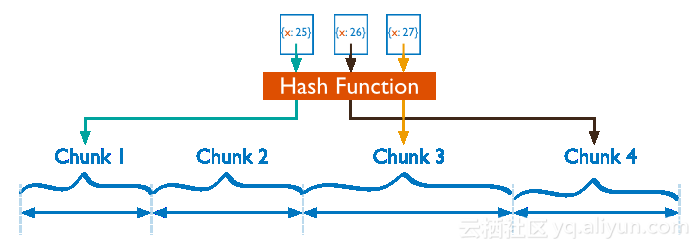

原文地址: https://yq.aliyun.com/articles/32434

## 为什么需要Sharded cluster？

MongoDB目前3大核心优势：『灵活模式』+ 『高可用性』 + 『可扩展性』，通过bson文档来实现灵活模式，通过[复制集](https://yq.aliyun.com/articles/64?spm=0.0.0.0.9jrPm8)来保证高可用，通过Sharded cluster来保证可扩展性。

当 MongoDB 复制集遇到下面的业务场景时，你就需要考虑使用 Sharded cluster

- 存储容量需求超出单机磁盘容量
- 活跃的数据集超出单机内存容量，导致很多请求都要从磁盘读取数据，影响性能
- 写 IOPS 超出单个MongoDB节点的写服务能力


如上图所示，Sharding Cluster使得集合的数据可以分散到多个Shard（复制集或者单个Mongod节点）存储，使得MongoDB具备了横向扩展（Scale out）的能力，丰富了MongoDB的应用场景。

## Sharded cluster架构

Sharded cluster由Shard、Mongos和Config server 3个组件构成。


Mongos是 Sharded cluster 的访问入口，强烈建议所有的管理操作、读写操作都通过mongos来完成，以保证 cluster 多个组件处于一致的状态。

Mongos 本身并不持久化数据，Sharded cluster所有的**元数据**都会存储到Config Server（下一节详细介绍），而用户的数据则会分散存储到各个shard。Mongos 启动后，会从 config server 加载元数据，开始提供服务，将用户的请求正确路由到对应的 Shard。

## 数据分布策略

Sharded cluster支持将单个集合的数据分散存储在多个shard上，用户可以指定根据集合内文档的某个字段即shard key来分布数据，目前主要支持2种数据分布的策略，**范围分片**（Range based sharding）或 **hash分片**（Hash based sharding）。

### 范围分片


如上图所示，集合根据x字段来分片，x的取值范围为[minKey, maxKey]（x为整型，这里的minKey、maxKey为整型的最小值和最大值），将整个取值范围划分为多个chunk，每个chunk（通常配置为64MB）包含其中一小段的数据。

Chunk1包含x的取值在[minKey, -75)的所有文档，而Chunk2包含x取值在[-75, 25)之间的所有文档... 每个chunk的数据都存储在同一个Shard上，每个Shard可以存储很多个chunk，chunk存储在哪个shard的信息会存储在Config server种，mongos也会根据各个shard上的chunk的数量来自动做负载均衡。

范围分片能很好的满足『范围查询』的需求，比如想查询x的值在[-30, 10]之间的所有文档，这时mongos直接能将请求路由到Chunk2，就能查询出所有符合条件的文档。

范围分片的缺点在于，如果shardkey有明显递增（或者递减）趋势，则新插入的文档多会分布到同一个chunk，无法扩展写的能力，比如使用_id作为shard key，而MongoDB自动生成的id高位是时间戳，是持续递增的。

### Hash分片

Hash分片是根据用户的shard key计算hash值（64bit整型），根据hash值按照『范围分片』的策略将文档分布到不同的chunk。



Hash分片与范围分片互补，能将文档随机的分散到各个chunk，充分的扩展写能力，弥补了范围分片的不足，但不能高效的服务范围查询，所有的范围查询要分发到后端所有的Shard才能找出满足条件的文档。

### 合理的选择shard key

选择shard key时，要根据业务的需求及『范围分片』和『Hash分片』2种方式的优缺点合理选择，同时还要注意shard key的取值一定要足够多，否则会出现单个jumbo chunk，即单个chunk非常大并且无法分裂（split）；比如某集合存储用户的信息，按照age字段分片，而age的取值非常有限，必定会导致单个chunk非常大。(自增Id)

## Mongos

Mongos作为Sharded cluster的访问入口，所有的请求都由mongos来路由、分发、合并，这些动作对客户端driver透明，用户连接mongos就像连接mongod一样使用。

Mongos会根据请求类型及shard key将请求路由到对应的Shard

### 查询请求

- 查询请求不包含shard key，则必须将查询分发到所有的shard，然后合并查询结果返回给客户端
- 查询请求包含shard key，则直接根据shard key计算出需要查询的chunk，向对应的shard发送查询请求

### 写请求

写操作必须包含shard key，mongos根据shard key算出文档应该存储到哪个chunk，然后将写请求发送到chunk所在的shard。

### 更新/删除请求

更新、删除请求的查询条件必须包含shard key或者_id，如果是包含shard key，则直接路由到指定的chunk，如果只包含_id，则需将请求发送至所有的shard。

### 其他命令请求

除增删改查外的其他命令请求处理方式都不尽相同，有各自的处理逻辑，比如listDatabases命令，会向每个Shard及Config Server转发listDatabases请求，然后将结果进行合并。

## Config Server

### config database

Config server存储Sharded cluster的所有元数据，所有的元数据都存储在config数据库，3.2版本后，Config Server可部署为一个独立的复制集，极大的方便了Sharded cluster的运维管理。

```
mongos> use config
switched to db config
mongos> db.getCollectionNames()
[
    "shards",
    "actionlog",
    "chunks",
    "mongos",
    "collections",
    "lockpings",
    "settings",
    "version",
    "locks",
    "databases",
    "tags",
    "changelog"
]
```

### config.shards

config.shards集合存储各个Shard的信息，可通过addShard、removeShard命令来动态的从Sharded cluster里增加或移除shard。如下所示，cluster目前拥有2个shard，均为复制集。

```
mongos> db.addShard("mongo-9003/10.1.72.135:9003,10.1.72.136:9003,10.1.72.137:9003")
mongos> db.addShard("mongo-9003/10.1.72.135:9003,10.1.72.136:9003,10.1.72.137:9003")
mongos> db.shards.find()
{ "_id" : "mongo-9003", "host" : "mongo-9003/10.1.72.135:9003,10.1.72.136:9003,10.1.72.137:9003" }
{ "_id" : "mongo-9004", "host" : "mongo-9004/10.1.72.135:9004,10.1.72.136:9004,10.1.72.137:9004" }
```

### config.databases

config.databases集合存储所有数据库的信息，包括DB是否开启分片，[primary shard](https://yq.aliyun.com/go/articleRenderRedirect?url=https%3A%2F%2Fdocs.mongodb.org%2Fmanual%2Fcore%2Fsharded-cluster-shards%2F)信息，对于数据库内没有开启分片的集合，所有的数据都会存储在数据库的primary shard上。

如下所示，shtest数据库是开启分片的（通过[enableSharding命令](https://yq.aliyun.com/go/articleRenderRedirect?url=https%3A%2F%2Fdocs.mongodb.org%2Fmanual%2Freference%2Fmethod%2Fsh.enableSharding%2F)），primary shard为mongo-9003； 而test数据库没有开启分片，primary shard为mongo-9003。

```
mongos> sh.enableSharding("shtest")
```

{ "ok" : 1 }

```
 mongos> db.databases.find()
 { "_id" : "shtest", "primary" : "mongo-9003", "partitioned" : true }
 { "_id" : "test", "primary" : "mongo-9003", "partitioned" : false }
```

Sharded cluster在数据库创建时，为用户选择当前存储数据量最小的shard作为数据库的primary shard，用户也可调用[movePrimary命令](https://yq.aliyun.com/go/articleRenderRedirect?url=https%3A%2F%2Fdocs.mongodb.org%2Fmanual%2Freference%2Fcommand%2FmovePrimary%2F)来改变primary shard以实现负载均衡，一旦primary shard发生改变，mongos会自动将数据迁移到的新的primary shard上。

### config.colletions

数据分片是针对集合维度的，某个数据库开启分片功能后，如果需要让其中的集合分片存储，则需调用[shardCollection](https://yq.aliyun.com/go/articleRenderRedirect?url=https%3A%2F%2Fdocs.mongodb.org%2Fmanual%2Freference%2Fcommand%2FshardCollection%2F)命令来针对集合开启分片。

如下命令，针对shtest数据里的hello集合开启分片，使用x字段作为shard key来进行范围分片。

```
mongos> sh.shardCollection("shtest.coll", {x: 1})
{ "collectionsharded" : "shtest.coll", "ok" : 1 }
mongos> db.collections.find()
{ "_id" : "shtest.coll", "lastmodEpoch" : ObjectId("57175142c34046c3b556d302"), "lastmod" : ISODate("1970-02-19T17:02:47.296Z"), "dropped" : false, "key" : { "x" : 1 }, "unique" : false }
```

### config.chunks

集合分片开启后，默认会创建一个新的chunk，shard key取值[minKey, maxKey]内的文档（即所有的文档）都会存储到这个chunk。当使用Hash分片策略时，也可以预先创建多个chunk，以减少chunk的迁移。

```
mongos> db.chunks.find({ns: "shtest.coll"})
{ "_id" : "shtest.coll-x_MinKey", "ns" : "shtest.coll", "min" : { "x" : { "$minKey" : 1 } }, "max" : { "x" : { "$maxKey" : 1 } }, "shard" : "mongo-9003", "lastmod" : Timestamp(1, 0), "lastmodEpoch" : ObjectId("5717530fc34046c3b556d361") }
```

当chunk里写入的数据量增加到一定阈值时，会触发chunk分裂，将一个chunk的范围分裂为多个chunk，当各个shard上chunk数量不均衡时，会触发chunk在shard间的迁移。如下所示，shtest.coll的一个chunk，在写入数据后分裂成3个chunk。

```
mongos> use shtest
mongos> for (var i = 0; i < 10000; i++) { db.coll.insert( {x: i} ); }
mongos> use config
 mongos> db.chunks.find({ns: "shtest.coll"})
 { "_id" : "shtest.coll-x_MinKey", "lastmod" : Timestamp(5, 1), "lastmodEpoch" : ObjectId("5703a512a7f97d0799416e2b"), "ns" : "shtest.coll", "min" : { "x" : { "$minKey" : 1 } }, "max" : { "x" : 1 }, "shard" : "mongo-9003" }
 { "_id" : "shtest.coll-x_1.0", "lastmod" : Timestamp(4, 0), "lastmodEpoch" : ObjectId("5703a512a7f97d0799416e2b"), "ns" : "shtest.coll", "min" : { "x" : 1 }, "max" : { "x" : 31 }, "shard" : "mongo-9003" }
 { "_id" : "shtest.coll-x_31.0", "lastmod" : Timestamp(5, 0), "lastmodEpoch" : ObjectId("5703a512a7f97d0799416e2b"), "ns" : "shtest.coll", "min" : { "x" : 31 }, "max" : { "x" : { "$maxKey" : 1 } }, "shard" : "mongo-9004" }
```

### config.settings

config.settings集合里主要存储sharded cluster的配置信息，比如chunk size，是否开启balancer等

```
mongos> db.settings.find()
{ "_id" : "chunksize", "value" : NumberLong(64) }
{ "_id" : "balancer", "stopped" : false }
```

### 其他集合

- config.tags主要存储sharding cluster标签（tag）相关的你洗，以实现[根据tag来分布chunk的功能](https://yq.aliyun.com/go/articleRenderRedirect?url=https%3A%2F%2Fdocs.mongodb.org%2Fmanual%2Ftutorial%2Fadminister-shard-tags%2F)
- config.changelog主要存储sharding cluster里的所有变更操作，比如balancer迁移chunk的动作就会记录到changelog里。
- config.mongos存储当前集群所有mongos的信息
- config.locks存储锁相关的信息，对某个集合进行操作时，比如moveChunk，需要先获取锁，避免多个mongos同时迁移同一个集合的chunk。

## 参考资料

- [MongoDB复制集架构原理](https://yq.aliyun.com/articles/64?spm=0.0.0.0.9jrPm8)
- [MongoDB Sharding简介](https://yq.aliyun.com/go/articleRenderRedirect?url=https%3A%2F%2Fdocs.mongodb.org%2Fmanual%2Fcore%2Fsharding-introduction%2F)
- [primary shard](https://yq.aliyun.com/go/articleRenderRedirect?url=https%3A%2F%2Fdocs.mongodb.org%2Fmanual%2Fcore%2Fsharded-cluster-shards%2F)
- [enableSharding命令](https://yq.aliyun.com/go/articleRenderRedirect?url=https%3A%2F%2Fdocs.mongodb.org%2Fmanual%2Freference%2Fmethod%2Fsh.enableSharding%2F)
- [movePrimary命令](https://yq.aliyun.com/go/articleRenderRedirect?url=https%3A%2F%2Fdocs.mongodb.org%2Fmanual%2Freference%2Fcommand%2FmovePrimary%2F)
- [shardCollection](https://yq.aliyun.com/go/articleRenderRedirect?url=https%3A%2F%2Fdocs.mongodb.org%2Fmanual%2Freference%2Fcommand%2FshardCollection%2F)
- [sharding的管理操作](https://yq.aliyun.com/go/articleRenderRedirect?url=https%3A%2F%2Fdocs.mongodb.org%2Fmanual%2Freference%2Fcommand%2Fnav-sharding%2F)
- [部署sharded cluster](https://yq.aliyun.com/go/articleRenderRedirect?url=https%3A%2F%2Fdocs.mongodb.org%2Fmanual%2Ftutorial%2Fdeploy-shard-cluster%2F)