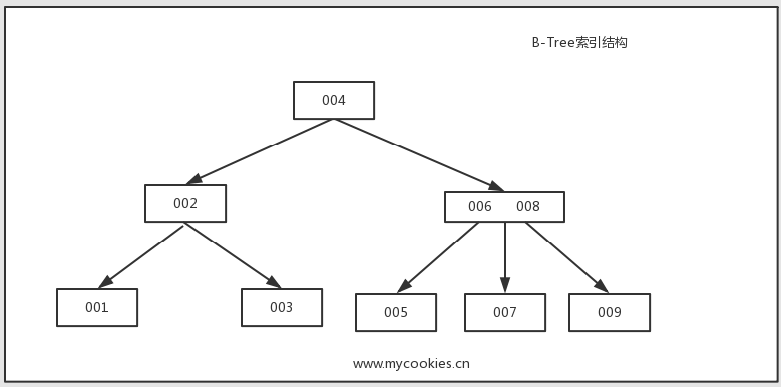
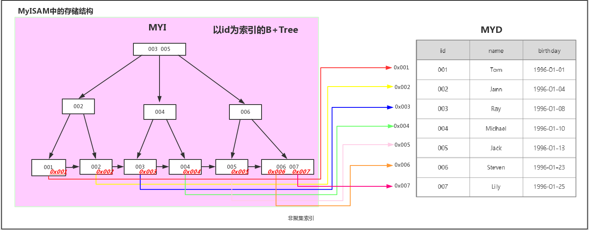
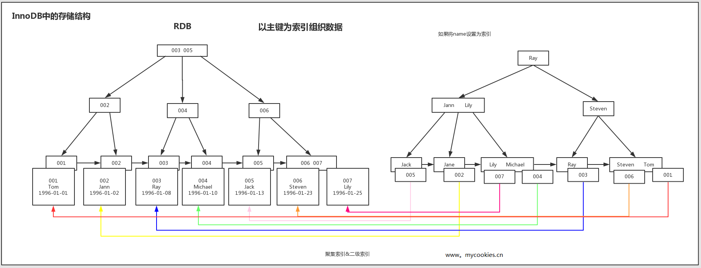

## 一、索引的分类

1. 从存储结构上来划分：BTree索引（B-Tree或B+Tree索引），Hash索引，full-index全文索引，R-Tree索引。

2. 从应用层次来分：普通索引，唯一索引，复合索引

   **普通索引**：即一个索引只包含单个列，一个表可以有多个单列索引

   **唯一索引**：索引列的值必须唯一，但允许有空值

   **复合索引**：即一个索引包含多个列

3. 根据中数据的物理顺序与键值的逻辑（索引）顺序关系：聚集索引，非聚集索引。

   **聚簇索引(聚集索引)：**并不是一种单独的索引类型，而是一种数据存储方式。具体细节取决于不同的实现，InnoDB的聚簇索引其实就是在同一个结构中保存了B-Tree索引(技术上来说是B+Tree)和数据行。

   **非聚簇索引：**不是聚簇索引，就是非聚簇索引。


## 二、索引的底层实现

```
mysql默认存储引擎innodb只显式支持B-Tree( 从技术上来说是B+Tree)索引，对于频繁访问的表，innodb会透明建立自适应hash索引，即在B树索引基础上建立hash索引，可以显著提高查找效率，对于客户端是透明的，不可控制的，隐式的。
```

**Hash索引**

基于哈希表实现，只有精确匹配索引所有列的查询才有效，**对于每一行数据，存储引擎都会对所有的索引列计算一个哈希码（hash code），并且Hash索引将所有的哈希码存储在索引中，同时在索引表中保存指向每个数据行的指针**。

**B-Tree索引（MySQL使用B+Tree）**

 B-Tree能加快数据的访问速度，因为存储引擎不再需要进行全表扫描来获取数据，数据分布在各个节点之中。


**B+Tree**索引

 是B-Tree的改进版本，同时也是数据库索引索引所采用的存储结构。数据都在叶子节点上，并且增加了顺序访问指针，每个叶子节点都指向相邻的叶子节点的地址。相比B-Tree来说，进行范围查找时只需要查找两个节点，进行遍历即可。而B-Tree需要获取所有节点，相比之下B+Tree效率更高。



> 结合存储引擎来讨论（一般默认使用B+Tree）

案例：假设有一张学生表，id为主键

|  id  |  name   |  birthday  |
| :--: | :-----: | :--------: |
|  1   |   Tom   | 1996-01-01 |
|  2   |  Jann   | 1996-01-04 |
|  3   |   Ray   | 1996-01-08 |
|  4   | Michael | 1996-01-10 |
|  5   |  Jack   | 1996-01-13 |
|  6   | Steven  | 1996-01-23 |
|  7   |  Lily   | 1996-01-25 |

**在MyISAM引擎中的实现**（二级索引也是这样实现的）



**在InnoDB中的实现**




## 三、问题

**问：为什么索引结构默认使用B-Tree，而不是hash，二叉树，红黑树？**

hash：虽然可以快速定位，但是没有顺序，IO复杂度高。

二叉树：树的高度不均匀，不能自平衡，查找效率跟数据有关（树的高度），并且IO代价高。

红黑树：树的高度随着数据量增加而增加，IO代价高。

**问：为什么官方建议使用自增长主键作为索引。**

结合B+Tree的特点，自增主键是连续的，在插入过程中尽量减少页分裂，即使要进行页分裂，也只会分裂很少一部分。并且能减少数据的移动，每次插入都是插入到最后。总之就是减少分裂和移动的频率。

插入连续的数据：


插入非连续的数据


分裂页的缺点

由于非连续插入，会操作已经存储了满数据的页上插入新的数据，此时会进行页分裂，而页分裂会生成一个新的 page，在这个新的 page 里面 又不能存储满，所以会造成一定的磁盘浪费