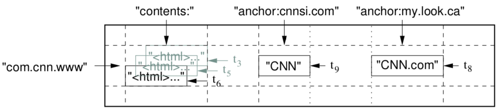
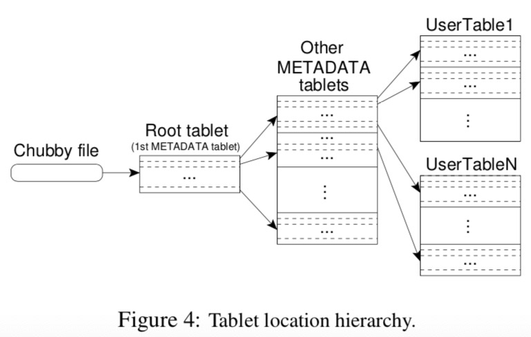
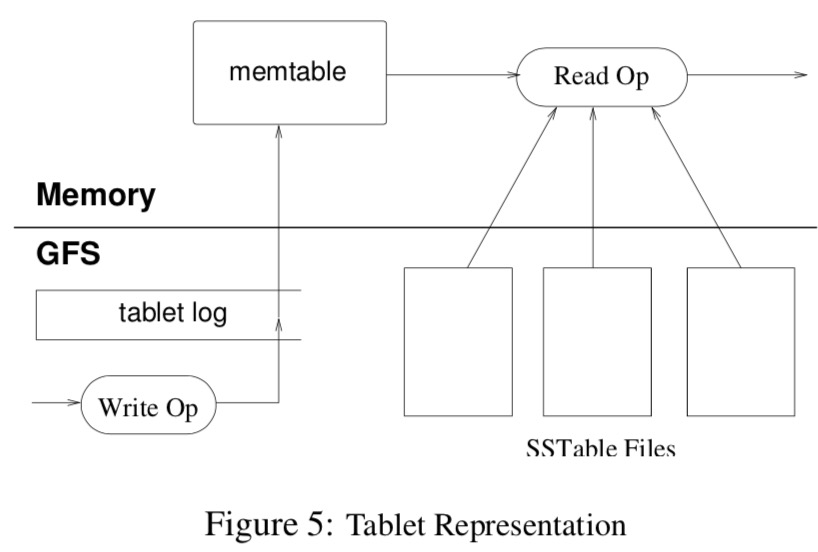

**Abstract**

Bigtable is a distributed storage system for managing structured data that is designed to scale to a very large size: petabytes of data across thousands of commodity servers. Many projects at Google store data in Bigtable, including web indexing, Google Earth, and Google Finance. These applications place very different demands on Bigtable, both in terms of data size (from URLs to web pages to satellite imagery) and latency requirements (from backend bulk processing to real-time data serving). Despite these varied demands, Bigtable has successfully provided a flexible, high-performance solution for all of these Google products. In this paper we describe the simple data model provided by Bigtable, which gives clients dynamic control over data layout and format, and we describe the design and implementation of Bigtable.

Bigtable 是一个用于管理结构型数据的分布式存储系统，被设计为可扩展到很大规模：通过数以千台的机器存储 PB 级数据。很多 Google 的工程都将数据存储在 Bigtable 中，包括网页索引、Google Earth 和 Google 金融。这些应用在数据量和延迟方面对 Bigtable 的需求很不相同。尽管这些多样化的需求，Bigtable 能够成功的为这些 Google 的产品提供一个弹性的、高性能的解决方案。在这篇文章中，我们描述 Bigtable 提供的简单的数据模型，它能给客户端在数据布局和格式上提供动态控制，而且我们会描述 Bigtable 的设计和实现。

**1 Introduction**

Over the last two and a half years we have designed, implemented, and deployed a distributed storage system for managing structured data at Google called Bigtable. Bigtable is designed to reliably scale to petabytes of data and thousands of machines. Bigtable has achieved several goals: wide applicability, scalability, high performance, and high availability. Bigtable is used by more than sixty Google products and projects, including Google Analytics, Google Finance, Orkut, Personalized Search, Writely, and Google Earth. These products use Bigtable for a variety of demanding workloads, which range from throughput-oriented batch-processing jobs to latency-sensitive serving of data to end users. The Bigtable clusters used by these products span a wide range of configurations, from a handful to thousands of servers, and store up to several hundred terabytes of data.

经过过去两年半的时间，我们设计、实现并部署了一个分布式存储系统，用来管理 Google 的结构化数据，称为 Bigtable。Bigtable 被设计为一个可靠扩展到 PB 数据和数千台机器。Bigtable 实现了几个目标：广泛应用、可扩展、高性能和高可用。目前 Bigtable 已被用于超过 60 个的 Google 产品和工程，包括 Google 分析、Google 金融、Orkut、个人搜索、Writely 和 Google Earth。这些系统针对于各种不同的需求使用了 Bigtable，范围从面向吞吐量的批处理进程到时延敏感的面向终端用户的数据服务。这些产品使用的 Bigtable 集群跨越了很多的结构，从少数到数以千计的服务器，存储多至几百 TB 的数据。

In many ways, Bigtable resembles a database: it shares many implementation strategies with databases. Parallel databases [14] and main-memory databases [13] have achieved scalability and high performance, but Bigtable provides a different interface than such systems. **Bigtable does not support a full relational data model; instead, it provides clients with a simple data model that supports dynamic control over data layout and format, and allows clients to reason about the locality properties of the data represented in the underlying storage**. Data is indexed using row and column names that can be arbitrary strings. Bigtable also treats data as uninterpreted strings, although clients often serialize various forms of structured and semi-structured data into these strings. Clients can control the locality of their data through careful choices in their schemas. Finally, Bigtable schema parameters let clients dynamically control whether to serve data out of memory or from disk.

在很多方面，Bigtable 很像一个数据库：它实现了很多数据库的策略。并行数据库和内存数据库已经实现了可扩展和高性能，但是 Bigtable 与这些系统相比提供了不同的接口。**Bigtable 不支持全关系型的数据模型；作为代替，它提供了一种简单的数据模型，在数据布局和格式上提供了动态控制，并且允许客户端推算出数据在底层存储中的位置属性**。数据通过行和列名进行索引，这些名字可以是任意的字符串。Bigtable 也将数据看成是无解释的字符串，尽管客户端经常将结构化和半结构化的数据序列化成不同的格式。客户端能够通过在它们的模式中精心的选择来控制他们的数据位置。最后，Bigtable 模式参数可以使客户端动态的控制是从内存中获取数据还是从硬盘中。

Section 2 describes the data model in more detail, and Section 3 provides an overview of the client API. Section 4 briefly describes the underlying Google infrastructure on which Bigtable depends. Section 5 describes the fundamentals of the Bigtable implementation, and Section 6 describes some of the refinements that we made to improve Bigtable’s performance. Section 7 provides measurements of Bigtable’s performance. We describe several examples of how Bigtable is used at Google in Section 8, and discuss some lessons we learned in designing and supporting Bigtable in Section 9. Finally, Section 10 describes related work, and Section 11 presents our conclusions.

第二章描述了数据模型的更多细节，并且在第三章提供了客户端API进行了概述。第四章简要的描述了 Bigtable 使用到的 Google 基础项目。第五章描述了 Bigtable 实现的基本原理。第六章描述了几个用于提高 Bigtable 性能的优化。第七章测试了Bigtable 的性能。我们在第八章描述了几个如何使用Bigtable 的例子，并在第九章讨论一些在设计和实现 Bigtable 中的教训。最后，在第十章描述相关工作，在第十一章进行了总结。

**2 Data Model**

**A Bigtable is a sparse, distributed, persistent multi-dimensional sorted map. The map is indexed by a row key, column key, and a timestamp; each value in the map is an uninterpreted array of bytes.**

**一个 Bigtable 是一个稀疏的、分布式的、持久的多维度的有序 map。这个 map 由 row key、column key 和时间戳进行索引，每个映射值都是一个连续的 byte 数组。**

​											$$ (row:string, column:string, time:int64) → string $$


> 
>
> Figure 1: A slice of an example table that stores Web pages. The row name is a reversed URL. The contents column family contains the page contents, and the anchor column family contains the text of any anchors that reference the page. CNN’s home page is referenced by both the Sports Illustrated and the MY-look home pages, so the row contains columns named anchor:cnnsi.com and anchor:my.look.ca. Each anchor cell has one version; the contents column has three versions, at timestamps t3, t5, and t6.
>
> 图1：存储 Web 页面的样例表中的一部分。行名是一个翻转了的 URL。Contents 列族包含了页面内容，anchor列族包含了涉及页面中的所有anchor的文本。CNN主页被Sports Illustrated和My-look主页引用，所以，本行包含了名为anchor:cnnsi.com和anchor:my.look.ca的列。每个anchor单元都有一个版本；contents列在根据时间戳t3,t5和t6有三个对应的版本。

We settled on this data model after examining a variety of potential uses of a Bigtable-like system. As one concrete example that drove some of our design decisions, suppose we want to keep a copy of a large collection of web pages and related information that could be used by many different projects; let us call this particular table the *Webtable*. In Webtable, we would use URLs as row keys, various aspects of web pages as column names, and store the contents of the web pages in the contents: column under the timestamps when they were fetched, as illustrated in Figure 1.

在调查了一个类似Bigtable系统的各种潜在用途之后，我们选定了这个数据模型。作为驱动我们对设计做出一些决定的一个具体的例子，假设我们想要保留一个包含大量网页的集合和用于很多不同项目相关信息的拷贝，我们将这个特殊的表称为Webtable。在Webtable中，我们使用URL作为row key，页面的不同属性作为column names，并将页面的内容存储在contents：如图1所示，它们被获取时的时间戳将作为存放它们的列的列关键字。

**Rows**

The row keys in a table are arbitrary strings (currently up to 64KB in size, although 10-100 bytes is a typical size for most of our users). Every read or write of data under a single row key is atomic (regardless of the number of different columns being read or written in the row), a design decision that makes it easier for clients to reason about the system’s behavior in the presence of concurrent updates to the same row.

在表中，行的 key 是任意字符串（目前最大为64KB，尽管用户大多数只使用10-100字节）。每次在一行中读或写数据都是一个原子操作（尽管一行中不同列正在进行读或写），这个设计决定了让客户端更加方便的解释在并发更新同一行的系统行为。

Bigtable maintains data in lexicographic order by row key. The row range for a table is dynamically partitioned. Each row range is called a ***tablet***, which is the unit of distribution and load balancing. As a result, reads of short row ranges are efficient and typically require communication with only a small number of machines. Clients can exploit this property by selecting their row keys so that they get good locality for their data accesses. For example, in Webtable, pages in the same domain are grouped together into contiguous rows by reversing the hostname components of the URLs. For example, we store data for maps.google.com/index.html under the key com.google.maps/index.html. Storing pages from the same domain near each other makes some host and domain analyses more efficient.

Bigtable 以 row key  的字典序保存数据。一个表的行范围是动态分配的。每个行范围被称为一个**tablet**，它是分布式和负载平衡的单位。因此，小范围的读取是高效的，只需要少量机器的通信。<u>客户端可以通过选择合适的 row keys 来利用这个属性，这样可以为他们的数据访问提供良好的局域性。</u>例如，在Webtable中，相同域名下的页面通过反转URL中的hostname，被集中存放到连续的行中。例如，我们将maps.google.com/index.html存放在关键字com.google.maps/index.html下。将相同域名的网页存储在一起可以更加高效对一些主机和域名进行分析。

**Column Families** 列族

Column keys are grouped into sets called ***column families***, which form the basic unit of access control. All data stored in a column family is usually of the same type (we compress data in the same column family together). A column family must be created before data can be stored under any column key in that family; after a family has been created, any column key within the family can be used. It is our intent that the number of distinct column families in a table be small (in the hundreds at most), and that families rarely change during operation. In contrast, a table may have an unbounded number of columns.

列关键字（Column keys）被聚合到一个名为**列族**的集合中，它形成了访问控制的基础单元。存储在一个列族中的所有数据通常有相同的类型（我们将在一个列族下的数据压缩到一起）。必须先创建列族，然后才能将数据存储到其下面的列；在列族创建好之后，列族中的任意一个列关键字（column key）都可用。我们的目的是每个表中不同的列族数量较小（最多不会多于几百个），并且列族很少在操作中变化。相反的，一个表可以有无限数量的列。

A column key is named using the following syntax: *family*:*qualifier*. Column family names must be printable, but qualifiers may be arbitrary strings. An example column family for the Webtable is language, which stores the language in which a web page was written. We use only one column key in the language family, and it stores each web page’s language ID. Another useful column family for this table is anchor; each column key in this family represents a single anchor, as shown in Figure 1. The qualifier is the name of the referring site; the cell contents is the link text.

一个列关键字（column key）使用下面的语法进行命名：**family:qualify**。列族名必须是可显示的，但是 qualify 可以是任意字符。例如，Webtable 的列族名是 language，用于存储页面所用到的语言。我们在 language 列族中只使用一个列关键字（column key），它存储每个页面的 languageID。另外一个有用的列族是 anchor；在族中这个 key 代表一个单独的 anchor，如图1所示。qualifier 是引用站点的名称；它的内容是链接文本。

**Access control and both disk and memory accounting are performed at the column-family level**. In our Webtable example, these controls allow us to manage several different types of applications: some that add new base data, some that read the base data and create derived column families, and some that are only allowed to view existing data (and possibly not even to view all of the existing families for privacy reasons).

访问控制，以及磁盘和内存的统计信息都是在列族层面上进行的。在我们的 Webtable 例子中，这些控制允许我们管理几个不同的应用类型：一些添加新的基础数据，一些读取基础数据并创建派生列族，一些只允许查看已存在的数据（甚至出于隐私考虑也不能查看所有已存在的列族）。

**Timestamps**

Each cell in a Bigtable can contain multiple versions of the same data; these versions are indexed by timestamp. Bigtable timestamps are 64-bit integers. They can be assigned by Bigtable, in which case they represent “real time” in microseconds, or be explicitly assigned by client applications. Applications that need to avoid collisions must generate unique timestamps themselves. Different versions of a cell are stored in decreasing timestamp order, so that the most recent versions can be read first.

Bigtable 中的每个单元都能够包含相同数据的多个版本；这些版本由时间戳进行索引。Bigtable 时间戳是一个 64bit 的整数。它们能够由 Bigtable 分配，在这种情况下，它们表现成以毫秒为单位的当前时间，或者显式的由客户端应用指定。应用必须保证时间戳的唯一性。不同版本的单元以时间戳的降序进行排列，这样可以使最近的版本最早被读取。

To make the management of versioned data less onerous, we support two per-column-family settings that tell Bigtable to garbage-collect cell versions automatically. The client can specify either that only the last *n* versions of a cell be kept, or that only new-enough versions be kept (e.g., only keep values that were written in the last seven days).

为了减少管理不同版本数据的工作量，我们支持两个列族设置，它们可以使Bigtable自动的垃圾回收单元中的版本。客户端可以指定保留最近的n个版本，也可以指定只保留new-enouge内的版本（如：只保留最近7天写入的数据）。

In our Webtable example, we set the timestamps of the crawled pages stored in the contents: column to the times at which these page versions were actually crawled. The garbage-collection mechanism described above lets us keep only the most recent three versions of every page.

在我们的 Webtable 例子中，我们将抓取页面的时间戳存放在 contents 中：页面被抓取的时间就是所对应的时间戳。上面所提到的垃圾回收机制使我们只保留一个页面最近的三个版本。

**3 API**

The Bigtable API provides functions for creating and deleting tables and column families. It also provides functions for changing cluster, table, and column family metadata, such as access control rights.

Bigtable API 提供了创建、删除表和族列的方法。它也提供了更改集群、表和列族元数据（如访问控制权限）的方法

```
// Open the table
Table *T = OpenOrDie("/bigtable/web/webtable");
// Write a new anchor and delete an old anchor 
RowMutation r1(T, "com.cnn.www"); 
r1.Set("anchor:www.c-span.org", "CNN"); 
r1.Delete("anchor:www.abc.com");
Operation op;
Apply(&op, &r1);

Figure 2: Writing to Bigtable.
```
Client applications can write or delete values in Bigtable, look up values from individual rows, or iterate over a subset of the data in a table. Figure 2 shows C++ code that uses a RowMutation abstraction to perform a series of updates. (Irrelevant details were elided to keep the example short.) The call to Apply performs an atomic mutation to the Webtable: it adds one anchor to www.cnn.com and deletes a different anchor.

客户端应用能够写或删除 Bigtable 中的值，从单独的行中查询值，或者循环访问一个表中的一部分数据。图2显示了使用一个 RowMutation 抽象执行的一系列更新操作的 C++ 代码（为了使例子较短，去掉了不相干的代码）。Apply 对 Webtable 执行了一个原子操作：它增加了另一个链接到 www.cnn.com  的 anchor，并删除了一个不同的 anchor

```
Scanner scanner(T);
ScanStream *stream;
stream = scanner.FetchColumnFamily("anchor"); 
stream->SetReturnAllVersions(); 
scanner.Lookup("com.cnn.www");
for (; !stream->Done(); stream->Next()) {
		printf("%s %s %lld %s\n", scanner.RowName(),
       stream->ColumnName(),
       stream->MicroTimestamp(),
       stream->Value());
}

Figure 3: Reading from Bigtable.
```

Figure 3 shows C++ code that uses a Scanner abstraction to iterate over all anchors in a particular row. Clients can iterate over multiple column families, and there are several mechanisms for limiting the rows, columns, and timestamps produced by a scan. For example, we could restrict the scan above to only produce anchors whose columns match the regular expression anchor:*.cnn.com, or to only produce anchors whose timestamps fall within ten days of the current time.

图3显示了使用 Scanner 抽象方法遍历一个指定 row 的所有 anchors 的 C++ 代码。客户端可以遍历多个列族，并且有一些对行、列和时间戳的浏览的限制机制。比如，我们能限制只浏览列可以正则匹配 anchor:*.cnn.com 列的 anchors，或者是时间戳在距离当前时间 10 天之内的 anchors。

Bigtable supports several other features that allow the user to manipulate data in more complex ways. First, Bigtable **supports single-row transactions**, which can be used to perform atomic read-modify-write sequences on data stored under a single row key. Bigtable does not currently support general transactions across row keys, although it provides an interface for batching writes across row keys at the clients. Second, Bigtable allows cells to be used as integer counters. Finally, Bigtable supports the execution of client-supplied scripts in the address spaces of the servers. The scripts are written in a language developed at Google for processing data called Sawzall [28]. At the moment, our Sawzall-based API does not allow client scripts to write back into Bigtable, but it does allow various forms of data transformation, filtering based on arbitrary expressions, and summarization via a variety of operators.

Bigtable 支持另外的一些功能，可以使用户通过更加复杂的方法操作数据。第一，Bigtable 提供了单行事务，它能够用于在一个行关键字（row key）的数据上执行原子的读、改、写操作。Bigtable 目前不支持一般的跨行关键字的事务处理，尽管在客户端提供了一个跨行关键字批写入的接口。第二，Bigtable 允许单元用于整数计数。最后，Bigtable 支持在服务器地址空间中执行客户端提供的脚本。这些脚本使用 Google 用于数据处理的语言Sawzall编写。同时，我们基于 Sawzall 的 API 不允许客户端脚本写回 Bigtable，但是它允许不同形式的数据转换，基于任意表达式的过滤，以及使用各种操作的进行数据汇总。

Bigtable can be used with MapReduce [12], a framework for running large-scale parallel computations developed at Google. We have written a set of wrappers that allow a Bigtable to be used both as an input source and as an output target for MapReduce jobs.

Bigtable 能够与 MapReduce 一起使用，后者是一个 Google 用于运行大规模并行计算的框架。我们已经写了一系列包装器，使 Bigtable 既能用于MapReduce 的输入源，也能用于它的输出目标。

**4 Building Blocks**

Bigtable is built on several other pieces of Google infrastructure. Bigtable uses the distributed Google File System (GFS) [17] to store log and data files. A Bigtable cluster typically operates in a shared pool of machines that run a wide variety of other distributed applications, and Bigtable processes often share the same machines with processes from other applications. Bigtable depends on a cluster management system for scheduling jobs, managing resources on shared machines, dealing with machine failures, and monitoring machine status.

Bigtable建立在几个其它的Google基础构件之上。Bigtable使用Google文件系统GFS存储log和数据文件。一个Bigtable集群通常工作在一个共享的机器池中，运行各种的其它分布式应用，Bigtable进程与其它进程共享同一台机器。Bigtable依靠一个集群管理系统来分配任务、管理共享系统的资源、处理机器故障和监视机器状态。

The Google *SSTable* file format is used internally to store Bigtable data. An SSTable provides a persistent, ordered immutable map from keys to values, where both keys and values are arbitrary byte strings. Operations are provided to look up the value associated with a specified key, and to iterate over all key/value pairs in a specified key range. Internally, each SSTable contains a sequence of blocks (typically each block is 64KB in size, but this is configurable). A block index (stored at the end of the SSTable) is used to locate blocks; the index is loaded into memory when the SSTable is opened. A lookup can be performed with a single disk seek: we first find the appropriate block by performing a binary search in the in-memory index, and then reading the appropriate block from disk. Optionally, an SSTable can be completely mapped into memory, which allows us to perform lookups and scans without touching disk.

Google的SSTable文件格式用于内部存储Bigtable数据。SSTable提供了一个持久的、排序不变的key-value映射，其中key和value都可以是任意字符串。提供了根据一个指定的key查找value的操作，以及遍历指定key的一个范围内所有的key-value对。内部地，每个SSTable包含了一系列的块（一般情况下，每个块的大小为64KB，但是这是可配置的）。一个块索引（存储在SSTable的末尾）用来定位块，这个索引会在SSTable打开时载入到内存中。一个查询可以执行一次独立的磁盘查询：我们首先通过在内存索引中的二分查找找到适当的块，然后从磁盘中将适当的块读取出来。同样地，一个SSTable能够完整的被映射到内存中，这样可以让我们在不接触磁盘的情况下来执行查询和浏览。

Bigtable relies on a highly-available and persistent distributed lock service called Chubby [8]. A Chubby service consists of five active replicas, one of which is elected to be the master and actively serve requests. The service is live when a majority of the replicas are running and can communicate with each other. Chubby uses the Paxos algorithm [9, 23] to keep its replicas consistent in the face of failure. Chubby provides a namespace that consists of directories and small files. Each directory or file can be used as a lock, and reads and writes to a file are atomic. The Chubby client library provides consistent caching of Chubby files. Each Chubby client maintains a *session* with a Chubby service. A client’s session expires if it is unable to renew its session lease within the lease expiration time. When a client’s session expires, it loses any locks and open handles. Chubby clients can also register callbacks on Chubby files and directories for notification of changes or session expiration.

Bigtable依赖一个高可用的、持久的称为Chubby的分布式锁服务。一个Chubby服务由5个活跃的副本组成，其中一个被选举为master，并处理请求。当大多数副本正常运行，并且能够相互通信时，这个服务是正常的。Chubby使用Paxos算法来保证它的副本在面对故障时的一致性。Chubby提供一个由目录和少量文件组成的命名空间。每个目录或者文件都能被用做一个锁，并且读和写文件都是原子的。Chubby客户端库提供了一致的Chubby文件缓存。每个Chubby客户端维护一个Chubby服务的会话。如果一个客户端会话在租约到期后不能更新它的会话租约时，则就会过期。当一个客户端会话过期时，它将释放所有的锁和打开的句柄。Chubby客户端能够在Chubby文件和目录下注册回调函数，用于处理变化通知或会话过期。

Bigtable uses Chubby for a variety of tasks: to ensure that there is at most one active master at any time; to store the bootstrap location of Bigtable data (see Section 5.1); to discover tablet servers and finalize tablet server deaths (see Section 5.2); to store Bigtable schema information (the column family information for each table); and to store access control lists. If Chubby becomes unavailable for an extended period of time, Bigtable becomes unavailable. We recently measured this effect in 14 Bigtable clusters spanning 11 Chubby instances. The average percentage of Bigtable server hours during which some data stored in Bigtable was not available due to Chubby unavailability (caused by either Chubby outages or network issues) was 0.0047%. The percentage for the single cluster that was most affected by Chubby unavailability was 0.0326%.

Bigtable 将 Chubby 用于各种工作：确保在任何时刻最多存在一个活跃的master；存储Bigtable数据的引导位置；发现tablet服务器和处理失败的tablet服务器；存储Bigtable概要信息（每个表的列族信息）；存储访问控制列表。如果Chubby超过一段时间不可用，则Bigtable会变为不可用。我们最近在一个有11个Chubby实例的14个Bigtable集群上测试了效果。由于Chubby不可用（由Chubby中断或者是网络问题造成）而造成存储在Bigtable中的数据不可用的时间占Bigtable服务器时间的平均百分比为0.0047%。在单独的集群中受到Chubby不可用影响的最大百分比为0.0326%。

**5 Implementation**

The Bigtable implementation has three major components: a library that is linked into every client, one master server, and many tablet servers. Tablet servers can be dynamically added (or removed) from a cluster to accomodate changes in workloads.

Bigtable 的实现包含三个主要的组成部分：**一个连接到每个客户端的库、一个master服务器和许多tablet服务器。Tablet服务器能够从集群中动态的增加（或删除）以适应工作量的变化**。

The master is responsible for assigning tablets to tablet servers, detecting the addition and expiration of tablet servers, balancing tablet-server load, and garbage collection of files in GFS. In addition, it handles schema changes such as table and column family creations.

Master  负责将 tablet 分配到 tablet 服务器上，探测tablet服务器的增加和超时，平衡tablet服务器的负载，以及在GFS上回收垃圾文件。此外，它会处理模型变化，如表和列族的创建。

Each tablet server manages a set of tablets (typically we have somewhere between ten to a thousand tablets per tablet server). The tablet server handles read and write requests to the tablets that it has loaded, and also splits tablets that have grown too large.

每个tablet服务器管理一个tablet集合（一般情况下在一个tablet服务器上我们有10到1000个tablets）。Tablet服务器处理它负载的tablet相关的读和写请求，并在tablets过大后进行分片。

As with many single-master distributed storage systems [17, 21], **client data does not move through the master: clients communicate directly with tablet servers for reads and writes. Because Bigtable clients do not rely on the master for tablet location information, most clients never communicate with the master**. As a result, the master is lightly loaded in practice.

像许多单master分布式存储系统一样，**客户端数据不通过master进行传输：客户端直接与tablet服务器进行读和写的通信。由于Bigtable客户端不依赖master获取tablet位置信息，大多数客户端不需要跟master进行通信**。因此，在实际中master的负载很轻。

A Bigtable cluster stores a number of tables. Each table consists of a set of tablets, and each tablet contains all data associated with a row range. Initially, each table consists of just one tablet. As a table grows, it is automatically split into multiple tablets, each approximately 100-200 MB in size by default.

一个 Bigtable 集群存储了大量的表。每个表有一系列tablet组成，每个tablet包含了一个行范围内的所有数据。最初，每个表都仅仅由一个tablet组成。随着表的增长，它会自动的分片成多个tablets，默认情况下，每个tablet的大小大约在100-200MB。

**5.1 Tablet Location**

We use a three-level hierarchy analogous to that of a B+ tree [10] to store tablet location information (Figure 4).

我们使用三层的类似于B+树的结构存储tablet位置信息（图4）。



The first level is a file stored in Chubby that contains the location of the *root tablet*. The *root tablet* contains the location of all tablets in a special METADATA table. Each METADATA tablet contains the location of a set of user tablets. The *root tablet* is just the first tablet in the METADATA table, but is treated specially—it is never split—to ensure that the tablet location hierarchy has no more than three levels.

第一层是存储在Chubby的一个文件，它包含了root tablet的位置。Root tablet将所有tablet的位置包含在一个特殊的METADATA表中。每个METADATA tablet包含一系列的用户tablet位置。Root tablet只是METADATA表的第一个tablet，但是特殊之处在于其永远不会分裂，以此确保tablet位置层级不会超过3层。

The METADATA table stores the location of a tablet under a row key that is an encoding of the tablet’s table identifier and its end row. Each METADATA row stores approximately 1KB of data in memory. With a modest limit of 128 MB METADATA tablets, our three-level lo- cation scheme is sufficient to address 234 tablets (or 261 bytes in 128 MB tablets).

在METADATA表中，每个tablet的位置信息都存放在一个行关键字下面，而这个关键字是由tablet所在的表的标示符和它的最后一行编码形成的。每个METADATA行在内存中存储了大约1KB的数据。通过限制tablets的大小为128MB，三层定位方案可以满足定位2^34个tablets（或者是2^61字节，按着每个tablet有128MB数据）。

The client library caches tablet locations. If the client does not know the location of a tablet, or if it discov- ers that cached location information is incorrect, then it recursively moves up the tablet location hierarchy. If the client’s cache is empty, the location algorithm requires three network round-trips, including one read from Chubby. If the client’s cache is stale, the location algorithm could take up to six round-trips, because stale cache entries are only discovered upon misses (assuming that METADATA tablets do not move very frequently). Although tablet locations are stored in memory, so no GFS accesses are required, we further reduce this cost in the common case by having the client library prefetch tablet locations: it reads the metadata for more than one tablet whenever it reads the METADATA table.

客户端库会缓存tablet位置。如果客户端不知道一个tablet的位置，或者它发现缓存的位置信息不正确，则它会递归查询tablet的位置信息。如果客户端的缓存是空的，定位算法需要3次网络交互更新数据，包括一次Chubby文件的读取。如果客户端缓存过时，则定位算法需要6次网络交互才能更新数据，因为过时的客户端缓存条目只有在没有查到数据的时候才能发现数据过期（假设METADATA tablets移动的不频繁）。尽管tablet的位置信息存在内存中，不需要访问GFS，但是我们会通过客户端库预取tablet位置的方式来减少这种消耗：无论何时读取METADATA表都读取不止一个的METADATA tablets。

We also store secondary information in the METADATA table, including a log of all events per- taining to each tablet (such as when a server begins serving it). This information is helpful for debugging and performance analysis.

我们在METADATA表中还存储了次要的信息，包含与每个tablet有关的所有事件（如：什么时候一个服务器开始为该tablet提供服务）。这些信息对debugging和性能分析很有帮助。

**5.2 Tablet Assignment **Tablet分配

Each tablet is assigned to one tablet server at a time. The master keeps track of the set of live tablet servers, and the current assignment of tablets to tablet servers, in- cluding which tablets are unassigned. When a tablet is unassigned, and a tablet server with sufficient room for the tablet is available, the master assigns the tablet by sending a tablet load request to the tablet server.

每个tablet只能分配给一个tablet服务器。Master记录了正常运行的tablet服务器、tablet服务器当前的tablet任务和没有被分配的tablet。当一个tablet没有被分配，并且有tablet服务器对于这个tablet有足够的空间可用时，master会通过向这个tablet服务器发送一个tablet载入请求分配这个tablet。

Bigtable uses Chubby to keep track of tablet servers. When a tablet server starts, it creates, and acquires an exclusive lock on, a uniquely-named file in a specific Chubby directory. The master monitors this directory (the *servers directory*) to discover tablet servers. A tablet server stops serving its tablets if it loses its exclusive lock: e.g., due to a network partition that caused the server to lose its Chubby session. (Chubby provides an efficient mechanism that allows a tablet server to check whether it still holds its lock without incurring network traffic.) A tablet server will attempt to reacquire an ex- clusive lock on its file as long as the file still exists. If the file no longer exists, then the tablet server will never be able to serve again, so it kills itself. Whenever a tablet server terminates (e.g., because the cluster management system is removing the tablet server’s machine from the cluster), it attempts to release its lock so that the master will reassign its tablets more quickly.

Bigtable使用Chubby跟踪tablet服务器的状态。当一个tablet服务器启动时，它在指定的Chubby目录下创建一个命名唯一的文件并获取一个互斥锁。Master监控这个目录（服务器目录）来检测tablet服务器。如果一个tablet服务器丢失了它的互斥锁，则停止它的tablet服务：例如，由于网络终端，造成了服务器丢失了它的Chubby会话。（Chubby提供了一个高效的机制使tablet服务器在不引入网络流量的情况下，能够检测它是否仍然持有它的锁。）只要文件依然存在，一个tablet服务器试图再次在这个文件上获取一个互斥锁。如果文件不存在了，则tablet服务器将不能再次提供服务，进而会kill掉自己。一个tablet服务器无论何时结束，它都会试图释放它的锁，以使master能够更加快速的重新分配它上面的tablets。

The master is responsible for detecting when a tablet server is no longer serving its tablets, and for reassign- ing those tablets as soon as possible. To detect when a tablet server is no longer serving its tablets, the master periodically asks each tablet server for the status of its lock. If a tablet server reports that it has lost its lock, or if the master was unable to reach a server during its last several attempts, the master attempts to acquire an exclusive lock on the server’s file. If the master is able to acquire the lock, then Chubby is live and the tablet server is either dead or having trouble reaching Chubby, so the master ensures that the tablet server can never serve again by deleting its server file. Once a server’s file has been deleted, the master can move all the tablets that were pre- viously assigned to that server into the set of unassigned tablets. To ensure that a Bigtable cluster is not vulnera- ble to networking issues between the master and Chubby, the master kills itself if its Chubby session expires. How- ever, as described above, master failures do not change the assignment of tablets to tablet servers.

Master负责检测一个tablet服务器何时不能继续为它的tablets服务，并尽快将这些tablets重新分配。Master通过周期性的询问每个tablet服务器的状态来检测一个tablet服务器何时不能继续工作。如果一个tablet服务器报告它失去了它的锁，或者如果master在最近的几次尝试都不能到达一个服务器，则master会尝试获取这个服务器文件的互斥锁。如果master能够获取这个锁，则Chubby运行正常， tablet要么是宕机了，要么就是不能与Chubby正常通信了，因此master通过删除这个tablet服务器的服务器文件来确保这个服务器不能再次进行服务。一旦一个服务器文件被删除，master将之前分配到这个tablet服务器上的所有tablets移动到未被分配的tablets集合里面。为了确保Bigtable集群不易受到master和Chubby之间的网络问题的影响，master将会在它的Chubby会话超时后kill掉自己。然而，如上所说，master失败不会改变tablet服务器上的tablet分布。

When a master is started by the cluster management system, it needs to discover the current tablet assign- ments before it can change them. The master executes the following steps at startup. (1) The master grabs a unique *master* lock in Chubby, which prevents con- current master instantiations. (2) The master scans the servers directory in Chubby to find the live servers. (3) The master communicates with every live tablet server to discover what tablets are already assigned to each server. (4) The master scans the METADATA table to learn the set of tablets. Whenever this scan encounters a tablet that is not already assigned, the master adds the tablet to the set of unassigned tablets, which makes the tablet eligible for tablet assignment.

当一个master被集群管理系统启动时，它需要在改变tablet分布之前先发现当前的分布。Master在启动时执行下面的步骤。（1）master从Chubby中抢占一个唯一的master锁，用来阻止其它的master实例化。（2）master扫描Chubby中的服务器目录，来查找哪些服务器正在运行。（3）master与每个正常运行的tablet服务器通信，获取每个tablet服务器上tablet的分配信息。（4）master扫描METADATA表获取所有的tablets的集合。在扫描的过程中，如果遇到一个tablet没有被分配，则将其放入到未被分配的tablets集合中，并可以进行分配。

One complication is that the scan of the METADATA table cannot happen until the METADATA tablets have been assigned. Therefore, before starting this scan (step 4), the master adds the root tablet to the set of unassigned tablets if an assignment for the root tablet was not dis- covered during step 3. This addition ensures that the root tablet will be assigned. Because the root tablet contains the names of all METADATA tablets, the master knows about all of them after it has scanned the root tablet.

一种复杂的情况是，在METADATA tablets被分配之前，不能扫描METADATA表。因此在开始扫描之前（第4步），如果在第三步发现root tablet没有分配，则master将root tablet加入到未被分配的tablet集合中。这个附加的操作确保了root tablet将会被分配。因为root tablet包含了所有的METADATA tablets的名字，所以在扫描完root tablet之后，master会得到所有METADATA tablet的名字。

The set of existing tablets only changes when a ta- ble is created or deleted, two existing tablets are merged to form one larger tablet, or an existing tablet is split into two smaller tablets. The master is able to keep track of these changes because it initiates all but the last. Tablet splits are treated specially since they are initi- ated by a tablet server. The tablet server commits the split by recording information for the new tablet in the METADATA table. When the split has committed, it noti- fies the master. In case the split notification is lost (either because the tablet server or the master died), the master detects the new tablet when it asks a tablet server to load the tablet that has now split. The tablet server will notify the master of the split, because the tablet entry it finds in the METADATA table will specify only a portion of the tablet that the master asked it to load.

已存在的tablet集合只有在创建或删除表、两个已存在的tablet合并成一个更大的tablet，或者一个已存在的tablet分裂成两个较小的tablet时才会改变。Master会记录所有的这些变化，因为上面几种情况除了最后一个都是它发起的。tablet分裂是比较特殊的，因为它是由tablet服务器发起的。Tablet服务器为METADATA表中记录新tablet的信息提交这次分裂操作。当分裂操作提交后，它会通知master。如果分裂通知丢失（因为tablet服务器或者master宕机），master在询问一个tablet器载入那个分裂的tablet时会检测到新的tablet。

**5.3 Tablet Serving** Tablet服务

The persistent state of a tablet is stored in GFS, as illus- trated in Figure 5. Updates are committed to a commit log that stores redo records. Of these updates, the re- cently committed ones are stored in memory in a sorted buffer called a *memtable*; the older updates are stored in a sequence of SSTables. To recover a tablet, a tablet server reads its metadata from the METADATA table. This meta- data contains the list of SSTables that comprise a tablet and a set of a redo points, which are pointers into any commit logs that may contain data for the tablet. The server reads the indices of the SSTables into memory and reconstructs the memtable by applying all of the updates that have committed since the redo points.

一个tablet的持久状态存储在GFS中，如图5中的描述。更新操作提交到REDO日志中。在这些更新中，最近提交的那些操作存储在一块名为memtable的有序缓存中；较老的更新存放在一系列的SSTable中。为了恢复这个tablet，一个tablet服务器会从METADATA表中读取它的元数据（metadata），这个元数据包含了组成这个tablet的SSTable的列表，以及一系列redo点，这些点指向可能含有该Tablet数据已提交的日志记录。服务器将SSTable的索引读入到内存，并通过执行从redo点开始的所有已提交的更新操作重构memtable。



When a write operation arrives at a tablet server, the server checks that it is well-formed, and that the sender is authorized to perform the mutation. Authorization is performed by reading the list of permitted writers from a Chubby file (which is almost always a hit in the Chubby client cache). A valid mutation is written to the commit log. Group commit is used to improve the throughput of lots of small mutations [13, 16]. After the write has been committed, its contents are inserted into the memtable.

当一个写操作到达一个tablet服务器时，服务器检查其是否符合语法要求，并验证发送者是否有权限执行这个操作。验证是通过读取一个Chubby文件（这个文件几乎会存在客户端的缓存中）中的可写用户的列表完成的。一个有效的写操作会写入到操作日志中。批处理方式可以提高大量细小操作的吞吐量。在写操作提交后，它的内容被写入到memtable中。

When a read operation arrives at a tablet server, it is similarly checked for well-formedness and proper autho- rization. A valid read operation is executed on a merged view of the sequence of SSTables and the memtable. Since the SSTables and the memtable are lexicograph- ically sorted data structures, the merged view can be formed efficiently.

当一个读操作到达一个tablet服务器时，同样会检查是否符合语法要求和本身的权限。一个有效的读操作会在一系列SSTable和memtable合并视图上执行。由于SSTable和memtable是按字典序排序的数据，所以能够高效的生成合并视图。

Incoming read and write operations can continue while tablets are split and merged.

当tables进行分裂和合并时，进来的读和写操作能够继续执行。

**5.4 Compactions** 合并压缩

As write operations execute, the size of the memtable in- creases. When the memtable size reaches a threshold, the memtable is frozen, a new memtable is created, and the frozen memtable is converted to an SSTable and written to GFS. This *minor compaction* process has two goals: it shrinks the memory usage of the tablet server, and it reduces the amount of data that has to be read from the commit log during recovery if this server dies. Incom- ing read and write operations can continue while com- pactions occur.

随着写操作的执行，memtable的大小会增加。当memtable的大小达到一个门限值时，这个memtable会被冻结，创建一个新的memtable，并将冻结的memtable转换成一个SSTable写入到GFS中。这里的次压缩（minor compaction）过程有两个目标：减少tablet服务器的内存使用，减少操作日志中在恢复tablet服务器时需要读取的数据总量。当压缩发生时，进来的读和写操作能够继续执行。

Every minor compaction creates a new SSTable. If this behavior continued unchecked, read operations might need to merge updates from an arbitrary number of SSTables. Instead, we bound the number of such files by periodically executing a *merging compaction* in the background. A merging compaction reads the contents of a few SSTables and the memtable, and writes out a new SSTable. The input SSTables and memtable can be discarded as soon as the compaction has finished.

每次次压缩（minor compaction）都会创建一个新的SSTable。如果这种行为不停的进行下去，则读操作可能需要合并来自任意数量的SSTable的更新。否则，我们通过在后台周期性的执行合并压缩来限制这些文件的数量。一个合并压缩读取一些SSTable和memtable中的内容，并写入到一个新的SSTable中。输入SSTable和memtable可以在压缩完成后立即丢弃。

A merging compaction that rewrites all SSTables into exactly one SSTable is called a *major compaction*. SSTables produced by non-major compactions can con- tain special deletion entries that suppress deleted data in older SSTables that are still live. A major compaction, on the other hand, produces an SSTable that contains no deletion information or deleted data. Bigtable cy- cles through all of its tablets and regularly applies major compactions to them. These major compactions allow Bigtable to reclaim resources used by deleted data, and also allow it to ensure that deleted data disappears from the system in a timely fashion, which is important for services that store sensitive data.

一个将所有SSTables写入到一个SSTable中的合并压缩称为主压缩（major compaction）。非主压缩产生的SSTable能够包含特定的删除条目，它阻止在仍然活着的旧SSTable中删除数据。另一方面，主压缩产生的SSTable不会包含删除信息或已删除的数据。Bigtable循环扫描所有的tablets，并定期的对它们执行主压缩。这些主压缩可以回收删除数据所使用的资源，并尽快的确保删除的数据在系统内彻底消失，对于存储的敏感数据，这是十分重要的。

**6 Refinements**优化

The implementation described in the previous section required a number of refinements to achieve the high performance, availability, and reliability required by our users. This section describes portions of the implementa- tion in more detail in order to highlight these refinements.

在前面章节所描述的实现需要一些优化来满足我们用户的高性能、高可用和高可靠性需求。这一章通过对这些实现更加细节的描述来强调这些优化。

**Locality groups** **局域性群组**

Clients can group multiple column families together into a *locality group*. A separate SSTable is generated for each locality group in each tablet. Segregating column families that are not typically accessed together into sep- arate locality groups enables more efficient reads. For example, page metadata in Webtable (such as language and checksums) can be in one locality group, and the contents of the page can be in a different group: an ap-plication that wants to read the metadata does not need to read through all of the page contents.

客户端能将多个列族聚集成一个局域性群组。对Tablet中每个局域性群组都会产生一个单独的SSTable。将通常不会被一起访问的列族分隔成不同的局域性群组能够提高读取效率。例如，Webtable中的页面元数据（如语言和校验和）作为一个局域性群组，而页面的内容作为另外一个局域性群组：一个想要读取元数据的应用不需要读取所有的页面内容。

In addition, some useful tuning parameters can be specified on a per-locality group basis. For example, a lo- cality group can be declared to be in-memory. SSTables for in-memory locality groups are loaded lazily into the memory of the tablet server. Once loaded, column fam- ilies that belong to such locality groups can be read without accessing the disk. This feature is useful for small pieces of data that are accessed frequently: we use it internally for the location column family in the METADATA table.

此外，可以针对于每个局域性群组设定一些有用的调整参数。例如，一个局域性群组可以声明为存储在内存中。Tablet服务器采用惰性加载的策略对设定为内存中存储的局域性群组的SSTable进行内存加载。一旦加载过，则属于这些局域性群组的列族能够直接被读取，而不需要访问硬盘。这个功能对一些经常访问的小片数据很有用：在内部，我们使用它存放METADATA表中的位置信息列族。

**Compression** **压缩**

Clients can control whether or not the SSTables for a locality group are compressed, and if so, which com- pression format is used. The user-specified compres- sion format is applied to each SSTable block (whose size is controllable via a locality group specific tuning pa- rameter). Although we lose some space by compress- ing each block separately, we benefit in that small por- tions of an SSTable can be read without decompress- ing the entire file. Many clients use a two-pass custom compression scheme. The first pass uses Bentley and McIlroy’s scheme [6], which compresses long common strings across a large window. The second pass uses a fast compression algorithm that looks for repetitions in a small 16 KB window of the data. Both compression passes are very fast—they encode at 100–200 MB/s, and decode at 400–1000 MB/s on modern machines.

客户端能够控制作为局域性群组的SSTable是否被压缩，如果压缩，选定什么样的压缩格式。每个SSTable块（它的大小能够通过局域性群组特定的调整参数来控制）都会按着用户指定的格式进行压缩。尽管由于对每个块分开压缩而浪费了一些空间，但是我们能够受益于在不需要解压整个文件的情况下能够访问部分SSTable。许多客户端使用两遍定制的压缩方式。第一遍使用了Bentley和Mcllroy方式，它通过在一个很大的窗口中对常见的长字符串进行压缩；第二遍使用了一种快速压缩算法，它在16KB大小的窗口内查找重复的数据。两种压缩都很快，在当前的机器上，它们压缩速度为100MB-200MB/s，解压速度为400-1000MB/s。

Even though we emphasized speed instead of space re- duction when choosing our compression algorithms, this two-pass compression scheme does surprisingly well. For example, in Webtable, we use this compression scheme to store Web page contents. In one experiment, we stored a large number of documents in a compressed locality group. For the purposes of the experiment, we limited ourselves to one version of each document in- stead of storing all versions available to us. The scheme achieved a 10-to-1 reduction in space. This is much better than typical Gzip reductions of 3-to-1 or 4-to-1 on HTML pages because of the way Webtable rows are laid out: all pages from a single host are stored close to each other. This allows the Bentley-McIlroy algo- rithm to identify large amounts of shared boilerplate in pages from the same host. Many applications, not just Webtable, choose their row names so that similar data ends up clustered, and therefore achieve very good com- pression ratios. Compression ratios get even better when we store multiple versions of the same value in Bigtable.

虽然在选择压缩算法时我们更看重速度而不是减少的空间，但是这种两遍的压缩方式对空间上的压缩也出奇的好。例如，在Webtable中，我们使用了这种压缩方式存储web页面内容。在一个实验中，我们在一个局域性群组中存储大量的文档。针对这个实验的目的，我们没有存储文档的所有版本，而是只存了一份，这种方式实现了10:1的空间压缩率。这比对HTML页面的压缩率为3:1或4:1的常用的Gzip压缩更好，原因在于Webtable存放行的方式：一个域名下的所有页面会存储在临近的地方。这使Bentley-Mcllroy算法能够将相同域名下的大量页面的共同部分识别出来。很多应用，不只是Webtable，选择他们行名以至于所有相似的数据聚集到一起，因此实现了很好的压缩率。当我们在Bigtable中存储相同值的多个版本时，压缩率会更好。

**Caching for read performance**

To improve read performance, tablet servers use two lev- els of caching. The Scan Cache is a higher-level cache that caches the key-value pairs returned by the SSTable interface to the tablet server code. The Block Cache is a lower-level cache that caches SSTables blocks that were read from GFS. The Scan Cache is most useful for appli- cations that tend to read the same data repeatedly. The Block Cache is useful for applications that tend to read data that is close to the data they recently read (e.g., se- quential reads, or random reads of different columns in the same locality group within a hot row).

为了读操作的性能，tablet服务器使用双层缓存。扫描缓存是高层缓存，它缓存了tablet服务器代码使用SSTable接口获取的key-value对；块缓存是底层缓存，它缓存了从GFS上读取的SSTables块。扫描缓存主要用于倾向重复访问相同数据的应用。块缓存主要用于倾向读取近期数据附近数据的应用（如：顺序读取或随机读取同一个局域性群组的一个频繁访问行的不同列）。

**Bloom filters**

As described in Section 5.3, a read operation has to read from all SSTables that make up the state of a tablet. If these SSTables are not in memory, we may end up doing many disk accesses. We reduce the number of accesses by allowing clients to specify that Bloom fil- ters [7] should be created for SSTables in a particu- lar locality group. A Bloom filter allows us to ask whether an SSTable might contain any data for a spec- ified row/column pair. For certain applications, a small amount of tablet server memory used for storing Bloom filters drastically reduces the number of disk seeks re- quired for read operations. Our use of Bloom filters also implies that most lookups for non-existent rows or columns do not need to touch disk.

如5.3中描述的，一个读操作必须从所有的组成tablet的SSTable中读取数据。如果这些SSTable没有在内存中，则我们最终会多次访问硬盘。我们通过允许客户端对特定局域性群组的SSTable指定Bloom过滤器来降低访问次数。一个Bloom过滤器允许我们查询一个SSTable是否含有特定的行/列对的数据。对于某些特定应用，虽然存储Bloom过滤器占用了tablet服务器少量的内存，但能够彻底的减少读操作对磁盘的查询次数。我们使用Bloom过滤器也可以隐式的达到了当查询的行和列不存在时，不需要访问磁盘。

**Commit-log implementation**

If we kept the commit log for each tablet in a separate log file, a very large number of files would be written concurrently in GFS. Depending on the underlying file system implementation on each GFS server, these writes could cause a large number of disk seeks to write to the different physical log files. In addition, having separate log files per tablet also reduces the effectiveness of the group commit optimization, since groups would tend to be smaller. To fix these issues, we append mutations to a single commit log per tablet server, co-mingling mutations for different tablets in the same physical log file [18, 20].

如果我们为每个tablet保存一份单独的日志，那么我将会在GFS中并发的写大量的文件。取决于每个GFS服务器的底层系统实现，这些写操作会引起大量的磁盘查找，用来将数据写入到不同的物理日志文件中。此外，由于批操作通常较小，每个tablet分开保存日志文件会影响批操作所带来的优化。针对这些问题，对于每个tablet服务器我们将修改追加到一份操作日志中，不同的tablet修改混合存储在一个物理日志文件中。

Using one log provides significant performance ben- efits during normal operation, but it complicates recov- ery. When a tablet server dies, the tablets that it served will be moved to a large number of other tablet servers: each server typically loads a small number of the orig- inal server’s tablets. To recover the state for a tablet, the new tablet server needs to reapply the mutations for that tablet from the commit log written by the original tablet server. However, the mutations for these tablets were co-mingled in the same physical log file. One ap- proach would be for each new tablet server to read this full commit log file and apply just the entries needed for the tablets it needs to recover. However, under such a scheme, if 100 machines were each assigned a single tablet from a failed tablet server, then the log file would be read 100 times (once by each server).

在进行一般的操作时，使用一个日志可以提供很好的性能，但是会使恢复复杂化。当一个tablet服务器宕机，其上的tablets会被移动到大量其它的tablet服务器上：每个tablet服务器通常只负载原始tablet服务器上的一小部分tablets。为了恢复一个tablet的状态，新的tablet服务器需要重新执行原始tablet服务器上操作日志中针对这个tablet的修改。然而，这些tablets的修改混合存在同一个物理日志文件中。一种方式是每个新tablet的服务器会读取整个操作日志文件，然后只执行对于需要恢复的tablet的修改。然而，在这种方式下，如果100台机器每个都从失败的tablet服务器上分配了一个tablet，那么日志文件将被读取100次。

We avoid duplicating log reads by first sort- ing the commit log entries in order of the keys ⟨table, row name, log sequence number⟩. In the sorted output, all mutations for a particular tablet are contiguous and can therefore be read efficiently with one disk seek followed by a sequential read. To parallelize the sorting, we partition the log file into 64 MB seg- ments, and sort each segment in parallel on different tablet servers. This sorting process is coordinated by the master and is initiated when a tablet server indicates that it needs to recover mutations from some commit log file.

我们通过对日志文件条目以key<table, row name, log sequence number>进行排序，来避免这种重复的文件读取。在排序输出中，对于一个指定的tablet的所有修改将会是连续的，并因此能够通过一次硬盘查询和顺序读取进行高效的操作。为了并行排序，我们先将日志文件分成64MB大小的片段，在不同的tablet服务器上对每个片段并行的进行排序。这个排序过程由master协同处理，并在当一个tablet服务器声明它需要从一些操作日志中恢复修改时启动。

Writing commit logs to GFS sometimes causes perfor- mance hiccups for a variety of reasons (e.g., a GFS server machine involved in the write crashes, or the network paths traversed to reach the particular set of three GFS servers is suffering network congestion, or is heavily loaded). To protect mutations from GFS latency spikes, each tablet server actually has two log writing threads, each writing to its own log file; only one of these two threads is actively in use at a time. If writes to the ac- tive log file are performing poorly, the log file writing is switched to the other thread, and mutations that are in the commit log queue are written by the newly active log writing thread. Log entries contain sequence numbers to allow the recovery process to elide duplicated entries resulting from this log switching process.

向GFS中写日志文件有时会由于各种原因引起性能波动（如：写操作进行时，一个GFS服务器宕机了，或者连接三个GFS副本服务器所在的网络发生拥塞或过载）。为了确保在GFS高负载时修改能够正常进行，每个tablet服务器实际有两个写日志线程，每个线程写自己的日志文件，同一时刻，两个线程中只有一个是工作的。如果一个写日志的线程效率很差，则会切换到另一个线程，修改操作的日志就会写在这个线程下的日志文件中。每个日志记录都有一个序列号，以此使tablet服务器在恢复时忽略掉线程切换所产生的重复的条目。

**Speeding up tablet recovery** **Tablet恢复提速**

If the master moves a tablet from one tablet server to another, the source tablet server first does a minor com- paction on that tablet. This compaction reduces recov- ery time by reducing the amount of uncompacted state in the tablet server’s commit log. After finishing this com- paction, the tablet server stops serving the tablet. Before it actually unloads the tablet, the tablet server does an- other (usually very fast) minor compaction to eliminate any remaining uncompacted state in the tablet server’s log that arrived while the first minor compaction was being performed. After this second minor compaction is complete, the tablet can be loaded on another tablet server without requiring any recovery of log entries.

如果master将一个tablet从一个tablet服务器移动到另一个服务器，源tablet服务器会在本地先进行一个次压缩。这个压缩通过减少了tablet服务器日志中没有归并的记录的数量来缩短恢复时间。压缩完成后，tablet服务器停止对该tablet的服务。在卸载tablet之前，源服务器还会再做一次次压缩（通常很快），以消除第一次次压缩过程中新进入的未归并到SSTable中的修改。在这次次压缩完成后，tablet能够被载入到另一个tablet服务器上，而无需通过任何的日志条目恢复。

**Exploiting immutability** **利用不变性**

Besides the SSTable caches, various other parts of the Bigtable system have been simplified by the fact that all of the SSTables that we generate are immutable. For ex- ample, we do not need any synchronization of accesses to the file system when reading from SSTables. As a re- sult, concurrency control over rows can be implemented very efficiently. The only mutable data structure that is accessed by both reads and writes is the memtable. To re- duce contention during reads of the memtable, we make each memtable row copy-on-write and allow reads and writes to proceed in parallel.

除了SSTable缓存，实际中我们产生的其它部分的SSTable都是不变的，我们可以通过这个事实来简化Bigtable系统。例如，当从SSTable读取数据时，我们不需要对文件系统访问操作进行任何同步。这样，就可以非常高效的实现对行的并行操作。Memtable是唯一一个能被读和写操作同时访问的可变数据结构。为了减少在读操作时的竞争，我们对内存采用了copy-on-write机制，这样就允许读写操作同时进行了。

Since SSTables are immutable, the problem of perma- nently removing deleted data is transformed to garbage collecting obsolete SSTables. Each tablet’s SSTables are registered in the METADATA table. The master removes obsolete SSTables as a mark-and-sweep garbage collec- tion [25] over the set of SSTables, where the METADATA table contains the set of roots.

因为SSTable是不可修改的，所以我们将永久移除要删除的数据问题转换为对废弃的SSTable进行垃圾回收的问题。Tablet的每个SSTable都在METADATA表中注册过。Master通过标记-删除的方式移除SSTable集合中废弃的SSTable，METADATA表中包含了ROOT集合。

Finally, the immutability of SSTables enables us to split tablets quickly. Instead of generating a new set of SSTables for each child tablet, we let the child tablets share the SSTables of the parent tablet.

最后，SSTable的不可变性使我们能够快速的分裂tablet。我们让子tablet（分裂后的tablet）共享父tablet（分裂前的tablet）的SSTables，而不是为每个子tablet创建新的SSTable集合。


ref

https://www.cnblogs.com/geekma/archive/2013/05/30/3108391.html