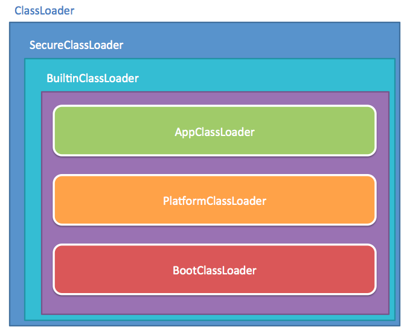

[更多关于类加载器的文章](https://docs.oracle.com/javase/specs/jvms/se9/html/jvms-5.html#jvms-5.3)

```java
private static final JavaLangAccess JLA = SharedSecrets.getJavaLangAccess();

// the built-in class loaders
private static final BootClassLoader BOOT_LOADER;
private static final PlatformClassLoader PLATFORM_LOADER;
private static final AppClassLoader APP_LOADER;

/**
 * Creates the built-in class loaders
 */
static {

    // -Xbootclasspth/a or -javaagent Boot-Class-Path
    URLClassPath bcp = null;
    String s = VM.getSavedProperty("jdk.boot.class.path.append");
    if (s != null && s.length() > 0)
        bcp = toURLClassPath(s);

    // we have a class path if -cp is specified or -m is not specified.
    // If neither is specified then default to -cp <working directory>
    // If -cp is not specified and -m is specified, the value of
    // java.class.path is an empty string, then no class path.
    URLClassPath ucp = new URLClassPath(new URL[0]);
    String mainMid = System.getProperty("jdk.module.main");
    String cp = System.getProperty("java.class.path");
    if (cp == null)
        cp = "";
    if (mainMid == null || cp.length() > 0)
        addClassPathToUCP(cp, ucp);

    // create the class loaders
    BOOT_LOADER = new BootClassLoader(bcp);
    PLATFORM_LOADER = new PlatformClassLoader(BOOT_LOADER);
    APP_LOADER = new AppClassLoader(PLATFORM_LOADER, ucp);
}
```

从这里可以看出  JDK 存在三个 `ClassLoader`
**`BootClassLoader`**:  JVM级别的，启动类加载器，用于加载启动的基础模块类
**`PlatformClassLoader`**:  平台类加载器，用于加载一些平台相关的模块，双亲是`BootClassLoader`
**`AppClassLoader`**:  应用模块加载器，用于加载应用级别的模块，双亲是`PlatformClassLoader`



```java
/**
 * The class loader that is used to find resources in modules defined to
 * the boot class loader. It is not used for class loading.
 */
private static class BootClassLoader extends BuiltinClassLoader {
    BootClassLoader(URLClassPath bcp) {
        super(null, null, bcp);
    }

    @Override
    protected Class<?> loadClassOrNull(String cn) {
        return JLA.findBootstrapClassOrNull(this, cn);
    }
};
```

```java
/**
 * The platform class loader, a unique type to make it easier to distinguish
 * from the application class loader.
 */
private static class PlatformClassLoader extends BuiltinClassLoader {
    static {
        if (!ClassLoader.registerAsParallelCapable())
            throw new InternalError();
    }

    PlatformClassLoader(BootClassLoader parent) {
        super("platform", parent, null);
    }

}
```

```java
/**
 * The application class loader that is a {@code BuiltinClassLoader} with
 * customizations to be compatible with long standing behavior.
 */
private static class AppClassLoader extends BuiltinClassLoader {
    static {
        if (!ClassLoader.registerAsParallelCapable())
            throw new InternalError();
    }

    final URLClassPath ucp;

    AppClassLoader(PlatformClassLoader parent, URLClassPath ucp) {
        super("app", parent, ucp);
        this.ucp = ucp;
    }

}
```