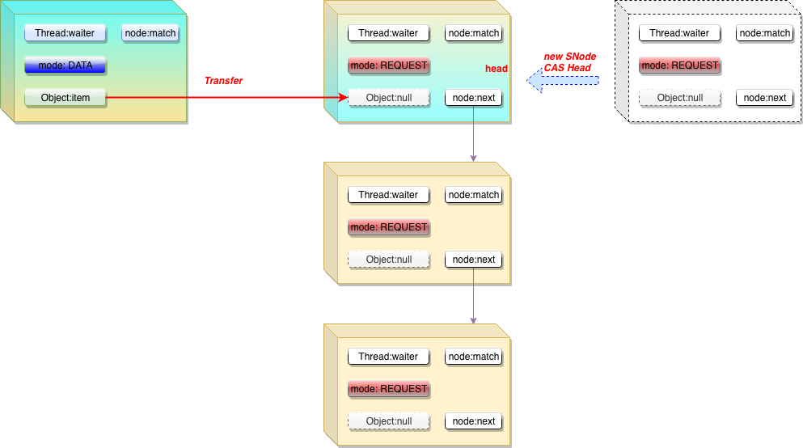
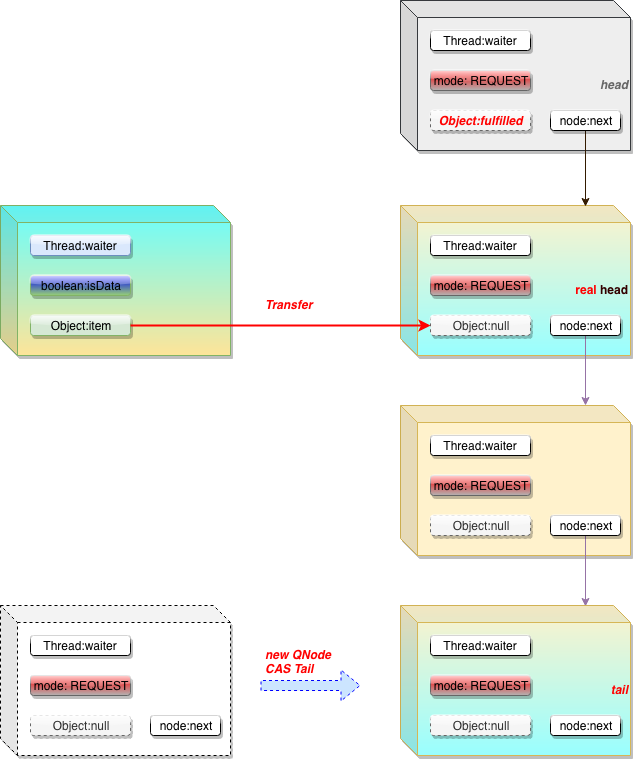

# SynchronousQueue

# javadoc

A blocking queue in which each insert operation must wait for a corresponding remove operation by another thread, and vice versa`一种阻塞队列，其中每个插入操作必须等待另一个线程执行相应的删除操作，反之亦然`. A synchronous queue does not have any internal capacity, not even a capacity of one`同步队列没有任何内部容量，甚至没有一个容量`. You cannot `peek` at a synchronous queue because an element is only present when you try to remove it`因为只有在尝试删除某个元素时才存在该元素`; you cannot `insert` an element (using any method) unless another thread is trying to `remove` it; you **cannot iterate** as there is nothing to iterate. **The head of the queue is the element that the first queued inserting thread is trying to add to the queue**; if there is no such queued thread then no element is available for `removal` and `poll()` will return `null`. For purposes of other Collection methods (for example contains), a `SynchronousQueue` **acts as an empty collection**. This queue does **not permit null elements**.

Synchronous queues are similar to rendezvous channels`集合通道` used in CSP and Ada. They are well suited for handoff designs, in which **<u>an object running in one thread must sync up with an object running in another thread in order to hand it some information, event, or task</u>**.
This class supports an optional`可选的` **fairness policy** for ordering waiting producer and consumer threads. By default, this ordering is not guaranteed. However, a queue constructed with fairness set to true grants threads access in FIFO order.
This class and its iterator implement all of the optional methods of the Collection and Iterator interfaces.
This class is a member of the Java Collections Framework.

# Desc

This class implements extensions of the **dual stack and dual queue algorithms**`双栈和双队列算法` described in ["*Nonblocking Concurrent Objects with Condition Synchronization*", by W. N. Scherer III and M. L. Scott. 18th Annual Conf. on Distributed Computing, Oct. 2004 ](http://www.cs.rochester.edu/u/scott/synchronization/pseudocode/duals.html). <u>**The (Lifo) stack is used for non-fair mode, and the (Fifo) queue for fair mode**. The performance of the two is generally similar. **Fifo usually supports higher throughput under contention but Lifo maintains higher thread locality in common applications.**</u> 

A dual queue (and similarly stack) is one that **at any given time either holds "data" -- items provided by `put` operations, or "requests" -- slots representing `take` operations, or is empty**. A call to "`fulfill`" (i.e., a call requesting an item from a queue holding data or vice versa) dequeues`使…出队` a complementary`互补的` node. The most interesting feature of these queues is that **any operation can figure out which mode the queue is in, and act accordingly without needing locks.** 

Both the queue and stack extend abstract class `Transferer` defining the single method `transfer` that does a put or a take. **These are unified into`统一成` a single method because in dual data structures`双数据结构`, the put and take operations are symmetrical`对称的`, so nearly all code can be combined**. The resulting transfer methods are on the long side, but are easier to follow than they would be if broken up into nearly-duplicated`几乎重复` parts. The queue and stack data structures share many conceptual similarities but very few concrete details`队列和堆栈数据结构具有许多概念上的相似性，但很少有具体的细节`. For simplicity, they are kept distinct so that they can later evolve separately.`为了简单起见，它们是不同的，以便以后可以单独进化`

The algorithms here differ from the versions in the above paper in extending them for use in synchronous queues, as well as dealing with cancellation. The main differences include: 

1. The original algorithms used bit-marked pointers, but the ones here use mode bits in nodes, leading to a number of further adaptations. `导致了许多进一步的调整`
2. **SynchronousQueues must block threads waiting to become fulfilled.** 
3. Support for cancellation via timeout and interrupts, including cleaning out cancelled nodes/threads from lists to avoid garbage retention and memory depletion. `支持通过超时和中断取消，包括从列表中清除已取消的节点/线程，以避免垃圾保留和内存耗尽。`

Blocking is mainly accomplished`完成` using `LockSupport park/unpark`, except that nodes that appear to be`看起来是` the next ones to become fulfilled first **spin** a bit (on multiprocessors only). On very busy synchronous queues, spinning can dramatically`显著地` improve throughput. And on less busy ones, the amount of spinning is small enough not to be noticeable`不被注意`. 

**Cleaning** is done in **different ways in queues vs stacks**. For queues, we can almost always remove a node immediately in **O(1)** time (modulo retries for consistency checks) when it is cancelled. But if it may be pinned as the current tail, it must wait until some subsequent cancellation`但是如果它可能被固定为当前的尾部，它必须等到随后的一些取消操作`. For stacks, we need a potentially`潜在地` **O(n)** traversal to be sure that we can remove the node, but this can run **concurrently** with other threads accessing the stack. 

While garbage collection takes care of most node reclamation issues`虽然垃圾收集处理大多数节点回收问题` that otherwise complicate`复杂化` nonblocking algorithms, care is taken to "forget" references to data, other nodes, and threads that might be held on to long-term by blocked threads. In cases where setting to `null` would otherwise conflict with main algorithms, this is done by changing a node's link to now point to the node itself. This doesn't arise much for Stack nodes`对于Stack节点来说，这种情况不会出现太多` (because blocked threads do not hang on to old head pointers), but references in Queue nodes must be aggressively`积极地` forgotten to avoid reachability of everything any node has ever referred to since arrival.

# sourcecode

```java
/**
 * Shared internal API for dual stacks and queues.
 */
abstract static class Transferer<E> {
    /**
     * Performs a put or take.
     *
     * @param e if non-null, the item to be handed to a consumer;
     *          if null, requests that transfer return an item
     *          offered by producer.
     * @return if non-null, the item provided or received; if null,
     *         the operation failed due to timeout or interrupt --
     *         the caller can distinguish which of these occurred
     *         by checking Thread.interrupted.
     */
    abstract E transfer(E e, boolean timed, long nanos);
}
```

### TransferStack

stack用于不公平模式，由于是 stack 结构， 所以是 Lifo 模式。



**TransferStack 中 Node 的数据结构**

```java
/** Node class for TransferStacks. */
static final class SNode {
    volatile SNode next;        // next node in stack
    volatile SNode match;       // the node matched to this
    volatile Thread waiter;     // to control park/unpark
    Object item;                // data; or null for REQUESTs
    int mode;
    // Note: item and mode fields don't need to be volatile
    // since they are always written before, and read after,
    // other volatile/atomic operations.

    /**
     * Tries to match node s to this node, if so, waking up thread.
     * Fulfillers call tryMatch to identify their waiters.
     * Waiters block until they have been matched.
     *
     * @param s the node to match
     * @return true if successfully matched to s
     */
    boolean tryMatch(SNode s) {
        if (match == null &&
            UNSAFE.compareAndSwapObject(this, matchOffset, null, s)) {
            Thread w = waiter;
            if (w != null) {    // waiters need at most one unpark
                waiter = null;
                LockSupport.unpark(w);
            }
            return true;
        }
        return match == s;
    }

    // Unsafe mechanics
    private static final sun.misc.Unsafe UNSAFE;
    private static final long matchOffset;
    private static final long nextOffset;

    static {
        try {
            UNSAFE = sun.misc.Unsafe.getUnsafe();
            Class<?> k = SNode.class;
            matchOffset = UNSAFE.objectFieldOffset
                (k.getDeclaredField("match"));
            nextOffset = UNSAFE.objectFieldOffset
                (k.getDeclaredField("next"));
        } catch (Exception e) {
            throw new Error(e);
        }
    }
}
```

```java
/** Dual stack */
static final class TransferStack<E> extends Transferer<E> {
    /*
     * This extends Scherer-Scott dual stack algorithm, differing,
     * among other ways, by using "covering" nodes rather than
     * bit-marked pointers: Fulfilling operations push on marker
     * nodes (with FULFILLING bit set in mode) to reserve a spot
     * to match a waiting node.
     */

    /* Modes for SNodes, ORed together in node fields */
    /** Node represents an unfulfilled consumer */
    static final int REQUEST    = 0;
    /** Node represents an unfulfilled producer */
    static final int DATA       = 1;
    /** Node is fulfilling another unfulfilled DATA or REQUEST */
    static final int FULFILLING = 2;

    /** Returns true if m has fulfilling bit set. */
    static boolean isFulfilling(int m) { return (m & FULFILLING) != 0; }

    /** The head (top) of the stack */
    volatile SNode head;

    boolean casHead(SNode h, SNode nh) {
        return h == head &&
            UNSAFE.compareAndSwapObject(this, headOffset, h, nh);
    }

    /**
     * Creates or resets fields of a node. Called only from transfer
     * where the node to push on stack is lazily created and
     * reused when possible to help reduce intervals between reads
     * and CASes of head and to avoid surges of garbage when CASes
     * to push nodes fail due to contention.
     */
    static SNode snode(SNode s, Object e, SNode next, int mode) {
        if (s == null) s = new SNode(e);
        s.mode = mode;
        s.next = next;
        return s;
    }

    /**
     * Puts or takes an item.
     */
    @SuppressWarnings("unchecked")
    E transfer(E e, boolean timed, long nanos) {
        /*
         * Basic algorithm is to loop trying one of three actions:
         *
         * 1. If apparently显然 empty or already containing nodes of same
         *    mode, try to push node on stack and wait for a match,
         *    returning it, or null if cancelled.
         *
         * 2. If apparently containing node of complementary互补的 mode,
         *    try to push a fulfilling node on to stack, match
         *    with corresponding相应的 waiting node, pop both from
         *    stack, and return matched item. The matching or
         *    unlinking might not actually be necessary because of
         *    other threads performing action 3:
         *
         * 3. If top of stack already holds another fulfilling node,
         *    help it out帮助它 by doing its match and/or pop
         *    operations, and then continue. The code for helping
         *    is essentially基本上 the same as for fulfilling, except
         *    that it doesn't return the item.
         */

        SNode s = null; // constructed/reused as needed 根据需要构建/重用
        int mode = (e == null) ? REQUEST : DATA;

        for (;;) {
            SNode h = head;
            if (h == null || h.mode == mode) {  // empty or same-mode
              	// 超时处理
                if (timed && nanos <= 0) {      // can't wait
                    if (h != null && h.isCancelled())
                        casHead(h, h.next);     // pop cancelled node
                    else
                        return null;
                // 如果没有超时，创建一个SNode 并添加到 head 之前(LIFO)
                } else if (casHead(h, s = snode(s, e, h, mode))) {
                  	// 开始等待另一个互补的 fulfill 节点
                    SNode m = awaitFulfill(s, timed, nanos);
                  	// 此时，要么是已经获取到匹配节点，要么是等待超时(超时的时候返回的是节点自己)
                    if (m == s) {               // wait was cancelled
                        clean(s); // 从 stack 中移除
                        return null;
                    }
                    // 走到这，表示找到了 匹配的节点
                  	// h.next == s 表示前2个节点都已被 fulfill
                    if ((h = head) != null && h.next == s)
                        casHead(h, s.next);     // help s's fulfiller
                    return (E) ((mode == REQUEST) ? m.item : s.item);
                }
            } else if (!isFulfilling(h.mode)) { // try to fulfill
              	// 找到第一个非取消的节点
                if (h.isCancelled())            // already cancelled
                    casHead(h, h.next);         // pop and retry
              	// 将当前节点作为 head 添加到队列头部，此时队列第一与 第二2个元素是可以完成匹配的
                else if (casHead(h, s=snode(s, e, h, FULFILLING|mode))) {
                    for (;;) { // loop until matched or waiters disappear
                        SNode m = s.next;       // m is s's match
                      	// 第二个匹配命中的元素丢失了(CANCEL... etc)
                        if (m == null) {        // all waiters are gone
                            casHead(s, null);   // pop fulfill node 置空head
                            s = null;           // use new node next time
                            break;              // restart main loop 重新匹配
                        }
                        SNode mn = m.next;// mn 是队列中第三个元素，在前2个元素匹配完，第三个元素会成为 head
                        if (m.tryMatch(s)) {// 前2个元素完成匹配，这里会唤醒第二个元素
                            casHead(s, mn);     // pop both s and m 推出前2个元素
                            return (E) ((mode == REQUEST) ? m.item : s.item);
                        } else                  // lost match
                            s.casNext(m, mn);   // help unlink 第二个元素已经被匹配了，则准备匹配第三个元素，具体见下一个else（因为前面已经将mode 设置为 FULFILLING，所以下一次不会进入该条件了）
                    }
                }
            } else {                            // help a fulfiller
              	// 上面的else在匹配下一个node的时候，后续元素被其他人匹配了，这里需要重新匹配
                SNode m = h.next;               // m is h's match
                if (m == null)                  // waiter is gone
                    casHead(h, null);           // pop fulfilling node // 没有待匹配的了，重新入队
                else {
                    SNode mn = m.next;
                    if (m.tryMatch(h))          // help match
                        casHead(h, mn);         // pop both h and m
                    else                        // lost match
                        h.casNext(m, mn);       // help unlink
                }
            }
        }
    }

    /**
     * Spins/blocks until node s is matched by a fulfill operation.
     *
     * @param s the waiting node
     * @param timed true if timed wait
     * @param nanos timeout value
     * @return matched node, or s if cancelled
     */
    SNode awaitFulfill(SNode s, boolean timed, long nanos) {
        /*
         * When a node/thread is about to block, it sets its waiter
         * field and then rechecks state at least one more time
         * before actually parking, thus covering race vs
         * fulfiller noticing that waiter is non-null so should be
         * woken唤醒.
         *
         * When invoked by nodes that appear at the point of call
         * to be at the head of the stack, calls to park are
         * preceded by spins to avoid blocking when producers and
         * consumers are arriving very close in time.  This can
         * happen enough to bother only on multiprocessors.
         *
         * The order of checks for returning out of main loop
         * reflects fact that interrupts have precedence over
         * normal returns, which have precedence over
         * timeouts. (So, on timeout, one last check for match is
         * done before giving up.) Except that calls from untimed
         * SynchronousQueue.{poll/offer} don't check interrupts
         * and don't wait at all, so are trapped in transfer
         * method rather than calling awaitFulfill.
         */
        final long deadline = timed ? System.nanoTime() + nanos : 0L;
        Thread w = Thread.currentThread();
        int spins = (shouldSpin(s) ?
                     (timed ? maxTimedSpins : maxUntimedSpins) : 0);
        for (;;) {
            if (w.isInterrupted())
                s.tryCancel();
            SNode m = s.match;
            if (m != null)
                return m;
            if (timed) {
                nanos = deadline - System.nanoTime();
                if (nanos <= 0L) {
                  	// tryCancel 会将 match 设置成自己，在下一次循环的时候，直接返回
                    s.tryCancel();
                    continue;
                }
            }
          	// 根据 timed 参数，在进入 park 阶段之前，先自旋 spins 次
            if (spins > 0)
                spins = shouldSpin(s) ? (spins-1) : 0;
            else if (s.waiter == null)
                s.waiter = w; // establish waiter so can park next iter
          
          	// 进入 park 等待
            else if (!timed)
                LockSupport.park(this);
            else if (nanos > spinForTimeoutThreshold)
                LockSupport.parkNanos(this, nanos);
        }
    }

    /**
     * Returns true if node s is at head or there is an active
     * fulfiller.
     */
    boolean shouldSpin(SNode s) {
        SNode h = head;
        return (h == s || h == null || isFulfilling(h.mode));
    }

    /**
     * Unlinks s from the stack.
     */
    void clean(SNode s) {
        s.item = null;   // forget item
        s.waiter = null; // forget thread

        /*
         * At worst we may need to traverse entire stack检索全栈 to unlink
         * s. If there are multiple concurrent calls to clean, we
         * might not see s if another thread has already removed
         * it. But we can stop when we see any node known to
         * follow s. We use s.next unless it too is cancelled, in
         * which case we try the node one past. We don't check any
         * further because we don't want to doubly traverse just to
         * find sentinel.
         */

        SNode past = s.next;
        if (past != null && past.isCancelled())
            past = past.next;

        // Absorb吸收，同化 cancelled nodes at head
        SNode p;
        while ((p = head) != null && p != past && p.isCancelled())
            casHead(p, p.next);

        // Unsplice embedded nodes
        while (p != null && p != past) {
            SNode n = p.next;
            if (n != null && n.isCancelled())
                p.casNext(n, n.next);
            else
                p = n;
        }
    }

    // Unsafe mechanics
    private static final sun.misc.Unsafe UNSAFE;
    private static final long headOffset;
    static {
        try {
            UNSAFE = sun.misc.Unsafe.getUnsafe();
            Class<?> k = TransferStack.class;
            headOffset = UNSAFE.objectFieldOffset
                (k.getDeclaredField("head"));
        } catch (Exception e) {
            throw new Error(e);
        }
    }
}
```

### TransferQueue

TransferQueue 采用队列的模式，实现先进先出的顺序保证公平机制，所有需要入队排队的节点，加入队列尾部，而所有满足等待队列的节点进入，则从队头开始向后逐渐匹配，从而实现FIFO机制。



#### QNode

```java
/** Node class for TransferQueue. */
static final class QNode {
    volatile QNode next;          // next node in queue
    volatile Object item;         // CAS'ed to or from null
    volatile Thread waiter;       // to control park/unpark
    final boolean isData;

    QNode(Object item, boolean isData) {
        this.item = item;
        this.isData = isData;
    }

    boolean casNext(QNode cmp, QNode val) {
        return next == cmp &&
            UNSAFE.compareAndSwapObject(this, nextOffset, cmp, val);
    }

    boolean casItem(Object cmp, Object val) {
        return item == cmp &&
            UNSAFE.compareAndSwapObject(this, itemOffset, cmp, val);
    }

    /**
     * Tries to cancel by CAS'ing ref to this as item.
     */
    void tryCancel(Object cmp) {
        UNSAFE.compareAndSwapObject(this, itemOffset, cmp, this);
    }

    boolean isCancelled() {
        return item == this;
    }

    /**
     * Returns true if this node is known to be off the queue
     * because its next pointer has been forgotten due to
     * an advanceHead operation.
     */
    boolean isOffList() {
        return next == this;
    }

    // Unsafe mechanics
    private static final sun.misc.Unsafe UNSAFE;
    private static final long itemOffset;
    private static final long nextOffset;

    static {
        try {
            UNSAFE = sun.misc.Unsafe.getUnsafe();
            Class<?> k = QNode.class;
            itemOffset = UNSAFE.objectFieldOffset
                (k.getDeclaredField("item"));
            nextOffset = UNSAFE.objectFieldOffset
                (k.getDeclaredField("next"));
        } catch (Exception e) {
            throw new Error(e);
        }
    }
}
```

```java
/** Dual Queue */
static final class TransferQueue<E> extends Transferer<E> {
    /*
     * This extends Scherer-Scott dual queue algorithm, differing,
     * among other ways, by using modes within nodes rather than
     * marked pointers. The algorithm is a little simpler than
     * that for stacks because fulfillers do not need explicit清晰的，明确的
     * nodes, and matching is done by CAS'ing QNode.item field 
     * from non-null to null (for put) or vice versa (for take).
     * 通过 CAS 操作完成匹配
     */

    /** Head of queue */
    transient volatile QNode head;
    /** Tail of queue */
    transient volatile QNode tail;
    /**
     * Reference to a cancelled node that might not yet have been
     * unlinked from queue because it was the last inserted node
     * when it was cancelled.
     */
    transient volatile QNode cleanMe;

    TransferQueue() {
        QNode h = new QNode(null, false); // initialize to dummy node.
        head = h;
        tail = h;
    }

    /**
     * Tries to cas nh as new head; if successful, unlink
     * old head's next node to avoid garbage retention.
     */
    void advanceHead(QNode h, QNode nh) {
        if (h == head &&
            UNSAFE.compareAndSwapObject(this, headOffset, h, nh))
            h.next = h; // forget old next
    }

    /**
     * Tries to cas nt as new tail.
     */
    void advanceTail(QNode t, QNode nt) {
        if (tail == t)
            UNSAFE.compareAndSwapObject(this, tailOffset, t, nt);
    }

    /**
     * Tries to CAS cleanMe slot.
     */
    boolean casCleanMe(QNode cmp, QNode val) {
        return cleanMe == cmp &&
            UNSAFE.compareAndSwapObject(this, cleanMeOffset, cmp, val);
    }

    /**
     * Puts or takes an item.
     */
    @SuppressWarnings("unchecked")
    E transfer(E e, boolean timed, long nanos) {
        /* Basic algorithm is to loop trying to take either of
         * two actions:
         *
         * 1. If queue apparently显然地 empty or holding same-mode nodes,
         *    try to add node to queue of waiters, wait to be
         *    fulfilled (or cancelled) and return matching item.
         *
         * 2. If queue apparently contains waiting items, and this
         *    call is of complementary互补 mode, try to fulfill by CAS'ing
         *    item field of waiting node and dequeuing it, and then
         *    returning matching item.
         *
         * In each case, along the way, check for and try to help
         * advance head and tail on behalf of other stalled停滞/slow缓慢
         * threads.
         *
         * The loop starts off启动 with a null check guarding against
         * seeing uninitialized head or tail values. This never
         * happens in current SynchronousQueue, but could if
         * callers held non-volatile/final ref to the
         * transferer. The check is here anyway because it places
         * null checks at top of loop, which is usually faster
         * than having them implicitly interspersed散布.
         */

        QNode s = null; // constructed/reused as needed
        boolean isData = (e != null);

        for (;;) {
            QNode t = tail;
            QNode h = head;
            if (t == null || h == null)         // saw uninitialized value
                continue;                       // spin

          	// 如果队列为空，或者尾部是相同模式的节点则直接排队
            if (h == t || t.isData == isData) { // empty or same-mode
                QNode tn = t.next;
                if (t != tail)                  // inconsistent read
                    continue;
              	// tail 指针移动
                if (tn != null) {               // lagging后进 tail
                    advanceTail(t, tn);
                    continue;
                }
              	// 超时处理
                if (timed && nanos <= 0)        // can't wait
                    return null;
              	// 初始化处理
                if (s == null)
                    s = new QNode(e, isData);
              	// 添加到尾部
                if (!t.casNext(null, s))        // failed to link in
                    continue;
              
								// 移动指针到新追加的 tail.next
                advanceTail(t, s);              // swing tail and wait
              	// 等待一个互补的元素过来
                Object x = awaitFulfill(s, e, timed, nanos);
                if (x == s) {                   // wait was cancelled
                  	// 如果等待超时或取消，则从队列中移除掉该节点
                    clean(t, s);
                    return null;
                }
								// 到这里，表示已经找到了 match 的对象 x
                if (!s.isOffList()) {           // not already unlinked 尚未解除链接
                    advanceHead(t, s);          // unlink if head
                    if (x != null)              // and forget fields
                        s.item = s;// 接触链接
                    s.waiter = null;
                }
                return (x != null) ? (E)x : e;

            } else {                            // complementary互补-mode
                QNode m = h.next;               // node to fulfill
                if (t != tail || m == null || h != head)
                    continue;                   // inconsistent read

                Object x = m.item;
                if (isData == (x != null) ||    // m already fulfilled
                    x == m ||                   // m cancelled
                    !m.casItem(x, e)) {         // lost CAS
                    advanceHead(h, m);          // dequeue and retry
                    continue;
                }
								
              	// 将 m 设置成 head，并唤醒 m.waiter。这里可以看到，head 并不是第一个等待的元素，而是上一个消费完成的元素，只不过一直保留在 head 位置作为一个指针，实际上，第二个元素 m 才是真正等待的元素
                advanceHead(h, m);              // successfully fulfilled
                LockSupport.unpark(m.waiter);// 唤醒 matched QNode
                return (x != null) ? (E)x : e;
            }
        }
    }

    /**
     * Spins/blocks until node s is fulfilled.
     *
     * @param s the waiting node
     * @param e the comparison value for checking match
     * @param timed true if timed wait
     * @param nanos timeout value
     * @return matched item, or s if cancelled
     */
    Object awaitFulfill(QNode s, E e, boolean timed, long nanos) {
        /* Same idea as TransferStack.awaitFulfill */
        final long deadline = timed ? System.nanoTime() + nanos : 0L;
        Thread w = Thread.currentThread();
        int spins = ((head.next == s) ?
                     (timed ? maxTimedSpins : maxUntimedSpins) : 0);
        for (;;) {
            if (w.isInterrupted())
                s.tryCancel(e);
            Object x = s.item;
            if (x != e)
                return x;
            if (timed) {
                nanos = deadline - System.nanoTime();
                if (nanos <= 0L) {
                  	// 将 s.item 设置成 s 自己
                    s.tryCancel(e);
                    continue;
                }
            }
          	// 进入等待之前先自旋 spins 次
            if (spins > 0)
                --spins;
            else if (s.waiter == null)
                s.waiter = w;
          	// 自旋 spins 次之后，如果还没有 matched，则进入 park 等待
            else if (!timed)
                LockSupport.park(this);
            else if (nanos > spinForTimeoutThreshold)
                LockSupport.parkNanos(this, nanos);
        }
    }

    /**
     * Gets rid of cancelled node s with original predecessor pred.
     */
    void clean(QNode pred, QNode s) {
        s.waiter = null; // forget thread
        /*
         * At any given time, exactly one node on list cannot be
         * deleted -- the last inserted node. To accommodate this,
         * if we cannot delete s, we save its predecessor as
         * "cleanMe", deleting the previously saved version
         * first. At least one of node s or the node previously
         * saved can always be deleted, so this always terminates.
         */
        while (pred.next == s) { // Return early if already unlinked
            QNode h = head;
            QNode hn = h.next;   // Absorb cancelled first node as head
            if (hn != null && hn.isCancelled()) {
                advanceHead(h, hn);
                continue;
            }
            QNode t = tail;      // Ensure consistent read for tail
            if (t == h)
                return;
            QNode tn = t.next;
            if (t != tail)
                continue;
            if (tn != null) {
                advanceTail(t, tn);
                continue;
            }
            if (s != t) {        // If not tail, try to unsplice
                QNode sn = s.next;
                if (sn == s || pred.casNext(s, sn))
                    return;
            }
            QNode dp = cleanMe;
            if (dp != null) {    // Try unlinking previous cancelled node
                QNode d = dp.next;
                QNode dn;
                if (d == null ||               // d is gone or
                    d == dp ||                 // d is off list or
                    !d.isCancelled() ||        // d not cancelled or
                    (d != t &&                 // d not tail and
                     (dn = d.next) != null &&  //   has successor
                     dn != d &&                //   that is on list
                     dp.casNext(d, dn)))       // d unspliced
                    casCleanMe(dp, null);
                if (dp == pred)
                    return;      // s is already saved node
            } else if (casCleanMe(null, pred))
                return;          // Postpone cleaning s
        }
    }

    private static final sun.misc.Unsafe UNSAFE;
    private static final long headOffset;
    private static final long tailOffset;
    private static final long cleanMeOffset;
    static {
        try {
            UNSAFE = sun.misc.Unsafe.getUnsafe();
            Class<?> k = TransferQueue.class;
            headOffset = UNSAFE.objectFieldOffset
                (k.getDeclaredField("head"));
            tailOffset = UNSAFE.objectFieldOffset
                (k.getDeclaredField("tail"));
            cleanMeOffset = UNSAFE.objectFieldOffset
                (k.getDeclaredField("cleanMe"));
        } catch (Exception e) {
            throw new Error(e);
        }
    }
}
```

# TestCode

```java
import java.util.concurrent.SynchronousQueue;
import java.util.concurrent.atomic.AtomicInteger;

public class SynchronousQueueTest {
		/* 当公平模式时，顺序输出结果，当为非公平模式时，倒序输出结果*/
    private static SynchronousQueue<Integer> sq = new SynchronousQueue<>(true);
    private static AtomicInteger inc = new AtomicInteger(0);

    static class Provider implements Runnable {
        @Override
        public void run() {
            try {
                int n = inc.getAndIncrement();
                sq.put(n);
                System.out.println("Provider put:" + n);
            } catch (InterruptedException e) {
                e.printStackTrace();
            }
        }
    }

    static class Consumer implements Runnable {
        @Override
        public void run() {
            try {
                System.out.println("Consumer Take:" + sq.take());
            } catch (InterruptedException e) {
                e.printStackTrace();
            }
        }
    }

    public static void main(String[] args) {
        for (int i = 0; i < 10; i++) {
            new Thread(new Provider()).start();
            try {
                Thread.sleep(1000L);
            } catch (InterruptedException e) {
                e.printStackTrace();
            }
        }
        for (int i = 0; i < 10; i++) {
            new Thread(new Consumer()).start();
            try {
                Thread.sleep(1000L);
            } catch (InterruptedException e) {
                e.printStackTrace();
            }
        }
    }
}
```