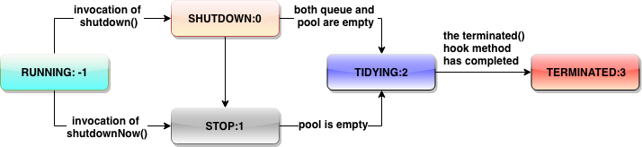

## sourcecode


## javadoc

An `ExecutorService` that executes each submitted task using one of possibly several pooled threads, normally configured using `Executors` factory methods.

Thread pools address`处理` two different problems: they usually provide improved performance when executing large numbers of asynchronous tasks, due to **reduced per-task invocation`调用` overhead**, and they provide a means of bounding`界定` and managing the resources, including threads, consumed when executing a collection of tasks. Each `ThreadPoolExecutor` also maintains some basic statistics`统计`, such as the number of completed tasks.

To be useful across a wide range of contexts, this class provides many **adjustable parameters** and **extensibility hooks**. However, programmers are urged to`推荐` use the more convenient Executors factory methods `Executors.newCachedThreadPool` (unbounded thread pool, with automatic thread reclamation), `Executors.newFixedThreadPool` (fixed size thread pool) and `Executors.newSingleThreadExecutor` (single background thread), that preconfigure settings for the most common usage scenarios. 

一般情况下不建议使用 Executors 提供的便利方法，出于以下原因考虑

1. newFixedThreadPool & newSingleThreadExecutor 使用**unbounded BlockingQueue容易造成OOM**
2. newCachedThreadPool & ScheduledThreadPool 可能会**创建过多的线程，从而导致 OOM**
3. **推荐自定义 ThreadFactory 指定业务线程的 threadName**

Otherwise, use the following guide when manually configuring and tuning this class:

**Core and maximum pool sizes**
A `ThreadPoolExecutor` will automatically adjust the pool size (see `getPoolSize`) according to the bounds set by **corePoolSize** (see `getCorePoolSize`) and **maximumPoolSize** (see `getMaximumPoolSize`). <u>When a new task is submitted in method `execute(Runnable)`, and fewer than **corePoolSize** threads are running, a new thread is created to handle the request, even if other worker threads are idle. If there are more than **corePoolSize** but less than **maximumPoolSize** threads running, a new thread will be created only if the queue is full. By setting **corePoolSize** and **maximumPoolSize** the same, you create a fixed-size thread pool. By setting maximumPoolSize to an essentially unbounded value such as `Integer.MAX_VALUE`, you allow the pool to accommodate`容纳` an arbitrary number of concurrent tasks. Most typically, core and maximum pool sizes are set only upon construction, but they may also be changed dynamically using `setCorePoolSize` and `setMaximumPoolSize`.</u>

**On-demand`按需` construction**
By default, even core threads are initially created and started only when new tasks arrive, but this can be overridden dynamically using method `prestartCoreThread` or `prestartAllCoreThreads`. You probably want to prestart threads if you construct the pool with a non-empty queue.

**Creating new threads**
New threads are created using a `ThreadFactory`. If not otherwise specified, a `Executors.defaultThreadFactory` is used, that creates threads to all be in the same `ThreadGroup` and with the same `NORM_PRIORITY` priority and `non-daemon` status. By supplying a different `ThreadFactory`, <u>you can alter the thread's name, thread group, priority, daemon status</u>, etc. If a `ThreadFactory` fails to create a thread when asked by returning `null` from newThread, the executor will continue, but might not be able to execute any tasks. **Threads should possess the "modifyThread" RuntimePermission**`具有…权限`. If worker threads or other threads using the pool do not possess this permission`如果使用池的工作线程或其他线程不具有此权限`, service may be degraded`降级`: configuration changes may not take effect in a timely manner`不能及时生效`, and a shutdown pool may remain in a state in which termination is possible but not completed.

**Keep-alive times**保持活跃时间
If the pool currently has more than **corePoolSize** threads, excess`多余的` threads will be terminated if they have been idle for more than the **keepAliveTime** (see `getKeepAliveTime(TimeUnit)`). This provides a means of reducing resource consumption`消耗` when the pool is not being actively used. If the pool becomes more active later, new threads will be constructed. This parameter can also be changed dynamically using method `setKeepAliveTime(long, TimeUnit)`. Using a value of `Long.MAX_VALUE` `TimeUnit.NANOSECONDS` effectively disables idle threads from ever terminating prior to shut down. By default, **the keep-alive policy applies only when there are more than corePoolSize threads. But method `allowCoreThreadTimeOut(boolean)` can be used to apply this time-out policy to core threads as well, so long as the keepAliveTime value is non-zero.**

**Queuing**
Any `BlockingQueue` may be used to transfer and hold submitted tasks. The use of this queue interacts with pool sizing:

* If fewer than **corePoolSize** threads are running, the `Executor` always prefers adding a new thread rather than queuing.
* If **corePoolSize** or more threads are running, the `Executor` always prefers queuing a request rather than adding a new thread.
* If a request cannot be queued, a new thread is created unless this would exceed **maximumPoolSize**, in which case`在这种情况下`, the task will be rejected.

There are three general strategies for queuing:

1. ***Direct handoffs传递***. A good default choice for a work queue is a `SynchronousQueue` that hands off tasks to threads without otherwise holding them. Here, an attempt to queue a `task` will fail if no threads are immediately available to run it, so a new thread will be constructed. This policy avoids lockups when handling sets of requests that might have internal dependencies. Direct handoffs generally require unbounded maximumPoolSizes to avoid rejection of new submitted tasks. This in turn admits the possibility of unbounded thread growth when commands continue to arrive on average faster than they can be processed.

2. ***Unbounded queues***. Using an unbounded queue (for example a `LinkedBlockingQueue` without a predefined capacity) will cause new tasks to wait in the queue when all corePoolSize threads are busy. Thus, **no more than corePoolSize threads will ever be created**. (And the value of the maximumPoolSize therefore doesn't have any effect.) This may be appropriate`合适` when each task is completely independent of others`完全独立于其他任务`, so tasks cannot affect each others execution`因此任务不能影响其他任务的执行`; for example, in a web page server. While this style of queuing can be useful in smoothing out transient bursts of requests`消除请求的短暂突发`, it admits the possibility of unbounded work queue growth when commands continue to arrive on average faster than they can be processed.`但它也承认当命令平均以高于处理速度的速度持续到达时，可能会出现无限制的工作队列增长`

3. ***Bounded queues***. A bounded queue (for example, an `ArrayBlockingQueue`) helps prevent resource exhaustion when used with finite maximumPoolSizes, but can be more difficult to tune`调整` and control. Queue sizes and maximum pool sizes may be traded off for each other: Using large queues and small pools minimizes CPU usage, OS resources, and context-switching overhead, but can lead to artificially low throughput. If tasks frequently block (for example if they are I/O bound), a system may be able to schedule time for more threads than you otherwise allow. Use of small queues generally requires larger pool sizes, which keeps CPUs busier but may encounter unacceptable scheduling overhead, which also decreases throughput.

   `队列大小和最大池大小可以相互权衡：使用大型队列和小型池可以最大限度地减少CPU使用、操作系统资源和上下文切换开销，但可能导致人为的低吞吐量。如果任务经常阻塞（例如，如果它们是I/O绑定的），系统可能能够为比您所允许的更多的线程安排时间。使用小队列通常需要更大的池大小，这样可以使CPU更忙，但可能会遇到不可接受的调度开销，这也会降低吞吐量。`

**Rejected tasks**
New tasks submitted in method `execute(Runnable)` will **be rejected when the Executor has been shut down, and also when the Executor uses finite bounds for both maximum threads and work queue capacity, and is saturated`饱和`**. In either case, the execute method invokes the `RejectedExecutionHandler.rejectedExecution(Runnable, ThreadPoolExecutor)` method of its `RejectedExecutionHandler`. Four predefined handler policies are provided:

1. In the default `ThreadPoolExecutor.AbortPolicy`, the handler throws a runtime `RejectedExecutionException` upon rejection.
2. In `ThreadPoolExecutor.CallerRunsPolicy`, the thread that **invokes execute itself runs the task**. This provides a simple feedback control mechanism that will **slow down the rate that new tasks are submitted**.
3. In `ThreadPoolExecutor.DiscardPolicy`, a task that cannot be executed is simply **dropped**.
4. In `ThreadPoolExecutor.DiscardOldestPolicy`, if the executor is not shut down, the task **at the head of the work queue is dropped**, and then execution is **retried** (which can fail again, causing this to be repeated.)


It is possible to define and use other kinds of `RejectedExecutionHandler` classes. Doing so requires some care especially when policies are designed to work only under particular capacity or queuing policies.`这样做需要一些注意，特别是当策略设计为仅在特定容量或排队策略下工作时`

**Hook methods**
This class provides protected overridable **beforeExecute(Thread, Runnable)** and **afterExecute(Runnable, Throwable)** methods that are called before and after execution of each task. These can be used to manipulate`操控` the execution environment; for example, reinitializing ThreadLocals, gathering statistics, or adding log entries. Additionally, method `terminated` can be overridden to perform any special processing that needs to be done once the `Executor` has fully terminated.
If hook or callback methods throw exceptions, internal worker threads may in turn fail and abruptly terminate.

**Queue maintenance`维修`**
**Method `getQueue()` allows access to the work queue for purposes of monitoring and debugging. Use of this method for any other purpose is strongly discouraged.** Two supplied methods, `remove(Runnable)` and `purge` are available to assist in storage reclamation when large numbers of queued tasks become cancelled.

**Finalization**
**A pool that is no longer referenced in a program "AND" <u>has no remaining threads</u> will be shutdown automatically**. If you would like to ensure that unreferenced pools are reclaimed even if users forget to call shutdown, then you **must arrange that unused threads eventually die, by setting appropriate keep-alive times, using a lower bound of zero core threads and/or setting allowCoreThreadTimeOut(boolean).**

Extension example. Most extensions of this class override one or more of the protected hook methods. For example, here is a subclass that adds a simple pause/resume feature:

```java
 class PausableThreadPoolExecutor extends ThreadPoolExecutor {
   private boolean isPaused;
   private ReentrantLock pauseLock = new ReentrantLock();
   private Condition unpaused = pauseLock.newCondition();

   public PausableThreadPoolExecutor(...) { super(...); }

   protected void beforeExecute(Thread t, Runnable r) {
     super.beforeExecute(t, r);
     pauseLock.lock();
     try {
       while (isPaused) unpaused.await();
     } catch (InterruptedException ie) {
       t.interrupt();
     } finally {
       pauseLock.unlock();
     }
   }

   public void pause() {
     pauseLock.lock();
     try {
       isPaused = true;
     } finally {
       pauseLock.unlock();
     }
   }

   public void resume() {
     pauseLock.lock();
     try {
       isPaused = false;
       unpaused.signalAll();
     } finally {
       pauseLock.unlock();
     }
   }
 }
```

# theroy

The main pool control state, **ctl**, is an atomic integer packing two conceptual`概念上` fields 

* **workerCount**, indicating the effective number of threads 
* **runState**, indicating whether running, shutting down etc 

In order to pack them into one int, we limit workerCount to (2^29)-1 (about 500 million) threads rather than`而不是` (2^31)-1 (2 billion) otherwise representable. If this is ever an issue in the future, the variable can be changed to be an `AtomicLong`, and the shift/mask constants below adjusted. But until the need arises, this code is a bit faster and simpler using an int. 

The **workerCount** <u>is the number of workers that have been permitted to start and not permitted to stop</u>. The value may be transiently different from the actual number of live threads, for example when a `ThreadFactory` fails to create a thread when asked, and when exiting threads are still performing bookkeeping before terminating. The user-visible pool size is reported as the current size of the workers set. 

The **runState** provides the main lifecycle control, taking on values:

* **RUNNING**: Accept new tasks and process queued tasks 
* **SHUTDOWN**: Don't accept new tasks, but process queued tasks 
* **STOP**: Don't accept new tasks, don't process queued tasks, and interrupt in-progress tasks 
* **TIDYING整理**: All tasks have terminated, workerCount is zero, the thread transitioning to state TIDYING will **run the terminated() hook method** 
* **TERMINATED**: terminated() has completed

The numerical order among these values matters, to allow ordered comparisons. The runState monotonically单调地 increases over time, but need not hit each state. The transitions are: 

* **RUNNING -> SHUTDOWN** On invocation of shutdown(), perhaps implicitly in finalize() 
* **(RUNNING or SHUTDOWN) -> STOP** On invocation of shutdownNow() 
* **SHUTDOWN -> TIDYING** When both queue and pool are empty 
* **STOP** -> **TIDYING** When pool is empty 
* **TIDYING** -> **TERMINATED** When the terminated() hook method has completed 



**<u>Threads waiting in awaitTermination() will return when the state reaches TERMINATED.</u>** 

Detecting the transition from SHUTDOWN to TIDYING is less straightforward than you'd like because the queue may become empty after non-empty and vice versa during SHUTDOWN state, but we can only terminate if, after seeing that it is empty, we see that workerCount is 0 (which sometimes entails a recheck -- see below).

# sourceCode

## static fields

```java
private final AtomicInteger ctl = new AtomicInteger(ctlOf(RUNNING, 0));
private static final int COUNT_BITS = Integer.SIZE - 3;// Integer.SIZE = 32
private static final int CAPACITY = (1 << COUNT_BITS) - 1;
// 2^30-1             =>  CAPACITY                     //00 00111 11111 11111 11111 11111 11111
// runState is stored in the high-order bits
private static final int RUNNING    = -1 << COUNT_BITS;//10 01000 00000 00000 00000 00000 00000
private static final int SHUTDOWN   =  0 << COUNT_BITS;//00 00000 00000 00000 00000 00000 00000
private static final int STOP       =  1 << COUNT_BITS;//00 01000 00000 00000 00000 00000 00000
private static final int TIDYING    =  2 << COUNT_BITS;//00 10000 00000 00000 00000 00000 00000
private static final int TERMINATED =  3 << COUNT_BITS;//00 11000 00000 00000 00000 00000 00000

// Packing and unpacking ctl
//                    => ~CAPACITY                     //11 11000 00000 00000 00000 00000 00000
private static int runStateOf(int c)     { return c & ~CAPACITY; }
private static int workerCountOf(int c)  { return c & CAPACITY; }
private static int ctlOf(int rs, int wc) { return rs | wc; }
```

## core fields

```java
/**
 * The queue used for holding tasks and handing off to worker
 * threads.  We do not require that workQueue.poll() returning
 * null necessarily means that workQueue.isEmpty(), so rely
 * solely单独地 on isEmpty to see if the queue is empty (which we must
 * do for example when deciding whether to transition from
 * SHUTDOWN to TIDYING).  This accommodates容纳 special-purpose
 * queues such as DelayQueues for which poll() is allowed to
 * return null even if it may later return non-null when delays
 * expire.
 */
private final BlockingQueue<Runnable> workQueue;

/**
 * Lock held on access to workers set and related bookkeeping记账.
 * While we could use a concurrent set of some sort, it turns out
 * to be generally preferable to use a lock. Among the reasons is
 * that this serializes interruptIdleWorkers, which avoids
 * unnecessary interrupt storms, especially during shutdown.
 * Otherwise exiting threads would concurrently interrupt those
 * that have not yet interrupted. It also simplifies some of the
 * associated statistics bookkeeping of largestPoolSize etc. We
 * also hold mainLock on shutdown and shutdownNow, for the sake of为了... 起见
 * ensuring workers set is stable while separately checking
 * permission to interrupt and actually interrupting.
 */
private final ReentrantLock mainLock = new ReentrantLock();

/**
 * Set containing all worker threads in pool. Accessed only when
 * holding mainLock.
 */
private final HashSet<Worker> workers = new HashSet<Worker>();

/**
 * Wait condition to support awaitTermination
 */
private final Condition termination = mainLock.newCondition();

/**
 * Tracks largest attained pool size. Accessed only under
 * mainLock.
 */
private int largestPoolSize;

/**
 * Counter for completed tasks. Updated only on termination of
 * worker threads. Accessed only under mainLock.
 */
private long completedTaskCount;

/*
 * All user control parameters are declared as volatiles so that
 * ongoing actions are based on freshest最新的 values, but without need
 * for locking, since因为 no internal invariants内部变量 depend on them
 * changing synchronously with respect to关于 other actions.
 */

/**
 * Factory for new threads. All threads are created using this
 * factory (via method addWorker).  All callers must be prepared
 * for addWorker to fail, which may reflect a system or user's
 * policy limiting the number of threads.  Even though it is not
 * treated as an error, failure to create threads may result in
 * new tasks being rejected or existing ones remaining stuck in
 * the queue.
 *
 * We go further更进一步 and preserve保留 pool invariants不变性 even in the face of面对
 * errors such as OutOfMemoryError, that might be thrown while
 * trying to create threads.  Such errors are rather common due to
 * the need to allocate a native stack in Thread.start, and users
 * will want to perform clean pool shutdown to clean up.  There
 * will likely be enough memory available for the cleanup code to
 * complete without encountering yet another OutOfMemoryError.
 */
private volatile ThreadFactory threadFactory;

/**
 * Handler called when saturated饱和 or shutdown in execute.
 */
private volatile RejectedExecutionHandler handler;

/**
 * Timeout in nanoseconds for idle threads waiting for work.
 * Threads use this timeout when there are more than corePoolSize
 * present or if allowCoreThreadTimeOut. Otherwise they wait
 * forever for new work.
 */
private volatile long keepAliveTime;

/**
 * If false (default), core threads stay alive even when idle.
 * If true, core threads use keepAliveTime to time out waiting
 * for work.
 */
private volatile boolean allowCoreThreadTimeOut;

/**
 * Core pool size is the minimum number of workers to keep alive
 * (and not allow to time out etc) unless allowCoreThreadTimeOut
 * is set, in which case the minimum is zero.
 */
private volatile int corePoolSize;

/**
 * Maximum pool size. Note that the actual maximum is internally
 * bounded by CAPACITY.
 */
private volatile int maximumPoolSize;

/**
 * The default rejected execution handler
 */
private static final RejectedExecutionHandler defaultHandler =
    new AbortPolicy();
```

## Worker

```java
/**
 * Class Worker mainly maintains interrupt control state for
 * threads running tasks, along with other minor bookkeeping.
 * This class opportunistically extends AbstractQueuedSynchronizer
 * to simplify acquiring and releasing a lock surrounding each
 * task execution.  This protects against interrupts that are
 * intended to wake up a worker thread waiting for a task from
 * instead interrupting a task being run.  We implement a simple
 * non-reentrant mutual exclusion lock不可重入互斥锁 rather than use
 * ReentrantLock because we do not want worker tasks to be able to
 * reacquire the lock不想让"工作任务"有重新获取锁的能力 when they invoke pool control methods like
 * setCorePoolSize.  Additionally, to suppress阻止 interrupts until
 * the thread actually starts running tasks, we initialize lock
 * state to a negative value, and clear it upon start (in
 * runWorker).
 */
private final class Worker
    extends AbstractQueuedSynchronizer // Worker 本身是一个 AQS 队列同步器
    implements Runnable
{
    /**
     * This class will never be serialized, but we provide a
     * serialVersionUID to suppress a javac warning.
     */
    private static final long serialVersionUID = 6138294804551838833L;

    /** Thread this worker is running in.  Null if factory fails. */
    final Thread thread;
    /** Initial task to run.  Possibly null. */
    Runnable firstTask;
    /** Per-thread task counter */
    volatile long completedTasks;

    /**
     * Creates with given first task and thread from ThreadFactory.
     * @param firstTask the first task (null if none)
     */
    Worker(Runnable firstTask) {
        setState(-1); // inhibit阻止 interrupts until runWorker
        this.firstTask = firstTask;
        this.thread = getThreadFactory().newThread(this);
    }

    /** Delegates main run loop to outer runWorker  */
    public void run() {
        runWorker(this);
    }

    // Lock methods
    //
    // The value 0 represents the unlocked state.
    // The value 1 represents the locked state.

    protected boolean isHeldExclusively() {
        return getState() != 0;
    }

    protected boolean tryAcquire(int unused) {
        if (compareAndSetState(0, 1)) {
            setExclusiveOwnerThread(Thread.currentThread());
            return true;
        }
        return false;
    }

    protected boolean tryRelease(int unused) {
        setExclusiveOwnerThread(null);
        setState(0);
        return true;
    }

    public void lock()        { acquire(1); }
    public boolean tryLock()  { return tryAcquire(1); }
    public void unlock()      { release(1); }
    public boolean isLocked() { return isHeldExclusively(); }

    void interruptIfStarted() {
        Thread t;
        if (getState() >= 0 && (t = thread) != null && !t.isInterrupted()) {
            try {
                t.interrupt();
            } catch (SecurityException ignore) {
            }
        }
    }
}
```

## Constructor

```java
/**
 * Creates a new {@code ThreadPoolExecutor} with the given initial
 * parameters.
 *
 * @param corePoolSize the number of threads to keep in the pool, even
 *        if they are idle, unless {@code allowCoreThreadTimeOut} is set
 * @param maximumPoolSize the maximum number of threads to allow in the
 *        pool
 * @param keepAliveTime when the number of threads is greater than
 *        the core, this is the maximum time that excess idle threads
 *        will wait for new tasks before terminating.
 * @param unit the time unit for the {@code keepAliveTime} argument
 * @param workQueue the queue to use for holding tasks before they are
 *        executed.  This queue will hold only the {@code Runnable}
 *        tasks submitted by the {@code execute} method.
 * @param threadFactory the factory to use when the executor
 *        creates a new thread
 * @param handler the handler to use when execution is blocked
 *        because the thread bounds and queue capacities are reached
 * @throws IllegalArgumentException if one of the following holds:<br>
 *         {@code corePoolSize < 0}<br>
 *         {@code keepAliveTime < 0}<br>
 *         {@code maximumPoolSize <= 0}<br>
 *         {@code maximumPoolSize < corePoolSize}
 * @throws NullPointerException if {@code workQueue}
 *         or {@code threadFactory} or {@code handler} is null
 */
public ThreadPoolExecutor(int corePoolSize,
                          int maximumPoolSize,
                          long keepAliveTime,
                          TimeUnit unit,
                          BlockingQueue<Runnable> workQueue,
                          ThreadFactory threadFactory,
                          RejectedExecutionHandler handler) {
    if (corePoolSize < 0 ||
        maximumPoolSize <= 0 ||
        maximumPoolSize < corePoolSize ||
        keepAliveTime < 0)
        throw new IllegalArgumentException();
    if (workQueue == null || threadFactory == null || handler == null)
        throw new NullPointerException();
    this.acc = System.getSecurityManager() == null ?
            null :
            AccessController.getContext();
    this.corePoolSize = corePoolSize;
    this.maximumPoolSize = maximumPoolSize;
    this.workQueue = workQueue;
    this.keepAliveTime = unit.toNanos(keepAliveTime);
    this.threadFactory = threadFactory;
    this.handler = handler;
}
```

## Core Methods

#### execute

```java
/**
 * Executes the given task sometime in the future.  The task
 * may execute in a new thread or in an existing pooled thread.
 *
 * If the task cannot be submitted for execution, either because this
 * executor has been shutdown or because its capacity has been reached,
 * the task is handled by the current {@code RejectedExecutionHandler}.
 *
 * @param command the task to execute
 * @throws RejectedExecutionException at discretion of
 *         {@code RejectedExecutionHandler}, if the task
 *         cannot be accepted for execution
 * @throws NullPointerException if {@code command} is null
 */
public void execute(Runnable command) {
    if (command == null)
        throw new NullPointerException();

  	/*
  	 * 1. If fewer than corePoolSize threads are running, try to
     * start a new thread with the given command as its first
     * task.  The call to addWorker atomically checks runState and
     * workerCount, and so prevents false alarms that would add
     * threads when it shouldn't, by returning false.
  	 */
    int c = ctl.get();
    if (workerCountOf(c) < corePoolSize) {
        if (addWorker(command, true))
            return;
        c = ctl.get();
    }
  
  	/*
  	 * 2. If a task can be successfully queued, then we still need
     * to double-check whether we should have added a thread
     * (because existing ones died since last checking) or that
     * the pool shut down since entry into this method. So we
     * recheck state and if necessary roll back the enqueuing if
     * stopped, or start a new thread if there are none.
  	 */
    if (isRunning(c) && workQueue.offer(command)) { // 加入任务刀等待队列
      	/*
      	 * 由于加入任务到等待队列之后，线程池的状态可能会变化
      	 * 1. 线程池被 shutdown 掉了
      	 * 2. coreThread 被超时回收掉了
      	 * 针对这 2 种情况，要做如下处理
      	 */
        int recheck = ctl.get();
      	// 如果线程池已经结束，则使用拒绝策略拒绝任务
        if (! isRunning(recheck) && remove(command))
            reject(command);
      	// 如果在加入等待队列之后，最后一个线程被超时回收了，此时需要新建一个新的线程来继续处理任务
        else if (workerCountOf(recheck) == 0)
            addWorker(null, false);
    }
  
  	/*
     * 3. If we cannot queue task, then we try to add a new
     * thread.  If it fails, we know we are shut down or saturated
     * and so reject the task.
     * 等待队列已满的情况下，如果 maxPoolSize > corePoolSize
     * 则还允许多创建 maxPoolSize - corePoolSize 个线程，如果创建失败，则直接拒绝
  	 */
    else if (!addWorker(command, false))
        reject(command);
}
```

```java
/**
 * Checks if a new worker can be added with respect to根据 current
 * pool state and the given bound (either core or maximum). If so,
 * the worker count is adjusted accordingly相应地, and, if possible, a
 * new worker is created and started, running firstTask as its
 * first task. This method returns false if the pool is stopped or
 * eligible to符合资格 shut down. It also returns false if the thread
 * factory fails to create a thread when asked.  If the thread
 * creation fails, either due to the thread factory returning
 * null, or due to an exception (typically OutOfMemoryError in
 * Thread.start()), we roll back cleanly.
 *
 * @param firstTask the task the new thread should run first (or
 * null if none). Workers are created with an initial first task
 * (in method execute()) to bypass避开 queuing when there are fewer
 * than corePoolSize threads (in which case we always start one),
 * or when the queue is full (in which case we must bypass queue).
 * Initially idle threads are usually created via
 * prestartCoreThread or to replace other dying workers.
 *
 * @param core if true use corePoolSize as bound, else
 * maximumPoolSize. (A boolean indicator is used here rather than a
 * value to ensure reads of fresh values after checking other pool
 * state).
 * @return true if successful
 */
private boolean addWorker(Runnable firstTask, boolean core) {
  
  	/*
  	 * 1. 增加 workerCount 计数
  	 */
    retry:
    for (;;) {
        int c = ctl.get();
        int rs = runStateOf(c);

        // Check if queue empty only if necessary.
        if (rs >= SHUTDOWN && // 状态已经是准备结束了
            ! (rs == SHUTDOWN &&
               firstTask == null &&
               ! workQueue.isEmpty())) // 状态虽然是 SHUNDOWN，但是等待队列中还有任务
            return false;

        for (;;) {
            int wc = workerCountOf(c);
            if (wc >= CAPACITY ||
                wc >= (core ? corePoolSize : maximumPoolSize))
                return false;
            if (compareAndIncrementWorkerCount(c))
                break retry;
            c = ctl.get();  // Re-read ctl
            if (runStateOf(c) != rs)
                continue retry;
            // else CAS failed due to workerCount change; retry inner loop
        }
    }

  	/*
  	 * 2. 启动 worker 线程
  	 */
    boolean workerStarted = false;
    boolean workerAdded = false;
    Worker w = null;
    try {
        w = new Worker(firstTask);
        final Thread t = w.thread;
        if (t != null) {
            final ReentrantLock mainLock = this.mainLock;
            mainLock.lock();
            try {
                // Recheck while holding lock.
                // Back out on ThreadFactory failure or if
                // shut down before lock acquired.
                int rs = runStateOf(ctl.get());

                if (rs < SHUTDOWN ||
                    (rs == SHUTDOWN && firstTask == null)) {
                    if (t.isAlive()) // precheck that t is startable
                        throw new IllegalThreadStateException();
                  	// 添加 worker 到 workers
                    workers.add(w);
                  	// 如果当前线程池容量大于最大值，则更新 largestPoolSize 为当前值
                    int s = workers.size();
                    if (s > largestPoolSize)
                        largestPoolSize = s;
                    workerAdded = true;
                }
            } finally {
                mainLock.unlock();
            }
            if (workerAdded) {
              	// 启动线程
                t.start();
                workerStarted = true;
            }
        }
    } finally {
      	// 如果线程启动失败 !isAlive 等原因，则从 workers 中移除，尝试停止线程池
        if (! workerStarted)
            addWorkerFailed(w);
    }
    return workerStarted;
}
```

## worker 线程执行逻辑

```java
/**
 * Main worker run loop.  Repeatedly gets tasks from queue and
 * executes them, while coping with a number of issues:
 *
 * 1. We may start out with an initial task, in which case we
 * don't need to get the first one. Otherwise, as long as pool is
 * running, we get tasks from getTask. If it returns null then the
 * worker exits due to changed pool state or configuration
 * parameters.  Other exits result from exception throws in
 * external code, in which case completedAbruptly holds, which
 * usually leads processWorkerExit to replace this thread.
 *
 * 2. Before running any task, the lock is acquired to prevent
 * other pool interrupts while the task is executing, and then we
 * ensure that unless pool is stopping, this thread does not have
 * its interrupt set.
 *
 * 3. Each task run is preceded在...之前 by a call to beforeExecute, which
 * might throw an exception, in which case we cause thread to die
 * (breaking loop with completedAbruptly true) without processing
 * the task.
 *
 * 4. Assuming假设...为真 beforeExecute completes normally, we run the task,
 * gathering any of its thrown exceptions to send to afterExecute.
 * We separately handle RuntimeException, Error (both of which the
 * specs guarantee that we trap) and arbitrary Throwables.
 * Because we cannot rethrow Throwables within Runnable.run, we
 * wrap them within Errors on the way out (to the thread's
 * UncaughtExceptionHandler).  Any thrown exception also
 * conservatively causes thread to die.
 *
 * 5. After task.run completes, we call afterExecute, which may
 * also throw an exception, which will also cause thread to
 * die. According to JLS Sec 14.20, this exception is the one that
 * will be in effect even if task.run throws.
 *
 * The net effect of the exception mechanics is that afterExecute
 * and the thread's UncaughtExceptionHandler have as accurate
 * information as we can provide about any problems encountered by
 * user code.
 *
 * @param w the worker
 */
final void runWorker(Worker w) {
    Thread wt = Thread.currentThread();
    Runnable task = w.firstTask;
    w.firstTask = null;
    w.unlock(); // allow interrupts // 没看懂， unpark 会导致下一次 park 失效
    boolean completedAbruptly = true;
    try {
      	/*
      	 * 第一次执行的时候，处理 firstTask
      	 * firstTask 处理完毕之后，继续从等待队列中获取任务，直到线程池中断
       	 */
        while (task != null || (task = getTask()) != null) {
            w.lock();
            // If pool is stopping, ensure thread is interrupted;
            // if not, ensure thread is not interrupted.  This
            // requires a recheck in second case to deal with
            // shutdownNow race while clearing interrupt
            if ((runStateAtLeast(ctl.get(), STOP) ||
                 (Thread.interrupted() &&
                  runStateAtLeast(ctl.get(), STOP))) &&
                !wt.isInterrupted())
                wt.interrupt();
            try {
                beforeExecute(wt, task); // 前置处理的钩子
                Throwable thrown = null;
                try {
                  	// 在 worker 线程中执行 task
                    task.run();
                } catch (RuntimeException x) {
                    thrown = x; throw x;
                } catch (Error x) {
                    thrown = x; throw x;
                } catch (Throwable x) {
                    thrown = x; throw new Error(x);
                } finally {
                    afterExecute(task, thrown); // 后置处理的钩子
                }
            } finally {
                task = null;
                w.completedTasks++; // 计数器 +1
                w.unlock();
            }
        }
        completedAbruptly = false;
    } finally {
        processWorkerExit(w, completedAbruptly);
    }
}
```

```java
/**
 * Performs blocking or timed wait for a task, depending on
 * current configuration settings, or returns null if this worker
 * must exit because of any of:
 * 1. There are more than maximumPoolSize workers (due to
 *    a call to setMaximumPoolSize).
 * 2. The pool is stopped.
 * 3. The pool is shutdown and the queue is empty.
 * 4. This worker timed out waiting for a task, and timed-out
 *    workers are subject to termination (that is,
 *    {@code allowCoreThreadTimeOut || workerCount > corePoolSize})
 *    both before and after the timed wait, and if the queue is
 *    non-empty, this worker is not the last thread in the pool.
 *
 * @return task, or null if the worker must exit, in which case
 *         workerCount is decremented
 */
private Runnable getTask() {
    boolean timedOut = false; // Did the last poll() time out?

    for (;;) {
        int c = ctl.get();
        int rs = runStateOf(c);

        // Check if queue empty only if necessary.
        if (rs >= SHUTDOWN && (rs >= STOP || workQueue.isEmpty())) {
            decrementWorkerCount();
            return null;// 结束这个 worker 线程
        }

        int wc = workerCountOf(c);

        // Are workers subject to culling?  
      	// 当超过最大线程数 或者设置了 allowCoreThreadTimeOut 的时候，都需要回收多余的线程
        boolean timed = allowCoreThreadTimeOut || wc > corePoolSize;

        if ((wc > maximumPoolSize || (timed && timedOut))
            && (wc > 1 || workQueue.isEmpty())) {
            if (compareAndDecrementWorkerCount(c))
                return null;
            continue;
        }

        try {
          	// 从阻塞队列中获取任务
            Runnable r = timed ?
                workQueue.poll(keepAliveTime, TimeUnit.NANOSECONDS) :
                workQueue.take();
            if (r != null)
                return r;
            timedOut = true;
        } catch (InterruptedException retry) {
            timedOut = false;
        }
    }
}
```