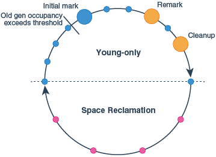

原文地址：[garbage-first-garbage-collector](https://docs.oracle.com/javase/10/gctuning/garbage-first-garbage-collector.htm)

## Introduction to Garbage-First Garbage Collector

The Garbage-First (G1) garbage collector is targeted for multiprocessor machines with a large amount of memory. It attempts to meet`实现` garbage collection pause-time goals with high probability`概率` while achieving`实现` high throughput with little need for configuration. G1 aims to`目标是` provide the best balance between latency`延迟` and throughput using current target applications and environments whose features include:

- **Heap sizes up to ten of GBs or larger, with more than 50% of the Java heap occupied`被使用` with live data.**
- **Rates of object allocation分配 and promotion增长 that can vary差别 significantly明显 over time.**
- **A significant amount of fragmentation碎片 in the heap.**
- **Predictable可预测的 pause-time target goals that aren’t longer than a few hundred milliseconds, avoiding long garbage collection pauses.**

G1 replaces the Concurrent Mark-Sweep (CMS) collector. It is also the default collector.

The G1 collector achieves high performance and tries to meet pause-time goals in several ways described in the following sections.

## Enabling G1

The Garbage-First garbage collector is the default collector, so typically you don't have to perform any additional actions. You can explicitly enable it by providing `-XX:+UseG1GC` on the command line.

## Basic Concepts概念

G1 is a generational`分代的`, **incremental**`增量的`, parallel, **mostly concurrent**, stop-the-world, and **evacuating**`疏散，排空` garbage collector which <u>monitors pause-time goals in each of the stop-the-world pauses</u>. Similar to other collectors, G1 splits the heap into (virtual) young and old generations. **Space-reclamation**`空间复用` efforts`努力` concentrate on`专注于` the young generation where it is most efficient to do so`这样做最有效`, with occasional`偶尔的` space-reclamation in the old generation

Some operations are always performed in stop-the-world pauses to improve throughput. Other operations that would take more time with the application stopped such as whole-heap operations like *global marking* are performed in parallel and concurrently with the application. To keep stop-the-world pauses short for space-reclamation, G1 performs space-reclamation incrementally in steps and in parallel. G1 achieves`取得` predictability`预测` by tracking information about previous application behavior and garbage collection pauses to build a model of the associated costs. It uses this information to size`调整大小` the work done in the pauses. For example, G1 reclaims space in the most efficient areas first (that is the areas that are mostly filled with garbage, therefore the name).

G1 reclaims space mostly by using **evacuation**`抽空，排出`: **live objects found within selected memory areas to collect are copied into new memory areas, compacting them in the process`在此过程中`. After an evacuation has been completed, the space previously occupied`已使用的` by live objects is reused for allocation by the application.**

The Garbage-First collector is not a real-time collector. It tries to meet set pause-time targets with high probability over a longer time`尝试在很长的时间内达到高效的停顿时间`, but not always with absolute`绝对` certainty`确定` for a given pause.

### Heap Layout

**G1 partitions the heap into a set of equally sized heap regions, each a contiguous range of virtual memory`连续的内存范围` as shown in Figure 9-1. A region is the unit of memory allocation and memory reclamation`回收`. At any given time, each of these regions can be empty (light gray`浅灰色`), or assigned to a particular generation`或者分配给特定的一代`, young or old. As requests for memory comes in, the *memory manager* hands out`找出` free regions. The *memory manager* assigns them to a generation and then returns them to the application as free space into which it can allocate itself.**

Figure 9-1 G1 Garbage Collector Heap Layout

>  [Description of "Figure 9-1 G1 Garbage Collector Heap Layout "]
>
> The figure consists of a 10-by-10 grid. Most of the grid's cells are gray. Nineteen cells are colored dark blue. These dark blue cells are randomly distributed in the upper six rows of the grid. Two of these dark blue cells contain a red box. A cell two cells wide and one cell high (which appears in the first row) and a cell three cells wide and one cell high (which appears in the sixth row) are colored dark blue and labeled "H." Eight cells are colored light blue and contain a red box. Two of these cells are labeled "S." These light blue cells with a red box are distributed randomly, most of them located in the upper half of the grid.

**The young generation contains eden regions (red) and survivor regions (red with "S"). These regions provide the same function as the respective`各自的` contiguous spaces in other collectors`这些区域提供的功能与其他收集器中各自的连续空间相同`, with the difference that in G1 these regions are typically laid out`布局` in a noncontiguous`不连续` pattern in memory. Old regions (light blue) make up`组成了` the old generation. Old generation regions may be humongous`极大的` (light blue with "H") for objects that span multiple regions`跨越多个区域`.**

**An application always allocates into a young generation, that is`也就是`, eden regions, with the exception of`除了...的例外` humongous, objects that are directly allocated as belonging to the old generation.`除了大对象是直接分配给年老代之外`**

<u>**G1 garbage collection pauses can reclaim space in the young generation as a whole`作为整体`, and any additional set of old generation regions at any collection pause**</u>. During the pause G1 copies objects from this *collection set* to one or more different regions in the heap. The destination region for an object depends on the source region of that object: the entire young generation is copied into either survivor or old regions, and objects from old regions to other, different old regions using aging`老化`.

### Garbage Collection Cycle

On a high level, the G1 collector alternates between two phases`在两个阶段时间交替`. The **young-only phase** contains garbage collections that fill up the currently available memory with objects in the old generation gradually`逐步`. The **space-reclamation phase** is where G1 reclaims space in the old generation incrementally`逐渐地`, in addition to handling the young generation. Then the cycle restarts with a young-only phase.

Figure 9-2 gives an overview about this cycle with an example of the sequence of garbage collection pauses that could occur:

Figure 9-2 Garbage Collection Cycle Overview

>  Description of "Figure 9-2 Garbage Collection Cycle Overview "
>
> This figure shows the sequence of G1 phases with the pauses that may occur during these phases. There are filled circles, every circle represents a garbage collection pause: blue circles represent young-only collection pauses, orange ones represent pauses induced`导致` by marking, and red circles represent mixed collection pauses. The pauses are threaded on two arrows forming a circle: one each for the pauses occurring during the young-only phase, another one representing the mixed collection phase. The young-only phase starts with a few young-only garbage collections represented by small blue circles. After object occupancy in the old generation reaches the threshold defined by InitiatingHeapOccupancyPercent, the next garbage collection pause will be an <u>initial mark garbage collection pause</u>, shown as larger blue circle. In addition to the same work as in other young-only pauses, it prepares concurrent marking.
>
> While concurrent marking is running, other young-only pauses may occur, until the Remark pause (the first large orange circle), where G1 completes marking. Additional young-only garbage collections may occur until the Cleanup pause. After the Cleanup pause, there will be a final young-only garbage collection that finishes the young-only phase. During the space-reclamation phase a sequence of mixed collections will occur, indicated as red filled circles. Typically there are **fewer** mixed garbage collection pauses than young-only pauses in the young-only phase as G1 strives to`力求` make the space reclamations as efficient as possible.

The following list describes the phases, their pauses and the transition`过渡` between the phases of the G1 garbage collection cycle in detail:

1. **Young-only phase**: This phase starts with a few young-only collections that promote`推送` objects into the old generation. The transition between the young-only phase and the space-reclamation phase starts when the old generation occupancy`使用率` reaches a certain threshold, the Initiating Heap Occupancy threshold. <u>At this time, G1 schedules an Initial **Mark** young-only collection instead of a **regular** young-only collection.</u>
   - **Initial Mark** : This type of collection <u>starts the marking process</u> in addition to performing a regular young-only collection. Concurrent marking <u>determines all currently reachable (live) objects</u> in the old generation regions to be kept for the following space-reclamation phase. While marking hasn’t completely finished, regular young collections may occur. <u>Marking finishes with two special stop-the-world pauses</u>: Remark and Cleanup.
   - **Remark**: This pause finalizes the marking itself, and performs global reference processing`全局引用处理` and class unloading`类卸载`. Between `Remark` and `Cleanup` G1 **calculates a summary of the liveness information** concurrently, which will be `finalized` and used in the Cleanup pause to update internal data structures.
   - **Cleanup**: This pause also **reclaims completely empty regions**, and determines whether a space-reclamation phase will actually follow. If a space-reclamation phase follows, the young-only phase completes with a single young-only collection.
2. **Space-reclamation phase**: **This phase consists of`包括` multiple mixed collections that in addition to`另外` young generation regions, also evacuate`转移,疏散` live objects of sets of old generation regions**. <u>The space-reclamation phase ends when G1 determines that evacuating more old generation regions wouldn't yield`产生` enough free space worth the effort.</u>

After space-reclamation, the collection cycle restarts with another young-only phase. As backup, <u>if the application runs out of memory while gathering liveness information, G1 **performs an in-place stop-the-world full heap compaction** (Full GC) like other collectors.</u>

## Garbage-First Internals

This section describes some important details of the Garbage-First (G1) garbage collector.

### Determining Initiating Heap`启动堆` Occupancy

The *Initiating Heap Occupancy Percent (IHOP)* is the **threshold** at which an **Initial Mark collection** is triggered and it is <u>defined as a percentage of the old generation size.</u>

**G1 by default automatically determines an optimal`最优的` IHOP by observing`观察` how long marking takes and how much memory is typically allocated in the old generation during marking cycles**. This feature is called *Adaptive IHOP*. If this feature is active, then the option `-XX:InitiatingHeapOccupancyPercent` determines the initial value as a percentage of the size of the current old generation as long as there aren't enough observations to make a good prediction of the Initiating Heap Occupancy threshold. Turn off this behavior of G1 using the option`-XX:-G1UseAdaptiveIHOP`. In this case, the value of `-XX:InitiatingHeapOccupancyPercent` always determines this threshold.

Internally, *Adaptive IHOP* tries to set the Initiating Heap Occupancy so that the first mixed garbage collection of the space-reclamation phase starts when the old generation occupancy is at a current maximum old generation size minus the value of `-XX:G1HeapReservePercent` as the extra buffer.

### Marking

G1 marking uses an algorithm called **Snapshot-At-The-Beginning** (SATB) . <u>It takes a virtual snapshot of the heap at the time of the Initial Mark pause, when all objects that were live at the start of marking are considered live for the remainder`剩余` of marking</u>. This means that objects that become dead (unreachable) during marking are still considered live for the purpose of space-reclamation (with some exceptions). This may cause some additional memory wrongly retained`错误地被保留` compared to other collectors. However, SATB potentially`天然地，潜在地` provides better latency during the Remark pause. The too conservatively`谨慎地` considered live objects during that marking will be reclaimed during the next marking. See the [Garbage-First Garbage Collector Tuning](https://docs.oracle.com/javase/10/gctuning/garbage-first-garbage-collector-tuning.htm#GUID-90E30ACA-8040-432E-B3A0-1E0440AB556A) topic for more information about problems with marking.

### Behavior in Very Tight`紧密` Heap Situations

When the application keeps alive so much memory so that an evacuation can't find enough space to copy to, an evacuation failure occurs. Evacuation failure means that G1 tries to complete the current garbage collection by keeping any objects that have already been moved in their new location, and not copying any not yet moved objects, only adjusting references between the object. Evacuation failure may incur`引起` some additional overhead, but generally should be as fast as`一样快` other young collections. After this garbage collection with the evacuation failure, G1 will resume the application as normal without any other measures`不采取任何操作的情况下唤醒应用程序`. G1 assumes`假设` that the evacuation failure occurred close to`接近` the end of the garbage collection; that is, most objects were already moved and there is enough space left to continue running the application until marking completes and space-reclamation starts.

**If this assumption doesn’t hold, then G1 will eventually <u>schedule a Full GC</u>**. This type of collection performs in-place compaction of the entire heap. This might be very slow.

See [Garbage-First Garbage Collector Tuning](https://docs.oracle.com/javase/10/gctuning/garbage-first-garbage-collector-tuning.htm#GUID-90E30ACA-8040-432E-B3A0-1E0440AB556A) for more information about problems with allocation failure or Full GC's before signalling out of memory.

### Humongous`巨大的` Objects

Humongous objects are objects larger or equal the size of half a region. The current region size is determined ergonomically as described in the [Ergonomic Defaults for G1 GC](https://docs.oracle.com/javase/10/gctuning/garbage-first-garbage-collector.htm#GUID-082C967F-2DAC-4B59-8A81-0CEC6EEB9016) section, unless set using the `-XX:G1HeapRegionSize` option.

**These humongous objects are sometimes treated in special ways:**

- **Every humongous object gets allocated as a sequence of contiguous regions in the old generation. The start of the object itself is always located at the start of the first region in that sequence. Any leftover space in the last region of the sequence will be lost for allocation until the entire object is reclaimed.**
- **Generally, humongous objects can be reclaimed only at the end of marking during the Cleanup pause, or during Full GC if they became unreachable. There is, however, a special provision for humongous objects for arrays of primitive types for example, `bool`, all kinds of integers, and floating point values. G1 opportunistically tries to reclaim humongous objects if they are not referenced by many objects at any kind of garbage collection pause. This behavior is enabled by default but you can disable it with the option `-XX:G1EagerReclaimHumongousObjects`.**
- **Allocations of humongous objects may cause garbage collection pauses to occur prematurely. G1 checks the Initiating Heap Occupancy threshold at every humongous object allocation and may force an initial mark young collection immediately, if current occupancy exceeds that threshold.**
- **The humongous objects never move, not even during a Full GC. This can cause premature slow Full GCs or unexpected out-of-memory conditions with lots of free space left due to fragmentation of the region space.**

### Young-Only Phase Generation Sizing

During the young-only phase, the set of regions to collect (collection set), consists only of young generation regions. G1 always sizes the young generation at the end of a young-only collection. This way, G1 can meet the pause time goals that were set using `-XX:MaxGCPauseTimeMillis` and `-XX:PauseTimeIntervalMillis` based on long-term observations of actual pause time. It takes into account how long it took young generations of similar size to evacuate. This includes information like how many objects had to be copied during collection, and how interconnected these objects had been.

If not otherwise constrained, then G1 adaptively sizes the young generation size between the values that `-XX:G1NewSizePercent` and `-XX:G1MaxNewSizePercent` determine to meet pause-time. See [Garbage-First Garbage Collector Tuning](https://docs.oracle.com/javase/10/gctuning/garbage-first-garbage-collector-tuning.htm#GUID-90E30ACA-8040-432E-B3A0-1E0440AB556A)  for more information about how to fix long pauses.

### Space-Reclamation Phase Generation Sizing

During the space-reclamation phase, G1 tries to maximize the amount of space that's reclaimed in the old generation in a single garbage collection pause. The size of the young generation is set to minimum allowed, typically as determined by `-XX:G1NewSizePercent`, and any old generation regions to reclaim space are added until G1 determines that adding further regions will exceed the pause time goal. In a particular garbage collection pause, G1 adds old generation regions in order of their reclamation efficiency, highest first, and the remaining available time to get the final collection set.

The number of old generation regions to take per garbage collection is bounded at the lower end by the number of potential candidate old generation regions (*collection set candidate regions*) to collect, divided by the length of the space-reclamation phase as determined by `-XX:G1MixedGCCountTarget`. The collection set candidate regions are all old generation regions that have an occupancy that's lower than `-XX:G1MixedGCLiveThresholdPercent` at the start of the phase.

The phase ends when the remaining amount of space that can be reclaimed in the collection set candidate regions is less than the percentage set by `-XX:G1HeapWastePercent`.

See [Garbage-First Garbage Collector Tuning](https://docs.oracle.com/javase/10/gctuning/garbage-first-garbage-collector-tuning.htm#GUID-90E30ACA-8040-432E-B3A0-1E0440AB556A) for more information about how many old generation regions G1 will use and how to avoid long mixed collection pauses.

## Ergonomic Defaults for G1 GC

This topic provides an overview of the most important defaults specific to G1 and their default values. They give a rough overview of expected behavior and resource usage using G1 without any additional options.

Table 9-1 Ergonomic Defaults G1 GC

| Option and Default Value                                     | Description                                                  |
| :----------------------------------------------------------- | :----------------------------------------------------------- |
| `-XX:MaxGCPauseMillis=200`                                   | The goal for the maximum pause time.                         |
| `-XX:GCPauseTimeInterval`=*<ergo>*                           | The goal for the maximum pause time interval. By default G1 doesn’t set any goal, allowing G1 to perform garbage collections back-to-back in extreme cases. |
| `-XX:ParallelGCThreads`=*<ergo>*                             | The maximum number of threads used for parallel work during garbage collection pauses. This is derived from the number of available threads of the computer that the VM runs on in the following way: if the number of CPU threads available to the process is fewer than or equal to 8, use that. Otherwise add five eighths of the threads greater than to the final number of threads. |
| `-XX:ConcGCThreads`=*<ergo>*                                 | The maximum number of threads used for concurrent work. By default, this value is `-XX:ParallelGCThreads` divided by 4. |
| `-XX:+G1UseAdaptiveIHOP``-XX:InitiatingHeapOccupancyPercent=45` | Defaults for controlling the initiating heap occupancy indicate that adaptive determination of that value is turned on, and that for the first few collection cycles G1 will use an occupancy of 45% of the old generation as mark start threshold. |
| `-XX:G1HeapRegionSize=<ergo> `                               | The set of the heap region size based on initial and maximum heap size. So that heap contains roughly 2048 heap regions. The size of a heap region can vary from 1 to 32 MB, and must be a power of 2. |
| `-XX:G1NewSizePercent=5``-XX:G1MaxNewSizePercent=60`         | **The size of the young generation in total, which varies between these two values as percentages of the current Java heap in use.** |
| `-XX:G1HeapWastePercent=5`                                   | **The allowed unreclaimed space in the collection set candidates as a percentage. G1 stops the space-reclamation phase if the free space in the collection set candidates is lower than that.** |
| `-XX:G1MixedGCCountTarget=8`                                 | **The expected length of the space-reclamation phase in a number of collections.** |
| `-XX:G1MixedGCLiveThresholdPercent=85`                       | **Old generation regions with higher live object occupancy than this percentage aren't collected in this space-reclamation phase.** |

> Note:
>
> <ergo> means that the actual value is determined ergonomically depending on the environment.

## Comparison to Other Collectors

This is a summary of the main differences between G1 and the other collectors:

- **Parallel GC can compact and reclaim space in the old generation only as a whole. G1 incrementally distributes this work across multiple much shorter collections. This substantially shortens pause time at the potential expense of throughput.**`并行GC只能作为一个整体压缩和回收旧一代的空间。g1将这个工作增量地分布在多个更短的集合中。这大大缩短了暂停时间，但可能会牺牲吞吐量。`
- **Similar to the CMS, G1 concurrently performs part of the old generation space-reclamation concurrently. However, CMS can't defragment the old generation heap, eventually running into long Full GC's.**`与CMS类似，G1同时执行部分旧一代空间回收。但是，CMS无法对旧代堆进行碎片整理，最终会运行到长时间的完整GC`
- **G1 may exhibit higher overhead than other collectors, affecting throughput due to its concurrent nature.**`G1可能会比其他收集器显示更高的开销，因为它的并发性会影响吞吐量。`

Due to how it works, G1 has some unique mechanisms to improve garbage collection efficiency:

- **G1 can reclaim some completely empty, large areas of the old generation during any collection. This could avoid many otherwise unnecessary garbage collections, freeing a significant amount of space without much effort.**`在任何收集过程中，g1都可以回收旧一代的一些完全空置的大面积土地。这可以避免许多不必要的垃圾收集，从而释放大量空间，而无需付出太多努力。`
- **G1 can optionally try to deduplicate duplicate strings on the Java heap concurrently.**`G1可以尝试同时在Java堆上重复复制字符串。`

Reclaiming empty, large objects from the old generation is always enabled. You can disable this feature with the option `-XX:-G1EagerReclaimHumongousObjects`. String deduplication is disabled by default. You can enable it using the option `-XX:+G1EnableStringDeduplication`.