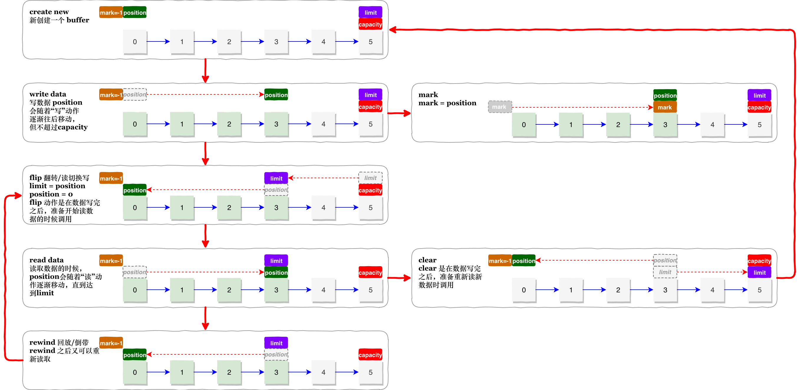

A container for data of a specific primitive type.
一个基本数据类型数据的容器

A buffer is a linear, finite sequence of elements of a specific primitive type. Aside from its content, the essential properties of a buffer are its capacity, limit, and position:
一个 buffer 是一个线性的、有限的特定基本数据类型元素的序列。除了它的内容，buffer 的基本属性包含它的 capacity、limit、position

* A buffer's `capacity` is the number of elements it contains. The capacity of a buffer is never negative and never changes.
buffer 的 capacity 是它包含的元素的数量，一个 buffer 的 capacity 是一个不会变化的正整数。

* A buffer's `limit` is the index of the first element that should not be read or written. A buffer's limit is never negative and is never greater than its capacity.
buffer 的 limit 是不会被读或者写操作的第一个元素，limit 属性是一个小于等于 capacity 的正整数。

* A buffer's `position` is the index of the next element to be read or written. A buffer's position is never negative and is never greater than its limit.
buffer 的 position 是读或者写操作将要操作的下一个元素，position 是一个小于或等于 limit 的正整数。

There is one subclass of this class for each non-boolean primitive type.
对于每个非布尔的基本数据类型，该类都有一个子类。

**Transferring data**

Each subclass of this class defines two categories of `get` and `put` operations:
该类的每一个子类都会定义 2类操作：get / put

* `Relative` operations read or write one or more elements starting at the current position and then increment the position by the number of elements transferred. If the requested transfer exceeds the limit then a relative `get` operation throws a `BufferUnderflowException` and a relative put operation throws a `BufferOverflowException`; in either case, no data is transferred.
“相对” 操作从当前 position 开始读或者写一个或者多个元素，并根据转移的元素的数量来增加 position。如果操作达到 limit 限制，那么“相对” 的get 操作或抛出 BufferUnderflowException、put 操作会抛出 BufferOverflowException，在这2种情况，都不会有数据被 transferred。

* `Absolute` operations take an explicit element index and do not affect the position. Absolute `get` and `put` operations throw an `IndexOutOfBoundsException` if the index argument exceeds the limit.
“绝对” 操作获取一个明确的元素位置并且不会影响 position。绝对操作在 get 或者 put 操作超过limit 的时候会抛出 IndexOutOfBoundsException 异常

Data may also, of course, be transferred in to or out of a buffer by the I/O operations of an appropriate channel, which are always relative to the current position.
当然，数据也可以通过适当通道的I/O操作传入或传出缓冲区，总是当前 position 的相对位置。

**Marking and resetting**

A buffer's `mark` is the index to which its position will be reset when the `reset` method is invoked. The mark is not always defined, but when it is defined it is never negative and is never greater than the `position`. If the `mark` is defined then it is discarded when the `position` or the `limit` is adjusted to a value smaller than the mark. If the mark is not defined then invoking the `reset` method causes an `InvalidMarkException` to be thrown.
一个 buffer 的 mark 是 position 在下一次 reset 方法被调用的时候，将会重置的点。mark 不一定总是已经被定义过了，但是一旦被指定，那么就必须是一个比 position 小的正整数。如果mark 已经被定义了，那么它将会在 position 或者 limit 调整到一个比它还小的数的时候被丢弃掉。如果 mark 没有被定义，那么调用invoke 方法将会抛出 InvalidMarkException 异常

**Invariants** 不变式

The following invariant holds for the mark, position, limit, and capacity values:
以下展示了几个字段的不变属性

​								$$0 <= mark <= position <= limit <= capacity$$

A newly-created buffer always has a position of zero and a mark that is undefined. The initial limit may be zero, or it may be some other value that depends upon the type of the buffer and the manner in which it is constructed. Each element of a newly-allocated buffer is initialized to zero.
一个新创建的 buffer，position总是位于0，并且 mark 是 undefined，初始化的 limit 可能是 0，也有可能是其他值，这依据于buffer 的类型和构造器的用法。每一个新分配的buffer的元素会被初始化未0.

**Clearing, flipping, and rewinding**

In addition to methods for accessing the position, limit, and capacity values and for marking and resetting, this class also defines the following operations upon buffers:
这个类还定义了下面的几个方法用来访问 position、limit、capacity，用于 marking 和 resetting

* `clear` makes a buffer ready for a new sequence of channel-read or relative put operations: It sets the limit to the capacity and the position to zero.
clear 方法让 buffer 为下一个序列的 channel-read 或者 relative put 操作做就绪准备：它设置 limit = capacity，position = zero。

* `flip` makes a buffer ready for a new sequence of channel-write or relative get operations: It sets the limit to the current position and then sets the position to zero.
flip 方法让 buffer 为下一个序列的 channel-write 或者 relative get 操作做就绪准备：它设置 limit = position，position = zero.

* `rewind` makes a buffer ready for re-reading the data that it already contains: It leaves the limit unchanged and sets the position to zero.
rewind 方法让 buffer 可以重复读取它包含的数据：它保持 limit 不变，并且设置 position = 0

**Read-only buffers**

Every buffer is readable, but not every buffer is writable. The mutation methods of each buffer class are specified as optional operations that will throw a ReadOnlyBufferException when invoked upon a read-only buffer. A read-only buffer does not allow its content to be changed, but its mark, position, and limit values are mutable. Whether or not a buffer is read-only may be determined by invoking its isReadOnly method.
每一个 buffer 都是可读的，但是并不是每一个buffer 都是可写的，每个buffer类的修改方法可以自行定义为直接抛异常，所以在调用 只读 buffer 的修改方法会抛出 ReadOnlyBufferException ,一个 read-only buffer 不允许内容发生变化，但是它的 mark、position、limit字段是可变的，可以通过调用 isReadOnly 方法来判断一个 buffer 是否是只读的。

**Thread safety**

Buffers are not safe for use by multiple concurrent threads. If a buffer is to be used by more than one thread then access to the buffer should be controlled by appropriate synchronization.
buffer 在多线程使用时是不安全的。如果需要在多线程间访问，需要适当的同步机制。

**Invocation chaining**

Methods in this class that do not otherwise have a value to return are specified to return the buffer upon which they are invoked. This allows method invocations to be chained; for example, the sequence of statements
这个类的不包含返回值的方法，会返回该对象本身。这允许方法链式调用；比如下面的语句

```
   b.flip();
   b.position(23);
   b.limit(42);
```

can be replaced by the single, more compact statement
可以替换为单个，更紧凑的语句
```
   b.flip().position(23).limit(42);
```