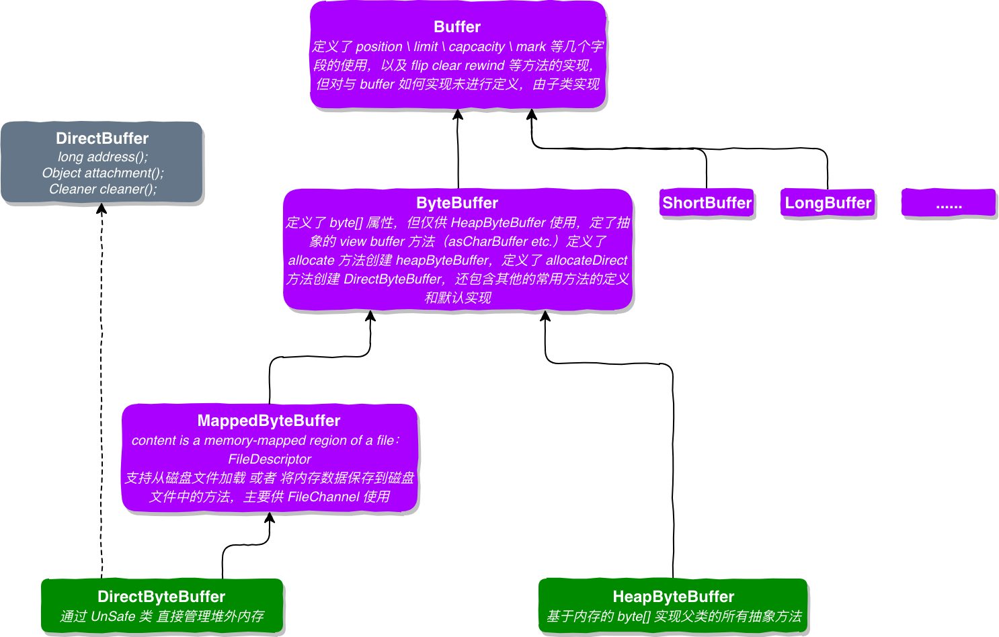

A byte buffer.
一个byte数组

This class defines six categories of operations upon byte buffers:
该类定义了6类方法用来操作 byte buffer

* Absolute and relative `get` and `put` methods that read and write single bytes;
绝对/相对的 get 和 put 方法用来读或者写单个 byte 
* Relative `bulk get` methods that transfer contiguous sequences of bytes from this buffer into an array;
相对的 “批量get "方法，传输连续的byte到一个数组里面去
* Relative `bulk put` methods that transfer contiguous sequences of bytes from a byte array or some other byte buffer into this buffer;
相对的 “批量put"方法，传输连续的byte数组或者其他byte buffer到当前的 byte buffer 里面去
* Absolute and relative `get` and `put` methods that read and write values of other primitive types, translating them to and from sequences of bytes in a particular byte order;
绝对或者相对的 get / put 方法读取或者写入一个其他的基本数据类型。从一个特定的 byte 顺序中转换或者读取。
* Methods for creating ***view buffers***, which allow a byte buffer to be viewed as a buffer containing values of some other primitive type; and
创建 "view buffer"的方法，允许一个 byte buffer 被看作为一个包含其他基本数据类型的buffer。
* Methods for `compacting`, `duplicating`, and `slicing` a byte buffer.
其他的 压缩，复制，拆分bytebuffer的方法。

Byte buffers can be created either by `allocation`, which allocates space for the buffer's content, or by `wrapping` an existing byte array into a buffer. 
byte buffer 既可以通过 allocation 方法分配buffer的内容并创建，或者 wrapping 方法来通过一个已经存在的byte 数组来创建 byte buffer

**Direct *vs.* non-direct buffers**  直接内存 buffer 或者 非直接内存buffer
A byte buffer is either *direct* or *non-direct*. Given a direct byte buffer, the Java virtual machine will make a best effort to perform native I/O operations directly upon it. That is, it will attempt to avoid copying the buffer's content to (or from) an intermediate buffer before (or after) each invocation of one of the underlying operating system's native I/O operations.
一个 byte buffer可以是 直接或者非直接的。对于一个 direct byte buffer，java 虚拟机将会尽最大努力直接在它上面执行 native I/O 操作。也就是说，在每次调用底层操作系统的一个本机I/O操作之前（或之后），它将尝试避免将缓冲区的内容复制到（或从）中间缓冲区。

A direct byte buffer may be created by invoking the `allocateDirect` factory method of this class. The buffers returned by this method typically have somewhat higher allocation and deallocation costs than non-direct buffers. **The contents of direct buffers may reside outside of the normal garbage-collected heap**, and so their impact upon the memory footprint of an application might not be obvious. It is therefore recommended that direct buffers be allocated primarily for large, long-lived buffers that are subject to the underlying system's native I/O operations. In general it is best to allocate direct buffers only when they yield a measureable gain in program performance.
一个 direct byte buffer 可以通过调用该类的 allocateDirect 工厂方法来创建。相比较 non-direct byffer，该方法创建direct buffer 通常会有更高的分配和回收开销。该 direct buffer 的内容不是放置在一般的垃圾回收的堆里面，因此他们对应用内存足迹的影响可能并不明显。因此，建议将直接缓冲区主要分配给受基础系统本机I/O操作的大型长期缓冲区。一般来说，最好只有当直接缓冲区在程序性能上产生可测量的收益时，才去分配直接缓冲区。

**A direct byte buffer may also be created by mapping a region of a file directly into memory**. An implementation of the Java platform may optionally support the creation of direct byte buffers from native code via JNI. If an instance of one of these kinds of buffers refers to an inaccessible region of memory then an attempt to access that region will not change the buffer's content and will cause an unspecified exception to be thrown either at the time of the access or at some later time.
直接字节缓冲区也可以通过将文件的一个区域直接映射到内存中来创建。Java平台的实现可以可选地支持通过JNI从本机代码创建直接字节缓冲区。如果这类缓冲区的一个实例引用了一个不可访问的内存区域，那么访问该区域的尝试将不会更改缓冲区的内容，并将导致在访问时或稍后某个时间引发未指定的异常。

Whether a byte buffer is direct or non-direct may be determined by invoking its `isDirect` method. This method is provided so that explicit buffer management can be done in performance-critical code. 
字节缓冲区是直接缓冲区还是非直接缓冲区可以通过调用其isDirect方法来确定。提供了这种方法，以便在性能关键的代码中进行显式缓冲区管理。

**Access to binary data**
This class defines methods for reading and writing values of all other primitive types, except boolean. Primitive values are translated to (or from) sequences of bytes according to the buffer's current byte order, which may be retrieved and modified via the `order` methods. Specific byte orders are represented by instances of the ByteOrder class. The initial order of a byte buffer is always BIG_ENDIAN.
此类定义了用于读取和写入除布尔值以外的所有其他基元类型的值的方法。根据缓冲区的当前byte顺序，将基本数据类型转换为（或从）byte 序列，这些字节顺序可以通过order方法进行检索和修改。特定的字节顺序由ByteOrder类的实例表示。字节缓冲区的初始顺序总是BIG_ENDIAN。

For access to heterogeneous binary data, that is, sequences of values of different types, this class defines a family of absolute and relative get and put methods for each type. For 32-bit floating-point values, for example, this class defines:
对于访问多种多样的二进制数据（即不同类型的值序列），该类为每种类型定义一系列绝对和相对的get和put方法。例如，对于32位浮点值，此类定义如下方法：

```
   float  getFloat()
   float  getFloat(int index)
   void  putFloat(float f)
   void  putFloat(int index, float f)
```

Corresponding methods are defined for the types char, short, int, long, and double. The index parameters of the absolute get and put methods are in terms of bytes rather than of the type being read or written. 
为char、short、int、long和double类型定义了相应的方法。绝对get和put方法的索引参数是以bytes为单位的，而不是以正在读取或写入的类型为单位的。

For access to homogeneous binary data, that is, sequences of values of the same type, this class defines methods that can create views of a given byte buffer. A view buffer is simply another buffer whose content is backed by the byte buffer. Changes to the byte buffer's content will be visible in the view buffer, and vice versa; the two buffers' position, limit, and mark values are independent. The `asFloatBuffer` method, for example, creates an instance of the FloatBuffer class that is backed by the byte buffer upon which the method is invoked. Corresponding view-creation methods are defined for the types char, short, int, long, and double.
对于对不同的二进制数据的访问, 即连续的相同数据类型的数据序列，该类定义可以创建给定字节缓冲区视图的方法。视图缓冲区只是另一个内容由当前byte buffer支持的缓冲区。对byte buffer内容的更改将在view buffer中可见，反之亦然；两个缓冲区的position、limit和mark是独立的。例如，asFloatBuffer方法会创建由当前byte buffer 所支持的FloatBuffer类的实例。为char、short、int、long和double类型定义了相应的视图创建方法。

View buffers have three important advantages over the families of type-specific `get` and `put` methods described above:
与上面描述的特定于类型的get和put方法相比，视图缓冲区有三个重要的优势：

* A view buffer is indexed not in terms of bytes but rather in terms of the type-specific size of its values;
  视图缓冲区不是按字节索引的，而是按其值的类型特定大小索引的；

* A view buffer provides relative `bulk get` and `put` methods that can transfer contiguous sequences of values between a buffer and an array or some other buffer of the same type; and
视图缓冲区提供了相对批量的get和put方法，这些方法可以在缓冲区和数组或其他相同类型的缓冲区之间传输连续的值序列；以及

* A view buffer is potentially much more efficient because it will be direct if, and only if, its backing byte buffer is direct.
视图缓冲区的效率可能更高，因为只有当其支持字节缓冲区是直接的时，它才是直接的。

The byte order of a view buffer is fixed to be that of its byte buffer at the time that the view is created.
视图缓冲区的字节顺序固定为创建视图时其字节缓冲区的字节顺序。

**Invocation chaining**
Methods in this class that do not otherwise have a value to return are specified to return the buffer upon which they are invoked. This allows method invocations to be chained. The sequence of statements

```
   bb.putInt(0xCAFEBABE);
   bb.putShort(3);
   bb.putShort(45);
```

can, for example, be replaced by the single statement

```
   bb.putInt(0xCAFEBABE).putShort(3).putShort(45);
```

