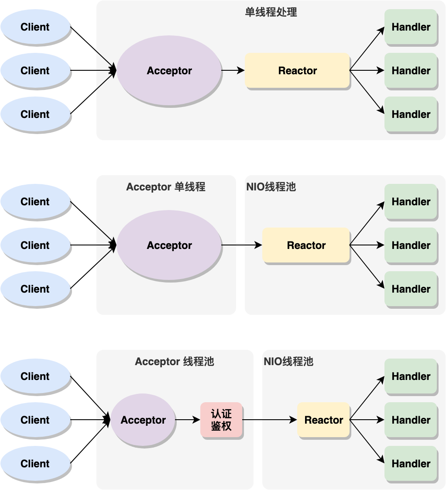

# IO模型简介

* 同步阻塞IO（Blocking IO）：即传统的IO模型。
* 同步非阻塞IO（Non-blocking IO）：默认创建的socket都是阻塞的，非阻塞IO要求socket被设置为NONBLOCK。**注意这里所说的NIO并非Java的NIO（New IO）库**。
* 多路复用IO（IO Multiplexing）：即经典的Reactor设计模式，有时也称为异步阻塞IO，**Java中的Selector和Linux中的epoll都是这种模型。**
* 异步IO（Asynchronous IO）：即经典的Proactor设计模式，也称为异步非阻塞IO。

这里重点介绍**多路复用IO模型**（<u>JAVA NIO就是采用此模式</u>）

　　*在多路复用IO模型中，会有一个线程（Java中的Selector）不断去轮询多个socket的状态，只有当socket真正有读写事件时，才真正调用实际的IO读写操作。因为在多路复用IO模型中，只需要使用一个线程就可以管理多个socket，系统不需要建立新的进程或者线程，也不必维护这些线程和进程，并且只有在真正有socket读写事件进行时，才会使用IO资源，所以它大大减少了资源占用。*

# Reactor模式的实现方式

**IO多路复用模型使用了Reactor设计模式实现了这一机制。Reactor模式有三种实现方式：**

## Reactor单线程-图1

每个客户端发起连接请求都会交给 acceptor,acceptor 根据事件类型交给线程 handler 处理，注意 acceptor 处理和 handler 处理都在一个线程中处理，所以其中某个 handler 阻塞时, 会导致其他所有的 client 的 handler 都得不到执行, 并且更严重的是, handler 的阻塞也会导致整个服务不能接收新的 client 请求(因为 acceptor 也被阻塞了). 因为有这么多的缺陷, 因此单线程Reactor 模型用的比较少.

## Reactor多线程模式-图2

有专门一个线程, 即 Acceptor 线程用于监听客户端的TCP连接请求.

客户端连接的 IO 操作都是由一个特定的 NIO 线程池负责. 每个客户端连接都与一个特定的 NIO 线程绑定, 因此在这个客户端连接中的所有 IO 操作都是在同一个线程中完成的.

客户端连接有很多, 但是 NIO 线程数是比较少的, 因此一个 NIO 线程可以同时绑定到多个客户端连接中.

缺点：如果我们的服务器需要同时处理大量的客户端连接请求或我们需要在客户端连接时, 进行一些权限的检查, 那么单线程的 Acceptor 很有可能就处理不过来, 造成了大量的客户端不能连接到服务器.

## Reactor主从模式-图3

Reactor 的主从多线程模型和 Reactor 多线程模型很类似, 只不过 Reactor 的主从多线程模型的 acceptor 使用了线程池来处理大量的客户端请求.

# NIO如何实现 Reactor 模式呢？

Acceptor 负责处理 ServerSocketChannel 绑定到 Selector 上时的 accept 事件，事件触发时，获取对应的 SocketChannel 在注册到 Selector 上，SelectableChannel 在注册到 Selector 上时，将 Event 触发时的处理器 Handler 作为 attachement 绑定到 SelectionKey 上，Event 触发时，直接获取该 Handler 进行时间处理即可。