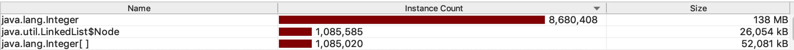
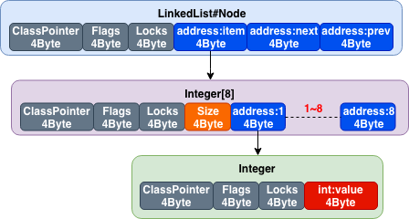

首先通过 java 程序开始来创建一个dump 文件，具体代码如下

```java
public class DumpOOM {
    public static void main(String[] args) {
        LinkedList<Integer[]> l = new LinkedList<>();
        int i = 128, x = 0;

        try {
            while (++x > 0) {
                // 8 + 8 + 8 + 8 + 4 * 8 = 64Byte  ?  200Byte
                l.add(new Integer[]{i++, i++, i++, i++, i++, i++, i++, i++});
                System.out.println(l.size());
            }
        } finally {
            System.out.println("x " + x);
            System.out.println("l " + l.size());
        }
    }
}
```

我们添加如下启动参数设置

**-Xms256m -Xmx256m -Xmn192m -Xss256k -XX:+HeapDumpOnOutOfMemoryError -XX:HeapDumpPath=/data/www/temp -XX:+PrintGC -XX:+PrintGCDetails -XX:+PrintHeapAtGC -Xloggc:/data/www/temp/gc.log**

最终输出结果：

> 1085018
> **1085019**
> java.lang.OutOfMemoryError: **GC overhead limit exceeded**
> **Dumping heap to /data/www/temp/java_pid6688.hprof ...**
> Heap dump file created [403322883 bytes in 3.131 secs]
> x 1085020
> l 1085019
> **Exception in thread "main" java.lang.OutOfMemoryError: GC overhead limit exceeded**
> 	at com.noob.storage.DumpOOM.main(DumpOOM.java:18)

分析：

初步看是 GC 的开销超过限制导致 OOM，这里是 jvm 的一个保护机制：
官方的解释： **超过98%的时间用来做GC并且回收了不到2%的堆内存时会抛出此异常**

> Exception in thread thread_name: java.lang.OutOfMemoryError: GC Overhead limit exceeded
>
Cause: The detail message "GC overhead limit exceeded" indicates that the garbage collector is running all the time and Java program is making very slow progress. After a garbage collection, **if the Java process is spending more than approximately 98% of its time doing garbage collection and if it is recovering less than 2% of the heap and has been doing so far the last 5 (compile time constant) consecutive garbage collections, then a `java.lang.OutOfMemoryError` is thrown**. This exception is typically thrown because the amount of live data barely fits into the Java heap having little free space for new allocations.
>
Action: Increase the heap size. The `java.lang.OutOfMemoryError` exception for **GC Overhead limit exceeded** can be turned off with the command line flag `-XX:-UseGCOverheadLimit`.

我们再看一下gc 的日志：

> {Heap **before** GC invocations=29 (full 28):
>  **PSYoungGen**      total 172032K, used 147455K [0x00000007b4000000, 0x00000007c0000000, 0x00000007c0000000)
>   **eden space 147456K, 99% used** [0x00000007b4000000,0x00000007bcfffff8,0x00000007bd000000)
>   from space 24576K, 0% used [0x00000007bd000000,0x00000007bd000000,0x00000007be800000)
>   to   space 24576K, 0% used [0x00000007be800000,0x00000007be800000,0x00000007c0000000)
>  **ParOldGen**       total 65536K, used 65443K [0x00000007b0000000, 0x00000007b4000000, 0x00000007b4000000)
>   **object space 65536K, 99% used** [0x00000007b0000000,0x00000007b3fe8e60,0x00000007b4000000)
>  Metaspace       used 3662K, capacity 4540K, committed 4864K, reserved 1056768K
>   class space    used 397K, capacity 428K, committed 512K, reserved 1048576K
> 24.411: [Full GC (Ergonomics) [PSYoungGen: 147455K->147455K(172032K)] [ParOldGen: 65443K->65442K(65536K)] 212899K->212898K(237568K), [Metaspace: 3662K->3662K(1056768K)], 0.4892049 secs] [Times: user=1.68 sys=0.00, real=0.49 secs] 
> Heap **after** GC invocations=29 (full 28):
>  **PSYoungGen**      total 172032K, used 147455K [0x00000007b4000000, 0x00000007c0000000, 0x00000007c0000000)
>   **eden space 147456K, 99% used** [0x00000007b4000000,0x00000007bcfffff8,0x00000007bd000000)
>   from space 24576K, 0% used [0x00000007bd000000,0x00000007bd000000,0x00000007be800000)
>   to   space 24576K, 0% used [0x00000007be800000,0x00000007be800000,0x00000007c0000000)
>  **ParOldGen**       total 65536K, used 65442K [0x00000007b0000000, 0x00000007b4000000, 0x00000007b4000000)
>   **object space 65536K, 99% used** [0x00000007b0000000,0x00000007b3fe8b68,0x00000007b4000000)
>  Metaspace       used 3662K, capacity 4540K, committed 4864K, reserved 1056768K
>   class space    used 397K, capacity 428K, committed 512K, reserved 1048576K
> }

可以看到，再后续大部分full gc时，基本没有回收空间，而且这个时候，新生代的 eden space 已经 99% 满了，而且 ParOldGen 也已经满容量了，这2部分加在一起大概  147456K:144M + 65536K:64M  ~ 208M   已经全部满容量了。剩余 24M * 2 (<u>**6:1:1**</u>)还空的是 YoungGen 的 from space 与 to space。我们在看控制台最后输出的数字 1085019 表示总共产生了这么多对象   1085019 * 64 / 1024 ~ 66M 

再通过 Jprofiler 解析 hprof **(heap Profile)**文件, 分析内存使用情况如下



当前机器 64 位
经过计算
一个 Integer 耗费 16 个字节:    ClassPointer:4 + Flags:4 + Locks:4 + int: 4 = 16
一个 Integer[] 耗费 48 个字节:  ClassPointer:4 + Flags:4 + Locks:4 + Size:4 + address: 4\*8 = 48

经过分析，一个地址只占用了 4个字节，但是我们用的是 64 位操作系统，这是由于 jvm 默认开启了[指针压缩](./Jvm指针压缩.md)，将 64 位地址压缩成 32 位来存储。



