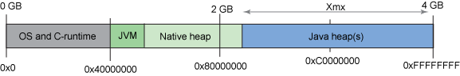
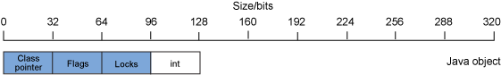
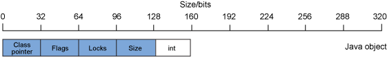
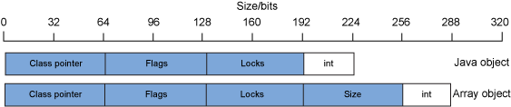

# Java 进程的内存使用

当运行一个Java应用程序时，Java 运行时会创建一个操作系统进程，作为操作系统进程，Java 运行时面临着与其他进程完全相同的内存限制
架构提供的内存寻址能力依赖于处理器的位数，举例来说，32位或者64位进程能够处理的位数决定了处理器能寻址的内存范围：32 位提供了 $$2^{32}$$ 的可寻址范围，也就是 4,294,967,296 位，或者说 4GB。而 64 位处理器的可寻址范围明显增大：$$2^{64}$$，也就是 18,446,744,073,709,551,616。

OS 和 C 运行时占用的内存数量取决于所用的 OS，但通常数量较大: Windows 默认占用的内存是2GB。剩余的可寻址空间就是可供运行的实际进程使用的内存。

对于 Java 应用程序，**用户空间是 Java 进程占用的内存**，实际上包含两个池：Java 堆和本机（非 Java，堆外内存）堆。Java 堆的大小由  JVM 的 Java 堆设置控制：-Xms 和 -Xmx 分别设置最小和最大 Java 堆。在按照最大的大小设置分配了 Java 堆之后，剩下的用户空间就是本机堆。下面展示了一个 32 位 Java 进程的内存布局

可寻址范围总共有 4GB，OS 和 C 运行时大约占用了其中的 1GB，Java 堆占用了将近 2GB，本机堆占用了其他部分。请注意，JVM 本身也要占用内存，就像 OS 内核和 C 运行时一样，而 JVM 占用的内存是本机堆的子集。

# Java 对象内存使用情况

Java 代码使用 new 操作符创建一个 Java 对象的实例时，实际上分配的数据要比想的多得多。例如，一个 int 值与一个 Integer 对象的大小比率是 1:4. 额外的开销源于 JVM 用于描述 Java 对象的元数据，其中通常包括：

* **类**：一个指向类信息的指针，描述了对象类型。举例来说，对于 java.lang.Integer 对象，这是 java.lang.Integer 类的一个指针。
* **标记**：一组标记，描述了对象的状态，包括对象的散列码（如果有），以及对象的形状（也就是说，对象是否是数组）。
* **锁**：对象的同步信息，也就是说，对象目前是否正在同步。
* **对象数据**：包括对象实例中存储的字段。对于 java.lang.Integer 对象，这就是一个 int。

果您正在运行一个 32 位 JVM，那么在创建 java.lang.Integer 对象实例时，对象的布局可能如图

有 128 位的数据被占用，其中用于存储 int 值的为 32 位，而对象元数据占用了其余的 96 位。

# Java 数组对象内存使用情况

数组对象（例如一个 int 值数组）的形状和结构与标准 Java 对象相似。<u>主要差别在于数组对象包含说明**数组大小**的额外元数据</u>。
因此，数据对象的元数据包括：

* **类**：一个指向类信息的指针，描述了对象类型。举例来说，对于 int 字段数组，这是 int[] 类的一个指针。
* **标记**：一组标记，描述了对象的状态，包括对象的散列码（如果有），以及对象的形状（也就是说，对象是否是数组）。
* **锁**：对象的同步信息，也就是说，对象目前是否正在同步。
* **大小：数组的大小。**

int 数组对象的布局示例

有 160 位的数据用于存储 int 值内的 32 位数据，而数组元数据占用了其余 160 位。

# 比较 32 位和 64 位 Java 对象内存使用情况

64 位处理器的内存可寻址能力比 32 位处理器高得多。对于 64 位进程，Java 对象中的某些数据字段的大小（特别是对象元数据)也需要增加到 64 位。其他数据字段类型（例如 int、byte 和 long ）的大小不会更改。

一个 64 位进程的 java.lang.Integer 对象和 int 数组 的布局示例

对于一个 64 位 Integer 对象，现在有 224 位的数据用于存储 int 字段所用的 32 位，开销比例是 7:1。对于一个 64 位单元素 int 数组，有 288 位的数据用于存储 32 位 int 条目，开销比例是 9:1。在 32 位 Java 运行时中运行的应用程序若迁移到 64 位 Java 运行时，其 Java 堆内存使用量会显著增加。通常情况下，增加的数量是原始堆大小的 70% 左右。

一个在 32 位 Java 运行时中使用 1GB Java 堆的 Java 应用程序在迁移到 64 位 Java 运行时之后，通常需要使用 1.7GB 的 Java 堆。请注意，这种内存增加并非仅限于 Java 堆。本机堆内存区使用量也会增加，有时甚至要增加 90% 之多。

# Java 集合的内存使用

大量数据都是使用核心 Java API 提供的标准 Java Collections 类来存储和管理的。非常有必要了解各集合提供的功能以及相关的内存开销。总体而言，集合功能的级别越高，内存开销就越高，
其中部分最常用的集合内存开销如下：

| **集合**         | **算法复杂度** | **默认容量** | **空时的大小** | **10K 条目的开销** | **准确设置大小？** | **扩展算法** |
| ---------------- | -------------- | ------------ | -------------- | ------------------ | ------------------ | ------------ |
| **HashSet**      | 同HashMap      | 16           | 144            | 360K               | 否                 | x2           |
| **HashMap**      | O(1+n)         | 16           | 128            | 360K               | 否                 | x2           |
| **Hashtable**    | O(1+n)         | 11           | 104            | 360K               | 否                 | x2+1         |
| **LinkedList**   | O(n)           | 1            | 48             | 240K               | 是                 | +1           |
| **ArrayList**    | O(n)           | 10           | 88             | 40K                | 否                 | x1.5         |
| **StringBuffer** | O(1)           | 16           | 72             | 24                 | 否                 | x2           |

Hash 集合的性能比任何 List 的性能都要高，但每条目的成本也要更高。对于并不那么注重访问性能的较小集合而言，List 则是合理的选择。ArrayList 和 LinkedList 集合的性能大体相同，但其内存占用完全不同：ArrayList 的每条目大小要比 LinkedList 小得多，但它不是准确设置大小的。List 要使用的正确实现是 ArrayList 还是 LinkedList 取决于 List 长度的可预测性。如果长度未知，那么正确的选择可能是 LinkedList，因为集合包含的空白空间更少。如果大小已知，那么 ArrayList 的内存开销会更低一些。