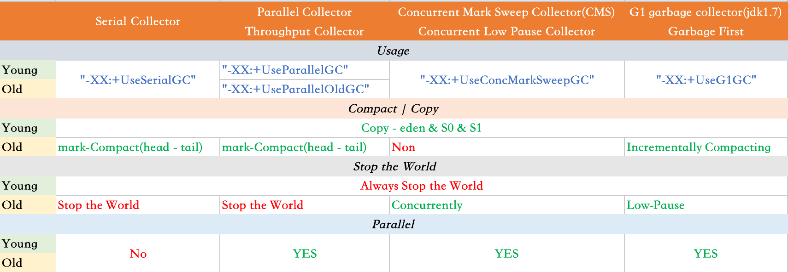
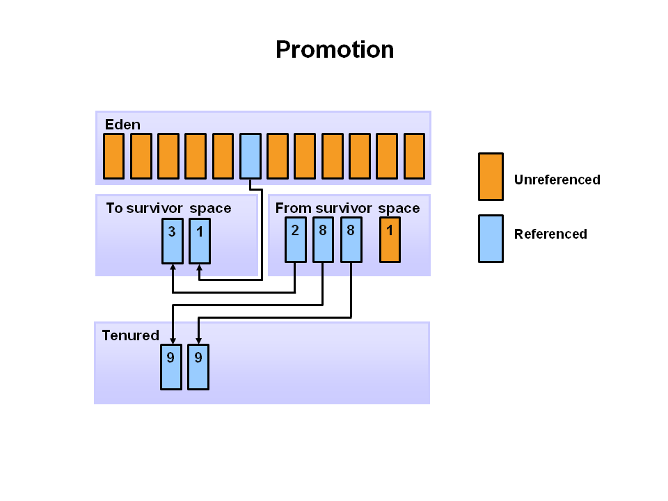

参考资料：

[Java Garbage Collection Basics](https://www.oracle.com/webfolder/technetwork/tutorials/obe/java/gc01/index.html)

[Java Platform, Standard Edition HotSpot Virtual Machine Garbage Collection Tuning Guide](https://docs.oracle.com/javase/10/gctuning/introduction-garbage-collection-tuning.htm#JSGCT-GUID-326EB4CF-8C8C-4267-8355-21AB04F0D304)

#### Key Hotspot Components

The key components of the JVM that relate to performance are highlighted in the following image.

There are three components of the JVM that are focused on when tuning performance. The *heap* is where your object data is stored. This area is then managed by the garbage collector selected at startup. Most tuning options relate to sizing the heap and choosing the most appropriate garbage collector for your situation. The JIT compiler also has a big impact on performance but rarely requires tuning with the newer versions of the JVM.

### Performance Basics

Typically, when tuning a Java application, the focus is on one of two main goals: responsiveness or throughput. We will refer back to these concepts as the tutorial progresses.

#### Responsiveness

Responsiveness refers to how quickly an application or system responds with a requested piece of data. Examples include:

- How quickly a desktop UI responds to an event
- How fast a website returns a page
- How fast a database query is returned

For applications that focus on responsiveness, large pause times are not acceptable. The focus is on responding in short periods of time.

#### Throughput

Throughput focuses on maximizing the amount of work by an application in a specific period of time. Examples of how throughput might be measured include:

- The number of transactions completed in a given time.
- The number of jobs that a batch program can complete in an hour.
- The number of database queries that can be completed in an hour.

High pause times are acceptable for applications that focus on throughput. Since high throughput applications focus on benchmarks over longer periods of time, quick response time is not a consideration.

### What is Automatic Garbage Collection?

Automatic garbage collection is the process of looking at heap memory, identifying which objects are in use and which are not, and deleting the unused objects. An in use object, or a referenced object, means that some part of your program still maintains a pointer to that object. An unused object, or unreferenced object, is no longer referenced by any part of your program. So the memory used by an unreferenced object can be reclaimed.

In a programming language like C, allocating and deallocating memory is a manual process. In Java, process of deallocating memory is handled automatically by the garbage collector. The basic process can be described as follows.

#### Step 1: Marking

The first step in the process is called marking. This is where the garbage collector identifies which pieces of memory are in use and which are not

Referenced objects are shown in blue. Unreferenced objects are shown in gold. All objects are scanned in the marking phase to make this determination. This can be a very time consuming process`非常耗时的过程` if all objects in a system must be scanned.

#### Step 2: Normal Deletion

Normal deletion removes unreferenced objects leaving referenced objects and pointers to free space.

The **memory allocator** holds references to blocks of free space where new object can be allocated.

#### Step 2a: Deletion with Compacting

**To further improve performance, in addition to deleting unreferenced objects, you can also compact the remaining referenced objects. By moving referenced object together, this makes new memory allocation much easier and faster.**

#### Why Generational Garbage Collection?

As stated earlier, having to mark and compact all the objects in a JVM is inefficient`效率低下的`. As more and more objects are allocated, the list of objects grows and grows leading to longer and longer garbage collection time. However, empirical`经验性的` analysis of applications has shown that **most objects are short lived.**

> Here is an example of such data. The Y axis`轴` shows the number of bytes allocated and the X access shows the number of bytes allocated over time.
>
> 

As you can see, fewer and fewer objects remain allocated over time`随着时间流逝`. In fact most objects have a very short life as shown by the higher values on the left side of the graph.

#### JVM Generations

The information learned from the object allocation behavior can be used to enhance the performance of the JVM. Therefore, the heap is broken up into smaller parts or generations. The heap parts are: Young Generation, Old or Tenured Generation, and Permanent Generation

The **Young Generation** is where all new objects are allocated and aged. When the young generation fills up, this causes a **minor garbage collection**. Minor collections can be optimized assuming`假设` a high object mortality rate`死亡率`. A young generation full of dead objects is collected very quickly. Some surviving objects are aged`老化` and eventually move to the old generation.

**Stop the World Event** - All minor garbage collections are "Stop the World" events. This means that all application threads are stopped until the operation completes. **Minor garbage collections are *<u>always</u>* Stop the World events.**

The **Old Generation** is used to store long surviving objects. Typically, a *threshold* is set for young generation object and when that *age* is met, the object gets moved to the old generation. Eventually the old generation needs to be collected. This event is called a **major garbage collection**.

Major garbage collection are also Stop the World events. <u>Often a major collection is much slower because it involves all live objects</u>. So for Responsive applications, major garbage collections should be minimized. Also note, that <u>**the length of the Stop the World event** for a major garbage collection is affected by`受到影响` the kind of garbage collector that is used for the old generation space.</u>

The **Permanent`永久的` generation** contains metadata required by the JVM to describe the classes and methods used in the application. The permanent generation is populated by`被填充` the JVM at runtime based on classes in use by the application. In addition, Java SE library classes and methods may be stored here.

Classes may get collected (unloaded) if the JVM finds they are no longer needed and space may be needed for other classes. The permanent generation is included in a full garbage collection.

参考文档：[Tuning GC with JVM 5 - Section 3 Generations](http://www.oracle.com/technetwork/java/gc-tuning-5-138395.html)

##  The Generational Garbage Collection Process

Now that you understand why the heap is separted into different generations, it is time to look at how exactly these spaces interact. The pictures that follow walks through the object allocation and aging process in the JVM.

1. First, any new objects are allocated to the eden space. Both survivor spaces start out`起初是` empty.

   

2. When the eden space fills up, a minor garbage collection is triggered.

   

   

3. Referenced objects are moved to the first survivor space. Unreferenced objects are deleted when the eden space is cleared.

   

4. At the next minor GC, the same thing happens for the eden space. Unreferenced objects are deleted and referenced objects are moved to a survivor space. However, in this case, they are moved to the second survivor space (S1). In addition, objects from the last minor GC on the first survivor space (S0) have their age incremented and get moved to S1. Once all surviving objects have been moved to S1, both S0 and eden are cleared. Notice we now have differently aged object in the survivor space.

   

5. At the next minor GC, the same process repeats. However this time the survivor spaces switch. Referenced objects are moved to S0. Surviving objects are aged. Eden and S1 are cleared.

   

6. This slide demonstrates promotion`这个图片演示升级过程`. After a minor GC, when aged objects reach a certain age threshold (8 in this example) they are promoted`升级` from young generation to old generation.

   

7. As minor GCs continue to occure`持续出现` objects will continue to be promoted to the old generation space.

   

8. So that pretty much covers`几乎涵盖` the entire process with the young generation. Eventually`最终`, a major GC will be performed on the old generation which cleans up and compacts that space.

   

##  Java Garbage Collectors

You now know the basics of garbage collection and have observed the garbage collector in action on a sample application. In this section, you will learn about the garbage collectors available for Java and the command line switches you need to select them.

### Common Heap Related Switches

There are many different command line switches that can be used with Java. This section describes some of the more commonly used switches that are also used in this OBE.

| **Switch**      | **Description**                                     |
| --------------- | --------------------------------------------------- |
| `-Xms`          | Sets the initial heap size for when the JVM starts. |
| `-Xmx`          | Sets the maximum heap size.                         |
| `-Xmn`          | Sets the size of the Young Generation.              |
| -XX:PermSize    | Sets the starting size of the Permanent Generation. |
| -XX:MaxPermSize | Sets the maximum size of the Permanent Generation   |

### The Serial GC

The **serial collector** is the default for client style machines in Java SE 5 and 6. With the serial collector, **both minor and major garbage collections are done serially (using a single virtual CPU)**. In addition, it **uses a mark-compact collection method**. <u>This method moves older memory to the beginning of the heap so that new memory allocations are made into a single continuous chunk of memory`连续的内存块` at the end of the heap. This compacting of memory makes it faster to allocate new chunks of memory to the heap.</u>

#### Usage Cases

The Serial GC is the garbage collector of choice for most applications that do not have low pause time requirements and run on client-style machines. It takes advantage of only a single virtual processor for garbage collection work (therefore, its name). Still, on today's hardware, the Serial GC can efficiently manage a lot of non-trivial applications with a few hundred MBs of Java heap, with relatively short worst-case pauses (around a couple of seconds for full garbage collections).

<u>Another popular use for the Serial GC is in environments where a high number of JVMs are run on the same machine (in some cases, **more JVMs than available processors**!). In such environments when a JVM does a garbage collection it is better to use only one processor to minimize the interference on the remaining JVMs, even if the garbage collection might last longer. And the Serial GC fits this trade-off nicely.</u>

Finally, with the proliferation`激增` of embedded`嵌入式` hardware with minimal memory and few cores, the Serial GC could make a comeback.

#### Command Line Switches

To enable the Serial Collector use:
    `-XX:+UseSerialGC`

Here is a sample command line for starting the `Java2Demo`:
    `java -Xmx12m -Xms3m -Xmn1m -XX:PermSize=20m -XX:MaxPermSize=20m -XX:+UseSerialGC -jar c:\javademos\demo\jfc\Java2D\Java2demo.jar`

### The Parallel GC

**The parallel garbage collector uses multiple threads to <u>perform the young genertion</u> garbage collection**. By default on a host with N CPUs, the parallel garbage collector uses N garbage collector threads in the collection. The number of garbage collector threads can be controlled with command-line options:
    `-XX:ParallelGCThreads=<desired number>`

On a host with a single CPU the default garbage collector is used even if the parallel garbage collector has been requested. On a host with two CPUs the parallel garbage collector generally performs as well as`通常作为` the default garbage collector and a reduction`减少` in the young generation garbage collector pause times can be expected on hosts with more than two CPUs. The Parallel GC comes in two flavors`特色`.

#### Usage Cases

The Parallel collector is also called a **throughput collector**. Since it can use multilple CPUs to speed up application throughput. <u>This collector should be used when a lot of work need to be done and long pauses are acceptable</u>. For example, batch processing like printing reports or bills or performing a large number of database queries.

#### `-XX:+UseParallelGC`

With this command line option you get a multi-thread young generation collector with a single-threaded old generation collector. The option also does single-threaded compaction of old generation.

Here is a sample command line for starting the `Java2Demo`:
    `java -Xmx12m -Xms3m -Xmn1m -XX:PermSize=20m -XX:MaxPermSize=20m -XX:+UseParallelGC -jar c:\javademos\demo\jfc\Java2D\Java2demo.jar`

#### `-XX:+UseParallelOldGC`

<u>With the `-XX:+UseParallelOldGC` option, the GC is both a multithreaded young generation collector and multithreaded old generation collector. It is also a multithreaded compacting collector. HotSpot does compaction only in the old generation. Young generation in HotSpot is considered a copy collector; therefore, there is no need for compaction.</u>

**<u>Compacting</u> describes the act of moving objects in a way that there are no holes between objects. After a garbage collection sweep`清理`, there may be holes left between live objects. Compacting moves objects so that there are no remaining holes. It is possible that a garbage collector be a non-compacting collector. Therefore, the difference between a parallel collector and a parallel compacting collector could be the latter compacts the space after a garbage collection sweep. The former would not.**

Here is a sample command line for starting the `Java2Demo`:
    `java -Xmx12m -Xms3m -Xmn1m -XX:PermSize=20m -XX:MaxPermSize=20m -XX:+UseParallelOldGC -jar c:\javademos\demo\jfc\Java2D\Java2demo.jar`

### The Concurrent Mark Sweep (CMS) Collector

The Concurrent Mark Sweep (CMS) collector (also referred to as the concurrent low pause collector) collects the tenured generation. **It attempts to minimize the pauses due to garbage collection by doing most of the garbage collection work concurrently with the application threads**. Normally the concurrent low pause collector **does not copy or compact the live objects**. <u>A garbage collection is done without moving the live objects. If fragmentation`碎片化` becomes a problem, allocate a larger heap.</u>

**Note:** <u>CMS collector on young generation uses the same algorithm as that of the parallel collector.</u>

#### Usage Cases

The CMS collector should **be used for applications that require low pause times and can share resources with the garbage collector**. Examples include desktop UI application that respond to events, a webserver responding to a request or a database responding to queries.

#### Command Line Switches

To enable the CMS Collector use:
    `-XX:+UseConcMarkSweepGC`
    and to set the number of threads use:
    `-XX:ParallelCMSThreads=<n>`

Here is a sample command line for starting the `Java2Demo`:
    `java -Xmx12m -Xms3m -Xmn1m -XX:PermSize=20m -XX:MaxPermSize=20m -XX:+UseConcMarkSweepGC -XX:ParallelCMSThreads=2 -jar c:\javademos\demo\jfc\Java2D\Java2demo.jar`

### The G1 Garbage Collector

The *Garbage First* or *G1 garbage collector* is available in Java 7 and is designed to be the long term replacement for the CMS collector`CMS收集器的长期替换版本`. The G1 collector is a parallel, concurrent, and incrementally compacting low-pause garbage collector that has quite a different layout from the other garbage collectors described previously. However, detailed discussion is beyond the scope of this OBE.

#### Command Line Switches

To enable the G1 Collector use:
    `-XX:+UseG1GC`

Here is a sample command line for starting the `Java2Demo`:
    `java -Xmx12m -Xms3m -XX:+UseG1GC -jar c:\javademos\demo\jfc\Java2D\Java2demo.jar`