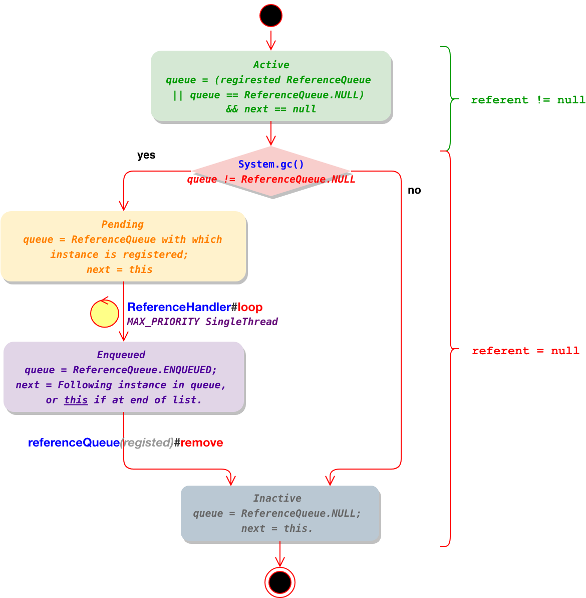

# Reference

Abstract base class for reference objects. This class defines the operations common to all reference objects. Because reference objects are implemented in close cooperation with the garbage collector, this class may not be subclassed directly.
reference 对象的抽象基类，这个类定义了所有reference对象的公共操作。由于reference对象是与垃圾收集器密切合作来进行实现的，所以这个类可能不能直接实现子类

### Reference's algo

A Reference instance is in one of four possible internal states: 
一个引用对象可能处于一下四种内部状态

* Active: Subject to special treatment by the garbage collector. Some time after the collector detects that the reachability of the referent has changed to the appropriate state, it changes the instance's state to either Pending or Inactive, depending upon whether or not the instance was registered with a queue when it was created. In the former case it also adds the instance to the pending-Reference list. Newly-created instances are Active. 
活动：服从垃圾收集器的特殊处理。在收集器检测到引用的可到达性已更改为适当状态后的一段时间，它将实例的状态更改为Pending或Inactive，这取决于创建实例时该实例是否已在队列中注册。在前一种情况下，它还将实例添加到挂起的引用列表中。新创建的实例处于活动状态。

* Pending: An element of the pending-Reference list, waiting to be enqueued by the Reference-handler thread. Unregistered instances are never in this state. 
挂起：pending-Reference列表中的一个元素，等待被Reference-handler线程入队。未注册的实例永远不会进入这个状态。

* Enqueued: An element of the queue with which the instance was registered when it was created. When an instance is removed from its ReferenceQueue, it is made Inactive. Unregistered instances are never in this state. 
排队：在实例创建的时候注册的队列里面的一个元素。当一个实例从他的ReferenceQueue中移除后，就会变成Inactive。未注册的实例永远不会进入这个状态。

* Inactive: Nothing more to do. Once an instance becomes Inactive its state will never change again. 
不活动：一旦一个实例变成Inactive之后，他的状态再也不会发生变化。

The **state is encoded in the *queue* and *next* fields** as follows: 
state 是通过 queue 和 next 属性来进行编码的
* Active: queue = ReferenceQueue with which instance is registered, or ReferenceQueue.NULL if it was not registered with a queue; next = null. 
* Pending: queue = ReferenceQueue with which instance is registered; next = this 
* Enqueued: queue = ReferenceQueue.ENQUEUED; next = Following instance in queue, or this if at end of list. 
* Inactive: queue = ReferenceQueue.NULL; next = this. 
With this scheme the collector need only examine the next field in order to determine whether a Reference instance requires special treatment: If the next field is null then the instance is active; if it is non-null, then the collector should treat the instance normally. 



To ensure that a concurrent collector can discover active Reference objects without interfering with application threads that may apply the enqueue() method to those objects, collectors should link discovered objects through the discovered field. The discovered field is also used for linking Reference objects in the pending list
为了保证一个并行垃圾收集器能够在不干涉那些正在申请这个对象的enqueue()方法的应用线程的情况下发现这个处理 Active状态的Reference对象，收集器需要通过discovered属性来关联已经发现的对象。这个discovered属性也常用来关联 pending 列表中的Reference对象。

###  source code

```java
// referent 与 queue 属性，按照上面的状态图，共同组成了 reference object 的状态
private T referent;         /* Treated specially by GC */

volatile ReferenceQueue<? super T> queue;

/* When active:   NULL
 *     pending:   this
 *    Enqueued:   next reference in queue (or this if last)
 *    Inactive:   this
 */
@SuppressWarnings("rawtypes")
volatile Reference next;

/* When active:   next element in a discovered reference list maintained by GC (or this if last)
 *     pending:   next element in the pending list (or null if last) 重点，当入pending队列时，这里指向下一个元素
 *   otherwise:   NULL
 */
transient private Reference<T> discovered;  /* used by VM */ 


/* Object used to synchronize with the garbage collector.  The collector
 * must acquire this lock at the beginning of each collection cycle.  It is
 * therefore critical that any code holding this lock complete as quickly
 * as possible, allocate no new objects, and avoid calling user code.
 * 用来和垃圾收集器进行同步处理的对象（避免并发），收集器必须在每一次收集循环之前获取这个锁
 */
static private class Lock { }
private static Lock lock = new Lock();


/* List of References waiting to be enqueued.  The collector adds
 * References to this list, while the Reference-handler thread removes
 * them.  This list is protected by the above lock object. The
 * list uses the discovered field to link its elements.
 * 等待 enqueue 的 References，Reference-handler线程移除的 Reference 会被收集器添加到这个列表
 */
private static Reference<Object> pending = null; // 注意 pending 是 static 变量
```

ReferenceHandler 

```java
/* High-priority thread to enqueue pending References
 * 高优先级的线程，用来将 pending 的引用入队
 */
private static class ReferenceHandler extends Thread {
    // ${其他代码}
    public void run() {
        while (true) {
            tryHandlePending(true);
        }
    }
}
```

可以看到，ReferenceHandler 线程会不停的调用 tryHandlePending 方法，我们进入看下

```java
/**
 * Try handle pending {@link Reference} if there is one.<p>
 * Return {@code true} as a hint that there might be another
 * {@link Reference} pending or {@code false} when there are no more pending
 * {@link Reference}s at the moment and the program can do some other
 * useful work instead of looping. 
 * 返回 false 的时候，表示没有pending数据，外部线程可以编码让出cpu，但是我们看
 * ReferenceHandler 线程显然没有这么做。 
 *
 * @param waitForNotify if {@code true} and there was no pending
 *                      {@link Reference}, wait until notified from VM
 *                      or interrupted; if {@code false}, return immediately
 *                      when there is no pending {@link Reference}.
 * @return {@code true} if there was a {@link Reference} pending and it
 *         was processed, or we waited for notification and either got it
 *         or thread was interrupted before being notified;
 *         {@code false} otherwise.
 */
static boolean tryHandlePending(boolean waitForNotify) {
    Reference<Object> r;
    Cleaner c;
    try {
        synchronized (lock) {
            if (pending != null) {
                r = pending;
                // 'instanceof' might throw OutOfMemoryError sometimes
                // so do this before un-linking 'r' from the 'pending' chain...
                c = r instanceof Cleaner ? (Cleaner) r : null;
                // unlink 'r' from 'pending' chain
                pending = r.discovered; // discovered 指向的是 pending list 的下一个元素
                r.discovered = null;
            } else {
                // The waiting on the lock may cause an OutOfMemoryError
                // because it may try to allocate exception objects.
                if (waitForNotify) {
                    lock.wait();
                }
                // retry if waited
                return waitForNotify;
            }
        }
    } catch (OutOfMemoryError x) {
        // Give other threads CPU time so they hopefully drop some live references
        // and GC reclaims some space.
        // Also prevent CPU intensive spinning in case 'r instanceof Cleaner' above
        // persistently throws OOME for some time...
        Thread.yield();
        // retry
        return true;
    } catch (InterruptedException x) {
        // retry
        return true;
    }

    // Fast path for cleaners
    if (c != null) {
        c.clean();
        return true;
    }

    ReferenceQueue<? super Object> q = r.queue;
    if (q != ReferenceQueue.NULL) q.enqueue(r);
    return true;
}
```

这里可以看到如果 pending 不为空，则

1 如果 pending 为空，根据参数决定是否要休眠，结束之后继续 loop
2 如果 pending 不为空
​	2.1 如果pending 是 Cleaner ，则调用 clean 方法进行清理
​	2.2 如果pending 的queue属性不是 ReferenceQueue.NULL，则调用 enqueue 方法处理pending对象

我们先看 2.2  enqueue 方法

ReferenceQueue

```java
public class ReferenceQueue<T> {

    /**
     * Constructs a new reference-object queue.
     */
    public ReferenceQueue() { }

    private static class Null<S> extends ReferenceQueue<S> {
        boolean enqueue(Reference<? extends S> r) {
            return false;
        }
    }
		
  	/* 这里可以看到 ReferenceQueue 有2个内部静态常量，类型是 Null extends ReferenceQueue,
  	 * 该类型在 enqueue 的时候直接返回 false 不做处理
  	 */
    static ReferenceQueue<Object> NULL = new Null<>();
    static ReferenceQueue<Object> ENQUEUED = new Null<>();

    static private class Lock { };
    private Lock lock = new Lock();
    private volatile Reference<? extends T> head = null;
    private long queueLength = 0;

    boolean enqueue(Reference<? extends T> r) { /* Called only by Reference class */
        synchronized (lock) {
            // Check that since getting the lock this reference hasn't already been
            // enqueued (and even then removed)
            ReferenceQueue<?> queue = r.queue;
          	// 如果 queue 属性是 NULL（Active||InActive状态） 或者 ENQUEUE(已经入队了) 表示不需要入队
            if ((queue == NULL) || (queue == ENQUEUED)) {
                return false;
            }
            assert queue == this;
            r.queue = ENQUEUED; 
            r.next = (head == null) ? r : head;// 根据上面的状态图 此时 state 为 Enqueued，即已经入队了
            head = r;
            queueLength++;
            if (r instanceof FinalReference) {
                sun.misc.VM.addFinalRefCount(1);
            }
            lock.notifyAll();
            return true;
        }
    }
  	// ${ 其他方法 }
}
```

这里可以看到  ReferenceHandler 会不停的判断 pending  static 属性，然后判断，如果是 pending 状态，则将它 enqueue 到 Enqueued 状态。

```java
static {
    ThreadGroup tg = Thread.currentThread().getThreadGroup();
    for (ThreadGroup tgn = tg;
         tgn != null;
         tg = tgn, tgn = tg.getParent());
    Thread handler = new ReferenceHandler(tg, "Reference Handler");
    /* If there were a special system-only priority greater than
     * MAX_PRIORITY, it would be used here
     */
    handler.setPriority(Thread.MAX_PRIORITY);
    handler.setDaemon(true);
    handler.start();

    // provide access in SharedSecrets
    SharedSecrets.setJavaLangRefAccess(new JavaLangRefAccess() {
        @Override
        public boolean tryHandlePendingReference() {
            return tryHandlePending(false);
        }
    });
}
```

上面这段代码表示在类加载的时候，启动一个 ReferenceHandler线程，并且设置最高优先级，这里没什么特别的

最后我们在看一下 ReferenceQueue 的 remove 方法

```java
/**
 * Removes the next reference object in this queue, blocking until either
 * one becomes available or the given timeout period expires.
 *
 * <p> This method does not offer real-time guarantees: It schedules the
 * timeout as if by invoking the {@link Object#wait(long)} method.
 *
 * @param  timeout  If positive, block for up to <code>timeout</code>
 *                  milliseconds while waiting for a reference to be
 *                  added to this queue.  If zero, block indefinitely.
 *
 * @return  A reference object, if one was available within the specified
 *          timeout period, otherwise <code>null</code>
 */
public Reference<? extends T> remove(long timeout)
    throws IllegalArgumentException, InterruptedException
{
    if (timeout < 0) {
        throw new IllegalArgumentException("Negative timeout value");
    }
    synchronized (lock) {
        Reference<? extends T> r = reallyPoll();
        // 如果找到对象，直接返回出去
        if (r != null) return r;
        long start = (timeout == 0) ? 0 : System.nanoTime();
        // 如果未找到对象，进行等待获取，直到有对象或者超时
        for (;;) {
            lock.wait(timeout);
            r = reallyPoll();
            if (r != null) return r;
            if (timeout != 0) {
                long end = System.nanoTime();
                timeout -= (end - start) / 1000_000;
                if (timeout <= 0) return null;
                start = end;
            }
        }
    }
}
```

可以看到 remove 方法调用 reallyPoll() 

```java
private Reference<? extends T> reallyPoll() {       /* Must hold lock */
    Reference<? extends T> r = head;
    if (r != null) {
        @SuppressWarnings("unchecked")
        Reference<? extends T> rn = r.next;
        head = (rn == r) ? null : rn;
        r.queue = NULL;
        r.next = r; // 根据 前面的状态图，可以知道这个 reference 对象，已经进入 Inactive 状态了
        queueLength--;
        if (r instanceof FinalReference) {
            sun.misc.VM.addFinalRefCount(-1);
        }
        return r;
    }
    return null;
}
```

这里可以看出，referenceQueue的remove方法，会将对象从Enqueued状态流转到 Inactive 状态，之后这个 Reference 的生命周期就结束了。

# FinalReference

如 Date date = new Date();   此时 date 即是一个对内存中的 new Date() 对象的强引用。GC不会回收正被强引用的对象。

# SoftReference  软引用

Soft reference objects, which are **cleared** *at the discretion of*由…决定 the garbage collector in response to memory demand强烈要求. Soft references are most often used to implement *memory-sensitive caches*内存敏感的缓存.
软引用对象，会在垃圾收集器强烈需要内存的情况下被清除。软引用经常被用于实现内存敏感的缓存。

Suppose that the garbage collector determines at a certain point in time that an object is softly reachable. At that time it **may choose** to clear atomically all soft references to that object and all soft references to any other softly-reachable objects from which that object is reachable through a chain of strong references. At the same time or at some later time it will enqueue those newly-cleared soft references that are registered with reference queues.
如果垃圾收集器确定在某个时间点一个对象可以softly reachable。此时，它可以选择原子性的清除到这个对象的所有软引用，以及所有从这个对象的强引用链可达的其他softly-reachable对象的软引用。在同一时间或者稍后，它会将这些刚刚清除的注册的软引用入队到一个reference queues(这里其实相当于是一个通知机制)。

**All soft references to softly-reachable objects are guaranteed to have been cleared before the virtual machine throws an OutOfMemoryError.** Otherwise no constraints are placed upon the time at which a soft reference will be cleared or the order in which a set of such references to different objects will be cleared. Virtual machine implementations are, however, **encouraged to bias against clearing recently-created or recently-used soft references.**
所有软引用指向 softly-reachable对象，可以保证在虚拟机抛出OutOfMemoryError之前被清除。另外不会有对在什么时候软引用会被移除、以及对一组不同对象的软引用移除的顺序的约束。然而，在虚拟机的实现上，鼓励偏向于反对清除最近创建的或者最近使用的软引用。

Direct instances of this class may be used to implement simple caches; this class or derived subclasses may also be used in larger data structures to implement more sophisticated caches. As long as the referent of a soft reference is strongly reachable, that is, is actually in use, the soft reference will not be cleared. Thus a sophisticated cache can, for example, prevent its most recently used entries from being discarded by keeping strong referents to those entries, leaving the remaining entries to be discarded at the discretion of the garbage collector
该类的直接实例可以用于实现简单缓存；该类或者子类也可以供较大的数据结构来实现更加复杂的缓存。只要软引用的引用是强可到达的，也就是说，实际上正在使用中，软引用就不会被清除。因此，例如，一个复杂的缓存可以通过保持对这些条目的强引用来防止其最近使用的条目被丢弃，剩下的条目将由垃圾收集器自行丢弃。


```java
/**
 * Timestamp clock, updated by the garbage collector
 */
static private long clock;

/**
 * Timestamp updated by each invocation of the get method.  The VM may use
 * this field when selecting soft references to be cleared, but it is not
 * required to do so.
 */
private long timestamp;

public SoftReference(T referent, ReferenceQueue<? super T> q) {
    super(referent, q);
    this.timestamp = clock; // 初始化
}

public T get() {
    T o = super.get();
    if (o != null && this.timestamp != clock)
        this.timestamp = clock; // 更新
    return o;
}
```

> 可以看到 SoftReference 对象，内部维护了一个 timestamp 字段，该字段在每次调用 get 方法的时候会被更新，根据前面的javadoc介绍，可以了解到，jvm在尝试回收softReference 的时候，不鼓励回收最近创建的 SoftReference 对象，所以这个字段应该是用来从一组SoftReference 对象中，筛选出更早创建的对象进行回收（但是并不一定需要这么做）。

# WeakReference 弱引用

**Weak reference objects, which do not prevent their referents from being made finalizable, finalized, and then reclaimed**. Weak references are most often used to implement canonicalizing mappings.
弱引用对象，不会阻止他的引用被标记为finalizable，finalized，然后被回收。弱引用经常用来实现标准映射。(更多关于 WeakReference 的使用参考 [WeakHashMap](../../map/WeakHashMap.md))

Suppose that the garbage collector determines at a certain point in time that an object is weakly reachable. At that time it **will** atomically clear all weak references to that object and all weak references to any other weakly-reachable objects from which that object is reachable through a chain of strong and soft references. **At the same time** it will declare all of the formerly weakly-reachable objects to be finalizable. At the same time or at some later time it will enqueue those newly-cleared weak references that are registered with reference queues.
如果垃圾收集器检测在某个时间点一个对象是weakly-reachable，此时，它就会原子性的清除到这个对象的所有弱引用，以及所有从这个对象的强引用链或者软引用链可达的其他weakly-reachable对象的弱引用。在同时，它会申明所有之前的weakly-reachable对象为finalizable，它会将这些刚刚清除的注册的软引用入队到一个reference queues。在同一时间或者稍后，它会将这些刚刚清除的注册的软引用入队到一个reference queues。

>  WeakReference 跟 SoftReference 不同的是，它没有维护 timestamp 字段，因为它是一旦 gc 发现即开始回收，所以不需要判断创建时间先后顺序。它的生命周期受 Reference 状态机的控制。所以在回收之后可以通过 referenceQueue#remove 方法进行监控

# PhantomReference 虚引用

Phantom reference objects, which are enqueued after the collector determines that their referents may otherwise be reclaimed. Phantom references are **most often used for scheduling pre-mortem cleanup actions in a more flexible way than is possible with the Java finalization mechanism.**
虚引用对象，在垃圾收集器确定他的引用可能被回收之后入队。虚引用常用来以比Java finalization 机制可能更灵活的方式调度预验尸清理动作。

If the garbage collector determines at a certain point in time that the referent of a phantom reference is phantom reachable, then at that time or at some later time it will enqueue the reference.
如果垃圾收集器确定在某一个时间点一个虚引用对象是phantom reachable，那么在此时或者一段时间之后，他就会入队这个引用。

In order to ensure that a reclaimable object remains so, the referent of a phantom reference may not be retrieved: **The get method of a phantom reference always returns null.**
为了确保可回收对象保持这个特点，可能无法检索虚引用的引用：虚引用的get方法始终返回空值。

Unlike soft and weak references, **phantom references are not automatically cleared by the garbage collector as they are enqueued.** An object that is reachable via phantom references will remain so until all such references are cleared or themselves become unreachable.
与软引用和弱引用不同，虚引用不会在被垃圾收集器清除时像他们一样自动入队。通过虚引用可访问的对象将保持不变，直到清除所有这些引用或它们自己变得不可访问为止。

```java
/**
 * Returns this reference object's referent.  Because the referent of a
 * phantom reference is always inaccessible, this method always returns
 * <code>null</code>.
 *
 * @return  <code>null</code>
 */
public T get() {
    return null;
}
```

>  PhantomReference 的 get 方法总是返回 null，另外在 system.gc 方法调用之后，从 referenceQueue队列里面 remove 是获取不到对象的，因为并没有放数据进去，所以 线程会阻塞在 remove 方法上

# 对比

| 类型             | 特点                                                         |
| ---------------- | ------------------------------------------------------------ |
| StrongReference  | 不会被gc清理                                                 |
| SoftReference    | 在内存不足的时候，会被gc清理，被 Reference 管理生命周期      |
| weakReference    | 只要垃圾收集器发现，就会回收，比SoftReference生命周期更短，被 Reference 管理生命周期 |
| PhantomReference | 不被 Reference 管理生命周期（即不会 Enqueued），必须和 ReferenceQueue一起使用， |

# 测试

```java
public class MyObject {

    private String name;

    private static volatile boolean isOOM = false;

    private static volatile long start;

    private MyObject(String name) {
        this.name = name;
    }

    @Override
    protected void finalize() throws Throwable {
        super.finalize();
        if (!isOOM) {
            System.out.println(name + " was reclaimed before oom, cost:" + (System.currentTimeMillis() - start));
        } else {
            System.out.println(name + " was reclaimed after oom, cost:" + (System.currentTimeMillis() - start));
        }
    }

    @SuppressWarnings("InfiniteLoopStatement")
    private static void fill() {
        List<Long> l = new LinkedList<>();
        try {
            for (Long i = 128L; ; i++) {
                l.add(i);
            }
        } finally {
            double size = ((4.0 + 4 + 4 + 4 + (l.size() * 4)
                    + l.size() * (4 + 4 + 4 + 8)) / 1024) / 1024;
            System.out.println(size);
        }
    }


    public static void main(String[] args) {
        start = System.currentTimeMillis();
        MyObject o = new MyObject("stronger reference");
        SoftReference<MyObject> s = new SoftReference<MyObject>(new MyObject("soft reference"));
        WeakReference<MyObject> w = new WeakReference<MyObject>(new MyObject("weak reference"));
        PhantomReference<MyObject> p = new PhantomReference<MyObject>(new MyObject("phantom reference"), new ReferenceQueue<>());
        try {
            fill();
        } finally {
            isOOM = true;
            System.out.println("total cost:" + (System.currentTimeMillis() - start));
        }
    }

    /* 程序输出
     phantom reference was reclaimed before oom, cost:134
     weak reference was reclaimed before oom, cost:134
     soft reference was reclaimed before oom, cost:843
     6.2587432861328125
     total cost:915
     stronger reference was reclaimed after oom, cost:921

     Exception in thread "main"
     java.lang.OutOfMemoryError: Java heap space
     */
}
```