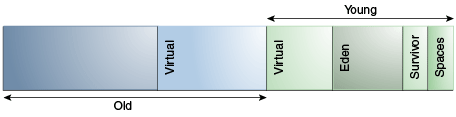

原文地址: [parallel-collector](https://docs.oracle.com/javase/10/gctuning/parallel-collector1.htm)

# The Parallel Collector

The parallel collector (also referred to here as the ***throughput collector***) is a **generational** collector similar to the serial collector. The primary difference between the serial and parallel collectors is that the parallel collector **has multiple threads that are used to speed up garbage collection**.

The parallel collector is enabled with the command-line option `-XX:+UseParallelGC`. By default, with this option, **both minor and major collections are run in parallel** to further reduce`进一步减少` garbage collection overhead`开销`.

## Number of Parallel Collector Garbage Collector Threads

On a machine with *<N>* hardware threads where *<N>* is greater than 8, the parallel collector uses a fixed fraction of *<N>*`N的固定分数` as the number of garbage collector threads.

The fraction is approximately 5/8 for large values of *<N>*. At values of *<N>* below 8, the number used is *<N>*. On selected platforms, the fraction drops to 5/16. The specific number of garbage collector threads can be adjusted with a command-line option (which is described later). On a host with one processor, the parallel collector will likely not perform as well as the serial collector because of the overhead required for parallel execution (for example, synchronization). However, when running applications with medium-sized to large-sized heaps, it generally outperforms the serial collector by a modest amount on computers with two processors, and usually performs significantly better than the serial collector when more than two processors are available.

The number of garbage collector threads can be controlled with the command-line option `-XX:ParallelGCThreads=`*<N>*. If you are tuning the heap with command-line options, then the size of the heap needed for good performance with the parallel collector is the same as needed with the serial collector. However, **enabling the parallel collector should make the collection pauses shorter**. Because **multiple garbage collector threads are participating in a minor collection**, some fragmentation is possible due to promotions from the young generation to the old generation during the collection. **Each garbage collection thread involved in a minor collection reserves a part of the old generation for promotions and the division of the available space into these "promotion buffers" can cause a fragmentation effect`碎片效应`**. <u>Reducing the number of garbage collector threads and increasing the size of the old generation will reduce this fragmentation effect.</u>

## Arrangement of Generations in Parallel Collectors

The arrangement`排列` of the generations is different in the parallel collector.

That arrangement is shown in [Figure 6-1](https://docs.oracle.com/javase/10/gctuning/parallel-collector1.htm#GUID-D004A36D-60F0-4101-A9E9-03C6E248F178__GEN_ARRANGEMENT_PARALLEL):



​                                    Figure 6-1 Arrangement of Generations in the Parallel Collector


>This figure shows the arrangement of generations in the parallel collector. The figure consists of a row of six rectangles`长方形`. These rectangles are labeled as follows (from left to right):
>1. *No label*
>2. Virtual
>3. Virtual
>4. Eden
>5. Survivor
>6. Spaces
>
>Rectangles 1 and 2 are labeled "Old". Rectangles 3 through 6 are labeled "Young." Rectangles 7 and 8 are labeled "Perm."

## Parallel Collector Ergonomics`工效学`

When the parallel collector is selected by using `-XX:+UseParallelGC`, it enables a method of automatic tuning that allows you to specify behaviors instead of generation sizes and other low-level tuning details.`它启用了一种自动调优方法，允许您指定行为，而不是指定生成大小和其他低级调优详细信息。`

### Options to Specify Parallel Collector Behaviors

You can specify maximum garbage collection pause time, throughput, and footprint (heap size).

- **Maximum garbage collection pause time**: The maximum pause time goal is specified with the command-line option `-XX:MaxGCPauseMillis=N`. This is interpreted as a hint that pause times of  *N* milliseconds or less are desired; by default, no maximum pause- time goal. If a pause-time goal is specified, the heap size and other parameters related to garbage collection are adjusted in an attempt to keep garbage collection pauses shorter than the specified value; however, the desired pause-time goal may not always be met. These adjustments may cause the garbage collector to reduce the overall throughput of the application.`这些调整可能会导致垃圾收集器降低应用程序的总吞吐量。`

- **Throughput**: The throughput goal is measured in terms of the time spent doing garbage collection versus the time spent outside of garbage collection, referred to as *application time*`吞吐量目标是以执行垃圾收集所花费的时间与在垃圾收集之外花费的时间（称为 应用程序时间 ）来衡量的。`. The goal is specified by the command-line option `-XX:GCTimeRatio= N`, which sets the ratio of garbage collection time to application time to `1 / (1 + N`).

  For example, `-XX:GCTimeRatio=19` sets a goal of 1/20 or 5% of the total time in garbage collection. The default value is 99, resulting in a goal of 1% of the time in garbage collection.

- **Footprint`占用空间`**: The maximum heap footprint`最大堆占用空间` is specified using the option `-Xmx`*<N>*. In addition, the collector has an implicit goal of minimizing the size of the heap as long as the other goals are being met.

### Priority of Parallel Collector Goals

**The goals are maximum pause-time goal, throughput goal, and minimum footprint goal**, and goals are addressed in that order:

The maximum pause-time goal is met first. Only after it's met is the throughput goal addressed. Similarly, only after the first two goals have been met is the footprint goal considered.

### Parallel Collector Generation Size Adjustments

**Statistics** such as average pause time kept by the collector are **updated** at the **end of each collection**.

The tests to determine if the goals have been met are then made and any needed adjustments to the size of a generation is made. The exception is that explicit garbage collections, for example, calls to System.gc()are ignored in terms of keeping statistics and making adjustments to the sizes of generations.

Growing and shrinking the size of a generation is done by increments that are a fixed percentage of the size of the generation so that a generation steps up or down toward its desired size. Growing and shrinking are done at different rates. By default, a generation grows in increments of 20% and shrinks in increments of 5%. The percentage for growing is controlled by the command-line option `-XX:YoungGenerationSizeIncrement=`*<Y>* for the young generation and `-XX:TenuredGenerationSizeIncrement=`*<T>* for the old generation. The percentage by which a generation shrinks is adjusted by the command-line flag `-XX:AdaptiveSizeDecrementScaleFactor=`*<D>*. If the growth increment is *X*%, then the decrement for shrinking is *X*/*D*%.

If the collector decides to grow a generation at startup, then there's a supplemental percentage is added to the increment. This supplement decays with the number of collections and has no long-term effect. The intent of the supplement is to increase startup performance. There isn't supplement to the percentage for shrinking.

If the maximum pause-time goal isn't being met, then the size of only one generation is shrunk at a time. If the pause times of both generations are above the goal, then the size of the generation with the larger pause time is shrunk first.

If the throughput goal isn't being met, then the sizes of both generations are increased. Each is increased in proportion to its respective contribution to the total garbage collection time. For example, if the garbage collection time of the young generation is 25% of the total collection time and if a full increment of the young generation would be by 20%, then the young generation would be increased by 5%.

### Parallel Collector Default Heap Size

Unless the initial and maximum heap sizes are specified on the command line, they're calculated based on the amount of memory on the machine. The default maximum heap size is one-fourth of the physical memory while the initial heap size is 1/64th of physical memory. The maximum amount of space allocated to the young generation is one third of the total heap size.


#### Specification of Parallel Collector Initial and Maximum Heap Sizes

You can specify the initial and maximum heap sizes using the options `-Xms` (initial heap size) and `-Xmx` (maximum heap size).

If you know how much heap your application needs to work well, then you can **set `-Xms` and `-Xmx` to the same value**. If you don't know, then the JVM will start by using the initial heap size and then growing the Java heap until it finds a balance between heap usage and performance.

Other parameters and options can affect these defaults. To verify your default values, use the `-XX:+PrintFlagsFinal` option and look for `-XX:MaxHeapSize` in the output. For example, on Linux or Solaris, you can run the following:

```
java -XX:+PrintFlagsFinal <GC options> -version | grep MaxHeapSize
```

## Excessive Parallel Collector Time and OutOfMemoryError

The parallel collector throws an `OutOfMemoryError` if **too much time** is being spent in garbage collection (GC).

If more than 98% of the total time is spent in garbage collection and less than 2% of the heap is recovered, then an `OutOfMemoryError`, is thrown. This feature is designed to prevent applications from running for an extended period of time while making little or no progress because the heap is too small. If necessary, this feature can be disabled by adding the option `-XX:-UseGCOverheadLimit` to the command line.

## Parallel Collector Measurements

The verbose garbage collector output from the parallel collector is essentially the same as that from the serial collector.