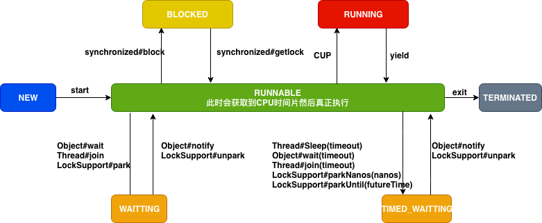

# Thread

## 介绍

## State

**java虚拟机**中，线程状态分为以下几种，这几种状态<u>与操作系统线程状态之间**没有**任何映射关系</u>。

**NEW**

Thread state for a thread which has not yet started.

**RUNNABLE**

Thread state for a runnable thread. A thread in the runnable state is executing in the Java virtual machine but it may be waiting for other resources from the operating system such as processor.

**BLOCKED**

Thread state for a thread blocked waiting for a monitor lock. A thread in the blocked state is waiting for a monitor lock to enter a synchronized block/method or reenter a synchronized block/method after calling `Object.wait`

**WAITING**

Thread state for a waiting thread. A thread is in the waiting state due to calling one of the following methods:

* Object.wait with no timeout
* Thread.join with no timeout
* LockSupport.park

A thread in the waiting state is **waiting for another thread to perform a particular action**. For example, a thread that has called `Object.wait()` on an object is waiting for another thread to call `Object.notify()` or `Object.notifyAll()` on that object. A thread that has called `Thread.join()` is waiting for a specified thread to **terminate**.

**TIMED_WAITING**

Thread state for a waiting thread with a specified waiting time. A thread is in the timed waiting state due to calling one of the following methods **with a specified positive waiting time**:

* Thread.sleep
* Object.wait with timeout
* Thread.join with timeout
* LockSupport.parkNanos
* LockSupport.parkUntil

**TERMINATED**

Thread state for a terminated thread. The thread has completed execution.



从这张图可以看出，大部分中断操作，都会让出CPU。

## 核心源码

### 核心属性

```java
private volatile String name;     //线程名称
private int            priority;  //优先级

/* Whether or not the thread is a daemon thread. */
private boolean     daemon = false; // 是否是守护线程

/* What will be run. */
private Runnable target; // 被执行的任务

/* The group of this thread */
private ThreadGroup group; // 当前线程所属的线程组

/* ThreadLocal values pertaining关联 to this thread. This map is maintained
 * by the ThreadLocal class. */
ThreadLocal.ThreadLocalMap threadLocals = null;

/*
 * InheritableThreadLocal values pertaining to this thread. This map is
 * maintained by the InheritableThreadLocal class.
 */
ThreadLocal.ThreadLocalMap inheritableThreadLocals = null;

/*
 * The requested stack size for this thread, or 0 if the creator did
 * not specify a stack size.  It is up to the VM to do whatever it
 * likes with this number; some VMs will ignore it.
 */
private long stackSize;// 栈大小

/*
 * Thread ID
 */
private long tid; // 自动生成的线程id

/*
 * Java thread status for tools, default indicates thread 'not yet started'
 */
private volatile int threadStatus;

/**
 * The argument supplied to the current call to
 * java.util.concurrent.locks.LockSupport.park.
 * Set by (private) java.util.concurrent.locks.LockSupport.setBlocker
 * Accessed using java.util.concurrent.locks.LockSupport.getBlocker
 */
volatile Object parkBlocker;

/* The object in which this thread is blocked in an interruptible I/O
 * operation, if any.  The blocker's interrupt method should be invoked
 * after setting this thread's interrupt status.
 */
private volatile Interruptible blocker;
```

### 核心方法

#### yield

让当前线程由 **RUNNING** 进入到 **RUNNABLE**，从而让其它具有相同优先级的等待线程获取执行权；但是，并不能保证在当前线程调用`yield()`之后，其它具有相同优先级的线程就一定能获得执行权；也有可能是当前线程又进入到 **RUNNING** 继续运行！

A hint暗示 to the scheduler that the current thread is willing to yield its current use of a processor. The scheduler is free to ignore this hint`调度程序可以忽略此提示`.

Yield is a heuristic`探试的` attempt to improve`改善` relative progression between threads that would otherwise over-utilise`过度使用` a CPU. Its use should be combined with detailed profiling`详细的分析` and benchmarking`基准测试` to ensure that it actually has the desired effect.

It is rarely`很少` appropriate`适合` to use this method. It may be useful for debugging or testing purposes, where it may help to reproduce`重现` bugs due to race conditions. It may also be useful when designing concurrency control constructs such as the ones in the `java.util.concurrent.locks` package.

```java
public static native void yield();
```

#### sleep 休眠

Causes the currently executing thread to sleep (temporarily cease`停止` execution) for the specified number of milliseconds, subject to`取决于` the precision`精度` and accuracy`准确性` of system timers`系统计时器` and schedulers. **The thread does not lose ownership of any monitors.**

```java
public static native void sleep(long millis) throws InterruptedException;
```

#### interrupt 中断

Interrupts this thread.

Unless the current thread is interrupting itself, which is always permitted, the `checkAccess` method of this thread is invoked, which may cause a `SecurityException` to be thrown.

If this thread is blocked in an invocation of the `wait()`, `wait(long)`, or `wait(long, int)` methods of the **Object** class, or of the `join()`, `join(long)`, `join(long, int)`, `sleep(long),` or `sleep(long, int)`, methods of **this** class, then its **interrupt status will be cleared** and it will **receive an `InterruptedException`.**

If this thread is blocked in an I/O operation upon an `InterruptibleChannel` then the **channel will be closed**, the thread's **interrupt status will be set**, and the thread will receive a `java.nio.channels.ClosedByInterruptException`.

If this thread is blocked in a `java.nio.channels.Selector` then the thread's **interrupt status will be set and it will return immediately from the selection operation**, possibly with a non-zero value, just as if`就像...一样` the selector's `wakeup` method were invoked.

**If none of the previous conditions hold then this thread's interrupt status will be set.**
Interrupting a thread that is not alive need not have any effect.

```java
public void interrupt() {
    if (this != Thread.currentThread())
        checkAccess();

    synchronized (blockerLock) {
        Interruptible b = blocker;
        if (b != null) {
            interrupt0();           // Just to set the interrupt flag
            b.interrupt(this);
            return;
        }
    }
    interrupt0();
}
```

#### interrupted

Tests whether the current thread has been interrupted. **The interrupted status of the thread is cleared by this method**. In other words, if this method were to be called twice in succession, the second call would return false (unless the current thread were interrupted again, after the first call had cleared its interrupted status and before the second call had examined it).
A thread interruption ignored because a thread was not alive at the time of the interrupt will be reflected by this method returning false.

```java
public static boolean interrupted() {
    return currentThread().isInterrupted(true/*ClearInterrupted*/);
}
```

#### join

Waits at most millis milliseconds for this thread to die. A timeout of **0 means to wait forever**.
This implementation uses a loop of `this.wait` calls conditioned on `this.isAlive`. As a thread terminates the `this.notifyAll` method is invoked. **It is recommended that applications not use `wait`, `notify`, or `notifyAll` on Thread instances.**

```java
public final synchronized void join(long millis)
throws InterruptedException {
    long base = System.currentTimeMillis();
    long now = 0;

    if (millis < 0) {
        throw new IllegalArgumentException("timeout value is negative");
    }

    if (millis == 0) {
        while (isAlive()) { // 循环判断是否存活，线程死亡的时候调用notifyAll唤醒当前线程
            wait(0);//等待，直到被唤醒
        }
    } else {
        while (isAlive()) {
            long delay = millis - now;
            if (delay <= 0) {
                break;
            }
            wait(delay);
            now = System.currentTimeMillis() - base;
        }
    }
}
```

####  setDaemon

Marks this thread as either a daemon thread or a user thread. **The Java Virtual Machine exits when the only threads running are all daemon threads.**

This method **must be invoked before the thread is started**.

```java
public final void setDaemon(boolean on) {
    checkAccess();
    if (isAlive()) {
        throw new IllegalThreadStateException();
    }
    daemon = on;
}
```

#### onSpinWait 自旋等待

**Indicates指出 that the caller is momentarily暂时的 unable to progress执行, until the occurrence发生 of one or more actions on the part of other activities**. By invoking this method within each iteration of a **spin-wait loop construct**, the calling thread indicates to the runtime that it is busy-waiting. **The runtime may take action to improve the performance** of invoking *spin-wait loop constructions*.

**apiNote**:
**As an example consider a method in a class that spins in a loop until some flag is set outside of that method. A call to the `onSpinWait` method should be placed inside the spin loop**.

```java
 class EventHandler {
     volatile boolean eventNotificationNotReceived;
     void waitForEventAndHandleIt() {
         while ( eventNotificationNotReceived ) {
	           // 告诉 Runtime，当前线程处于 spin-wait
           	 // 然后 Runtime 会 improve the performance
             java.lang.Thread.onSpinWait(); 
         }
         readAndProcessEvent();
     }

     void readAndProcessEvent() {
         // Read event from some source and process it
          . . .
     }
 }
```

The code above would remain correct even if the `onSpinWait` method was not called at all. However on **some architectures`架构` the Java Virtual Machine may issue`发出` the processor instructions `处理器指令` to address such code patterns in a more beneficial`更有益的方式` way.**

```java
@HotSpotIntrinsicCandidate
public static void onSpinWait() {}
```

### Object#wait/notify

##### wait

Causes the current thread to wait until either another thread invokes the `notify()` method or the `notifyAll()` method for this object, or a specified amount of time has elapsed.

**The current thread must own this object's monitor.**

This method causes the current thread (call it **T**) to **place itself in the wait set for this object and then to relinquish`放弃` any and all synchronization claims`申明` on this object**. Thread **T** becomes disabled for thread scheduling purposes and lies dormant`休眠` until one of four things happens:

* Some other thread invokes the `notify` method for this object and thread **T** happens to be arbitrarily`任意地` chosen as the thread to be awakened.
* Some other thread invokes the `notifyAll` method for this object.
* Some other thread `interrupts` thread **T**.
* The specified amount of real time has elapsed, more or less. If `timeout` is zero, however, then real time is not taken into consideration`考虑` and the thread simply waits until notified.

**The thread T is then removed from the wait set for this object and re-enabled for thread scheduling. It then`然后` competes`竞争` in the usual`通常的` manner`方式` with other threads for the right`权利` to synchronize on the object; once it has gained`赢得` control of the object, all its synchronization claims on the object are restored to the status quo ante现况 - that is`也就是说`, to the situation as of the time that the `wait` method was invoked`恢复到调用“wait”方法时的状态`. Thread T then returns from the invocation of the `wait` method.** Thus, on return from the wait method, the synchronization state of the object and of thread T is exactly as it was when the `wait` method was invoked.

A thread can also wake up without being notified, interrupted, or timing out, a so-called **spurious wakeup`伪唤醒`**. While this will rarely occur in practice`实践中`, applications must guard against it`防范这种情况` by testing for the condition that should have caused the thread to be awakened`唤醒`, and continuing to wait if the condition is not satisfied`满足`. In other words, **waits should always occur in loops**, like this one:

```java
synchronized (obj) {
		while (<condition does not hold>)
			obj.wait(timeout);
  	... // Perform action appropriate to condition
}
```

(For more information on this topic, see section 14.2, Condition Queues, in Brian Goetz and others' "**Java Concurrency in Practice**" (Addison-Wesley, 2006) or Item 69 in Joshua Bloch's "**Effective Java (Second Edition)**" (Addison-Wesley, 2008).

If the current thread is `interrupted` by any thread before or while it is waiting, then an `InterruptedException` is thrown. This exception is not thrown until the lock status of this object has been restored as described above.`在按照上述说明还原此对象的锁定状态之前，不会引发此异常。`

Note that the `wait` method, as it places the current thread into the wait set for this object, unlocks only this object; any other objects on which the current thread may be synchronized remain locked while the thread waits.

This method should only be called by a thread that is the owner of this object's monitor. See the `notify` method for a description of the ways in which a thread can become the owner of a monitor.

```java
public final native void wait(long timeout) throws InterruptedException;
```

##### notify

Wakes up a single thread that is waiting on this object's monitor. If any threads are waiting on this object, one of them is chosen to be awakened. The choice is **arbitrary**`任意的` and occurs *at the discretion of*`由…决定` the implementation. A thread waits on an object's monitor by calling one of the `wait` methods.

**The awakened thread will not be able to proceed until the current thread relinquishes`放弃` the lock on this object**. The awakened thread will compete in the usual`通常` manner`方式` with any other threads that might be actively`积极` competing`竞争` to synchronize on this object; for example, the awakened thread enjoys`享有` no reliable privilege or disadvantage`虐势` in being the next thread to lock this object.

This method should only be called by a thread that is the owner of this object's monitor. A thread **becomes the owner of the object's monitor** in one of three ways:

* By **executing a synchronized instance method of that object**.
* By **executing the body of a `synchronized` statement that synchronizes on the object.**
* **For objects of type `Class`, by executing a synchronized static method of that class.**

Only one thread at a time can own an object's monitor.

```java
@HotSpotIntrinsicCandidate
public final native void notify();
```

## javadoc

A **thread** is a thread of execution in a program. The Java Virtual Machine allows an application to have multiple threads of execution running concurrently.
Every thread has a **priority(1~10)**. Threads with higher priority are executed in preference to threads with lower priority. Each thread may or may not also be marked as a **daemon**. When code running in some thread creates a new `Thread` object, <u>the new thread has its priority initially set equal to the priority of the creating thread, and is a daemon thread if and only if the creating thread is a daemon</u>.
When a Java Virtual Machine starts up, there is usually a single non-daemon thread (which typically calls the method named `main` of some designated`指定的` class). The Java Virtual Machine continues to execute threads until either of the following occurs:

* The `exit` method of class `Runtime` has been called and the security manager has permitted the `exit` operation to <u>take place</u>`发生，执行` .
* All threads that are not daemon threads have died, either by returning from the call to the `run` method or by throwing an exception that propagates传播 beyond the `run` method.

There are two ways to create a new thread of execution. One is to declare a class to be a subclass of `Thread`. This subclass should override the `run` method of class `Thread`. An instance of the subclass can then be allocated and started. For example, a thread that computes primes`素数` larger than a stated value could be written as follows:

```java
class PrimeThread extends Thread {
  long minPrime;
  PrimeThread(long minPrime) {
    this.minPrime = minPrime;
  }

  public void run() {
    // compute primes larger than minPrime
    . . .
  }
}
```

 The following code would then create a thread and start it running:

```java
PrimeThread p = new PrimeThread(143);
p.start();
```

The other way to create a thread is to declare a class that implements the `Runnable` interface. That class then implements the `run` method. An instance of the class can then be allocated, passed as an argument when creating `Thread`, and started. The same example in this other style looks like the following:

```java
class PrimeRun implements Runnable {
  long minPrime;
  PrimeRun(long minPrime) {
  this.minPrime = minPrime;
  }

  public void run() {
  // compute primes larger than minPrime
  . . .
  }
}
```

 

The following code would then create a thread and start it running:

```java
PrimeRun p = new PrimeRun(143);
new Thread(p).start();
```

Every thread has a **name** for identification`识别,鉴定` purposes. More than one thread may have the same name. If a name is not specified when a thread is created, a new name is generated for it.
Unless otherwise noted, passing a `null` argument to a constructor or method in this class will cause a `NullPointerException` to be thrown.