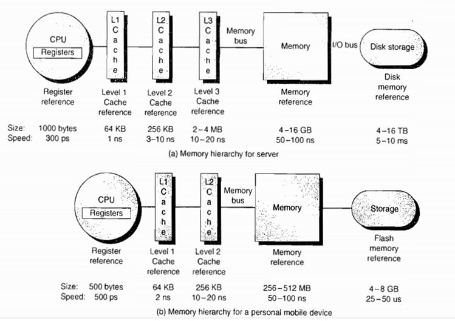
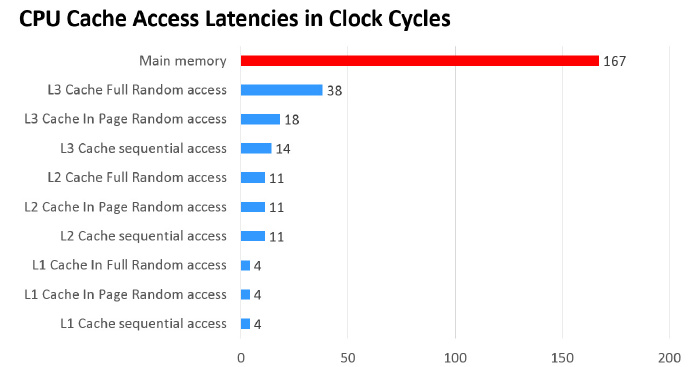

## 介绍

volatile 是**轻量级的 synchronized**，它在多处理器开发中保证了共享变量的**可见性**。它比synchronized的**使用和执行成本会更低**，因为它不会引起线程上下文的切换和调度

## **术语定义**

1. **共享变量** 在多个线程之间能够被共享的变量被称为共享变量。共享变量包括所有的实例变量，静态变量和数组元素。他们都被存放在**堆内存**中，volatile 只作用于共享变量。
2. **内存屏障** Memory Barriers: 是一组处理器指令，用于实现对内存操作的顺序限制。
3. **缓冲行** Cache line: 缓存中可以分配的最小存储单位。处理器填写缓存线时会加载整个缓存线，需要使用多个主内存读周期。
4. **原子操作** Atomic operations: 不可中断的一个或一系列操作。
5. **缓存行填充**  cache line fill: 当处理器识别到从内存中读取操作数是可缓存的，处理器读取整个缓存行到适当的缓存（L1，L2，L3的或所有）
6. **缓存命中** cache hit: 如果进行高速缓存行填充操作的内存位置仍然是下次处理器访问的地址时，处理器从缓存中读取操作数，而不是从内存。
7. **写命中** write hit: 当处理器将操作数写回到一个内存缓存的区域时，它首先会检查这个缓存的内存地址是否在缓存行中，如果存在一个有效的缓存行，则处理器将这个操作数写回到缓存，而不是写回到内存，这个操作被称为写命中。
8. **写缺失** write misses the cache 一个有效的缓存行被写入到不存在的内存区域。

#### 实现原理

有 volatile 变量修饰的共享变量进行写操作的时候会多一行 lock 代码，lock 前缀的指令在多核处理器下会引发了两件事情。

- 将当前**处理器缓存行**的数据会写回到**系统内存**。
- 这个写回内存的操作会引起在**其他CPU里缓存了该内存地址的数据无效**。

处理器为了提高处理速度，不直接和内存进行通讯，而是先将系统内存的数据读到内部缓存（L1,L2或其他）后再进行操作，但操作完之后不知道何时会写到内存，如果对声明了 volatile 变量进行写操作，JVM就会向处理器发送一条 Lock 前缀的指令，将这个变量所在缓存行的数据写回到系统内存。但是就算写回到内存，如果其他处理器缓存的值还是旧的，再执行计算操作就会有问题，所以在多处理器下，为了保证各个处理器的缓存是一致的，就会实现缓存一致性协议，每个处理器通过**嗅探在总线上传播的数据来检查自己缓存的值是不是过期**了，**当处理器发现自己缓存行对应的内存地址被修改，就会将当前处理器的缓存行设置成无效状态，当处理器要对这个数据进行修改操作的时候，会强制重新从系统内存里把数据读到处理器缓存里**。





举一个简单的例子

```java
i++
```

当线程运行这段代码时，首先会从主存中读取i( i = 1)，然后复制一份到CPU高速缓存中，然后CPU执行 + 1 （2）的操作，然后将数据（2）写入到告诉缓存中，最后刷新到主存中。其实这样做在单线程中是没有问题的，有问题的是在多线程中。如下：

假如有两个线程A、B都执行这个操作，按照我们正常的逻辑思维主存中的i值应该=3，但事实是这样么？分析如下：

两个线程从主存中读取i的值（1）到各自的高速缓存中，然后线程A执行+1操作并将结果写入高速缓存中，最后写入主存中，此时主存i==2,线程B做同样的操作，主存中的i仍然=2。所以最终结果为2并不是3。这种现象就是缓存一致性问题。

解决缓存一致性方案有两种：

1. 通过在总线加LOCK#锁的方式
2. 通过缓存一致性协议

但是方案1存在一个问题，它是采用一种独占的方式来实现的，即总线加LOCK#锁的话，只能有一个CPU能够运行，其他CPU都得阻塞，效率较为低下。

第二种方案，缓存一致性协议（MESI协议,修改，独占，共享，无效）它确保每个缓存中使用的共享变量的副本是一致的。其核心思想如下：当某个CPU在写数据时，如果发现操作的变量是共享变量，则会通知其他CPU告知该变量的缓存行是无效的，因此其他CPU在读取该变量时，发现其无效会重新从主存中加载数据。

## source

The Java programming language allows threads to access shared variables (synchronized). As a rule, to ensure that shared variables are consistently`一致地` and reliably`可靠地` updated, a thread should ensure that it has exclusive use of such variables by obtaining a lock that, conventionally`通常`, enforces`强制` mutual exclusion for those shared variables.**Java编程语言允许线程访问共享变量，为了确保共享变量能被准确和一致地更新，线程应该确保通过排他锁单独获得这个变量。**

**volatile是无法保证复合操作的原子性**

**volatile可以保证线程可见性且提供了一定的有序性，但是无法保证原子性。在JVM底层volatile是采用“内存屏障”来实现的。**

1. **保证可见性、不保证原子性**  <<< 重点注意
2. **禁止指令重排序**

The Java programming language provides a second mechanism, `volatile` fields, that is more convenient`方便` than locking for some purposes.

**A field may be declared `volatile`, in which case the Java Memory Model ensures that all threads see a consistent value for the variable** ([§17.4](../java_memory_model.md)).

It is a compile-time error if a `final` variable is also declared `volatile`.


**Example 8.3.1.4-1. volatile Fields**

If, in the following example, one thread repeatedly calls the method `one` (but no more than `Integer.MAX_VALUE` times in all), and another thread repeatedly calls the method `two`:

```java
class Test {
    static int i = 0, j = 0;
    static void one() { i++; j++; }
    static void two() {
        System.out.println("i=" + i + " j=" + j);
    }
}
```

then method `two` could occasionally print a value for `j` that is greater than the value of `i`, because the example includes no synchronization and, under the rules explained in [§17.4](../java_memory_model.md), the shared values of `i` and `j` might be updated out of order`非顺序更新`.

One way to prevent this out-or-order behavior would be to declare methods `one` and `two` to be `synchronized` ([§8.4.3.6](./00_synchronized.md)):

```java
class Test {
    static int i = 0, j = 0;
    static synchronized void one() { i++; j++; }
    static synchronized void two() {
        System.out.println("i=" + i + " j=" + j);
    }
}
```

This prevents method `one` and method `two` from being executed concurrently, and furthermore`此外,与此同时` guarantees that the shared values of `i` and `j` are both updated before method `one`returns. Therefore method `two` never observes a value for `j` greater than that for `i`; indeed, it always observes the same value for `i` and `j`.

Another approach would be to declare `i` and `j` to be `volatile`:

```java
class Test {
    static volatile int i = 0, j = 0;
    static void one() { i++; j++; }
    static void two() {
        System.out.println("i=" + i + " j=" + j);
    }
}
```

This allows method `one` and method `two` to be executed concurrently, but guarantees that **accesses to the shared values for `i` and `j` occur exactly as many times, and in exactly the same order, as they appear to occur during execution of the program text by each thread**. Therefore, the shared value for `j` is never greater than that for `i`, because each update to `i` must be reflected in the shared value for `i` before the update to `j` occurs. It is possible, however, that any given invocation of method `two` might observe a value for `j` that is much greater than the value observed for `i`, *because method `one` might be executed many times between the moment when method `two` fetches the value of `i` and the moment when method two fetches the value of `j`.*