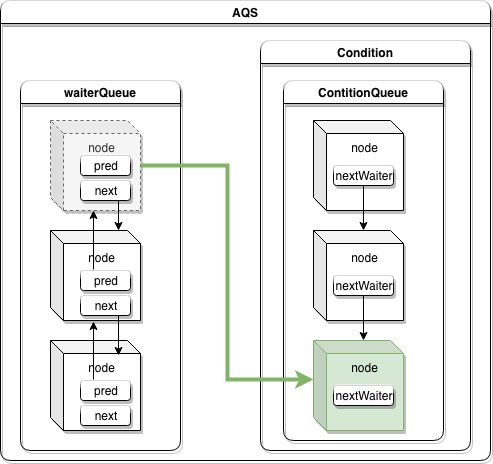
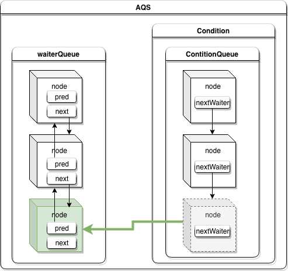

# AQS#ConditionObject

##  

`ConditionObject` 是 AQS 中定义的内部类，实现了`Condition`接口，`ConditionObject`是基于 `Lock` 实现的，在其内部通过链表来维护**条件队列**。`Contidion`必须在 lock 的同步控制块中使用，调用`Condition`的`singnal`方法并不代表线程可以马上执行，线程的执行始终都需要根据同步状态（即线程是否占有锁）。实际上，调用 `signal` 方法，实际上是将条件队列中的`node` 移到 AQS 锁的 waiterQueue里面去了，之后，只有这个node拿到了 AQS 的锁之后，才会被执行。

**为什么Condition必须在lock的同步控制块中使用？即为什么在使用Condition之前要获取锁。**

ConditionObject对象是通过显式锁中的lock.newCondition(）方法生成的,可以看出此时必须占有锁资源，这也是为什么Condition必须在lock的同步控制块中使用的原因。

 ## await


```java
/**
 * Implements interruptible condition wait.
 * <ol>
 * <li>If current thread is interrupted, throw InterruptedException.
 * <li>Save lock state returned by {@link #getState}.
 * <li>Invoke {@link #release} with saved state as argument,
 *     throwing IllegalMonitorStateException if it fails.
 * <li>Block until signalled or interrupted.
 * <li>Reacquire by invoking specialized version of
 *     {@link #acquire} with saved state as argument.
 * <li>If interrupted while blocked in step 4, throw InterruptedException.
 * </ol>
 */
public final void await() throws InterruptedException {
    if (Thread.interrupted())
        throw new InterruptedException();
		// 将当前线程加入到链表最后，并返回该节点
    Node node = addConditionWaiter();
  	/** 
  	 * 调用await()必须在同步控制块中，因此当前线程占有锁，
     * 所以在线程加入到条件(等待)队列之后，需要去释放锁
     * 类似于 Synchronizd 代码中的 wait() 方法会释放 sync 锁是一个道理
     */
    int savedState = fullyRelease(node);
    int interruptMode = 0;
	  //while循环通过isOnSyncQueue方法判断节点node是否在同步队列中
		//这里有个理解难点，为什么需要判断节点Node是否在同步队列中呢？
		//因为当线程调用signal或signalAll时,会从firstWaiter节点开始，将节点依次从等待队列中移除，并通过enq方法重新添加到同步队列中
		//因此当其他线程调用signal或者signalAll方法时，该线程可能从条件（等待）队列中移除，并重新加入到同步队列中
		//1. 如果没有，则阻塞当前线程，同时调用checkInterruptWhileWaiting检测当前线程在等待过程中是否发生中断，设置interruptMode表示中断状态。
		//2. 如果isOnSyncQueue方法判断出当前线程已经处于同步队列中了，则跳出while循环
    while (!isOnSyncQueue(node)) {
        LockSupport.park(this);
        if ((interruptMode = checkInterruptWhileWaiting(node)) != 0)
            break;
    }
		 //利用acquireQueued方法循环尝试获取同步状态（锁）
    if (acquireQueued(node, savedState) && interruptMode != THROW_IE)
        interruptMode = REINTERRUPT;
    if (node.nextWaiter != null) // clean up if cancelled
        unlinkCancelledWaiters();//将等待队列中，不是Node.CONDITION状态的节点移除
    if (interruptMode != 0)
        reportInterruptAfterWait(interruptMode);
}
```

## signal

```java
/**
 * Moves the longest-waiting thread, if one exists, from the
 * wait queue for this condition to the wait queue for the
 * owning lock.
 *
 * @throws IllegalMonitorStateException if {@link #isHeldExclusively}
 *         returns {@code false}
 */
public final void signal() {
    if (!isHeldExclusively())
        throw new IllegalMonitorStateException();
    Node first = firstWaiter;
    if (first != null)
        doSignal(first);
}
```

```java
/**
 * Removes and transfers nodes until hit non-cancelled one or
 * null. Split out from signal in part to encourage compilers
 * to inline the case of no waiters.
 * @param first (non-null) the first node on condition queue
 */
private void doSignal(Node first) {
    do {
        if ( (firstWaiter = first.nextWaiter) == null)
            lastWaiter = null;
        first.nextWaiter = null;
    } while (!transferForSignal(first) &&
             (first = firstWaiter) != null);
}
```

```java
/**
 * Transfers a node from a condition queue onto sync queue.
 * Returns true if successful.
 * @param node the node
 * @return true if successfully transferred (else the node was
 * cancelled before signal)
 */
final boolean transferForSignal(Node node) {
    /*
     * If cannot change waitStatus, the node has been cancelled.
     */
    if (!node.compareAndSetWaitStatus(Node.CONDITION, 0))
        return false;
		// 更新节点状态，并通过enq方法，将节点重新加入同步队列中
    /*
     * Splice onto queue and try to set waitStatus of predecessor to
     * indicate that thread is (probably) waiting. If cancelled or
     * attempt to set waitStatus fails, wake up to resync (in which
     * case the waitStatus can be transiently and harmlessly wrong).
     */
    Node p = enq(node);
    int ws = p.waitStatus;
    if (ws > 0 || !p.compareAndSetWaitStatus(ws, Node.SIGNAL))
        LockSupport.unpark(node.thread);
    return true;
}
```

`signal`方法的核心其实是`doSignal`和`transferForSignal`方法，`doSignal`的主要作用就是将条件（等待）队列中的头节点`firstWaiter`从队列中移除，`transferForSignal`方法的主要作用就是将`doSignal`方法中移除的`firstWaiter`节点通过`enq`方法重新添加到**AQS同步队列**中，从这里也可以看出为什么会在`await`方法中调用`isOnSyncQueue`方法判断节点是否处于同步队列中了

## await & signal 流程图

由于`await`方法必须在占有锁后才能调用，因此，最开始线程所在的节点应该位于同步队列中的，如下图所示：


当成功调用了`Condition`的`await`方法时，表示线程拿到了锁，因此从同步队列中移除了，在`await`方法内部的`addConditionWaiter`执行后，节点加入到了等待队列中，即节点变化过程如下：



之后`await`方法会通过`isOnSyncQueue`方法判断，节点是否在同步队列中，至于为什么要判断，上面我已经做了解释，不再重复。`signal`和`signalAll`方法就是将条件队列中的节点按顺序移除，并重新添加到同步队列，下面我们就看看`signal`方法中，节点的变化过程：

