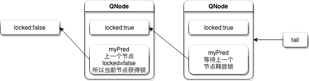

# Spin & CLH 
## SPINLock

何谓自旋锁？它是为实现保护共享资源而提出一种锁机制。无论是互斥锁，还是自旋锁，在任何时刻，最多只能有一个执行单元获得锁。但是两者在调度机制上略有不同。对于互斥锁，如果资源已经被占用，资源申请者只能进入睡眠状态。**但是自旋锁不会引起调用者睡眠，如果自旋锁已经被别的执行单元保持，调用者就一直循环在那里看是否该自旋锁的保持者已经释放了锁，“自旋”一词就是因此而得名**

spinlock的工作方式本身就体现了它的优缺点，**优点是执行速度快，不涉及上下文切换；缺点是耗费CPU资源。**

##CLHLock

CLH(Craig, Landin, andHagersten locks)是一钟**自旋锁**，能确保无饥饿性，提供先来先服务的公平性。

CLH锁是一种基于链表的可扩展、高性能、公平的自旋锁，申请线程只在本地变量上自旋，它**不断轮询前驱的状态，如果发现前驱释放了锁就结束自旋**。

CLH 队列中的结点`QNode`中含有一个 `locked` 字段，该字段若为`true`表示该线程需要获取锁，且不释放锁，为`false`表示线程释放了锁。结点之间是通过隐形的链表相连，之所以叫隐形的链表是因为这些结点之间没有明显的`next`指针，而是通过`myPred`所指向的结点的变化情况来影响`myNode`的行为。`CLHLock`上还有一个尾指针，始终指向队列的最后一个结点。

当一个线程需要获取锁时，会创建一个新的`QNode`，将其中的`locked`设置为`true`表示需要获取锁，然后使自己成为队列的尾部，同时获取一个指向其前驱的引用`myPred`,然后该线程就在前驱结点的`locked`字段上旋转，直到前驱结点释放锁。当一个线程需要释放锁时，将当前结点的`locked`域设置为`false`，同时回收前驱结点。如上图所示，线程A需要获取锁，其`myNode`域为`true`，些时`tail`指向线程A的结点，然后线程B也加入到线程A后面，`tail`指向线程B的结点。然后线程A和B都在它的`myPred`域上旋转，一旦它的`myPred`结点的`locked`字段变为`false`，它就可以获取锁。