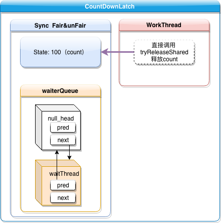

# CountDownLatch

## 介绍

基于 AQS 队列同步器实现的信号量机制，利用 AQS 的 state 字段来存储信号总量 count，通过 countDown 来释放信号量，当信号量达到 0 的时候，唤醒等待线程。信号总量是在构造器里面初始化的，不允许重置。

## sourcecode

#### Sync

```java
/**
 * Synchronization control For CountDownLatch.
 * Uses AQS state to represent count.
 */
private static final class Sync extends AbstractQueuedSynchronizer {
    private static final long serialVersionUID = 4982264981922014374L;

    Sync(int count) {
        setState(count);
    }

    int getCount() {
        return getState();
    }

    protected int tryAcquireShared(int acquires) {
        return (getState() == 0) ? 1 : -1;
    }

    protected boolean tryReleaseShared(int releases) {
        // Decrement count; signal when transition to zero
        for (;;) {
            int c = getState();
            if (c == 0)
                return false;
            int nextc = c - 1;
            if (compareAndSetState(c, nextc))
                return nextc == 0;
        }
    }
}
```

可以看到同步器 `Sync` 中使用 `state` 来存储 **count** 值，**count** = 0 表示锁已被释放，> 0 表示尚未解锁。在构造器中，设置 `state` 值为初始值之后，就不允许再往上加了，只允许通过 `tryReleaseShared` 方法来释放，释放时，每次只允许释放一个（即使传参数进来没用）。

```java
public void await() throws InterruptedException {
    sync.acquireSharedInterruptibly(1);
}
public boolean await(long timeout, TimeUnit unit)
    throws InterruptedException {
    return sync.tryAcquireSharedNanos(1, unit.toNanos(timeout));
}
public void countDown() {
    sync.releaseShared(1);
}
```

**这里提供了三个方法处理锁，`await` 方法调用 `tryAcquireShared` 来尝试获取锁，如果没有获取到，则 AQS 入队等待。`countDown` 方法释放锁，释放完之后，如果 state = 0 则返回成功，后续AQS 会 `unparkSuccessor` 唤醒等待线程。**

**`countDownLatch` 并不是传统意义上的锁，而是属于信号量范畴，只有主线程再 `await` 的时候会入队等待，但是任何一个线程都可以直接释放锁，而不需要排队，当所有信号全部释放完，则唤醒主线程。**

#### 整体结构图



## javadoc

A synchronization aid`工具，助手` that allows one or more threads to wait until a set of operations being performed in other threads completes.
A `CountDownLatch` is initialized with a given **count**. The `await` methods block until the current count reaches zero due to invocations of the `countDown` method, after which`在这之后` all waiting threads are released and any subsequent`之后的，随后的` invocations of `await` return immediately. This is a one-shot phenomenon`一次性事件` -- <u>the **count** cannot be reset.</u> If you need a version that resets the count, consider using a `CyclicBarrier`.

A `CountDownLatch` is a versatile`通用的` synchronization tool and can be used for a number of`多种` purposes. A `CountDownLatch` initialized with a *count* of **one** serves as a simple on/off latch`闩`, or gate`门`: all threads invoking `await` wait at the gate until it is opened by a thread invoking `countDown`. A `CountDownLatch` initialized to **N** can be used to make one thread wait until **N** threads have completed some action, or some action has been completed N times.

A useful property of a `CountDownLatch` is that it doesn't require that threads calling `countDown` wait for the **count** to reach **zero** before proceeding`进行`, it simply prevents any thread from proceeding past an `await` until all threads could pass.
**Sample usage**: Here is a pair of classes in which a group of worker threads use two countdown latches:

1. The first is a start signal that prevents any worker from proceeding until the driver is ready for them to proceed;

2. The second is a completion signal that allows the driver to wait until all workers have completed.

```java
 class Driver { // ...
   void main() throws InterruptedException {
     CountDownLatch startSignal = new CountDownLatch(1);
     CountDownLatch doneSignal = new CountDownLatch(N);

     for (int i = 0; i < N; ++i) // create and start threads
       new Thread(new Worker(startSignal, doneSignal)).start();

     doSomethingElse();            // don't let run yet
     startSignal.countDown();      // let all threads proceed
     doSomethingElse();
     doneSignal.await();           // wait for all to finish
   }
 }

 class Worker implements Runnable {
   private final CountDownLatch startSignal;
   private final CountDownLatch doneSignal;
   Worker(CountDownLatch startSignal, CountDownLatch doneSignal) {
     this.startSignal = startSignal;
     this.doneSignal = doneSignal;
   }
   public void run() {
     try {
       startSignal.await();
       doWork();
       doneSignal.countDown();
     } catch (InterruptedException ex) {} // return;
   }

   void doWork() { ... }
 }
```


Another typical usage would be to divide a problem into N parts, describe each part with a `Runnable` that executes that portion`部分` and counts down on the latch, and queue all the Runnables to an `Executor`. When all sub-parts are complete, the coordinating`协调` thread will be able to pass through `await`. (When threads must repeatedly`重复` count down in this way, instead use a `CyclicBarrier`.)

 

```java
class Driver2 { // ...
   void main() throws InterruptedException {
     CountDownLatch doneSignal = new CountDownLatch(N);
     Executor e = ...

     for (int i = 0; i < N; ++i) // create and start threads
       e.execute(new WorkerRunnable(doneSignal, i));

     doneSignal.await();           // wait for all to finish
   }
 }

 class WorkerRunnable implements Runnable {
   private final CountDownLatch doneSignal;
   private final int i;
   WorkerRunnable(CountDownLatch doneSignal, int i) {
     this.doneSignal = doneSignal;
     this.i = i;
   }
   public void run() {
     try {
       doWork(i);
       doneSignal.countDown();
     } catch (InterruptedException ex) {} // return;
   }

   void doWork() { ... }
 }
```


Memory consistency`一致性` effects: Until the **count** reaches **zero**, actions in a thread prior to calling `countDown()` *happen-before* actions following a successful return from a corresponding `await()` in another thread.