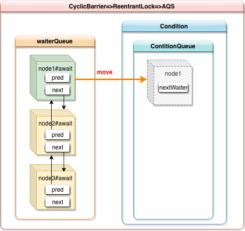
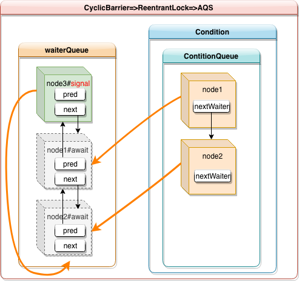

# CyclicBarrier

## 介绍

一个基于ReentrantLock 和 ConditionObject 实现的同步机制。一组固定数量的线程执行任务，每一个子任务执行完毕之后，等待其他线程完成，当左右线程全部执行完了之后，进入下一个周期。

## sourcecode

#### Generation

```java
/**
 * Each use of the barrier is represented as a generation instance.
 * The generation changes whenever the barrier is tripped绊倒, or
 * is reset. There can be many generations associated with threads
 * using the barrier - due to the non-deterministic不确定的 way the lock
 * may be allocated to waiting threads - but only one of these
 * can be active at a time (the one to which {@code count} applies)
 * and all the rest剩余部分 are either broken or tripped.
 * There need not be an active generation if there has been a break
 * but no subsequent随后的 reset.
 */
private static class Generation {
    Generation() {}                 // prevent access constructor creation
    boolean broken;                 // initially false
}
```

代，周期。 该字段用于描述当前周期信息

#### dowait

```java
/**
 * Main barrier code, covering the various policies.
 */
private int dowait(boolean timed/*是否是定时的*/, long nanos)
    throws InterruptedException, BrokenBarrierException,
           TimeoutException {
    final ReentrantLock lock = this.lock;
    lock.lock();
    try {
        final Generation g = generation;

        if (g.broken)
            throw new BrokenBarrierException();

        if (Thread.interrupted()) {
            breakBarrier();
            throw new InterruptedException();
        }

      	// count: 还剩多少个线程正在处理，每处理完一个减1
        int index = --count; 
        if (index == 0) {  // tripped ：所有的线程都处理完了
            boolean ranAction = false;// barrierCommand 是否执行成功
            try {
                final Runnable command = barrierCommand;
                if (command != null)
                    command.run();
                ranAction = true;
                nextGeneration(); // 推进到下一周期
              	/*这里可以看出来，由最后一个 await 的线程负责唤
              	 醒其他已经完成了，且正在等待中的线程*/            	 
                return 0;
            } finally {
                if (!ranAction)
                    breakBarrier();
            }
        }

        // loop until tripped, broken, interrupted, or timed out
        for (;;) {
            try {
              	// 等待其他线程完成
                if (!timed)
                    trip.await();
                else if (nanos > 0L)
                    nanos = trip.awaitNanos(nanos);
            } catch (InterruptedException ie) {
              	// 如果被意外的中断等待，则结束并抛异常
                if (g == generation && ! g.broken) {
                    breakBarrier();
                    throw ie;
                } else {
                    // We're about to finish waiting even if we had not
                    // been interrupted, so this interrupt is deemed to
                    // "belong" to subsequent execution.
                    Thread.currentThread().interrupt();
                }
            }

            if (g.broken)
                throw new BrokenBarrierException();
						
          	// 这里由于被唤醒之后，需要重新去获取 lock 锁，所以肯
          	// 定最后一个await线程已经走完 nextGeneration 方法了
          	// 所以这里肯定已经进行到下一代了
            if (g != generation) 
              	//推进到下一代了，返回index，这里可以看到index 是从大
              	//到小返回的，最先完成的，index最大，最后完成的=0
                return index;

            if (timed && nanos <= 0L) {
                breakBarrier();
                throw new TimeoutException();
            }
        }
    } finally {
        lock.unlock();
    }
}
```

该方法是循环屏障的核心算法，基于 ReentrantLock 和 ConditionObject 实现。

核心流程如下如，

1. 在 CyclicBarrier 初始化完毕之后，所有成员线程陆续执行任务并完成，完成任务之后，获取ReentrantLock#lock锁之后 ，再调用 ConditionObject#await 方法等待。即表示waiterQueue中的Node 移入 ConditionQueue 条件队列中。如下图：



2. 当 CyclicBarrier 最后一个任务线程执行完并开始 await 之后，此时，该线程充当唤醒线程，调用ConditionObject#await 方法，将ConditionObject 中的 ConditionQueue 中的处于条件等待的线程，全部移到AQS等待队列中，即一个 CyclicBarrier 一个周期结束。注意 nextGeneration 代码：

   ```java
   private void nextGeneration() {
       // signal completion of last generation
       trip.signalAll();
       // set up next generation
       count = parties;
       generation = new Generation();
   }
   ```

   虽然这里是先唤醒，再进入下一代，但是实际上，唤醒操作signalAll只是将ConditionQueue 移到 waiterQueue，此时移过来的线程并不能马上执行，因为他们还没到队头，nextGeneration 方法走完，并释放lock锁之后，移过来的线程才能继续往下执行。这也是为什么核心 doAwait 方法里面要使用  `g != generation`来作为一个周期正常结束的判断。示意图如下：



## javadoc

A synchronization aid`工具` that allows a set of threads to all wait for each other to reach a common barrier point. `CyclicBarriers` are useful in programs involving a fixed sized party of`固定规模的` threads that must occasionally`偶尔` wait for each other. The barrier is called **cyclic** because it <u>can be re-used</u> after the waiting threads are released.

A `CyclicBarrier` supports an optional`任意的，可选的` `Runnable` command that is run once per barrier point, after the last thread in the party arrives, but before any threads are released. This **barrier action** is <u>useful for updating shared-state</u> before any of the parties continue.
**Sample usage**: Here is an example of using a barrier in a parallel decomposition`分解` design:

```java
 class Solver {
   final int N;
   final float[][] data;
   final CyclicBarrier barrier;

   class Worker implements Runnable {
     int myRow;
     Worker(int row) { myRow = row; }
     public void run() {
       while (!done()) {
         processRow(myRow);
         
         try {
           barrier.await();
         } catch (InterruptedException ex) {
           return;
         } catch (BrokenBarrierException ex) {
           return;
         }
       }
     }
   }

   public Solver(float[][] matrix) {
     data = matrix;
     N = matrix.length;
     Runnable barrierAction = () -> mergeRows(...);
     barrier = new CyclicBarrier(N, barrierAction);
     List<Thread> threads = new ArrayList<>(N);
     for (int i = 0; i < N; i++) {
       Thread thread = new Thread(new Worker(i));
       threads.add(thread);
       thread.start();
     }

     // wait until done
     for (Thread thread : threads)
       thread.join();
     }
   }
 }
```

Here, each worker thread processes a row of the matrix then waits at the barrier until all rows have been processed. When all rows are processed the supplied`提供` `Runnable` barrier action is executed and merges the rows. If the merger determines that a solution has been found then `done()` will return `true` and each worker will terminate.
If the **barrier action** does not rely on the parties being suspended when it is executed, then any of the threads in the party could execute that action when it is released. To facilitate this`方便起见`, **each invocation of `await` returns the arrival index of that thread at the barrier. You can then choose which thread should execute the barrier action**, for example:

```java
 if (barrier.await() == 0) {
   // log the completion of this iteration
 }
```

The `CyclicBarrier` uses an all-or-none`全部或没有` breakage`破损` model for failed synchronization attempts`尝试`: If a thread leaves a barrier point prematurely`贸然地` because of interruption, failure, or timeout, all other threads waiting at that barrier point will also leave abnormally`不正常的` via `BrokenBarrierException` (or `InterruptedException` if they too were interrupted at about the same time).
Memory consistency effects: Actions in a thread prior to calling `await()` *happen-before* actions that are part of the barrier action, which in turn`反过来` *happen-before* actions following a successful return from the corresponding `await()` in other threads.