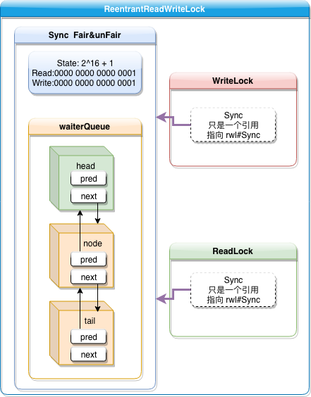

# ReentrantReadWriteLock 

## 介绍


## sourcecode

`ReentrantReadWriteLock`含有两把锁`readerLock`和`writerLock`，其中`ReadLock`和`WriteLock` 都是内部类

```java
/** Inner class providing readlock */
private final ReentrantReadWriteLock.ReadLock readerLock;
/** Inner class providing writelock */
private final ReentrantReadWriteLock.WriteLock writerLock;
/** Performs all synchronization mechanics */
final Sync sync;
```

其中，核心字段 `Sync` 用以控制读写锁的同步机制。

### Sync

* 读写状态存储

```java
    /*
     * Read vs write count extraction constants and functions.
     * Lock state is logically divided into two unsigned shorts:
     * The lower one representing the exclusive (writer) lock hold count,
     * and the upper the shared (reader) hold count.
     */
    static final int SHARED_SHIFT   = 16;
    static final int SHARED_UNIT    = (1 << SHARED_SHIFT);
    static final int MAX_COUNT      = (1 << SHARED_SHIFT) - 1;
    static final int EXCLUSIVE_MASK = (1 << SHARED_SHIFT) - 1;

    /** Returns the number of shared holds represented in count. */
    static int sharedCount(int c)    { return c >>> SHARED_SHIFT; }
    /** Returns the number of exclusive holds represented in count. */
    static int exclusiveCount(int c) { return c & EXCLUSIVE_MASK; }
```

Sync 用 AQS state 状态字段来保存读写锁的状态，**低16位保存独占状态（即写锁），高16位保存共享状态（即读锁）**

#### Sync#tryAcquire

```java
@ReservedStackAccess
protected final boolean tryAcquire(int acquires) {
    /*
     * Walkthrough:
     * 1. If read count nonzero or write count nonzero
     *    and owner is a different thread, fail.
     * 2. If count would saturate饱和, fail. (This can only
     *    happen if count is already nonzero.)
     * 3. Otherwise, this thread is eligible合格的 for lock if
     *    it is either a reentrant acquire or
     *    queue policy allows it. If so, update state
     *    and set owner.
     */
    Thread current = Thread.currentThread();
    int c = getState();
    int w = exclusiveCount(c);
    if (c != 0) {
        // (Note: if c != 0 and w == 0 then shared count != 0)
      	// 如果有读锁（c!=0 && w=0 说明有读锁存在） 或者 (w!=0 && thread!=current)已经有另外一个线程持有写锁了则直接失败
        if (w == 0 || current != getExclusiveOwnerThread())
            return false;
        if (w + exclusiveCount(acquires) > MAX_COUNT)
            throw new Error("Maximum lock count exceeded");
        // Reentrant acquire
        setState(c + acquires);
        return true;
    }
  	// writerShouldBlock 读线程是否应该阻塞，这里 fair 与 unfair 机制有不同实现
    if (writerShouldBlock() ||
        !compareAndSetState(c, c + acquires))
        return false;
    setExclusiveOwnerThread(current);
    return true;
}
```

该方法用于实现获取独占写锁，可以看出来，如果存在读锁，或者当前持有写锁的不是申请线程，则尝试失败。  还可以看出来，读锁不能升级到写锁。

#### Sync#tryAcquireShared 尝试获取读锁

返回值 1成功 -1失败

```java
@ReservedStackAccess
protected final int tryAcquireShared(int unused) {
    /*
     * Walkthrough:
     * 1. If write lock held by another thread, fail.
     * 2. Otherwise, this thread is eligible合格 for
     *    lock wrt state, so ask if it should block
     *    because of queue policy. If not, try
     *    to grant by CASing state and updating count.
     *    Note that step does not check for reentrant
     *    acquires, which is postponed to full version
     *    to avoid having to check hold count in
     *    the more typical non-reentrant case.
     * 3. If step 2 fails either because thread
     *    apparently not eligible or CAS fails or count
     *    saturated, chain to version with full retry loop.
     */
    Thread current = Thread.currentThread();
    int c = getState();
  	/* 
  	 * 其他线程已经获取了写锁，则不能在获取读锁了
  	 * 但是如果是当前线程获取的写锁，则可以继续获取读锁
  	 * 可以看到写锁是可以降级为读锁的
  	 */
    if (exclusiveCount(c) != 0 &&
        getExclusiveOwnerThread() != current)
        return -1;
  	// 如果不需要入队，并且小于最大的读锁数量，则尝试获取读锁
    int r = sharedCount(c);
    if (!readerShouldBlock() && // 不需要入队
        r < MAX_COUNT &&
        compareAndSetState(c, c + SHARED_UNIT)) {// 尝试获取读锁
        if (r == 0) {
          	// 如果还没有读线程，那么当前线程就是第一个读线程
            firstReader = current;
            firstReaderHoldCount = 1;
        } else if (firstReader == current) {
          	// 如果当前线程已经获取了一次读锁，则递增 cnt
            firstReaderHoldCount++;
        } else {
          	// 计数器 ++
            HoldCounter rh = cachedHoldCounter;
            if (rh == null ||
                rh.tid != LockSupport.getThreadId(current))
                cachedHoldCounter = rh = readHolds.get();
            else if (rh.count == 0)
                readHolds.set(rh);
            rh.count++;
        }
        return 1;
    }
    return fullTryAcquireShared(current);
}
```

这里可以看到，如果是第一个获取到`readLock` 的线程，他的线程信息与加锁次数是保存在 `firstReader` 与 `firstReaderHoldCount` 中，而后续读线程，是保存在各自线程的 `ThreadLocal#HoldCounter` 属性里面的

**这里的 HoldCounter 是什么？**

`HoldCounter` 是一个计数器，用 `ThreadLocal` 来保存当前线程持有的数据的数量（这里用来统计 `readLock` 的调用成功次数，即当前线程的读锁数量）

##### Sync#tryAcquireShared => fullTryAcquireShared

在 `tryAcquireShared` 方法中，如果当前线程有合格的条件申请锁，但是在申请锁时，以下条件`!readerShouldBlock() && r < MAX_COUNT && compareAndSetState(c, c + SHARED_UNIT)` 失败的时候，会进入 `fullTryAcquireShared`。该方法采用**自旋锁**控制，而不是中断。

```java
/**
 * Full version of完整版 acquire for reads, that handles CAS misses
 * and reentrant reads not dealt with不被处理 in tryAcquireShared.
 */
final int fullTryAcquireShared(Thread current) {
    /*
     * This code is in part redundant with that in
     * tryAcquireShared but is simpler overall by not
     * complicating tryAcquireShared with interactions between
     * retries and lazily reading hold counts.
     * 这段代码与 tryAcquireShared 部分冗余，由于并没有复杂化tryAcquireShared 内
     * 部的重试和延迟读取 hold counts，所以总体较简单
     */
    HoldCounter rh = null;
    for (;;) {// spinLock
        int c = getState();
      	// 同 tryAcquireShared 一样，存在写锁，且不是当前线程持有，直接失败
        if (exclusiveCount(c) != 0) {
            if (getExclusiveOwnerThread() != current)
                return -1;
            // else we hold the exclusive lock; blocking here
            // would cause deadlock.
        } else if (readerShouldBlock()) {
            // Make sure we're not acquiring read lock reentrantly
            if (firstReader == current) {
                // assert firstReaderHoldCount > 0;
            } else {
                if (rh == null) {
                    rh = cachedHoldCounter;
                    if (rh == null ||
                        rh.tid != LockSupport.getThreadId(current)) {
                        rh = readHolds.get();
                        if (rh.count == 0)
                            readHolds.remove();
                    }
                }
                if (rh.count == 0)
                    return -1;
            }
        }
        if (sharedCount(c) == MAX_COUNT)
            throw new Error("Maximum lock count exceeded");
        if (compareAndSetState(c, c + SHARED_UNIT)) {// 尝试获取锁
            if (sharedCount(c) == 0) {// frist entrant
                firstReader = current;
                firstReaderHoldCount = 1;
            } else if (firstReader == current) {
                firstReaderHoldCount++;// reentrant
            } else {
                if (rh == null)
                    rh = cachedHoldCounter;// 最后一个加锁
                if (rh == null ||
                    rh.tid != LockSupport.getThreadId(current))
                    rh = readHolds.get();
                else if (rh.count == 0)
                    readHolds.set(rh);// 既非头也非尾，第一次加锁，初始化ThreadLocal
                rh.count++;
                cachedHoldCounter = rh; // cache for release
            }
            return 1;
        }
    }
}
```

上面的几个变量说明：

> **firstReader & firstReaderHoldCount** 
>
> `firstReader` is the **first thread to have acquired the read lock.** `firstReaderHoldCount` is **firstReader's hold count**.
> More precisely, <u>`firstReader` is the unique thread that last changed the *shared count* from 0 to 1, and has not released the read lock since then; *null* if there is no such thread.</u>
> Cannot cause garbage retention unless the thread terminated without relinquishing its read locks, since `tryReleaseShared` sets it to *null*.
> Accessed via a benign data race; relies on the memory model's out-of-thin-air`凭空出现，无中生有` guarantees for references.
> ***This allows tracking of read holds for uncontended read locks to be very cheap.***
>
> **readHolds**
>
> ***The number of reentrant read locks held by current thread***. Initialized only in constructor and readObject. Removed whenever a thread's read hold count drops to 0.
>
> **cachedHoldCounter**
>
> <u>The hold count of the **last** thread to successfully acquire readLock</u>. This saves `ThreadLocal` lookup in the common case where the next thread to release is the last one to acquire. This is non-volatile since it is just used as a heuristic`启发式的,探试`, and would be great for threads to cache.
> Can outlive the Thread for which it is caching the read hold count, but avoids garbage retention by not retaining a reference to the Thread.
> Accessed via a benign data race; relies on the memory model's final field and out-of-thin-air guarantees.

#### Sync#tryReleaseShared 尝试释放读锁

```java
@ReservedStackAccess
protected final boolean tryReleaseShared(int unused) {
    Thread current = Thread.currentThread();
    // 修改统计 Counter 字段
    if (firstReader == current) {
        // assert firstReaderHoldCount > 0;
        if (firstReaderHoldCount == 1)
            firstReader = null;// 最后一次释放时把指针置空
        else
            firstReaderHoldCount--;
    } else {
        HoldCounter rh = cachedHoldCounter;
        if (rh == null ||
            rh.tid != LockSupport.getThreadId(current))
            rh = readHolds.get();
        int count = rh.count;
        if (count <= 1) {
            readHolds.remove();
            if (count <= 0)
                throw unmatchedUnlockException();
        }
        --rh.count;
    }
  	// 修改 state 锁状态字段
    for (;;) {
        int c = getState();
        int nextc = c - SHARED_UNIT;
        if (compareAndSetState(c, nextc))
            // Releasing the read lock has no effect on readers,
            // but it may allow waiting writers to proceed if
            // both read and write locks are now free.
            return nextc == 0;
    }
}
```

#### Sync#tryWriteLock

```java
/**
 * Performs tryLock for write, enabling barging in both modes.
 * This is identical in effect to tryAcquire except for lack
 * of calls to writerShouldBlock.
 */
@ReservedStackAccess
final boolean tryWriteLock() {
    Thread current = Thread.currentThread();
    int c = getState();
    if (c != 0) {
        int w = exclusiveCount(c);
      	// c!=0 && w==0 表示存在读锁，此时不能加写锁
      	// 如果持有读锁的线程就是当前线程，则可以继续加锁 （可重入）
        if (w == 0 || current != getExclusiveOwnerThread())
            return false;
        if (w == MAX_COUNT)
            throw new Error("Maximum lock count exceeded");
    }
    // 尝试获取锁
    if (!compareAndSetState(c, c + 1))
        return false;
  	// 设置独占线程
    setExclusiveOwnerThread(current);
    return true;
}
```

#### Sync#tryReadLock

```java
/**
 * Performs tryLock for read, enabling barging in both modes.
 * This is identical in effect to tryAcquireShared except for
 * lack of calls to readerShouldBlock.
 */
@ReservedStackAccess
final boolean tryReadLock() {
    Thread current = Thread.currentThread();
    for (;;) {
        int c = getState();
      	// 其他线程持有读锁，直接失败
        if (exclusiveCount(c) != 0 &&
            getExclusiveOwnerThread() != current)
            return false;
        int r = sharedCount(c);
        if (r == MAX_COUNT)
            throw new Error("Maximum lock count exceeded");
      	// 尝试获取读锁 这里如果并发高，导致CAS miss，则一直重试，直到成功
        if (compareAndSetState(c, c + SHARED_UNIT)) {
            if (r == 0) {
                firstReader = current;
                firstReaderHoldCount = 1;
            } else if (firstReader == current) {
                firstReaderHoldCount++;
            } else {
                HoldCounter rh = cachedHoldCounter;
                if (rh == null ||
                    rh.tid != LockSupport.getThreadId(current))
                    cachedHoldCounter = rh = readHolds.get();
                else if (rh.count == 0)
                    readHolds.set(rh);
                rh.count++;
            }
            return true;
        }
    }
}
```

### NonfairSync

```java
/**
 * Nonfair version of Sync
 */
static final class NonfairSync extends Sync {
    private static final long serialVersionUID = -8159625535654395037L;
    final boolean writerShouldBlock() {
        return false; // writers can always barge
    }
    final boolean readerShouldBlock() {
        /* As a heuristic启发式的 to avoid indefinite无限的 writer starvation饥饿,
         * block if the thread that momentarily立刻，马上 appears to be head
         * of queue, if one exists, is a waiting writer.  This is
         * only a probabilistic或然性，概率的 effect since a new reader will not
         * block if there is a waiting writer behind other enabled
         * readers that have not yet drained排空 from the queue.
         */
        return apparentlyFirstQueuedIsExclusive();
    }
}

```

```java
/**
 * Returns {@code true} if the apparent first queued thread, if one
 * exists, is waiting in exclusive mode.  If this method returns
 * {@code true}, and the current thread is attempting to acquire in
 * shared mode (that is, this method is invoked from {@link
 * #tryAcquireShared}) then it is guaranteed that the current thread
 * is not the first queued thread.  Used only as a heuristic in
 * ReentrantReadWriteLock.
 */
final boolean apparentlyFirstQueuedIsExclusive() {
    Node h, s;
    return (h = head) != null &&
        (s = h.next)  != null &&
        !s.isShared()         &&
        s.thread != null;
}
```

可以看到，在不公平模式下，读锁永远可以不公平，直接插队，但是如果是写锁的话，即使是不公平策略，也要根据队列情况来做不同的处理，如果**队列下一个 Node 是写锁的话，那么读锁必须入队**。这样做是为了**避免在读并发特别高的情况下，写锁一直无法获取锁的现象，即"饥饿"**

### FairSync

```java
/**
 * Fair version of Sync
 */
static final class FairSync extends Sync {
    private static final long serialVersionUID = -2274990926593161451L;
    final boolean writerShouldBlock() {
        return hasQueuedPredecessors();
    }
    final boolean readerShouldBlock() {
        return hasQueuedPredecessors();
    }
}
```

公平锁，无论是读锁，还是写锁，都需要判断是否有等待队列，如果有等待队列，在acquire 方法里面，不能直接 try ，需要**先入队**。

### 整体架构图

读写锁整体架构如下，内部包含一个 AQS队列同步器 Sync，通过二进制的按位拆分，高16位存储读状态，低16位存储写状态，Sync内部定义了申请读锁与申请写锁的逻辑。WriteLock 与ReadLock 是读写锁内部的2个子锁，依然是通过 Sync 来进行同步。



##### 思维误区：AQS锁是一个队列锁，所以理论上应该是不存在读写争用的情况，ReentrantReadWriteLock 是如何实现读锁与读锁不互斥的？

<u>的确如上所属，但是需要理解的是，AQS锁在 acquire 方法内部，是先 tryAcquire的，只有当try 失败的时候，才会去排队，在ReentrantReadWriteLock 内部实现的 AQS 子类 Sync 中，在 Sync 实现的 tryAcquire & tryAcquireShared 方法中，根据读写互斥，读读不互斥的具体需求，实现的读写锁逻辑，此时，如果 head 被读锁持有，一个读锁来申请时，是直接在 try 阶段就返回成功了的，因此不需要排队。这也是为什么即使在不公平模式下，即使当前是读锁，如果head.next 是写锁，读锁也要排队，因为如果并发特别高的情况下，写锁真的会因为一直有读锁持有锁而造成饥饿的现象。</u>

##### 为什么写锁可以降级为读锁，而读锁不可以升级为写锁？

当写锁持有一把锁的时候，由于写锁是独占的，所以肯定只有当前这一把写锁存在，所以可以通过嵌套的方式，在申请一把读锁，然后释放写锁，此时写锁就降级为了读锁，并且由于这把新生成的读锁会互斥其他写锁修改数据，所以可以保证读到改过之后的新数据。

读锁是共享的，所以，同一时间，可能会存在N把读锁，如果当前线程升级为读锁成功，会造成同时存在读锁和写锁都持有锁的情况，不符合设计需求。另外，由于当前线程持有了读锁，再在申请写锁的时候，writeLock.lock  方法由于被读锁阻塞，会造成死锁。

## javadoc

An implementation of `ReadWriteLock` supporting similar semantics`语义` to `ReentrantLock`.
This class has the following properties:

* **Acquisition`获得` order**
  This class does not impose`强制执行` a reader or writer preference ordering for lock access. However, it does support an optional`可选择的` ***fairness*** policy.

  * **Non-fair mode (default)**
    When constructed as non-fair (the default), the order of entry to the read and write lock is unspecified, subject to`受…限制` reentrancy constraints`可重入约束`. **A nonfair lock that is continuously contended may indefinitely postpone one or more reader or writer threads, but will normally have higher throughput than a fair lock.**`持续争用的不公平锁，可能会无限期推迟一个或多个读或者写线程，但是通常会比公平锁具有更高的吞吐量`

  * **Fair mode**
    When constructed as fair, threads contend for entry using an approximately`大约` arrival-order`到达顺序` policy. When the currently held lock is released, either the longest-waiting single writer thread will be assigned the write lock, or if there is a group of reader threads waiting longer than all waiting writer threads, that group will be assigned the read lock.(`either…or 要么…或者`)

    A thread that tries to acquire a fair read lock (non-reentrantly) will block if either the write lock is held, or there is a waiting writer thread. The thread will not acquire the read lock until after the oldest currently waiting writer thread has acquired and released the write lock. Of course, if a waiting writer abandons its wait, leaving one or more reader threads as the longest waiters in the queue with the write lock free, then those readers will be assigned the read lock.

    **A thread that tries to acquire a fair write lock (non-reentrantly) will block unless both the read lock and write lock are free** (which implies`暗示` there are no waiting threads). (Note that the non-blocking `ReentrantReadWriteLock.ReadLock.tryLock()` and `ReentrantReadWriteLock.WriteLock.tryLock()` methods do not honor`支持` this fair setting and will immediately acquire the lock if it is possible, regardless`无视` of waiting threads.)

* **Reentrancy** `可重入性`
  This lock allows both readers and writers to reacquire read or write locks in the style of a `ReentrantLock`. **Non-reentrant readers are not allowed until all write locks held by the writing thread have been released**.
  Additionally`另外`, **a writer can acquire the read lock, but not vice-versa**`反之亦然`. Among`在…中` other applications, reentrancy can be useful when write locks are held during calls or callbacks to methods that perform reads under read locks. If a reader tries to acquire the write lock it will never succeed.

* **Lock downgrading** `锁定降级`
  **Reentrancy also allows downgrading from the write lock to a read lock, by acquiring the write lock, then the read lock and then releasing the write lock. However, upgrading from a read lock to the write lock is <u>not</u> possible**.

* **Interruption of lock acquisition**
  The read lock and write lock both support interruption during lock acquisition.

* **`Condition` support**
  The **write lock** provides a `Condition` implementation that behaves in the same way, with respect to the write lock, as the Condition implementation provided by `ReentrantLock.newCondition` does for `ReentrantLock`. This `Condition` can, of course, only be used with the write lock.
  The <u>read lock does not support a `Condition` and `readLock().newCondition()` throws *UnsupportedOperationException*</u>.

* **Instrumentation**`仪表盘`
  This class supports methods to determine whether locks are held or contended. These methods are designed for monitoring system state, not for synchronization control.

Serialization of this class behaves in the same way as built-in locks: a deserialized lock is in the unlocked state, regardless of its state when serialized.****
**Sample usages.** Here is a code sketch`骨架` showing how to **perform lock** **downgrading** after updating a cache (exception handling is particularly tricky when handling multiple locks in a non-nested fashion`当以非嵌套方式处理多个锁的时候，异常处理特别棘手`):

```java
 class CachedData {
   Object data;
   boolean cacheValid;
   final ReentrantReadWriteLock rwl = new ReentrantReadWriteLock();

   void processCachedData() {
     rwl.readLock().lock();
     if (!cacheValid) {
       // Must release read lock before acquiring write lock
       rwl.readLock().unlock();
       rwl.writeLock().lock();
       try {
         // Recheck state because another thread might have
         // acquired write lock and changed state before we did.
         if (!cacheValid) {
           data = ...
           cacheValid = true;
         }
         // Downgrade by acquiring read lock before releasing write lock
         rwl.readLock().lock();
       } finally {
         rwl.writeLock().unlock(); // Unlock write, still hold read
       }
   	 }

     try {
       use(data);
     } finally {
       rwl.readLock().unlock();
     }
   }
 }
```

`ReentrantReadWriteLocks` can be used to improve concurrency`增强并发性` in some uses of some kinds of Collections. This is typically worthwhile`值得的` only when the collections are expected to be large, accessed by more reader threads than writer threads, and `entail` operations with overhead that outweighs synchronization overhead`entail操作开销重于同步开销`. For example, here is a class using a `TreeMap` that is expected to be large and concurrently accessed.

 

```java
class RWDictionary {
   private final Map<String, Data> m = new TreeMap<>();
   private final ReentrantReadWriteLock rwl = new ReentrantReadWriteLock();
   private final Lock r = rwl.readLock();
   private final Lock w = rwl.writeLock();

   public Data get(String key) {
     r.lock();
     try { return m.get(key); }
     finally { r.unlock(); }
   }
   public List<String> allKeys() {
     r.lock();
     try { return new ArrayList<>(m.keySet()); }
     finally { r.unlock(); }
   }
   public Data put(String key, Data value) {
     w.lock();
     try { return m.put(key, value); }
     finally { w.unlock(); }
   }
   public void clear() {
     w.lock();
     try { m.clear(); }
     finally { w.unlock(); }
   }
 }
```

**Implementation Notes**
This lock supports a maximum of 65535 recursive write locks and 65535 read locks. Attempts to exceed these limits result in Error throws from locking methods.