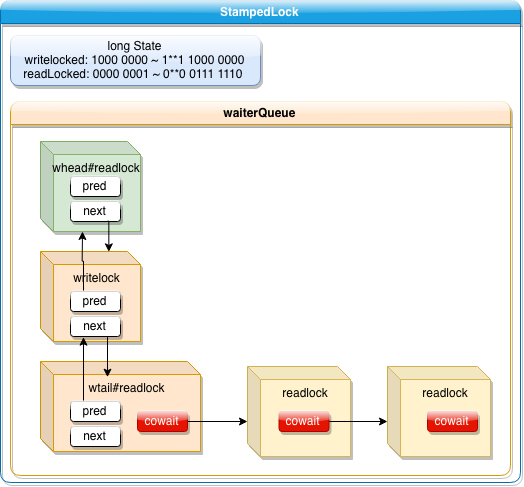

# StampedLock  TODO

## 介绍

since jdk1.8

#### 数据结构



#### 适用场景

## sourcecode

#### 常量字段与解释

```java
/** Number of processors, for spin control */
private static final int NCPU = Runtime.getRuntime().availableProcessors();

/** Maximum number of retries before enqueuing on acquisition; at least 1 */
private static final int SPINS = (NCPU > 1) ? 1 << 6 : 1;

/** Maximum number of tries before blocking at head on acquisition */
private static final int HEAD_SPINS = (NCPU > 1) ? 1 << 10 : 1;

/** Maximum number of retries before re-blocking */
private static final int MAX_HEAD_SPINS = (NCPU > 1) ? 1 << 16 : 1;

/** The period for yielding when waiting for overflow spinlock */
private static final int OVERFLOW_YIELD_RATE = 7; // must be power 2 - 1

/** The number of bits to use for reader count before overflowing */
private static final int LG_READERS = 7;

// Values for lock state and stamp operations
private static final long RUNIT = 1L;                // 00000001
private static final long WBIT  = 1L << LG_READERS;  // 10000000
private static final long RBITS = WBIT - 1L;         // 01111111
private static final long RFULL = RBITS - 1L;				 // 01111110
private static final long ABITS = RBITS | WBIT;			 // 11111111
private static final long SBITS = ~RBITS;            // 10000000 note overlap with ABITS

/*
 * 3 stamp modes can be distinguished辨别 by examining (m = stamp & ABITS):
 * write mode: m == WBIT
 * optimistic read mode: m == 0L (even when read lock is held)
 * read mode: m > 0L && m <= RFULL (the stamp is a copy of state, but the
 * read hold count in the stamp is unused other than to determine mode)
 *
 * This differs slightly from the encoding of state:
 * (state & ABITS) == 0L indicates the lock is currently unlocked.
 * (state & ABITS) == RBITS is a special transient value
 * indicating spin-locked to manipulate reader bits overflow.
 */

/** Initial value for lock state; avoids failure value zero. */
private static final long ORIGIN = WBIT << 1;   // 0001 0000 0000

// Special value from cancelled acquire methods so caller can throw IE
private static final long INTERRUPTED = 1L;

// Values for node status; order matters
private static final int WAITING   = -1;
private static final int CANCELLED =  1;

// Modes for nodes (int not boolean to allow arithmetic)
private static final int RMODE = 0;
private static final int WMODE = 1;
```

#### WNode(wait node) && CLH queue

```java
/** Wait nodes */
static final class WNode {
    volatile WNode prev;
    volatile WNode next;
    volatile WNode cowait;    // list of linked readers  读模式使用该节点形成栈
    volatile Thread thread;   // non-null while possibly parked
    volatile int status;      // 0, WAITING, or CANCELLED
    final int mode;           // RMODE or WMODE
    WNode(int m, WNode p) { mode = m; prev = p; }
}

/** Head of CLH queue */
private transient volatile WNode whead;
/** Tail (last) of CLH queue */
private transient volatile WNode wtail;
```

StampedLockd源码中的WNote就是等待链表队列，每一个WNode标识一个等待线程，whead为CLH队列头，wtail为CLH队列尾，state为锁的状态。long型即64位，**倒数第八位标识写锁状态，如果为1，标识写锁占用**！下面围绕这个state来讲述锁操作。


StampedLock 给我们提供了3种读写模式的锁，如下：

1.写锁writeLock是一个独占锁，同时只有一个线程可以获取该锁，当一个线程获取该锁后，其他请求读锁和写锁的线程必须等待，这跟`ReentrantReadWriteLock` 的写锁很相似，不过要注意的是`StampedLock`的写锁是**不可重入锁**，

当目前没有线程持有读锁或者写锁的时候才可以获取到该锁，请求该锁成功后会返回一个stamp 票据变量来表示该锁的版本，如下源码所示：

```java
/**
 * Exclusively acquires the lock, blocking if necessary
 * until available.
 *
 * @return a write stamp that can be used to unlock or convert mode
 */
@ReservedStackAccess
public long writeLock() {
    long next;
    return ((next = tryWriteLock()) != 0L) 
      ? next 
      : acquireWrite(false, 0L);
}

/**
 * Exclusively acquires the lock if it is immediately available.
 *
 * @return a write stamp that can be used to unlock or convert mode,
 * or zero if the lock is not available
 */
@ReservedStackAccess
public long tryWriteLock() {
  long s;
  return (((s = state) & ABITS/*11111111*/) == 0L) ? tryWriteLock(s) : 0L;
}

private long tryWriteLock(long s) {
  // assert (s & ABITS) == 0L;
  long next;
  if (casState(s, next = s | WBIT/*10000000*/)) {
    VarHandle.storeStoreFence();
    return next;
  }
  return 0L;
}


/**
 * See above for explanation.
 *
 * @param interruptible true if should check interrupts and if so
 * return INTERRUPTED
 * @param deadline if nonzero, the System.nanoTime value to timeout
 * at (and return zero)
 * @return next state, or INTERRUPTED
 */
private long acquireWrite(boolean interruptible, long deadline) {
  WNode node = null, p;
  // 入队
  for (int spins = -1;;) { // spin while enqueuing
    long m, s, ns;
    //无锁
    if ((m = (s = state) & ABITS/*11111111*/) == 0L) {
      if ((ns = tryWriteLock(s)) != 0L)
        return ns;
    }
    else if (spins < 0)
      //持有写锁，并且队列为空，则准备 SPINS 次自旋
      spins = (m == WBIT/*10000000*/ && wtail == whead) ? SPINS : 0;
    else if (spins > 0) {
      --spins;
      Thread.onSpinWait();
    }
    // 走到这一步，表示已经自旋尝试了 SPINS 次了，此时 spins == 0
    else if ((p = wtail) == null) { // initialize queue
      //初始化队列，写锁入队列
      WNode hd = new WNode(WMODE, null);
      if (WHEAD.weakCompareAndSet(this, null, hd))
        wtail = hd;
    }
    else if (node == null)
      //不为空，写锁入队列
      node = new WNode(WMODE, p);
    else if (node.prev != p)
      node.prev = p; // 并发更新纠正
    else if (WTAIL.weakCompareAndSet(this, p, node)) {//node 节点设置为 tail
      p.next = node;
      break;//入队列成功退出循环
    }
  }

  // 自旋
  boolean wasInterrupted = false;
  for (int spins = -1;;) {
    WNode h, np, pp; int ps;
    //前驱节点为头节点 先尝试自旋获取锁
    if ((h = whead) == p) {
      if (spins < 0)
        spins = HEAD_SPINS;
      else if (spins < MAX_HEAD_SPINS)
        spins <<= 1;
      for (int k = spins; k > 0; --k) { // spin at head
        long s, ns;
        // 无锁
        if (((s = state) & ABITS/*11111111*/) == 0L) {
          if ((ns = tryWriteLock(s)) != 0L) {
            whead = node;
            node.prev = null;
            if (wasInterrupted)
              Thread.currentThread().interrupt();
            return ns;
          }
        }
        else
          Thread.onSpinWait();
      }
    }
    
    // 前驱不是头节点，入队等待
    else if (h != null) { // help release stale旧的 waiters
      WNode c; Thread w;
      //头结点为读锁将栈中所有读锁线程唤醒
      while ((c = h.cowait) != null) {
        if (WCOWAIT.weakCompareAndSet(h, c, c.cowait) &&
            (w = c.thread) != null)
          LockSupport.unpark(w);
      }
    }
    if (whead == h) {
      if ((np = node.prev) != p) {
        if (np != null)
          (p = np).next = node;   // stale
      }
      else if ((ps = p.status) == 0)
        //如果前驱节点状态为初始化，则前驱节点置为等待状态
        WSTATUS.compareAndSet(p, 0, WAITING);
      else if (ps == CANCELLED) {
        //如果前驱节点状态为CANCELLED，则移除
        if ((pp = p.prev) != null) {
          node.prev = pp;
          pp.next = node;
        }
      }
      else {
        long time; // 0 argument to park means no timeout
        if (deadline == 0L)
          time = 0L;
        else if ((time = deadline - System.nanoTime()) <= 0L)
          return cancelWaiter(node, node, false);//等待超时
        Thread wt = Thread.currentThread();
        node.thread = wt;
        if (p.status < 0/*WAITTING*/   // 前一个节点正在等待
            // 前一个节点不是头节点，或者目前有读锁或者写锁
            && (p != h || (state & ABITS/*11111111*/) != 0L) 
            && whead == h 
            && node.prev == p) {
          if (time == 0L)
            LockSupport.park(this);
          else
            LockSupport.parkNanos(this, time);
        }
        node.thread = null;
        if (Thread.interrupted()) {
          if (interruptible)
            return cancelWaiter(node, node, true);
          wasInterrupted = true;
        }
      }
    }
  }
}
```

#### unlockWrite

```java
/**
 * If the lock state matches the given stamp, releases the
 * exclusive lock.
 *
 * @param stamp a stamp returned by a write-lock operation
 * @throws IllegalMonitorStateException if the stamp does
 * not match the current state of this lock
 */
@ReservedStackAccess
public void unlockWrite(long stamp) {
    if (state != stamp || (stamp & WBIT) == 0L)
        throw new IllegalMonitorStateException();
    unlockWriteInternal(stamp);
}

private long unlockWriteInternal(long s) {
  long next; WNode h;
  STATE.setVolatile(this, next = unlockWriteState(s));
  if ((h = whead) != null && h.status != 0)
    release(h);
  return next;
}

/**
 * Returns an unlocked state, incrementing the version and
 * avoiding special failure value 0L.
 *
 * @param s a write-locked state (or stamp)
 */
private static long unlockWriteState(long s) {
  // 如果state 溢出，则回退到初始值
  // 这里说明 WBIT 高位都是 write version
  return ((s += WBIT) == 0L) ? ORIGIN : s;
}

/**
 * Wakes up the successor of h (normally whead). This is normally
 * just h.next, but may require traversal from wtail if next
 * pointers are lagging发展缓慢，滞后. This may fail to wake up an acquiring
 * thread when one or more have been cancelled, but the cancel
 * methods themselves provide extra safeguards to ensure liveness.
 */
private void release(WNode h) {
  if (h != null) {
    WNode q; Thread w;
    WSTATUS.compareAndSet(h, WAITING, 0);
    if ((q = h.next) == null || q.status == CANCELLED) {
      for (WNode t = wtail; t != null && t != h; t = t.prev)
        if (t.status <= 0)
          q = t;
    }
    if (q != null && (w = q.thread) != null)
      LockSupport.unpark(w);
  }
}
```

由于读锁是独占的，所以当读锁释放时，state 肯定等于 WBIT#1000 0000

#### readLock

**悲观锁readLock**，是个共享锁，在没有线程获取独占写锁的情况下，同时多个线程可以获取该锁；如果已经有线程持有写锁，其他线程请求获取该锁会被阻塞，这类似ReentrantReadWriteLock 的读锁（不同在于这里的读锁是**不可重入锁**）。

这里说的悲观是指在具体操作数据前，悲观的认为其他线程可能要对自己操作的数据进行修改，所以需要先对数据加锁，**这是在读少写多的情况下的一种考虑**，请求该锁成功后会返回一个stamp票据变量来表示该锁的版本,源码如下：

```java
/**
 * Non-exclusively acquires the lock, blocking if necessary
 * until available.
 *
 * @return a read stamp that can be used to unlock or convert mode
 */
@ReservedStackAccess
public long readLock() {
    long s, next;
    // bypass绕过 acquireRead on common uncontended无争议的 case
    return (whead == wtail
            && ((s = state) & ABITS) < RFULL
            && casState(s, next = s + RUNIT))
        ? next
        : acquireRead(false, 0L);
}

/**
 * See above for explanation.
 *
 * @param interruptible true if should check interrupts and if so
 * return INTERRUPTED
 * @param deadline if nonzero, the System.nanoTime value to timeout
 * at (and return zero)
 * @return next state, or INTERRUPTED
 */
private long acquireRead(boolean interruptible, long deadline) {
  boolean wasInterrupted = false;
  WNode node = null, p;
  for (int spins = -1;;) { //自旋
    WNode h;
    // 判断队列为空
    if ((h = whead) == (p = wtail)) {
      for (long m, s, ns;;) {
        // 读锁持锁
        if ((m = (s = state) & ABITS/*11111111*/) < RFULL/*01111110*/ ? 
            // 如果读锁还未到最大值，增加state读锁cnt，"否则增加readOverFlow"
            // 读锁总量<最大值，则+1<=最大值，直接尝试递增RUNIT
            casState(s, ns = s + RUNIT) :
            (m < WBIT/*10000000*/ && (ns = tryIncReaderOverflow(s)) != 0L)) {
          if (wasInterrupted)
            Thread.currentThread().interrupt();
          //获取锁成功返回
          return ns;
        }
        // 写锁持锁
        else if (m >= WBIT/*10000000*/) {
          if (spins > 0) {
            --spins;
            Thread.onSpinWait();
          }
          else {
            if (spins == 0) { 
              WNode nh = whead, np = wtail;
              // 自旋 SPINS 次之后头尾都没变，或者有节点加入，都中断自旋
              if ((nh == h && np == p) || (h = nh) != (p = np)/*有节点入队*/)
                break;
            }
            // 自旋 SPINS 次
            spins = SPINS;
          }
        }
      }
    }
    if (p == null) { // initialize queue
      WNode hd = new WNode(WMODE, null);
      if (WHEAD.weakCompareAndSet(this, null, hd))
        wtail = hd;
    }
    else if (node == null)
      //不为空，读锁入队
      node = new WNode(RMODE, p);
    /*
    当前队列为空即只有一个节点（whead=wtail）或者当前尾节点的模式不是RMODE，
    那么我们会尝试在尾节点后面添加该节点作为尾节点，然后跳出外层循环
    */
    else if (h == p || p.mode != RMODE) {
      if (node.prev != p)
        node.prev = p;
      else if (WTAIL.weakCompareAndSet(this, p, node)) {
        p.next = node;
        break;
      }
    }
		// 如果上一个节点不是头节点，且是 RMODE ，则直接加入 cowait 读锁组
    // 这里先把 p.cowait  给 node.cowait，再把 node 给p.cowait
    else if (!WCOWAIT.compareAndSet(p, node.cowait = p.cowait, node))
      node.cowait = null;//失败时，回滚掉条件代码块的 node.cowait = p.cowait 赋值语句
    else {// 该代码块里面，p 是 RMODE，并且 node 已经加入了 p.cowait 里面去
      /*通过CAS方法将该节点node添加至尾节点的cowait链中，node成为cowait中的顶元素，
      cowait构成了一个LIFO队列。*/
      for (;;) {
        WNode pp, c; Thread w;
        //尝试unpark头元素（whead）的cowait中的第一个元素,假如是读锁会通过循环释放cowait链
        if ((h = whead) != null && (c = h.cowait) != null &&
            WCOWAIT.compareAndSet(h, c, c.cowait) &&
            (w = c.thread) != null) // help release
          LockSupport.unpark(w);
        if (Thread.interrupted()) {
          if (interruptible)
            return cancelWaiter(node, p, true);
          wasInterrupted = true;
        }
        //node所在的根节点p的前驱就是whead或者p已经是whead或者p的前驱为null
        if (h == (pp = p.prev) || h == p || pp == null) {
          long m, s, ns;
          do {
            //根据state再次积极的尝试获取锁
            if ((m = (s = state) & ABITS) < RFULL ?
                casState(s, ns = s + RUNIT) :
                (m < WBIT &&
                 (ns = tryIncReaderOverflow(s)) != 0L)) {
              if (wasInterrupted)
                Thread.currentThread().interrupt();
              return ns;
            }
          } while (m < WBIT);//条件为读模式
        }
        if (whead == h && p.prev == pp) {
          long time;
          if (pp == null || h == p || p.status > 0) {
            //这样做的原因是被其他线程闯入夺取了锁，或者p已经被取消
            node = null; // throw away
            break;
          }
          // 超时处理
          if (deadline == 0L)
            time = 0L;
          else if ((time = deadline - System.nanoTime()) <= 0L) {
            if (wasInterrupted)
              Thread.currentThread().interrupt();
            return cancelWaiter(node, p, false);
          }
          // 继续等待
          Thread wt = Thread.currentThread();
          node.thread = wt;
          if ((h != pp || (state & ABITS) == WBIT) 
              && whead == h 
              && p.prev == pp) {
            if (time == 0L)
              LockSupport.park(this);
            else
              LockSupport.parkNanos(this, time);
          }
          node.thread = null;
        }
      }
    }
  }

  for (int spins = -1;;) {
    WNode h, np, pp; int ps;
    if ((h = whead) == p) {
      if (spins < 0)
        spins = HEAD_SPINS;
      else if (spins < MAX_HEAD_SPINS)
        spins <<= 1;
      for (int k = spins;;) { // spin at head
        long m, s, ns;
        if ((m = (s = state) & ABITS) < RFULL ?
            casState(s, ns = s + RUNIT) :
            (m < WBIT && (ns = tryIncReaderOverflow(s)) != 0L)) {
          WNode c; Thread w;
          whead = node;
          node.prev = null;
          while ((c = node.cowait) != null) {
            if (WCOWAIT.compareAndSet(node, c, c.cowait) &&
                (w = c.thread) != null)
              LockSupport.unpark(w);
          }
          if (wasInterrupted)
            Thread.currentThread().interrupt();
          return ns;
        }
        else if (m >= WBIT && --k <= 0)
          break;
        else
          Thread.onSpinWait();
      }
    }
    else if (h != null) {
      WNode c; Thread w;
      while ((c = h.cowait) != null) {
        if (WCOWAIT.compareAndSet(h, c, c.cowait) &&
            (w = c.thread) != null)
          LockSupport.unpark(w);
      }
    }
    if (whead == h) {
      if ((np = node.prev) != p) {
        if (np != null)
          (p = np).next = node;   // stale
      }
      else if ((ps = p.status) == 0)
        WSTATUS.compareAndSet(p, 0, WAITING);
      else if (ps == CANCELLED) {
        if ((pp = p.prev) != null) {
          node.prev = pp;
          pp.next = node;
        }
      }
      else {
        long time;
        if (deadline == 0L)
          time = 0L;
        else if ((time = deadline - System.nanoTime()) <= 0L)
          return cancelWaiter(node, node, false);
        Thread wt = Thread.currentThread();
        node.thread = wt;
        if (p.status < 0 &&
            (p != h || (state & ABITS) == WBIT) &&
            whead == h && node.prev == p) {
          if (time == 0L)
            LockSupport.park(this);
          else
            LockSupport.parkNanos(this, time);
        }
        node.thread = null;
        if (Thread.interrupted()) {
          if (interruptible)
            return cancelWaiter(node, node, true);
          wasInterrupted = true;
        }
      }
    }
  }
}

/**
 * Tries to increment readerOverflow by first setting state
 * access bits value to RBITS, indicating hold of spinlock,
 * then updating, then releasing.
 *
 * @param s a reader overflow stamp: (s & ABITS) >= RFULL
 * @return new stamp on success, else zero
 */
private long tryIncReaderOverflow(long s) {
  // assert (s & ABITS) >= RFULL;
  if ((s & ABITS) == RFULL) {  //ABITS#11111111 RFULL#01111110
    if (casState(s, s | RBITS)) { //RBITS#01111111
      ++readerOverflow;// extra reader count when state read count saturated饱和
      STATE.setVolatile(this, s);
      return s;
    }
  }
  else if ((LockSupport.nextSecondarySeed() & OVERFLOW_YIELD_RATE) == 0)
    Thread.yield();
  else
    Thread.onSpinWait();
  return 0L;
}
```

乐观锁失败后锁升级为readLock()：尝试state+1,用于统计读线程的数量，如果失败，进入acquireRead()进行自旋，通过CAS获取锁。

如果自旋失败，入CLH队列，然后再自旋，如果成功获得读锁，则激活cowait队列中的读线程Unsafe.unpark(),如果最终依然失败，则Unsafe().park()挂起当前线程。

## javadoc

**A capability-based`基于容量` lock** with **three modes** for controlling read/write access. The **state** of a `StampedLock` consists of a **version and mode**. Lock acquisition methods return a **stamp** that represents and controls access <u>with respect to</u>`关于` a lock state; "**try**" **versions of** these methods may instead return the special value *zero* to represent failure to acquire access. Lock release and conversion`转换` methods require stamps as arguments, and fail if they do not **match** the state of the lock. The three modes are:

* **Writing**. Method `writeLock` possibly blocks waiting for **exclusive** access, **returning a stamp that can be used in method `unlockWrite` to release the lock**. Untimed and timed versions of `tryWriteLock` are also provided. When the lock is held in write mode, no read locks may be obtained, and all optimistic`乐观` read validations will fail.
* **Reading**. Method `readLock` possibly blocks waiting for **non-exclusive** access, returning a **stamp** that can be used in method `unlockRead` to release the lock. Untimed and timed versions of `tryReadLock` are also provided.
* **Optimistic Reading**. Method `tryOptimisticRead` returns a non-zero **stamp** only if the lock is not currently held in write mode. **Method `validate` returns true if the lock has not been acquired in write mode since obtaining a given stamp.** *This mode can be thought of`认为是` as an extremely`非常` weak version of a read-lock, that can be broken by a writer at any time.* **The use of optimistic mode for short read-only code segments often <u>reduces contention</u> and <u>improves throughput</u>**. However, its use is inherently`内在` fragile`脆弱`. Optimistic read sections`部分` should only read fields and hold them in local variables <u>for later use after **validation**</u>. Fields read while in optimistic mode may be wildly`极度` inconsistent`不一致`, so usage applies only when you <u>are familiar enough with</u>`极度熟悉` data representations to check consistency and/or repeatedly invoke method `validate()`. For example, such steps are typically required when first reading an object or array reference, and then accessing one of its fields, elements or methods.

This class also supports methods that conditionally`有条件地` provide <u>conversions across</u>`转换` the three modes. For example, method `tryConvertToWriteLock` attempts to "upgrade" a mode, returning a valid write stamp if (1) already in writing mode (2) in reading mode and there are no other readers or (3) in optimistic mode and the lock is available. The forms of these methods are designed to help reduce some of the code bloat`臃肿` that otherwise`否则` occurs in retry-based`基于重试` designs.

StampedLocks are **designed for use as internal utilities`公共程序` in the development of thread-safe components**. Their use relies on knowledge of`了解` the internal properties of the data, objects, and methods they are protecting. **They are not reentrant**, so locked bodies should not call other unknown methods that may try to re-acquire locks (although you may pass a stamp to other methods that can use or convert it). The use of read lock modes relies on the associated code sections being side-effect-free`无副作用`. Unvalidated`未验证的` optimistic read sections cannot call methods that are not known to`不知道` <u>tolerate potential inconsistencies</u>`容忍潜在的不一致性`. Stamps use finite`有限的` representations, and are not cryptographically`密码学` secure`保护` (i.e., a valid stamp may be guessable`可猜测的`). Stamp values may **recycle** after (no sooner than) one year of continuous operation. A stamp held without use or validation for longer than this period may fail to validate correctly. StampedLocks are serializable, but always deserialize into initial unlocked state, so they are not useful for remote locking.

  Like `Semaphore`, but unlike most `Lock` implementations, StampedLocks **have no notion of ownership**. Locks acquired in one thread can be released or converted in another.
  **The scheduling policy of StampedLock does not consistently prefer`一贯喜欢` readers over writers or <u>vice versa</u>`反之亦然`**. All "try" methods are best-effort and do not necessarily conform to any scheduling or fairness policy. A zero return from any "try" method for acquiring or converting locks does not carry any information about the state of the lock; a subsequent`随后的` invocation may succeed.
  Because it supports **coordinated** usage across multiple lock modes, this class does not directly implement the `Lock` or `ReadWriteLock` interfaces. However, a `StampedLock` may be viewed `asReadLock()`, `asWriteLock()`, or `asReadWriteLock()` in applications requiring only the associated set of functionality.

  **Sample Usage**. The following illustrates`表明` some usage idioms`习惯` in a class that maintains simple two-dimensional`二维的` points. The sample code illustrates some try/catch conventions even though they are not strictly needed here because no exceptions can occur in their bodies.

```java
 class Point {
   private double x, y;
   private final StampedLock sl = new StampedLock();

   void move(double deltaX, double deltaY) { // an exclusively locked method
     long stamp = sl.writeLock();
     try {
       x += deltaX;
       y += deltaY;
     } finally {
       sl.unlockWrite(stamp);
     }
   }

   double distanceFromOrigin() { // A read-only method
     long stamp = sl.tryOptimisticRead();
     double currentX = x, currentY = y;
     if (!sl.validate(stamp)) {
       stamp = sl.readLock();
       try {
         currentX = x;
         currentY = y;
       } finally {
         sl.unlockRead(stamp);
       }
     }
     return Math.sqrt(currentX * currentX + currentY * currentY);
   }

   void moveIfAtOrigin(double newX, double newY) { // upgrade
     // Could instead start with optimistic, not read mode
     long stamp = sl.readLock();
     try {
       while (x == 0.0 && y == 0.0) {
         long ws = sl.tryConvertToWriteLock(stamp);
         if (ws != 0L) {
           stamp = ws;
           x = newX;
           y = newY;
           break;
         }
         else {
           sl.unlockRead(stamp);
           stamp = sl.writeLock();
         }
       }
     } finally {
       sl.unlock(stamp);
     }
   }
 }
```


## Algorithmic notes

Algorithmic notes: The design employs elements of Sequence locks (as used in linux kernels; see Lameter's http://www.lameter.com/gelato2005.pdf and elsewhere; see Boehm's http://www.hpl.hp.com/techreports/2012/HPL-2012-68.html) and Ordered RW locks (see Shirako et al http://dl.acm.org/citation.cfm?id=2312015) 

Conceptually·, the primary state of the lock includes a sequence number that is odd`奇数` when write-locked and even otherwise. However, this is **offset** by a reader count that is non-zero when read-locked. The read count is ignored when validating "optimistic" seqlock-reader-style stamps. Because we must use a small finite`有限的` number of bits (currently 7) for readers, **a supplementary`额外的` reader overflow word is used when the number of readers exceeds the count field**. We do this by treating the max reader count value (RBITS) as a spinlock protecting overflow updates. 

Waiters use a *modified* form of CLH lock used in `AbstractQueuedSynchronizer` (see its internal documentation for a fuller account), where each **node** **is tagged** (field **mode**) as either a reader or writer. **Sets of waiting readers are grouped** (linked) under a common node (field **cowait**) so act as a single node with respect to most CLH mechanics. By virtue of`有...优点` the queue structure, wait nodes need not actually carry sequence numbers; we know each is greater than its predecessor. This simplifies the scheduling policy to a mainly-FIFO scheme`方案` that incorporates`包含` elements of `Phase-Fair阶段公平` locks (see Brandenburg & Anderson, especially http://www.cs.unc.edu/~bbb/diss/). In particular, we use the phase-fair anti-barging`无冲突` rule: If an incoming reader arrives while read lock is held but there is a queued writer, this incoming reader is queued. (This rule is responsible for`负责` some of the complexity of method `acquireRead`, but without it`如果不这样`, the lock becomes highly unfair.) Method `release` does not (and sometimes cannot) itself wake up **cowaiters**. This is done by the primary thread, but helped by any other threads with nothing better to do in methods `acquireRead` and `acquireWrite`. 

These rules apply to threads actually queued. All `tryLock` forms opportunistically`机会主义的` try to acquire locks regardless of preference rules, and so may "barge" their way in. **Randomized spinning** is used in the `acquire` methods to **reduce (increasingly expensive`越来越贵`) context switching while also avoiding sustained`持续的` memory thrashing`颠簸,震荡` among many threads**. We limit spins to the head of queue. If, upon wakening, a thread fails to obtain lock, and is still (or becomes) the first waiting thread (which indicates that some other thread barged and obtained lock), it escalates`加剧` spins (up to MAX_HEAD_SPINS) to reduce the likelihood`可能` of continually losing to barging threads. 

Nearly all of these mechanics are carried out in methods `acquireWrite` and `acquireRead`, that, as typical of such code, sprawl out`散开` because actions and retries rely on consistent sets of locally cached reads. 

As noted in Boehm's paper (above), sequence validation (mainly method `validate()`) requires stricter ordering rules than apply to normal volatile reads (of "state"). To force orderings of reads before a validation and the validation itself in those cases where this is not already forced, we use `acquireFence`. Unlike in that paper, we allow writers to use plain writes. One would not expect reorderings of such writes with the lock acquisition CAS because there is a "control dependency", but it is theoretically possible, so we additionally add a `storeStoreFence` after lock acquisition CAS. 

----------------------------------------------------------------

Here's an informal proof`证明` that plain reads by _successful_ readers see plain writes from preceding but not following writers (following Boehm and the C++ standard [atomics.fences]): 

Because of the total synchronization order of accesses to volatile long state containing the sequence number, writers and _successful_ readers can be globally sequenced. 

```c++
int x, y; 

Writer 1: 
inc sequence (odd - "locked") 
storeStoreFence();
x = 1; y = 2; 
inc sequence (even - "unlocked") 

Successful Reader: 
read sequence (even) 
// must see writes from Writer 1 but not Writer 2 
r1 = x; r2 = y; 
acquireFence(); 
read sequence (even - validated unchanged) 
// use r1 and r2 

Writer 2: 
inc sequence (odd - "locked") 
storeStoreFence(); 
x = 3; y = 4; 
inc sequence (even - "unlocked") 
```

Visibility of writer 1's stores is normal - reader's initial read of state synchronizes with writer 1's final write to state. Lack of visibility of writer 2's plain writes is less obvious. If reader's read of x or y saw writer 2's write, then (assuming semantics of C++ fences) the storeStoreFence would "synchronize" with reader's acquireFence and reader's validation read must see writer 2's initial write to state and so validation must fail. But making this "proof" formal and rigorous is an open problem! 

----------------------------------------------------------------

The memory layout keeps lock state and queue pointers together (normally on the same cache line). This usually works well for read-mostly loads. In most other cases, the natural tendency of adaptive-spin CLH locks to reduce memory contention lessens motivation to further spread out contended locations, but might be subject to future improvements.