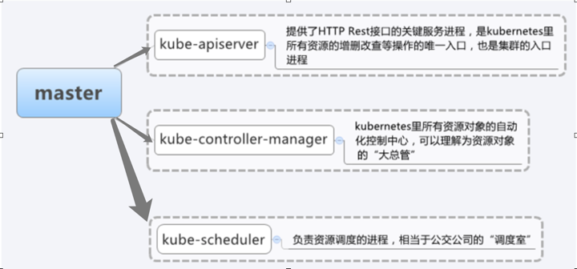
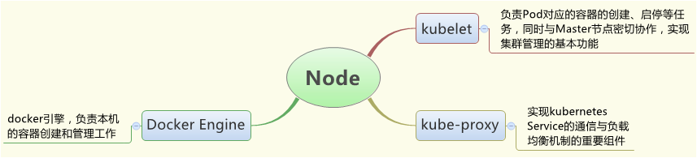
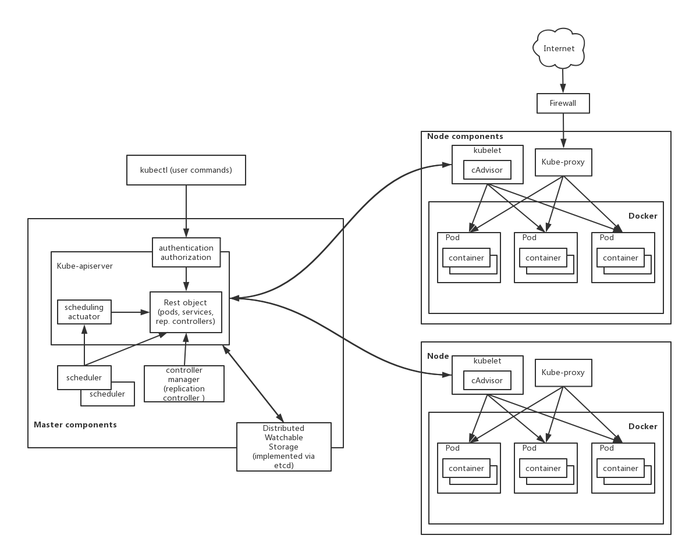

官方地址 <https://kubernetes.io/docs/home/>
 
# Kubernetes主要概念：
在Kubernetes中，Node、Pod、Replication Controller、Service等概念都可以看作一种资源对象，通过Kubernetes提供的Kubectl工具或者API调用进行操作，Kubernetes集群的元数据保存在etcd中。
1. Node：是Kubernetes集群中相对于Master而言的工作主机（可以是物理主机，虚拟主机vm，云主机ECS)。在每个Node上运行有Kubelet进程用于启动和管理Pod，Node被Master管理，在Node上运行的服务进程包括Kubelet、kube-proxy和docker daemon。当某个Node宕机时，Master会将其工作负载(部署在上面的业务型pod)转移到其他节点，Node有三种状态，包括Pending（等待创建）、Running（运行中）、Terminated（异常终止）。
2. Pods：Pod是Kubernetes的基本操作单元，其内部包含一个或多个紧密相关的容器，通常Pod里的容器运行相同的应用，Pod包含的容器运行在同一个node上。pod中的容器共享相同的磁盘和网络，彼此之间可以通过localhost相互通信。Kubernetes为每个Pod分配唯一的IP地址（Pod的IP地址是Docker Daemon根据br0网桥的IP地址段进行分配的）。在多数情况下pod就像一台服务器，pod中的容器就像在服务器上运行的进程。
3. Services：Services也是Kubernetes的基本操作单元，一个Service可以看作由一组pod组成的集群对外接受请求访问的接口，外部不需要了解pod集群如何运行，只需要引用Services IP（通常称为 “Cluster IP”）和Service Port就能访问pod集群提供的服务。
4. Node Controller：Node Controller是Master中的一个组件，用于管理Node对象。它有两个主要功能，集群内的Node信息同步和单个Node的生命周期管理。
5. Replication Controllers(副本控制器)：ReplicationController确保预先定义的某个业务集群中pod数量稳定。 如果该业务集群中 pod 数量超过预定义值，它会杀死多余的pod。 如果少于预定义值，它会启动新的pod。
6. Namespace: 命名空间为Kubernetes集群提供虚拟的隔离作用，Kubernetes集群初始有两个命名空间，分别是默认命名空间default和系统命名空间kube-system。
7. Volume：Kubernetes的存储卷的生命周期，作用范围是Pod。每个Pod中声明的存储卷由Pod中的所有容器共享。

## Kubernetes主要构件：
### Kubernetes-Master
Kubernetes master 负责维护集群的所需状态。当需要与 Kubernetes 进行交互时（例如使用 kubectl 命令行界面），就是在与集群的 Kubernetes master 进行通信。

1. Kubernetes API Server：作为Kubernetes系统的入口，其封装了核心对象的增删改查操作，以RESTful API接口方式提供给外部客户和内部组件调用。维护的REST对象持久化到Etcd中存储；

2. Kubernetes Scheduler：为新建立的Pod进行节点(node)选择(即分配机器)，负责集群的资源调度。组件抽离，可以方便替换成其他调度器；

3. Kubernetes Controller：负责执行各种控制器，目前已经提供多种控制器来保证Kubernetes的正常运行。
    
    
### Kubernetes-Node
Kubernetes集群中的 node 是运行应用程序和云工作流的机器（虚拟机，物理服务器等）。Kubernetes master 控制每个 node;一般不会和node直接进行交互。

1. Kubelet：作为一个进程运行在node节点上，主要功能包含容器管理，镜像管理，Volume管理等。同时kubelet也是一个rest服务，和pod相关的命令操作都是通过调用接口实现的。Kubelet会从Kubernetes API Server接收Pod的创建请求，启动和停止容器，监控容器运行状态并汇报给Kubernetes API Server；

2. Kube-proxy：负责为Pod创建代理服务，Kubernetes Proxy会从Kubernetes API Server获取所有的Service信息，并根据Service的信息创建代理服务，实现Service到Pod的请求路由和转发，从而实现Kubernetes层级的虚拟转发网络，用于实现Kubernetes的service机制。kuber-proxy可提供一部分SDN功能以及集群内部的智能LoadBalancer(默认通过内核iptables实现)；

3. Docker：Node上需要运行容器服务。
    
    
## Kubernetes-Etcd
1. 一个高可用强一致性的服务发现存储仓库，作为Kubernetes其中的一个组件，是其他服务的配置中心，并提供存储服务。其保存了所有组件的定义以及状态，Kubernetes的多个组件之间的互相交互（通过HTTP+JSON的API方式交互）也主要通过etcd。在kubernetes中，所有数据的存储（包括各种对象的状态和元信息配置）以及操作记录都在etcd中进行存储，所以对于kubernetes集群来说，etcd是相当重要的，一旦故障，可能导致整个集群的瘫痪或者数据丢失；

2. 网络插件flannel、calico等其它网络插件需要用到etcd存储网络的配置信息；

3. 提供etcdctl命令行客户端，使用一些简洁的命令，供用户直接跟 etcd 服务打交道。
    
### etcdctl常用命令
etcdctl的v3版本与v2版本使用命令有所不同，可编辑环境变量，默认版本为v3版本。  
`vim /etc/profile`   
`export ETCDCTL_API=3`
 
查看etcd版本  
$ENDPOINTS若在etcd集群机器上操作，可不指定，默认为"http://127.0.0.1:2379"  
`etcdctl --endpoints=$ENDPOINTS version`
 
增加一条数据  
`etcdctl --endpoints=$ENDPOINTS put foo "Hello World!"`
 
查询一条数据  
`etcdctl --endpoints=$ENDPOINTS get foo`
 
查询相同前缀数据  
`etcdctl --endpoints=$ENDPOINTS get --prefix /foo`
  
更新一条数据  
`etcdctl --endpoints=$ENDPOINTS update foo foo2`
 
删除一条数据  
`etcdctl --endpoints=$ENDPOINTS del foo`
 
查看集群状态  
`etcdctl --write-out=table --endpoints=$ENDPOINTS endpoint status`
 
查看集群成员  
`etcdctl --endpoints=$ENDPOINTS member list -w table`

更多命令可参考  
`etcdctl --help`

## Kubernetes-kubectl
通过客户端的kubectl命令行操作，API Server响应对应的命令结果，从而达到对kubernetes集群的管理。kubectl是操作 kubernetes 集群的最直接和最有效的途径;
### kubectl常用命令参考  
    
1. 显示和查找资源   Get commands with basic output
    >$ `kubectl get services`                          # 列出所有 namespace 中的所有 service  
$ `kubectl get pods --all-namespaces`             # 列出所有 namespace 中的所有 pod  
$ `kubectl get pods -o wide`                      # 列出所有 pod 并显示详细信息  
$ `kubectl get deployment my-dep`                 # 列出指定 deployment  
$ `kubectl get pods --include-uninitialized`      # 列出该 namespace 中的所有 pod 包括未初始化的  
$ `kubectl cluster-info`                          # 显示 master 和服务的地址  

2. 使用详细输出来描述命令  
    >$ `kubectl describe nodes my-node`  
$ `kubectl describe pods my-pod`  
$ `kubectl get services --sort-by=.metadata.name` # List Services Sorted by Name

3. 查看log
    >$ `kubectl logs -f -c containername podname` # 如果pod里面只有一个container，-c可省略

4. 根据重启次数排序列出 pod
    >$ `kubectl get pods --sort-by='.status.containerStatuses[0].restartCount'`

5. 获取所有具有 app=cassandra 的 pod 中的 version 标签
    >$ `kubectl get pods --selector=app=cassandra rc -o jsonpath='{.items[*].metadata.labels.version}'`

6. 获取所有节点的 ExternalIP
    >$ `kubectl get nodes -o jsonpath='{.items[*].status.addresses[?(@.type=="ExternalIP")].address}'`

7. 列出属于某个 PC 的 Pod 的名字  
“jq”命令用于转换复杂的 jsonpath，参考 https://stedolan.github.io/jq/
    >$ `sel=${$(kubectl get rc my-rc --output=json | jq -j '.spec.selector | to_entries | .[] | "\(.key)=\(.value),"')%?}`  
$ `echo $(kubectl get pods --selector=$sel --output=jsonpath={.items..metadata.name})`

8. 查看哪些节点已就绪
    >$ `JSONPATH='{range .items[*]}{@.metadata.name}:{range @.status.conditions[*]}{@.type}={@.status};{end}{end}' && kubectl get nodes -o jsonpath="$JSONPATH" | grep "Ready=True"`

9. 列出当前 Pod 中使用的 Secret
    >$ `kubectl get pods -o json | jq '.items[].spec.containers[].env[]?.valueFrom.secretKeyRef.name' | grep -v null | sort | uniq`

10. 更新资源
    >$ `kubectl rolling-update frontend-v1 -f frontend-v2.json`           # 滚动更新 pod frontend-v1  
$ `kubectl rolling-update frontend-v1 frontend-v2 --image=image:v2`  # 更新资源名称并更新镜像  
$ `kubectl rolling-update frontend --image=image:v2`                 # 更新 frontend pod 中的镜像  
$ `kubectl rolling-update frontend-v1 frontend-v2 --rollback`        # 退出已存在的进行中的滚动更新  
$ `cat pod.json | kubectl replace -f -`                              # 基于 stdin 输入的 JSON 替换 pod

11. 强制替换，删除后重新创建资源。会导致服务中断。
    >$ `kubectl replace --force -f ./pod.json`

12. 为 nginx RC 创建服务，启用本地 80 端口连接到容器上的 8000 端口
    >$ `kubectl expose rc nginx --port=80 --target-port=8000`

13. 更新单容器 pod 的镜像版本（tag）到 v4
    >$ `kubectl get pod mypod -o yaml | sed 's/\(image: myimage\):.*$/\1:v4/' | kubectl replace -f -`

14. 添加标签
    >$ `kubectl label pods my-pod new-label=awesome`                      # 添加pod标签  
$ `kubectl label node node-name new-label=awesome`                   # 添加node标签  
$ `kubectl annotate pods my-pod icon-url=http://goo.gl/XXBTWq`       # 添加注解  
$ `kubectl autoscale deployment foo --min=2 --max=10`                # 自动扩展 deployment “foo”  
$ `kubectl get nodes --show-labels`                                  # 显示标签  
$ `kubectl label nodes nodename labelname- `                         # 删除label   

15. 删除资源
    >$ `kubectl delete -f ./pod.json` # 删除 pod.json 文件中定义的类型和名称的 pod  
$ `kubectl delete pod,service baz foo` # 删除名为“baz”的 pod 和名为“foo”的 service  
$ `kubectl delete pods,services -l name=myLabel` # 删除具有 name=myLabel 标签的 pod 和 serivce  
$ `kubectl delete pods,services -l name=myLabel --include-uninitialized` # 删除具有 name=myLabel 标签的 pod 和 service，包括尚未初始化的  
$ `kubectl -n my-ns delete po,svc --all` # 删除 my-ns namespace 下的所有 pod 和 serivce，包括尚未初始化的

16. 与节点和集群交互
    >$ `kubectl cordon my-node`                                                # 标记 my-node 不可调度  
$ `kubectl drain my-node`                                                 # 清空 my-node 以待维护  
$ `kubectl uncordon my-node`                                              # 标记 my-node 可调度  
$ `kubectl top node my-node`                                              # 显示 my-node 的指标度量  
$ `kubectl cluster-info`                                                  # 显示 master 和服务的地址  
$ `kubectl cluster-info dump`                                             # 将当前集群状态输出到 stdout         
$ `kubectl cluster-info dump --output-directory=/path/to/cluster-state`   # 将当前集群状态输出到 /path/to/cluster-state  

17. 如果该键和影响的污点（taint）已存在，则使用指定的值替换
    >$ `kubectl taint nodes foo dedicated=special-user:NoSchedule`
        
# Kubernetes系统架构图：

