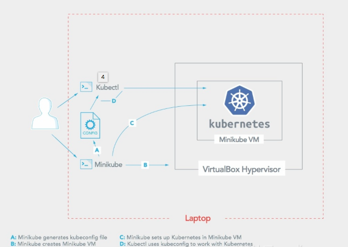

# Minikube 介绍
Minikube支持Kubenetes的以下特性：
* DNS
* NodePorts
* ConfigMaps and Secrets
* Dashboards
* Container Runtime: Docker, rkt and CRI-O
* Enabling CNI (Container Network Interface)
* Ingress

# Minikube 安装
因为 Google 在国内没办法访问，我使用了阿里版的 Minikube 。
Minikube运行要求安装有VirtualBox或VMWare Fusion，我用的是VirtualBox。
VirtualBox安装很简单，从 官方下载DMG 安装即可。

## 下载安装 Minikube
`curl -Lo minikube http://kubernetes.oss-cn-hangzhou.aliyuncs.com/minikube/releases/v0.33.1/minikube-darwin-amd64 && chmod +x minikube && sudo mv minikube /usr/local/bin/`

## 启动 Minikube
`minikube start --registry-mirror=https://registry.docker-cn.com`

    如果你遇到这个错误，Error restarting cluster: restarting kube-proxy: waiting for kube-proxy to be up for configmap update: timed out waiting for the condition
    通过 minikube delete，minikube start 可以解决
    
## 打开 Minikube 控制台
`minikube dashboard`

# minikube架构图

