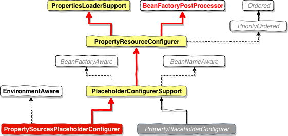

# 使用方式

在 Spring 配置文件中，通过如下方式启动 配置文件加载

```xml
<bean class="org.springframework.beans.factory.config.PropertyPlaceholderConfigurer">
    <property name="ignoreResourceNotFound" value="true"/>
    <property name="locations">
        <list>
            <value>classpath:jdbc.properties</value>
        </list>
    </property>
</bean>
```

或者

```xml
<context:property-placeholder location="classpath:jdbc.properties" order="1" ignore-unresolvable="true"/>
```

以上2种方式都可以开启配置文件自动加载，我们今天主要通过 `PropertyPlaceholderConfigurer` 来分析配置文件加载的流程。

> 在配置 Bean 的时候需要注意，如果是通过 <bean> 标签来定义 Bean，如果有属性通过 @Value 注解来注入属性，则不会生效，必须在 <bean> 标签里面定义，如果是通过 `context:component-scan` 标签来自动扫描 bean，则可以通过 @Value 注解来注入。

# 源码解读

## PropertyPlaceholderConfigurer 

首先分析下 `PropertyPlaceholderConfigurer` 的类图



在更早的 Spring 版本里面，我们一般使用 右下角的灰色的`PropertyPlaceholderConfigurer` ，在高版本中，该类不建议使用，并提供了可替换的 `PropertySourcesPlaceholderConfigurer` ，相比较老版本，它多出来一个 `EnvironmentAware` 接口。我们可以看到 `PropertySourcesPlaceholderConfigurer`  实现了 `BeanFactoryPostProcessor` 接口，表示它会在 `BeanFactory` 初始化的时候做一些事情。

我们从 AbstractApplicationContext 方法看起

在 `ConfigurableListableBeanFactory beanFactory = obtainFreshBeanFactory();`  方法内部，实现了 Bean 的加载，也就是我们定义的 `PropertySourcesPlaceholderConfigurer` 对象，该BeanDefenition 里面保存了配置文件路径信息。由于该对象是 **BeanFactoryPostProcessor** 的子类，所以在后续的  

invokeBeanFactoryPostProcessors(beanFactory);

方法中，会调用它的

**PostProcessorRegistrationDelegate**

```java
public static void invokeBeanFactoryPostProcessors(
      ConfigurableListableBeanFactory beanFactory, List<BeanFactoryPostProcessor> beanFactoryPostProcessors) {

   // Invoke BeanDefinitionRegistryPostProcessors first, if any.
   Set<String> processedBeans = new HashSet<>();

   if (beanFactory instanceof BeanDefinitionRegistry) {
      BeanDefinitionRegistry registry = (BeanDefinitionRegistry) beanFactory;
      List<BeanFactoryPostProcessor> regularPostProcessors = new ArrayList<>();
      List<BeanDefinitionRegistryPostProcessor> registryProcessors = new ArrayList<>();

      for (BeanFactoryPostProcessor postProcessor : beanFactoryPostProcessors) {
         if (postProcessor instanceof BeanDefinitionRegistryPostProcessor) {
            BeanDefinitionRegistryPostProcessor registryProcessor =
                  (BeanDefinitionRegistryPostProcessor) postProcessor;
            registryProcessor.postProcessBeanDefinitionRegistry(registry);
            registryProcessors.add(registryProcessor);
         }
         else {
            regularPostProcessors.add(postProcessor);
         }
      }

      // Do not initialize FactoryBeans here: We need to leave all regular beans
      // uninitialized to let the bean factory post-processors apply to them!
      // Separate between BeanDefinitionRegistryPostProcessors that implement
      // PriorityOrdered, Ordered, and the rest.
      List<BeanDefinitionRegistryPostProcessor> currentRegistryProcessors = new ArrayList<>();

      // First, invoke the BeanDefinitionRegistryPostProcessors that implement PriorityOrdered.
      String[] postProcessorNames =
            beanFactory.getBeanNamesForType(BeanDefinitionRegistryPostProcessor.class, true, false);
      for (String ppName : postProcessorNames) {
         if (beanFactory.isTypeMatch(ppName, PriorityOrdered.class)) {
            currentRegistryProcessors.add(beanFactory.getBean(ppName, BeanDefinitionRegistryPostProcessor.class));
            processedBeans.add(ppName);
         }
      }
      sortPostProcessors(currentRegistryProcessors, beanFactory);
      registryProcessors.addAll(currentRegistryProcessors);
      invokeBeanDefinitionRegistryPostProcessors(currentRegistryProcessors, registry);
      currentRegistryProcessors.clear();

      // Next, invoke the BeanDefinitionRegistryPostProcessors that implement Ordered.
      postProcessorNames = beanFactory.getBeanNamesForType(BeanDefinitionRegistryPostProcessor.class, true, false);
      for (String ppName : postProcessorNames) {
         if (!processedBeans.contains(ppName) && beanFactory.isTypeMatch(ppName, Ordered.class)) {
            currentRegistryProcessors.add(beanFactory.getBean(ppName, BeanDefinitionRegistryPostProcessor.class));
            processedBeans.add(ppName);
         }
      }
      sortPostProcessors(currentRegistryProcessors, beanFactory);
      registryProcessors.addAll(currentRegistryProcessors);
      invokeBeanDefinitionRegistryPostProcessors(currentRegistryProcessors, registry);
      currentRegistryProcessors.clear();

      // Finally, invoke all other BeanDefinitionRegistryPostProcessors until no further ones appear.
      boolean reiterate = true;
      while (reiterate) {
         reiterate = false;
         postProcessorNames = beanFactory.getBeanNamesForType(BeanDefinitionRegistryPostProcessor.class, true, false);
         for (String ppName : postProcessorNames) {
            if (!processedBeans.contains(ppName)) {
               currentRegistryProcessors.add(beanFactory.getBean(ppName, BeanDefinitionRegistryPostProcessor.class));
               processedBeans.add(ppName);
               reiterate = true;
            }
         }
         sortPostProcessors(currentRegistryProcessors, beanFactory);
         registryProcessors.addAll(currentRegistryProcessors);
         invokeBeanDefinitionRegistryPostProcessors(currentRegistryProcessors, registry);
         currentRegistryProcessors.clear();
      }

      // Now, invoke the postProcessBeanFactory callback of all processors handled so far.
      invokeBeanFactoryPostProcessors(registryProcessors, beanFactory);
      invokeBeanFactoryPostProcessors(regularPostProcessors, beanFactory);
   }

   else {
      // Invoke factory processors registered with the context instance.
      invokeBeanFactoryPostProcessors(beanFactoryPostProcessors, beanFactory);
   }

   // Do not initialize FactoryBeans here: We need to leave all regular beans
   // uninitialized to let the bean factory post-processors apply to them!
   String[] postProcessorNames =
         beanFactory.getBeanNamesForType(BeanFactoryPostProcessor.class, true, false);

   // Separate between BeanFactoryPostProcessors that implement PriorityOrdered,
   // Ordered, and the rest.
   // PropertySourcesPlaceholderConfigurer 继承了 Ordered 接口，最终会被塞到这个数组里面
   List<BeanFactoryPostProcessor> priorityOrderedPostProcessors = new ArrayList<>();
   List<String> orderedPostProcessorNames = new ArrayList<>();
   List<String> nonOrderedPostProcessorNames = new ArrayList<>();
   for (String ppName : postProcessorNames) {
      if (processedBeans.contains(ppName)) {
         // skip - already processed in first phase above
      }
      else if (beanFactory.isTypeMatch(ppName, PriorityOrdered.class)) {
         // 找到我们的 PropertySourcesPlaceholderConfigurer
         priorityOrderedPostProcessors.add(beanFactory.getBean(ppName, BeanFactoryPostProcessor.class));
      }
      else if (beanFactory.isTypeMatch(ppName, Ordered.class)) {
         orderedPostProcessorNames.add(ppName);
      }
      else {
         nonOrderedPostProcessorNames.add(ppName);
      }
   }

   // First, invoke the BeanFactoryPostProcessors that implement PriorityOrdered.
   // 如果是是 PriorityOrdered 则进行排序
   sortPostProcessors(priorityOrderedPostProcessors, beanFactory);
   // 核心： 调用对应的方法处理
   invokeBeanFactoryPostProcessors(priorityOrderedPostProcessors, beanFactory);

   // Next, invoke the BeanFactoryPostProcessors that implement Ordered.  这后面是非优先的处理器，无视
   List<BeanFactoryPostProcessor> orderedPostProcessors = new ArrayList<>();
   for (String postProcessorName : orderedPostProcessorNames) {
      orderedPostProcessors.add(beanFactory.getBean(postProcessorName, BeanFactoryPostProcessor.class));
   }
   sortPostProcessors(orderedPostProcessors, beanFactory);
   invokeBeanFactoryPostProcessors(orderedPostProcessors, beanFactory);

   // Finally, invoke all other BeanFactoryPostProcessors.
   List<BeanFactoryPostProcessor> nonOrderedPostProcessors = new ArrayList<>();
   for (String postProcessorName : nonOrderedPostProcessorNames) {
      nonOrderedPostProcessors.add(beanFactory.getBean(postProcessorName, BeanFactoryPostProcessor.class));
   }
   invokeBeanFactoryPostProcessors(nonOrderedPostProcessors, beanFactory);

   // Clear cached merged bean definitions since the post-processors might have
   // modified the original metadata, e.g. replacing placeholders in values...
   beanFactory.clearMetadataCache();
}
```

```java
/**
 * Invoke the given BeanFactoryPostProcessor beans.
 */
private static void invokeBeanFactoryPostProcessors(
      Collection<? extends BeanFactoryPostProcessor> postProcessors, ConfigurableListableBeanFactory beanFactory) {

   for (BeanFactoryPostProcessor postProcessor : postProcessors) {
      // 调用对应处理器的 postProcessBeanFactory 方法
      postProcessor.postProcessBeanFactory(beanFactory);
   }
}
```

从上面可以看到，最终会调用  `PropertySourcesPlaceholderConfigurer#postProcessBeanFactory`

我们再打开该类查看

```java
/**
 * Processing occurs by replacing ${...} placeholders in bean definitions by resolving each
 * against this configurer's set of {@link PropertySources}, which includes:
 * <ul>
 * <li>all {@linkplain org.springframework.core.env.ConfigurableEnvironment#getPropertySources
 * environment property sources}, if an {@code Environment} {@linkplain #setEnvironment is present}
 * <li>{@linkplain #mergeProperties merged local properties}, if {@linkplain #setLocation any}
 * {@linkplain #setLocations have} {@linkplain #setProperties been}
 * {@linkplain #setPropertiesArray specified}
 * <li>any property sources set by calling {@link #setPropertySources}
 * </ul>
 * <p>If {@link #setPropertySources} is called, <strong>environment and local properties will be
 * ignored</strong>. This method is designed to give the user fine-grained control over property
 * sources, and once set, the configurer makes no assumptions about adding additional sources.
 */
@Override
public void postProcessBeanFactory(ConfigurableListableBeanFactory beanFactory) throws BeansException {
   if (this.propertySources == null) {
      this.propertySources = new MutablePropertySources();
      // 一些系统环境变量，无视
      if (this.environment != null) {
         this.propertySources.addLast(
            new PropertySource<Environment>(ENVIRONMENT_PROPERTIES_PROPERTY_SOURCE_NAME, this.environment) {
               @Override
               @Nullable
               public String getProperty(String key) {
                  return this.source.getProperty(key);
               }
            }
         );
      }
      // local 配置，也就是我们的配置文件
      try {
         // 加载配置文件，将配置信息保存在 localPropertySource 中。具体见下面分析
         PropertySource<?> localPropertySource =
               new PropertiesPropertySource(LOCAL_PROPERTIES_PROPERTY_SOURCE_NAME, mergeProperties());
         if (this.localOverride) {
            this.propertySources.addFirst(localPropertySource);
         }
         else {
            //将读取好的配置信息保存在当前对象里面
            this.propertySources.addLast(localPropertySource);
         }
      }
      catch (IOException ex) {
         throw new BeanInitializationException("Could not load properties", ex);
      }
   }
	
   // 检索每一个在 beanFactory 中的bean，找到 ${...} 属性并生成resolver，放到BeanFactory，具体实现后面分析
   processProperties(beanFactory, new PropertySourcesPropertyResolver(this.propertySources));
   this.appliedPropertySources = this.propertySources;
}
```

**PropertiesLoaderSupport**   > 该类负责加载配置文件

```java
/**
 * Return a merged Properties instance containing both the
 * loaded properties and properties set on this FactoryBean.
 */
protected Properties mergeProperties() throws IOException {
   Properties result = new Properties();

   if (this.localOverride) {
      // Load properties from file upfront, to let local properties override.
      loadProperties(result);
   }

   if (this.localProperties != null) {
      for (Properties localProp : this.localProperties) {
         CollectionUtils.mergePropertiesIntoMap(localProp, result);
      }
   }
		
   // 从这里进入
   if (!this.localOverride) {
      // Load properties from file afterwards, to let those properties override.
      loadProperties(result);
   }

   return result;
}
```

```java
/**
 * Load properties into the given instance.
 * @param props the Properties instance to load into
 * @throws IOException in case of I/O errors
 * @see #setLocations
 */
protected void loadProperties(Properties props) throws IOException {
   if (this.locations != null) {
      for (Resource location : this.locations) {
         if (logger.isTraceEnabled()) {
            logger.trace("Loading properties file from " + location);
         }
         try {
            PropertiesLoaderUtils.fillProperties(
                  props, new EncodedResource(location, this.fileEncoding), this.propertiesPersister);
         }
         catch (FileNotFoundException | UnknownHostException ex) {
            if (this.ignoreResourceNotFound) {
               if (logger.isDebugEnabled()) {
                  logger.debug("Properties resource not found: " + ex.getMessage());
               }
            }
            else {
               throw ex;
            }
         }
      }
   }
}
```

**PropertiesLoaderUtils**

```java
/**
 * Actually load properties from the given EncodedResource into the given Properties instance.
 * @param props the Properties instance to load into
 * @param resource the resource to load from
 * @param persister the PropertiesPersister to use
 * @throws IOException in case of I/O errors
 */
static void fillProperties(Properties props, EncodedResource resource, PropertiesPersister persister)
      throws IOException {

   InputStream stream = null;
   Reader reader = null;
   try {
      String filename = resource.getResource().getFilename();
      if (filename != null && filename.endsWith(XML_FILE_EXTENSION)) {
         stream = resource.getInputStream();
         persister.loadFromXml(props, stream);
      }
      else if (resource.requiresReader()) {
         reader = resource.getReader();
         persister.load(props, reader);
      }
      else {
         stream = resource.getInputStream();
         // 加载配置文件信息到 props 对象里面
         persister.load(props, stream);
      }
   }
   finally {
      if (stream != null) {
         stream.close();
      }
      if (reader != null) {
         reader.close();
      }
   }
}
```


```java
/**
 * Visit each bean definition in the given bean factory and attempt to replace ${...} property
 * placeholders with values from the given properties.
 */
protected void processProperties(ConfigurableListableBeanFactory beanFactoryToProcess,
      final ConfigurablePropertyResolver propertyResolver) throws BeansException {

   propertyResolver.setPlaceholderPrefix(this.placeholderPrefix);
   propertyResolver.setPlaceholderSuffix(this.placeholderSuffix);
   propertyResolver.setValueSeparator(this.valueSeparator);

   // 组装 valueResolver
   StringValueResolver valueResolver = strVal -> {
      String resolved = (this.ignoreUnresolvablePlaceholders ?
            propertyResolver.resolvePlaceholders(strVal) :
            propertyResolver.resolveRequiredPlaceholders(strVal));
      if (this.trimValues) {
         resolved = resolved.trim();
      }
      return (resolved.equals(this.nullValue) ? null : resolved);
   };
	
   // 核心方法，进入
   doProcessProperties(beanFactoryToProcess, valueResolver);
}
```


```java
protected void doProcessProperties(ConfigurableListableBeanFactory beanFactoryToProcess,
      StringValueResolver valueResolver) {

   BeanDefinitionVisitor visitor = new BeanDefinitionVisitor(valueResolver);

   String[] beanNames = beanFactoryToProcess.getBeanDefinitionNames();
   for (String curName : beanNames) {
      // Check that we're not parsing our own bean definition,
      // to avoid failing on unresolvable placeholders in properties file locations.
      // 在处理时，要忽略掉自己
      if (!(curName.equals(this.beanName) && beanFactoryToProcess.equals(this.beanFactory))) {
         BeanDefinition bd = beanFactoryToProcess.getBeanDefinition(curName);
         try {
            // 这里是对BeanDefinition 里面一些特殊字段进行解析处理，如果能被valueResolver处理成功，则替换成处理成功之后的值
            visitor.visitBeanDefinition(bd);
         }
         catch (Exception ex) {
            throw new BeanDefinitionStoreException(bd.getResourceDescription(), curName, ex.getMessage(), ex);
         }
      }
   }

   // New in Spring 2.5: resolve placeholders in alias target names and aliases as well.
   beanFactoryToProcess.resolveAliases(valueResolver);
		
   // New in Spring 3.0: resolve placeholders in embedded values such as annotation attributes.
   // 将valueResolver放到 beanFactory 里面，后面通过beanFactory获取Bean的时候，需要用到
   beanFactoryToProcess.addEmbeddedValueResolver(valueResolver);
}
```

总结：上面2步已经读取了所有的 `BeanDefinition` 并且已经将配置文件信息读取到了 `BeanFactory`。

接下来，我们看下，在初始化bean 的时候，是如何将配置文件中的字段信息填充到创建的Bean上去的。

在这之前，我们需要先分析一下一个类  [AutowiredAnnotationBeanPostProcessor](02_02_Spring_AutowiredAnnotationBeanPostProcessor.md)