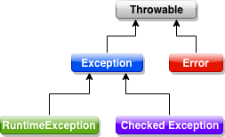

**传统的事务使用方式**

```java
public void test(){
    String url = "jdbc:mysql://localhost:3306/test";
    String username = "root";
    String password = "root";
    String sql = "update blog set name = ? where id=?";
    Connection connection = null;
    try {
        connection = DriverManager.getConnection(url, username, password);
        // 1.关闭自动提交，开启事务
        connection.setAutoCommit(false);
      
        PreparedStatement prepareStatement = connection.prepareStatement(sql);
        prepareStatement.setString(1, "lucy");
        prepareStatement.setInt(2, 1);
        prepareStatement.executeUpdate();
      
        // 2.SQL正常执行，提交事务
        connection.commit();
    } catch (Throwable e) {
        try {
            // 3.执行出现错误，回滚事务
            connection.rollback();
        } catch (SQLException e1) {
            e1.printStackTrace();
        }
    }
}
```

总结：通过传统的事务使用方式分析可知，事务的开启关闭是建立在java.sql.Connection的基础上。
**通过对 `Connection` 进行 `setAutoCommit(false)`、`commit()`、`rollback()` 操作来实现事务的开启、提交、回滚**
实际Spring的事务控制也是基于此来实现的

**Spring事务控制架构分析**

 通过上一篇的分析，我们知道事务控制是通过`TransactionInterceptor.invoke()`方法来实现的。下面我们来看一下这个方法的大体结构

```java
@Override
@Nullable
public Object invoke(MethodInvocation invocation) throws Throwable {
   // Work out the target class: may be {@code null}.
   // The TransactionAttributeSource should be passed the target class
   // as well as the method, which may be from an interface.
   // 获取被代理类
   Class<?> targetClass = (invocation.getThis() != null ? AopUtils.getTargetClass(invocation.getThis()) : null);

   // Adapt to TransactionAspectSupport's invokeWithinTransaction...
   // 执行事务方法
   return invokeWithinTransaction(invocation.getMethod(), targetClass, invocation::proceed);
}
```

```java
/**
 * General delegate for around-advice-based subclasses, delegating to several other template
 * methods on this class. Able to handle {@link CallbackPreferringPlatformTransactionManager}
 * as well as regular {@link PlatformTransactionManager} implementations.
 * @param method the Method being invoked
 * @param targetClass the target class that we're invoking the method on
 * @param invocation the callback to use for proceeding with the target invocation
 * @return the return value of the method, if any
 * @throws Throwable propagated from the target invocation
 */
@Nullable
protected Object invokeWithinTransaction(Method method, @Nullable Class<?> targetClass,
      final InvocationCallback invocation) throws Throwable {

   if (this.reactiveAdapterRegistry != null) {
      ReactiveAdapter adapter = this.reactiveAdapterRegistry.getAdapter(method.getReturnType());
      if (adapter != null) {
         return new ReactiveTransactionSupport(adapter).invokeWithinTransaction(method, targetClass, invocation);
      }
   }

   // If the transaction attribute is null, the method is non-transactional.
   // 1.获取该方法的事务属性 在1中详细分析
   // 事务属性包括propagationBehavior（传播机制）/isolationLevel（隔离级别）/descriptor(方法类、名称)
   TransactionAttributeSource tas = getTransactionAttributeSource();
   final TransactionAttribute txAttr = (tas != null ? tas.getTransactionAttribute(method, targetClass) : null);
  
   // 2.查找容器中的PlatformTransactionManager，用于管理事务 在2）中详细分析
   // 本例中使用的是DataSourceTransactionManager
   final PlatformTransactionManager tm = determineTransactionManager(txAttr);
  
   // 3.获取被代理的类方法名称 在3）中详细分析
   // 例如在本例中就是jdbc.BlogServiceImpl.save
   final String joinpointIdentification = methodIdentification(method, targetClass, txAttr);

   // 4.声明式事务的操作
   if (txAttr == null || !(tm instanceof CallbackPreferringPlatformTransactionManager)) {
      // Standard transaction demarcation with getTransaction and commit/rollback calls.
      // 4.1 创建TransactionInfo（重要操作在这里）
      TransactionInfo txInfo = createTransactionIfNecessary(tm, txAttr, joinpointIdentification);

      Object retVal;
      try {
         // This is an around advice: Invoke the next interceptor in the chain.
         // This will normally result in a target object being invoked.
         // 4.2 先执行其他Interceptor，执行完毕之后执行被代理类的方法
         retVal = invocation.proceedWithInvocation();
      } catch (Throwable ex) {
         // target invocation exception
         // 4.3 执行业务报错，回滚事务
         completeTransactionAfterThrowing(txInfo, ex);
         throw ex;
      } finally {
         // 4.4 清理事务状态
         cleanupTransactionInfo(txInfo);
      }

      if (vavrPresent && VavrDelegate.isVavrTry(retVal)) {
         // Set rollback-only in case of Vavr failure matching our rollback rules...
         TransactionStatus status = txInfo.getTransactionStatus();
         if (status != null && txAttr != null) {
            retVal = VavrDelegate.evaluateTryFailure(retVal, txAttr, status);
         }
      }
			// 4.5 业务执行成功，提交事务
      commitTransactionAfterReturning(txInfo);
      return retVal;
   }

   // 5.编程式事务（这个我们暂不分析，实际逻辑与声明式一致）
   else {
      final ThrowableHolder throwableHolder = new ThrowableHolder();

      // It's a CallbackPreferringPlatformTransactionManager: pass a TransactionCallback in.
      try {
         Object result = ((CallbackPreferringPlatformTransactionManager) tm).execute(txAttr, status -> {
            TransactionInfo txInfo = prepareTransactionInfo(tm, txAttr, joinpointIdentification, status);
            try {
               Object retVal = invocation.proceedWithInvocation();
               if (vavrPresent && VavrDelegate.isVavrTry(retVal)) {
                  // Set rollback-only in case of Vavr failure matching our rollback rules...
                  retVal = VavrDelegate.evaluateTryFailure(retVal, txAttr, status);
               }
               return retVal;
            }
            catch (Throwable ex) {
               if (txAttr.rollbackOn(ex)) {
                  // A RuntimeException: will lead to a rollback.
                  if (ex instanceof RuntimeException) {
                     throw (RuntimeException) ex;
                  }
                  else {
                     throw new ThrowableHolderException(ex);
                  }
               }
               else {
                  // A normal return value: will lead to a commit.
                  throwableHolder.throwable = ex;
                  return null;
               }
            }
            finally {
               cleanupTransactionInfo(txInfo);
            }
         });

         // Check result state: It might indicate a Throwable to rethrow.
         if (throwableHolder.throwable != null) {
            throw throwableHolder.throwable;
         }
         return result;
      }
      catch (ThrowableHolderException ex) {
         throw ex.getCause();
      }
      catch (TransactionSystemException ex2) {
         if (throwableHolder.throwable != null) {
            logger.error("Application exception overridden by commit exception", throwableHolder.throwable);
            ex2.initApplicationException(throwableHolder.throwable);
         }
         throw ex2;
      }
      catch (Throwable ex2) {
         if (throwableHolder.throwable != null) {
            logger.error("Application exception overridden by commit exception", throwableHolder.throwable);
         }
         throw ex2;
      }
   }
}
```

通过上面的代码结构分析，我们可以大体看到事务执行的几个关键步骤

 **1. getTransactionAttributeSource().getTransactionAttribute(method, targetClass)获取该方法的事务属性**

```java
@Nullable
public TransactionAttributeSource getTransactionAttributeSource() {
   return this.transactionAttributeSource;
}
```

 这里的 `transactionAttributeSource` 是在什么时候设置的呢？回到 第一篇文章的 `AnnotationDrivenBeanDefinitionParser` ，有如下一段代码

```java
// Create the TransactionAttributeSource definition.
RootBeanDefinition sourceDef = new RootBeanDefinition(
"org.springframework.transaction.annotation.AnnotationTransactionAttributeSource");
sourceDef.setSource(eleSource);
sourceDef.setRole(BeanDefinition.ROLE_INFRASTRUCTURE);
String sourceName = parserContext.getReaderContext().registerWithGeneratedName(sourceDef);

// Create the TransactionInterceptor definition.
RootBeanDefinition interceptorDef = new RootBeanDefinition(TransactionInterceptor.class);
interceptorDef.setSource(eleSource);
interceptorDef.setRole(BeanDefinition.ROLE_INFRASTRUCTURE);
registerTransactionManager(element, interceptorDef);
interceptorDef.getPropertyValues().add("transactionAttributeSource", new RuntimeBeanReference(sourceName));
String interceptorName = parserContext.getReaderContext().registerWithGeneratedName(interceptorDef);
```

这里可以看到  `transactionAttributeSource` 是在初始化的时候，设置进去的，类型为 `RuntimeBeanReference`，实际上就是 `AnnotationTransactionAttributeSource` 的一个包装类。

继续看其 `getTransactionAttribute(method, targetClass)`，实现在 `AbstractFallbackTransactionAttributeSource` 类。

```java
/**
 * Determine the transaction attribute for this method invocation.
 * <p>Defaults to the class's transaction attribute if no method attribute is found.
 * @param method the method for the current invocation (never {@code null})
 * @param targetClass the target class for this invocation (may be {@code null})
 * @return a TransactionAttribute for this method, or {@code null} if the method
 * is not transactional
 */
@Override
@Nullable
public TransactionAttribute getTransactionAttribute(Method method, @Nullable Class<?> targetClass) {
   if (method.getDeclaringClass() == Object.class) {
      return null;
   }

   // First, see if we have a cached value.
   // 1.查询缓存中是否存在
   Object cacheKey = getCacheKey(method, targetClass);
   TransactionAttribute cached = this.attributeCache.get(cacheKey);
   if (cached != null) {
      // Value will either be canonical value indicating there is no transaction attribute,
      // or an actual transaction attribute.
      if (cached == NULL_TRANSACTION_ATTRIBUTE) {
         return null;
      }
      else {
         return cached;
      }
   }
   else {
      // We need to work it out.
      // 2.获取方法上的事务配置属性
      TransactionAttribute txAttr = computeTransactionAttribute(method, targetClass);
      // Put it in the cache.
      if (txAttr == null) {
         this.attributeCache.put(cacheKey, NULL_TRANSACTION_ATTRIBUTE);
      }
      else {
         String methodIdentification = ClassUtils.getQualifiedMethodName(method, targetClass);
         if (txAttr instanceof DefaultTransactionAttribute) {
            ((DefaultTransactionAttribute) txAttr).setDescriptor(methodIdentification);
         }
         if (logger.isTraceEnabled()) {
            logger.trace("Adding transactional method '" + methodIdentification + "' with attribute: " + txAttr);
         }
         this.attributeCache.put(cacheKey, txAttr);
      }
      return txAttr;
   }
}
```

```java
/**
 * Same signature as {@link #getTransactionAttribute}, but doesn't cache the result.
 * {@link #getTransactionAttribute} is effectively a caching decorator for this method.
 * <p>As of 4.1.8, this method can be overridden.
 * @since 4.1.8
 * @see #getTransactionAttribute
 */
@Nullable
protected TransactionAttribute computeTransactionAttribute(Method method, @Nullable Class<?> targetClass) {
   // Don't allow no-public methods as required.
   // 1.注意这里，如果被代理方法非public类型，则直接返回空 暂时不支持非public类型方法
   if (allowPublicMethodsOnly() && !Modifier.isPublic(method.getModifiers())) {
      return null;
   }

   // The method may be on an interface, but we need attributes from the target class.
   // If the target class is null, the method will be unchanged.
   Method specificMethod = AopUtils.getMostSpecificMethod(method, targetClass);

   // First try is the method in the target class.
   // 2.解析方法上的@Transactional属性，具体解析过程读者可自行查看
   TransactionAttribute txAttr = findTransactionAttribute(specificMethod);
   if (txAttr != null) {
      return txAttr;
   }

   // Second try is the transaction attribute on the target class.
   // 3.如果方法上没有事务属性，就从类上来获取
   txAttr = findTransactionAttribute(specificMethod.getDeclaringClass());
   if (txAttr != null && ClassUtils.isUserLevelMethod(method)) {
      return txAttr;
   }

   if (specificMethod != method) {
      // Fallback is to look at the original method.
      txAttr = findTransactionAttribute(method);
      if (txAttr != null) {
         return txAttr;
      }
      // Last fallback is the class of the original method.
      txAttr = findTransactionAttribute(method.getDeclaringClass());
      if (txAttr != null && ClassUtils.isUserLevelMethod(method)) {
         return txAttr;
      }
   }

   return null;
}
```

**总结：获取方法上的事务属性，如果方法上没有就从其类上来获取；注意：非public类型的方法直接返回空**


**2. `determineTransactionManager(txAttr);` 查找容器中的 `PlatformTransactionManager` 实现**

```java
/**
 * Determine the specific transaction manager to use for the given transaction.
 */
@Nullable
protected PlatformTransactionManager determineTransactionManager(@Nullable TransactionAttribute txAttr) {
   // Do not attempt to lookup tx manager if no tx attributes are set
   if (txAttr == null || this.beanFactory == null) {
      return asPlatformTransactionManager(getTransactionManager());
   }

   String qualifier = txAttr.getQualifier();
   if (StringUtils.hasText(qualifier)) {
      return determineQualifiedTransactionManager(this.beanFactory, qualifier);
   }
   else if (StringUtils.hasText(this.transactionManagerBeanName)) {
      return determineQualifiedTransactionManager(this.beanFactory, this.transactionManagerBeanName);
   }
   else {
      PlatformTransactionManager defaultTransactionManager = asPlatformTransactionManager(getTransactionManager());
      if (defaultTransactionManager == null) {
         defaultTransactionManager = asPlatformTransactionManager(
               this.transactionManagerCache.get(DEFAULT_TRANSACTION_MANAGER_KEY));
         if (defaultTransactionManager == null) {
            defaultTransactionManager = this.beanFactory.getBean(PlatformTransactionManager.class);
            this.transactionManagerCache.putIfAbsent(
                  DEFAULT_TRANSACTION_MANAGER_KEY, defaultTransactionManager);
         }
      }
      return defaultTransactionManager;
   }
}
```

主要功能就是从 Spring 容器中查找 `PlatformTransactionManager` 实现

一般情况下代码中配置的为 **`DataSourceTransactionManager`**

**3. methodIdentification(method, targetClass, txAttr);获取被代理的类方法名称**

```java
private String methodIdentification(Method method, @Nullable Class<?> targetClass,
      @Nullable TransactionAttribute txAttr) {

   String methodIdentification = methodIdentification(method, targetClass);
   if (methodIdentification == null) {
      if (txAttr instanceof DefaultTransactionAttribute) {
         // 直接走这段代码，获取 txAttr 的 description 属性
         methodIdentification = ((DefaultTransactionAttribute) txAttr).getDescriptor();
      }
      if (methodIdentification == null) {
         methodIdentification = ClassUtils.getQualifiedMethodName(method, targetClass);
      }
   }
   return methodIdentification;
}
```

以上部分，我们获取了一些辅助信息，下面就开始分析最重要的部分了，声明式事务的操作

**4. 声明式事务的操作**

```java
// Standard transaction demarcation with getTransaction and commit/rollback calls.
// 4.1 创建TransactionInfo（重要操作在这里）
TransactionInfo txInfo = createTransactionIfNecessary(tm, txAttr, joinpointIdentification);

Object retVal;
try {
  // This is an around advice: Invoke the next interceptor in the chain.
  // This will normally result in a target object being invoked.
  // 4.2 先执行其他Interceptor，执行完毕之后执行被代理类的方法
  retVal = invocation.proceedWithInvocation();
} catch (Throwable ex) {
  // target invocation exception
  // 4.3 执行业务报错，回滚事务
  completeTransactionAfterThrowing(txInfo, ex);
  throw ex;
} finally {
  // 4.4 清理事务状态
  cleanupTransactionInfo(txInfo);
}

if (vavrPresent && VavrDelegate.isVavrTry(retVal)) {
  // Set rollback-only in case of Vavr failure matching our rollback rules...
  TransactionStatus status = txInfo.getTransactionStatus();
  if (status != null && txAttr != null) {
    retVal = VavrDelegate.evaluateTryFailure(retVal, txAttr, status);
  }
}
// 4.5 业务执行成功，提交事务
commitTransactionAfterReturning(txInfo);
return retVal;
```

**4.1 `createTransactionIfNecessary();`创建`TransactionInfo`**

这个几乎可以说是声明式事务中最重要的操作了，我们来好好看看这个方法

```java
/**
 * Create a transaction if necessary based on the given TransactionAttribute.
 * <p>Allows callers to perform custom TransactionAttribute lookups through
 * the TransactionAttributeSource.
 * @param txAttr the TransactionAttribute (may be {@code null})
 * @param joinpointIdentification the fully qualified method name
 * (used for monitoring and logging purposes)
 * @return a TransactionInfo object, whether or not a transaction was created.
 * The {@code hasTransaction()} method on TransactionInfo can be used to
 * tell if there was a transaction created.
 * @see #getTransactionAttributeSource()
 */
@SuppressWarnings("serial")
protected TransactionInfo createTransactionIfNecessary(@Nullable PlatformTransactionManager tm,
      @Nullable TransactionAttribute txAttr, final String joinpointIdentification) {

   // If no name specified, apply method identification as transaction name.
   if (txAttr != null && txAttr.getName() == null) {
      txAttr = new DelegatingTransactionAttribute(txAttr) {
         @Override
         public String getName() {
            return joinpointIdentification;
         }
      };
   }

   TransactionStatus status = null;
   if (txAttr != null) {
      if (tm != null) {
         // 1.主要方法，负责创建transaction
         status = tm.getTransaction(txAttr);
      }
      else {
         if (logger.isDebugEnabled()) {
            logger.debug("Skipping transactional joinpoint [" + joinpointIdentification +
                  "] because no transaction manager has been configured");
         }
      }
   }
   // 2.封装TransactionInfo
   return prepareTransactionInfo(tm, txAttr, joinpointIdentification, status);
}
```

**tm.getTransaction(txAttr);默认实现类为AbstractPlatformTransactionManager**

```java
/**
 * This implementation handles propagation behavior. Delegates to
 * {@code doGetTransaction}, {@code isExistingTransaction}
 * and {@code doBegin}.
 * @see #doGetTransaction
 * @see #isExistingTransaction
 * @see #doBegin
 */
@Override
public final TransactionStatus getTransaction(@Nullable TransactionDefinition definition)
      throws TransactionException {

   // Use defaults if no transaction definition given.
   TransactionDefinition def = (definition != null ? definition : TransactionDefinition.withDefaults());
 	 
   // 1.获取当前线程事务
   // 本方法为抽象方法，具体实现在 DataSourceTransactionManager
   // 主要做法是从 ThreadLocal 中获取当前线程的 Connection 资源
   Object transaction = doGetTransaction();
   boolean debugEnabled = logger.isDebugEnabled();

   // 2.如果当前线程已存在事务，则按照事务的传播机制来判断是否使用当前事务
   // 具体代码读者可进方法体细看，以加深对传播机制的了解
   if (isExistingTransaction(transaction)) {
      // Existing transaction found -> check propagation behavior to find out how to behave.
      return handleExistingTransaction(def, transaction, debugEnabled);
   }

   // Check definition settings for new transaction.
   // 3.检查事务超时配置是否合法
   if (def.getTimeout() < TransactionDefinition.TIMEOUT_DEFAULT) {
      throw new InvalidTimeoutException("Invalid transaction timeout", def.getTimeout());
   }

   // No existing transaction found -> check propagation behavior to find out how to proceed.
    // 4.能运行到这，说明当前线程不存在事务，那么与 MANDATORY 传播机制就不符合
    // MANDATORY 要求当前线程必须存在事务，故直接抛出异常
   if (def.getPropagationBehavior() == TransactionDefinition.PROPAGATION_MANDATORY) {
      throw new IllegalTransactionStateException(
            "No existing transaction found for transaction marked with propagation 'mandatory'");
   }
   // 5.针对于REQUIRED、REQUIRES_NEW、NESTED这三种传播机制
   // 当前线程之前不存在事务，则目前需要创建新的事务
   else if (def.getPropagationBehavior() == TransactionDefinition.PROPAGATION_REQUIRED ||
         def.getPropagationBehavior() == TransactionDefinition.PROPAGATION_REQUIRES_NEW ||
         def.getPropagationBehavior() == TransactionDefinition.PROPAGATION_NESTED) {
      SuspendedResourcesHolder suspendedResources = suspend(null);
      if (debugEnabled) {
         logger.debug("Creating new transaction with name [" + def.getName() + "]: " + def);
      }
      try {
         boolean newSynchronization = (getTransactionSynchronization() != SYNCHRONIZATION_NEVER);
         DefaultTransactionStatus status = newTransactionStatus(
               def, transaction, true, newSynchronization, debugEnabled, suspendedResources);
         // 5.1 在这里创建新的Connection，本例中默认实现类为DataSourceTransactionManager
         doBegin(transaction, def);
         prepareSynchronization(status, def);
         return status;
      }
      catch (RuntimeException | Error ex) {
         resume(null, suspendedResources);
         throw ex;
      }
   }
   else {
      // Create "empty" transaction: no actual transaction, but potentially synchronization.
      if (def.getIsolationLevel() != TransactionDefinition.ISOLATION_DEFAULT && logger.isWarnEnabled()) {
         logger.warn("Custom isolation level specified but no actual transaction initiated; " +
               "isolation level will effectively be ignored: " + def);
      }
      boolean newSynchronization = (getTransactionSynchronization() == SYNCHRONIZATION_ALWAYS);
      return prepareTransactionStatus(def, null, true, newSynchronization, debugEnabled, null);
   }
}
```

   通过以上代码结构的分析，我们可以大致看到获取`Transaction`的操作

**主要过程就是：先从当前线程获取`Transaction`**

* **如果当前线程已有，则根据指定的传播机制，或重用，或新建`Transaction`**
* **如果当前线程没有，则根据指定的传播机制，新建`Transaction`**


下面我们再重点分析一下`getTransaction()`方法中的几个重要节点方法

**AbstractPlatformTransactionManager.handleExistingTransaction(definition, transaction, debugEnabled); 当前线程已存在事务情况下创建事务分析**

```java
/**
 * Create a TransactionStatus for an existing transaction.
 */
private TransactionStatus handleExistingTransaction(
      TransactionDefinition definition, Object transaction, boolean debugEnabled)
      throws TransactionException {
  
   // 1.如果隔离级别是NEVER，则说明不需要当前线程的已存在事务，则抛错
   if (definition.getPropagationBehavior() == TransactionDefinition.PROPAGATION_NEVER) {
      throw new IllegalTransactionStateException(
            "Existing transaction found for transaction marked with propagation 'never'");
   }
  
   // 2.NOT_SUPPORTED，不再事物中执行，如果发现有事务，则需要挂起
   if (definition.getPropagationBehavior() == TransactionDefinition.PROPAGATION_NOT_SUPPORTED) {
      if (debugEnabled) {
         logger.debug("Suspending挂起 current transaction");
      }
      Object suspendedResources = suspend(transaction); // 挂起的实现原理下面分析
      boolean newSynchronization = (getTransactionSynchronization() == SYNCHRONIZATION_ALWAYS);
      return prepareTransactionStatus(
            definition, null, false, newSynchronization, debugEnabled, suspendedResources);
   }

   // 3.REQUIRES_NEW，挂起当前事务，直接创建一个新的事务
   if (definition.getPropagationBehavior() == TransactionDefinition.PROPAGATION_REQUIRES_NEW) {
      if (debugEnabled) {
         logger.debug("Suspending current transaction, creating new transaction with name [" +
               definition.getName() + "]");
      }
      SuspendedResourcesHolder suspendedResources = suspend(transaction);
      try {
         boolean newSynchronization = (getTransactionSynchronization() != SYNCHRONIZATION_NEVER);
         DefaultTransactionStatus status = newTransactionStatus(
               definition, transaction, true, newSynchronization, debugEnabled, suspendedResources);
         doBegin(transaction, definition);
         prepareSynchronization(status, definition);
         return status;
      }
      catch (RuntimeException | Error beginEx) {
         resumeAfterBeginException(transaction, suspendedResources, beginEx);
         throw beginEx;
      }
   }
   // 4.NESTED ，创建当前事务的一个嵌套事务，嵌套事务独立于之前的线程事务进行提交或回滚
   if (definition.getPropagationBehavior() == TransactionDefinition.PROPAGATION_NESTED) {
      if (!isNestedTransactionAllowed()) {
         throw new NestedTransactionNotSupportedException(
               "Transaction manager does not allow nested transactions by default - " +
               "specify 'nestedTransactionAllowed' property with value 'true'");
      }
      if (debugEnabled) {
         logger.debug("Creating nested transaction with name [" + definition.getName() + "]");
      }
      if (useSavepointForNestedTransaction()) {
         // Create savepoint within existing Spring-managed transaction,
         // through the SavepointManager API implemented by TransactionStatus.
         // Usually uses JDBC 3.0 savepoints. Never activates Spring synchronization.
         DefaultTransactionStatus status =
               prepareTransactionStatus(definition, transaction, false, false, debugEnabled, null);
         status.createAndHoldSavepoint();
         return status;
      }
      else {
         // Nested transaction through nested begin and commit/rollback calls.
         // Usually only for JTA: Spring synchronization might get activated here
         // in case of a pre-existing JTA transaction.
         boolean newSynchronization = (getTransactionSynchronization() != SYNCHRONIZATION_NEVER);
         DefaultTransactionStatus status = newTransactionStatus(
               definition, transaction, true, newSynchronization, debugEnabled, null);
         doBegin(transaction, definition);
         prepareSynchronization(status, definition);
         return status;
      }
   }

   // Assumably PROPAGATION_SUPPORTS or PROPAGATION_REQUIRED.
   if (debugEnabled) {
      logger.debug("Participating in existing transaction");
   }
   if (isValidateExistingTransaction()) {
      if (definition.getIsolationLevel() != TransactionDefinition.ISOLATION_DEFAULT) {
         Integer currentIsolationLevel = TransactionSynchronizationManager.getCurrentTransactionIsolationLevel();
         if (currentIsolationLevel == null || currentIsolationLevel != definition.getIsolationLevel()) {
            Constants isoConstants = DefaultTransactionDefinition.constants;
            throw new IllegalTransactionStateException("Participating transaction with definition [" +
                  definition + "] specifies isolation level which is incompatible with existing transaction: " +
                  (currentIsolationLevel != null ?
                        isoConstants.toCode(currentIsolationLevel, DefaultTransactionDefinition.PREFIX_ISOLATION) :
                        "(unknown)"));
         }
      }
      if (!definition.isReadOnly()) {
         if (TransactionSynchronizationManager.isCurrentTransactionReadOnly()) {
            throw new IllegalTransactionStateException("Participating transaction with definition [" +
                  definition + "] is not marked as read-only but existing transaction is");
         }
      }
   }
   boolean newSynchronization = (getTransactionSynchronization() != SYNCHRONIZATION_NEVER);
   return prepareTransactionStatus(definition, transaction, false, newSynchronization, debugEnabled, null);
}
```

**doBegin(transaction, definition);创建一个Connection，本例中实现类为DataSourceTransactionManager**

```java
/**
 * This implementation sets the isolation level but ignores the timeout.
 */
@Override
protected void doBegin(Object transaction, TransactionDefinition definition) {
   DataSourceTransactionObject txObject = (DataSourceTransactionObject) transaction;
   Connection con = null;

   try {
      // 1.如果当前线程没有相关Connection，则创建一个新的Connection
      if (!txObject.hasConnectionHolder() ||
            txObject.getConnectionHolder().isSynchronizedWithTransaction()) {
         Connection newCon = obtainDataSource().getConnection();
         if (logger.isDebugEnabled()) {
            logger.debug("Acquired Connection [" + newCon + "] for JDBC transaction");
         }
         txObject.setConnectionHolder(new ConnectionHolder(newCon), true);
      }
     
      txObject.getConnectionHolder().setSynchronizedWithTransaction(true);
      con = txObject.getConnectionHolder().getConnection();
     
      // 2.设置隔离级别
      Integer previousIsolationLevel = DataSourceUtils.prepareConnectionForTransaction(con, definition);
      txObject.setPreviousIsolationLevel(previousIsolationLevel);

      // Switch to manual commit if necessary. This is very expensive in some JDBC drivers,
      // so we don't want to do it unnecessarily (for example if we've explicitly
      // configured the connection pool to set it already).
      // 3.在这里开启事务
      if (con.getAutoCommit()) {
         txObject.setMustRestoreAutoCommit(true);
         if (logger.isDebugEnabled()) {
            logger.debug("Switching JDBC Connection [" + con + "] to manual commit");
         }
         // 关闭事务自动提交
         con.setAutoCommit(false);
      }

      prepareTransactionalConnection(con, definition);
      txObject.getConnectionHolder().setTransactionActive(true);

      int timeout = determineTimeout(definition);
      if (timeout != TransactionDefinition.TIMEOUT_DEFAULT) {
         txObject.getConnectionHolder().setTimeoutInSeconds(timeout);
      }

      // Bind the connection holder to the thread.
      if (txObject.isNewConnectionHolder()) {
	       // ThreadLocalMap 来保存 Conn 信息，前一个参数是 key 后一个参数是 value
         TransactionSynchronizationManager.bindResource(obtainDataSource(), txObject.getConnectionHolder());
      }
   }

   catch (Throwable ex) {
      if (txObject.isNewConnectionHolder()) {
         DataSourceUtils.releaseConnection(con, obtainDataSource());
         txObject.setConnectionHolder(null, false);
      }
      throw new CannotCreateTransactionException("Could not open JDBC Connection for transaction", ex);
   }
}
```

关于挂起的实现

**AbstractPlatformTransactionManager**

```java
/**
 * Suspend the given transaction. Suspends transaction synchronization first,
 * then delegates to the {@code doSuspend} template method.
 * @param transaction the current transaction object
 * (or {@code null} to just suspend active synchronizations, if any)
 * @return an object that holds suspended resources
 * (or {@code null} if neither transaction nor synchronization active)
 * @see #doSuspend
 * @see #resume
 */
@Nullable
protected final SuspendedResourcesHolder suspend(@Nullable Object transaction) throws TransactionException {
   if (TransactionSynchronizationManager.isSynchronizationActive()) {
      // 挂起所有的 ConnectionSynchronization, 从 ThreadLocalMap 上 unbind DataSource信息
      List<TransactionSynchronization> suspendedSynchronizations = doSuspendSynchronization();
      try {
         // 从 ThreadLocalMap 上 unbind 入参 transaction
         Object suspendedResources = null;
         if (transaction != null) {
            suspendedResources = doSuspend(transaction);
         }
         // 将 TransactionSynchronizationManager 的状态信息置空，然后保存到 SuspendedResourcesHolder 返回出去
         String name = TransactionSynchronizationManager.getCurrentTransactionName();
         TransactionSynchronizationManager.setCurrentTransactionName(null);
         boolean readOnly = TransactionSynchronizationManager.isCurrentTransactionReadOnly();
         TransactionSynchronizationManager.setCurrentTransactionReadOnly(false);
         Integer isolationLevel = TransactionSynchronizationManager.getCurrentTransactionIsolationLevel();
         TransactionSynchronizationManager.setCurrentTransactionIsolationLevel(null);
         boolean wasActive = TransactionSynchronizationManager.isActualTransactionActive();
         TransactionSynchronizationManager.setActualTransactionActive(false);
         return new SuspendedResourcesHolder(
               suspendedResources, suspendedSynchronizations, name, readOnly, isolationLevel, wasActive);
      }
      catch (RuntimeException | Error ex) {
         // doSuspend failed - original transaction is still active...
         doResumeSynchronization(suspendedSynchronizations);
         throw ex;
      }
   }
   else if (transaction != null) {
      // Transaction active but no synchronization active.
      Object suspendedResources = doSuspend(transaction);
      return new SuspendedResourcesHolder(suspendedResources);
   }
   else {
      // Neither transaction nor synchronization active.
      return null;
   }
}
```

**DataSourceTransactionManager**

```java
@Override
protected Object doSuspend(Object transaction) {
   DataSourceTransactionObject txObject = (DataSourceTransactionObject) transaction;
   txObject.setConnectionHolder(null);
   // 从 ThreadLocalMap 中移除当前线程的 Conn
   return TransactionSynchronizationManager.unbindResource(obtainDataSource());
}
```

**可以看到 suspend 方法就是将 ThreadLocalMap 上的一些绑定信息提取出来，然后保存在一个临时对象里面，供后续恢复的时候使用。**

> 总结：在`createTransactionIfNecessary`()方法里，
> 我们会获取当前线程的事务，如果已经存在则按照相应的传播机制或使用已有事务或创建新的事务；
> 如果不存在事务，则根据传播机制，或创建新的事务或不创建；
> 将事务信息包装到`TransactionInfo`中，`TransactionInfo`用于后面的事务提交及回滚

**2）invocation.proceedWithInvocation();;执行业务操作**

到目前为止，我们已经在业务方法执行之前，对 `Connection` 进行了处理，下面我们继续从 `TransactionInterceptor#invokeWithinTransaction` 的方法继续往后看。

```java
retVal = invocation.proceedWithInvocation();
```

**这里 `proceedWithInvocation` 实际上是调用的  `ReflectiveMethodInvocation#proceed` 方法（方法参数传入的是一个lambda表达式）。在第一篇的文章中，我们可以知道，这里实际上是继续执行后续的拦截器，在所有拦截器执行完毕之后，再执行业务方法。所以这一步走完，可以当作是执行完了业务方法**

**3）completeTransactionAfterThrowing(txInfo, ex);业务执行报错，执行事务回滚**

```java
/**
 * Handle a throwable, completing the transaction.
 * We may commit or roll back, depending on the configuration.
 * @param txInfo information about the current transaction
 * @param ex throwable encountered
 */
protected void completeTransactionAfterThrowing(@Nullable TransactionInfo txInfo, Throwable ex) {
   if (txInfo != null && txInfo.getTransactionStatus() != null) {
      if (logger.isTraceEnabled()) {
         logger.trace("Completing transaction for [" + txInfo.getJoinpointIdentification() +
               "] after exception: " + ex);
      }
      // 如果当前事务配置了需要在当前异常类型进行回滚，则进行回滚
      if (txInfo.transactionAttribute != null && txInfo.transactionAttribute.rollbackOn(ex)) {
         try {
            // 重要方法，真正进行事务回滚的方法
            txInfo.getTransactionManager().rollback(txInfo.getTransactionStatus());
         }
         catch (TransactionSystemException ex2) {
            logger.error("Application exception overridden by rollback exception", ex);
            ex2.initApplicationException(ex);
            throw ex2;
         }
         catch (RuntimeException | Error ex2) {
            logger.error("Application exception overridden by rollback exception", ex);
            throw ex2;
         }
      }
      // 如果不是，则提交事务。 重要点：如果Transactional 不写 rollbackFor 属性，则异常的时候会默认提交事务
      else {
         // We don't roll back on this exception.
         // Will still roll back if TransactionStatus.isRollbackOnly() is true.
         try {
            txInfo.getTransactionManager().commit(txInfo.getTransactionStatus());
         }
         catch (TransactionSystemException ex2) {
            logger.error("Application exception overridden by commit exception", ex);
            ex2.initApplicationException(ex);
            throw ex2;
         }
         catch (RuntimeException | Error ex2) {
            logger.error("Application exception overridden by commit exception", ex);
            throw ex2;
         }
      }
   }
}
```

我们知道异常按照类型分为以下几种，如果我们在 `Transactional` 方法内部抛出了自定义的 `CheckedExeption`，如果未定义`rollbackFor` 方法，那么在事物滚回逻辑里面，并不会直接回滚事物，而是会提交，从而造成异常。



**SpringTransactionAnnotationParser**

```java
protected TransactionAttribute parseTransactionAnnotation(AnnotationAttributes attributes) {
   RuleBasedTransactionAttribute rbta = new RuleBasedTransactionAttribute();

   Propagation propagation = attributes.getEnum("propagation");
   rbta.setPropagationBehavior(propagation.value());
   Isolation isolation = attributes.getEnum("isolation");
   rbta.setIsolationLevel(isolation.value());
   rbta.setTimeout(attributes.getNumber("timeout").intValue());
   rbta.setReadOnly(attributes.getBoolean("readOnly"));
   rbta.setQualifier(attributes.getString("value"));

   List<RollbackRuleAttribute> rollbackRules = new ArrayList<>();
   for (Class<?> rbRule : attributes.getClassArray("rollbackFor")) {
      rollbackRules.add(new RollbackRuleAttribute(rbRule));
   }
   for (String rbRule : attributes.getStringArray("rollbackForClassName")) {
      rollbackRules.add(new RollbackRuleAttribute(rbRule));
   }
   for (Class<?> rbRule : attributes.getClassArray("noRollbackFor")) {
      rollbackRules.add(new NoRollbackRuleAttribute(rbRule));
   }
   for (String rbRule : attributes.getStringArray("noRollbackForClassName")) {
      rollbackRules.add(new NoRollbackRuleAttribute(rbRule));
   }
   rbta.setRollbackRules(rollbackRules);

   return rbta;
}
```

在对抛出的异常进行匹配的逻辑，见如下代码

**RuleBasedTransactionAttribute**

```java
/**
 * Winning rule is the shallowest rule (that is, the closest in the
 * inheritance hierarchy to the exception). If no rule applies (-1),
 * return false.
 * @see TransactionAttribute#rollbackOn(java.lang.Throwable)
 */
@Override
public boolean rollbackOn(Throwable ex) {
   if (logger.isTraceEnabled()) {
      logger.trace("Applying rules to determine whether transaction should rollback on " + ex);
   }

   RollbackRuleAttribute winner = null;
   int deepest = Integer.MAX_VALUE;

   if (this.rollbackRules != null) {
      for (RollbackRuleAttribute rule : this.rollbackRules) {
         int depth = rule.getDepth(ex); // 核心方法
         if (depth >= 0 && depth < deepest) {
            deepest = depth;
            winner = rule;
         }
      }
   }

   if (logger.isTraceEnabled()) {
      logger.trace("Winning rollback rule is: " + winner);
   }

   // User superclass behavior (rollback on unchecked) if no rule matches.
   if (winner == null) {
      logger.trace("No relevant rollback rule found: applying default rules");
      // 这里如果定义的回滚规则没有匹配上，则用父类规则 即 RuntimeException + Error
      return super.rollbackOn(ex);
   }

   return !(winner instanceof NoRollbackRuleAttribute);
}
```

我们继续看下 回滚是如何实现的

**AbstractPlatformTransactionManager**

```java
/**
 * This implementation of rollback handles participating in existing
 * transactions. Delegates to {@code doRollback} and
 * {@code doSetRollbackOnly}.
 * @see #doRollback
 * @see #doSetRollbackOnly
 */
@Override
public final void rollback(TransactionStatus status) throws TransactionException {
   // 1.如果是已完成状态，则直接抛错
   if (status.isCompleted()) {
      throw new IllegalTransactionStateException(
            "Transaction is already completed - do not call commit or rollback more than once per transaction");
   }

   DefaultTransactionStatus defStatus = (DefaultTransactionStatus) status;
   processRollback(defStatus, false);
}
```

```java
/**
 * Process an actual rollback.
 * The completed flag has already been checked.
 * @param status object representing the transaction
 * @throws TransactionException in case of rollback failure
 */
private void processRollback(DefaultTransactionStatus status, boolean unexpected) {
   try {
      boolean unexpectedRollback = unexpected;

      try {
         triggerBeforeCompletion(status);
				 // 1. savePoint 的情况
         if (status.hasSavepoint()) {
            if (status.isDebug()) {
               logger.debug("Rolling back transaction to savepoint");
            }
            status.rollbackToHeldSavepoint();
         }
         // 2. 我们直接看新创建的事务如何进行回滚的
         else if (status.isNewTransaction()) {
            if (status.isDebug()) {
               logger.debug("Initiating transaction rollback");
            }
            // 重要实现，默认在DataSourceTransactionManager实现
            doRollback(status);
         }
         else {
            // Participating in larger transaction
            if (status.hasTransaction()) {
               if (status.isLocalRollbackOnly() || isGlobalRollbackOnParticipationFailure()) {
                  if (status.isDebug()) {
                     logger.debug("Participating transaction failed - marking existing transaction as rollback-only");
                  }
                  doSetRollbackOnly(status);
               }
               else {
                  if (status.isDebug()) {
                     logger.debug("Participating transaction failed - letting transaction originator decide on rollback");
                  }
               }
            }
            else {
               logger.debug("Should roll back transaction but cannot - no transaction available");
            }
            // Unexpected rollback only matters here if we're asked to fail early
            if (!isFailEarlyOnGlobalRollbackOnly()) {
               unexpectedRollback = false;
            }
         }
      }
      catch (RuntimeException | Error ex) {
         triggerAfterCompletion(status, TransactionSynchronization.STATUS_UNKNOWN);
         throw ex;
      }

      triggerAfterCompletion(status, TransactionSynchronization.STATUS_ROLLED_BACK);

      // Raise UnexpectedRollbackException if we had a global rollback-only marker
      if (unexpectedRollback) {
         throw new UnexpectedRollbackException(
               "Transaction rolled back because it has been marked as rollback-only");
      }
   }
   finally {
      cleanupAfterCompletion(status);
   }
}
```

**DataSourceTransactionManager**

```java
@Override
protected void doRollback(DefaultTransactionStatus status) {
   DataSourceTransactionObject txObject = (DataSourceTransactionObject) status.getTransaction();
   Connection con = txObject.getConnectionHolder().getConnection();
   if (status.isDebug()) {
      logger.debug("Rolling back JDBC transaction on Connection [" + con + "]");
   }
   try {
      // 看到这里读者是不是很熟悉了，就是我们的connection.rollback()方法
      con.rollback();
   }
   catch (SQLException ex) {
      throw new TransactionSystemException("Could not roll back JDBC transaction", ex);
   }
}
```

**总结3）：回滚事务，根据不同的情况有不同的处理方案，具体细节不再赘述；针对于新创建的事务，最终还是调用Connection.rollback()方法来实现**


**4）commitTransactionAfterReturning(txInfo);事务提交**

```java
/**
 * Execute after successful completion of call, but not after an exception was handled.
 * Do nothing if we didn't create a transaction.
 * @param txInfo information about the current transaction
 */
protected void commitTransactionAfterReturning(@Nullable TransactionInfo txInfo) {
   if (txInfo != null && txInfo.getTransactionStatus() != null) {
      if (logger.isTraceEnabled()) {
         logger.trace("Completing transaction for [" + txInfo.getJoinpointIdentification() + "]");
      }
      // 重点在这里
      txInfo.getTransactionManager().commit(txInfo.getTransactionStatus());
   }
}
```

**AbstractPlatformTransactionManager**

```java
/**
 * This implementation of commit handles participating in existing
 * transactions and programmatic rollback requests.
 * Delegates to {@code isRollbackOnly}, {@code doCommit}
 * and {@code rollback}.
 * @see org.springframework.transaction.TransactionStatus#isRollbackOnly()
 * @see #doCommit
 * @see #rollback
 */
@Override
public final void commit(TransactionStatus status) throws TransactionException {
   if (status.isCompleted()) {
      throw new IllegalTransactionStateException(
            "Transaction is already completed - do not call commit or rollback more than once per transaction");
   }

   DefaultTransactionStatus defStatus = (DefaultTransactionStatus) status;
   // 如果已经被标记回滚，则不会提交事务，直接回滚
   if (defStatus.isLocalRollbackOnly()) {
      if (defStatus.isDebug()) {
         logger.debug("Transactional code has requested rollback");
      }
      processRollback(defStatus, false);
      return;
   }

   // 如果 Global transaction 标记为回滚，则只允许回滚
   if (!shouldCommitOnGlobalRollbackOnly() && defStatus.isGlobalRollbackOnly()) {
      if (defStatus.isDebug()) {
         logger.debug("Global transaction is marked as rollback-only but transactional code requested commit");
      }
      processRollback(defStatus, true);
      return;
   }
	 
   // 真正的事务提交逻辑
   processCommit(defStatus);
}
```

```java
/**
 * Process an actual commit.
 * Rollback-only flags have already been checked and applied.
 * @param status object representing the transaction
 * @throws TransactionException in case of commit failure
 */
private void processCommit(DefaultTransactionStatus status) throws TransactionException {
   try {
      boolean beforeCompletionInvoked = false;

      try {
         boolean unexpectedRollback = false;
         prepareForCommit(status);
         triggerBeforeCommit(status);
         triggerBeforeCompletion(status);
         beforeCompletionInvoked = true;

         if (status.hasSavepoint()) {
            if (status.isDebug()) {
               logger.debug("Releasing transaction savepoint");
            }
            unexpectedRollback = status.isGlobalRollbackOnly();
            status.releaseHeldSavepoint();
         }
         // 我们直接看新事务的提交
         else if (status.isNewTransaction()) {
            if (status.isDebug()) {
               logger.debug("Initiating transaction commit");
            }
            unexpectedRollback = status.isGlobalRollbackOnly();
            // 抽象方法，默认由DataSourceTransactionManager实现
            doCommit(status);
         }
         else if (isFailEarlyOnGlobalRollbackOnly()) {
            unexpectedRollback = status.isGlobalRollbackOnly();
         }

         // Throw UnexpectedRollbackException if we have a global rollback-only
         // marker but still didn't get a corresponding exception from commit.
         if (unexpectedRollback) {
            throw new UnexpectedRollbackException(
                  "Transaction silently rolled back because it has been marked as rollback-only");
         }
      }
      catch (UnexpectedRollbackException ex) {
         // can only be caused by doCommit
         triggerAfterCompletion(status, TransactionSynchronization.STATUS_ROLLED_BACK);
         throw ex;
      }
      catch (TransactionException ex) {
         // can only be caused by doCommit
         if (isRollbackOnCommitFailure()) {
            doRollbackOnCommitException(status, ex);
         }
         else {
            triggerAfterCompletion(status, TransactionSynchronization.STATUS_UNKNOWN);
         }
         throw ex;
      }
      catch (RuntimeException | Error ex) {
         if (!beforeCompletionInvoked) {
            triggerBeforeCompletion(status);
         }
         doRollbackOnCommitException(status, ex);
         throw ex;
      }

      // Trigger afterCommit callbacks, with an exception thrown there
      // propagated to callers but the transaction still considered as committed.
      try {
         triggerAfterCommit(status);
      }
      finally {
         triggerAfterCompletion(status, TransactionSynchronization.STATUS_COMMITTED);
      }

   }
   finally {
      cleanupAfterCompletion(status);
   }
}
```

**DataSourceTransactionManager**

```java
@Override
protected void doCommit(DefaultTransactionStatus status) {
   DataSourceTransactionObject txObject = (DataSourceTransactionObject) status.getTransaction();
   Connection con = txObject.getConnectionHolder().getConnection();
   if (status.isDebug()) {
      logger.debug("Committing JDBC transaction on Connection [" + con + "]");
   }
   try {
      // here
      con.commit();
   }
   catch (SQLException ex) {
      throw new TransactionSystemException("Could not commit JDBC transaction", ex);
   }
}
```

**总结：通过上面一系列的代码分析，我们可以看到，事务的开启、提交、回滚也都是按照传统的事务方式来的。**

**只是事务的获取需要根据事务传播机制来获取。**

