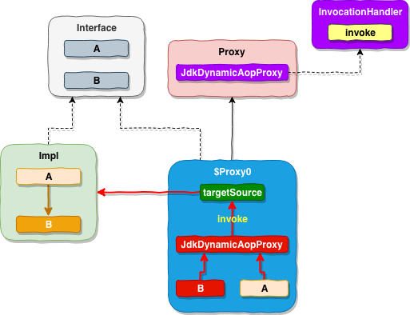
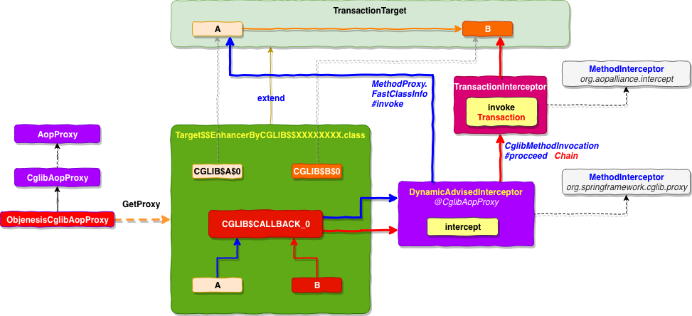

#### 在一个 Spring ServiceBean中，如果定义了 A / B 两个方法，A方法没有@Transactional 注解，B方法有@Transactional 事物注解，在方法内部，A调用了B，现在调用该服务的 A 方法，会有事物吗？

不会，因为，无论是 `JdkDynamicProxy` 还是 `CglibAopProxy` 的代理实现，最终都是代理类 调用 目标类。当代理类的 A方法调用目标类的 A 方法的时候，目标类的 A 方法会直接调用当前类里面已经存在的 B方法，这时候，B方法的调用逻辑，并没有经过代理类的代理处理，所以没有事物。

在 Spring 的代理实现中，分为两大类

一，**JdkDynamicProxy**，整体调用链路如下图所示

上图中，Spring IOC 注入Service 的实际上是 $Proxy0 代理对象，该对象实现 Interface 接口，并继承 Proxy 类，内部持有一个 `InvocationHandler` 的子类 `JdkDynamicProxy`. 该对象里面的 `invoke` 方法里面实现了代理逻辑，最终调用了目标类

二，**CglibAopProxy**，整体调用链路如下图所示

上图中，Spring IOC 注入 Service 的实际上是 `Target$$EnhanceByCGLIB$$XXXXXXXX` 的实例，该对象继承目标类，在子类中重写 A / B 方法，但是在代理类中A / B 方法的实现 ，都依赖于一个 `MethodInterceptor` 对象，该对象根据目标类方法是否有 `@Transaction` 注解，再决定是直接调用目标类，还是 通过事物拦截器进行事物拦截处理