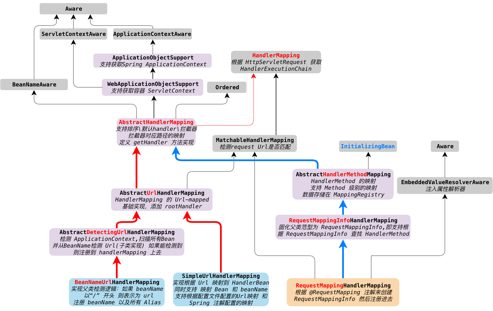

DispatcherServlet 继承自 HttpServlet，处理请求的时候，会调用 doDispatch 方法，在这之前还有一些处理，相对简单，直接过了

```java
/**
 * Process the actual dispatching to the handler.
 * <p>The handler will be obtained by applying the servlet's HandlerMappings in order.
 * The HandlerAdapter will be obtained by querying the servlet's installed HandlerAdapters
 * to find the first that supports the handler class.
 * <p>All HTTP methods are handled by this method. It's up to HandlerAdapters or handlers
 * themselves to decide which methods are acceptable.
 * @param request current HTTP request
 * @param response current HTTP response
 * @throws Exception in case of any kind of processing failure
 */
protected void doDispatch(HttpServletRequest request, HttpServletResponse response) throws Exception {
   HttpServletRequest processedRequest = request;
   HandlerExecutionChain mappedHandler = null;
   boolean multipartRequestParsed = false;

   WebAsyncManager asyncManager = WebAsyncUtils.getAsyncManager(request);

   try {
      ModelAndView mv = null;
      Exception dispatchException = null;

      try {
         // 多组件请求，处理文件上传之类的，非重点
         processedRequest = checkMultipart(request);
         multipartRequestParsed = (processedRequest != request);

         // Determine handler for the current request.
         /* 获取当前请求的 HandlerExecutionChain */
         mappedHandler = getHandler(processedRequest);
         if (mappedHandler == null) {
            noHandlerFound(processedRequest, response);
            return;
         }

         // ${后续处理}
}
```

doDispatch 可以说是 spring mvc 核心流程的模版方法，第一步先要去获取 HandlerExecutionChain，也就是这里的 getHandler 方法。我们点进去看一下具体实现

```java
/**
 * Return the HandlerExecutionChain for this request.
 * <p>Tries all handler mappings in order.
 * @param request current HTTP request
 * @return the HandlerExecutionChain, or {@code null} if no handler could be found
 */
@Nullable
protected HandlerExecutionChain getHandler(HttpServletRequest request) throws Exception {
   if (this.handlerMappings != null) {
      for (HandlerMapping mapping : this.handlerMappings) {
         HandlerExecutionChain handler = mapping.getHandler(request);
         if (handler != null) {
            return handler;
         }
      }
   }
   return null;
}
```

这里的 handlerMappings 实际上是一个存放 HandlerMapping 的List，也就是上图最下面的3个元素： 
1. org.springframework.web.servlet.handler.BeanNameUrlHandlerMapping 

2. org.springframework.web.servlet.handler.SimpleUrlHandlerMapping

3. org.springframework.web.servlet.mvc.method.annotation.RequestMappingHandlerMapping




我们继续进入这个 AbstractUrlHandlerMapping 的 getHandler 方法中去看下
在 BeanNameUrlHandlerMapping  和 SimpleUrlHandlerMapping 是直接调用父类 AbstractUrlHandlerMapping的方法

```java
/**
 * Look up a handler for the URL path of the given request.
 * @param request current HTTP request
 * @return the handler instance, or {@code null} if none found
 */
@Override
@Nullable
protected Object getHandlerInternal(HttpServletRequest request) throws Exception {
   // 从请求中获取请求 path 比如 /say/hello,这里是已经去掉项目映射之后的资源请求路径
   String lookupPath = getUrlPathHelper().getLookupPathForRequest(request);
   request.setAttribute(LOOKUP_PATH, lookupPath);
  	
   // 查找 handler 处理器，核心方法，进入
   Object handler = lookupHandler(lookupPath, request);
  
   //${如果没有处理器，则获取默认处理器，非重点}
   ... 
   return handler;
}
```
但是RequestMappingHandlerMapping 实现是子类重写了 ，代码如下，可以看到返回的是一个 HandlerMethod
```java
@Override
protected HandlerMethod getHandlerInternal(HttpServletRequest request) throws Exception {
   String lookupPath = getUrlPathHelper().getLookupPathForRequest(request);
   this.mappingRegistry.acquireReadLock();
   try {
     	// 查找对应的 handlerMethod，核心方法
      HandlerMethod handlerMethod = lookupHandlerMethod(lookupPath, request);
      return (handlerMethod != null ? handlerMethod.createWithResolvedBean() : null);
   }
   finally {
      this.mappingRegistry.releaseReadLock();
   }
}
```

我们是采用注解 RequestMapping 来配置路径映射，所以我们只看 RequestMappingHandlerMapping 的实现就好了，进入 lookupHandlerMethod 。

```java
/**
 * Look up the best-matching handler method for the current request.
 * If multiple matches are found, the best match is selected.
 * @param lookupPath mapping lookup path within the current servlet mapping
 * @param request the current request
 * @return the best-matching handler method, or {@code null} if no match
 * @see #handleMatch(Object, String, HttpServletRequest)
 * @see #handleNoMatch(Set, String, HttpServletRequest)
 */
@Nullable
protected HandlerMethod lookupHandlerMethod(String lookupPath, HttpServletRequest request) throws Exception {
   List<Match> matches = new ArrayList<>();
   // 首先从所有 注册的 mappingRegistry 中，根据 url 去查找对应的 RequestMappingInfo
   List<T> directPathMatches = this.mappingRegistry.getMappingsByUrl(lookupPath);
   if (directPathMatches != null) {
     	// 如果能根据 url 直接找到，则将 匹配的 RequestMappingInfo 添加到 matches列表里面去
      addMatchingMappings(directPathMatches, matches, request);
   }
   if (matches.isEmpty()) {
      // No choice but to go through all mappings...
     	// 如果没有 url 匹配的信息，则从所有的映射里面去查找匹配的，并加到 matches列表里面去
      addMatchingMappings(this.mappingRegistry.getMappings().keySet(), matches, request);
   }
	 // 如果有多个 handlerMethod 符合条件，则排序并选出一个最优匹配的，这里不是重点，无视	
   if (!matches.isEmpty()) {
      Comparator<Match> comparator = new MatchComparator(getMappingComparator(request));
      matches.sort(comparator);
      Match bestMatch = matches.get(0);
      if (matches.size() > 1) {
         if (logger.isTraceEnabled()) {
            logger.trace(matches.size() + " matching mappings: " + matches);
         }
         if (CorsUtils.isPreFlightRequest(request)) {
            return PREFLIGHT_AMBIGUOUS_MATCH;
         }
         Match secondBestMatch = matches.get(1);
         if (comparator.compare(bestMatch, secondBestMatch) == 0) {
            Method m1 = bestMatch.handlerMethod.getMethod();
            Method m2 = secondBestMatch.handlerMethod.getMethod();
            String uri = request.getRequestURI();
            throw new IllegalStateException(
                  "Ambiguous handler methods mapped for '" + uri + "': {" + m1 + ", " + m2 + "}");
         }
      }
      request.setAttribute(BEST_MATCHING_HANDLER_ATTRIBUTE, bestMatch.handlerMethod);
      handleMatch(bestMatch.mapping, lookupPath, request);
      return bestMatch.handlerMethod;
   }
   else {
     	// 没有符合条件的映射
      return handleNoMatch(this.mappingRegistry.getMappings().keySet(), lookupPath, request);
   }
}
```

可以看到 这里是从 mappingRegistry 根据请求 url 中获取对应的 handlerMethod，那么这个 mappingRegistry 里面的数据是什么时候放进去的呢？

如果要开启 RequestMapping 注解映射，需要在 spring-mvc.xml 文件里面添加 `<mvc:annotation-driven/>` 标签来开启注解，该标签由 MvcNamespaceHandler 处理器来解析并处理，在该处理器中，会委托给 AnnotationDrivenBeanDefinitionParser 来进行注解解析，解析器里面会将  RequestMappingHandlerMapping 添加到 org.springframework.beans.factory.support.DefaultListableBeanFactory 工厂里面去，又因为 RequestMappingHandlerMapping 类实现了 InitializingBean，所以 BeanFactory 会在最后阶段，创建 Bean 实例并调用其 afterPropertySet 方法，我们进入该类的 afterPropertySet 方法中看一下

```java
@Override
public void afterPropertiesSet() {
   // 创建 config 信息，这里非重点，跳过
   this.config = new RequestMappingInfo.BuilderConfiguration();
   this.config.setUrlPathHelper(getUrlPathHelper());
   this.config.setPathMatcher(getPathMatcher());
   this.config.setSuffixPatternMatch(this.useSuffixPatternMatch);
   this.config.setTrailingSlashMatch(this.useTrailingSlashMatch);
   this.config.setRegisteredSuffixPatternMatch(this.useRegisteredSuffixPatternMatch);
   this.config.setContentNegotiationManager(getContentNegotiationManager());
	 // 调用父类的方法，进入
   super.afterPropertiesSet();
}
```


```java
/**
 * Detects handler methods at initialization.
 * @see #initHandlerMethods
 */
@Override
public void afterPropertiesSet() {
   initHandlerMethods();
}

/**
 * Scan beans in the ApplicationContext, detect and register handler methods.
 * @see #getCandidateBeanNames()
 * @see #processCandidateBean
 * @see #handlerMethodsInitialized
 */
protected void initHandlerMethods() {
   // 这里 getCandidateBeanNames 实际上获取了所有的 bean（该类实现了 ApplicationContextAware 接口，所以能拿到这些数据）
   for (String beanName : getCandidateBeanNames()) {
      if (!beanName.startsWith(SCOPED_TARGET_NAME_PREFIX)) {
         // 处理候选 bean，进入
         processCandidateBean(beanName);
      }
   }
   handlerMethodsInitialized(getHandlerMethods());
}
```


```java
/**
 * Determine the type of the specified candidate bean and call
 * {@link #detectHandlerMethods} if identified as a handler type.
 * <p>This implementation avoids bean creation through checking
 * {@link org.springframework.beans.factory.BeanFactory#getType}
 * and calling {@link #detectHandlerMethods} with the bean name.
 * @param beanName the name of the candidate bean
 * @since 5.1
 * @see #isHandler
 * @see #detectHandlerMethods
 */
protected void processCandidateBean(String beanName) {
   Class<?> beanType = null;
   try {
      // 获取 bean 类型
      beanType = obtainApplicationContext().getType(beanName);
   }
   catch (Throwable ex) {
      // An unresolvable bean type, probably from a lazy bean - let's ignore it.
      if (logger.isTraceEnabled()) {
         logger.trace("Could not resolve type for bean '" + beanName + "'", ex);
      }
   }
   // 如果 beanType 是 Handler 则进行处理，即添加了 Controller 和 RequestMapping 注解的类
   if (beanType != null && isHandler(beanType)) {
     	// 探测 HandlerMethod  方法
      detectHandlerMethods(beanName);
   }
}
```

```java
/**
 * Look for handler methods in the specified handler bean.
 * @param handler either a bean name or an actual handler instance
 * @see #getMappingForMethod
 */
protected void detectHandlerMethods(Object handler) {
   Class<?> handlerType = (handler instanceof String ?
         obtainApplicationContext().getType((String) handler) : handler.getClass());

   if (handlerType != null) {
      Class<?> userType = ClassUtils.getUserClass(handlerType);
      // 查找所有添加了 @RequestMapping  注解的类，并转换为 RequestMappingInfo,存储到 Map 里面去
      Map<Method, T> methods = MethodIntrospector.selectMethods(userType,
            (MethodIntrospector.MetadataLookup<T>) method -> {
               try {
                  return getMappingForMethod(method, userType);
               }
               catch (Throwable ex) {
                  throw new IllegalStateException("Invalid mapping on handler class [" +
                        userType.getName() + "]: " + method, ex);
               }
            });
      if (logger.isTraceEnabled()) {
         logger.trace(formatMappings(userType, methods));
      }
     	// 注册
      methods.forEach((method, mapping) -> {
         // 不允许在 private 和 static 方法上添加 @RequestMapping注解
         Method invocableMethod = AopUtils.selectInvocableMethod(method, userType);
         // 将方法注册到 mappingRegistry 上面去
         registerHandlerMethod(handler, invocableMethod, mapping);
      });
   }
}
```

到这里我们就看完了 Spring HandlerMapping 的初始化流程 与 在请求进入时的 Handler 搜索处理流程。

但是还有一个问题时：RequestMappingHandlerMapping 是怎么注入到 DispatcherServlet 中的

DispatcherServlet 继承 HttpServletBean, 改了继承  HttpServlet ，且重写了 init 方法，所以在容器初始化阶段，会调用其 init 方法。在init方法内部最终会调用 initWebApplicationContext，最后会调用 DispatcherServlet 的 onRefresh 方法

```java
/**
 * This implementation calls {@link #initStrategies}.
 */
@Override
protected void onRefresh(ApplicationContext context) {
   initStrategies(context);
}

/**
 * Initialize the strategy objects that this servlet uses.
 * <p>May be overridden in subclasses in order to initialize further strategy objects.
 */
protected void initStrategies(ApplicationContext context) {
   initMultipartResolver(context);
   initLocaleResolver(context);
   initThemeResolver(context);
   // 初始化 handlerMapping
   initHandlerMappings(context);
   initHandlerAdapters(context);
   initHandlerExceptionResolvers(context);
   initRequestToViewNameTranslator(context);
   initViewResolvers(context);
   initFlashMapManager(context);
}
```

该方法内部会初始化 handlerMapping

```java
/**
 * Initialize the HandlerMappings used by this class.
 * <p>If no HandlerMapping beans are defined in the BeanFactory for this namespace,
 * we default to BeanNameUrlHandlerMapping.
 */
private void initHandlerMappings(ApplicationContext context) {
   this.handlerMappings = null;

   if (this.detectAllHandlerMappings) {
      // Find all HandlerMappings in the ApplicationContext, including ancestor contexts.
      // 从 ApplicationContext 包括其祖先中，获取所有 HandlerMapping
      Map<String, HandlerMapping> matchingBeans =
            BeanFactoryUtils.beansOfTypeIncludingAncestors(context, HandlerMapping.class, true, false);
      if (!matchingBeans.isEmpty()) {
         // 保存数据到当前 servlet
         this.handlerMappings = new ArrayList<>(matchingBeans.values());
         // We keep HandlerMappings in sorted order.  排序，这里是优先级的意思
         AnnotationAwareOrderComparator.sort(this.handlerMappings);
      }
   }
   else {
      try {
         HandlerMapping hm = context.getBean(HANDLER_MAPPING_BEAN_NAME, HandlerMapping.class);
         this.handlerMappings = Collections.singletonList(hm);
      }
      catch (NoSuchBeanDefinitionException ex) {
         // Ignore, we'll add a default HandlerMapping later.
      }
   }

   // Ensure we have at least one HandlerMapping, by registering
   // a default HandlerMapping if no other mappings are found.
   if (this.handlerMappings == null) {
      this.handlerMappings = getDefaultStrategies(context, HandlerMapping.class);
      if (logger.isTraceEnabled()) {
         logger.trace("No HandlerMappings declared for servlet '" + getServletName() +
               "': using default strategies from DispatcherServlet.properties");
      }
   }
}
```

到这里我们知道 handlerMapping 是如何保存到 DispatcherServlet。

至此，我们已经分析完 HandllerMapping 是如何初始化映射、注入DispatcherServlet、以及如何在一次请求中发挥作用。在handlerMapping 找到对应的 Handler 或者 HandlerMethod 之后，会包装一些 Inteceptor ，最终组装成 HandlerExecutionChain 返回给 Dispatcher，至此我们第一部分已经分析完毕。