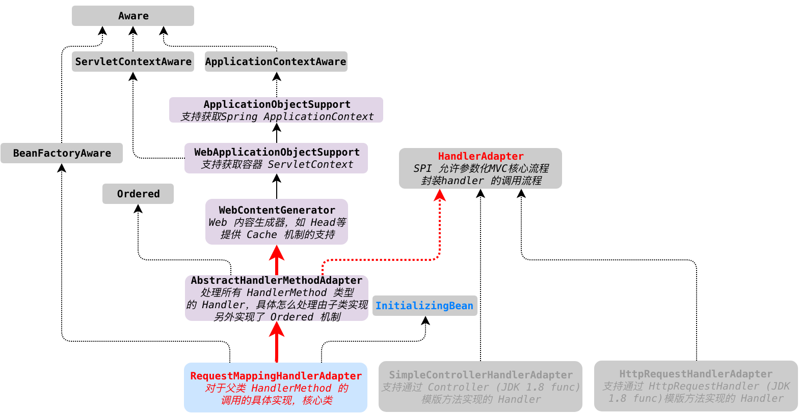

# JavaDoc

MVC framework SPI, allowing parameterization of the core MVC workflow.
MVC 框架的 SPI 扩展点，允许参数化 MVC 核心工作流程。

Interface that must be implemented for each handler type to handle a request. This interface is used to allow the DispatcherServlet to be indefinitely extensible. The DispatcherServlet accesses all installed handlers through this interface, meaning that it does not contain code specific to any handler type.
这个接口必须被每一个 handler 类型实现用以处理请求。这个接口用来允许 DispatcherServlet 变得无限可扩展。DispatcherServlet 通过这个接口来访问所有已经装载的 handlers，这意味着它不包含指定到 特定 handler 类型的代码。

Note that a handler can be of type Object. This is to enable handlers from other frameworks to be integrated with this framework without custom coding, as well as to allow for annotation-driven handler objects that do not obey any specific Java interface.
注意 handler 可以是一个 Object 类型。这允许其他框架的 handlers 不需要定制代码就可以集成到当前框架，也允许不服从任何特定的 java 接口的注解驱动的 handler 对象

This interface is not intended for application developers. It is available to handlers who want to develop their own web workflow.
这个接口不是用于应用开发人员。适用于给开发自己的网络工作流。

Note: HandlerAdapter implementors may implement the Ordered interface to be able to specify a sorting order (and thus a priority) for getting applied by the DispatcherServlet. Non-Ordered instances get treated as lowest priority
HandlerAdapter 的实现可能继承 Ordered接口来允许特定的排序（用来作为优先级），用以在DispatcherServlet 上的按顺序使用。非有序实例会被作为最低优先级



# source code

继续接着第一节 HandlerMapping 往下分析 MVC 的主流程代码，可以看到 关于 HandlerAdapter 的实现。从上面我们可以知道 HandlerAdapter 主要有2个作用，**第一个是提供 SPI 扩展，便于通过这个扩展点实现定制化的框架工作流程，第二个是对 DispatcherServlet 屏蔽不同类型 Handler 的具体调用细节**。

```java
/**
 * Process the actual dispatching to the handler.
 * <p>The handler will be obtained by applying the servlet's HandlerMappings in order.
 * The HandlerAdapter will be obtained by querying the servlet's installed HandlerAdapters
 * to find the first that supports the handler class.
 * <p>All HTTP methods are handled by this method. It's up to HandlerAdapters or handlers
 * themselves to decide which methods are acceptable.
 * @param request current HTTP request
 * @param response current HTTP response
 * @throws Exception in case of any kind of processing failure
 */
protected void doDispatch(HttpServletRequest request, HttpServletResponse response) throws Exception {
   HttpServletRequest processedRequest = request;
   HandlerExecutionChain mappedHandler = null;
   boolean multipartRequestParsed = false;

   WebAsyncManager asyncManager = WebAsyncUtils.getAsyncManager(request);

   try {
      ModelAndView mv = null;
      Exception dispatchException = null;

      try {
         // ${获取 handler}

         // Determine handler adapter for the current request.
         /* 2.1 查找第一步获取到的 Handler 对象对应的 HandlerAdapter*/
         HandlerAdapter ha = getHandlerAdapter(mappedHandler.getHandler());

         // Process last-modified header, if supported by the handler.
         String method = request.getMethod();
         boolean isGet = "GET".equals(method);
         if (isGet || "HEAD".equals(method)) {
            long lastModified = ha.getLastModified(request, mappedHandler.getHandler());
            if (new ServletWebRequest(request, response).checkNotModified(lastModified) && isGet) {
               return;
            }
         }
				 // 2.2 
         if (!mappedHandler.applyPreHandle(processedRequest, response)) {
            return;
         }

         // 2.3  通过 handlerAdapter 调用 Handler 对象
         mv = ha.handle(processedRequest, response, mappedHandler.getHandler());

         // ${后续处理}
}
```

在 2.1 里面，查找 HandlerAdapter  的代码如下

```java
/**
 * Return the HandlerAdapter for this handler object.
 * @param handler the handler object to find an adapter for
 * @throws ServletException if no HandlerAdapter can be found for the handler. This is a fatal error.
 */
protected HandlerAdapter getHandlerAdapter(Object handler) throws ServletException {
   if (this.handlerAdapters != null) {
      for (HandlerAdapter adapter : this.handlerAdapters) {
         if (adapter.supports(handler)) {
            return adapter;
         }
      }
   }
   throw new ServletException("No adapter for handler [" + handler +
         "]: The DispatcherServlet configuration needs to include a HandlerAdapter that supports this handler");
}
```

这里的 handlerAdapters 对象是一个 数组，存放所有的 HandlerAdaper，这里有一个 RequestMappingHandlerAdapter 适配器，跟第一篇的 RequestMappingHandlerMapping 对象一样，该对象也是在 spring-mvc 的注解驱动解析器中生成并加载到 BeanFactory 中的，最后在 DispatcherServlet 的 init 方法中注入进来。RequestMappingHandlerAdapter 处理没有设置 order 参数，所以具有最低优先级，在  SimpleControllerHandlerAdapter 和 HttpRequestHandlerAdapter 之后被执行处理，support 方法默认在 父类 AbstractHandlerMethodAdapter 中做过判断，处理所有 HandlerMethod 类型的 Handler。

我们继续往下分析, 2.2 是在具体调用 handle 方法之前，先进行拦截器处理，如果不通过，则直接返回

2.3 是真正调用 HandlerAdapter#handle 方法，也是本文分析的重点。我们点进去看下

最终调用的是 

``` java
@Override
protected ModelAndView handleInternal(HttpServletRequest request,
      HttpServletResponse response, HandlerMethod handlerMethod) throws Exception {

   ModelAndView mav;
   checkRequest(request);

   // Execute invokeHandlerMethod in synchronized block if required.
   // 如果需要在 session 上同步，则使用 synchronized 代码块执行
   if (this.synchronizeOnSession) {
      HttpSession session = request.getSession(false);
      if (session != null) {
         Object mutex = WebUtils.getSessionMutex(session);
         synchronized (mutex) {
            mav = invokeHandlerMethod(request, response, handlerMethod);
         }
      }
      else {
         // No HttpSession available -> no mutex necessary
         mav = invokeHandlerMethod(request, response, handlerMethod);
      }
   }
   else {
      // No synchronization on session demanded at all...
      mav = invokeHandlerMethod(request, response, handlerMethod);
   }

   if (!response.containsHeader(HEADER_CACHE_CONTROL)) {
      if (getSessionAttributesHandler(handlerMethod).hasSessionAttributes()) {
         applyCacheSeconds(response, this.cacheSecondsForSessionAttributeHandlers);
      }
      else {
         prepareResponse(response);
      }
   }

   return mav;
}
```

继续往下看  invokeHandlerMethod

```java
/**
 * Invoke the {@link RequestMapping} handler method preparing a {@link ModelAndView}
 * if view resolution is required.
 * @since 4.2
 * @see #createInvocableHandlerMethod(HandlerMethod)
 */
@Nullable
protected ModelAndView invokeHandlerMethod(HttpServletRequest request,
      HttpServletResponse response, HandlerMethod handlerMethod) throws Exception {

   ServletWebRequest webRequest = new ServletWebRequest(request, response);
   try {
      // ${非重点}
			
      /*对请求参数进行处理，调用目标HandlerMethod，并且将返回值封装为一个ModelAndView对象*/
      invocableMethod.invokeAndHandle(webRequest, mavContainer);
      if (asyncManager.isConcurrentHandlingStarted()) {
         return null;
      }

      return getModelAndView(mavContainer, modelFactory, webRequest);
   }
   finally {
      webRequest.requestCompleted();
   }
}
```

继续进入 invokeAndHandle 

```java
/**
 * Invoke the method and handle the return value through one of the
 * configured {@link HandlerMethodReturnValueHandler HandlerMethodReturnValueHandlers}.
 * @param webRequest the current request
 * @param mavContainer the ModelAndViewContainer for this request
 * @param providedArgs "given" arguments matched by type (not resolved)
 */
public void invokeAndHandle(ServletWebRequest webRequest, ModelAndViewContainer mavContainer,
      Object... providedArgs) throws Exception {

   // 调用 handler 并获取返回值
   Object returnValue = invokeForRequest(webRequest, mavContainer, providedArgs);
	 setResponseStatus(webRequest);

	 // ${异常处理}

		mavContainer.setRequestHandled(false);
		Assert.state(this.returnValueHandlers != null, "No return value handlers");
		try {
			this.returnValueHandlers.handleReturnValue(
					returnValue, getReturnValueType(returnValue), mavContainer, webRequest);
      
    } // {异常处理} 
}
```

```java
@Nullable
public Object invokeForRequest(NativeWebRequest request, @Nullable ModelAndViewContainer mavContainer,
      Object... providedArgs) throws Exception {
	 // 解析方法参数
   Object[] args = getMethodArgumentValues(request, mavContainer, providedArgs);
   if (logger.isTraceEnabled()) {
      logger.trace("Arguments: " + Arrays.toString(args));
   }
   // 方法调用
   return doInvoke(args);
}
```

```java
/**
 * Invoke the handler method with the given argument values.
 */
@Nullable
protected Object doInvoke(Object... args) throws Exception {
   ReflectionUtils.makeAccessible(getBridgedMethod());
   try {
      // 通过反射调用目标方法
      return getBridgedMethod().invoke(getBean(), args);
   }
   // ${其他..}
}
```

这里可以看到，最终会通过反射获取目标 bean，然后通过反射机制，调用我们的 RequestMapping 方法，在获取到 returnValue之后，会查找对应的 returnValueHandler 来进行处理 

```java
@Override
public void handleReturnValue(@Nullable Object returnValue, MethodParameter returnType,
      ModelAndViewContainer mavContainer, NativeWebRequest webRequest) throws Exception {

   HandlerMethodReturnValueHandler handler = selectHandler(returnValue, returnType);
   if (handler == null) {
      throw new IllegalArgumentException("Unknown return value type: " + returnType.getParameterType().getName());
   }
   handler.handleReturnValue(returnValue, returnType, mavContainer, webRequest);
}
```

我们的代码里面，对Controller的映射方法使用了 @ResponseBody 注解，所以这里简单看一下 RequestResponseBodyMethodProcessor 

```java
@Override
public void handleReturnValue(@Nullable Object returnValue, MethodParameter returnType,
      ModelAndViewContainer mavContainer, NativeWebRequest webRequest)
      throws IOException, HttpMediaTypeNotAcceptableException, HttpMessageNotWritableException {

   mavContainer.setRequestHandled(true);
   ServletServerHttpRequest inputMessage = createInputMessage(webRequest);
   ServletServerHttpResponse outputMessage = createOutputMessage(webRequest);

   // Try even with null return value. ResponseBodyAdvice could get involved.
   writeWithMessageConverters(returnValue, returnType, inputMessage, outputMessage);
}
```

这里 writeWithMessageConverters 最终会组装页面 html 返回报文，最终返回给客户端，这里面不再细看了。
如果是有 Velocity 模版引擎，这里不会直接返回，而是会将结果保存，再后续视图渲染的时候才进行页面返回报文渲染
关于 HandlerAdapter 就解析到这，视图解析器 非 MVC 流程的重点，这里不再分析了