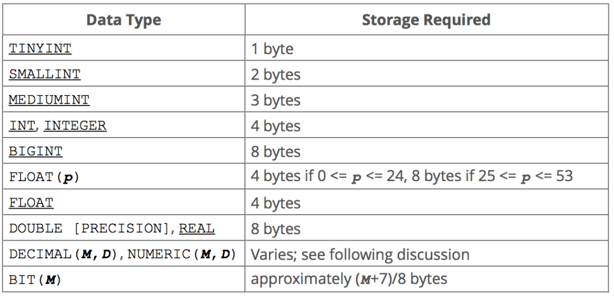
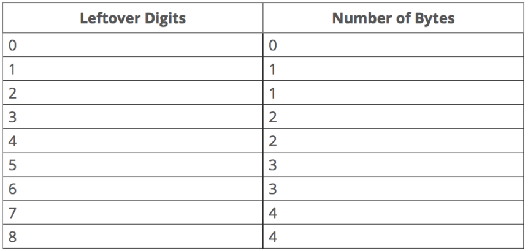
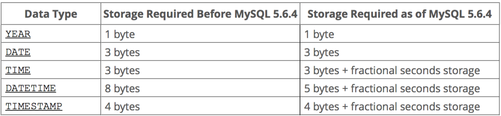
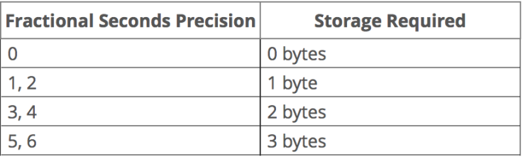
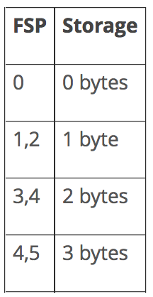
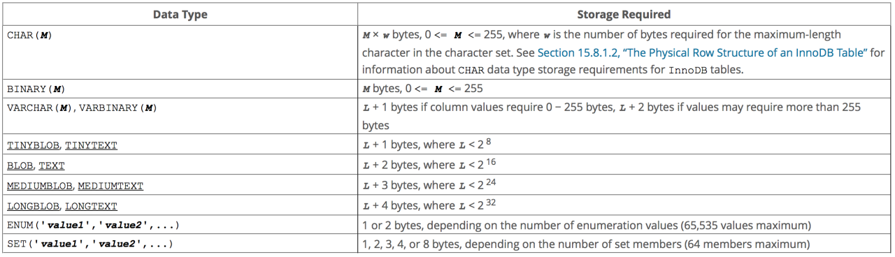

# 数值类型

## 整数类型

### 整数类型的分类

| **类型名称**  | **存储需求** | **JAVA类型** | **最小值**               | **最大值**              |
| ------------- | ------------ | ------------ | ------------------------ | ----------------------- |
| **TINYINT**   | 1            | Integer      | -128                     | 127                     |
| **SMALLINT**  | 2            | Integer      | -32768                   | 32767                   |
| **MEDIUMINT** | 3            | Integer      | -1677,7216               | 1677,7215               |
| **INT**       | 4            | Integer      | -21,4748,3648            | 2,1,4748,3647           |
| **BIGINT**    | 8            | Long         | -922,3372,0368,5477,5808 | 922,3372,0368,5477,5807 |

### 整数类型的存储需求



> 显示宽度与取值范围
>
> 如  *int(11)*  其中11表示数据类型指定的**显示宽度**，指定能显示的数值中的数字的个数。注意：<u>［**显示宽度**］和数据类型的［**取值范围**］是无关的。显示宽度只是指明MySQL最大可能显示的数字个数，数值的位数小于指定宽度时会有空格填充。但是，如果插入了大于显示宽度的值，只要该值不超过取值范围，数值依然可以插入，而且在查询该列值的时候，将会显示完整的插入值，而不会进行显示宽度处理。</u>
>
> 自测
>
> 1. 测试步骤
>
> ```mysql
> sql> CREATE TABLE num_test (
>   int_4 INT(4),
>   int_  INT
> )
> [2018-04-03 15:57:18] completed in 202ms
> 
> sql> INSERT INTO num_test VALUES (1999999999, 1999999999)
> [2018-04-03 15:58:29] 1 row affected in 21ms
> 
> sql> INSERT INTO num_test VALUES (1999999999999, 1999999999999)
> [2018-04-03 15:58:40] [01000][1264] Out of range value for column 'int_4' at row 1
> ```
>
> 2. 测试现象&结论
>
> 整数类型数字，即使设置显示宽度，对数据的查询和存储都没有任何影响（数据能够存进去并且完整的查出来）。只有当插入的数据大于最大［**取值范围**］，才会提示错误。所以，int(11) 与 int 效果是完全一样的。其它整数类型与int一样。（如果设置ZeroFill 会在显示的时候补足P位，这个只是显示上的不同）

### 整数的最大取值范围

计算方式以int为例：
Int长度为4个字节，每个字节8 bit，有4 * 8 ＝ 32, 减去一位符号位，剩余31位来存储数据。
故取值范围为  ， 即 -21,4748,3648    ~   21,4748,3647
如果int值不可能为负数，建议设置 UNSIGNED标识，表示无符号位，此时32位均可存数据，范围为 0～42亿。

## 浮点存储

### 基本分类

浮点类型：单精度（FLOAT）和双精度（DOUBLE）。
定点类型：DECIMAL。
二者都可以用（M,D）来表示，其中M称为**精度**，表示总的位数(小数点前与小数点后位数的总和)，D称为**标度**，表示小数点后的位数。

| **类型名称**     | **存储需求** | **JAVA类型**  |
| ---------------- | ------------ | ------------- |
| **FLOAT**        | 4            | Float/float   |
| **DOUBLE**       | 8            | Double/double |
| **DECIMAL(M,D)** | M+2          | BigDecimal    |

### 浮点存储原理

#### 什么是浮点数？

在数学中，特别是在计算机相关的数字（浮点数）问题的表述中，有一个基本表达法：

​								$$浮点数值 = 尾数 * 底数 ^{指数}$$

以6,0193,8035为例，可以表达为:

​								$$6.019 * 10 ^ 7$$

为了遵守科学计数法的规范，一般情况下：**尾数 < 底数** （如上公式 6.019 < 10 ）
“尾数”又可称之为“精度”，即对表达结果的精确程度产生重要影响的数，上面这个数值如果想通过科学计数法来更确切地表达的话，那么我们只能在尾数上下手，如：

​								$$6.01938035 * 10 ^ 7$$

由此可知，**<u>浮点数精度取决于尾数，而取值范围取决于指数</u>**
回到主题，我们继续看Mysql 中的Float 与Double
在Mysql中float与double的存储设置如下（**底数为2**）

|            | **符号位** | **指数(取值范围)** | **尾数(数据精度)** |
| ---------- | ---------- | ------------------ | ------------------ |
| **Float**  | 1          | 8                  | 23                 |
| **Double** | 1          | 11                 | 52                 |

> 测试
>
> ```mysql
> sql> CREATE TABLE num_test (
>   float_ float,
>   double_ double
> )
> 
> sql> INSERT INTO num_test VALUES (1234567.123,1234567.123)
> 
> sql> select * from num_test;
> +---------+-------------+
> | float_  | double_     |
> +---------+-------------+
> | 1234570 | 1234567.123 |
> +---------+-------------+
> 1 row in set (0.00 sec)
> ```

#### Float存储原理

|           | **符号位** | **指数(取值范围)** | **尾数(数据精度)**      |
| --------- | ---------- | ------------------ | ----------------------- |
| **Float** | 0          | 10010011           | 00101101011010000111001 |

指数 `10010011＝147` 这里需要减去 127 得到  20 
尾数 `00101101011010000111001` 需要加入一个1 为 `1.00101101011010000111001`
如此我们需要将 `1.00101101011010000111001` 乘以2的20次方
**实际就是右移动20位** 为 `100101101011010000111.001`
其中整数部分 `100101101011010000111=1234567` 这里就是最后的数据 `1234567`
而显示的时候 `1234567` 又被四舍五入为 `1234570`

#### Double存储原理

|            | **符号位** | **指数(取值范围)** | **尾数(数据精度****)**                               |
| ---------- | ---------- | ------------------ | ---------------------------------------------------- |
| **Double** | 0          | 10000010011        | 0010110101101000011100011111011111001110110110010001 |
指数`10000010011＝1043` 这里需要减去1023 ＝ 20 
尾数 `0010110101101000011100011111011111001110110110010001`需要加入一个1 
为`1.0010110101101000011100011111011111001110110110010001`
乘以2的20次方 **实际就是右移动20位**为`100101101011010000111.00011111011111001110110110010001`
其中整数部分`100101101011010000111=1234567`这里就是最后的数据`1234567`
小数部分`0.0001111101111100＝0.123`，其额外的部分为无效数字

> 关于小数部分的计算：
>第一位 $$ 0*2^{-1}$$
>第二位 $$0*2^{-2}$$
>第三位 $$0*2^{-3}$$
>第四位 $$1*2^{-4}=\frac{1}{16}$$
>第五位 $$1*2^{-5}=\frac{1}{32}$$
>第六位 $$1*2^{-6}=\frac{1}{64}$$
> 二进制的小数转换为十进制主要是乘以2的负次方，从小数点后开始，依次乘以2的负一次方，2的负二次方，2的负三次方等。

FLOAT 和 DOUBLE 在不指定精度的时候，默认按照实际的精度（由计算机硬件和操作系统决定）

## 定点存储

### 什么是定点存储？

固定整数和小数位数的存储形式，就是定点数存储。

### 存储原理

MySQL 分别为整数和小数部分分配存储空间。 MySQL 使用二进制格式存储 DECIMAL 值。它将 **9位数字包装成4个字节**. 对于每个部分，需要4个字节来存储9位数的每个倍数。剩余数字所需的存储如下表所示：

> Values for DECIMAL (and NUMERIC) columns are represented using a binary format that **packs nine decimal (base 10) digits into four bytes**. Storage for the integer and fractional parts of each value are determined separately. Each multiple of nine digits requires four bytes, and the “leftover” digits require some fraction of four bytes. The storage required for excess digits is given by the following table.



例如，DECIMAL(19,9) 对于小数部分具有9位数字，对于整数部分具有19-9位 = 10位数字，小数部分需要4个字节。 整数部分对于前9位数字需要4个字节，1个剩余字节需要1个字节。DECIMAL(19,9)列总共需要9个字节

### Decimal的用法

以下示例使用DECIMAL数据类型定义的一个叫作amount的列。
```mysql
amount DECIMAL(6,2);
```
在此示例中，amount列最多可以存储6位数字，小数位数为2位; 因此，amount列的范围是从-9999.99到9999.99。
MySQL允许使用以下语法：
```mysql
column_name DECIMAL(P);
```
这相当于：
```mysql
column_name DECIMAL(P,0);
```
在这种情况下，列不包含小数部分或小数点。
此外，我们甚至可以使用以下语法。
```mysql
column_name DECIMAL;
```
在这种情况下，P的默认值为10。
**不论是定点类型还是浮点类型，如果用户指定的数据超出精度范围，则会进行四舍五入处理**

# 日期类型

## 基本分类

| *类型名称*  | *格式*              | *存储Bytes* | *存储范围*                                                |
| ----------- | ------------------- | ----------- | --------------------------------------------------------- |
| *DATE*      | YYYY-MM-DD          | 3           | 1000-01-01 ~ 9999-12-31                                   |
| *DATETIME*  | YYYY-MM-DD HH:MM:SS | 8           | 1000-01-01 00:00:00.000000 9999-12-31 23:59:59.999999    |
| *TIMESTAMP* | YYYY-MM-DD HH:MM:SS | 4           | 1970-01-01 00:00:01.000000 **2038-01-19 03:14:07.999999** |
| *YEAR*      | YYYY                | 1           | 1901 ~ 2155                                               |

下图是日期类型的内存使用情况



> As of MySQL 5.6.4, storage for YEAR and DATE remains unchanged. However, TIME, DATETIME, and TIMESTAMP are represented differently. DATETIME is packed more efficiently, requiring 5 rather than 8 bytes for the nonfractional part, and all three parts have a fractional part that requires from 0 to 3 bytes, depending on the fractional seconds precision of stored values.
>
> 
>
> For example, TIME(0), TIME(2), TIME(4), and TIME(6) use 3, 4, 5, and 6 bytes, respectively. TIME and TIME(0) are equivalent and require the same storage.

## 存储原理

### YEAR

YEAR的存储原理比较简单**：A one-byte integer**

### DATE

DATE数据类型用来存储没有时间的日期。支持的时间范围为"1000-00-00" 到 "9999-12-31"。
存储方式是二进制存储
DATE: **A three-byte integer packed as YYYY×16×32 + MM×32 + DD**

|            | **年**              | **月**      | **日**      |
| ---------- | ------------------- | ----------- | ----------- |
| **位数**   | 15                  | 4           | 5           |
| **最大值** | $$2^{15} = 32768 > 9999$$ | $$2^4=16 > 12$$ | $$2^5=32 > 31$$ |
| **DATE**   | 000011111011001     | 0011        | 00101       |

如20090309 按照DATE存储转换为二进制为：[000011111011001 0011 01001]   16进制为 [0FB269]
查看数据库数据文件，值为[0000 0000 0cf9 0000 6900 0fb2]
f9: 是标志位
0c 00 00 00: COL1,INT = 12
69 b2 0f: 即日期.由于是反向存储,所以需要反向读取:0FB269

### TIME

Time 存储原理：**A three-byte integer packed as DD×24×3600 + HH×3600 + MM×60 + SS**
这个可以理解为存储的是一个单位为秒的整数。

### DATETIME

存储原理：**Eight bytes: A four-byte integer for date packed as YYYY×10000 + MM×100 + DD and a four-byte integer for time packed as HH×10000 + MM×100 + SS**
即数据库存进去的就是时间的Integer格式化的：1位的符号位 + 31位的DATE + 32位的TIME。
参考文档： https://dev.mysql.com/doc/internals/en/date-and-time-data-type-representation.html

### TIMESTAMP

TIMESTAMP类型**［显示宽度］固定在19个字符，且其值的存储是以UTC（世界标准时间）格式保存的，存储时间时对当前时区进行转换，检索时再次进行转换**。即查询时，当前时区不同，显示的时间值是不同的。(其它时间格式没有这个特性)

TIMESTAMP类型的列还有个特性：**默认情况下，在 insert, update 数据时，TIMESTAMP列会自动以当前时间（CURRENT_TIMESTAMP）填充/更新**。"自动"的意思就是，你不去管它，MySQL 会替你去处理。这个逻辑只有在数据真正产生更新的时候才会生效，如果更新某一个字段为1，但是这个字段的值已经是1的时候，TIMESTAMP列是不会自动更新的。(5.6.5版本Mysql以前，只有 TIMESTAMP 有这个特性，5.6.5之后，DATETIME 字段也具有这个特性)。

存储原理：
**A four-byte integer representing seconds UTC since the epoch ('1970-01-01 00:00:00' UTC)**

TIMESTAMP 在存储上，实际存的是一个时间戳，表示从格林威治时间1970年01月01日00时00分00秒(北京时间1970年01月01日08时00分00秒)起至现在的总秒数。数据库中存储的也就是这个总秒数。总共占用4个字节，4 * 8 = 32, 去除一个符号位（时间也有负数，用以计算时间相减），剩余31位用来存储时间。$$2^{31}= 21,4748,3648秒$$。约为68年，即TIMESTAMP可以存储的最大时间约为2038年。

> DATETIME & TIMESTAMP 的6位精度
>
> MySQL 5.7 has fractional seconds support for [TIME](https://dev.mysql.com/doc/refman/5.7/en/time.html), [DATETIME](https://dev.mysql.com/doc/refman/5.7/en/datetime.html), and [TIMESTAMP](https://dev.mysql.com/doc/refman/5.7/en/datetime.html) values, with up to microseconds (6 digits) precision:
>
> · To define a column that includes a fractional seconds part, use the syntax **type_name**(**fsp**), where **type_name** is [TIME](https://dev.mysql.com/doc/refman/5.7/en/time.html), [DATETIME](https://dev.mysql.com/doc/refman/5.7/en/datetime.html), or[TIMESTAMP](https://dev.mysql.com/doc/refman/5.7/en/datetime.html), and **fsp** is the fractional seconds precision. For example:
>
> ```mysql
> CREATE TABLE t1 (t TIME(3), dt DATETIME(6));
> ```
>
> The **fsp** value, if given, must be in the range 0 to 6. A value of 0 signifies that there is no fractional part. If omitted, the default precision is 0. (This differs from the standard SQL default of 6, for compatibility with previous MySQL versions.)
>
> · Inserting a [TIME](https://dev.mysql.com/doc/refman/5.7/en/time.html), [DATE](https://dev.mysql.com/doc/refman/5.7/en/datetime.html), or [TIMESTAMP](https://dev.mysql.com/doc/refman/5.7/en/datetime.html) value with a fractional seconds part into a column of the same type but having fewer fractional digits results in rounding, as shown in this example:
>
> ```mysql
> · mysql> CREATE TABLE fractest( c1 TIME(2), c2 DATETIME(2), c3 TIMESTAMP(2) );
> · Query OK, 0 rows affected (0.33 sec)
> · mysql> INSERT INTO fractest VALUES
> ·      > ('17:51:04.777', '2014-09-08 17:51:04.777', '2014-09-08 17:51:04.777');
> · Query OK, 1 row affected (0.03 sec)
> · 
> · mysql> SELECT * FROM fractest;
> · +-------------+------------------------+------------------------+
> · | c1          | c2                     | c3                     |
> · +-------------+------------------------+------------------------+
> · | 17:51:04.78 | 2014-09-08 17:51:04.78 | 2014-09-08 17:51:04.78 |
> · +-------------+------------------------+------------------------+
> . 1 row in set (0.00 sec)
> ```
>
> No warning or error is given when such rounding occurs. This behavior follows the SQL standard, and is not affected by the server's [sql_mode](#sysvar_sql_mode)setting.
>
> * Functions that take temporal arguments accept values with fractional seconds. Return values from temporal functions include fractional seconds as appropriate. For example, [NOW()](#function_now) with no argument returns the current date and time with no fractional part, but takes an optional argument from 0 to 6 to specify that the return value includes a fractional seconds part of that many digits.
>
> *  Syntax for temporal literals produces temporal values: DATE '**str**', TIME '**str**', and TIMESTAMP '**str**', and the ODBC-syntax equivalents. The resulting value includes a trailing fractional seconds part if specified. Previously, the temporal type keyword was ignored and these constructs produced the string value. See [Standard SQL and ODBC Date and Time Literals](#date-and-time-standard-sql-literals)
>
>   

# 字符类型

字符串类型分为文本字符串 和 二进制字符串

## 字符类型的基本分类

| *类型名称*   | *说明*                   | *存储需求*                             |
| ------------ | ------------------------ | -------------------------------------- |
| *CHAR(M)*    | 定长，非二进制           | M字节  1 <= M <= 255                   |
| *VARCHAR(M)* | 变长，非二进制           | L+1字节 L <= M && 1 <= M <= 65535      |
| *TINYTEXT*   | 非常小的非二进制字符串   | L+1个字节，这里L < 2^16 = 256          |
| *TEXT*       | 小的非二进制字符串       | L+2个字节，这里L < 2^16 = 65535        |
| *MEDIUMTEXT* | 中等大小的非二进制字符串 | L+3个字节，这里L < 2^24 = 1677,7216    |
| *LONGTEXT*   | 大的非二进制字符串       | L+4个字节，这里L < 2^32 = 42,9496,7296 |



CHAR(M)为**固定长度的字符串**，定义时指定字符串列长，**保存时右侧填充空格以达到指定长度**。M表示列长度，M的范围是0-255个字符。**检索时，尾部的空格将会被删除**。如果存入了一个超过M长度的字符串，会导致该字符串被截断，只保留前M位。

VARCHAR(M)是**长度可变的字符串**，M表示最大列的长度。M的范围是0-65535。

例如，VARCHAR(50) 定义了一个最大长度为50的字符串，如果输入的字符串只有10个字符，那么只需要实际存储的是10个字符和**一个长度信息字符**。**VARCHAR在值保存和值检索的时候，空格保存**。

## 不同编码下的字节占用情况

| **编码**  | **英文** | **中文汉字** |
| --------- | -------- | ------------ |
| *UTF-8*   | 1        | **3**        |
| *GBK*     | 1        | **2**        |
| *ASCII*   | 1        | 2            |
| *Unicode* | 2        | 2            |
| *UTF-16*  | 2        | 2            |
| *UTF-32*  | 4        | 4            |