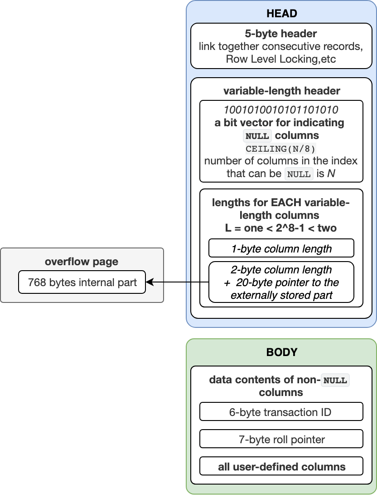

原文地址： https://dev.mysql.com/doc/refman/8.0/en/innodb-row-format.html

## 15.10 InnoDB Row Formats

The row format of a table determines how its rows are physically stored, which in turn can affect the performance of queries and DML operations. As more rows fit into a single disk page, queries and index lookups can work faster, less cache memory is required in the buffer pool, and less I/O is required to write out updated values.

The data in each table is divided into pages. The pages that make up each table are arranged in a tree data structure called a B-tree index. Table data and secondary indexes both use this type of structure. The B-tree index that represents an entire table is known as the clustered index, which is organized according to the primary key columns. The nodes of a clustered index data structure contain the values of all columns in the row. The nodes of a secondary index structure contain the values of index columns and primary key columns.

<u>Variable-length columns are an exception to the rule that column values are stored in B-tree index nodes. Variable-length columns that are too long to fit on a B-tree page are stored on separately allocated disk pages called **overflow pages**. Such columns are referred to as off-page columns. The values of off-page columns are stored in singly-linked lists of overflow pages, with each such column having its own list of one or more overflow pages. Depending on column length, all or a prefix of variable-length column values are stored in the B-tree to avoid wasting storage and having to read a separate page.</u>

The `InnoDB` storage engine supports four row formats: `REDUNDANT`冗余, `COMPACT`紧凑, `DYNAMIC`动态, and `COMPRESSED`压缩.

**Table 15.16 InnoDB Row Format Overview**

| Row Format   | Compact Storage Characteristics | Enhanced Variable-Length Column Storage | Large Index Key Prefix Support | Compression Support | Supported Tablespace Types      |
| ------------ | ------------------------------- | --------------------------------------- | ------------------------------ | ------------------- | ------------------------------- |
| `REDUNDANT`  | No                              | No                                      | No                             | No                  | system, file-per-table, general |
| `COMPACT`    | Yes                             | No                                      | No                             | No                  | system, file-per-table, general |
| `DYNAMIC`    | Yes                             | Yes                                     | Yes                            | No                  | system, file-per-table, general |
| `COMPRESSED` | Yes                             | Yes                                     | Yes                            | Yes                 | file-per-table, general         |

The topics that follow describe row format storage characteristics and how to define and determine the row format of a table.

- [REDUNDANT Row Format](https://dev.mysql.com/doc/refman/8.0/en/innodb-row-format.html#innodb-row-format-redundant)
- [COMPACT Row Format](https://dev.mysql.com/doc/refman/8.0/en/innodb-row-format.html#innodb-row-format-compact)
- [DYNAMIC Row Format](https://dev.mysql.com/doc/refman/8.0/en/innodb-row-format.html#innodb-row-format-dynamic)
- [COMPRESSED Row Format](https://dev.mysql.com/doc/refman/8.0/en/innodb-row-format.html#innodb-row-format-compressed)
- [Defining the Row Format of a Table](https://dev.mysql.com/doc/refman/8.0/en/innodb-row-format.html#innodb-row-format-defining)
- [Determining the Row Format of a Table](https://dev.mysql.com/doc/refman/8.0/en/innodb-row-format.html#innodb-row-format-detrmining)

### REDUNDANT Row Format

Tables that use the `REDUNDANT` row format store the first 768 bytes of variable-length column values ([`VARCHAR`](https://dev.mysql.com/doc/refman/8.0/en/char.html), [`VARBINARY`](https://dev.mysql.com/doc/refman/8.0/en/binary-varbinary.html), and [`BLOB`](https://dev.mysql.com/doc/refman/8.0/en/blob.html) and [`TEXT`](https://dev.mysql.com/doc/refman/8.0/en/blob.html)types) in the index record within the B-tree node, with the remainder stored on overflow pages. Fixed-length columns greater than or equal to 768 bytes are encoded as variable-length columns, which can be stored off-page. For example, a `CHAR(255)` column can exceed 768 bytes if the maximum byte length of the character set is greater than 3, as it is with `utf8mb4`.

If the value of a column is 768 bytes or less, an overflow page is not used, and some savings in I/O may result, since the value is stored entirely in the B-tree node. This works well for relatively short `BLOB` column values, but may cause B-tree nodes to fill with data rather than key values, reducing their efficiency. Tables with many `BLOB` columns could cause B-tree nodes to become too full, and contain too few rows, making the entire index less efficient than if rows were shorter or column values were stored off-page.

#### REDUNDANT Row Format Storage Characteristics

The `REDUNDANT` row format has the following storage characteristics:

- Each index record contains a 6-byte header. The header is used to link together consecutive records, and for row-level locking.
- Records in the clustered index contain fields for all user-defined columns. In addition, there is a 6-byte transaction ID field and a 7-byte roll pointer field.
- If no primary key is defined for a table, each clustered index record also contains a 6-byte row ID field.
- Each secondary index record contains all the primary key columns defined for the clustered index key that are not in the secondary index.
- A record contains a pointer to each field of the record. If the total length of the fields in a record is less than 128 bytes, the pointer is one byte; otherwise, two bytes. The array of pointers is called the record directory. The area where the pointers point is the data part of the record.
- Internally, fixed-length character columns such as [`CHAR(10)`](https://dev.mysql.com/doc/refman/8.0/en/char.html) in stored in fixed-length format. Trailing spaces are not truncated from[`VARCHAR`](https://dev.mysql.com/doc/refman/8.0/en/char.html) columns.
- Fixed-length columns greater than or equal to 768 bytes are encoded as variable-length columns, which can be stored off-page. For example, a `CHAR(255)` column can exceed 768 bytes if the maximum byte length of the character set is greater than 3, as it is with`utf8mb4`.
- An SQL `NULL` value reserves one or two bytes in the record directory. An SQL `NULL` value reserves zero bytes in the data part of the record if stored in a variable-length column. For a fixed-length column, the fixed length of the column is reserved in the data part of the record. Reserving fixed space for `NULL` values permits columns to be updated in place from `NULL` to non-`NULL` values without causing index page fragmentation.

### COMPACT Row Format

The `COMPACT` row format reduces row storage space by about 20% compared to the `REDUNDANT` row format, at the cost of increasing CPU use for some operations. If your workload is a typical one that is limited by cache hit rates and disk speed, `COMPACT` format is likely to be faster. If the workload is limited by CPU speed, compact format might be slower.

Tables that use the `COMPACT` row format **store the first 768 bytes of variable-length column values** ([`VARCHAR`](https://dev.mysql.com/doc/refman/8.0/en/char.html), [`VARBINARY`](https://dev.mysql.com/doc/refman/8.0/en/binary-varbinary.html), and [`BLOB`](https://dev.mysql.com/doc/refman/8.0/en/blob.html) and [`TEXT`](https://dev.mysql.com/doc/refman/8.0/en/blob.html)types) **in the index record within the [B-tree](https://dev.mysql.com/doc/refman/8.0/en/glossary.html#glos_b_tree) node, with the remainder stored on overflow pages**. **Fixed-length columns greater than or equal to 768 bytes are encoded as variable-length columns, which can be stored off-page**. For example, a `CHAR(255)` column can exceed 768 bytes if the maximum byte length of the character set is greater than 3, as it is with `utf8mb4`.

If the value of a column is 768 bytes or less, an overflow page is not used, and some savings in I/O may result可能会节省一些I/O, since the value is stored entirely in the B-tree node. This works well for relatively short `BLOB` column values, but may cause B-tree nodes to fill with data rather than key values, reducing their efficiency. Tables with many `BLOB` columns could cause B-tree nodes to become too full, and contain too few rows, making the entire index less efficient than if rows were shorter or column values were stored off-page.

#### COMPACT Row Format Storage Characteristics特点

The `COMPACT` row format has the following storage characteristics:

- Each **index record contains a 5-byte header** that may be **preceded by a variable-length header**. The header is used to link together consecutive连续 records, and **for row-level locking**.

- The variable-length part of the record header **contains a bit vector for indicating `NULL` columns**. If the number of columns in the index that can be `NULL` is *N*, the bit vector occupies `CEILING(*N*/8)` bytes. (For example, if there are anywhere from 9 to 16 columns that can be `NULL`, the bit vector uses two bytes.) **Columns that are `NULL` do not occupy space other than the bit in this vector.**“空”列不占用此向量中位以外的空间。  **The variable-length part of the header also contains the lengths of variable-length columns**. <u>Each length takes one or two bytes, depending on the maximum length of the column</u>. If all columns in the index are `NOT NULL` and have a fixed length, the record header has no variable-length part.

- **For each non-`NULL` variable-length field, the record header contains the length of the column in one or two bytes. Two bytes are only needed if part of the column is stored externally in overflow pages or the maximum length exceeds 255 bytes and the actual length exceeds 127 bytes. For an externally stored column, the 2-byte length indicates the length of the internally stored part plus the 20-byte pointer to the externally stored part. The internal part is 768 bytes, so the length is 768+20. The 20-byte pointer stores the true length of the column.**

- **The record header is followed by the data contents of non-`NULL` columns.**

- Records in the clustered index contain fields for all user-defined columns. In addition, there is a **6-byte transaction ID** field and a **7-byte roll pointer field.**

- If no primary key is defined for a table, each clustered index record also contains a **6-byte row ID field**.

- **Each secondary index record contains all the primary key columns defined for the clustered index key that are not in the secondary index**. If any of the primary key columns are variable length, the record header for each secondary index has a variable-length part to record their lengths, even if the secondary index is defined on fixed-length columns.

- Internally, for nonvariable-length character sets, fixed-length character columns such as [`CHAR(10)`](https://dev.mysql.com/doc/refman/8.0/en/char.html) are stored in a fixed-length format.

  Trailing spaces尾随空格 are not truncated from [`VARCHAR`](https://dev.mysql.com/doc/refman/8.0/en/char.html) columns.

- <u>Internally, for variable-length character sets such as `utf8mb3` and `utf8mb4`, `InnoDB` attempts to store [`CHAR(*N*)`](https://dev.mysql.com/doc/refman/8.0/en/char.html) in *N* bytes by trimming trailing spaces. If the byte length of a [`CHAR(N)`](https://dev.mysql.com/doc/refman/8.0/en/char.html) column value exceeds *N* bytes, trailing spaces are trimmed to a minimum of the column value byte length. The maximum length of a [`CHAR(*N*)`](https://dev.mysql.com/doc/refman/8.0/en/char.html) column is the maximum character byte length × *N*.</u>

  A minimum of *N* bytes is reserved保留 for [`CHAR(N)`](https://dev.mysql.com/doc/refman/8.0/en/char.html). Reserving the minimum space *N* in many cases enables column updates to be done in place without causing index page fragmentation. By comparison, [`CHAR(N)`](https://dev.mysql.com/doc/refman/8.0/en/char.html) columns occupy the maximum character byte length × *N* when using the `REDUNDANT` row format.

  Fixed-length columns greater than or equal to 768 bytes are encoded as variable-length fields, which can be stored off-page. For example, a `CHAR(255)` column can exceed 768 bytes if the maximum byte length of the character set is greater than 3, as it is with `utf8mb4`.

### DYNAMIC Row Format

The `DYNAMIC` row format offers the same storage characteristics as the `COMPACT` row format but adds **enhanced storage capabilities for long variable-length columns and supports large index key prefixes.**

When a table is created with `ROW_FORMAT=DYNAMIC`, `InnoDB` can **store long variable-length column values** (for [`VARCHAR`](https://dev.mysql.com/doc/refman/8.0/en/char.html), [`VARBINARY`](https://dev.mysql.com/doc/refman/8.0/en/binary-varbinary.html), and [`BLOB`](https://dev.mysql.com/doc/refman/8.0/en/blob.html)and [`TEXT`](https://dev.mysql.com/doc/refman/8.0/en/blob.html) types) **fully off-page**, **with the clustered index record containing only a 20-byte pointer to the overflow page**. **Fixed-length fields greater than or equal to 768 bytes are encoded as variable-length fields**. For example, a `CHAR(255)` column can exceed 768 bytes if the maximum byte length of the character set is greater than 3, as it is with `utf8mb4`.

**Whether columns are stored off-page depends on the page size and the total size of the row. When a row is too long, the longest columns are chosen for off-page storage until the clustered index record fits on the [B-tree](https://dev.mysql.com/doc/refman/8.0/en/glossary.html#glos_b_tree) page. [`TEXT`](https://dev.mysql.com/doc/refman/8.0/en/blob.html) and [`BLOB`](https://dev.mysql.com/doc/refman/8.0/en/blob.html) columns that are less than or equal to 40 bytes are stored in line.**

**The `DYNAMIC` row format maintains the efficiency of storing the entire row in the index node if it fits (as do the `COMPACT` and `REDUNDANT`formats), but the `DYNAMIC` row format avoids the problem of filling B-tree nodes with a large number of data bytes of long columns. The `DYNAMIC` row format is based on the idea that if a portion部分 of a long data value is stored off-page, it is usually most efficient to store the entire value off-page通常最有效的方法是将整个值存储在页外. With `DYNAMIC` format, shorter columns are likely to remain in the B-tree node, minimizing the number of overflow pages required for a given row.对于一个指定行最小化它需要的溢出页数量**

The `DYNAMIC` row format **supports index key prefixes up to 3072 bytes**.

Tables that use the `DYNAMIC` row format can be stored in the system tablespace, file-per-table tablespaces, and general tablespaces. To store `DYNAMIC` tables in the system tablespace, either disable [`innodb_file_per_table`](https://dev.mysql.com/doc/refman/8.0/en/innodb-parameters.html#sysvar_innodb_file_per_table) and use a regular `CREATE TABLE` or `ALTER TABLE`statement, or use the `TABLESPACE [=] innodb_system` table option with `CREATE TABLE` or `ALTER TABLE`. The [`innodb_file_per_table`](https://dev.mysql.com/doc/refman/8.0/en/innodb-parameters.html#sysvar_innodb_file_per_table)variable is not applicable to general tablespaces, nor is it applicable when using the `TABLESPACE [=] innodb_system` table option to store `DYNAMIC` tables in the system tablespace.

#### DYNAMIC Row Format Storage Characteristics

The `DYNAMIC` row format is a variation of the `COMPACT` row format. For storage characteristics, see [COMPACT Row Format Storage Characteristics](https://dev.mysql.com/doc/refman/8.0/en/innodb-row-format.html#innodb-compact-row-format-characteristics).



### COMPRESSED Row Format

The `COMPRESSED` row format offers the same storage characteristics and capabilities as the `DYNAMIC` row format but adds support for table and index data compression.

The `COMPRESSED` row format uses similar internal details for off-page storage as the `DYNAMIC` row format, with additional storage and performance considerations from the table and index data being compressed and using smaller page sizes. With the `COMPRESSED` row format, the `KEY_BLOCK_SIZE` option controls how much column data is stored in the clustered index, and how much is placed on overflow pages. For more information about the `COMPRESSED` row format, see [Section 15.9, “InnoDB Table and Page Compression”](https://dev.mysql.com/doc/refman/8.0/en/innodb-compression.html).

The `COMPRESSED` row format supports index key prefixes up to 3072 bytes.

Tables that use the `COMPRESSED` row format can be created in file-per-table tablespaces or general tablespaces. The system tablespace does not support the `COMPRESSED` row format. To store a `COMPRESSED` table in a file-per-table tablespace, the [`innodb_file_per_table`](https://dev.mysql.com/doc/refman/8.0/en/innodb-parameters.html#sysvar_innodb_file_per_table) variable must be enabled. The [`innodb_file_per_table`](https://dev.mysql.com/doc/refman/8.0/en/innodb-parameters.html#sysvar_innodb_file_per_table) variable is not applicable to general tablespaces. General tablespaces support all row formats with the caveat that compressed and uncompressed tables cannot coexist in the same general tablespace due to different physical page sizes. For more information, see [Section 15.6.3.3, “General Tablespaces”](https://dev.mysql.com/doc/refman/8.0/en/general-tablespaces.html).

#### Compressed Row Format Storage Characteristics

The `COMPRESSED` row format is a variation of the `COMPACT` row format. For storage characteristics, see [COMPACT Row Format Storage Characteristics](https://dev.mysql.com/doc/refman/8.0/en/innodb-row-format.html#innodb-compact-row-format-characteristics).

### Defining the Row Format of a Table

The default row format for `InnoDB` tables is defined by [`innodb_default_row_format`](https://dev.mysql.com/doc/refman/8.0/en/innodb-parameters.html#sysvar_innodb_default_row_format) variable, which has a default value of `DYNAMIC`. The default row format is used when the `ROW_FORMAT` table option is not defined explicitly or when `ROW_FORMAT=DEFAULT` is specified.

The row format of a table can be defined explicitly using the `ROW_FORMAT` table option in a [`CREATE TABLE`](https://dev.mysql.com/doc/refman/8.0/en/create-table.html) or [`ALTER TABLE`](https://dev.mysql.com/doc/refman/8.0/en/alter-table.html) statement. For example:

```sql
CREATE TABLE t1 (c1 INT) ROW_FORMAT=DYNAMIC;
```

An explicitly defined `ROW_FORMAT` setting overrides the default row format. Specifying `ROW_FORMAT=DEFAULT` is equivalent to using the implicit default.

The [`innodb_default_row_format`](https://dev.mysql.com/doc/refman/8.0/en/innodb-parameters.html#sysvar_innodb_default_row_format) variable can be set dynamically:

```sql
mysql> SET GLOBAL innodb_default_row_format=DYNAMIC;
```

Valid [`innodb_default_row_format`](https://dev.mysql.com/doc/refman/8.0/en/innodb-parameters.html#sysvar_innodb_default_row_format) options include `DYNAMIC`, `COMPACT`, and `REDUNDANT`. The `COMPRESSED` row format, which is not supported for use in the system tablespace, cannot be defined as the default. It can only be specified explicitly in a [`CREATE TABLE`](https://dev.mysql.com/doc/refman/8.0/en/create-table.html) or [`ALTER TABLE`](https://dev.mysql.com/doc/refman/8.0/en/alter-table.html) statement. Attempting to set the [`innodb_default_row_format`](https://dev.mysql.com/doc/refman/8.0/en/innodb-parameters.html#sysvar_innodb_default_row_format) variable to `COMPRESSED` returns an error:

```sql
mysql> SET GLOBAL innodb_default_row_format=COMPRESSED;
ERROR 1231 (42000): Variable 'innodb_default_row_format'
can't be set to the value of 'COMPRESSED'
```

Newly created tables use the row format defined by the [`innodb_default_row_format`](https://dev.mysql.com/doc/refman/8.0/en/innodb-parameters.html#sysvar_innodb_default_row_format) variable when a `ROW_FORMAT` option is not specified explicitly, or when `ROW_FORMAT=DEFAULT` is used. For example, the following [`CREATE TABLE`](https://dev.mysql.com/doc/refman/8.0/en/create-table.html) statements use the row format defined by the[`innodb_default_row_format`](https://dev.mysql.com/doc/refman/8.0/en/innodb-parameters.html#sysvar_innodb_default_row_format) variable.

```sql
CREATE TABLE t1 (c1 INT);
CREATE TABLE t2 (c1 INT) ROW_FORMAT=DEFAULT;
```

When a `ROW_FORMAT` option is not specified explicitly, or when `ROW_FORMAT=DEFAULT` is used, an operation that rebuilds a table silently changes the row format of the table to the format defined by the [`innodb_default_row_format`](https://dev.mysql.com/doc/refman/8.0/en/innodb-parameters.html#sysvar_innodb_default_row_format) variable.

Table-rebuilding operations include [`ALTER TABLE`](https://dev.mysql.com/doc/refman/8.0/en/alter-table.html) operations that use `ALGORITHM=COPY` or `ALGORITHM=INPLACE` where table rebuilding is required. See [Section 15.12.1, “Online DDL Operations”](https://dev.mysql.com/doc/refman/8.0/en/innodb-online-ddl-operations.html) for more information. [`OPTIMIZE TABLE`](https://dev.mysql.com/doc/refman/8.0/en/optimize-table.html) is also a table-rebuilding operation.

The following example demonstrates a table-rebuilding operation that silently changes the row format of a table created without an explicitly defined row format.

```sql
mysql> SELECT @@innodb_default_row_format;
+-----------------------------+
| @@innodb_default_row_format |
+-----------------------------+
| dynamic                     |
+-----------------------------+

mysql> CREATE TABLE t1 (c1 INT);

mysql> SELECT * FROM INFORMATION_SCHEMA.INNODB_TABLES WHERE NAME LIKE 'test/t1' \G
*************************** 1. row ***************************
     TABLE_ID: 54
         NAME: test/t1
         FLAG: 33
       N_COLS: 4
        SPACE: 35
   ROW_FORMAT: Dynamic
ZIP_PAGE_SIZE: 0
   SPACE_TYPE: Single

mysql> SET GLOBAL innodb_default_row_format=COMPACT;

mysql> ALTER TABLE t1 ADD COLUMN (c2 INT);

mysql> SELECT * FROM INFORMATION_SCHEMA.INNODB_TABLES WHERE NAME LIKE 'test/t1' \G
*************************** 1. row ***************************
     TABLE_ID: 55
         NAME: test/t1
         FLAG: 1
       N_COLS: 5
        SPACE: 36
   ROW_FORMAT: Compact
ZIP_PAGE_SIZE: 0
   SPACE_TYPE: Single
```

Consider the following potential issues before changing the row format of existing tables from `REDUNDANT` or `COMPACT` to `DYNAMIC`.

- The `REDUNDANT` and `COMPACT` row formats support a maximum index key prefix length of 767 bytes whereas `DYNAMIC` and `COMPRESSED`row formats support an index key prefix length of 3072 bytes. In a replication environment, if the [`innodb_default_row_format`](https://dev.mysql.com/doc/refman/8.0/en/innodb-parameters.html#sysvar_innodb_default_row_format) variable is set to `DYNAMIC` on the master, and set to `COMPACT` on the slave, the following DDL statement, which does not explicitly define a row format, succeeds on the master but fails on the slave:

  ```sql
  CREATE TABLE t1 (c1 INT PRIMARY KEY, c2 VARCHAR(5000), KEY i1(c2(3070)));
  ```

  For related information, see [Section 15.6.1.6, “Limits on InnoDB Tables”](https://dev.mysql.com/doc/refman/8.0/en/innodb-restrictions.html).

- Importing a table that does not explicitly define a row format results in a schema mismatch error if the [`innodb_default_row_format`](https://dev.mysql.com/doc/refman/8.0/en/innodb-parameters.html#sysvar_innodb_default_row_format)setting on the source server differs from the setting on the destination server. For more information, refer to the limitations outlined in [Section 15.6.3.7, “Copying Tablespaces to Another Instance”](https://dev.mysql.com/doc/refman/8.0/en/tablespace-copying.html).

### Determining the Row Format of a Table

To determine the row format of a table, use [`SHOW TABLE STATUS`](https://dev.mysql.com/doc/refman/8.0/en/show-table-status.html):

```sql
mysql> SHOW TABLE STATUS IN test1\G
*************************** 1. row ***************************
           Name: t1
         Engine: InnoDB
        Version: 10
     Row_format: Dynamic
           Rows: 0
 Avg_row_length: 0
    Data_length: 16384
Max_data_length: 0
   Index_length: 16384
      Data_free: 0
 Auto_increment: 1
    Create_time: 2016-09-14 16:29:38
    Update_time: NULL
     Check_time: NULL
      Collation: utf8mb4_0900_ai_ci
       Checksum: NULL
 Create_options: 
        Comment:
```

Alternatively, query the [`INFORMATION_SCHEMA.INNODB_TABLES`](https://dev.mysql.com/doc/refman/8.0/en/innodb-tables-table.html) table:

```sql
mysql> SELECT NAME, ROW_FORMAT FROM INFORMATION_SCHEMA.INNODB_TABLES WHERE NAME='test1/t1';
+----------+------------+
| NAME     | ROW_FORMAT |
+----------+------------+
| test1/t1 | Dynamic    |
+----------+------------+
```