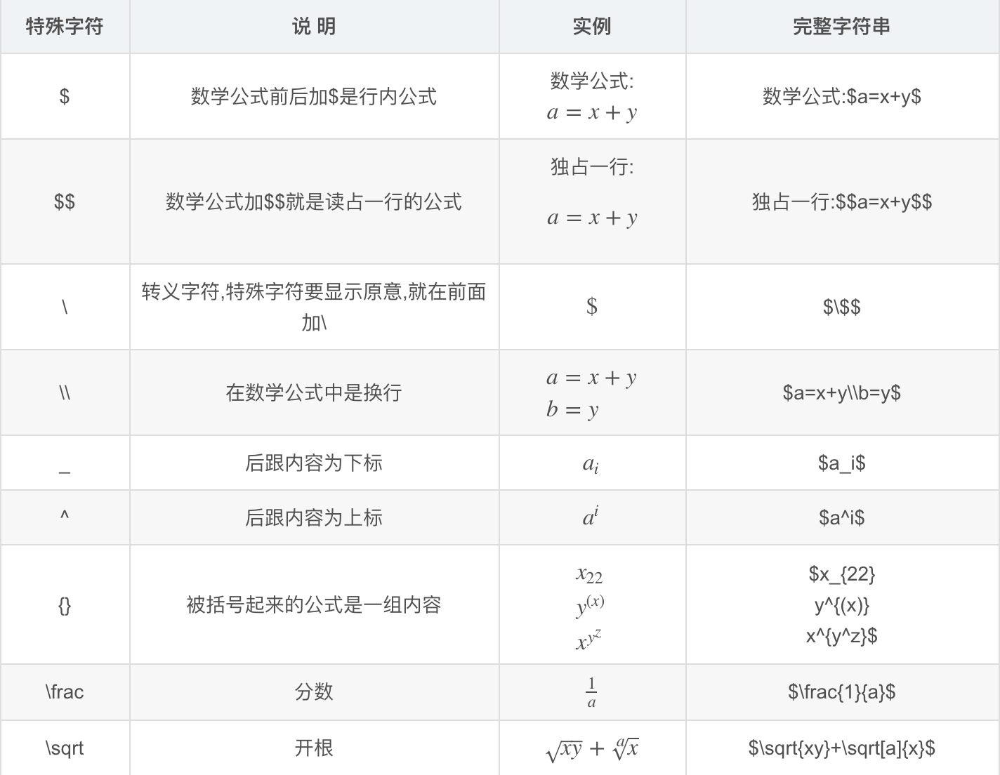
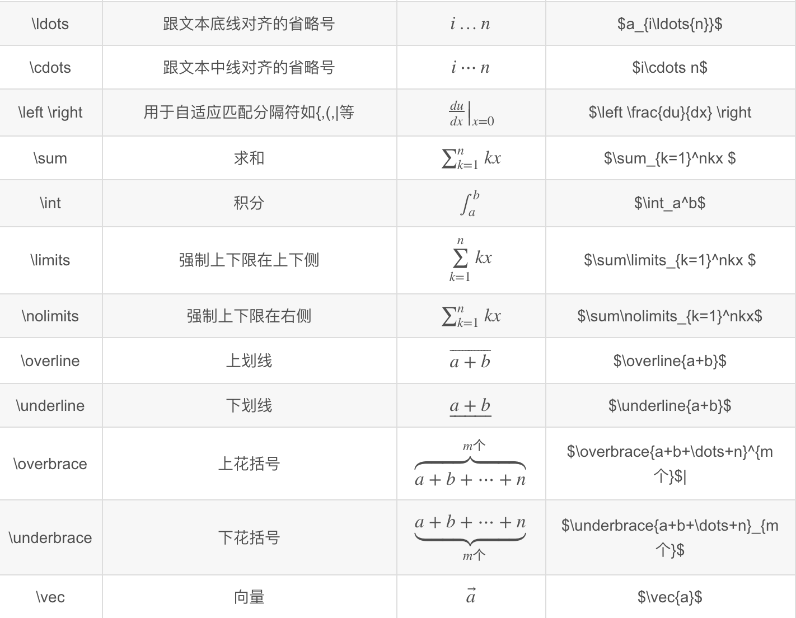

原文地址请参考 <http://www.markdown.cn/>

# 段落和换行
Markdown 段落**前后要有一个以上的空行**（某一行只包含空格和制表符，则该行也会被视为空行）  
Markdown换行 **按入两个以上的空格然后回车**。

# 区块引用
#### 普通区块引用
> This is a blockquote with two paragraphs. Lorem ipsum dolor sit amet,
consectetuer adipiscing elit. Aliquam hendrerit mi posuere lectus.
Vestibulum enim wisi, viverra nec, fringilla in, laoreet vitae, risus.
>
> Donec sit amet nisl. Aliquam semper ipsum sit amet velit. Suspendisse
id sem consectetuer libero luctus adipiscing.

####  嵌套区块引用
 This is the first level of quoting.
>
> > This is nested blockquote.
>
> Back to the first level.

列表
===

#### 无序列表 星号、加号或是减号作为列表标记
*   Red
*   Green
*   Blue

+   Red
+   Green
+   Blue

-   Red
-   Green
-   Blue

#### 有序列表
##### 使用数字接着一个英文句点
1.  Bird
2.  McHale
3.  Parish

*   A list item with a blockquote:

    > This is a blockquote.
    > inside a list item.
    
*   一列表项包含一个列表区块：

        <代码写在这>

# 代码区块
缩进 4 个空格或是 1 个制表符

    这是一个代码区块。

这个每行一阶的缩进（4 个空格或是 1 个制表符），都会被移除

    tell application "Foo"
        beep
    end tell
一个代码区块会一直持续到没有缩进的那一行（或是文件结尾）

在代码区块里面， & 、 < 和 > 会自动转成 HTML 实体，这样的方式让你非常容易使用 Markdown 插入范例用的 HTML 原始码，只需要复制贴上，再加上缩进就可以了，剩下的 Markdown 都会帮你处理，例如：

  &copy; 2004 Foo Corporation

# 分隔线
你可以在一行中用三个以上的星号、减号、底线来建立一个分隔线，行内不能有其他东西。你也可以在星号或是减号中间插入空格。下面每种写法都可以建立分隔线：

* * *

***

*****

- - -

---------------------------------------

# 强调
Markdown 使用星号（*）和底线（_）作为标记强调字词的符号，被 * 或 _ 包围的字词会被转成用 <em> 标签包围，用两个 * 或 _ 包起来的话，则会被转成 <strong>，例如：

*single asterisks*

_single underscores_

**double asterisks**

__double underscores__

# 代码
如果要标记一小段行内代码，你可以用反引号把它包起来（\`），例如：

Use the `printf()` function.

如果要在代码区段内插入反引号，你可以用多个反引号来开启和结束代码区段：

``There is a literal backtick (`) here.``

码区段的起始和结束端都可以放入一个空白，起始端后面一个，结束端前面一个，这样你就可以在区段的一开始就插入反引号：

A single backtick in a code span: `` ` ``

A backtick-delimited string in a code span: `` `foo` ``

在代码区段内，& 和方括号都会被自动地转成 HTML 实体，这使得插入 HTML 原始码变得很容易，Markdown 会把下面这段：

Please don't use any `<blink>` tags.

# 图片
### 行内式

详细叙述如下：
* 一个惊叹号 !
* 接着一个方括号，里面放上图片的替代文字
* 接着一个普通括号，里面放上图片的网址，最后还可以用引号包住并加上 选择性的 'title' 文字。

###  参考式

![Alt text][id]

[id]: url/to/image  "Optional title attribute"

Markdown 还没有办法指定图片的宽高，如果你需要的话，你可以使用普通的 \ 标签。
如

# 区段元素
### 链接
#### 行内式
方块括号后面紧接着圆括号并插入网址链接

[This link](http://example.net/) has no title attribute.

如果你是要链接到同样主机的资源，你可以使用相对路径：

See my [About](/about/) page for details.

#### 参考式
在链接文字的括号后面再接上另一个方括号，而在第二个方括号里面要填入用以辨识链接的标记

This is [an example][id] reference-style link.

也可以选择性地在两个方括号中间加上一个空格：

This is [an example] [id] reference-style link.
链接辨别标签可以有字母、数字、空白和标点符号，但是并不区分大小写，因此下面两个链接是一样的：

[link text][id]

[link text][ID]

接着，在文件的任意处，你可以把这个标记的链接内容定义出来：

[id]: http://www.baidu.com/  "Optional Title Here"

链接内容定义的形式为：
* 方括号（前面可以选择性地加上至多三个空格来缩进），里面输入链接文字
* 接着一个冒号
* 接着一个以上的空格或制表符
* 接着链接的网址
* 选择性地接着 title 内容，可以用双引号或是括弧包着
下面这三种链接的定义都是相同：

[foo]: http://example.com/  "Optional Title Here"
[foo]: http://example.com/  "Optional Title Here"
网址定义只有在产生链接的时候用到，并不会直接出现在文件之中。

隐式链接标记功能让你可以省略指定链接标记，这种情形下，链接标记会视为等同于链接文字，要用隐式链接标记只要在链接文字后面加上一个空的方括号，如果你要让 "Google" 链接到 google.com，你可以简化成：

[Google][]

然后定义链接内容：

[Google]: http://google.com/

# 反斜杠

Markdown 可以利用反斜杠来插入一些在语法中有其它意义的符号，例如：如果你想要用星号加在文字旁边的方式来做出强调效果（但不用 <em> 标签），你可以在星号的前面加上反斜杠：

\*literal asterisks\*

Markdown 支持以下这些符号前面加上反斜杠来帮助插入普通的符号：

\   反斜线
`   反引号
*   星号
_   底线
{}  花括号
[]  方括号
()  括弧
#   井字号
+   加号
-   减号
.   英文句点
!   惊叹号

# 自动链接

Markdown 支持以比较简短的自动链接形式来处理网址和电子邮件信箱，只要是用方括号包起来， Markdown 就会自动把它转成链接。一般网址的链接文字就和链接地址一样，例如：

<http://example.com/>

邮址的自动链接也很类似，只是 Markdown 会先做一个编码转换的过程，把文字字符转成 16 进位码的 HTML 实体，这样的格式可以糊弄一些不好的邮址收集机器人，例如：

<address@example.com>

# 表格

|左对齐标题|右对齐标题|居中对齐标题|
|:---|---:|:---:|
|张伟|28|男|
|黄珊珊|28|女|

# 数学公式

