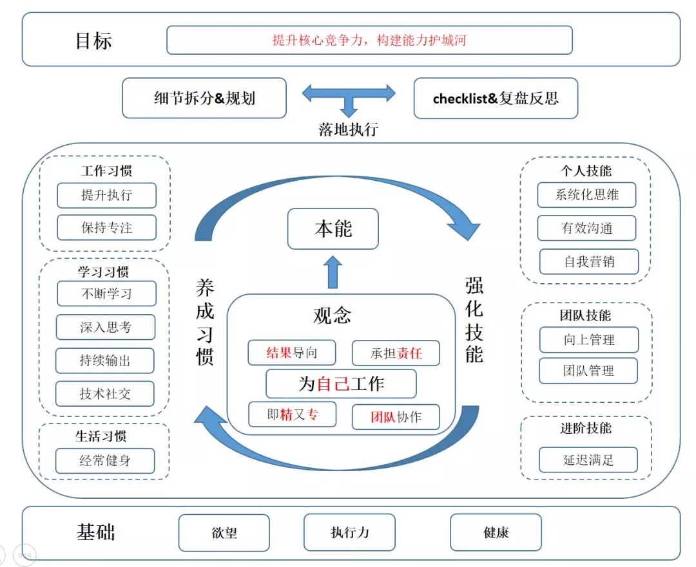
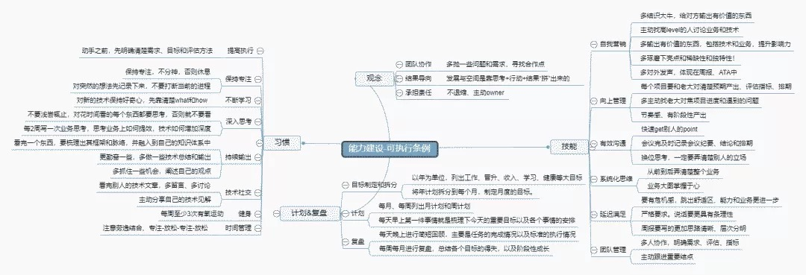
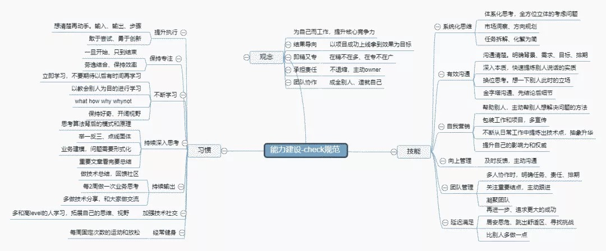

处于中心的是行为处事的准则，也就是正确的思想观念。其中最核心的观念就是要**把职业生涯当作自己的事业**，为自己而工作，把提升自身能力作为事业的目标。围绕着这一核心的还包括以结果导向、主动承担责任的观念和既精又专的技术、团队协作能力等。

事实上，这些道理大家都明白，但是为何事情还是做不好呢？最主要的原因是大部分人只是领略了道理的表层意思，而并没有将这些**道理融入到自己的潜意识**里面。在做决策时，也就不能够按照这些道理来处事。

因此，首先需要**树立正确的观念，并能够将其转化为潜意识，作为本能的一部分**。在行动的时候，通过潜意识来指导为人处事的行为准则，就可以保证做正确的事，并且正确的做事。为了能够达到这个效果，需要合理的习惯和技能来保证。习惯和技能相辅相成，影响着平时的一言一行，通过规范言行来帮助将这些观念深入本能。

而为了保证上述的方案能够落地执行，需要执行详细的规划并反复实践，并通过复盘等手段总结得失，查缺补漏。

大厦需要有坚实的基础，否则只是能空中楼阁。渴望成功的欲望、优秀的执行力和健康的身体便是这一切的基础。

##1. 能力模型分解和培养

1. **为自己工作** 首先，工作不是为老板工作，而是为自己工作。工作是属于公司的，而职业生涯却是属于你自己的。当把这件事情想明白的时候，你的职业发展将会焕发新的青春。在这个过程中，学习如何像企业一样思考，如何提升自己的技能，让公司持续地购买你的服务。

2. **结果导向** 公司付钱的目的是要带来价值，你提供的服务最终要能产出结果。公司里面功劳大于苦劳，结果大于过程。正所谓是为过程喝彩为结果付酬。

3. **承担责任** 责任与重要性呈正比。当你的责任越大，承担的事情越多，公司对你的依赖也就越重，也更能够让你脱颖而出，得到更好的资源和机会。所以，需要主动的承担更多的责任，不要退缩，敢于顶上去。而且勇于承担责任，做出引人注目的成绩，成为问题的解决者，并不断更新自己，也更容易获得晋升。

4. **即专又精** 要揽瓷器活，得有金刚钻。做事情做深入专一，这样提供的服务才能够足够的优秀，才值得别人pay for money。切忌什么都会，但什么又不懂。

5. **团队协作** 要相信团队的能量是无穷的，创建一个好的环境，合理的激励措施，好的成长路线。每个人都能激发并释放自己的能量，让优秀的人脱颖而出。

## 2. 养成良好习惯，提升执行效率

在习惯这方面，大概可以分为3部分：

（1）第一部分是**工作习惯**，包括提升执行、保持专注。目标就是提升生产力。在这块无论是方法论还是工具系统都有很多的资料，在这里不再累述。

（2）第二部分是**学习习惯**，包括不断学习、深入思考、持续输出、技术社交。开篇就提到了，码农的技术演变速度很快，所以在这个行业不断学习。学习的重要性大家都知道，而且对于学习的方法大家都各有一套，毕竟都是一路考过来的。但在繁忙的工作中以及飞速发展的技术中，**应该学什么以及怎么学**还是非常值得研究的。关于学习的这四个习惯是相辅相成的。首先得先有**持续学习的主动性**，并且不能浮于表面，需要深入本质，思考背后的模式和原理，并举一反三，融会贯通。持续输出是保证深入思考的重要措施，也能够积累自己的技术体系。最后，搞技术不能闭门造车，技术这玩意也需要**社交**，得接受吸收码神们的指导。关于学习有两个关键点：

- 第一点是**学习方式**。我们要谨记的是， 教会他人永远是最高效的学习方式！这个正是费曼学习法的精髓所在。
- 第二点是**持续思考**。现在层出不穷的技术，如果只学技术本身，是永远慢人一步的。而如果深入思考技术背后的原理，则很容易融会贯通。<u>一旦了解得比别人深，就容易看到问题本质，产生信心，激发乐趣</u>。这时候你的解决方案就比别人漂亮，逐渐建立起了影响力，成为了“专家”。因此公司里的疑难杂症会主动找上门来。你就比别人得到了更多的解决问题的机会，从而更快地提升能力。一旦进入良性循环，你的进步就比别人快，但付出的却不一定比别人多。这时候你已经走上了捷径。

（3）第三部分是生活习惯，包括经常健身等。

## 3. 强化技能，提升生产效率

能力建设也是一个体系，共分为3个层面：

（1）**个人能力**：包括系统化思维全面分析问题，拆解问题，逐步分解和执行，并能够有效沟通协调上下游资源把事情做成，拿到结果。事情做完了，需要包装，进行自我营销。

（2）**团队技能**：当个人的贡献有了，负责的范围越来越多，承担的责任越来越大，这个时候得向上管理，<u>和老板把事情讲清楚，获得老板在资源和人力的上的支持</u>。当队伍壮大了，就需要做出应有的贡献，所以团队管理、提升组织效能就变得重要了。

（3）**进阶技能**：做完这些后，就会感觉小有成就，马上就踏入人生巅峰了。但这个时候需要停止当前成功的喜悦，延迟满足，对自己提出更高的要求，来获得更大的成功。提到延迟满足，大家首先想到的可能是著名的“棉花糖”实验。但是这里所说的延迟满足，指的是延迟个人在成功上的满足感，不要止步于当前的成功，多给自己加一些挑战。比如这个项目已经拿到了+5%，那还能不能再提升到+8%，或者解决方案能不能更优美一些，约束能不能少一些。这样不断给自己拔高目标，就能让自己获得更大的成功。

## 4. 落地执行，保证方案完美执行

好的方案需要有完善的机制来保证其落地执行。在具体执行的时候，需要：

- 首先，对培养的习惯和完善的技能拆分下来，并制定可行的条例。比如下方的图：

- 然后，制定 check 规范并定期复盘和总结，查缺补漏，看自己是否达到预期的目标。

下面就是典型的 check 规范，对每个都有具体可落地可执行的标准和准则，在做总结的时候，逐条进行检查，看自己有没有做到。

## 5. 大厦之基 —— 欲望+执行力+健康

完成上面的方法，需要3个根基：成功的欲望、高效的执行、健康的身体。

- 欲望是人类进步的阶梯，在做事情之前，需要渴望成功，才可能成功。佛系的人，随遇而安，得过且过，也是比较难取得超乎常人的成绩的。
- 高效的执行力保证想法能够被很好的实现，只说不做，做的不够好，做的不够高效，一样都不能够完美的得到结果。
- 身体就是所有的一切，所以，程序员们，为了自己，为了公司，为了国家都应该运动起来。

# **总结**

不要随心所欲地生活，也不要随遇而安地行走在职业生涯的漫漫长路上。没有明确的方向，你走的每一步都是徒劳的。对工程师来说，没有以不变应万变的方法，唯一不变的就是改变，树立长远的目标，持之以恒，踏实前行，方能达到最终的目标。