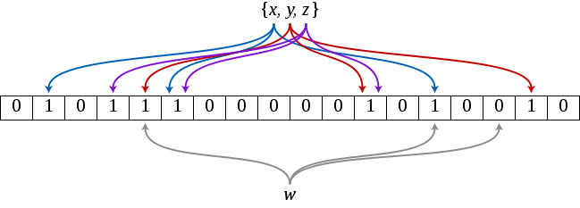
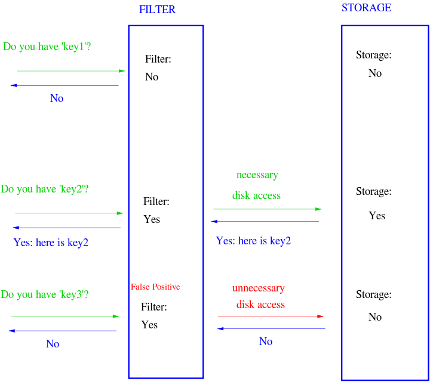
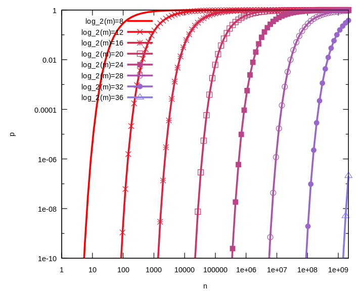

# 简介
https://en.wikipedia.org/wiki/Bloom_filter
https://blog.csdn.net/hguisu/article/details/7866173/

A Bloom filter is a space-efficient(效率) probabilistic(概率) data structure(空间效率很高的随机数据结构), that is used to test whether an element is a member of a set. False positive matches are possible, but false negatives are not – in other words, a query returns either "possibly(可能) in set" or "definitely not(绝对不是) in set". Elements can be added to the set, but not removed (though this can be addressed with a "counting" filter); the more elements that are added to the set, the larger the probability of false positives(误报,错误结果).

Bloom proposed(提出) the technique for applications where the amount of source data would require an impractically(不实用) large amount of memory if "conventional" error-free hashing techniques were applied. He gave the example of a hyphenation algorithm for a dictionary of 500,000 words, out of which(其中) 90% follow simple hyphenation rules, but the remaining 10% require expensive disk accesses to retrieve specific hyphenation patterns. With sufficient(充足的) core memory, an error-free(无错) hash could be used to eliminate(消除) all unnecessary disk accesses; on the other hand, with limited core memory, Bloom's technique uses a smaller hash area but still eliminates most unnecessary accesses. For example, a hash area only 15% of the size needed by an ideal error-free hash(理想的无错哈希) still eliminates 85% of the disk accesses.

More generally, fewer than 10 bits per element are required for a 1% false positive probability, independent of the size or number of elements in the set.

Bloom Filter（BF）是一种空间效率很高的随机数据结构，它利用位数组很简洁地表示一个集合，并能判断一个元素是否属于这个集合。它是一个判断元素是否存在集合的快速的概率算法。Bloom Filter有可能会出现错误判断，但不会漏掉判断。也就是Bloom Filter判断元素不再集合，那肯定不在。如果判断元素存在集合中，有一定的概率判断错误。因此，Bloom Filter不适合那些“零错误”的应用场合。而在能容忍低错误率的应用场合下，Bloom Filter比其他常见的算法（如hash，折半查找）极大节省了空间。
它的优点是空间效率和查询时间都远远超过一般的算法，缺点是有一定的误识别率和删除困难。

# Algorithm description

An empty Bloom filter is a bit array(位数组) of m bits, all set to 0. There must also be k different hash functions defined, each of which maps or hashes some set element to one of the m array positions, generating a uniform random distribution. Typically, k is a constant, much smaller than m, which is proportional to the number of elements to be added; the precise choice of k and the constant of proportionality of m are determined by the intended false positive rate of the filter.

To add an element, feed it to each of the k hash functions to get k array positions. Set the bits at all these positions to 1.

To query for an element (test whether it is in the set), feed it to each of the k hash functions to get k array positions. If any of the bits at these positions is 0, the element is definitely not in the set – if it were, then all the bits would have been set to 1 when it was inserted. If all are 1, then either the element is in the set, or the bits have by chance been set to 1 during the insertion of other elements, resulting in a false positive. In a simple Bloom filter, there is no way to distinguish between the two cases, but more advanced techniques can address this problem.

The requirement of designing k different independent hash functions can be prohibitive for large k. For a good hash function with a wide output, there should be little if any correlation between different bit-fields of such a hash, so this type of hash can be used to generate multiple "different" hash functions by slicing its output into multiple bit fields. Alternatively, one can pass k different initial values (such as 0, 1, ..., k − 1) to a hash function that takes an initial value; or add (or append) these values to the key. For larger m and/or k, independence among the hash functions can be relaxed with negligible increase in false positive rate.[3] (Specifically, Dillinger & Manolios (2004b) show the effectiveness of deriving the k indices using enhanced double hashing or triple hashing, variants of double hashing that are effectively simple random number generators seeded with the two or three hash values.)

Removing an element from this simple Bloom filter is impossible because false negatives are not permitted. An element maps to k bits, and although setting any one of those k bits to zero suffices to remove the element, it also results in removing any other elements that happen to map onto that bit. Since there is no way of determining whether any other elements have been added that affect the bits for an element to be removed, clearing any of the bits would introduce the possibility for false negatives.

One-time removal of an element from a Bloom filter can be simulated by having a second Bloom filter that contains items that have been removed. However, false positives in the second filter become false negatives in the composite filter, which may be undesirable. In this approach re-adding a previously removed item is not possible, as one would have to remove it from the "removed" filter.

It is often the case that all the keys are available but are expensive to enumerate (for example, requiring many disk reads). When the false positive rate gets too high, the filter can be regenerated; this should be a relatively rare event.

An example of a Bloom filter, representing the set {x, y, z}. The colored arrows show the positions in the bit array that each set element is mapped to. The element w is not in the set {x, y, z}, because it hashes to one bit-array position containing 0. For this figure, m = 18 and k = 3.

# Space and time advantages
While risking false positives, Bloom filters have a strong space advantage over other data structures for representing sets, such as self-balancing binary search trees, tries, hash tables, or simple arrays or linked lists of the entries. Most of these require storing at least the data items themselves, which can require anywhere from a small number of bits, for small integers, to an arbitrary number of bits, such as for strings (tries are an exception, since they can share storage between elements with equal prefixes). However, Bloom filters do not store the data items at all, and a separate solution must be provided for the actual storage. Linked structures incur an additional linear space overhead for pointers. A Bloom filter with 1% error and an optimal value of k, in contrast, requires only about 9.6 bits per element, regardless of the size of the elements. This advantage comes partly from its compactness, inherited from arrays, and partly from its probabilistic nature. The 1% false-positive rate can be reduced by a factor of ten by adding only about 4.8 bits per element.

However, if the number of potential values is small and many of them can be in the set, the Bloom filter is easily surpassed by the deterministic bit array, which requires only one bit for each potential element. Note also that hash tables gain a space and time advantage if they begin ignoring collisions and store only whether each bucket contains an entry; in this case, they have effectively become Bloom filters with k = 1.[4]

Bloom filters also have the unusual property that the time needed either to add items or to check whether an item is in the set is a fixed constant, O(k), completely independent of the number of items already in the set. No other constant-space set data structure has this property, but the average access time of sparse hash tables can make them faster in practice than some Bloom filters. In a hardware implementation, however, the Bloom filter shines because its k lookups are independent and can be parallelized.

To understand its space efficiency, it is instructive to compare the general Bloom filter with its special case when k = 1. If k = 1, then in order to keep the false positive rate sufficiently low, a small fraction of bits should be set, which means the array must be very large and contain long runs of zeros. The information content of the array relative to its size is low. The generalized Bloom filter (k greater than 1) allows many more bits to be set while still maintaining a low false positive rate; if the parameters (k and m) are chosen well, about half of the bits will be set,[5] and these will be apparently random, minimizing redundancy and maximizing information content.

Bloom filter used to speed up answers in a key-value storage system. Values are stored on a disk which has slow access times. Bloom filter decisions are much faster. However some unnecessary disk accesses are made when the filter reports a positive (in order to weed out the false positives). Overall answer speed is better with the Bloom filter than without the Bloom filter. Use of a Bloom filter for this purpose, however, does increase memory usage.

# Probability of false positives

值	含义
m	位数组长度
k	Hash Function 个数
f	false positives 比率
n	加入其中的 key 的数量

Assume that a hash function selects each array position with equal probability. If m is the number of bits in the array, the probability that a certain bit is not set to 1 by a certain hash function during the insertion of an element is

If k is the number of hash functions, the probability that the bit is not set to 1 by any of the hash functions is

If we have inserted n elements, the probability that a certain bit is still 0 is

the probability that it is 1 is therefore

Now test membership of an element that is not in the set. Each of the k array positions computed by the hash functions is 1 with a probability as above. The probability of all of them being 1, which would cause the algorithm to erroneously claim that the element is in the set, is often given as

# Optimal number of hash functions
The number of hash functions, k, must be a positive integer. Putting this constraint aside, for a given m and n, the value of k that minimizes the false positive probability is
