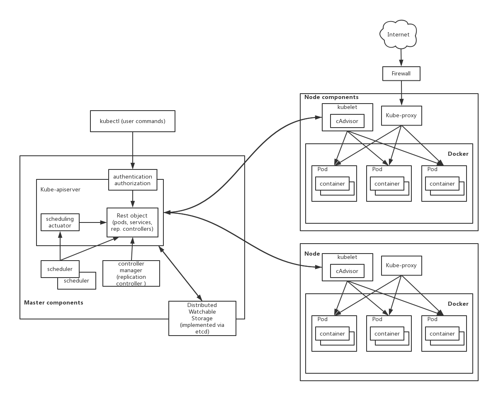

# 主题
* fs -> unionFs -> docker:Image & Container本质
* 为什么要容器化 & 容器化之后的开发注意点
* Docker虚拟化网络
* kubernetes简介 & kubernetes主流网络解决方案
* 应用发布的六种策略 & 公司未来的发布模式
* legends 针对未来发布的一些改造

# FS -> Union mount -> UnionFS
## Union mount 
联合挂载是指把多个不同的目录(directory)，合并成一个。

文件系统A  

文件系统B  

A && B  

Union mount 是接口层，定义了 Union mount 需要实现的功能，具体的实现比如 linux 早期的 union mount，plan9 等。

## UnionFS (Union File System)

Linux： Inheriting File System  -> UnionFS  
允许多个单独的文件系统的目录，透明的**覆盖**在一起，形成一个联合的文件系统。在合并之后的目录之中，能够看到所有子文件系统的内容。

wikipedia : <https://en.wikipedia.org/wiki/UnionFS>

### UnionFS的一些问题
* 同名文件  
    
    在合并子文件系统的时候，多个文件系统之间，存在**优先级**，所以，如果多个文件系统在同一个目录下，存在一个相同的文件名，则在合并之后的文件系统里面，看到的是，优先级高的那个文件系统的文件。 
    
* 如何创建/删除文件  

    由于合并的子文件系统，可能是Read-Only / Read-Write 的文件系统，所以为了对虚拟合并副本的写入，会将这一类操作定向到一个**新的可写文件系统**。对这个可写文件系统的操作，不会去修改底层的子文件系统，这里一般采用 Copy-on-Write 技术（只有真正发生写操作的时候，才会去创建这一可写层）。

# Docker

## Docker Image
DockerImage 是基于 UnionFS 技术整合的多层文件系统（镜像分层技术）  
**aufs** (_Advanced multi-layered unification filesystem_)   
**overlay2**

    FROM centos:latest
    
    ENV JAVA_HOME=/usr/local/jdk1.8.0_201
    ENV TOMCAT_HOME=/home/tomcat/apache-tomcat-8.5.32
    ENV PATH=$JAVA_HOME/bin:$TOMCAT_HOME/bin:$PATH
    
    RUN useradd -d /home/tomcat -s /usr/sbin/nologin tomcat \
        && gpasswd -a tomcat tomcat \
        && chown -R tomcat:tomcat /home/tomcat
    
    ADD jdk-8u201-linux-x64.tar.gz /usr/local
    ADD apache-tomcat-8.5.32.tar.gz /home/tomcat
    
    ENTRYPOINT ["catalina.sh","run"]
    
    
#### 理解 Docker 镜像分层技术的案例：根据已有的 jdk 安装包，在 DockerImage 中安装 jdk
方式一

    ADD jdk-8u201-linux-x64.tar.gz /usr/local

方式二

    COPY jdk-8u201-linux-x64.tar.gz /usr/local
    RUN cd /usr/local \
        && tar -xvf jdk-8u201-linux-x64.tar.gz \
        && rm jdk-8u201-linux-x64.tar.gz

## Docker Container
#### 命名空间隔离
1. mnt  

将一个进程放到一个特定的目录执行。mnt namespace 允许不同 namespace 的进程看到的文件结构不同，这样每个 namespace 中的进程多看到的文件目录就被隔离开了。

2. net  

实现网络隔离，每个 net namespace 有独立的 network devices，IP addresses，IP routing tables，/proc/net 目录。这样每个 container 的网络就能隔离开。

3. pid  

不同用户的进程就是通过 pid namespace 隔离开的，且不同的 namespace 中可以有相同的 pid。
因为 namespace 允许嵌套，父 namespace 可以影响子 namespace 的进程，所以子 namespace 的进程可以在父 namespace 中看到，但是具有不同的 pid。

#### 本质
宿主机上的 一个命名空间隔离的 进程

# 容器化
## KVM技术在发布时有哪些问题
* 测试环境跟生产环境不一致带来的问题
* 机器资源利用率低
    
        KVM 1:10
        KVM本身的资源消耗
* 预发环境的资源浪费        
* 发布流程复杂

## 容器化解决了哪些问题
* 一份镜像随处发布
* 更高的机器利用率，节约成本 
    CPU 资源的利用率提升
* 更便捷智能发布方式
* ReplicationController (RC RS)
* HPA(Horizontal Pod Autoscaler)
    CPUUtilizationPercentage  
    自定义指标 QPS TPS  
* ......

# 系统开发需要注意哪些问题?
* 有状态的应用
* IP分配策略
* 是否需要暴露接口给外部使用

## 容器网络
### Docker 的网络实现
##### Network Namespace (网络命名空间)
Linux 引入网络命名空间，不同命名空间的网络栈是完全隔离的，彼此之间无法通信
Docker也正是利用了网络的命名空间特性，实现了不同容器之间网络的隔离

##### Veth Peer
Veth设备对是为了在不同的网络命名空间之间进行通信，利用它可以直接将两个网络命名空间连接起来

##### bridge (虚拟网桥)
多网卡之间数据交换的二层设备（数据链路层）

##### 如何打通宿主机与容器之间的网络
 在bridge模式下，Docker Daemon第1次启动时会创建一个虚拟的网桥，默认的名字是docker0，并在私有网络命名空间中给这个网桥分配一个子网。针对由Docker创建出来的每一个容器，都会创建一个虚拟的以太网设备（**Veth Peer**），其中一端关联到网桥上，另一端使用Linux的网络命名空间技术，映射到容器内的eth0设备，然后从网桥的地址段内给eth0接口分配一个IP地址。

##### 宿主机eth0网卡与docker0网桥? 
iptables/Netfilter  
Linux提供了一套机制来为用户实现自定义的数据包处理过程。

在Linux网络协议栈中有一组回调函数挂接点，通过这些挂接点挂接的钩子函数可以在Linux网络栈处理数据包的过程中对数据包进行一些操作，例如过滤、修改、丢弃等。整个挂接点技术叫作Netfilter和Iptables。

Netfilter负责在内核中执行各种挂接的规则，运行在内核模式中；而Iptables是在用户模式下运行的进程，负责协助维护内核中Netfilter的各种规则表。通过二者的配合来实现整个Linux网络协议栈中灵活的数据包处理机制。

### Docker 网络的局限性
Docker没有考虑到多主机互联的网络解决方案   

# 容器编排
## kubernetes(k8s)

## pod

#### pod 的本质
共享 net namespace / volume 映射
container 私有 mnt namespace
的一组进程

#### pod 网络模型
#### pause 容器的作用
当用户在Kubernetes的Master那边创建了一个Pod后，Kubelet观察到新Pod的创建，于是首先调用CRI（后面的Runtime实现，比如：dockershim，containerd等）创建Pod内的若干个容器。在这些容器里面，第一个被创建的Pause容器是比较特殊的，这是Kubernetes系统“赠送”的容器，里面跑着一个功能十分简单的Go语言程序，具体逻辑是一启动就去select一个空的Go语言channel，自然就永远阻塞在那里了。一个永远阻塞而且没有实际业务逻辑的pause容器到底有什么用呢？用处大了。我们知道容器的隔离功能利用的是Linux内核的namespace机制，而只要是一个进程，不管这个进程是否处于运行状态（挂起亦可），它都能“占”着一个namespace。因此，每个Pod内的第一个系统容器Pause的作用就是为占用一个Linux的network namespace，而Pod内其他用户容器通过加入到这个network namespace的方式来共享同一个network namespace。用户容器和Pause容器之间的关系有点类似于寄居蟹和海螺的关系。

#### minikube
[mac 本地 minikube 环境](https://www.cnblogs.com/cocowool/p/minikube_setup_and_first_sample.html)
 
# ipam(ip address manager) 容器IP如何分配？
* Container  
[host-local](https://github.com/containernetworking/plugins/tree/master/plugins/ipam/host-local)  
[Dynamic Host Configuration Protocol，DHCP](https://github.com/containernetworking/plugins/tree/master/plugins/ipam/dhcp)

* KVM  
分配的IP直接写死在虚拟机的配置文件里面

其他参考文档：  
[Some standard networking plugins, maintained by the CNI team](https://github.com/containernetworking/plugins)

# kubernetes网络解决方案（集群内部）
## 直接路由方案
路由表

## flannel 网络叠加

# kubernetes网络解决方案（集群外部）
#### http 接口
目前

未来

参考文档：<https://juejin.im/entry/5bdd20a3e51d45053c74a8f5>

# 应用发布的六种策略
原文参考: [Six Strategies for Application Deployment](https://thenewstack.io/deployment-strategies)

## Ramped 灰度发布(也叫滚动升级 or 增量发布)
对集群中的多台机器，分批发布，直到所有机器容器全部完成升级  

#### 优点
* 操作简单 (容器化之后操作简单)
* 对于有状态的应用，能够友好的保持应用状态。

#### 缺点
* 发布与回滚的时间较长
* 对于请求流量不可控
* 对于一些 http 接口，很难做到向下版本兼容

## Blue/Green 蓝绿发布
操作步骤：
1. 同时部署两个完全相互隔离的集群A，集群B，
2. 集群B从对外流量中剥离之后，升级到新版本
3. 测试无误之后，将请求流量切换到集群B
4. 升级集群A
5. A升级完之后，在平均分配流量到AB集群  

#### 优点
* 瞬间升级/瞬间回滚（对于请求来说）
* 避免版本升级时的兼容性问题，相互依赖问题等
#### 缺点
* 需要双份的机器资源
* 需要在投入生产之前，对整个平台进行适当的测试
* 很难处理一些有状态的服务（Stateful application）

## 其他发布模式 
* Recreate      停机发布
* Canary        金丝雀 一开始B承担少量的流量，验证之后，再扩大到全量用户
* A/B Testing   根据特定的字段走不同的版本集群
* Shadow        新集群只接受流量，不返回请求

## 不同部署模式的对比

#### 下一版发布模式（也可能是其他方案，还没有确定）
#### Legends针对未来发布模式的一些定制化改造