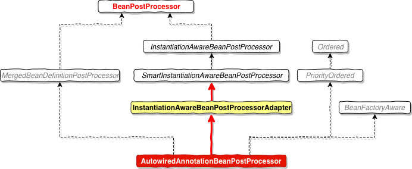

# JavaDoc

`BeanPostProcessor` implementation that **autowires annotated fields**, `setter` methods and arbitrary config methods. Such members to be injected are detected through a Java 5 annotation: by default, Spring's `@Autowired` and `@Value` annotations.

Also supports JSR-330's `@Inject` annotation, if available, as a direct alternative to Spring's own `@Autowired`.

Only one constructor (at max) of any given bean class may declare this annotation with the '**required**' parameter set to **true**, indicating the constructor to autowire when used as a Spring bean. If multiple **non-required** constructors declare the annotation, they will be considered as candidates for autowiring. **The constructor with the greatest number of dependencies that can be satisfied by matching beans in the Spring container will be chosen. If none of the candidates can be satisfied, then a primary/default constructor (if present) will be used. If a class only declares a single constructor to begin with, it will always be used, even if not annotated. An annotated constructor does not have to be public.**
**Fields are injected right after construction of a bean, before any config methods are invoked. Such a config field does not have to be public.**
**Config methods may have an arbitrary name and any number of arguments; each of those arguments will be autowired with a matching bean in the Spring container. Bean property `setter` methods are effectively just a special case of such a general config method. Config methods do not have to be public.**

**Note: A default `AutowiredAnnotationBeanPostProcessor` will be registered by the `context:annotation-config` and `context:component-scan` XML tags. Remove or turn off the default annotation configuration there if you intend to specify a custom `AutowiredAnnotationBeanPostProcessor` bean definition.**
**NOTE: Annotation injection will be performed before XML injection; thus the latter configuration will override the former for properties wired through both approaches.**

In addition to regular injection points as discussed above, this post-processor also handles Spring's `@Lookup` annotation which identifies lookup methods to be replaced by the container at runtime. This is essentially a type-safe version of `getBean(Class, args)` and `getBean(String, args)`, See @Lookup's javadoc for details


##  类结构图



# sourcecode

```java
/**
 * Create a new AutowiredAnnotationBeanPostProcessor
 * for Spring's standard {@link Autowired} annotation.
 * <p>Also supports JSR-330's {@link javax.inject.Inject} annotation, if available.
 */
@SuppressWarnings("unchecked")
public AutowiredAnnotationBeanPostProcessor() {
   this.autowiredAnnotationTypes.add(Autowired.class);	// 处理 Spring 自动注入
   this.autowiredAnnotationTypes.add(Value.class);			// 处理 Value  自动注入
   try {
      this.autowiredAnnotationTypes.add((Class<? extends Annotation>)  	// 兼容 javax.inject.Inject 注入配置
            ClassUtils.forName("javax.inject.Inject", AutowiredAnnotationBeanPostProcessor.class.getClassLoader()));
      logger.trace("JSR-330 'javax.inject.Inject' annotation found and supported for autowiring");
   }
   catch (ClassNotFoundException ex) {
      // JSR-330 API not available - simply skip.
   }
}
```


在Spring BeanFactory创建 bean  实例对象之后，会调用  populateBean 来进行一些属性注入，具体如下

```java
/**
 * Populate the bean instance in the given BeanWrapper with the property values
 * from the bean definition.
 * @param beanName the name of the bean
 * @param mbd the bean definition for the bean
 * @param bw the BeanWrapper with bean instance
 */
@SuppressWarnings("deprecation")  // for postProcessPropertyValues
protected void populateBean(String beanName, RootBeanDefinition mbd, @Nullable BeanWrapper bw) {
   if (bw == null) {
      if (mbd.hasPropertyValues()) {
         throw new BeanCreationException(
               mbd.getResourceDescription(), beanName, "Cannot apply property values to null instance");
      }
      else {
         // Skip property population phase for null instance.
         return;
      }
   }

   // Give any InstantiationAwareBeanPostProcessors the opportunity机会 to modify the
   // state of the bean before properties are set. This can be used, for example,
   // to support styles of field injection.
   boolean continueWithPropertyPopulation = true;

   if (!mbd.isSynthetic() && hasInstantiationAwareBeanPostProcessors()) {
      for (BeanPostProcessor bp : getBeanPostProcessors()) {
         if (bp instanceof InstantiationAwareBeanPostProcessor) {
            InstantiationAwareBeanPostProcessor ibp = (InstantiationAwareBeanPostProcessor) bp;
            if (!ibp.postProcessAfterInstantiation(bw.getWrappedInstance(), beanName)) {
               continueWithPropertyPopulation = false;
               break;
            }
         }
      }
   }

   if (!continueWithPropertyPopulation) {
      return;
   }

   PropertyValues pvs = (mbd.hasPropertyValues() ? mbd.getPropertyValues() : null);

   if (mbd.getResolvedAutowireMode() == AUTOWIRE_BY_NAME || mbd.getResolvedAutowireMode() == AUTOWIRE_BY_TYPE) {
      MutablePropertyValues newPvs = new MutablePropertyValues(pvs);
      // Add property values based on autowire by name if applicable.
      if (mbd.getResolvedAutowireMode() == AUTOWIRE_BY_NAME) {
         autowireByName(beanName, mbd, bw, newPvs);
      }
      // Add property values based on autowire by type if applicable.
      if (mbd.getResolvedAutowireMode() == AUTOWIRE_BY_TYPE) {
         autowireByType(beanName, mbd, bw, newPvs);
      }
      pvs = newPvs;
   }

   boolean hasInstAwareBpps = hasInstantiationAwareBeanPostProcessors();
   boolean needsDepCheck = (mbd.getDependencyCheck() != AbstractBeanDefinition.DEPENDENCY_CHECK_NONE);

   PropertyDescriptor[] filteredPds = null;
   if (hasInstAwareBpps) {// 这里为 true
      if (pvs == null) {
         pvs = mbd.getPropertyValues();
      }
      for (BeanPostProcessor bp : getBeanPostProcessors()) {
         if (bp instanceof InstantiationAwareBeanPostProcessor) {
            InstantiationAwareBeanPostProcessor ibp = (InstantiationAwareBeanPostProcessor) bp;
            // 处理 @Value 配置文件注入 核心方法，进入
            PropertyValues pvsToUse = ibp.postProcessProperties(pvs, bw.getWrappedInstance(), beanName);
            if (pvsToUse == null) {
               if (filteredPds == null) {
                  filteredPds = filterPropertyDescriptorsForDependencyCheck(bw, mbd.allowCaching);
               }
               // 处理@Autowire 属性注入
               pvsToUse = ibp.postProcessPropertyValues(pvs, filteredPds, bw.getWrappedInstance(), beanName);
               if (pvsToUse == null) {
                  return;
               }
            }
            pvs = pvsToUse;
         }
      }
   }
   if (needsDepCheck) {
      if (filteredPds == null) {
         filteredPds = filterPropertyDescriptorsForDependencyCheck(bw, mbd.allowCaching);
      }
      checkDependencies(beanName, mbd, filteredPds, pvs);
   }

   if (pvs != null) {
      applyPropertyValues(beanName, mbd, bw, pvs);
   }
}
```

**AutowiredAnnotationBeanPostProcessor**

```java
@Override
public PropertyValues postProcessProperties(PropertyValues pvs, Object bean, String beanName) {
   InjectionMetadata metadata = findAutowiringMetadata(beanName, bean.getClass(), pvs);
   try {
      metadata.inject(bean, beanName, pvs);
   }
   catch (BeanCreationException ex) {
      throw ex;
   }
   catch (Throwable ex) {
      throw new BeanCreationException(beanName, "Injection of autowired dependencies failed", ex);
   }
   return pvs;
}
```

**InjectionMetadata**

```java
public void inject(Object target, @Nullable String beanName, @Nullable PropertyValues pvs) throws Throwable {
   Collection<InjectedElement> checkedElements = this.checkedElements;
   Collection<InjectedElement> elementsToIterate =
         (checkedElements != null ? checkedElements : this.injectedElements);
   if (!elementsToIterate.isEmpty()) {
      for (InjectedElement element : elementsToIterate) { // 添加了 @Value or @Autowire注解的属性
         if (logger.isTraceEnabled()) {
            logger.trace("Processing injected element of bean '" + beanName + "': " + element);
         }
         element.inject(target, beanName, pvs);
      }
   }
}
```

**AutowiredAnnotationBeanPostProcessor**

```java
/**
 * Class representing injection information about an annotated field.
 */
private class AutowiredFieldElement extends InjectionMetadata.InjectedElement {

   private final boolean required;

   private volatile boolean cached = false;

   @Nullable
   private volatile Object cachedFieldValue;

   public AutowiredFieldElement(Field field, boolean required) {
      super(field, null);
      this.required = required;
   }

   @Override
   protected void inject(Object bean, @Nullable String beanName, @Nullable PropertyValues pvs) throws Throwable {
      Field field = (Field) this.member;
      Object value;
      if (this.cached) {
         value = resolvedCachedArgument(beanName, this.cachedFieldValue);
      }
      else {
         DependencyDescriptor desc = new DependencyDescriptor(field, this.required);
         desc.setContainingClass(bean.getClass());
         Set<String> autowiredBeanNames = new LinkedHashSet<>(1);
         Assert.state(beanFactory != null, "No BeanFactory available");
         TypeConverter typeConverter = beanFactory.getTypeConverter();
         try {
            // 从 beanFactory 中解析并获取对应的 value 值
            value = beanFactory.resolveDependency(desc, beanName, autowiredBeanNames, typeConverter);
         }
         catch (BeansException ex) {
            throw new UnsatisfiedDependencyException(null, beanName, new InjectionPoint(field), ex);
         }
         synchronized (this) {
            if (!this.cached) {
               if (value != null || this.required) {
                  this.cachedFieldValue = desc;
                  registerDependentBeans(beanName, autowiredBeanNames);
                  if (autowiredBeanNames.size() == 1) {
                     String autowiredBeanName = autowiredBeanNames.iterator().next();
                     if (beanFactory.containsBean(autowiredBeanName) &&
                           beanFactory.isTypeMatch(autowiredBeanName, field.getType())) {
                        this.cachedFieldValue = new ShortcutDependencyDescriptor(
                              desc, autowiredBeanName, field.getType());
                     }
                  }
               }
               else {
                  this.cachedFieldValue = null;
               }
               this.cached = true;
            }
         }
      }
     
      // 通过反射，将匹配的属性注入到目标bean对象上
      if (value != null) {
         ReflectionUtils.makeAccessible(field);
         field.set(bean, value);
      }
   }
}
```

**DefaultListableBeanFactory**

```java
@Override
@Nullable
public Object resolveDependency(DependencyDescriptor descriptor, @Nullable String requestingBeanName,
      @Nullable Set<String> autowiredBeanNames, @Nullable TypeConverter typeConverter) throws BeansException {

   descriptor.initParameterNameDiscovery(getParameterNameDiscoverer());
   if (Optional.class == descriptor.getDependencyType()) {
      return createOptionalDependency(descriptor, requestingBeanName);
   }
   else if (ObjectFactory.class == descriptor.getDependencyType() ||
         ObjectProvider.class == descriptor.getDependencyType()) {
      return new DependencyObjectProvider(descriptor, requestingBeanName);
   }
   else if (javaxInjectProviderClass == descriptor.getDependencyType()) {
      return new Jsr330Factory().createDependencyProvider(descriptor, requestingBeanName);
   }
   else {
      Object result = getAutowireCandidateResolver().getLazyResolutionProxyIfNecessary(
            descriptor, requestingBeanName);
      if (result == null) {
         // 进入
         result = doResolveDependency(descriptor, requestingBeanName, autowiredBeanNames, typeConverter);
      }
      return result;
   }
}
```

```java
@Nullable
public Object doResolveDependency(DependencyDescriptor descriptor, @Nullable String beanName,
      @Nullable Set<String> autowiredBeanNames, @Nullable TypeConverter typeConverter) throws BeansException {

   InjectionPoint previousInjectionPoint = ConstructorResolver.setCurrentInjectionPoint(descriptor);
   try {
      Object shortcut = descriptor.resolveShortcut(this);
      if (shortcut != null) {
         return shortcut;
      }

      Class<?> type = descriptor.getDependencyType();
      Object value = getAutowireCandidateResolver().getSuggestedValue(descriptor);
      if (value != null) {
         if (value instanceof String) {
            // 解析属性值,将  ${key}  转换成配置文件中的key对应的value值 strVal
            String strVal = resolveEmbeddedValue((String) value);
            BeanDefinition bd = (beanName != null && containsBean(beanName) ?
                  getMergedBeanDefinition(beanName) : null);
            value = evaluateBeanDefinitionString(strVal, bd);
         }
         TypeConverter converter = (typeConverter != null ? typeConverter : getTypeConverter());
         try {
            return converter.convertIfNecessary(value, type, descriptor.getTypeDescriptor());
         }
         catch (UnsupportedOperationException ex) {
            // A custom TypeConverter which does not support TypeDescriptor resolution...
            return (descriptor.getField() != null ?
                  converter.convertIfNecessary(value, type, descriptor.getField()) :
                  converter.convertIfNecessary(value, type, descriptor.getMethodParameter()));
         }
      }

      Object multipleBeans = resolveMultipleBeans(descriptor, beanName, autowiredBeanNames, typeConverter);
      if (multipleBeans != null) {
         return multipleBeans;
      }

      Map<String, Object> matchingBeans = findAutowireCandidates(beanName, type, descriptor);
      if (matchingBeans.isEmpty()) {
         if (isRequired(descriptor)) {
            raiseNoMatchingBeanFound(type, descriptor.getResolvableType(), descriptor);
         }
         return null;
      }

      String autowiredBeanName;
      Object instanceCandidate;

      if (matchingBeans.size() > 1) {
         autowiredBeanName = determineAutowireCandidate(matchingBeans, descriptor);
         if (autowiredBeanName == null) {
            if (isRequired(descriptor) || !indicatesMultipleBeans(type)) {
               return descriptor.resolveNotUnique(descriptor.getResolvableType(), matchingBeans);
            }
            else {
               // In case of an optional Collection/Map, silently ignore a non-unique case:
               // possibly it was meant to be an empty collection of multiple regular beans
               // (before 4.3 in particular when we didn't even look for collection beans).
               return null;
            }
         }
         instanceCandidate = matchingBeans.get(autowiredBeanName);
      }
      else {
         // We have exactly one match.
         Map.Entry<String, Object> entry = matchingBeans.entrySet().iterator().next();
         autowiredBeanName = entry.getKey();
         instanceCandidate = entry.getValue();
      }

      if (autowiredBeanNames != null) {
         autowiredBeanNames.add(autowiredBeanName);
      }
      if (instanceCandidate instanceof Class) {
         instanceCandidate = descriptor.resolveCandidate(autowiredBeanName, type, this);
      }
      Object result = instanceCandidate;
      if (result instanceof NullBean) {
         if (isRequired(descriptor)) {
            raiseNoMatchingBeanFound(type, descriptor.getResolvableType(), descriptor);
         }
         result = null;
      }
      if (!ClassUtils.isAssignableValue(type, result)) {
         throw new BeanNotOfRequiredTypeException(autowiredBeanName, type, instanceCandidate.getClass());
      }
      return result;
   }
   finally {
      ConstructorResolver.setCurrentInjectionPoint(previousInjectionPoint);
   }
}
```

**AbstractBeanFactory**

```java
@Override
@Nullable
public String resolveEmbeddedValue(@Nullable String value) {
   if (value == null) {
      return null;
   }
   String result = value;
   for (StringValueResolver resolver : this.embeddedValueResolvers) { // 找到内置的 valueResolvers
      result = resolver.resolveStringValue(result);
      if (result == null) {
         return null;
      }
   }
   return result;
}
```

可以看到这里的 embeddedValueResolvers 就是在 [Spring_properties配置文件加载](./02_01_Spring_properties配置文件加载.md)里面注入的属性