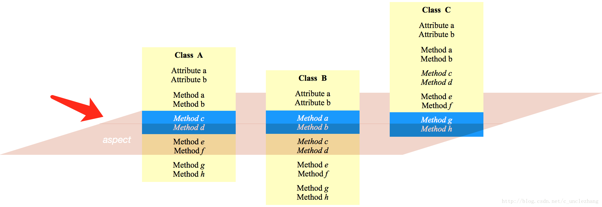
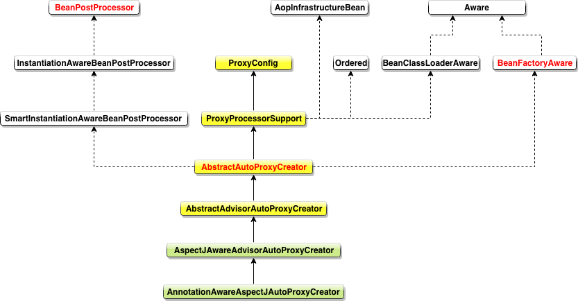

# 简介

AOP : **Aspect-Oriented Programming (AOP)** complements`补充,使完美 Component(组件)`  *Object-Oriented Programming* 
面向切面的编程(AOP)是面向对象编程(OOP)的补充)

**Aspect**：字面意思是**切面**，官方解释 *`a modularization模块化 of a concern关注点 that cuts across multiple classes`* *( 横切多个类的一个关注点模块)*，简单说就是对类具体行为的关注点集合，这样解释还是太抽象.



上图中 可以看到 对多个类关注的方法 形成的一个切面，就是 Aspect

**Join point**: a point during the execution of a program, such as the execution of a method or the handling of an exception. In Spring AOP, **a join point always represents a method execution**  这里可以理解为 JoinPoint 就是那些需要特殊处理的方法。

**Advice**: **action taken by an aspect at a particular join point**. Different types of advice include “around” ,“before” and “after” advice. (Advice types are discussed below.)

**Pointcut**: a predicate`断言` that **matches** join points. **Advice** is associated with a **Pointcut** expression and runs at any **join point** matched by the **Pointcut** (for example, the execution of a method with a certain name). 一个特殊的表达式，用来连接 Advice 与 Join point

**Target object**: *object being advised by one or more aspects. Also referred to as the advised object*(目标对象 ，被一个或多个切面通知的对象，通常被称为被通知对象)

## **Proxy Pattern(代理模式)** 

What problems can the Proxy design pattern solve? （代理模式能解决什么问题）

* The access to an object should be controlled.(控制被访问对象)
* Additional functionality should be provided when accessing an object.(给被访问对象提供额外功能)

What solution does the Proxy design pattern describe?(代理模式的解决方案是如何描述的) 
* Define a separate Proxy object that can be used as substitute`替代品` for another object (Subject) and implements additional functionality to control the access to this subject. 

# Spring如何实现AOP

我们重点使用最新最简洁的spring 5 自动配置模式来进行讲解 
这里我们通过一个性能拦截器来演示spring aop的代码流程，这个拦截器可以打印服务层所有方法的执行时间

**业务接口定义**

```java
public interface IBusinessService {
    void executeBusinessA() throws InterruptedException;
    void executeBusinessB() throws InterruptedException;
}
```

**业务实现类**

```java
@Service("businessService")
public class BusinessServiceImpl implements IBusinessService {
    private static final Logger logger = LoggerFactory.getLogger(BusinessServiceImpl.class);
  
    public void executeBusinessA() throws InterruptedException {
        Thread.sleep(200);
        logger.info("executing business in methodA");
    }

    public void executeBusinessB() throws InterruptedException {
        Thread.sleep(1000);//模拟超时
        logger.info("executing business in methodB");
    }
}
```

**性能分析器**

```java
@Component
@Aspect
public class PerformanceAnalysisInterceptor {

    private static Logger logger = LoggerFactory.getLogger(PerformanceAnalysisInterceptor.class);
    private static final long DELAY_MINUTE = 1000;

    @Around("execution (*  com.noob.storage.aop.BusinessServiceImpl.*(..))")
    public Object analysisAround(ProceedingJoinPoint joinPoint) {
        Object obj = null;
        long startTime = System.currentTimeMillis();
        try {
            obj = joinPoint.proceed(joinPoint.getArgs());
        } catch (Throwable e) {
            logger.error(e.getMessage());
        }

        long endTime = System.currentTimeMillis();
        MethodSignature signature = (MethodSignature) joinPoint.getSignature();
        String methodName = signature.getDeclaringTypeName() + "." + signature.getName();
        long diffTime = endTime - startTime;

        logger.info("-----" + methodName + "执行时间 ：" + diffTime + " ms");
        if (diffTime > DELAY_MINUTE)
            delayWarning(methodName, diffTime - DELAY_MINUTE);

        return obj;
    }

    private void delayWarning(String methodName, long delayTime) {
        logger.warn("-----" + methodName + "超时 ：" + delayTime + " ms");
    }
}
```

**xml自动化配置**

```xml
<?xml version="1.0" encoding="UTF-8"?>
<beans xmlns="http://www.springframework.org/schema/beans"
       xmlns:xsi="http://www.w3.org/2001/XMLSchema-instance"
       xmlns:aop="http://www.springframework.org/schema/aop"
       xmlns:context="http://www.springframework.org/schema/context"
       xsi:schemaLocation="http://www.springframework.org/schema/beans http://www.springframework.org/schema/beans/spring-beans.xsd
        http://www.springframework.org/schema/aop http://www.springframework.org/schema/aop/spring-aop.xsd http://www.springframework.org/schema/context http://www.springframework.org/schema/context/spring-context.xsd">

    <context:component-scan base-package="com.noob.storage.aop"/>
    <aop:aspectj-autoproxy/>

</beans>
```

**主函数调用执行**

```java
public class AopMain {
    public static void main(String[] args) throws InterruptedException {
        ClassPathXmlApplicationContext f = new ClassPathXmlApplicationContext("spring-aop.xml");
        IBusinessService businessService = (IBusinessService) f.getBean("businessService");
        businessService.executeBusinessA();
        businessService.executeBusinessB();
    }
}
```
**输出结果**

    [0520 11:03:29 533 INFO ] [main] storage.aop.BusinessServiceImpl [userId=]- executing business in methodA
    [0520 11:03:29 540 INFO ] [main] storage.aop.PerformanceAnalysisInterceptor [userId=]- -----com.noob.storage.aop.IBusinessService.executeBusinessA执行时间 ：208 ms
    [0520 11:03:30 544 INFO ] [main] storage.aop.BusinessServiceImpl [userId=]- executing business in methodB
    [0520 11:03:30 545 INFO ] [main] storage.aop.PerformanceAnalysisInterceptor [userId=]- -----com.noob.storage.aop.IBusinessService.executeBusinessB执行时间 ：1004 ms
    [0520 11:03:30 545 WARN ] [main] storage.aop.PerformanceAnalysisInterceptor [userId=]- -----com.noob.storage.aop.IBusinessService.executeBusinessB超时 ：4 ms	

下边我们进行代码的详细分析
我们看到 xml配置文件里边只有两行配置信息，第一行配置是context自动扫描，作用是扫描制定范围的组件并注册到 Spring，第二行是注解 Aspect 自动发现
这样解释还是有点抽象，我们从两个问题入手（问题是揭开真相的火花）

1. Spring 怎么识别出需要代理的目标对象，也就是我们这里边实现了 IBusinessService 接口的 BusinessServiceImpl 对象

2. 我们定义的这个切面 (aspect 注解的 bean)怎么被发现并应用到目标对象(businessService)

第一个问题属于 spring ioc 的范围。关于自动扫描的内容参考 [Spring-ComponentScan.md](./Spring-ComponentScan.md)。本文着重介绍 Spring 代理类的实现。

我们看到 `PerformanceAnalysisInterceptor` 类的注解有两个 一个是 `@Component` 一个是`@Aspect` **Component**标签刚才已经解释过，说明这是一个 spring 的组件，已经注册到 spring 中，那 **Aspect** 注解呢？根据刚才的分析, 我们知道 spring 对于不同的标签采用不同的处理器，同理，这里 **Aspect** 也有对应的标签处理器,进过全局搜索，我们发现在 `AopNamespaceHandler` 中

```java
public class AopNamespaceHandler extends NamespaceHandlerSupport {
   /**
    * Register the {@link BeanDefinitionParser BeanDefinitionParsers} for the
    * '{@code config}', '{@code spring-configured}', '{@code aspectj-autoproxy}'
    * and '{@code scoped-proxy}' tags.
    */
   @Override
   public void init() {
      // In 2.0 XSD as well as in 2.1 XSD.
      registerBeanDefinitionParser("config", new ConfigBeanDefinitionParser());
      registerBeanDefinitionParser("aspectj-autoproxy", new AspectJAutoProxyBeanDefinitionParser());
      registerBeanDefinitionDecorator("scoped-proxy", new ScopedProxyBeanDefinitionDecorator());

      // Only in 2.0 XSD: moved to context namespace as of 2.1
      registerBeanDefinitionParser("spring-configured", new SpringConfiguredBeanDefinitionParser());
   }
}
```

我们进入`AspectJAutoProxyBeanDefinitionParser`的`parse`方法

AspectJAutoProxyBeanDefinitionParser

```java
@Override
@Nullable
public BeanDefinition parse(Element element, ParserContext parserContext) {
   //注册 AspectJAnnotationAutoProxyCreator
   AopNamespaceUtils.registerAspectJAnnotationAutoProxyCreatorIfNecessary(parserContext, element);
   extendBeanDefinition(element, parserContext);
   return null;
}
```

进入`registerAspectJAutoProxyCreatorIfNecessary`方法

AopNamespaceUtils

```java
public static void registerAspectJAnnotationAutoProxyCreatorIfNecessary(
      ParserContext parserContext, Element sourceElement) {
	 // 把应用了注解 @Aspect 的 bean 注册成 BeanDefiniton
   BeanDefinition beanDefinition = AopConfigUtils.registerAspectJAnnotationAutoProxyCreatorIfNecessary(
         parserContext.getRegistry(), parserContext.extractSource(sourceElement));
   // 处理 proxy-target-class 和 expose-proxy 属性
   useClassProxyingIfNecessary(parserContext.getRegistry(), sourceElement);
   // 注册组件并通知监听器
   registerComponentIfNecessary(beanDefinition, parserContext);
}
```

我们重点看下第一个流程 进入方法体

```java
@Nullable
public static BeanDefinition registerAspectJAnnotationAutoProxyCreatorIfNecessary(
      BeanDefinitionRegistry registry, @Nullable Object source) {

   return registerOrEscalateApcAsRequired(AnnotationAwareAspectJAutoProxyCreator.class, registry, source);
}
```

```java
@Nullable
private static BeanDefinition registerOrEscalateApcAsRequired(
      Class<?> cls, BeanDefinitionRegistry registry, @Nullable Object source) {

   Assert.notNull(registry, "BeanDefinitionRegistry must not be null");
   if (registry.containsBeanDefinition(AUTO_PROXY_CREATOR_BEAN_NAME)) {
      BeanDefinition apcDefinition = registry.getBeanDefinition(AUTO_PROXY_CREATOR_BEAN_NAME);
      if (!cls.getName().equals(apcDefinition.getBeanClassName())) {
         int currentPriority = findPriorityForClass(apcDefinition.getBeanClassName());
         int requiredPriority = findPriorityForClass(cls);
         if (currentPriority < requiredPriority) {
            apcDefinition.setBeanClassName(cls.getName());
         }
      }
      return null;
   }

	 // 这里我们看到，spring 会注册一个内部的 BeanDefiniton 
   // key 是 org.springframework.aop.config.internalAutoProxyCreator
   RootBeanDefinition beanDefinition = new RootBeanDefinition(cls);
   beanDefinition.setSource(source);
   beanDefinition.getPropertyValues().add("order", Ordered.HIGHEST_PRECEDENCE);
   beanDefinition.setRole(BeanDefinition.ROLE_INFRASTRUCTURE);
   registry.registerBeanDefinition(AUTO_PROXY_CREATOR_BEAN_NAME, beanDefinition);
   return beanDefinition;
}
```

这里我们看到，spring 会注册一个内部的 BeanDefiniton key 是 **org.springframework.aop.config.internalAutoProxyCreator**



从结构图，我们看到它实现了`BeanPostProcessor`接口，意味着spring在加载整个bean时，实例化前会调用 `postProcessAfterInitialization`方法，我们进入这个方法（在父类`AbstractAutoProxyCreator`中）
```java
/**
 * Create a proxy with the configured interceptors if the bean is
 * identified as one to proxy by the subclass.
 * @see #getAdvicesAndAdvisorsForBean
 */
@Override
public Object postProcessAfterInitialization(@Nullable Object bean, String beanName) {
   if (bean != null) {
      Object cacheKey = getCacheKey(bean.getClass(), beanName);
      if (this.earlyProxyReferences.remove(cacheKey) != bean) {
         return wrapIfNecessary(bean, beanName, cacheKey);
      }
   }
   return bean;
}
```

重点是方法`wrapIfNecessary`,这个方法的作用就是 如果目标 bean 能够被代理，则使用代理进行包裹

```java
/**
 * Wrap the given bean if necessary, i.e. if it is eligible for being proxied.
 * @param bean the raw bean instance
 * @param beanName the name of the bean
 * @param cacheKey the cache key for metadata access
 * @return a proxy wrapping the bean, or the raw bean instance as-is
 */
protected Object wrapIfNecessary(Object bean, String beanName, Object cacheKey) {
   //如果已经处理过，直接返回
   if (StringUtils.hasLength(beanName) && this.targetSourcedBeans.contains(beanName)) {
      return bean;
   }
   //无需增强, 跟下一个判断对应
   if (Boolean.FALSE.equals(this.advisedBeans.get(cacheKey))) {
      return bean;
   }
   //如果是基础类比如 advice pointcut advisor 这些基础 aop 类则直接返回
   if (isInfrastructureClass(bean.getClass()) || shouldSkip(bean.getClass(), beanName)) {
      this.advisedBeans.put(cacheKey, Boolean.FALSE);
      return bean;
   }

   // Create proxy if we have advice.
   // 获取被代理类所有的拦截器
   Object[] specificInterceptors = getAdvicesAndAdvisorsForBean(bean.getClass(), beanName, null);
   if (specificInterceptors != DO_NOT_PROXY) {
      this.advisedBeans.put(cacheKey, Boolean.TRUE);
      //创建代理
      Object proxy = createProxy(
            bean.getClass(), beanName, specificInterceptors, new SingletonTargetSource(bean));
      this.proxyTypes.put(cacheKey, proxy.getClass());
      return proxy;
   }

   this.advisedBeans.put(cacheKey, Boolean.FALSE);
   return bean;
}
```

这里我们看到了 AOP 逻辑的核心 ,整个流程很清晰，首先获取这个 bean 对应的所有拦截器如果拦截为空，直接返回 bean,否则 创建对应的代理然后返回代理 bean, 这里有两个重点分析部分。一个是拦截器的获取，一个是如何代理

我们先看拦截器的获取

```java
@Override
@Nullable
protected Object[] getAdvicesAndAdvisorsForBean(
      Class<?> beanClass, String beanName, @Nullable TargetSource targetSource) {

   List<Advisor> advisors = findEligibleAdvisors(beanClass, beanName);
   if (advisors.isEmpty()) {
      return DO_NOT_PROXY;
   }
   return advisors.toArray();
}
```

```java
/**
 * Find all eligible合格的 Advisors for auto-proxying this class.
 * @param beanClass the clazz to find advisors for
 * @param beanName the name of the currently proxied bean
 * @return the empty List, not {@code null},
 * if there are no pointcuts or interceptors
 */
protected List<Advisor> findEligibleAdvisors(Class<?> beanClass, String beanName) {
   //获取所有的拦截增强器
   List<Advisor> candidateAdvisors = findCandidateAdvisors();
   //看哪些拦截增强器可以应用到目标bean
   List<Advisor> eligibleAdvisors = findAdvisorsThatCanApply(candidateAdvisors, beanClass, beanName);
   extendAdvisors(eligibleAdvisors);
   if (!eligibleAdvisors.isEmpty()) {
      eligibleAdvisors = sortAdvisors(eligibleAdvisors);
   }
   return eligibleAdvisors;
}
```

首先，获取所有候选的 `Advisor`，我们进入 `findCandidateAdvisors` 方法，该方法是在  `AnnotationAwareAspectJAutoProxyCreator`  子类实现的。

AnnotationAwareAspectJAutoProxyCreator

```java
	@Override
	protected List<Advisor> findCandidateAdvisors() {
		// Add all the Spring advisors found according to superclass rules.
    //通过父类来加载配置文件中的 Advisor
		List<Advisor> advisors = super.findCandidateAdvisors();
		// Build Advisors for all AspectJ aspects in the bean factory.
		if (this.aspectJAdvisorsBuilder != null) {
      //获取AOP注解拦截器
			advisors.addAll(this.aspectJAdvisorsBuilder.buildAspectJAdvisors());
		}
		return advisors;
	}
```

从代码来看，拦截器分成两部分，

一部分来源是配置文件，这里是委托给父类来加载配置文件中的 Advisor （拦截器），具体实现如下

**BeanFactoryAdvisorRetrievalHelper**

```java
/**
 * Find all eligible Advisor beans in the current bean factory,
 * ignoring FactoryBeans and excluding beans that are currently in creation.
 * @return the list of {@link org.springframework.aop.Advisor} beans
 * @see #isEligibleBean
 */
public List<Advisor> findAdvisorBeans() {
   // Determine list of advisor bean names, if not cached already.
   String[] advisorNames = this.cachedAdvisorBeanNames;
   if (advisorNames == null) {
      // Do not initialize FactoryBeans here: We need to leave all regular beans
      // uninitialized to let the auto-proxy creator apply to them!
      //获取所有注册的 Advisor 类型的 beanName 数组
      advisorNames = BeanFactoryUtils.beanNamesForTypeIncludingAncestors(
            this.beanFactory, Advisor.class, true, false);
      this.cachedAdvisorBeanNames = advisorNames;
   }
   if (advisorNames.length == 0) {
      return new ArrayList<>();
   }

   List<Advisor> advisors = new ArrayList<>();
   for (String name : advisorNames) {
      // 子类定义规则来过滤 bean 
      if (isEligibleBean(name)) {
         if (this.beanFactory.isCurrentlyInCreation(name)) {
            if (logger.isTraceEnabled()) {
               logger.trace("Skipping currently created advisor '" + name + "'");
            }
         }
         else {
            try {
               // 从 BeanFactory 获取对应的 Bean 实例
               advisors.add(this.beanFactory.getBean(name, Advisor.class));
            }
            catch (BeanCreationException ex) {
               Throwable rootCause = ex.getMostSpecificCause();
               if (rootCause instanceof BeanCurrentlyInCreationException) {
                  BeanCreationException bce = (BeanCreationException) rootCause;
                  String bceBeanName = bce.getBeanName();
                  if (bceBeanName != null && this.beanFactory.isCurrentlyInCreation(bceBeanName)) {
                     if (logger.isTraceEnabled()) {
                        logger.trace("Skipping advisor '" + name +
                              "' with dependency on currently created bean: " + ex.getMessage());
                     }
                     // Ignore: indicates a reference back to the bean we're trying to advise.
                     // We want to find advisors other than the currently created bean itself.
                     continue;
                  }
               }
               throw ex;
            }
         }
      }
   }
   return advisors;
}
```

另外一部分是应用了注解的 bean，在我们的演示案例中配置文件中没有对应的拦截器xml配置，只有注解的`@Aspect`，所以我们直接分析  this.**aspectJAdvisorsBuilder**.**buildAspectJAdvisors** 方法

BeanFactoryAspectJAdvisorsBuilder

```java
/**
 * Look for AspectJ-annotated aspect beans in the current bean factory,
 * and return to a list of Spring AOP Advisors representing them.
 * <p>Creates a Spring Advisor for each AspectJ advice method.
 * @return the list of {@link org.springframework.aop.Advisor} beans
 * @see #isEligibleBean
 */
public List<Advisor> buildAspectJAdvisors() {
   List<String> aspectNames = this.aspectBeanNames;

   if (aspectNames == null) {
      synchronized (this) {
         aspectNames = this.aspectBeanNames;
         if (aspectNames == null) {
            List<Advisor> advisors = new ArrayList<>();
            aspectNames = new ArrayList<>();
            //获取所有注册的 beanName
            String[] beanNames = BeanFactoryUtils.beanNamesForTypeIncludingAncestors(
                  this.beanFactory, Object.class, true, false);
            for (String beanName : beanNames) {
               // 子类定义规则来过滤 bean
               if (!isEligibleBean(beanName)) {
                  continue;
               }
               // We must be careful not to instantiate beans eagerly as in this case they
               // would be cached by the Spring container but would not have been weaved.
               //获取 bean 类型
               Class<?> beanType = this.beanFactory.getType(beanName);
               if (beanType == null) {
                  continue;
               }
               //判断是否是Aspect注解 (重点) !!!
               if (this.advisorFactory.isAspect(beanType)) {
                  aspectNames.add(beanName);
                  AspectMetadata amd = new AspectMetadata(beanType, beanName);
                  if (amd.getAjType().getPerClause().getKind() == PerClauseKind.SINGLETON) {
                     MetadataAwareAspectInstanceFactory factory =
                           new BeanFactoryAspectInstanceFactory(this.beanFactory, beanName);
                     // 解析Aspect注解中的拦截器方法(比如 @After @Before @Aroud等)
                     List<Advisor> classAdvisors = this.advisorFactory.getAdvisors(factory);
                     if (this.beanFactory.isSingleton(beanName)) {
                        this.advisorsCache.put(beanName, classAdvisors);
                     }
                     else {
                        this.aspectFactoryCache.put(beanName, factory);
                     }
                     advisors.addAll(classAdvisors);
                  }
                  else {
                     // Per target or per this.
                     if (this.beanFactory.isSingleton(beanName)) {
                        throw new IllegalArgumentException("Bean with name '" + beanName +
                              "' is a singleton, but aspect instantiation model is not singleton");
                     }
                     MetadataAwareAspectInstanceFactory factory =
                           new PrototypeAspectInstanceFactory(this.beanFactory, beanName);
                     this.aspectFactoryCache.put(beanName, factory);
                     advisors.addAll(this.advisorFactory.getAdvisors(factory));
                  }
               }
            }
            this.aspectBeanNames = aspectNames;
            return advisors;
         }
      }
   }

   if (aspectNames.isEmpty()) {
      return Collections.emptyList();
   }
   //缓存
   List<Advisor> advisors = new ArrayList<>();
   for (String aspectName : aspectNames) {
      List<Advisor> cachedAdvisors = this.advisorsCache.get(aspectName);
      if (cachedAdvisors != null) {
         advisors.addAll(cachedAdvisors);
      }
      else {
         MetadataAwareAspectInstanceFactory factory = this.aspectFactoryCache.get(aspectName);
         advisors.addAll(this.advisorFactory.getAdvisors(factory));
      }
   }
   return advisors;
}
```

到这里其实已经找到了 我们的性能拦截器 `PerformanceAnalysisInterceptor` 因为它上边的`@Aspect`注解标识了它就是一个拦截器切面 ，下边就是解析这个切面中的规则(`Pointcut`定义)和拦截方法(`Advice`)

ReflectiveAspectJAdvisorFactory

```java
@Override
public List<Advisor> getAdvisors(MetadataAwareAspectInstanceFactory aspectInstanceFactory) {
   Class<?> aspectClass = aspectInstanceFactory.getAspectMetadata().getAspectClass();
   String aspectName = aspectInstanceFactory.getAspectMetadata().getAspectName();
   validate(aspectClass);

   // We need to wrap the MetadataAwareAspectInstanceFactory with a decorator
   // so that it will only instantiate once.
   MetadataAwareAspectInstanceFactory lazySingletonAspectInstanceFactory =
         new LazySingletonAspectInstanceFactoryDecorator(aspectInstanceFactory);

   List<Advisor> advisors = new ArrayList<>();
   // 获取切面拦截器的所有拦截方法
   for (Method method : getAdvisorMethods(aspectClass)) {
      // 获取拦截器方法(增强)并包装成advisor
      Advisor advisor = getAdvisor(method, lazySingletonAspectInstanceFactory, advisors.size(), aspectName);
      if (advisor != null) {
         advisors.add(advisor);
      }
   }

   // If it's a per target aspect, emit the dummy instantiating aspect.
   if (!advisors.isEmpty() && lazySingletonAspectInstanceFactory.getAspectMetadata().isLazilyInstantiated()) {
      Advisor instantiationAdvisor = new SyntheticInstantiationAdvisor(lazySingletonAspectInstanceFactory);
      advisors.add(0, instantiationAdvisor);
   }

   // Find introduction fields.
   //获取DeclareParents注解 
   for (Field field : aspectClass.getDeclaredFields()) {
      Advisor advisor = getDeclareParentsAdvisor(field);
      if (advisor != null) {
         advisors.add(advisor);
      }
   }

   return advisors;
}
```

进入`getAdvisor`方法

```java
@Override
@Nullable
public Advisor getAdvisor(Method candidateAdviceMethod, MetadataAwareAspectInstanceFactory aspectInstanceFactory,
      int declarationOrderInAspect, String aspectName) {

   validate(aspectInstanceFactory.getAspectMetadata().getAspectClass());
   
   //获取Pointcut表达式
   AspectJExpressionPointcut expressionPointcut = getPointcut(
         candidateAdviceMethod, aspectInstanceFactory.getAspectMetadata().getAspectClass());
   if (expressionPointcut == null) {
      return null;
   }
  
   //根据pointcut生成拦截器对象
   return new InstantiationModelAwarePointcutAdvisorImpl(expressionPointcut, candidateAdviceMethod,
         this, aspectInstanceFactory, declarationOrderInAspect, aspectName);
}
```

这里 **`getPointcut`** 方法就是如何解析  **`PerformanceAnalysisInterceptor`** 中的 **`@Around(POINTCUT)`** 具体看下实现

```java
@Nullable
private AspectJExpressionPointcut getPointcut(Method candidateAdviceMethod, Class<?> candidateAspectClass) {
   AspectJAnnotation<?> aspectJAnnotation =
         AbstractAspectJAdvisorFactory.findAspectJAnnotationOnMethod(candidateAdviceMethod);
   if (aspectJAnnotation == null) {
      return null;
   }

   AspectJExpressionPointcut ajexp =
         new AspectJExpressionPointcut(candidateAspectClass, new String[0], new Class<?>[0]);
   ajexp.setExpression(aspectJAnnotation.getPointcutExpression());
   if (this.beanFactory != null) {
      ajexp.setBeanFactory(this.beanFactory);
   }
   return ajexp;
}
```

AbstractAspectJAdvisorFactory

```java
@Nullable
protected static AspectJAnnotation<?> findAspectJAnnotationOnMethod(Method method) {
   for (Class<?> clazz : ASPECTJ_ANNOTATION_CLASSES) {
      AspectJAnnotation<?> foundAnnotation = findAnnotation(method, (Class<Annotation>) clazz);
      if (foundAnnotation != null) {
         return foundAnnotation;
      }
   }
   return null;
}
```

这里是从spring提供的所有候选注解类中寻找 当前方法上的注解 并封装成 `AspectJAnnotation`对象 对于我们定义的性能拦截器`PerformanceAnalysisInterceptor` , 上边只有一个`@Around`注解，所以这里的`Advisor`也就只有一个(`Advisor`可以看成`advice`和`pointcut`的集合)


我们回到 `AbstractAdvisorAutoProxyCreator` ，继续往下看，下边就是这些找到的拦截器中哪些可以应用到目标对象的方法上

```java
/**
 * Search the given candidate Advisors to find all Advisors that
 * can apply to the specified bean.
 * @param candidateAdvisors the candidate Advisors
 * @param beanClass the target's bean class
 * @param beanName the target's bean name
 * @return the List of applicable Advisors
 * @see ProxyCreationContext#getCurrentProxiedBeanName()
 */
protected List<Advisor> findAdvisorsThatCanApply(
      List<Advisor> candidateAdvisors, Class<?> beanClass, String beanName) {

   ProxyCreationContext.setCurrentProxiedBeanName(beanName);
   try {
      return AopUtils.findAdvisorsThatCanApply(candidateAdvisors, beanClass);
   }
   finally {
      ProxyCreationContext.setCurrentProxiedBeanName(null);
   }
}
```

```java
/**
 * Determine the sublist of the {@code candidateAdvisors} list
 * that is applicable to the given class.
 * @param candidateAdvisors the Advisors to evaluate
 * @param clazz the target class
 * @return sublist of Advisors that can apply to an object of the given class
 * (may be the incoming List as-is)
 */
public static List<Advisor> findAdvisorsThatCanApply(List<Advisor> candidateAdvisors, Class<?> clazz) {
   // 如果没有候选列表，直接返回空
   if (candidateAdvisors.isEmpty()) {
      return candidateAdvisors;
   }
   List<Advisor> eligibleAdvisors = new ArrayList<>();
   // 筛选符合条件的 IntroductionAdvisor
   for (Advisor candidate : candidateAdvisors) {
      if (candidate instanceof IntroductionAdvisor && canApply(candidate, clazz)) {
         eligibleAdvisors.add(candidate);
      }
   }
   // 筛选符合条件的 PointCutAdvisor
   boolean hasIntroductions = !eligibleAdvisors.isEmpty();
   for (Advisor candidate : candidateAdvisors) {
      if (candidate instanceof IntroductionAdvisor) {
         // already processed
         continue;
      }
      if (canApply(candidate, clazz, hasIntroductions)) {
         eligibleAdvisors.add(candidate);
      }
   }
   return eligibleAdvisors;
}
```

```java
/**
 * Can the given advisor apply at all on the given class?
 * <p>This is an important test as it can be used to optimize out a advisor for a class.
 * This version also takes into account introductions (for IntroductionAwareMethodMatchers).
 * @param advisor the advisor to check
 * @param targetClass class we're testing
 * @param hasIntroductions whether or not the advisor chain for this bean includes
 * any introductions
 * @return whether the pointcut can apply on any method
 */
public static boolean canApply(Advisor advisor, Class<?> targetClass, boolean hasIntroductions) {
   if (advisor instanceof IntroductionAdvisor) {
      // IntroductionAdvisor 做 ClassFilter 匹配
      return ((IntroductionAdvisor) advisor).getClassFilter().matches(targetClass);
   }
   else if (advisor instanceof PointcutAdvisor) {
      // Pointcut 匹配
      PointcutAdvisor pca = (PointcutAdvisor) advisor;
      return canApply(pca.getPointcut(), targetClass, hasIntroductions);
   }
   else {
      // It doesn't have a pointcut so we assume it applies.
      return true;
   }
}
```

这里，我们重点看一下  `PointcutAdvisor` 的 `canApply` 方法实现

```java
/**
 * Can the given pointcut apply at all on the given class?
 * <p>This is an important test as it can be used to optimize
 * out a pointcut for a class.
 * @param pc the static or dynamic pointcut to check
 * @param targetClass the class to test
 * @param hasIntroductions whether or not the advisor chain
 * for this bean includes any introductions
 * @return whether the pointcut can apply on any method
 */
public static boolean canApply(Pointcut pc, Class<?> targetClass, boolean hasIntroductions) {
   Assert.notNull(pc, "Pointcut must not be null");
   if (!pc.getClassFilter().matches(targetClass)) {
      return false;
   }

   MethodMatcher methodMatcher = pc.getMethodMatcher();
   if (methodMatcher == MethodMatcher.TRUE) {
      // No need to iterate the methods if we're matching any method anyway...
      // 如果匹配所有 method，直接返回 true
      return true;
   }

   IntroductionAwareMethodMatcher introductionAwareMethodMatcher = null;
   if (methodMatcher instanceof IntroductionAwareMethodMatcher) {
      introductionAwareMethodMatcher = (IntroductionAwareMethodMatcher) methodMatcher;
   }

   Set<Class<?>> classes = new LinkedHashSet<>();
   if (!Proxy.isProxyClass(targetClass)) {
      classes.add(ClassUtils.getUserClass(targetClass));
   }
   classes.addAll(ClassUtils.getAllInterfacesForClassAsSet(targetClass));

   for (Class<?> clazz : classes) {
      Method[] methods = ReflectionUtils.getAllDeclaredMethods(clazz);
      for (Method method : methods) {
         if (introductionAwareMethodMatcher != null ?
               introductionAwareMethodMatcher.matches(method, targetClass, hasIntroductions) :
               methodMatcher.matches(method, targetClass)) {
            return true;
         }
      }
   }

   return false;
}
```

这里的大体逻辑是 用找到的切点断言匹配当前 bean 的所有方法，过滤 找到匹配的切点 到此为止我们已经看到spring是如何一步一步的解析我们声明的注解`@Aspect`的切面spring会把这些注解`@Aspect`的类当成拦截器 找到了目标`bean(BusinessServiceImpl)`的拦截器，下一步就是判断拦截器是否为空，为空说明不需要生成代理，直接返回bean，否则就需要创建一个目标bean的代理，这也就是我们常说的代理模式的应用，如图所示，所有对目标对象的访问都通过代理来实现，这样我们就可以把拦截器应用到目标对象上。


**下边我们重点分析第二步流程，spring中如何创建代理**

再回到 `AbstractAutoProxyCreator` ，该类的 `postProcessBeforeInstantiation` 方法中。我们重点看一下他是如何创建代理的

```java
Object proxy = createProxy(beanClass, beanName, specificInterceptors, targetSource);
```

```java
/**
 * Create an AOP proxy for the given bean.
 * @param beanClass the class of the bean
 * @param beanName the name of the bean
 * @param specificInterceptors the set of interceptors that is
 * specific to this bean (may be empty, but not null)
 * @param targetSource the TargetSource for the proxy,
 * already pre-configured to access the bean
 * @return the AOP proxy for the bean
 * @see #buildAdvisors
 */
protected Object createProxy(Class<?> beanClass, @Nullable String beanName,
      @Nullable Object[] specificInterceptors, TargetSource targetSource) {

   if (this.beanFactory instanceof ConfigurableListableBeanFactory) {
      AutoProxyUtils.exposeTargetClass((ConfigurableListableBeanFactory) this.beanFactory, beanName, beanClass);
   }

   ProxyFactory proxyFactory = new ProxyFactory();
   proxyFactory.copyFrom(this);

   if (!proxyFactory.isProxyTargetClass()) {
      if (shouldProxyTargetClass(beanClass, beanName)) {
         proxyFactory.setProxyTargetClass(true);
      }
      else {
         // evaluate 评估
         evaluateProxyInterfaces(beanClass, proxyFactory);
      }
   }

   Advisor[] advisors = buildAdvisors(beanName, specificInterceptors);
   proxyFactory.addAdvisors(advisors);
   proxyFactory.setTargetSource(targetSource);
   customizeProxyFactory(proxyFactory);

   proxyFactory.setFrozen(this.freezeProxy);
   if (advisorsPreFiltered()) {
      proxyFactory.setPreFiltered(true);
   }
	
   // 通过 proxyFactory 获取代理对象
   return proxyFactory.getProxy(getProxyClassLoader());
}
```

我们看到，`spring` 把创建代理的责任交给了**ProxyFactory**，我们看下 `getPorxy` 主流程

ProxyFactory

```java
/**
 * Create a new proxy according to the settings in this factory.
 * <p>Can be called repeatedly. Effect will vary if we've added
 * or removed interfaces. Can add and remove interceptors.
 * <p>Uses the given class loader (if necessary for proxy creation).
 * @param classLoader the class loader to create the proxy with
 * (or {@code null} for the low-level proxy facility's default)
 * @return the proxy object
 */
public Object getProxy(@Nullable ClassLoader classLoader) {
   return createAopProxy().getProxy(classLoader);
}
```

```java
/**
 * Subclasses should call this to get a new AOP proxy. They should <b>not</b>
 * create an AOP proxy with {@code this} as an argument.
 */
protected final synchronized AopProxy createAopProxy() {
   if (!this.active) {
      activate();
   }
   return getAopProxyFactory().createAopProxy(this);
}
```

DefaultAopProxyFactory

```java
@Override
public AopProxy createAopProxy(AdvisedSupport config) throws AopConfigException {
   if (config.isOptimize() || config.isProxyTargetClass() || hasNoUserSuppliedProxyInterfaces(config)) {
      Class<?> targetClass = config.getTargetClass();
      if (targetClass == null) {
         throw new AopConfigException("TargetSource cannot determine target class: " +
               "Either an interface or a target is required for proxy creation.");
      }
      if (targetClass.isInterface() || Proxy.isProxyClass(targetClass)) {
         return new JdkDynamicAopProxy(config);
      }
      return new ObjenesisCglibAopProxy(config);
   }
   else {
      return new JdkDynamicAopProxy(config);
   }
}
```

从这里我们可以很清楚的看到，spring通过两种方式创建代理，分别是`JdkDynamicAopProxy`和`ObjenesisCglibAopProxy`，这两个就是我们常说的**jdk动态代理**和 **cglib 代理(基于字节码)**  , spring怎么区分通过哪种代理是通过三个判断

* **isOptimeiz**         对 CGlib 代理的创建优化
* **isProxyTargetClass**  `<aop:aspectj-autoproxy proxy-target- class="true"/>` 表示使用CGLib进行代理
* **hasNoUserSuppliedProxyInterfaces**  是否存在代理接口

三个条件之一后，还有两个判断 是否实现了接口或是否是代理类型，通过上述判断我们可以知道spring选择代理的策略

1. **如果目标类实现了接口，或者是代理类，采用 jdk动态代理 来实现 AOP**
2. **即使是在配置了ProxyTargetClass指定使用cglib的情况下，如果目标类是interface或者代理类的话，依然会使用Jdk代理**
3. **如果目标类没有实现接口，只能使用 CGlib 来实现 AOP 代理（目标类不是代理类或接口）**

这说明CGlib可以为那些没有实现接口的类增强行为，原理是**为目标类生成一个子类，并覆盖其中的方法**


下边我们重点看下jdk动态代理部分的实现，如果采用jdk动态代理获取代理，关键的调用方法就是 `invoke` 调用

```java
/**
 * Implementation of {@code InvocationHandler.invoke}.
 * <p>Callers will see exactly the exception thrown by the target,
 * unless a hook method throws an exception.
 */
@Override
@Nullable
public Object invoke(Object proxy, Method method, Object[] args) throws Throwable {
   MethodInvocation invocation;
   Object oldProxy = null;
   boolean setProxyContext = false;

   TargetSource targetSource = this.advised.targetSource;
   Object target = null;

   try {
      if (!this.equalsDefined && AopUtils.isEqualsMethod(method)) {
         // The target does not implement the equals(Object) method itself.
         return equals(args[0]);
      }
      else if (!this.hashCodeDefined && AopUtils.isHashCodeMethod(method)) {
         // The target does not implement the hashCode() method itself.
         return hashCode();
      }
      else if (method.getDeclaringClass() == DecoratingProxy.class) {
         // There is only getDecoratedClass() declared -> dispatch to proxy config.
         return AopProxyUtils.ultimateTargetClass(this.advised);
      }
      else if (!this.advised.opaque && method.getDeclaringClass().isInterface() &&
            method.getDeclaringClass().isAssignableFrom(Advised.class)) {
         // Service invocations on ProxyConfig with the proxy config...
         return AopUtils.invokeJoinpointUsingReflection(this.advised, method, args);
      }

      Object retVal;

      if (this.advised.exposeProxy) {
         // Make invocation available if necessary.
         oldProxy = AopContext.setCurrentProxy(proxy);
         setProxyContext = true;
      }

      // Get as late as possible to minimize the time we "own" the target,
      // in case it comes from a pool.
      //获取目标对象和对象类型
      target = targetSource.getTarget();
      Class<?> targetClass = (target != null ? target.getClass() : null);

      // Get the interception chain for this method.
      //获取目标对象上当前方法的的所有拦截器链(已经注入到代理类的属性中，直接可以获取)
      List<Object> chain = this.advised.getInterceptorsAndDynamicInterceptionAdvice(method, targetClass);

      // Check whether we have any advice. If we don't, we can fallback on direct
      // reflective invocation of the target, and avoid creating a MethodInvocation.
      if (chain.isEmpty()) {
         // We can skip creating a MethodInvocation: just invoke the target directly
         // Note that the final invoker must be an InvokerInterceptor so we know it does
         // nothing but a reflective operation on the target, and no hot swapping or fancy proxying.
         //如果没有任何拦截器，则直接调用目标对象的切点方法
         Object[] argsToUse = AopProxyUtils.adaptArgumentsIfNecessary(method, args);
         retVal = AopUtils.invokeJoinpointUsingReflection(target, method, argsToUse);
      }
      else {
         // We need to create a method invocation...
         //执行拦截器的proceed方法
         invocation = new ReflectiveMethodInvocation(proxy, target, method, args, targetClass, chain);
         // Proceed to the joinpoint through the interceptor chain.
         retVal = invocation.proceed();
      }

      // Massage return value if necessary.
      Class<?> returnType = method.getReturnType();
      if (retVal != null && retVal == target &&
            returnType != Object.class && returnType.isInstance(proxy) &&
            !RawTargetAccess.class.isAssignableFrom(method.getDeclaringClass())) {
         // Special case: it returned "this" and the return type of the method
         // is type-compatible. Note that we can't help if the target sets
         // a reference to itself in another returned object.
         retVal = proxy;
      }
      else if (retVal == null && returnType != Void.TYPE && returnType.isPrimitive()) {
         throw new AopInvocationException(
               "Null return value from advice does not match primitive return type for: " + method);
      }
      return retVal;
   }
   finally {
      if (target != null && !targetSource.isStatic()) {
         // Must have come from TargetSource.
         targetSource.releaseTarget(target);
      }
      if (setProxyContext) {
         // Restore old proxy.
         AopContext.setCurrentProxy(oldProxy);
      }
   }
}
```

进入拦截器的proceed方法

ReflectiveMethodInvocation

```java
@Override
@Nullable
public Object proceed() throws Throwable {
   // We start with an index of -1 and increment early.
   //如果已经执行到最后一个拦截器，就执行切点上的方法
   if (this.currentInterceptorIndex == this.interceptorsAndDynamicMethodMatchers.size() - 1) {
      return invokeJoinpoint();
   }

   //获取下一个拦截器
   Object interceptorOrInterceptionAdvice =
         this.interceptorsAndDynamicMethodMatchers.get(++this.currentInterceptorIndex);
   if (interceptorOrInterceptionAdvice instanceof InterceptorAndDynamicMethodMatcher) {
      // Evaluate dynamic method matcher here: static part will already have
      // been evaluated and found to match.
      InterceptorAndDynamicMethodMatcher dm =
            (InterceptorAndDynamicMethodMatcher) interceptorOrInterceptionAdvice;
      Class<?> targetClass = (this.targetClass != null ? this.targetClass : this.method.getDeclaringClass());
      //匹配当前方法
      if (dm.methodMatcher.matches(this.method, targetClass, this.arguments)) {
         return dm.interceptor.invoke(this);
      }
      else {
         // Dynamic matching failed.
         // Skip this interceptor and invoke the next in the chain.
         //不匹配直接跳过
         return proceed();
      }
   }
   else {
      // It's an interceptor, so we just invoke it: The pointcut will have
      // been evaluated statically before this object was constructed.
      //普通拦截器直接调用
      return ((MethodInterceptor) interceptorOrInterceptionAdvice).invoke(this);
   }
}
```

在这里我们看到 spring 会循环递归调用代理的 invoke 方法 

从上边的分析，我们可以知道 最后执行的顺序其实交给了每个要执行的拦截器，通过拦截器中的调用来决定拦截顺序，至此spring aop jdk代理就分析完了，有关CGLib代理方式，这里就不再展开分析，流程大同小异，有兴趣的可以自行研究

**文字版**

**SPRING 通过注解实现AOP的过程的文字描述** 
xml配置文件中声明自动发现注解(),spring默认启动时会注册注解解析器(`AspectJAutoProxyBeanDefinitionParser`)，在注解解析器解析（`parse`）的过程中，会注册一个实现了`BeanPostProcessor`的后处理器(`AspectJAwareAdvisorAutoProxyCreator`),这个后处理器在目标对象实例化后进行拦截处理，拦截的流程是，先搜索所有已经注册的`BeanDefiniton`,从中找到标记了注解(`@Aspect`)的切面组成拦截器链，选择那些可以应用到目标对象的拦截器（过滤），如果拦截器链不为空，则为目标对象生成代理(`JdkDynamicAopProxy`或`CglibAopProxy`)，当调用目标对象的指定拦截方法时，就会默认调用对应代理类的代理方法(`invoke`)，这样就完成了AOP的整个流程。

**PS** 其实在使用过程中，我们都是基于接口进行编程，所以用的最多的也是jdk动态代理，但是当我们目标对象没有实现任何接口，但是我们还想给它增加新的行为，这时候我们就需要CGLib方式，所以具体选择哪种代理方法还要看具体的业务场景。