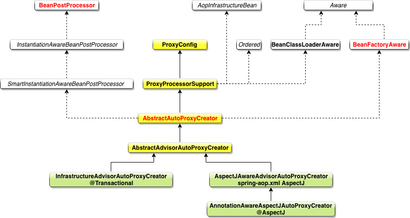

# 源码分析

我们在beans.xml中开启事务的应用，需要添加

```xml
<tx:annotation-driven transaction-manager="transactionManager"/>
```

**`<tx:annotation-driven/>`注解的分析**

在 spring-tx 模块的 spring.handlers 文件中，定义了对 tx 标签的处理器

```
http\://www.springframework.org/schema/tx=org.springframework.transaction.config.TxNamespaceHandler
```

我们打开 `TxNamespaceHandler` 类可以看到

```java
public class TxNamespaceHandler extends NamespaceHandlerSupport {
   // 2种属性名称都可以，估计是为了兼容老版本
   static final String TRANSACTION_MANAGER_ATTRIBUTE = "transaction-manager";
   static final String DEFAULT_TRANSACTION_MANAGER_BEAN_NAME = "transactionManager";
   static String getTransactionManagerName(Element element) {
      return (element.hasAttribute(TRANSACTION_MANAGER_ATTRIBUTE) ?
            element.getAttribute(TRANSACTION_MANAGER_ATTRIBUTE) : DEFAULT_TRANSACTION_MANAGER_BEAN_NAME);
   }

   @Override
   public void init() {
      registerBeanDefinitionParser("advice", new TxAdviceBeanDefinitionParser());
      registerBeanDefinitionParser("annotation-driven", new AnnotationDrivenBeanDefinitionParser());  // 进入该类
      registerBeanDefinitionParser("jta-transaction-manager", new JtaTransactionManagerBeanDefinitionParser());
   }
}
```

 **AnnotationDrivenBeanDefinitionParser**

```java
/**
 * Parses the {@code <tx:annotation-driven/>} tag. Will
 * {@link AopNamespaceUtils#registerAutoProxyCreatorIfNecessary register an AutoProxyCreator}
 * with the container as necessary.
 */
@Override
@Nullable
public BeanDefinition parse(Element element, ParserContext parserContext) {
   registerTransactionalEventListenerFactory(parserContext);
   String mode = element.getAttribute("mode");
   if ("aspectj".equals(mode)) {
      // mode="aspectj"
      registerTransactionAspect(element, parserContext);
      if (ClassUtils.isPresent("javax.transaction.Transactional", getClass().getClassLoader())) {
         registerJtaTransactionAspect(element, parserContext);
      }
   }
   else {
      // mode="proxy"
      // 一般情况下，我们不指定mode字段，所以默认为proxy模式  会执行该句
      AopAutoProxyConfigurer.configureAutoProxyCreator(element, parserContext);
   }
   return null;
}
```

```java
/**
 * Inner class to just introduce an AOP framework dependency when actually in proxy mode.
 */
private static class AopAutoProxyConfigurer {

   public static void configureAutoProxyCreator(Element element, ParserContext parserContext) {
      // 注册 AutoProxyCreator  核心功能！！  后续分析
      AopNamespaceUtils.registerAutoProxyCreatorIfNecessary(parserContext, element);

      // txAdvisorBeanName值为 org.springframework.transaction.config.internalTransactionAdvisor
      String txAdvisorBeanName = TransactionManagementConfigUtils.TRANSACTION_ADVISOR_BEAN_NAME;
      if (!parserContext.getRegistry().containsBeanDefinition(txAdvisorBeanName)) {
         Object eleSource = parserContext.extractSource(element);

         // 1.注册类AnnotationTransactionAttributeSource到Spring中
         RootBeanDefinition sourceDef = new RootBeanDefinition(
               "org.springframework.transaction.annotation.AnnotationTransactionAttributeSource");
         sourceDef.setSource(eleSource);
         sourceDef.setRole(BeanDefinition.ROLE_INFRASTRUCTURE);
         String sourceName = parserContext.getReaderContext().registerWithGeneratedName(sourceDef);

         // 2.注册类TransactionInterceptor到Spring中
         RootBeanDefinition interceptorDef = new RootBeanDefinition(TransactionInterceptor.class);
         interceptorDef.setSource(eleSource);
         interceptorDef.setRole(BeanDefinition.ROLE_INFRASTRUCTURE);
         registerTransactionManager(element, interceptorDef);
         interceptorDef.getPropertyValues().add("transactionAttributeSource", new RuntimeBeanReference(sourceName));
         String interceptorName = parserContext.getReaderContext().registerWithGeneratedName(interceptorDef);

         // 2.注册类BeanFactoryTransactionAttributeSourceAdvisor到Spring
         RootBeanDefinition advisorDef = new RootBeanDefinition(BeanFactoryTransactionAttributeSourceAdvisor.class);
         advisorDef.setSource(eleSource);
         advisorDef.setRole(BeanDefinition.ROLE_INFRASTRUCTURE);
         advisorDef.getPropertyValues().add("transactionAttributeSource", new RuntimeBeanReference(sourceName));
         advisorDef.getPropertyValues().add("adviceBeanName", interceptorName);
         if (element.hasAttribute("order")) {
            advisorDef.getPropertyValues().add("order", element.getAttribute("order"));
         }
         parserContext.getRegistry().registerBeanDefinition(txAdvisorBeanName, advisorDef);

         CompositeComponentDefinition compositeDef = new CompositeComponentDefinition(element.getTagName(), eleSource);
         compositeDef.addNestedComponent(new BeanComponentDefinition(sourceDef, sourceName));
         compositeDef.addNestedComponent(new BeanComponentDefinition(interceptorDef, interceptorName));
         compositeDef.addNestedComponent(new BeanComponentDefinition(advisorDef, txAdvisorBeanName));
         parserContext.registerComponent(compositeDef);
      }
   }
}
```

继续看上面的第一行 

**AopNamespaceUtils**

```java
public static void registerAutoProxyCreatorIfNecessary(
      ParserContext parserContext, Element sourceElement) {
   // 主要是这句话
   BeanDefinition beanDefinition = AopConfigUtils.registerAutoProxyCreatorIfNecessary(
         parserContext.getRegistry(), parserContext.extractSource(sourceElement));
   useClassProxyingIfNecessary(parserContext.getRegistry(), sourceElement);
   registerComponentIfNecessary(beanDefinition, parserContext);
}
```

**AopConfigUtils**

```java
@Nullable
public static BeanDefinition registerAutoProxyCreatorIfNecessary(
      BeanDefinitionRegistry registry, @Nullable Object source) {
   // 重点在这里，主要是将InfrastructureAdvisorAutoProxyCreator注册进来
   return registerOrEscalateApcAsRequired(InfrastructureAdvisorAutoProxyCreator.class, registry, source);
}
```

```java
@Nullable
private static BeanDefinition registerOrEscalateApcAsRequired(
      Class<?> cls, BeanDefinitionRegistry registry, @Nullable Object source) {

   Assert.notNull(registry, "BeanDefinitionRegistry must not be null");

   if (registry.containsBeanDefinition(AUTO_PROXY_CREATOR_BEAN_NAME)) {
      BeanDefinition apcDefinition = registry.getBeanDefinition(AUTO_PROXY_CREATOR_BEAN_NAME);
      if (!cls.getName().equals(apcDefinition.getBeanClassName())) {
         int currentPriority = findPriorityForClass(apcDefinition.getBeanClassName());
         int requiredPriority = findPriorityForClass(cls);
         if (currentPriority < requiredPriority) {
            apcDefinition.setBeanClassName(cls.getName());
         }
      }
      return null;
   }
	 // 注册  InfrastructureAdvisorAutoProxyCreator
   RootBeanDefinition beanDefinition = new RootBeanDefinition(cls);
   beanDefinition.setSource(source);
   beanDefinition.getPropertyValues().add("order", Ordered.HIGHEST_PRECEDENCE);
   beanDefinition.setRole(BeanDefinition.ROLE_INFRASTRUCTURE);
   registry.registerBeanDefinition(AUTO_PROXY_CREATOR_BEAN_NAME, beanDefinition);
   return beanDefinition;
}
```

总结：通过以上的分析可知，`<tx:annotation-driven/>`的主要功能就是将以下四个类注册到Spring容器中
* **AnnotationTransactionAttributeSource**
* **TransactionInterceptor**（主要的拦截功能都在这里实现）
* **BeanFactoryTransactionAttributeSourceAdvisor**（创建bean的代理类的时候该Advisor会被用上）
* **InfrastructureAdvisorAutoProxyCreator**


接下来，我们看下 `InfrastructureAdvisorAutoProxyCreator` 的类结构图   `Infrastructure:基础设施`



该类现了 `BeanPostProcessor` 接口，则则 Spring 在创建 bean 的时候，会默认调用 `InfrastructureAdvisorAutoProxyCreator` 的 `postProcessAfterInitialization()` 方法，就是在这个方法中创建代理类的，下面我们来看下这个方法

该方法在 `AbstractAutoProxyCreator` 父类中，代码如下

```java
/**
 * Create a proxy with the configured interceptors if the bean is
 * identified as one to proxy by the subclass.
 * @see #getAdvicesAndAdvisorsForBean
 */
@Override
public Object postProcessAfterInitialization(@Nullable Object bean, String beanName) {
   if (bean != null) {
      Object cacheKey = getCacheKey(bean.getClass(), beanName);
      if (this.earlyProxyReferences.remove(cacheKey) != bean) {
         // 核心方法
         return wrapIfNecessary(bean, beanName, cacheKey);
      }
   }
   return bean;
}
```

在 wrapIfNecessary 方法中，逻辑与 **[Spring-AOP](./spring-aop.md)**  中一致，在 `findAdvisorsThatCanApply` 方法中，适合当前类的 `Advisor` 最终为`BeanFactoryTransactionAttributeSourceAdvisor`类，也就是我们之前在分析`<tx:annotation-driven/>`中注册的`BeanFactoryTransactionAttributeSourceAdvisor` bean。我们先具体分析一下是怎么找到 BeanFactoryTransactionAttributeSourceAdvisor 的，我们直接从AopUtils 的 canApply 方法开始

```java
/**
 * Can the given pointcut apply at all on the given class?
 * <p>This is an important test as it can be used to optimize
 * out a pointcut for a class.
 * @param pc the static or dynamic pointcut to check
 * @param targetClass the class to test
 * @param hasIntroductions whether or not the advisor chain
 * for this bean includes any introductions
 * @return whether the pointcut can apply on any method
 */
public static boolean canApply(Pointcut pc, Class<?> targetClass, boolean hasIntroductions) {
   Assert.notNull(pc, "Pointcut must not be null");
   if (!pc.getClassFilter().matches(targetClass)) {
      return false;
   }

   MethodMatcher methodMatcher = pc.getMethodMatcher();
   if (methodMatcher == MethodMatcher.TRUE) {
      // No need to iterate the methods if we're matching any method anyway...
      return true;
   }

   IntroductionAwareMethodMatcher introductionAwareMethodMatcher = null;
   if (methodMatcher instanceof IntroductionAwareMethodMatcher) {
      introductionAwareMethodMatcher = (IntroductionAwareMethodMatcher) methodMatcher;
   }

   Set<Class<?>> classes = new LinkedHashSet<>();
   if (!Proxy.isProxyClass(targetClass)) {
      // 我们的目标类非代理类，所以也被加入进来判断
      classes.add(ClassUtils.getUserClass(targetClass));
   }
   classes.addAll(ClassUtils.getAllInterfacesForClassAsSet(targetClass));

   for (Class<?> clazz : classes) {
      Method[] methods = ReflectionUtils.getAllDeclaredMethods(clazz);
      for (Method method : methods) {
         if (introductionAwareMethodMatcher != null ?
               // 判断方法是否匹配 核心逻辑
               introductionAwareMethodMatcher.matches(method, targetClass, hasIntroductions) :
               methodMatcher.matches(method, targetClass)) {
            return true;
         }
      }
   }

   return false;
}
```

这两`matches` 方法不再分析了，最终的结果就是，如果这个类，或者父类有任意一个方法有 `@Transactional` 注解，则满足条件，进行拦截

下面我们再回到  `AbstractAutoProxyCreator` 中，看下再找到合格的 advisor 之后，是怎么创建动态代理的。

```java
/**
 * Wrap the given bean if necessary, i.e. if it is eligible for being proxied.
 * @param bean the raw bean instance
 * @param beanName the name of the bean
 * @param cacheKey the cache key for metadata access
 * @return a proxy wrapping the bean, or the raw bean instance as-is
 */
protected Object wrapIfNecessary(Object bean, String beanName, Object cacheKey) {
   if (StringUtils.hasLength(beanName) && this.targetSourcedBeans.contains(beanName)) {
      return bean;
   }
   if (Boolean.FALSE.equals(this.advisedBeans.get(cacheKey))) {
      return bean;
   }
   if (isInfrastructureClass(bean.getClass()) || shouldSkip(bean.getClass(), beanName)) {
      this.advisedBeans.put(cacheKey, Boolean.FALSE);
      return bean;
   }

   // Create proxy if we have advice.
   // 找 advisor，也就是上面分析的一大块
   Object[] specificInterceptors = getAdvicesAndAdvisorsForBean(bean.getClass(), beanName, null);
   if (specificInterceptors != DO_NOT_PROXY) {
      this.advisedBeans.put(cacheKey, Boolean.TRUE);
      // 创建代理，核心代码
      Object proxy = createProxy(
            bean.getClass(), beanName, specificInterceptors, new SingletonTargetSource(bean));
      this.proxyTypes.put(cacheKey, proxy.getClass());
      // 这里可以看到 返回的是代理类，后续 Spring IOC 会用该代理类来实现注入
      return proxy;
   }

   this.advisedBeans.put(cacheKey, Boolean.FALSE);
   return bean;
}
```

继续看 createProxy

```java
/**
 * Create an AOP proxy for the given bean.
 * @param beanClass the class of the bean
 * @param beanName the name of the bean
 * @param specificInterceptors the set of interceptors that is
 * specific to this bean (may be empty, but not null)
 * @param targetSource the TargetSource for the proxy,
 * already pre-configured to access the bean
 * @return the AOP proxy for the bean
 * @see #buildAdvisors
 */
protected Object createProxy(Class<?> beanClass, @Nullable String beanName,
      @Nullable Object[] specificInterceptors, TargetSource targetSource) {

   if (this.beanFactory instanceof ConfigurableListableBeanFactory) {
      AutoProxyUtils.exposeTargetClass((ConfigurableListableBeanFactory) this.beanFactory, beanName, beanClass);
   }

   ProxyFactory proxyFactory = new ProxyFactory();
   proxyFactory.copyFrom(this);

   if (!proxyFactory.isProxyTargetClass()) { // true 
      // 根据bean 的 preserveTargetClass 属性还有interface 信息，判断是否要代理目标类
      if (shouldProxyTargetClass(beanClass, beanName)) {
         proxyFactory.setProxyTargetClass(true);
      }
      else {
         evaluateProxyInterfaces(beanClass, proxyFactory);
      }
   }
 
   // 构建 Advisor，这里面会包装成 DefaultPointcutAdvisor
   Advisor[] advisors = buildAdvisors(beanName, specificInterceptors);
   proxyFactory.addAdvisors(advisors);
   proxyFactory.setTargetSource(targetSource);
   customizeProxyFactory(proxyFactory);

   proxyFactory.setFrozen(this.freezeProxy);
   if (advisorsPreFiltered()) {
      proxyFactory.setPreFiltered(true);
   }
	
   // 核心方法，获取代理对象
   return proxyFactory.getProxy(getProxyClassLoader());
}
```

我们继续进入 ProxyFactory 查看：

```java
/**
 * Create a new proxy according to the settings in this factory.
 * <p>Can be called repeatedly. Effect will vary if we've added
 * or removed interfaces. Can add and remove interceptors.
 * <p>Uses the given class loader (if necessary for proxy creation).
 * @param classLoader the class loader to create the proxy with
 * (or {@code null} for the low-level proxy facility's default)
 * @return the proxy object
 */
public Object getProxy(@Nullable ClassLoader classLoader) {
   return createAopProxy().getProxy(classLoader);
}
```

这里首先创建 `AopProxy` 

具体代码如下

`DefaultAopProxyFactory`

```java
@Override
public AopProxy createAopProxy(AdvisedSupport config) throws AopConfigException {
   if (config.isOptimize() || config.isProxyTargetClass() || hasNoUserSuppliedProxyInterfaces(config)) {
      Class<?> targetClass = config.getTargetClass();
      if (targetClass == null) {
         throw new AopConfigException("TargetSource cannot determine target class: " +
               "Either an interface or a target is required for proxy creation.");
      }
      if (targetClass.isInterface() || Proxy.isProxyClass(targetClass)) {
         return new JdkDynamicAopProxy(config);
      }
      return new ObjenesisCglibAopProxy(config);
   }
   else {
      return new JdkDynamicAopProxy(config);
   }
}
```

这里的分析同 **[Spring-AOP](./spring-aop.md)**  中一致，不再叙述，我们简单看一下 `JdkDynamicAopProxy` 的实现  首先分析下 `JdkDynamicAopProxy` 的类图


`JdkDynamicAopProxy` 继承了 jdk 动态代理的 `InvocationHandler`

而且它的 getProxy 方法的第三个参数传入的是 this 当前对象

```java
@Override
public Object getProxy(@Nullable ClassLoader classLoader) {
   if (logger.isTraceEnabled()) {
      logger.trace("Creating JDK dynamic proxy: " + this.advised.getTargetSource());
   }
   Class<?>[] proxiedInterfaces = AopProxyUtils.completeProxiedInterfaces(this.advised, true);
   findDefinedEqualsAndHashCodeMethods(proxiedInterfaces);
   return Proxy.newProxyInstance(classLoader, proxiedInterfaces, this);// 这里传入的是 this
}
```

所以我们最终执行的是代理类的 `InvocationHandler` 的 `invoke` 方法，即 `JdkDynamicAopProxy#invoke`

```java
/**
 * Implementation of {@code InvocationHandler.invoke}.
 * <p>Callers will see exactly the exception thrown by the target,
 * unless a hook method throws an exception.
 */
@Override
@Nullable
public Object invoke(Object proxy, Method method, Object[] args) throws Throwable {
   MethodInvocation invocation;
   Object oldProxy = null;
   boolean setProxyContext = false;

   TargetSource targetSource = this.advised.targetSource;
   Object target = null;

   try {
      // equals hashcode 等方法
      if (!this.equalsDefined && AopUtils.isEqualsMethod(method)) {
         // The target does not implement the equals(Object) method itself.
         return equals(args[0]);
      }
      else if (!this.hashCodeDefined && AopUtils.isHashCodeMethod(method)) {
         // The target does not implement the hashCode() method itself.
         return hashCode();
      }
      else if (method.getDeclaringClass() == DecoratingProxy.class) {
         // There is only getDecoratedClass() declared -> dispatch to proxy config.
         return AopProxyUtils.ultimateTargetClass(this.advised);
      }
      else if (!this.advised.opaque && method.getDeclaringClass().isInterface() &&
            method.getDeclaringClass().isAssignableFrom(Advised.class)) {
         // Service invocations on ProxyConfig with the proxy config...
         return AopUtils.invokeJoinpointUsingReflection(this.advised, method, args);
      }

      Object retVal;

      if (this.advised.exposeProxy) {
         // Make invocation available if necessary.
         oldProxy = AopContext.setCurrentProxy(proxy);
         setProxyContext = true;
      }

      // Get as late as possible to minimize the time we "own" the target,
      // in case it comes from a pool.
      target = targetSource.getTarget();
      Class<?> targetClass = (target != null ? target.getClass() : null);

     /* 
      * 核心方法，获取链接器链，并根据需不需要拦截，进行业务处理
      */
     
      // Get the interception chain for this method.
      // 1.获取当前方法的拦截器链，也就是 Advisor 列表
     	// 最终返回的是当前 Advisor 的拦截器 MethodInterceptor 列表，在后面详细分析
      List<Object> chain = this.advised.getInterceptorsAndDynamicInterceptionAdvice(method, targetClass);

      // Check whether we have any advice. If we don't, we can fallback on direct
      // reflective invocation of the target, and avoid creating a MethodInvocation.
      // 2.如果拦截器链为空，说明当前方法没有缓存注解，直接调用方法即可
      if (chain.isEmpty()) {
         // We can skip creating a MethodInvocation: just invoke the target directly
         // Note that the final invoker must be an InvokerInterceptor so we know it does
         // nothing but a reflective operation on the target, and no hot swapping or fancy proxying.
         Object[] argsToUse = AopProxyUtils.adaptArgumentsIfNecessary(method, args);
         retVal = AopUtils.invokeJoinpointUsingReflection(target, method, argsToUse);
      }
      else {
         // We need to create a method invocation...
         // 3.说明当前方法有缓存注解，则需要先调用拦截器链的方法
         invocation = new ReflectiveMethodInvocation(proxy, target, method, args, targetClass, chain);
         // Proceed to the joinpoint through the interceptor chain.
         // 真正的调用在这里 在后续详细分析
         retVal = invocation.proceed();
      }

     	// 返回值处理
      // Massage return value if necessary.
      Class<?> returnType = method.getReturnType();
      if (retVal != null && retVal == target &&
            returnType != Object.class && returnType.isInstance(proxy) &&
            !RawTargetAccess.class.isAssignableFrom(method.getDeclaringClass())) {
         // Special case: it returned "this" and the return type of the method
         // is type-compatible. Note that we can't help if the target sets
         // a reference to itself in another returned object.
         retVal = proxy;
      }
      else if (retVal == null && returnType != Void.TYPE && returnType.isPrimitive()) {
         throw new AopInvocationException(
               "Null return value from advice does not match primitive return type for: " + method);
      }
      return retVal;
   }
   finally {
      if (target != null && !targetSource.isStatic()) {
         // Must have come from TargetSource.
         targetSource.releaseTarget(target);
      }
      if (setProxyContext) {
         // Restore old proxy.
         AopContext.setCurrentProxy(oldProxy);
      }
   }
}
```

**AdvisedSupport.getInterceptorsAndDynamicInterceptionAdvice(method, targetClass);获取当前方法的拦截器链**

```java
/**
 * Determine a list of {@link org.aopalliance.intercept.MethodInterceptor} objects
 * for the given method, based on this configuration.
 * @param method the proxied method
 * @param targetClass the target class
 * @return a List of MethodInterceptors (may also include InterceptorAndDynamicMethodMatchers)
 */
public List<Object> getInterceptorsAndDynamicInterceptionAdvice(Method method, @Nullable Class<?> targetClass) {
   MethodCacheKey cacheKey = new MethodCacheKey(method); // 缓存机制
   List<Object> cached = this.methodCache.get(cacheKey);
   if (cached == null) {
      // 核心逻辑 > 进入
      cached = this.advisorChainFactory.getInterceptorsAndDynamicInterceptionAdvice(
            this, method, targetClass);
      this.methodCache.put(cacheKey, cached);
   }
   return cached;
}
```

**DefaultAdvisorChainFactory**

```java
@Override
public List<Object> getInterceptorsAndDynamicInterceptionAdvice(
      Advised config, Method method, @Nullable Class<?> targetClass) {

   // This is somewhat tricky... We have to process introductions first,
   // but we need to preserve order in the ultimate list.
   AdvisorAdapterRegistry registry = GlobalAdvisorAdapterRegistry.getInstance();
   Advisor[] advisors = config.getAdvisors();
   List<Object> interceptorList = new ArrayList<>(advisors.length);
   Class<?> actualClass = (targetClass != null ? targetClass : method.getDeclaringClass());
   Boolean hasIntroductions = null;

    // 1.遍历当前 bean 的所有 Advisor
    // 就当前示例而言，只有一个Advisor，就是之前创建的BeanFactoryTransactionAttributeSourceAdvisor
   for (Advisor advisor : advisors) {
      // 我们的 BeanFactoryTransactionAttributeSourceAdvisor 是 PointcutAdvisor 所以从这里进入
      if (advisor instanceof PointcutAdvisor) {
         // Add it conditionally.
         PointcutAdvisor pointcutAdvisor = (PointcutAdvisor) advisor;
         if (config.isPreFiltered() || pointcutAdvisor.getPointcut().getClassFilter().matches(actualClass)) {
            // 这里的 MethodMatcher 就是 TransactionAttributeSourcePointcut 本身，不继承 IntroductionAwareMethodMatcher
            MethodMatcher mm = pointcutAdvisor.getPointcut().getMethodMatcher();
            boolean match;
            if (mm instanceof IntroductionAwareMethodMatcher) {
               if (hasIntroductions == null) {
                  hasIntroductions = hasMatchingIntroductions(advisors, actualClass);
               }
               match = ((IntroductionAwareMethodMatcher) mm).matches(method, actualClass, hasIntroductions);
            }
            else {
               // 如果有 @Transactional 注解则返回 true
               match = mm.matches(method, actualClass);
            }
            if (match) {
  	           // 2.获取 Advisor 的 Interceptor，也就是在分析 <tx:annotation-driven> 时 // 下面分析
	             // 被添加到 BeanFactoryTransactionAttributeSourceAdvisor 类的 TransactionInterceptor 类
               MethodInterceptor[] interceptors = registry.getInterceptors(advisor);
               if (mm.isRuntime()) {
                  // Creating a new object instance in the getInterceptors() method
                  // isn't a problem as we normally cache created chains.
                  for (MethodInterceptor interceptor : interceptors) {
                     interceptorList.add(new InterceptorAndDynamicMethodMatcher(interceptor, mm));
                  }
               }
               else {
                  interceptorList.addAll(Arrays.asList(interceptors));
               }
            }
         }
      }
      else if (advisor instanceof IntroductionAdvisor) {
         IntroductionAdvisor ia = (IntroductionAdvisor) advisor;
         if (config.isPreFiltered() || ia.getClassFilter().matches(actualClass)) {
            Interceptor[] interceptors = registry.getInterceptors(advisor);
            interceptorList.addAll(Arrays.asList(interceptors));
         }
      }
      else {
         Interceptor[] interceptors = registry.getInterceptors(advisor);
         interceptorList.addAll(Arrays.asList(interceptors));
      }
   }

   return interceptorList;
}
```

我们先分析下 Interceptor 是什么对象，进入 `registry.getInterceptors(advisor)` 方法

**DefaultAdvisorAdapterRegistry**

```java
@Override
public MethodInterceptor[] getInterceptors(Advisor advisor) throws UnknownAdviceTypeException {
   List<MethodInterceptor> interceptors = new ArrayList<>(3);
   Advice advice = advisor.getAdvice(); // 进入
   if (advice instanceof MethodInterceptor) {
      interceptors.add((MethodInterceptor) advice);
   }
   for (AdvisorAdapter adapter : this.adapters) {
      if (adapter.supportsAdvice(advice)) {
         interceptors.add(adapter.getInterceptor(advisor));
      }
   }
   if (interceptors.isEmpty()) {
      throw new UnknownAdviceTypeException(advisor.getAdvice());
   }
   return interceptors.toArray(new MethodInterceptor[0]);
}
```

我们的 `BeanFactoryTransactionAttributeSourceAdvisor` 是继承 `AbstractBeanFactoryPointcutAdvisor` 的，所以我们看该类的 `getAdvice` 方法

```java
@Override
public Advice getAdvice() {
   Advice advice = this.advice;
   if (advice != null) {
      return advice;
   }

   Assert.state(this.adviceBeanName != null, "'adviceBeanName' must be specified");
   Assert.state(this.beanFactory != null, "BeanFactory must be set to resolve 'adviceBeanName'");

   if (this.beanFactory.isSingleton(this.adviceBeanName)) {
      // Rely on singleton semantics provided by the factory.
      advice = this.beanFactory.getBean(this.adviceBeanName, Advice.class);
      this.advice = advice;
      return advice;
   }
   else {
      // No singleton guarantees from the factory -> let's lock locally but
      // reuse the factory's singleton lock, just in case a lazy dependency
      // of our advice bean happens to trigger the singleton lock implicitly...
      synchronized (this.adviceMonitor) {
         advice = this.advice;
         if (advice == null) {
            advice = this.beanFactory.getBean(this.adviceBeanName, Advice.class);
            this.advice = advice;
         }
         return advice;
      }
   }
}
```

可以明显看出，是在找一个名字叫 adviceBeanName 的 Bean ，那这个Bean 是什么时候塞进去的呢？这就要回到我们最开始的注解 handler 处理类里面了。我们重新贴一下代码。

```java
// 2.注册类TransactionInterceptor到Spring中
RootBeanDefinition interceptorDef = new RootBeanDefinition(TransactionInterceptor.class);
interceptorDef.setSource(eleSource);
interceptorDef.setRole(BeanDefinition.ROLE_INFRASTRUCTURE);
registerTransactionManager(element, interceptorDef);
interceptorDef.getPropertyValues().add("transactionAttributeSource", new RuntimeBeanReference(sourceName));
String interceptorName = parserContext.getReaderContext().registerWithGeneratedName(interceptorDef);

// 2.注册类BeanFactoryTransactionAttributeSourceAdvisor到Spring
RootBeanDefinition advisorDef = new RootBeanDefinition(BeanFactoryTransactionAttributeSourceAdvisor.class);
advisorDef.setSource(eleSource);
advisorDef.setRole(BeanDefinition.ROLE_INFRASTRUCTURE);
advisorDef.getPropertyValues().add("transactionAttributeSource", new RuntimeBeanReference(sourceName));
advisorDef.getPropertyValues().add("adviceBeanName", interceptorName); // 这里传入的是上面的 TransactionInterceptor 类
```
**所以，拦截器链最终返回的是我们之前分析的 *TransactionInterceptor* 类**

再回到 `JdkDynamicAopProxy#invoke` 方法，现在，我们已经找到了 chain 列表，并且不为空，下面看下是怎么拦截的

**ReflectiveMethodInvocation**

```java
@Override
@Nullable
public Object proceed() throws Throwable {
   // We start with an index of -1 and increment early.
   if (this.currentInterceptorIndex == this.interceptorsAndDynamicMethodMatchers.size() - 1) {
      // 如果所有拦截器已经全部处理完，则直接调用被代理对象的目标方法
      return invokeJoinpoint();
   }

   // 获取下一个拦截器
   Object interceptorOrInterceptionAdvice =
         this.interceptorsAndDynamicMethodMatchers.get(++this.currentInterceptorIndex);
  
   // 这个的 TransactionInteceptor 不是继承 InterceptorAndDynamicMethodMatcher 所以无视
   if (interceptorOrInterceptionAdvice instanceof InterceptorAndDynamicMethodMatcher) {
      // Evaluate dynamic method matcher here: static part will already have
      // been evaluated and found to match.
      InterceptorAndDynamicMethodMatcher dm =
            (InterceptorAndDynamicMethodMatcher) interceptorOrInterceptionAdvice;
      Class<?> targetClass = (this.targetClass != null ? this.targetClass : this.method.getDeclaringClass());
      if (dm.methodMatcher.matches(this.method, targetClass, this.arguments)) {
         return dm.interceptor.invoke(this);
      }
      else {
         // Dynamic matching failed.
         // Skip this interceptor and invoke the next in the chain.
         return proceed();
      }
   }
   else {
      // It's an interceptor, so we just invoke it: The pointcut will have
      // been evaluated statically before this object was constructed.
      // 调用拦截器的invoke 方法，需要注意这里的 MethodInterceptor 并不是 Cglib 的 MethodInterceptor，不是同一个类，需要区分
      return ((MethodInterceptor) interceptorOrInterceptionAdvice).invoke(this);
   }
}
```

下面继续往下看 


```java
@Override
@Nullable
public Object invoke(MethodInvocation invocation) throws Throwable {
   // Work out the target class: may be {@code null}.
   // The TransactionAttributeSource should be passed the target class
   // as well as the method, which may be from an interface.
   // 1.获取被代理类
   Class<?> targetClass = (invocation.getThis() != null ? AopUtils.getTargetClass(invocation.getThis()) : null);
 
   // 2.真正方法执行
   // Adapt to TransactionAspectSupport's invokeWithinTransaction...
   return invokeWithinTransaction(invocation.getMethod(), targetClass, invocation::proceed/* 3.回调方法 继续处理下一个拦截器*/);
}
```

```java
/**
 * General delegate for around-advice-based subclasses, delegating to several other template
 * methods on this class. Able to handle {@link CallbackPreferringPlatformTransactionManager}
 * as well as regular {@link PlatformTransactionManager} implementations.
 * @param method the Method being invoked
 * @param targetClass the target class that we're invoking the method on
 * @param invocation the callback to use for proceeding with the target invocation
 * @return the return value of the method, if any
 * @throws Throwable propagated from the target invocation
 */
@Nullable
protected Object invokeWithinTransaction(Method method, @Nullable Class<?> targetClass,
      final InvocationCallback invocation) throws Throwable {

   if (this.reactiveAdapterRegistry != null) {
      ReactiveAdapter adapter = this.reactiveAdapterRegistry.getAdapter(method.getReturnType());
      if (adapter != null) {
         return new ReactiveTransactionSupport(adapter).invokeWithinTransaction(method, targetClass, invocation);
      }
   }

   // If the transaction attribute is null, the method is non-transactional.
   TransactionAttributeSource tas = getTransactionAttributeSource();
   final TransactionAttribute txAttr = (tas != null ? tas.getTransactionAttribute(method, targetClass) : null);
   final PlatformTransactionManager tm = determineTransactionManager(txAttr);
   final String joinpointIdentification = methodIdentification(method, targetClass, txAttr);
  
	 // 1.声明式事务
   if (txAttr == null || !(tm instanceof CallbackPreferringPlatformTransactionManager)) {
      // Standard transaction demarcation with getTransaction and commit/rollback calls.
      TransactionInfo txInfo = createTransactionIfNecessary(tm, txAttr, joinpointIdentification);

      Object retVal;
      try {
         // This is an around advice: Invoke the next interceptor in the chain.
         // This will normally result in a target object being invoked.
         retVal = invocation.proceedWithInvocation();
      }
      catch (Throwable ex) {
         // target invocation exception
         completeTransactionAfterThrowing(txInfo, ex);
         throw ex;
      }
      finally {
         cleanupTransactionInfo(txInfo);
      }

      if (vavrPresent && VavrDelegate.isVavrTry(retVal)) {
         // Set rollback-only in case of Vavr failure matching our rollback rules...
         TransactionStatus status = txInfo.getTransactionStatus();
         if (status != null && txAttr != null) {
            retVal = VavrDelegate.evaluateTryFailure(retVal, txAttr, status);
         }
      }

      commitTransactionAfterReturning(txInfo);
      return retVal;
   }

   // 2.编程式事务（这个我们暂不分析，实际逻辑与声明式一致）
   else {
      final ThrowableHolder throwableHolder = new ThrowableHolder();

      // It's a CallbackPreferringPlatformTransactionManager: pass a TransactionCallback in.
      try {
         Object result = ((CallbackPreferringPlatformTransactionManager) tm).execute(txAttr, status -> {
            TransactionInfo txInfo = prepareTransactionInfo(tm, txAttr, joinpointIdentification, status);
            try {
               Object retVal = invocation.proceedWithInvocation();
               if (vavrPresent && VavrDelegate.isVavrTry(retVal)) {
                  // Set rollback-only in case of Vavr failure matching our rollback rules...
                  retVal = VavrDelegate.evaluateTryFailure(retVal, txAttr, status);
               }
               return retVal;
            }
            catch (Throwable ex) {
               if (txAttr.rollbackOn(ex)) {
                  // A RuntimeException: will lead to a rollback.
                  if (ex instanceof RuntimeException) {
                     throw (RuntimeException) ex;
                  }
                  else {
                     throw new ThrowableHolderException(ex);
                  }
               }
               else {
                  // A normal return value: will lead to a commit.
                  throwableHolder.throwable = ex;
                  return null;
               }
            }
            finally {
               cleanupTransactionInfo(txInfo);
            }
         });

         // Check result state: It might indicate a Throwable to rethrow.
         if (throwableHolder.throwable != null) {
            throw throwableHolder.throwable;
         }
         return result;
      }
      catch (ThrowableHolderException ex) {
         throw ex.getCause();
      }
      catch (TransactionSystemException ex2) {
         if (throwableHolder.throwable != null) {
            logger.error("Application exception overridden by commit exception", throwableHolder.throwable);
            ex2.initApplicationException(throwableHolder.throwable);
         }
         throw ex2;
      }
      catch (Throwable ex2) {
         if (throwableHolder.throwable != null) {
            logger.error("Application exception overridden by commit exception", throwableHolder.throwable);
         }
         throw ex2;
      }
   }
}
```

总结：
    事务功能的实现实际也是通过Spring代理来实现的。生成当前类的代理类，调用代理类的`invoke()`方法，在`invoke()`方法中调用`TransactionInterceptor`拦截器的`invoke()`方法

重要操作流程如下：

1. 解析`<tx:annotation-driven>`，将`InfrastructureAdvisorAutoProxyCreator`注入到Spring容器中，该类的作用是在Spring创建bean实例的时候，会执行其`postProcessAfterInitialization()`方法，生成bean实例的代理类
2. 解析`<tx:annotation-driven>`，将`BeanFactoryTransactionAttributeSourceAdvisor`类注入到Spring容器中，该类的主要作用是作为一个Advisor添加到上述代理类中
3. `BeanFactoryTransactionAttributeSourceAdvisor`类拥有对`TransactionInterceptor`的依赖，`TransactionInterceptor`作为一个方法拦截器，负责对执行方法的拦截
4. 当前类方法调用被拦截到`TransactionInterceptor`后，`TransactionInterceptor`会调用`invoke`方法，来真正实现事务功能


**关于`TransactionInterceptor.invoke()`方法的具体内容下一篇继续详细分析**