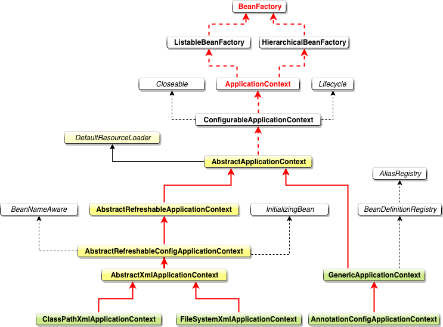
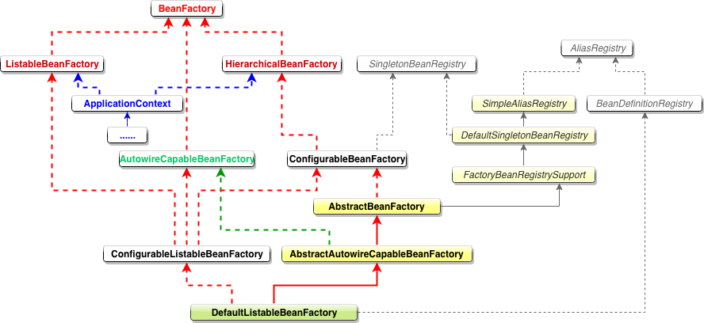

# ApplicationContext

先从最基本的启动 Spring 代码开始

```java
ApplicationContext context 
= new ClassPathXmlApplicationContext("classpath:applicationcontext.xml");
```

上述代码是根据 classpath 去寻找 spring applicationcontext.xml 配置文件，从而完成 spring 上下文的初始化。除了 ClassPathXmlApplicationContext 以外，我们也还有其他构建 ApplicationContext 的方案可供选择，我们先来看看大体的继承结构：



其中：

**FileSystemXmlApplicationContext** 的构造函数需要一个 xml 配置文件在**系统中的路径**，其他和 ClassPathXmlApplicationContext 基本上一样。

**AnnotationConfigApplicationContext** 是基于**注解**来使用的，它不需要配置文件，采用 java 配置类和各种注解来配置，是比较简单的方式。

# BeanFactory 类结构图



**说明**

1. **ApplicationContext** 继承了 **ListableBeanFactory**，这个 Listable 的意思就是，通过这个接口，我们可以获取多个 Bean，最顶层 BeanFactory 接口的方法都是获取单个 Bean 的。
2. **ApplicationContext** 继承了 **HierarchicalBeanFactory**，Hierarchical(分级的)，也就是说我们可以在应用中起多个 BeanFactory，然后可以将各个 BeanFactory 设置为**父子关系**。
3. **AutowireCapableBeanFactory** 这个名字中的 Autowire 大家都非常熟悉，它就是用来**自动装配 Bean** 用的，但是仔细看上图，ApplicationContext 并没有继承它，不过不用担心，不使用继承，不代表不可以使用组合，如果你看到 ApplicationContext 接口定义中的最后一个方法 getAutowireCapableBeanFactory() 就知道了。
4. **ConfigurableListableBeanFactory** 也是一个特殊的接口，看图，特殊之处在于它继承了第二层所有的三个接口，而 ApplicationContext 没有。这点之后会用到。

**BeanFactory**  定义了 `getBean` 的一些接口，除此之外，还定义了一些 `getType`  `getAliases` 等工具方法。

**ListableBeanFactory** 定义了获取所有 bean 信息的一些接口，比如 `getBeanDefinitionNames` 获取所有 BeanName，`getBeanNamesForType` 根据 Type 查找符合条件的 Bean ，检测 Bean 是否存在 `containsBeanDefinition` 等等。

**HierarchicalBeanFactory** 只定义了 2 个方法。 `BeanFactory getParentBeanFactory();`  用来获取父BeanFactory。 `boolean containsLocalBean(String name);` 判断在不考虑父Factory的情况下，当前BeanFactory 是否包含指定的 Bean。

**AutowireCapableBeanFactory** 定义了一些 创建Bean，自动注入 Bean 和 配置Bean 的一些方法

**ApplicationContext** 继承了 `ListableBeanFactory` 和 `HierarchicalBeanFactory` ，所以具有这2个类的所有功能，同时，**内部还定义了`AutowireCapableBeanFactory getAutowireCapableBeanFactory()` 方法，用于获取一个 `AutowireCapableBeanFactory`**。

# 启动过程分析

首先看一下 ClassPathXmlApplicationContext 及其构造方法

```java
/**
 * Standalone XML application context, taking the context definition files
 * from the class path, interpreting plain paths as class path resource names
 * that include the package path (e.g. "mypackage/myresource.txt"). Useful for
 * test harnesses as well as for application contexts embedded within JARs.
 *
 * <p>The config location defaults can be overridden via {@link #getConfigLocations},
 * Config locations can either denote concrete files like "/myfiles/context.xml"
 * or Ant-style patterns like "/myfiles/*-context.xml" (see the
 * {@link org.springframework.util.AntPathMatcher} javadoc for pattern details).
 *
 * <p>Note: In case of multiple config locations, later bean definitions will
 * override ones defined in earlier loaded files. This can be leveraged to
 * deliberately override certain bean definitions via an extra XML file.
 *
 * <p><b>This is a simple, one-stop shop convenience ApplicationContext.
 * Consider using the {@link GenericApplicationContext} class in combination
 * with an {@link org.springframework.beans.factory.xml.XmlBeanDefinitionReader}
 * for more flexible context setup.</b>
 *
 * @author Rod Johnson
 * @author Juergen Hoeller
 * @see #getResource
 * @see #getResourceByPath
 * @see GenericApplicationContext
 */
public class ClassPathXmlApplicationContext extends AbstractXmlApplicationContext {

   @Nullable
   private Resource[] configResources;

   /**
    * Create a new ClassPathXmlApplicationContext with the given parent,
    * loading the definitions from the given XML files.
    * @param configLocations array of resource locations
    * @param refresh whether to automatically refresh the context,
    * loading all bean definitions and creating all singletons.
    * Alternatively, call refresh manually after further configuring the context.
    * @param parent the parent context
    * @throws BeansException if context creation failed
    * @see #refresh()
    */
   public ClassPathXmlApplicationContext(
         String[] configLocations, boolean refresh, @Nullable ApplicationContext parent)
         throws BeansException {
      super(parent);
     	// 根据提供的configLocations，处理成配置文件数组(以分号、逗号、空格、tab、换行符分割)
      setConfigLocations(configLocations);
      if (refresh) {
         refresh();// 核心方法
      }
   }
```

接下来，就是 refresh()，这里简单说下为什么是 refresh()，而不是 init() 这种名字的方法。因为 ApplicationContext 建立起来以后，其实我们是**可以通过调用 refresh() 这个方法重建的，这样会将原来的 ApplicationContext 销毁，然后再重新执行一次初始化操作。**

往下看，refresh() 方法是由 AbstractApplicationContext 抽象类来实现的，具体逻辑如下，这里只看一下大概流程，后续在详细介绍。

```java
@Override
public void refresh() throws BeansException, IllegalStateException {
   // synchronized 避免并发重复刷新
   synchronized (this.startupShutdownMonitor) {
      // Prepare this context for refreshing.
     	// 准备工作，记录下容器的启动时间、标记“已启动”状态、处理配置文件中的占位符
      prepareRefresh();

      // Tell the subclass to refresh the internal bean factory.
     	// 这步比较关键，这步完成后，配置文件就会解析成一个个 beanDefinition，注册到 BeanFactory 中，
      // 当然，这里说的 Bean 还没有初始化，只是配置信息都提取出来了，
      // 注册也只是将这些信息都保存到了注册中心(说到底核心是一个 beanName-> beanDefinition 的 map)
      ConfigurableListableBeanFactory beanFactory = obtainFreshBeanFactory();

      // Prepare the bean factory for use in this context.
      // 设置 BeanFactory 的类加载器，添加几个 BeanPostProcessor，手动注册几个特殊的 bean
      // 这块待会会展开说
      prepareBeanFactory(beanFactory);

      try {
         // Allows post-processing of the bean factory in context subclasses.
         // 【这里需要知道 BeanFactoryPostProcessor 这个知识点，Bean 如果实现了此接口，
         // 那么在容器初始化以后，Spring 会负责调用里面的 postProcessBeanFactory 方法。】
         // 这里是提供给子类的扩展点，到这里的时候，所有的 Bean 都加载、注册完成了，但是都还没有初始化
         // 具体的子类可以在这步的时候添加一些特殊的 BeanFactoryPostProcessor 的实现类或做点什么事
         postProcessBeanFactory(beanFactory);

         // Invoke factory processors registered as beans in the context.
         // 调用 BeanFactoryPostProcessor 各个实现类的 postProcessBeanFactory(factory) 方法
         invokeBeanFactoryPostProcessors(beanFactory);

         // Register bean processors that intercept bean creation.
         // 注册 BeanPostProcessor 的实现类，注意看和 BeanFactoryPostProcessor 的区别
         // 此接口两个方法: postProcessBeforeInitialization 和 postProcessAfterInitialization
         // 两个方法分别在 Bean 初始化之前和初始化之后得到执行。注意，到这里 Bean 还没初始化
         registerBeanPostProcessors(beanFactory);

         // Initialize message source for this context.
         // 初始化当前 ApplicationContext 的 MessageSource，国际化这里就不展开说了，不然没完没了了
         initMessageSource();

         // Initialize event multicaster for this context.
         // 初始化当前 ApplicationContext 的事件广播器，这里也不展开了
         initApplicationEventMulticaster();

         // Initialize other special beans in specific context subclasses.
         // 从方法名就可以知道，典型的模板方法(钩子方法)，
         // 具体的子类可以在这里初始化一些特殊的 Bean（在初始化 singleton beans 之前）
         onRefresh();

         // Check for listener beans and register them.
         // 注册事件监听器，监听器需要实现 ApplicationListener 接口。这也不是我们的重点，过
         registerListeners();

         // Instantiate all remaining (non-lazy-init) singletons.
         // 重点，重点，重点
         // 初始化所有的 singleton beans
         //（lazy-init 的除外）
         finishBeanFactoryInitialization(beanFactory);

         // Last step: publish corresponding event.
         // 最后，广播事件，ApplicationContext 初始化完成
         finishRefresh();
      }

      catch (BeansException ex) {
         if (logger.isWarnEnabled()) {
            logger.warn("Exception encountered during context initialization - " +
                  "cancelling refresh attempt: " + ex);
         }

         // Destroy already created singletons to avoid dangling resources.
         // 销毁已经初始化的 singleton 的 Beans，以免有些 bean 会一直占用资源
         destroyBeans();

         // Reset 'active' flag.
         cancelRefresh(ex);

         // Propagate exception to caller.
         throw ex;
      }

      finally {
         // Reset common introspection caches in Spring's core, since we
         // might not ever need metadata for singleton beans anymore...
         resetCommonCaches();
      }
   }
}
```

下面再一步步分析 refresh 方法

# 创建 Bean 容器前的准备工作

这个比较简单，直接看代码中的几个注释即可

```java
/**
 * Prepare this context for refreshing, setting its startup date and
 * active flag as well as performing any initialization of property sources.
 */
protected void prepareRefresh() {
   // Switch to active.
   this.startupDate = System.currentTimeMillis(); // 记录启动时间
   this.closed.set(false); 
   this.active.set(true); // 设置状态

   if (logger.isDebugEnabled()) {
      if (logger.isTraceEnabled()) {
         logger.trace("Refreshing " + this);
      }
      else {
         logger.debug("Refreshing " + getDisplayName());
      }
   }

   // Initialize any placeholder property sources in the context environment.
   initPropertySources();

   // Validate that all properties marked as required are resolvable:
   // see ConfigurablePropertyResolver#setRequiredProperties
   // 校验 xml 配置文件
   getEnvironment().validateRequiredProperties();

   // Store pre-refresh ApplicationListeners...
   if (this.earlyApplicationListeners == null) {
      this.earlyApplicationListeners = new LinkedHashSet<>(this.applicationListeners);
   }
   else {
      // Reset local application listeners to pre-refresh state.
      this.applicationListeners.clear();
      this.applicationListeners.addAll(this.earlyApplicationListeners);
   }

   // Allow for the collection of early ApplicationEvents,
   // to be published once the multicaster is available...
   this.earlyApplicationEvents = new LinkedHashSet<>();
}
```

# 创建 Bean 容器，加载并注册 Bean

注意，这个方法是全文最重要的部分之一，这里将会初始化 BeanFactory、加载 Bean、注册 Bean 等等。当然，这步结束后，Bean 并没有完成初始化。

**AbstractApplicationContext** =>

```java
/**
 * Tell the subclass to refresh the internal bean factory.
 * @return the fresh BeanFactory instance
 * @see #refreshBeanFactory()
 * @see #getBeanFactory()
 */
protected ConfigurableListableBeanFactory obtainFreshBeanFactory() {
	 // 关闭旧的 BeanFactory (如果有)，创建新的 BeanFactory，加载 Bean 定义、注册 Bean 等等
   refreshBeanFactory();
   // 返回刚刚创建的 BeanFactory
   return getBeanFactory();
}
```

**AbstractRefreshableApplicationContext** =>

```java
/**
 * This implementation performs an actual refresh of this context's underlying
 * bean factory, shutting down the previous bean factory (if any) and
 * initializing a fresh bean factory for the next phase of the context's lifecycle.
 */
@Override
protected final void refreshBeanFactory() throws BeansException {
   // 如果 ApplicationContext 中已经加载过 BeanFactory 了，销毁所有 Bean，关闭 BeanFactory
   // 注意，应用中 BeanFactory 本来就是可以多个的，这里可不是说应用全局是否有 BeanFactory，而是当前
   // ApplicationContext 是否有 BeanFactory
   if (hasBeanFactory()) {
      destroyBeans();
      closeBeanFactory();
   }
   try {
			// 初始化一个 DefaultListableBeanFactory，为什么用这个，我们马上说。
      DefaultListableBeanFactory beanFactory = createBeanFactory();
      // 用于 BeanFactory 的序列化，我想大部分人应该都用不到
      beanFactory.setSerializationId(getId());

      // 下面这两个方法很重要，别跟丢了，具体细节之后说
      // 设置 BeanFactory 的两个配置属性：是否允许 Bean 覆盖、是否允许循环引用
      customizeBeanFactory(beanFactory);

      // 加载 Bean 到 BeanFactory 中
      loadBeanDefinitions(beanFactory);
      synchronized (this.beanFactoryMonitor) {
         this.beanFactory = beanFactory;
      }
   }
   catch (IOException ex) {
      throw new ApplicationContextException("I/O error parsing bean definition source for " + getDisplayName(), ex);
   }
}
```

> 看到这里的时候，我觉得读者就应该站在高处看 `ApplicationContext` 了，**<u>`ApplicationContext` 继承自 BeanFactory，但是它不应该被理解为 `BeanFactory` 的实现类，而是说其内部持有一个实例化的 `BeanFactory` (`DefaultListableBeanFactory`),以后所有的 `BeanFactory` 相关的操作其实是给这个实例来处理的。</u>**

我们说说为什么选择实例化 `DefaultListableBeanFactory` ？前面我们说了有个很重要的接口 `ConfigurableListableBeanFactory`，它实现了 `BeanFactory` 下面一层的所有三个接口,  可以回顾一下 `BeanFactory` 的类图。

从类图上可以看到 `ConfigurableListableBeanFactory` 只有一个实现类 `DefaultListableBeanFactory`，而且实现类 `DefaultListableBeanFactory` 还通过实现右边的 `AbstractAutowireCapableBeanFactory` 通吃了右路。所以结论就是，最底下这个家伙 `DefaultListableBeanFactory` 基本上是最牛的 `BeanFactory` 了，这也是为什么这边会使用这个类来实例化的原因。

在继续往下之前，我们需要先了解 `BeanDefinition`。**我们说 `BeanFactory` 是 `Bean` 容器，那么 `Bean` 又是什么呢？**

这里的 `BeanDefinition` 就是我们所说的 `Spring` 的 `Bean`，我们自己定义的各个 `Bean` 其实会转换成一个个 `BeanDefinition` 存在于 `Spring` 的 `BeanFactory` 中。

所以，如果有人问你 `Bean` 是什么的时候，你要知道 `Bean` 在代码层面上是 `BeanDefinition` 的实例。

> BeanDefinition 中保存了我们的 Bean 信息，比如这个 Bean 指向的是哪个类、是否是单例的、是否懒加载、这个 Bean 依赖了哪些 Bean 等等。

我们来看下 **BeanDefinition** 的接口定义

```java
/**
 * A BeanDefinition describes a bean instance, which has property values,
 * constructor argument values, and further information supplied by
 * concrete implementations.
 *
 * <p>This is just a minimal interface: The main intention is to allow a
 * {@link BeanFactoryPostProcessor} to introspect and modify property values
 * and other bean metadata.
 *
 * @see ConfigurableListableBeanFactory#getBeanDefinition
 * @see org.springframework.beans.factory.support.RootBeanDefinition
 * @see org.springframework.beans.factory.support.ChildBeanDefinition
 */
public interface BeanDefinition extends AttributeAccessor, BeanMetadataElement {

   // 我们可以看到，默认只提供 sington 和 prototype 两种，
   // 很多读者都知道还有 request, session, globalSession, application, websocket 这几种，
   // 不过，它们属于基于 web 的扩展。
   String SCOPE_SINGLETON = ConfigurableBeanFactory.SCOPE_SINGLETON;
   String SCOPE_PROTOTYPE = ConfigurableBeanFactory.SCOPE_PROTOTYPE;

   // Bean 的角色分类，比较不重要，直接跳过吧
   int ROLE_APPLICATION = 0;
   int ROLE_SUPPORT = 1;
   int ROLE_INFRASTRUCTURE = 2;
  
   // Modifiable attributes

	 // 设置父 Bean，这里涉及到 bean 继承，不是 java 继承。请参见附录介绍
   void setParentName(@Nullable String parentName);

   // 获取父 Bean 名称
   @Nullable
   String getParentName();
   // 设置 Bean 的类名称
   void setBeanClassName(@Nullable String beanClassName);
	 // 获取 Bean 的类名称
   @Nullable
   String getBeanClassName();
	 // 设置 bean 的 scope
   void setScope(@Nullable String scope);
   @Nullable
   String getScope();

	 // 设置是否懒加载
   void setLazyInit(boolean lazyInit);
   boolean isLazyInit();

   // 设置该 Bean 依赖的所有的 Bean，注意，这里的依赖不是指属性依赖(如 @Autowire 标记的)，
   // 是 depends-on="" 属性设置的值
   void setDependsOn(@Nullable String... dependsOn);
   @Nullable
   String[] getDependsOn();

   /**
    * Set whether this bean is a candidate for getting autowired into some other bean.
    * <p>Note that this flag is designed to only affect type-based autowiring.
    * It does not affect explicit references by name, which will get resolved even
    * if the specified bean is not marked as an autowire candidate. As a consequence,
    * autowiring by name will nevertheless inject a bean if the name matches.
    */
   // 设置该 Bean 是否可以注入到其他 Bean 中，只对根据类型注入有效，
   // 如果根据名称注入，即使这边设置了 false，也是可以的
   void setAutowireCandidate(boolean autowireCandidate);
   // 该 Bean 是否可以注入到其他 Bean 中
   boolean isAutowireCandidate();

	 // 主要的。同一接口的多个实现，如果不指定名字的话，Spring 会优先选择设置 primary 为 true 的 bean
   void setPrimary(boolean primary);
   boolean isPrimary();

   // 如果该 Bean 采用工厂方法生成，指定工厂名称。对工厂不熟悉的读者，请参加附录
   void setFactoryBeanName(@Nullable String factoryBeanName);
   @Nullable
   String getFactoryBeanName();

   /**
    * Specify a factory method, if any. This method will be invoked with
    * constructor arguments, or with no arguments if none are specified.
    * The method will be invoked on the specified factory bean, if any,
    * or otherwise as a static method on the local bean class.
    * @see #setFactoryBeanName
    * @see #setBeanClassName
    */
   // 指定工厂类中的 工厂方法名称
   void setFactoryMethodName(@Nullable String factoryMethodName);
   @Nullable
   String getFactoryMethodName();

	 // 构造器参数
   ConstructorArgumentValues getConstructorArgumentValues();
   default boolean hasConstructorArgumentValues() {
      return !getConstructorArgumentValues().isEmpty();
   }

   /**
    * Return the property values to be applied to a new instance of the bean.
    * <p>The returned instance can be modified during bean factory post-processing.
    * @return the MutablePropertyValues object (never {@code null})
    */
   // Bean 中的属性值，后面给 bean 注入属性值的时候会说到
   MutablePropertyValues getPropertyValues();
   default boolean hasPropertyValues() {
      return !getPropertyValues().isEmpty();
   }

   void setInitMethodName(@Nullable String initMethodName);
   @Nullable
   String getInitMethodName();

   void setDestroyMethodName(@Nullable String destroyMethodName);
   @Nullable
   String getDestroyMethodName();

   void setRole(int role);
   int getRole();
   void setDescription(@Nullable String description);
   @Nullable
   String getDescription();

   // Read-only attributes

   boolean isSingleton();
   boolean isPrototype();
   boolean isAbstract();
   @Nullable
   String getResourceDescription();
   @Nullable
   BeanDefinition getOriginatingBeanDefinition();
}
```

> 这个 `BeanDefinition` 其实已经包含很多的信息了，暂时不清楚所有的方法对应什么东西没关系，希望看完本文后读者可以彻底搞清楚里面的所有东西。
>
> 这里接口虽然那么多，但是没有类似 `getInstance()` 这种方法来获取我们定义的类的实例，真正的我们定义的类生成的实例到哪里去了呢？别着急，这个要很后面才能讲到。

有了 `BeanDefinition` 的概念以后，我们再往下看 `refreshBeanFactory()` 方法中的剩余部分：

```java
  // 设置 BeanFactory 的两个配置属性：是否允许 Bean 覆盖、是否允许循环引用
  customizeBeanFactory(beanFactory);
  // 加载 Bean 到 BeanFactory 中
  loadBeanDefinitions(beanFactory);
```
`customizeBeanFactory(beanFactory)` 比较简单，配置是否允许 `BeanDefinition` 覆盖、是否允许循环引用。

```java
/**
 * Customize the internal bean factory used by this context.
 */
protected void customizeBeanFactory(DefaultListableBeanFactory beanFactory) {
   if (this.allowBeanDefinitionOverriding != null) {
     	// 是否允许 Bean 定义覆盖
      beanFactory.setAllowBeanDefinitionOverriding(this.allowBeanDefinitionOverriding);
   }
   if (this.allowCircularReferences != null) {
      // 是否允许 Bean 间的循环依赖
      beanFactory.setAllowCircularReferences(this.allowCircularReferences);
   }
}
```

`BeanDefinition` 的覆盖问题就是在配置文件中定义 bean 时使用了相同的 id 或 name，默认情况下，`allowBeanDefinitionOverriding` 属性为 `null`，如果在同一配置文件中重复了，会抛错，但是如果不是同一配置文件中，会发生覆盖。

循环引用也很好理解：A 依赖 B，而 B 依赖 A。或 A 依赖 B，B 依赖 C，而 C 依赖 A。

**默认情况下，Spring 允许循环依赖**，<u>当然如果你在 A 的构造方法中依赖 B，在 B 的构造方法中依赖 A 是不行的</u>。


接下来是最重要的 `loadBeanDefinitions(beanFactory)` 方法了，这个方法将根据配置，加载各个 Bean，然后放到 `BeanFactory` 中。

读取配置的操作在 `XmlBeanDefinitionReader` 中，其负责加载配置、解析。

AbstractXmlApplicationContext.java => 

```java
/**
 * Loads the bean definitions via an XmlBeanDefinitionReader.
 * @see org.springframework.beans.factory.xml.XmlBeanDefinitionReader
 * @see #initBeanDefinitionReader
 * @see #loadBeanDefinitions
 */
@Override
protected void loadBeanDefinitions(DefaultListableBeanFactory beanFactory) throws BeansException, IOException {
   // Create a new XmlBeanDefinitionReader for the given BeanFactory.
   XmlBeanDefinitionReader beanDefinitionReader = new XmlBeanDefinitionReader(beanFactory);

   // Configure the bean definition reader with this context's
   // resource loading environment.
   beanDefinitionReader.setEnvironment(this.getEnvironment());
   beanDefinitionReader.setResourceLoader(this);
   beanDefinitionReader.setEntityResolver(new ResourceEntityResolver(this));

   
   // 初始化 BeanDefinitionReader，其实这个是提供给子类覆写的，
   // 我看了一下，没有类覆写这个方法，我们姑且当做不重要吧
   // Allow a subclass to provide custom initialization of the reader,
   // then proceed with actually loading the bean definitions.
   initBeanDefinitionReader(beanDefinitionReader);
  
   // 加载 BeanDefinition  重点！！
   loadBeanDefinitions(beanDefinitionReader);
}
```

现在还在这个类中，接下来用刚刚初始化的 Reader 开始来加载 xml 配置，这块代码读者可以选择性跳过，不是很重要。也就是说，下面这个代码块，读者可以很轻松地略过。

## loadBeanDefinitions

AbstractXmlApplicationContext.java => 

```java
/**
 * Load the bean definitions with the given XmlBeanDefinitionReader.
 * <p>The lifecycle of the bean factory is handled by the {@link #refreshBeanFactory}
 * method; hence this method is just supposed to load and/or register bean definitions.
 * @param reader the XmlBeanDefinitionReader to use
 * @throws BeansException in case of bean registration errors
 * @throws IOException if the required XML document isn't found
 * @see #refreshBeanFactory
 * @see #getConfigLocations
 * @see #getResources
 * @see #getResourcePatternResolver
 */
protected void loadBeanDefinitions(XmlBeanDefinitionReader reader) throws BeansException, IOException {
   Resource[] configResources = getConfigResources();
   if (configResources != null) {
     	// 往下看
      reader.loadBeanDefinitions(configResources);
   }
   String[] configLocations = getConfigLocations();
   if (configLocations != null) {
      // 虽然有两个分支，不过该分支很快通过解析路径转换为 Resource 以后也会进到第一个方法
      reader.loadBeanDefinitions(configLocations);
   }
}
```

```java
@Override
public int loadBeanDefinitions(Resource... resources) throws BeanDefinitionStoreException {
   Assert.notNull(resources, "Resource array must not be null");
   int count = 0;
   // 注意这里是个 for 循环，也就是每个文件是一个 resource
   for (Resource resource : resources) {
      // 继续往下看
      count += loadBeanDefinitions(resource);
   }
   return count;
}
```

XmlBeanDefinitionReader =>

```java
/**
 * Load bean definitions from the specified XML file.
 * @param resource the resource descriptor for the XML file
 * @return the number of bean definitions found
 * @throws BeanDefinitionStoreException in case of loading or parsing errors
 */
@Override
public int loadBeanDefinitions(Resource resource) throws BeanDefinitionStoreException {
   return loadBeanDefinitions(new EncodedResource(resource));
}
```

```java
/**
 * Load bean definitions from the specified XML file.
 * @param encodedResource the resource descriptor for the XML file,
 * allowing to specify an encoding to use for parsing the file
 * @return the number of bean definitions found
 * @throws BeanDefinitionStoreException in case of loading or parsing errors
 */
public int loadBeanDefinitions(EncodedResource encodedResource) throws BeanDefinitionStoreException {
   Assert.notNull(encodedResource, "EncodedResource must not be null");
   if (logger.isTraceEnabled()) {
      logger.trace("Loading XML bean definitions from " + encodedResource);
   }
	 // 用一个 ThreadLocal 来存放所有的配置文件资源
   Set<EncodedResource> currentResources = this.resourcesCurrentlyBeingLoaded.get();
   if (currentResources == null) {
      currentResources = new HashSet<>(4);
      this.resourcesCurrentlyBeingLoaded.set(currentResources);
   }
   if (!currentResources.add(encodedResource)) {
      throw new BeanDefinitionStoreException(
            "Detected cyclic loading of " + encodedResource + " - check your import definitions!");
   }
   try {
      InputStream inputStream = encodedResource.getResource().getInputStream();
      try {
         InputSource inputSource = new InputSource(inputStream);
         if (encodedResource.getEncoding() != null) {
            inputSource.setEncoding(encodedResource.getEncoding());
         }
         // 核心部分
         return doLoadBeanDefinitions(inputSource, encodedResource.getResource());
      }
      finally {
         inputStream.close();
      }
   }
   catch (IOException ex) {
      throw new BeanDefinitionStoreException(
            "IOException parsing XML document from " + encodedResource.getResource(), ex);
   }
   finally {
      currentResources.remove(encodedResource);
      if (currentResources.isEmpty()) {
         this.resourcesCurrentlyBeingLoaded.remove();
      }
   }
}
```

```java
/**
 * Actually load bean definitions from the specified XML file.
 * @param inputSource the SAX InputSource to read from
 * @param resource the resource descriptor for the XML file
 * @return the number of bean definitions found
 * @throws BeanDefinitionStoreException in case of loading or parsing errors
 * @see #doLoadDocument
 * @see #registerBeanDefinitions
 */
protected int doLoadBeanDefinitions(InputSource inputSource, Resource resource)
      throws BeanDefinitionStoreException {

   try {
      // 这里就不看了
      Document doc = doLoadDocument(inputSource, resource);
      // 继续
      int count = registerBeanDefinitions(doc, resource);
      if (logger.isDebugEnabled()) {
         logger.debug("Loaded " + count + " bean definitions from " + resource);
      }
      return count;
   }
   catch (BeanDefinitionStoreException ex) {
      ...
}
```

```java
/**
 * Register the bean definitions contained in the given DOM document.
 * Called by {@code loadBeanDefinitions}.
 * <p>Creates a new instance of the parser class and invokes
 * {@code registerBeanDefinitions} on it.
 * @param doc the DOM document
 * @param resource the resource descriptor (for context information)
 * @return the number of bean definitions found 返回从当前配置文件加载了多少数量的 Bean
 */
public int registerBeanDefinitions(Document doc, Resource resource) throws BeanDefinitionStoreException {
   BeanDefinitionDocumentReader documentReader = createBeanDefinitionDocumentReader();
   int countBefore = getRegistry().getBeanDefinitionCount();
   // 进入
   documentReader.registerBeanDefinitions(doc, createReaderContext(resource));
   return getRegistry().getBeanDefinitionCount() - countBefore;
}
```

DefaultBeanDefinitionDocumentReader

```java
/**
 * This implementation parses bean definitions according to the "spring-beans" XSD
 * (or DTD, historically).
 * <p>Opens a DOM Document; then initializes the default settings
 * specified at the {@code <beans/>} level; then parses the contained bean definitions.
 */
@Override
public void registerBeanDefinitions(Document doc, XmlReaderContext readerContext) {
   this.readerContext = readerContext;
   doRegisterBeanDefinitions(doc.getDocumentElement());
}
```

经过漫长的链路，一个配置文件终于转换为一颗 DOM 树了，注意，这里指的是其中一个配置文件，不是所有的，读者可以看到上面有个 for 循环的。下面从 root 节点开始解析：

### doRegisterBeanDefinitions

```java
/**
 * Register each bean definition within the given root {@code <beans/>} element.
 */
@SuppressWarnings("deprecation")  // for Environment.acceptsProfiles(String...)
protected void doRegisterBeanDefinitions(Element root) {
   // Any nested <beans> elements will cause recursion in this method. In
   // order to propagate and preserve <beans> default-* attributes correctly,
   // keep track of the current (parent) delegate, which may be null. Create
   // the new (child) delegate with a reference to the parent for fallback purposes,
   // then ultimately reset this.delegate back to its original (parent) reference.
   // this behavior emulates a stack of delegates without actually necessitating one.
   // 我们看名字就知道，BeanDefinitionParserDelegate 必定是一个重要的类，它负责解析 Bean 定义，
   // 这里为什么要定义一个 parent? 看到后面就知道了，是递归问题，
   // 因为 <beans/> 内部是可以定义 <beans/> 的，所以这个方法的 root 其实不
   //一定就是 xml 的根节点，也可以是嵌套在里面的 <beans/> 节点，从源码分析的角度，我们当做根节点就好了
   BeanDefinitionParserDelegate parent = this.delegate;
   this.delegate = createDelegate(getReaderContext(), root, parent);

   if (this.delegate.isDefaultNamespace(root)) {
      // 这块说的是根节点 <beans ... profile="dev"/> 中的 profile 是否是当前环境需要的，
      // 如果当前环境配置的 profile 不包含此 profile，那就直接 return 了，不对此 <beans/> 解析
      // 不熟悉 profile 为何物，不熟悉怎么配置 profile 读者的请移步附录区
      String profileSpec = root.getAttribute(PROFILE_ATTRIBUTE);
      if (StringUtils.hasText(profileSpec)) {
         String[] specifiedProfiles = StringUtils.tokenizeToStringArray(
               profileSpec, BeanDefinitionParserDelegate.MULTI_VALUE_ATTRIBUTE_DELIMITERS);
         // We cannot use Profiles.of(...) since profile expressions are not supported
         // in XML config. See SPR-12458 for details.
         if (!getReaderContext().getEnvironment().acceptsProfiles(specifiedProfiles)) {
            if (logger.isDebugEnabled()) {
               logger.debug("Skipped XML bean definition file due to specified profiles [" + profileSpec +
                     "] not matching: " + getReaderContext().getResource());
            }
            return;
         }
      }
   }

   preProcessXml(root); // 钩子
   parseBeanDefinitions(root, this.delegate); // 核心方法
   postProcessXml(root); // 钩子

   this.delegate = parent;
}
```

preProcessXml(root) 和 postProcessXml(root) 是给子类用的钩子方法，鉴于没有被使用到，也不是我们的重点，我们直接跳过。
至于 Profile 是 Spring 提供的用来切换环境的配置，在Spring 配置文件中可以这样使用：

```xml
<beans profile="dev"  >  
  <context:property-placeholder location="classpath*:jdbc-dev.properties" />  
</beans>  
<beans profile="sit"  >  
  <context:property-placeholder location="classpath*:jdbc-sit.properties" />  
</beans>  
```

在应用启动 Spring 的时候，可以使用环境变量或者启动参数的形式，设置切换到哪一套环境

```java
System.setProperty("spring.profiles.active", "development");
Spring.start()
```


接下来，看核心解析方法 `parseBeanDefinitions(root, this.delegate)` :

```java
/**
 * Parse the elements at the root level in the document:
 * "import", "alias", "bean".
 * @param root the DOM root element of the document
 */
// default namespace 涉及到的就四个标签 <import/>、<alias/>、<bean/> 和 <beans/>，
// 其他的属于 custom 的
protected void parseBeanDefinitions(Element root, BeanDefinitionParserDelegate delegate) {
   if (delegate.isDefaultNamespace(root)) {
      NodeList nl = root.getChildNodes();
      for (int i = 0; i < nl.getLength(); i++) {
         Node node = nl.item(i);
         if (node instanceof Element) {
            Element ele = (Element) node;
            if (delegate.isDefaultNamespace(ele)) {
               parseDefaultElement(ele, delegate);
            }
            else {
               delegate.parseCustomElement(ele);
            }
         }
      }
   }
   else {
      delegate.parseCustomElement(root);
   }
}
```

从上面的代码，我们可以看到，对于每个配置来说，分别进入到 `parseDefaultElement(ele, delegate);` 和 `delegate.parseCustomElement(ele);` 这两个分支了。
`parseDefaultElement(ele, delegate)` 代表解析的节点是 `<import/>`、`<alias/>`、`<bean/>`、`<beans/>` 这几个。

> 这里的四个标签之所以是 **default** 的，是因为它们是处于这个 **namespace** 下定义的：
> ```
> http://www.springframework.org/schema/beans
> ```
> 又到初学者科普时间，不熟悉 **namespace** 的读者请看下面贴出来的 xml，这里的第二行 **xmlns** 就是咯。
> ```xml-dtd
> <beans xmlns:xsi="http://www.w3.org/2001/XMLSchema-instance"
>        xmlns="http://www.springframework.org/schema/beans"
>        xsi:schemaLocation="http://www.springframework.org/schema/beans
>           http://www.springframework.org/schema/beans/spring-beans.xsd"
>        default-autowire="byName">
>    ```
> 
>而对于其他的标签，将进入到 `delegate.parseCustomElement(element)` 这个分支。如我们经常会使用到的 `<mvc/>`、`<task/>`、`<context/>`、`<aop/>`等。
> 
>这些属于**扩展**，如果需要使用上面这些 ”非default“ 标签，那么上面的 xml 头部的地方也要引入相应的 `namespace` 和 `.xsd` 文件的路径，如下所示。同时代码中需要提供相应的 `parser` 来解析，如 `MvcNamespaceHandler`、`TaskNamespaceHandler`、`ContextNamespaceHandler`、`AopNamespaceHandler` 等。
> 
>假如读者想分析 `<context:property-placeholder location="classpath:xx.properties" />` 的实现原理，就应该到 `ContextNamespaceHandler` 中找答案。
> 
>```xml-dtd
> <beans xmlns:xsi="http://www.w3.org/2001/XMLSchema-instance"
>    xmlns="http://www.springframework.org/schema/beans"
>       xmlns:context="http://www.springframework.org/schema/context"
>       xmlns:mvc="http://www.springframework.org/schema/mvc"
>       xsi:schemaLocation="
>            http://www.springframework.org/schema/beans 
>            http://www.springframework.org/schema/beans/spring-beans.xsd
>            http://www.springframework.org/schema/context
>            http://www.springframework.org/schema/context/spring-context.xsd
>            http://www.springframework.org/schema/mvc   
>            http://www.springframework.org/schema/mvc/spring-mvc.xsd  "
>       default-autowire="byName">
>    ```

回过神来，看看处理 default 标签的方法

```java
private void parseDefaultElement(Element ele, BeanDefinitionParserDelegate delegate) {
   if (delegate.nodeNameEquals(ele, IMPORT_ELEMENT)) {
      // 处理 <import/> 标签
      importBeanDefinitionResource(ele);
   }
   else if (delegate.nodeNameEquals(ele, ALIAS_ELEMENT)) {
      // 处理 <alias/> 标签定义
      // <alias name="fromName" alias="toName"/>
      processAliasRegistration(ele);
   }
   else if (delegate.nodeNameEquals(ele, BEAN_ELEMENT)) {
      // 处理 <bean/> 标签定义，这也算是我们的重点吧
      processBeanDefinition(ele, delegate);
   }
   else if (delegate.nodeNameEquals(ele, NESTED_BEANS_ELEMENT)) {
      // recurse 如果碰到的是嵌套的 <beans/> 标签，需要递归
      doRegisterBeanDefinitions(ele);
   }
}
```

其他标签不再一个个看了，重点看下  `<bean/>` 标签出来说。

DefaultBeanDefinitionDocumentReader

```java
/**
 * Process the given bean element, parsing the bean definition
 * and registering it with the registry.
 */
protected void processBeanDefinition(Element ele, BeanDefinitionParserDelegate delegate) {
   // 将 <bean/> 节点中的信息提取出来，然后封装到一个 BeanDefinitionHolder 中，细节往下看
   BeanDefinitionHolder bdHolder = delegate.parseBeanDefinitionElement(ele);
   // 下面的几行先不要看，跳过先，跳过先，跳过先，后面会继续说的
   if (bdHolder != null) {
      bdHolder = delegate.decorateBeanDefinitionIfRequired(ele, bdHolder);
      try {
         // Register the final decorated instance.
         BeanDefinitionReaderUtils.registerBeanDefinition(bdHolder, getReaderContext().getRegistry());
      }
      catch (BeanDefinitionStoreException ex) {
         getReaderContext().error("Failed to register bean definition with name '" +
               bdHolder.getBeanName() + "'", ele, ex);
      }
      // Send registration event.
      getReaderContext().fireComponentRegistered(new BeanComponentDefinition(bdHolder));
   }
}
```

继续往下看怎么解析之前，我们先看下 **<bean/>** 标签中可以定义哪些属性：

| Property                 |                                                              |
| :----------------------- | :----------------------------------------------------------- |
| class                    | 类的全限定名                                                 |
| name                     | 可指定 id、name(用逗号、分号、空格分隔)                      |
| scope                    | 作用域                                                       |
| constructor arguments    | 指定构造参数                                                 |
| properties               | 设置属性的值                                                 |
| autowiring mode          | no(默认值)、byName、byType、 constructor                     |
| lazy-initialization mode | 是否懒加载(如果被非懒加载的bean依赖了那么其实也就不能懒加载了) |
| initialization method    | bean 属性设置完成后，会调用这个方法                          |
| destruction method       | bean 销毁后的回调方法                                        |

简单地说就是像下面这样子：

```xml-dtd
<bean id="exampleBean" name="name1, name2, name3" class="com.javadoop.ExampleBean"
      scope="singleton" lazy-init="true" init-method="init" destroy-method="cleanup">
    <!-- 可以用下面三种形式指定构造参数 -->
    <constructor-arg type="int" value="7500000"/>
    <constructor-arg name="years" value="7500000"/>
    <constructor-arg index="0" value="7500000"/>
    <!-- property 的几种情况 -->
    <property name="beanOne">
        <ref bean="anotherExampleBean"/>
    </property>
    <property name="beanTwo" ref="yetAnotherBean"/>
    <property name="integerProperty" value="1"/>
</bean>
```

当然，除了上面举例出来的这些，还有 `factory-bean`、`factory-method`、`<lockup-method/>`、`<replaced-method />`、`<meta/>`、`<qualifier/>` 这几个，大家是不是熟悉呢？

有了以上这些知识以后，我们再继续往里看怎么解析 `bean` 元素，是怎么转换到 `BeanDefinitionHolder` 的。

BeanDefinitionParserDelegate

```java
/**
 * Parses the supplied {@code <bean>} element. May return {@code null}
 * if there were errors during parse. Errors are reported to the
 * {@link org.springframework.beans.factory.parsing.ProblemReporter}.
 */
@Nullable
public BeanDefinitionHolder parseBeanDefinitionElement(Element ele) {
   return parseBeanDefinitionElement(ele, null);
}

/**
 * Parses the supplied {@code <bean>} element. May return {@code null}
 * if there were errors during parse. Errors are reported to the
 * {@link org.springframework.beans.factory.parsing.ProblemReporter}.
 */
@Nullable
public BeanDefinitionHolder parseBeanDefinitionElement(Element ele, @Nullable BeanDefinition containingBean) {
   String id = ele.getAttribute(ID_ATTRIBUTE);
   String nameAttr = ele.getAttribute(NAME_ATTRIBUTE);

   // 将 name 属性的定义按照 ”逗号、分号、空格“ 切分，形成一个别名列表数组，
   // 当然，如果你不定义的话，就是空的了
   // 我在附录中简单介绍了一下 id 和 name 的配置，大家可以看一眼，有个20秒就可以了
   List<String> aliases = new ArrayList<>();
   if (StringUtils.hasLength(nameAttr)) {
      String[] nameArr = StringUtils.tokenizeToStringArray(nameAttr, MULTI_VALUE_ATTRIBUTE_DELIMITERS);
      aliases.addAll(Arrays.asList(nameArr));
   }

   String beanName = id;
   // 如果没有指定id, 那么用别名列表的第一个名字作为beanName
   if (!StringUtils.hasText(beanName) && !aliases.isEmpty()) {
      beanName = aliases.remove(0);
      if (logger.isTraceEnabled()) {
         logger.trace("No XML 'id' specified - using '" + beanName +
               "' as bean name and " + aliases + " as aliases");
      }
   }

   if (containingBean == null) {
      checkNameUniqueness(beanName, aliases, ele);
   }

   // 根据 <bean>...</bean> 中的配置创建 BeanDefinition，然后把配置中的信息都设置到实例中,
   // 细节后面再说
   AbstractBeanDefinition beanDefinition = parseBeanDefinitionElement(ele, beanName, containingBean);
   
   // 到这里，整个 <bean/> 标签就算解析结束了，一个 BeanDefinition 就形成了
   if (beanDefinition != null) {
      // 如果都没有设置 id 和 name，那么此时的 beanName 就会为 null，进入下面这块代码产生
      // 如果读者不感兴趣的话，我觉得不需要关心这块代码，对本文源码分析来说，这些东西不重要
      if (!StringUtils.hasText(beanName)) {
         try {
            if (containingBean != null) {// 按照我们的思路，这里 containingBean 是 null 的
               beanName = BeanDefinitionReaderUtils.generateBeanName(
                     beanDefinition, this.readerContext.getRegistry(), true);
            }
            else {
               // 如果我们不定义 id 和 name，那么我们引言里的那个例子：
               //   1. beanName 为：com.javadoop.example.MessageServiceImpl#0
               //   2. beanClassName 为：com.javadoop.example.MessageServiceImpl
               beanName = this.readerContext.generateBeanName(beanDefinition);
               // Register an alias for the plain bean class name, if still possible,
               // if the generator returned the class name plus a suffix.
               // This is expected for Spring 1.2/2.0 backwards compatibility.
               String beanClassName = beanDefinition.getBeanClassName();
               if (beanClassName != null &&
                     beanName.startsWith(beanClassName) && beanName.length() > beanClassName.length() &&
                     !this.readerContext.getRegistry().isBeanNameInUse(beanClassName)) {
                  // 把 beanClassName 设置为 Bean 的别名
                  aliases.add(beanClassName);
               }
            }
            if (logger.isTraceEnabled()) {
               logger.trace("Neither XML 'id' nor 'name' specified - " +
                     "using generated bean name [" + beanName + "]");
            }
         }
         catch (Exception ex) {
            error(ex.getMessage(), ele);
            return null;
         }
      }
      String[] aliasesArray = StringUtils.toStringArray(aliases);
      // 返回 BeanDefinitionHolder
      return new BeanDefinitionHolder(beanDefinition, beanName, aliasesArray);
   }

   return null;
}
```

看看怎么根据配置创建 BeanDefinition：

```java
/**
 * Parse the bean definition itself, without regard to name or aliases. May return
 * {@code null} if problems occurred during the parsing of the bean definition.
 */
@Nullable
public AbstractBeanDefinition parseBeanDefinitionElement(
      Element ele, String beanName, @Nullable BeanDefinition containingBean) {

   this.parseState.push(new BeanEntry(beanName));

   String className = null;
   if (ele.hasAttribute(CLASS_ATTRIBUTE)) {
      className = ele.getAttribute(CLASS_ATTRIBUTE).trim();
   }
   String parent = null;
   if (ele.hasAttribute(PARENT_ATTRIBUTE)) {
      parent = ele.getAttribute(PARENT_ATTRIBUTE);
   }

   try {
      // 创建 BeanDefinition，然后设置类信息而已，很简单，就不贴代码了
      AbstractBeanDefinition bd = createBeanDefinition(className, parent);
			
      // 设置 BeanDefinition 的一堆属性，这些属性定义在 AbstractBeanDefinition 中
      parseBeanDefinitionAttributes(ele, beanName, containingBean, bd);
      bd.setDescription(DomUtils.getChildElementValueByTagName(ele, DESCRIPTION_ELEMENT));

      /**
       * 下面的一堆是解析 <bean>......</bean> 内部的子元素，
       * 解析出来以后的信息都放到 bd 的属性中
       */
      // 解析 <meta/>
      parseMetaElements(ele, bd);
      // 解析 <lookup-method/>
      parseLookupOverrideSubElements(ele, bd.getMethodOverrides());
      // 解析 <replaced-method />
      parseReplacedMethodSubElements(ele, bd.getMethodOverrides());
 
     	// 解析 <constructor-arg />
      parseConstructorArgElements(ele, bd);
      // 解析 <property />
      parsePropertyElements(ele, bd);
      // 解析 <qualifier />
      parseQualifierElements(ele, bd);

      bd.setResource(this.readerContext.getResource());
      bd.setSource(extractSource(ele));

      return bd;
   }
   catch (ClassNotFoundException ex) {
      error("Bean class [" + className + "] not found", ele, ex);
   }
   catch (NoClassDefFoundError err) {
      error("Class that bean class [" + className + "] depends on not found", ele, err);
   }
   catch (Throwable ex) {
      error("Unexpected failure during bean definition parsing", ele, ex);
   }
   finally {
      this.parseState.pop();
   }

   return null;
}
```

到这里，我们已经完成了根据 `<bean/>` 配置创建了一个 `BeanDefinitionHolder` 实例。注意，是一个。
我们回到解析 `<bean/>` 的入口方法:

```java
/**
 * Process the given bean element, parsing the bean definition
 * and registering it with the registry.
 */
protected void processBeanDefinition(Element ele, BeanDefinitionParserDelegate delegate) {
   // 将 <bean /> 节点转换为 BeanDefinitionHolder，就是上面说的一堆
   BeanDefinitionHolder bdHolder = delegate.parseBeanDefinitionElement(ele);
   if (bdHolder != null) {
      // 如果有自定义属性的话，进行相应的解析，先忽略
      bdHolder = delegate.decorateBeanDefinitionIfRequired(ele, bdHolder);
      try {
         // Register the final decorated instance.
         // 我们把这步叫做 注册Bean 吧
         BeanDefinitionReaderUtils.registerBeanDefinition(bdHolder, getReaderContext().getRegistry());
      }
      catch (BeanDefinitionStoreException ex) {
         getReaderContext().error("Failed to register bean definition with name '" +
               bdHolder.getBeanName() + "'", ele, ex);
      }
      // Send registration event.
      // 注册完成后，发送事件，本文不展开说这个
      getReaderContext().fireComponentRegistered(new BeanComponentDefinition(bdHolder));
   }
}
```

大家再仔细看一下这块吧，我们后面就不回来说这个了。这里已经根据一个 `<bean/>` 标签产生了一个 `BeanDefinitionHolder` 的实例，这个实例里面也就是一个 `BeanDefinition` 的实例和它的 `beanName`、`aliases` 这三个信息，注意，我们的关注点始终在 `BeanDefinition` 上：

```java
public class BeanDefinitionHolder implements BeanMetadataElement {
   private final BeanDefinition beanDefinition;
   private final String beanName;
   @Nullable
   private final String[] aliases;
```

然后我们准备注册这个 BeanDefinition，最后，把这个注册事件发送出去。
下面，我们开始说注册 Bean 吧。

BeanDefinitionReaderUtils

```java
/**
 * Register the given bean definition with the given bean factory.
 * @param definitionHolder the bean definition including name and aliases
 * @param registry the bean factory to register with
 * @throws BeanDefinitionStoreException if registration failed
 */
public static void registerBeanDefinition(
      BeanDefinitionHolder definitionHolder, BeanDefinitionRegistry registry)
      throws BeanDefinitionStoreException {

   // Register bean definition under primary name.
   String beanName = definitionHolder.getBeanName();
   // 注册这个 Bean
   registry.registerBeanDefinition(beanName, definitionHolder.getBeanDefinition());

   // Register aliases for bean name, if any.
   // 如果还有别名的话，也要根据别名统统注册一遍，不然根据别名就找不到 Bean
   String[] aliases = definitionHolder.getAliases();
   if (aliases != null) {
      for (String alias : aliases) {
         registry.registerAlias(beanName, alias);
      }
   }
}
```

别名注册的放一边，毕竟它很简单，我们看看怎么注册 Bean。

DefaultListableBeanFactory

```java
@Override
public void registerBeanDefinition(String beanName, BeanDefinition beanDefinition)
      throws BeanDefinitionStoreException {

   Assert.hasText(beanName, "Bean name must not be empty");
   Assert.notNull(beanDefinition, "BeanDefinition must not be null");

   if (beanDefinition instanceof AbstractBeanDefinition) {
      try {
         ((AbstractBeanDefinition) beanDefinition).validate();
      }
      catch (BeanDefinitionValidationException ex) {
         throw new BeanDefinitionStoreException(beanDefinition.getResourceDescription(), beanName,
               "Validation of bean definition failed", ex);
      }
   }

   // existing 已经存在？还记得 “允许 bean 覆盖” 这个配置吗？allowBeanDefinitionOverriding
   BeanDefinition existingDefinition = this.beanDefinitionMap.get(beanName);
   // 处理重复名称的 Bean 定义的情况
   if (existingDefinition != null) {
      if (!isAllowBeanDefinitionOverriding()) {
         // 如果不允许覆盖的话，抛异常
         throw new BeanDefinitionOverrideException(beanName, beanDefinition, existingDefinition);
      }
      else if (existingDefinition.getRole() < beanDefinition.getRole()) {
         // 用框架定义的 Bean 覆盖用户自定义的 Bean
         // e.g. was ROLE_APPLICATION, now overriding with ROLE_SUPPORT or ROLE_INFRASTRUCTURE
         if (logger.isInfoEnabled()) {
            logger.info("Overriding user-defined bean definition for bean '" + beanName +
                  "' with a framework-generated bean definition: replacing [" +
                  existingDefinition + "] with [" + beanDefinition + "]");
         }
      }
      else if (!beanDefinition.equals(existingDefinition)) {
         // 用新的 Bean 覆盖旧的 Bean
         if (logger.isDebugEnabled()) {
            logger.debug("Overriding bean definition for bean '" + beanName +
                  "' with a different definition: replacing [" + existingDefinition +
                  "] with [" + beanDefinition + "]");
         }
      }
      else {
         // 用同等的 Bean 覆盖旧的 Bean，这里指的是 equals 方法返回 true 的 Bean
         if (logger.isTraceEnabled()) {
            logger.trace("Overriding bean definition for bean '" + beanName +
                  "' with an equivalent definition: replacing [" + existingDefinition +
                  "] with [" + beanDefinition + "]");
         }
      }
      // 覆盖
      this.beanDefinitionMap.put(beanName, beanDefinition);
   }
   else {
      // 判断是否已经有其他的 Bean 开始初始化了.
      // 注意，"注册Bean" 这个动作结束，Bean 依然还没有初始化，我们后面会有大篇幅说初始化过程，
      // 在 Spring 容器启动的最后，会 预初始化 所有的 singleton beans
      if (hasBeanCreationStarted()) {
         // Cannot modify startup-time collection elements anymore (for stable iteration)
         synchronized (this.beanDefinitionMap) {
            this.beanDefinitionMap.put(beanName, beanDefinition);
            List<String> updatedDefinitions = new ArrayList<>(this.beanDefinitionNames.size() + 1);
            updatedDefinitions.addAll(this.beanDefinitionNames);
            updatedDefinitions.add(beanName);
            this.beanDefinitionNames = updatedDefinitions;
            removeManualSingletonName(beanName);
         }
      }
      else {
         // 最正常的应该是进到这里。
         // Still in startup registration phase
         // 将 BeanDefinition 放到这个 map 中，这个 map 保存了所有的 BeanDefinition
         this.beanDefinitionMap.put(beanName, beanDefinition);
         // 这是个 ArrayList，所以会按照 bean 配置的顺序保存每一个注册的 Bean 的名字
         this.beanDefinitionNames.add(beanName);
         // 这是个 LinkedHashSet，代表的是手动注册的 singleton bean，
         // 注意这里是 remove 方法，到这里的 Bean 当然不是手动注册的
         // 手动指的是通过调用以下方法注册的 bean ：
         //     registerSingleton(String beanName, Object singletonObject)
         // 这不是重点，解释只是为了不让大家疑惑。Spring 会在后面"手动"注册一些 Bean
         // 如 "environment"、"systemProperties" 等 bean
         removeManualSingletonName(beanName);
      }
     
      // 这个不重要，在预初始化的时候会用到，不必管它
      this.frozenBeanDefinitionNames = null;
   }

   if (existingDefinition != null || containsSingleton(beanName)) {
      resetBeanDefinition(beanName);
   }
}
```

总结一下，到这里已经初始化了 Bean 容器，`<bean/>` 配置也相应的转换为了一个个 `BeanDefinition`，然后注册了各个 `BeanDefinition` 到注册中心，并且发送了注册事件。

# Bean 容器实例化完成后

说到这里，我们回到 refresh() 方法。是的，我们才说完 obtainFreshBeanFactory() 方法。

考虑到篇幅，这里开始大幅缩减掉没必要详细介绍的部分，大家直接看下面的代码中的注释就好了

## 准备 Bean 容器: prepareBeanFactory

```java
/**
 * Configure the factory's standard context characteristics,
 * such as the context's ClassLoader and post-processors.
 * @param beanFactory the BeanFactory to configure
 */
protected void prepareBeanFactory(ConfigurableListableBeanFactory beanFactory) {
   // 设置 BeanFactory 的类加载器，我们知道 BeanFactory 需要加载类，也就需要类加载器，
   // 这里设置为当前 ApplicationContext 的类加载器
   // Tell the internal bean factory to use the context's class loader etc.
   beanFactory.setBeanClassLoader(getClassLoader());
   // 设置 BeanExpressionResolve
   beanFactory.setBeanExpressionResolver(new StandardBeanExpressionResolver(beanFactory.getBeanClassLoader()));
   // 
   beanFactory.addPropertyEditorRegistrar(new ResourceEditorRegistrar(this, getEnvironment()));

   // Configure the bean factory with context callbacks.
   // 添加一个 BeanPostProcessor，这个 processor 比较简单，
   // 实现了 Aware 接口的几个特殊的 beans 在初始化的时候，这个 processor 负责回调，比如 ApplicationContextAware 等等
   beanFactory.addBeanPostProcessor(new ApplicationContextAwareProcessor(this));
   // 下面几行的意思就是，如果某个 bean 依赖于以下几个接口的实现类，在自动装配的时候忽略它们，
   // Spring 会通过其他方式来处理这些依赖。
   beanFactory.ignoreDependencyInterface(EnvironmentAware.class);
   beanFactory.ignoreDependencyInterface(EmbeddedValueResolverAware.class);
   beanFactory.ignoreDependencyInterface(ResourceLoaderAware.class);
   beanFactory.ignoreDependencyInterface(ApplicationEventPublisherAware.class);
   beanFactory.ignoreDependencyInterface(MessageSourceAware.class);
   beanFactory.ignoreDependencyInterface(ApplicationContextAware.class);

  
   /**
    * 下面几行就是为特殊的几个 bean 赋值，如果有 bean 依赖了以下几个，会注入这边相应的值，
    * 之前我们说过，"当前 ApplicationContext 持有一个 BeanFactory"，这里解释了第一行
    * ApplicationContext 继承了 ResourceLoader、ApplicationEventPublisher、MessageSource
    * 所以对于这几个，可以赋值为 this，注意 this 是一个 ApplicationContext
    * 那这里怎么没看到为 MessageSource 赋值呢？那是因为 MessageSource 被注册成为了一个普通的 bean
    */
   // BeanFactory interface not registered as resolvable type in a plain factory.
   // MessageSource registered (and found for autowiring) as a bean.
   beanFactory.registerResolvableDependency(BeanFactory.class, beanFactory);
   beanFactory.registerResolvableDependency(ResourceLoader.class, this);
   beanFactory.registerResolvableDependency(ApplicationEventPublisher.class, this);
   beanFactory.registerResolvableDependency(ApplicationContext.class, this);

  
   // 这个 BeanPostProcessor 也很简单，在 bean 实例化后，如果是 ApplicationListener 的子类，
   // 那么将其添加到 listener 列表中，可以理解成：注册事件监听器
   // Register early post-processor for detecting inner beans as ApplicationListeners.
   beanFactory.addBeanPostProcessor(new ApplicationListenerDetector(this));

   // Detect a LoadTimeWeaver and prepare for weaving, if found.
   // 这里涉及到特殊的 bean，名为：loadTimeWeaver，这不是我们的重点，忽略它
   if (beanFactory.containsBean(LOAD_TIME_WEAVER_BEAN_NAME)) {
      beanFactory.addBeanPostProcessor(new LoadTimeWeaverAwareProcessor(beanFactory));
      // Set a temporary ClassLoader for type matching.
      beanFactory.setTempClassLoader(new ContextTypeMatchClassLoader(beanFactory.getBeanClassLoader()));
   }

   /**
    * 从下面几行代码我们可以知道，Spring 往往很 "智能" 就是因为它会帮我们默认注册一些有用的 bean，
    * 我们也可以选择覆盖
    */
   // Register default environment beans.
   // 如果没有定义 "environment" 这个 bean，那么 Spring 会 "手动" 注册一个
   if (!beanFactory.containsLocalBean(ENVIRONMENT_BEAN_NAME)) {
      beanFactory.registerSingleton(ENVIRONMENT_BEAN_NAME, getEnvironment());
   }
   // 如果没有定义 "systemProperties" 这个 bean，那么 Spring 会 "手动" 注册一个
   if (!beanFactory.containsLocalBean(SYSTEM_PROPERTIES_BEAN_NAME)) {
      beanFactory.registerSingleton(SYSTEM_PROPERTIES_BEAN_NAME, getEnvironment().getSystemProperties());
   }
   // 如果没有定义 "systemEnvironment" 这个 bean，那么 Spring 会 "手动" 注册一个
   if (!beanFactory.containsLocalBean(SYSTEM_ENVIRONMENT_BEAN_NAME)) {
      beanFactory.registerSingleton(SYSTEM_ENVIRONMENT_BEAN_NAME, getEnvironment().getSystemEnvironment());
   }
}
```

在上面这块代码中，Spring 对一些特殊的 bean 进行了处理，读者如果暂时还不能消化它们也没有关系，慢慢往下看。

## 初始化所有的 singleton beans

我们的重点当然是 `finishBeanFactoryInitialization(beanFactory);` 这个巨头了，这里会负责初始化所有的 `singleton beans`。
注意，后面的描述中，我都会使用**初始化**或**预初始化**来代表这个阶段。主要是 Spring 需要在这个阶段完成所有的 `singleton beans` 的实例化。

我们来总结一下，到目前为止，应该说 `BeanFactory` 已经创建完成，并且所有的实现了 `BeanFactoryPostProcessor` 接口的 Bean 都已经初始化并且其中的 `postProcessBeanFactory(factory)` 方法已经得到执行了**// TODO **。所有实现了 `BeanPostProcessor` 接口的 Bean 也都完成了初始化。
剩下的就是初始化其他还没被初始化的 singleton beans 了，我们知道它们是单例的，如果没有设置懒加载，那么 Spring 会在接下来初始化所有的 singleton beans。

AbstractApplicationContext

```java
/**
 * Finish the initialization of this context's bean factory,
 * initializing all remaining singleton beans. 初始化剩余的 singleton beans
 */
protected void finishBeanFactoryInitialization(ConfigurableListableBeanFactory beanFactory) {
   // Initialize conversion service for this context.
   // 首先，初始化名字为 conversionService 的 Bean。
   // ConversionService 是一个转换服务，用于提供类型转换功能，可以详细点进去看看
   // 什么，看代码这里没有初始化 Bean 啊！
   // 注意了，初始化的动作包装在 beanFactory.getBean(...) 中，这里先不说细节，先往下看吧
   if (beanFactory.containsBean(CONVERSION_SERVICE_BEAN_NAME) &&
         beanFactory.isTypeMatch(CONVERSION_SERVICE_BEAN_NAME, ConversionService.class)) {
      beanFactory.setConversionService(
            beanFactory.getBean(CONVERSION_SERVICE_BEAN_NAME, ConversionService.class));
   }

   // Register a default embedded value resolver if no bean post-processor
   // (such as a PropertyPlaceholderConfigurer bean) registered any before:
   // at this point, primarily for resolution in annotation attribute values.
   if (!beanFactory.hasEmbeddedValueResolver()) {
      beanFactory.addEmbeddedValueResolver(strVal -> getEnvironment().resolvePlaceholders(strVal));
   }

   // 先初始化 LoadTimeWeaverAware 类型的 Bean
   // 一般用于织入第三方模块，在 class 文件载入 JVM 的时候动态织入，这里不展开说
   // Initialize LoadTimeWeaverAware beans early to allow for registering their transformers early.
   String[] weaverAwareNames = beanFactory.getBeanNamesForType(LoadTimeWeaverAware.class, false, false);
   for (String weaverAwareName : weaverAwareNames) {
      getBean(weaverAwareName);
   }

   // Stop using the temporary ClassLoader for type matching.
   beanFactory.setTempClassLoader(null);

   // Allow for caching all bean definition metadata, not expecting further changes.
   // 没什么别的目的，因为到这一步的时候，Spring 已经开始预初始化 singleton beans 了，
   // 肯定不希望这个时候还出现 bean 定义解析、加载、注册。
   beanFactory.freezeConfiguration();

   // Instantiate all remaining (non-lazy-init) singletons.
   // 开始初始化剩下的
   beanFactory.preInstantiateSingletons();
}
```

从上面最后一行往里看，我们又回到 `DefaultListableBeanFactory` 这个类了，这个类大家应该都不陌生了吧。

DefaultListableBeanFactory

```java
@Override
public void preInstantiateSingletons() throws BeansException {
   if (logger.isTraceEnabled()) {
      logger.trace("Pre-instantiating singletons in " + this);
   }

   // Iterate over a copy to allow for init methods which in turn register new bean definitions.
   // While this may not be part of the regular factory bootstrap, it does otherwise work fine.
   List<String> beanNames = new ArrayList<>(this.beanDefinitionNames);

   // Trigger initialization of all non-lazy singleton beans...
   // 触发所有的非懒加载的 singleton beans 的初始化操作
   for (String beanName : beanNames) {
     
      // 合并父 Bean 中的配置，注意 <bean id="" class="" parent=""/> 中的 parent，用的不多吧，
      // 考虑到这可能会影响大家的理解，所以需要了解一下 "Bean 继承"
      RootBeanDefinition bd = getMergedLocalBeanDefinition(beanName);
      
      // 非抽象、非懒加载的 singletons。如果配置了 'abstract = true'，那是不需要初始化的
      if (!bd.isAbstract() && bd.isSingleton() && !bd.isLazyInit()) {
         // 处理 FactoryBean (如果不熟悉 FactoryBean，请了解)
         if (isFactoryBean(beanName)) {
            // FactoryBean 的话，在 beanName 前面加上 ‘&’ 符号。再调用 getBean，getBean 方法别急
            Object bean = getBean(FACTORY_BEAN_PREFIX + beanName);
            if (bean instanceof FactoryBean) {
               final FactoryBean<?> factory = (FactoryBean<?>) bean;
               // 判断当前 FactoryBean 是否是 SmartFactoryBean 的实现，此处忽略，直接跳过
               boolean isEagerInit;
               if (System.getSecurityManager() != null && factory instanceof SmartFactoryBean) {
                  isEagerInit = AccessController.doPrivileged((PrivilegedAction<Boolean>)
                              ((SmartFactoryBean<?>) factory)::isEagerInit,
                        getAccessControlContext());
               }
               else {
                  isEagerInit = (factory instanceof SmartFactoryBean &&
                        ((SmartFactoryBean<?>) factory).isEagerInit());
               }
               if (isEagerInit) {
                  getBean(beanName);
               }
            }
         }
         else {
            // 对于普通的 Bean，只要调用 getBean(beanName) 这个方法就可以进行初始化了
            getBean(beanName);
         }
      }
   }

   // 到这里说明所有的非懒加载的 singleton beans 已经完成了初始化
   // 如果我们定义的 bean 是实现了 SmartInitializingSingleton 接口的，那么在这里得到回调，忽略
   // Trigger post-initialization callback for all applicable beans...
   for (String beanName : beanNames) {
      Object singletonInstance = getSingleton(beanName);
      if (singletonInstance instanceof SmartInitializingSingleton) {
         final SmartInitializingSingleton smartSingleton = (SmartInitializingSingleton) singletonInstance;
         if (System.getSecurityManager() != null) {
            AccessController.doPrivileged((PrivilegedAction<Object>) () -> {
               smartSingleton.afterSingletonsInstantiated();
               return null;
            }, getAccessControlContext());
         }
         else {
            smartSingleton.afterSingletonsInstantiated();
         }
      }
   }
}
```

接下来，我们就进入到 `getBean(beanName)` 方法了，这个方法我们经常用来从 `BeanFactory` 中获取一个 Bean，而初始化的过程也封装到了这个方法里。

AbstractBeanFactory

```java
@Override
public Object getBean(String name) throws BeansException {
   return doGetBean(name, null, null, false);
}
```

```java
/**
 * Return an instance, which may be shared or independent, of the specified bean.
 * @param name the name of the bean to retrieve
 * @param requiredType the required type of the bean to retrieve
 * @param args arguments to use when creating a bean instance using explicit arguments
 * (only applied when creating a new instance as opposed to retrieving an existing one)
 * @param typeCheckOnly whether the instance is obtained for a type check,
 * not for actual use
 * @return an instance of the bean
 * @throws BeansException if the bean could not be created
 */
// 我们在剖析初始化 Bean 的过程，但是 getBean 方法我们经常是用来从容器中获取 Bean 用的，注意切换思路，
// 已经初始化过了就从容器中直接返回，否则就先初始化再返回
@SuppressWarnings("unchecked")
protected <T> T doGetBean(final String name, @Nullable final Class<T> requiredType,
      @Nullable final Object[] args, boolean typeCheckOnly) throws BeansException {

   // 获取一个 “正统的” beanName，处理两种情况，一个是前面说的 FactoryBean(前面带 ‘&’)，
   // 一个是别名问题，因为这个方法是 getBean，获取 Bean 用的，你要是传一个别名进来，是完全可以的
   final String beanName = transformedBeanName(name);
   // 注意跟着这个，这个是返回值
   Object bean;

   // Eagerly check singleton cache for manually registered singletons.
    // 检查下是不是已经创建过了
   Object sharedInstance = getSingleton(beanName);
   // 这里说下 args 呗，虽然看上去一点不重要。前面我们一路进来的时候都是 getBean(beanName)，
   // 所以 args 其实是 null 的，但是如果 args 不为空的时候，那么意味着调用方不是希望获取 Bean，而是创建 Bean
   if (sharedInstance != null && args == null) {
      if (logger.isTraceEnabled()) {
         if (isSingletonCurrentlyInCreation(beanName)) {
            logger.trace("Returning eagerly cached instance of singleton bean '" + beanName +
                  "' that is not fully initialized yet - a consequence of a circular reference");
         }
         else {
            logger.trace("Returning cached instance of singleton bean '" + beanName + "'");
         }
      }
      // 下面这个方法：如果是普通 Bean 的话，直接返回 sharedInstance，
      // 如果是 FactoryBean 的话，返回它创建的那个实例对象
      // (FactoryBean 知识，读者若不清楚请移步附录)
      bean = getObjectForBeanInstance(sharedInstance, name, beanName, null);
   }

   else {
      // Fail if we're already creating this bean instance:
      // We're assumably可能 within a circular reference.
      //// 当前线程已经创建过了此 beanName 的 prototype 类型的 bean，那么抛异常，因为可能出现了循环引用
      if (isPrototypeCurrentlyInCreation(beanName)) {
         throw new BeanCurrentlyInCreationException(beanName);
      }

      // Check if bean definition exists in this factory.
      // 检查一下这个 BeanDefinition 在容器中是否存在
      BeanFactory parentBeanFactory = getParentBeanFactory();
      if (parentBeanFactory != null && !containsBeanDefinition(beanName)) {
         // Not found -> check parent.
         // 如果当前容器不存在这个 BeanDefinition，试试父容器中有没有
         String nameToLookup = originalBeanName(name);
         if (parentBeanFactory instanceof AbstractBeanFactory) {
            return ((AbstractBeanFactory) parentBeanFactory).doGetBean(
                  nameToLookup, requiredType, args, typeCheckOnly);
         }
         else if (args != null) {
            // Delegation to parent with explicit args.
            return (T) parentBeanFactory.getBean(nameToLookup, args);
         }
         else if (requiredType != null) {
            // No args -> delegate to standard getBean method.
            return parentBeanFactory.getBean(nameToLookup, requiredType);
         }
         else {
            return (T) parentBeanFactory.getBean(nameToLookup);
         }
      }

     
      // typeCheckOnly 为 false，将当前 beanName 放入一个 alreadyCreated 的 Set 集合中。
      if (!typeCheckOnly) {
         markBeanAsCreated(beanName);
      }

     
      /*
       * 稍稍总结一下：
       * 到这里的话，要准备创建 Bean 了，对于 singleton 的 Bean 来说，容器中还没创建过此 Bean；
       * 对于 prototype 的 Bean 来说，本来就是要创建一个新的 Bean。
       */
      try {
         final RootBeanDefinition mbd = getMergedLocalBeanDefinition(beanName);
         checkMergedBeanDefinition(mbd, beanName, args);

         // 先初始化依赖的所有 Bean，这个很好理解。
         // 注意，这里的依赖指的是 depends-on 中定义的依赖
         // Guarantee initialization of beans that the current bean depends on.
         String[] dependsOn = mbd.getDependsOn();
         if (dependsOn != null) {
            for (String dep : dependsOn) {
               // 检查是不是有循环依赖，这里的循环依赖和我们前面说的循环依赖又不一样，
               // 这里肯定是不允许出现的，不然要乱套了，读者想一下就知道了
               if (isDependent(beanName, dep)) {
                  throw new BeanCreationException(mbd.getResourceDescription(), beanName,
                        "Circular depends-on relationship between '" + beanName + "' and '" + dep + "'");
               }
               // 注册一下依赖关系
               registerDependentBean(dep, beanName);
               try {
                  // 先初始化被依赖项
                  getBean(dep);
               }
               catch (NoSuchBeanDefinitionException ex) {
                  throw new BeanCreationException(mbd.getResourceDescription(), beanName,
                        "'" + beanName + "' depends on missing bean '" + dep + "'", ex);
               }
            }
         }

         // Create bean instance. 创建 singleton 的实例
         if (mbd.isSingleton()) {
            sharedInstance = getSingleton(beanName, () -> {
               try {
                  // 执行创建 Bean，详情后面再说
                  return createBean(beanName, mbd, args);
               }
               catch (BeansException ex) {
                  // Explicitly remove instance from singleton cache: It might have been put there
                  // eagerly by the creation process, to allow for circular reference resolution.
                  // Also remove any beans that received a temporary reference to the bean.
                  destroySingleton(beanName);
                  throw ex;
               }
            });
            bean = getObjectForBeanInstance(sharedInstance, name, beanName, mbd);
         }
				 // 创建 prototype 的实例
         else if (mbd.isPrototype()) {
            // It's a prototype -> create a new instance.
            Object prototypeInstance = null;
            try {
               beforePrototypeCreation(beanName);
               // 执行创建 Bean
               prototypeInstance = createBean(beanName, mbd, args);
            }
            finally {
               afterPrototypeCreation(beanName);
            }
            bean = getObjectForBeanInstance(prototypeInstance, name, beanName, mbd);
         }
         // 如果不是 singleton 和 prototype 的话，需要委托给相应的实现类来处理
         else {
            String scopeName = mbd.getScope();
            final Scope scope = this.scopes.get(scopeName);
            if (scope == null) {
               throw new IllegalStateException("No Scope registered for scope name '" + scopeName + "'");
            }
            try {
               Object scopedInstance = scope.get(beanName, () -> {
                  beforePrototypeCreation(beanName);
                  try {
                     // 执行创建 Bean
                     return createBean(beanName, mbd, args);
                  }
                  finally {
                     afterPrototypeCreation(beanName);
                  }
               });
               bean = getObjectForBeanInstance(scopedInstance, name, beanName, mbd);
            }
            catch (IllegalStateException ex) {
               throw new BeanCreationException(beanName,
                     "Scope '" + scopeName + "' is not active for the current thread; consider " +
                     "defining a scoped proxy for this bean if you intend to refer to it from a singleton",
                     ex);
            }
         }
      }
      catch (BeansException ex) {
         cleanupAfterBeanCreationFailure(beanName);
         throw ex;
      }
   }

   // 最后，检查一下类型对不对，不对的话就抛异常，对的话就返回了
   // Check if required type matches the type of the actual bean instance.
   if (requiredType != null && !requiredType.isInstance(bean)) {
      try {
         T convertedBean = getTypeConverter().convertIfNecessary(bean, requiredType);
         if (convertedBean == null) {
            throw new BeanNotOfRequiredTypeException(name, requiredType, bean.getClass());
         }
         return convertedBean;
      }
      catch (TypeMismatchException ex) {
         if (logger.isTraceEnabled()) {
            logger.trace("Failed to convert bean '" + name + "' to required type '" +
                  ClassUtils.getQualifiedName(requiredType) + "'", ex);
         }
         throw new BeanNotOfRequiredTypeException(name, requiredType, bean.getClass());
      }
   }
   return (T) bean;
}
```

大家应该也猜到了，接下来当然是分析 createBean 方法

```java
/**
 * Create a bean instance for the given merged bean definition (and arguments).
 * The bean definition will already have been merged with the parent definition
 * in case of a child definition.
 * <p>All bean retrieval methods delegate to this method for actual bean creation.
 * @param beanName the name of the bean
 * @param mbd the merged bean definition for the bean
 * @param args explicit arguments to use for constructor or factory method invocation
 * @return a new instance of the bean
 * @throws BeanCreationException if the bean could not be created
 */
protected abstract Object createBean(String beanName, RootBeanDefinition mbd, @Nullable Object[] args)
      throws BeanCreationException;
```

第三个参数 args 数组代表创建实例需要的参数，不就是给构造方法用的参数，或者是工厂 Bean 的参数嘛，不过要注意，在我们的初始化阶段，args 是 null。
这回我们要到一个新的类了 `AbstractAutowireCapableBeanFactory`，看类名，`AutowireCapable`？类名是不是也说明了点问题了。
主要是为了以下场景，采用 `@Autowired` 注解注入属性值：

```java
public class MessageServiceImpl implements MessageService {
  @Autowired
  private UserService userService;

  public String getMessage() {
      return userService.getMessage();
  }
}
```
```xml
<bean id="messageService" class="com.javadoop.example.MessageServiceImpl"/>
```

好了，读者要知道这么回事就可以了，继续向前

AbstractAutowireCapableBeanFactory


```java
/**
 * Central method of this class: creates a bean instance,
 * populates the bean instance, applies post-processors, etc.
 * @see #doCreateBean
 */
@Override
protected Object createBean(String beanName, RootBeanDefinition mbd, @Nullable Object[] args)
      throws BeanCreationException {

   if (logger.isTraceEnabled()) {
      logger.trace("Creating instance of bean '" + beanName + "'");
   }
   RootBeanDefinition mbdToUse = mbd;

   // Make sure bean class is actually resolved at this point, and
   // clone the bean definition in case of a dynamically resolved Class
   // which cannot be stored in the shared merged bean definition.
   Class<?> resolvedClass = resolveBeanClass(mbd, beanName);
   if (resolvedClass != null && !mbd.hasBeanClass() && mbd.getBeanClassName() != null) {
      mbdToUse = new RootBeanDefinition(mbd);
      mbdToUse.setBeanClass(resolvedClass);
   }

   // Prepare method overrides.
   try {
      mbdToUse.prepareMethodOverrides();
   }
   catch (BeanDefinitionValidationException ex) {
      throw new BeanDefinitionStoreException(mbdToUse.getResourceDescription(),
            beanName, "Validation of method overrides failed", ex);
   }

   try {
      // Give BeanPostProcessors a chance to return a proxy instead of the target bean instance.
      Object bean = resolveBeforeInstantiation(beanName, mbdToUse);
      if (bean != null) {
         return bean;
      }
   }
   catch (Throwable ex) {
      throw new BeanCreationException(mbdToUse.getResourceDescription(), beanName,
            "BeanPostProcessor before instantiation of bean failed", ex);
   }

   try {
      Object beanInstance = doCreateBean(beanName, mbdToUse, args);
      if (logger.isTraceEnabled()) {
         logger.trace("Finished creating instance of bean '" + beanName + "'");
      }
      return beanInstance;
   }
   catch (BeanCreationException | ImplicitlyAppearedSingletonException ex) {
      // A previously detected exception with proper bean creation context already,
      // or illegal singleton state to be communicated up to DefaultSingletonBeanRegistry.
      throw ex;
   }
   catch (Throwable ex) {
      throw new BeanCreationException(
            mbdToUse.getResourceDescription(), beanName, "Unexpected exception during bean creation", ex);
   }
}
```